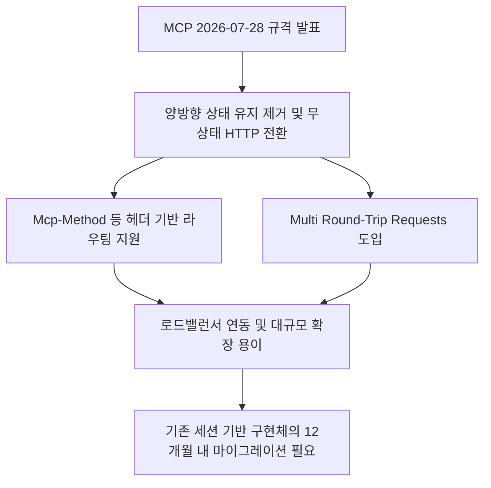
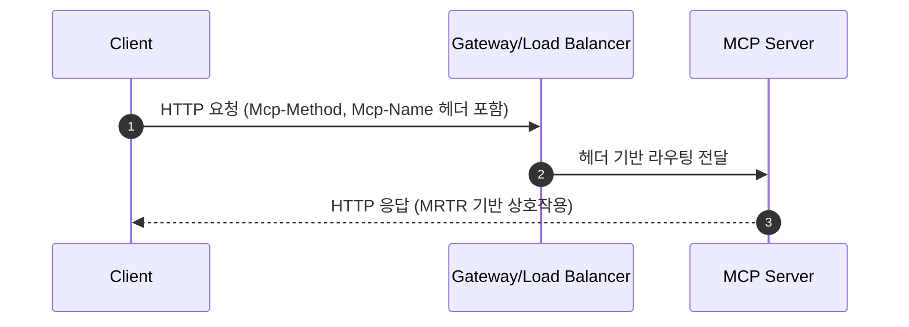
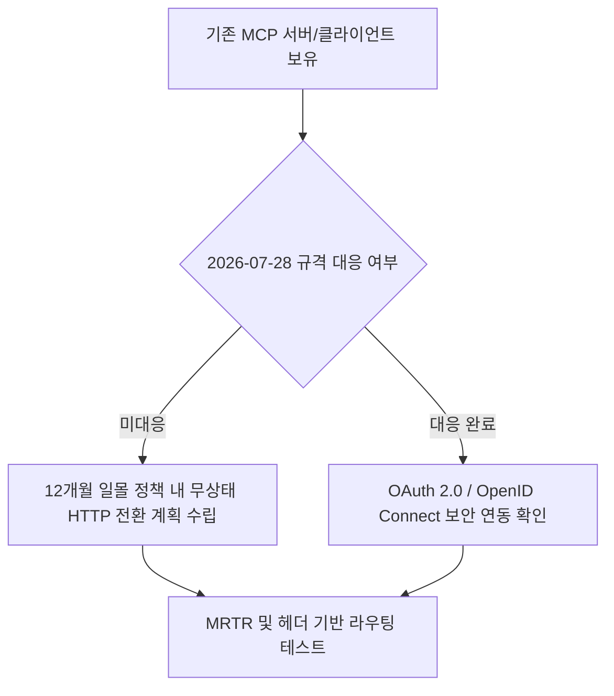

위 흐름도에서 보듯, Model Context Protocol은 기존의 지속적 연결 방식을 버리고 표준 웹 인프라에 맞춰 체질을 완전히 바꿨습니다. 이번 업데이트가 개발 현장과 실무진에게 무엇을 의미하는지 핵심 위주로 풀어드리겠습니다.

## 무슨 일이 벌어진 걸까?

Model Context Protocol 프로젝트는 2026년 7월 28일 공식 2026-07-28 사양 업데이트를 발표했습니다 <a href="#source-1" aria-label="Model Context Protocol Blog 출처">[1]</a>. 이번 개정의 핵심은 Model Context Protocol의 핵심 구조를 기존 양방향 상태 유지(Stateful) 프로토콜에서 무상태(Stateless) 요청 및 응답 프로토콜로 전환한 점입니다 <a href="#source-1" aria-label="Model Context Protocol Blog 출처">[1]</a>.

이전까지 MCP 서버와 클라이언트는 세션을 계속 유지하면서 연결 상태를 신경 써야 했습니다. 하지만 이번 2026-07-28 사양에서는 지속적인 연결 핸드셰이크와 프로토콜 수준의 세션 ID를 완전히 제거했습니다 <a href="#source-1" aria-label="Model Context Protocol Blog 출처">[1]</a>.

대신 메서드 이름과 툴 이름 같은 핵심 정보를 Mcp-Method나 Mcp-Name과 같은 전용 HTTP 헤더에 담아 전송하도록 변경되었습니다 <a href="#source-1" aria-label="Model Context Protocol Blog 출처">[1]</a>. 표준 게이트웨이나 로드밸런서가 패킷 내부를 복잡하게 뜯어보지 않고도 HTTP 헤더만 읽어서 적절한 서버로 요청을 전달할 수 있게 된 것입니다.

<figure class="news-source-image">
  
  <figcaption>Model Context Protocol Blog가 원문과 함께 공개한 이미지입니다. <a href="https://blog.modelcontextprotocol.io/posts/2026-07-28" target="_blank" rel="noopener noreferrer">출처: Model Context Protocol Blog</a></figcaption>
</figure>

## 왜 지금 다들 이 이야기를 할까?

Agentic AI Foundation과 Model Context Protocol 유지 관리자들은 엔터프라이즈 환경에서 AI 에이전트를 대규모로 확장할 때 발생하는 운영 병목을 해결하고자 이번 아키텍처 개편을 진행했습니다 <a href="#source-1" aria-label="Model Context Protocol Blog 출처">[1]</a>. 기존의 상태 유지 방식은 서버가 늘어나거나 쿠버네티스 클러스터 환경에서 트래픽을 분산할 때 세션 고정(Sticky Connection) 문제로 운영 복잡도가 매우 높았습니다.

위 시퀀스 다이어그램처럼, 새로운 요청-응답 방식에서는 클라이언트가 매 요청마다 전용 HTTP 헤더를 함께 전달합니다. 로드밸런서는 세션 연결을 유지할 필요 없이 즉시 최적의 노드로 트래픽을 분산합니다.

동시에 지속적인 세션 없이도 대화형 도구 호출이 가능하도록 Multi Round-Trip Requests(MRTR) 개념이 새로 도입되었습니다 <a href="#source-1" aria-label="Model Context Protocol Blog 출처">[1]</a>. 이를 통해 세션을 오래 열어두지 않고도 여러 번 주고받는 도구 연동 작업을 깔끔하게 처리할 수 있게 되었습니다 <a href="#source-4" aria-label="Microsoft .NET Blog 출처">[4]</a>.

<figure class="news-source-image">
  
  <figcaption>Model Context Protocol Blog가 원문과 함께 공개한 이미지입니다. <a href="https://blog.modelcontextprotocol.io/posts/2026-07-28" target="_blank" rel="noopener noreferrer">출처: Model Context Protocol Blog</a></figcaption>
</figure>

## 그래서 우리에게 뭐가 달라질까?

Model Context Protocol을 이용해 AI 서비스를 개발하거나 구축하는 엔지니어는 인프라 구성과 트래픽 관리 부담을 대폭 줄일 수 있습니다. 웹 API를 다루듯 표준 HTTP 로드밸런서와 API 게이트웨이를 그대로 활용해 Model Context Protocol 트래픽을 분산할 수 있기 때문입니다 <a href="#source-3" aria-label="AWS 출처">[3]</a>.

구체적인 변화를 정리해 보면 다음과 같습니다.

* 인프라 호환성 증대: Nginx, AWS ALBs, Envoy 등 기존 웹 게이트웨이에서 Mcp-Method 및 Mcp-Name 헤더 기반 라우팅 규칙을 바로 적용할 수 있습니다 <a href="#source-1" aria-label="Model Context Protocol Blog 출처">[1]</a>.
* 서버 자원 효율화: 상시 연결을 유지하기 위해 소모되던 서버 메모리와 커넥션 자원이 절약됩니다.
* 보안 체계 단일화: OAuth 2.0 및 OpenID Connect와 같은 표준 웹 인증 체계와 완벽하게 맞물려 보안 정책 적용이 단순해졌습니다 <a href="#source-3" aria-label="AWS 출처">[3]</a>.

개발자 입장에서는 세션 유실이나 재연결 로직에 공을 들이는 대신, 상호작용 로직 자체에 집중할 수 있는 환경이 갖춰진 셈입니다.

<figure class="news-source-image">
  
  <figcaption>AWS가 원문과 함께 공개한 이미지입니다. <a href="https://aws.amazon.com/blogs/machine-learning/how-agentcore-gateway-supports-the-mcp-2026-07-28-spec" target="_blank" rel="noopener noreferrer">출처: AWS</a></figcaption>
</figure>

## 직접 써보거나 지켜볼 포인트

Model Context Protocol 2026-07-28 사양 적용을 고려할 때 가장 먼저 체크해야 할 부분은 SDK 버전과 인증 연동 구조입니다. 주요 플랫폼과의 연동 및 개발 도구 지원도 빠르게 확장되고 있습니다.

위의 단계별 흐름도에 따라 개발팀은 자사의 시스템 환경을 검토하고 마이그레이션 순서를 잡아야 합니다.

* 공식 SDK 업데이트: Microsoft는 공식 MCP C# SDK v2.0 발표를 통해 새 2026-07-28 사양 및 MRTR 지원을 시작했습니다 <a href="#source-4" aria-label="Microsoft .NET Blog 출처">[4]</a>. C# 환경을 사용하는 팀이라면 SDK v2.0 적용을 즉시 검토할 수 있습니다.
* 클라우드 게이트웨이 연동: AWS는 AgentCore Gateway 서비스를 통해 MCP 2026-07-28 사양 지원을 안내했습니다 <a href="#source-3" aria-label="AWS 출처">[3]</a>. 클라우드 인프라 기반으로 에이전트를 배포할 때 라우팅 설정이 한층 간편해집니다.
* 공식 확장 프레임워크 활용: 규격에 새로 포함된 정식 확장(Extensions) 프레임워크와 OAuth 2.0 기반 자격 증명 흐름을 미리 테스트해 보는 것을 권장합니다 <a href="#source-1" aria-label="Model Context Protocol Blog 출처">[1]</a>.

## 아직은 선을 그어야 할 부분

Model Context Protocol의 개정 사양 도입 시 반드시 주의해야 할 조건은 기존 구현체와의 호환성 정리 기간입니다. 이번 2026-07-28 사양 발표에는 12개월 일몰(Deprecation) 정책이 함께 포함되어 있습니다 <a href="#source-1" aria-label="Model Context Protocol Blog 출처">[1]</a>.

즉 기존에 상태 유지(Stateful) 방식으로 만들어진 MCP 서버 및 클라이언트는 앞으로 12개월 동안은 유예 기간을 얻지만, 향후 무상태 HTTP 아키텍처로 반드시 마이그레이션해야 합니다.

또한 Multi Round-Trip Requests(MRTR)로 대화형 도구를 처리할 때 클라이언트 측에서 각 라운드트립 상태값을 요청 헤더나 메시지 페이로드에 올바르게 담아 전달해야 하므로, 기존 코드의 비동기 호출 부를 일부 수정해야 할 수 있습니다 <a href="#source-4" aria-label="Microsoft .NET Blog 출처">[4]</a>. 무작정 전환하기보다는 현재 운영 중인 에이전트 서비스의 네트워크 토폴로지와 보안 정책을 먼저 점검한 후 차근차근 진행하는 전략이 필요합니다.

## 무상태 전환을 배포 전에 어떻게 시험할까?

같은 요청을 네트워크 오류 뒤 다시 보내도 중복 부작용이 생기지 않는지 확인합니다. 읽기 질의와 파일 수정, 결제 같은 쓰기 작업은 재시도 정책이 달라야 하며, 요청 식별자와 도구 실행 결과를 서버 로그에서 연결할 수 있어야 합니다. 세션 메모리에 있던 사용자, 권한 정보를 어떤 서명된 헤더나 저장소에서 다시 읽는지도 검토합니다.

기존 클라이언트와 새 서버, 새 클라이언트와 기존 서버를 교차 시험하고 지원하지 않는 메서드가 명확한 오류를 반환하는지 봅니다. 사양 발표의 전환 기간보다 자신의 SDK와 배포 플랫폼 지원 상태를 우선해야 합니다.

<!-- primary-sources:start -->
## 원문과 버전 확인

- [발표 원문](https://blog.modelcontextprotocol.io/posts/2026-07-28)
- [VentureBeat](https://venturebeat.com/infrastructure/mcp-just-got-its-biggest-update-ever-heres-what-changes-for-ai-agents)
- [AWS](https://aws.amazon.com/blogs/machine-learning/how-agentcore-gateway-supports-the-mcp-2026-07-28-spec)
- [Microsoft .NET Blog](https://devblogs.microsoft.com/dotnet/announcing-v20-of-the-official-mcp-csharp-sdk)
<!-- primary-sources:end -->

<!-- internal-links:start -->
## 함께 읽으면 이해가 이어지는 글

- [A2A(Agent2Agent) 프로토콜: 서로 다른 AI 에이전트가 대화하고 협력하는 표준 규격]() — 구글이 시작하고 리눅스 재단이 주도하는 A2A 프로토콜은 독립된 인공지능 에이전트 간의 통신과 상호운용성을 위한 오픈 표준입니다. 특정 프레임워크나 플랫폼에 얽매이지 않고 에이전트들이 서로의 능력을 탐색하고 안전하게 작업을 위임하는…
- [Hermes Agent는 무엇을 기억하고 실행하나: 영구 메모리, 스킬, 권한 검증법]() — Hermes Agent의 세션 간 메모리, 스킬 생성, Gateway, 서브에이전트 구조를 살펴보고 오염된 기억, 권한, 비용, 복구를 검증하는 기준을 정리합니다.
- [OpenCut 아키텍처 가이드: AI가 영상을 편집하고 코드가 타임라인을 제어하는 방법]() — 비공개 상용 소프트웨어가 지배하던 영상 편집 시장에 등장한 완전히 새로운 대안, OpenCut 프로젝트를 조명합니다. 프라이버시를 보장하는 로컬 기반 아키텍처부터 시작해, Rust 코어 기반의 크로스플랫폼 통합, 플러그인 생태계…
<!-- internal-links:end -->

## 자주 묻는 질문

### Model Context Protocol 2026-07-28 사양 업데이트의 가장 큰 변화는 무엇인가요?

기존의 양방향 상태 유지(Stateful) 세션 연결을 없애고, 무상태(Stateless) HTTP 요청과 응답 아키텍처로 전면 개편되었습니다. 이를 통해 Mcp-Method 및 Mcp-Name 같은 HTTP 헤더 기반으로 일반 로드밸런서에서 트래픽을 분산시킬 수 있게 되었습니다.

### 기존의 상태 유지 방식 MCP 서버는 바로 사용할 수 없게 되나요?

아닙니다, 12개월의 일몰(Deprecation) 유예 기간이 적용되어 기존 방식을 한동안 유지할 수 있습니다. 하지만 향후 표준 호환성을 위해 12개월 내에 무상태 HTTP 아키텍처로 마이그레이션해야 합니다.

### 세션 연결이 사라지면 다중 라운드트립 도구 상호작용은 어떻게 처리하나요?

새로 도입된 Multi Round-Trip Requests(MRTR) 사양을 통해 지속적인 세션 없이도 여러 단계의 도구 상호작용을 처리합니다. 클라이언트와 서버가 요청 헤더와 메시지를 주고받으며 세션 고정 없이도 동작하게 됩니다.

### 이번 MCP 업데이트에서 인증 및 보안 표준은 어떻게 변경되었나요?

OAuth 2.0 및 OpenID Connect 보안 표준과 연동할 수 있도록 보안 규격이 정렬되었습니다. 이를 통해 기존 엔터프라이즈 Web API 보안 체계를 MCP 인프라에 그대로 적용할 수 있습니다.

## 직접 확인한 원문

<ol class="checked-source-list">
  <li id="source-1"><a href="https://blog.modelcontextprotocol.io/posts/2026-07-28" target="_blank" rel="noopener noreferrer">Model Context Protocol Blog — The 2026-07-28 Specification | Model Context Protocol Blog</a> (2026-07-28)</li>
  <li id="source-2"><a href="https://venturebeat.com/infrastructure/mcp-just-got-its-biggest-update-ever-heres-what-changes-for-ai-agents" target="_blank" rel="noopener noreferrer">VentureBeat — MCP just got its biggest update ever — here&#x27;s what changes for AI agents</a> (2026-07-28)</li>
  <li id="source-3"><a href="https://aws.amazon.com/blogs/machine-learning/how-agentcore-gateway-supports-the-mcp-2026-07-28-spec" target="_blank" rel="noopener noreferrer">AWS — How AgentCore Gateway supports the MCP 2026-07-28 spec</a> (2026-07-28)</li>
  <li id="source-4"><a href="https://devblogs.microsoft.com/dotnet/announcing-v20-of-the-official-mcp-csharp-sdk" target="_blank" rel="noopener noreferrer">Microsoft .NET Blog — Announcing v2.0 of the official MCP C# SDK</a> (2026-07-28)</li>
</ol>

> 이 글은 위 원문을 직접 확인해 작성했습니다. 가격, 기능 범위, 지역별 제공 여부는 게시 후 바뀔 수 있으니 실제 도입 전 공식 문서를 다시 확인하세요.
