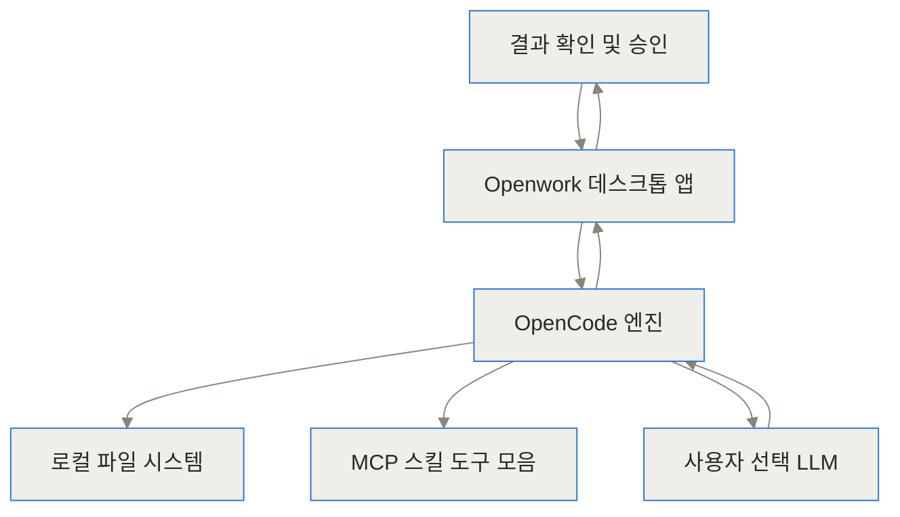
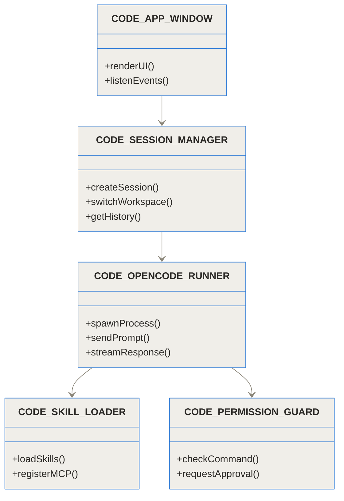
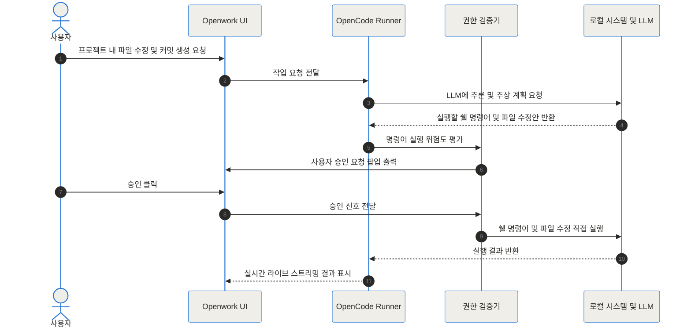
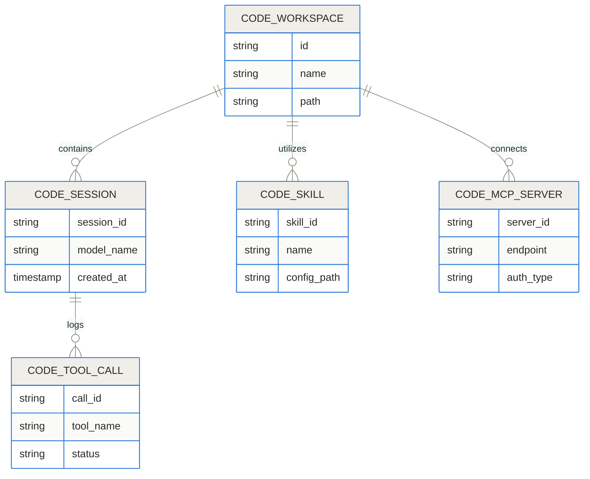
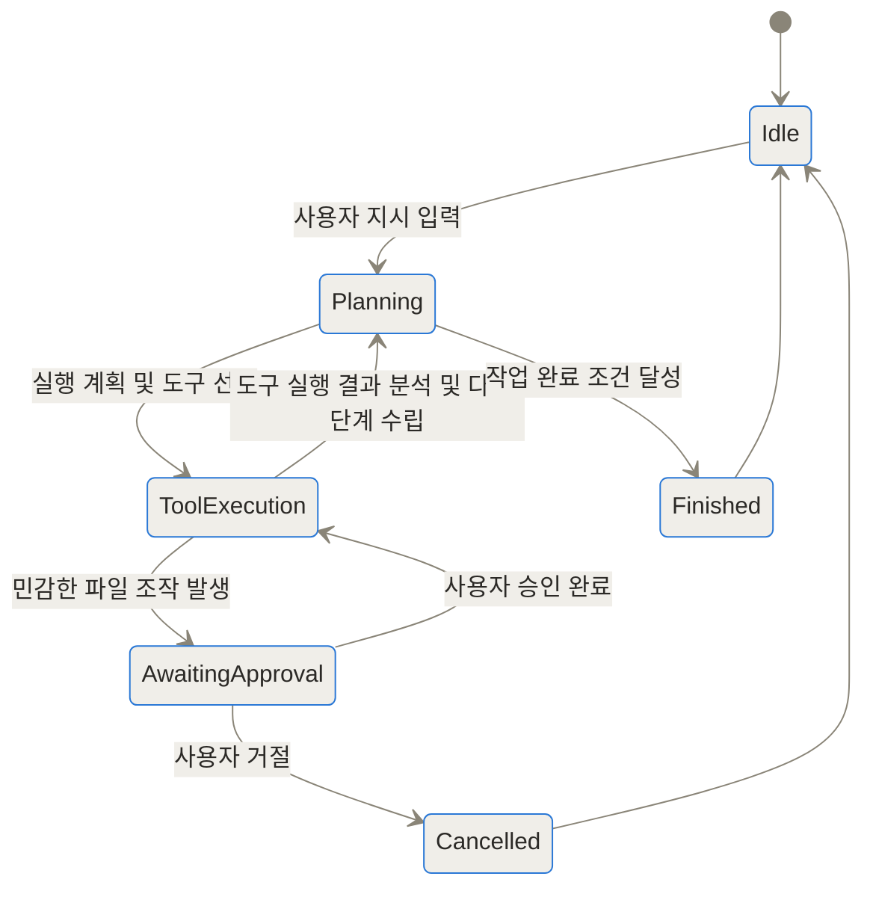
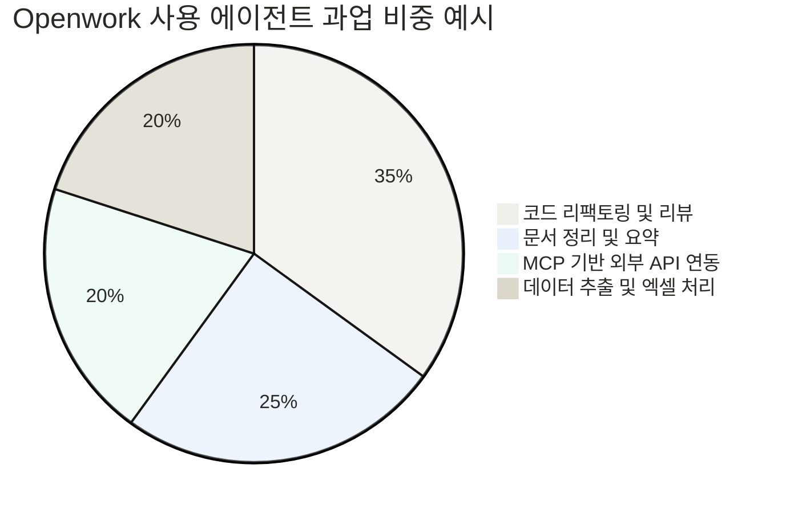

Openwork는 데스크톱 앱에서 로컬 파일, 선택한 언어 모델, MCP 도구와 공유 스킬을 연결하려는 오픈소스 작업 환경입니다. 로컬 우선이라는 이름만으로 모든 모델 호출과 텔레메트리가 기기 안에 머무는 것은 아니므로 공급자별 전송 경로를 확인해야 합니다. 별도 테스트 폴더에서 읽기·쓰기 권한, 링크로 공유되는 설정 범위, 중단 후 복구를 검증한 뒤 업무 파일을 연결하세요.

## Openwork가 필요한 업무 경계는 어디인가

- [Openwork GitHub 저장소](https://github.com/different-ai/openwork)
- [Openwork 공식 웹사이트](https://openwork.software)
- [OpenCode 저장소](https://github.com/different-ai/opencode)

## 도입과 세 줄 요약

TL;DR (한 줄 요약)
1. Openwork는 앤트로픽의 독점 데스크톱 서비스인 클로드 코워크(Claude Cowork)를 대체하는 오픈소스 데스크톱 애플리케이션이에요.
2. 타우리(Tauri)와 오픈코드(OpenCode) 엔진을 기반으로 구축되어, 내 컴퓨터의 파일 시스템 접근 권한과 50개 이상의 다양한 LLM 연동을 자유롭게 제어할 수 있어요.
3. 팀원 간 스킬(Skill)과 MCP(Model Context Protocol) 도구 세트를 단 하나의 링크로 공유하며, 데이터 유출 걱정 없이 로컬 환경에서 안전하게 작업을 자동화해요.

작업을 하다 보면 매번 복잡한 파일 구조를 일일이 AI 웹 채팅창에 복사해 붙여넣거나, 파일 접근 권한 문제로 답답함을 느낄 때가 많죠. 클로드 코워크와 같은 데스크톱 AI 조수 서비스가 등장하면서 컴퓨터 내 파일 조작과 작업 수행이 대폭 편리해졌지만, 특정 AI 모델에 고정되거나 높은 이용료, 데이터 프라이버시 문제라는 장벽이 존재했어요. Openwork는 바로 이러한 한계를 극복하고 사용자가 자신의 데이터와 AI 모델을 완전히 제어할 수 있도록 탄생한 오픈소스 플랫폼이에요.

## 기존 데스크톱 AI 조수 서비스가 가진 문제점과 배경

최근 데스크톱 환경에서 작동하는 AI 에이전트는 사용자의 파일 시스템에 직접 접근해 문서 작성, 코드 수정, 데이터 분석 등을 대신 처리해 주는 방향으로 발전하고 있어요. 하지만 기존 독점형 서비스인 클로드 코워크 등은 몇 가지 심각한 불편함을 안고 있었죠.

첫째, 모델 선택의 자유가 없다는 점이에요. 특정 AI 제공자의 모델만 사용해야 해서, 특정 과업에 더 뛰어난 다른 LLM이나 로컬에서 동작하는 오픈소스 모델(예: 올라마, 딥시크 등)을 붙여 사용할 수 없었어요.

둘째, 데이터 프라이버시와 보안 우려예요. 모든 작업 내역과 파일 정보가 외부 클라우드로 송수신되며, 기업 내 민감한 소스 코드나 고객 데이터를 다룰 때 보안 규정에 위배될 위험이 매우 컸어요.

셋째, 고정된 비용 구조와 토큰 비효율성이에요. 구독 요금에 더해 과도한 API 토큰 비용이 발생하고, 사용자가 이미 가지고 있는 자신만의 API 키(BYOK: Bring Your Own Key)를 활용하기 어려웠죠.

표 1. 독점 데스크톱 AI 서비스 vs 오픈소스 Openwork 주요 특징 비교

| 구분 | 기존 독점 서비스 (예: Claude Cowork) | Openwork (오픈소스) |
| --- | --- | --- |
| 소스 코드 공개 | 비공개 (독점 소프트웨어) | 100% 오픈소스 (GitHub) |
| 지원 모델 | 단일 제공자 모델 한정 | 50개 이상의 LLM 지원 (OpenAI, Anthropic, Google, Local LLM) |
| 실행 위치 | 클라우드 종속 실행 | 로컬 우선(Local-first) 및 원격 서버 지원 |
| 데이터 보안 | 외부 클라우드 전송 필요 | 내 컴퓨터에서 파일 직접 처리 (로컬 유지) |
| 확장성 | 제한된 플러그인 생태계 | MCP(Model Context Protocol), 스킬 패키지, 오픈코드 플러그인 완전 지원 |
| 요금 체계 | 중앙 집계형 구독료 + API 토큰 비용 | 무료 앱 (자신의 API 키 직접 사용 - BYOK) |

```chartjs
{"type":"bar","data":{"labels":["지원 모델 수","지원 운영체제 수","팀 공유 편의성 점수"],"datasets":[{"label":"독점 데스크톱 AI","data":[1,1,30]},{"label":"Openwork","data":[50,3,95]}]}}
```

## Openwork란 무엇인가: 누구나 쉽게 이해하는 기본 개념

Openwork를 한 마디로 표현하자면, '내 컴퓨터 안에 서주하면서 내 지시에 따라 일하는 오픈소스 능동형 동료'라고 할 수 있어요.

이해를 돕기 위해 일상적인 비유를 들어볼게요. 기존의 AI 채팅 서비스가 '전화로만 대화할 수 있는 외주 자문위원'이었다면, Openwork는 '내 책상 바로 옆에 앉아 내 문서함과 프로그램을 직접 열어보며 함께 작업하는 인턴 사원'과 같아요.

내가 "다운로드 폴더에 있는 이번 달 매출 보고서 엑셀 파일을 정리해서 요약 문서를 만들어줘"라고 지시하면, 인턴 사원(Openwork)은 내 승인 하에 직접 파일 폴더를 열고 내용을 읽어 정리해 줍니다. Openwork는 이러한 과정을 로컬 환경에서 수행하므로 내 파일이 외부 서버로 전달되지 않아 안전하죠.



## 내부 동작 원리 (Under the Hood): 구조와 핵심 엔진 파헤치기

Openwork가 어떻게 작동하는지 내부 아키텍처와 구체적인 요청 처리 과정을 살펴볼게요.

### 1. Tauri 기반 데스크톱 및 OpenCode 엔진 통합

Openwork의 프론트엔드는 경량화된 타우리(Tauri) 및 타입스크립트(TypeScript) 기반으로 제작되었어요. 일렉트론(Electron)에 비해 메모리 점유율이 매우 낮아 데스크톱 환경에서 가볍고 빠르게 동작하죠.

그 내부에서는 오픈코드(OpenCode)라는 에이전트 실행 엔진이 작동합니다. 오픈코드는 에이전트가 목표를 달성하기 위해 스스로 계획을 수립하고, 필요한 도구를 호출하며, 코드를 실행할 수 있게 해주는 기반 프레임워크예요.



### 2. 세션 처리 및 권한 제어 파이프라인

사용자가 에이전트에 지시를 내리면, Openwork는 위험한 명령어나 시스템 파일 수정을 함부로 실행하지 않도록 중간 권한 제어 레이어를 거칩니다.



### 3. 데이터 모델 및 워크스페이스 관리

Openwork는 워크스페이스(Workspace) 단위로 환경을 분리해요. 프로젝트별로 독립된 스킬, MCP 서버, 에이전트 설정 및 대화 기록을 관리할 수 있죠.



### 4. 에이전트 상태 전이 모델

에이전트가 작업을 수행할 때 거치는 상태 생명주기는 다음과 같습니다.



## 어떻게 설치하고 활용하나: 실전 설치 및 설정 가이드

Openwork는 기술자가 아닌 사용자도 손쉽게 설치할 수 있도록 데스크톱 앱 설치 파일을 제공하며, 파워 유저를 위한 CLI 환경도 함께 지원해요.

### 1. 데스크톱 앱 설치 및 초기 설정

1. 저장소 또는 공식 웹사이트에서 자신의 OS(macOS, Windows, Linux)에 맞는 설치 파일을 다운로드합니다.
2. 앱을 실행한 뒤, 작업 대상이 될 로컬 폴더(Workspace)를 선택해요.
3. 설정(Settings) 메뉴로 이동하여 사용할 LLM 제공자의 API 키를 등록합니다 (예: Anthropic API Key, OpenAI API Key 또는 Ollama 로컬 URL).

### 2. 스킬 및 MCP 도구 연동 예시

Openwork는 MCP(Model Context Protocol) 표준을 완전 지원하므로 깃허브(GitHub), 노션(Notion), 허브스팟(HubSpot) 등 외부 서비스 도구를 손쉽게 연동할 수 있어요.

다음은 Openwork 스킬 구성 파일 예시입니다.

```json
{
  "name": "notion-integration-skill",
  "version": "1.0.0",
  "description": "노션 문서와 작업 내역을 에이전트가 읽고 쓸 수 있게 연결하는 스킬 패키지",
  "mcpServers": {
    "notion": {
      "command": "npx",
      "args": ["-y", "@modelcontextprotocol/server-notion"],
      "env": {
        "NOTION_API_TOKEN": "secret_your_notion_api_key_here"
      }
    }
  }
}
```

팀원은 단 하나의 공유 링크(예: `openwork://import?package=team-sdr-tools`)를 클릭하는 것만으로 위와 같은 스킬과 MCP 서버 설정을 한 번에 불러올 수 있습니다.




## 실전 활용 시나리오: 현업 적용 사례

Openwork가 실제 현업에서 어떻게 유용하게 활용되는지 대표적인 시나리오 3가지를 정리해 볼게요.

### 시나리오 1: 로컬 프로젝트 문서 및 코드 통합 감사

개발자가 대규모 코드베이스에 보안 정책 업데이트를 적용해야 하는 상황을 생각해보세요.

1. 사용자는 Openwork 앱을 켜고 코드 저장소 폴더를 워크스페이스로 지정합니다.
2. "프로젝트 전체에서 비인가 패키지 사용 여부를 조사하고, 보안 취약점 목록을 마크다운 문서로 작성해줘"라고 지시합니다.
3. Openwork 내부의 OpenCode 엔진이 로컬 파일을 병렬 분석하여 취약한 코드 파일 목록을 찾아내고, 수정 제안 문서(`SECURITY_AUDIT.md`)를 작성합니다.
4. 사용자는 파일 변경 사항을 확인하고 한 번의 승인으로 저장소에 적용합니다.

### 시나리오 2: 노션 및 CRM 연동을 통한 영업 브리핑 자동화

영업팀 직원이 고객 미팅을 앞두고 사전 브리핑 자료를 만들어야 할 때입니다.

1. Openwork에 연동된 HubSpot MCP와 Notion MCP를 활용합니다.
2. "내일 Acme Corp와의 미팅에 대비해 HubSpot의 거래 내역과 Notion의 최근 회의록을 종합해서 브리핑 노트를 만들어줘"라고 입력합니다.
3. 에이전트가 외부 API를 안전하게 호출하여 두 플랫폼의 데이터를 수집하고, 논의 항목을 정리하여 데스크톱 바탕화면에 요약 문서를 생성해 줍니다.

### 시나리오 3: 팀 차원의 에이전트 워크플로우 원클릭 배포

IT 관리자가 기획 및 회계 담당자에게 AI 자동화 도구를 전달할 때의 사례입니다.

1. IT 관리자는 회사 표준 프롬프트 규칙, 파일 정리 규칙, MCP 도구가 포함된 Openwork 패키지를 생성합니다.
2. 생성된 링크를 기획자에게 전달하면, 기획자는 Openwork 앱에서 버튼 하나만 눌러 IT 팀이 만든 에이전트 능력을 그대로 부여받아 업무에 즉시 활용합니다.

## 다른 도구와 무엇이 다른가: 상세 비교 및 벤치마크

기존의 독점 서비스 및 타 오픈소스 에이전트들과 비교했을 때 Openwork가 가지는 차별점과 장단점은 다음과 같아요.

표 2. 주요 에이전트 플랫폼 기능 비교

| 비교 항목 | Openwork | Claude Cowork | Manus | Cursor / Claude Code |
| --- | --- | --- | --- | --- |
| 주 타겟층 | 비기술자 및 개발자 모두 | 일반 지식 노동자 | 자동화 탐색자 | 전문 소프트웨어 개발자 |
| 인터페이스 | 데스크톱 GUI (Tauri) | 데스크톱 GUI | 웹 샌드박스 | IDE / 터미널 CLI |
| LLM 지원 범위 | 50개 이상 (BYOK 및 로컬) | Anthropic 전용 | 자사 멀티 에이전트 | Anthropic/OpenAI 위주 |
| 실행 방식 | 로컬 실행 / 원격 연결 선택 | 클라우드 실행 | 클라우드 샌드박스 | 로컬 실행 |
| 스킬/MCP 공유 | 원클릭 링크 공유 가능 | 제한적 | 자체 생태계 | 도커/설정파일 복사 |
| 가격 정책 | 오픈소스 (무료) | 구독료 + API 비용 | 구독제 | 구독료 + 사용량 |

```chartjs
{"type":"bar","data":{"labels":["Openwork","Claude Cowork","Manus","Cursor"],"datasets":[{"label":"LLM 유연성 점수","data":[95,20,40,75]},{"label":"데이터 프라이버시 점수","data":[90,30,20,80]}]}}
```

## 솔직한 평가: 한계와 주의해야 할 점

Openwork가 독점 서비스에 대한 훌륭한 오픈소스 대안이기는 하지만, 사용 전에 반드시 인지해야 할 한계점과 트레이드오프가 존재해요.

첫째, 보안 및 권한 관리의 책임이 사용자에게 있다는 점이에요. Openwork는 로컬 쉘 명령을 실행하고 파일을 직접 수정할 수 있으므로, 검증되지 않은 위험한 프롬프트나 스킬을 무심코 실행할 경우 로컬 시스템에 영향을 줄 수 있어요. 따라서 권한 승인 팝업을 꼼꼼히 확인하는 습관이 필수적이에요.

둘째, 초기 세팅 시 API 키 관리가 필요하다는 점입니다. 모든 상용 서비스를 완제품 형태로 제공받는 독점 서비스에 비해, 사용자가 직접 OpenAI나 Anthropic 등의 API 키를 발행받아 등록해야 하므로 컴퓨터에 친숙하지 않은 초보자에게는 첫 진입 장벽이 될 수 있어요.

셋째, 커뮤니티 개발 속도에 따른 안정성 변동입니다. 빠른 업데이트 과정에서 버전별 버그가 존재할 수 있으며, 최신 라이선스 변경 이슈 및 오픈소스 모듈 통합 상태를 지속적으로 모니터링할 필요가 있습니다.

## 마무리하며

Openwork는 AI 에이전트가 단순히 대화창에 갇혀 있는 형태를 넘어, 내 데스크톱 환경에서 파일과 도구를 안전하게 제어하는 주체로 진화하는 대표적인 도구예요.

특정 빅테크 기업에 갇히지 않고 내가 원하는 LLM을 마음대로 고르고, 내 데이터의 주권을 지키면서, 팀원들과 손쉽게 AI 작업 스킬을 공유하고 싶다면 Openwork는 매우 매력적인 선택지가 될 것입니다.

<!-- primary-sources:start -->
## 원문과 버전 확인

- [공식 GitHub 저장소](https://github.com/different-ai/openwork)
<!-- primary-sources:end -->

<!-- internal-links:start -->
## 함께 읽으면 이해가 이어지는 글

- [AstrBot: 단일 코드베이스로 모든 메신저에 똑똑한 AI 에이전트를 배포하는 방법]() — 파편화된 메신저 플랫폼과 다수의 대형 언어 모델(LLM)을 하나로 통합하여, 샌드박스 기반의 안전한 코드 실행과 웹 시각화 도구를 제공하는 오픈소스 에이전트 프레임워크 AstrBot의 내부 아키텍처와 활용법을 깊이 있게 분석합니다.
- [LiveKit Agents: 초저지연 실시간 음성 AI 에이전트를 위한 오픈소스 프레임워크]() — LiveKit Agents는 WebRTC 기반의 초저지연 오디오 스트리밍을 활용해 실시간 대화형 음성 AI를 개발할 수 있는 오픈소스 프레임워크입니다. STT-LLM-TTS 조합 파이프라인부터 OpenAI Realtime API 같은…
- [Model Context Protocol 2026-07-28 규격 발표, 무상태 HTTP 구조 변경과 영향 정리]() — Model Context Protocol 프로젝트가 2026년 7월 28일 정식 사양 업데이트를 발표했습니다. 이번 개정으로 지속적인 세션 연결과 프로토콜 수준의 핸드셰이크가 제거되고, 헤더 기반 라우팅이 가능한…
<!-- internal-links:end -->

## 자주 묻는 질문 (FAQ)

### Openwork는 완전히 무료로 사용할 수 있나요?

네, Openwork 데스크톱 애플리케이션 자체는 100% 오픈소스이며 무료로 다운로드하여 사용할 수 있어요. 다만 연동하여 사용하는 외부 LLM(OpenAI, Anthropic 등)의 API 이용료는 사용자 본인의 API 키 사용량에 따라 각 AI 제공업체에 직접 지불하는 방식이에요. 로컬 LLM(Ollama 등)을 사용하는 경우에는 비용이 전혀 발생하지 않아요.

### 내 컴퓨터의 민감한 파일이 외부 클라우드로 유출될 위험은 없나요?

Openwork는 기본적으로 로컬 우선(Local-first) 아키텍처로 작동하기 때문에 파일 시스템 탐색과 작업 수행이 내 컴퓨터 내부에서 이루어져요. AI 모델 추론을 위해 전달되는 프롬프트와 컨텍스트만 사용자가 지정한 API 엔드포인트로 전송되며, 로컬 LLM을 연동할 경우 인터넷 연결 없이도 완전한 격리 환경에서 작업을 수행할 수 있어요.

### Claude Cowork와 대비했을 때 Openwork만의 결정적인 차별점은 무엇인가요?

가장 큰 차이는 오픈소스 및 멀티 모델 지원 여부에 있어요. Claude Cowork는 Anthropic의 특정 모델 및 클라우드 서비스에 종속되어 있지만, Openwork는 Anthropic뿐만 아니라 OpenAI, Google, Ollama 등 50개 이상의 다양한 LLM을 자유롭게 교체하여 사용할 수 있어요. 또한 팀원 간에 스킬과 MCP 설정을 단 하나의 링크로 패키징하여 손쉽게 배포할 수 있는 통합 생태계를 제공해요.

### 개발자가 아닌 비기술 직군 사용자도 쉽게 활용할 수 있나요?

네, Openwork는 복잡한 터미널 명령어 입력 없이도 사용 가능한 깔끔한 데스크톱 사용자 인터페이스(GUI)를 제공해요. 팀 내 엔지니어가 작성하거나 커뮤니티에서 공유된 스킬 패키지 링크를 클릭하면 자동으로 앱 내에 연동 도구가 설치되므로, 일반 사무직이나 기획자도 직관적으로 에이전트 자동화를 이용할 수 있어요.

### MCP(Model Context Protocol)를 지원하지 않는 외부 서비스도 연결할 수 있나요?

MCP 표준을 지원하는 서버 외에도, OpenCode 엔진 기반의 커스텀 오픈소스 플러그인이나 커스텀 쉘 스크립트를 작성하여 스킬 형태로 등록할 수 있어요. 이를 통해 내부 REST API나 로컬 데이터베이스 등 원하는 어떤 도구든 에이전트와 연동할 수 있는 높은 확장성을 제공해요.


## References
- [https://github.com/different-ai/openwork](https://github.com/different-ai/openwork)
- [https://openwork.software](https://openwork.software)
- [https://github.com/different-ai/opencode](https://github.com/different-ai/opencode)
