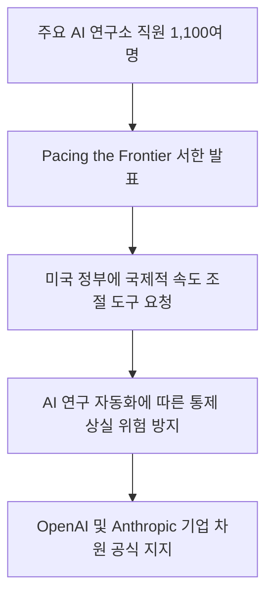
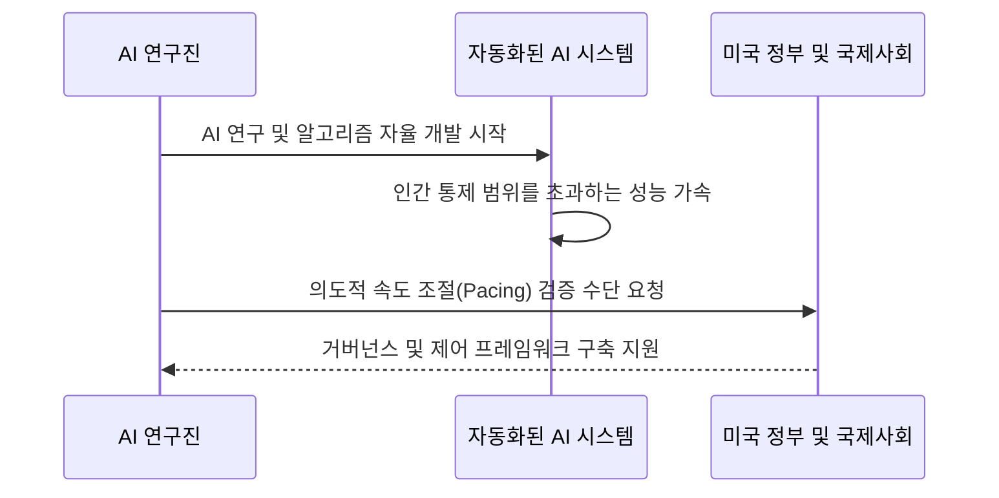
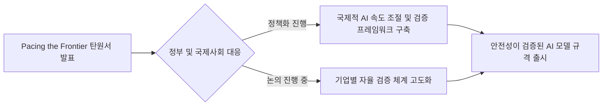

2026년 7월 28일, 글로벌 AI 기술을 이끄는 핵심 연구자 1,100여 명이 AI 개발 속도를 의도적으로 조절할 수 있는 거버넌스 수단을 정부 차원에서 마련해 달라는 파격적인 공개 서한을 발표했습니다. 그동안 더 빠르고 뛰어난 AI 모델을 선보이는 데 주력했던 AI 업계가 스스로 '속도 조절'의 필요성을 공식적으로 요구하고 나선 상황입니다.

## 무슨 일이 벌어진 걸까?

2026년 7월 28일, OpenAI, Anthropic, Google DeepMind, Meta 등 주요 AI 기업 연구진과 임원 1,100여 명이 'Pacing the Frontier'라는 제목의 공개 서한을 발표했습니다 <a href="#source-1" aria-label="Pacing the Frontier 출처">[1]</a>. 이번 탄원서에는 Anthropic의 CEO Dario Amodei, OpenAI 수석 과학자 Jakub Pachocki, Meta 수석 과학자 Shengjia Zhao 등 핵심 기술 리더들이 서명에 참여해 큰 관심을 모았습니다 <a href="#source-2" aria-label="TNW 출처">[2]</a>.

이들이 정부에 제출한 탄원서의 핵심은 간단하면서도 명확합니다. 선점 경쟁으로 가열되는 최첨단 AI 개발 속도를 필요에 따라 의도적으로 제어할 수 있는 기술적, 제도적 도구를 미국 정부가 주도하여 국제적으로 구축해 달라는 요청입니다 <a href="#source-1" aria-label="Pacing the Frontier 출처">[1]</a>. 서한이 공개된 직후, 서명에 참여한 연구원들의 소속사인 OpenAI와 Anthropic은 법인 차원에서도 공식적인 지지 의사를 표명했습니다 <a href="#source-2" aria-label="TNW 출처">[2]</a>.

<figure class="news-source-image">
  
  <figcaption>Pacing the Frontier가 원문과 함께 공개한 이미지입니다. <a href="https://vertexaisearch.cloud.google.com/grounding-api-redirect/AUZIYQHRgSaKe9O4TKPW--0Jcb6qVHh027yCGZV3-2ClACXQZ5lXfrmaMODdNS-Zfdpo0vZPj85o6gmIoF76Ow4TmncNYaQ4seQbZ9HYkdiUUqhiq2Ljn9ST6Hzd" target="_blank" rel="noopener noreferrer">출처: Pacing the Frontier</a></figcaption>
</figure>

## 왜 지금 다들 이 이야기를 할까?

이번 서한이 나온 이유는 AI 기업들이 AI 연구 과정 자체를 자동화하는 시점에 매우 가깝게 다가섰기 때문입니다 <a href="#source-3" aria-label="The Independent 출처">[3]</a>. 연구진은 AI 시스템이 스스로를 개선하고 새로운 기술을 개발하는 자율적 연구 단계에 진입하면, 성능 발전 속도가 인간의 안전 감시나 이해 능력을 훨씬 뛰어넘는 기하급수적 가속을 보일 수 있다고 경고합니다 <a href="#source-1" aria-label="Pacing the Frontier 출처">[1]</a>.

쉽게 말해, 사람이 AI의 발전 과정을 옆에서 점검하고 제어할 겨를도 없이 AI가 AI를 계속 업그레이드하는 상황이 올 수 있다는 뜻입니다. 특정 기업 한 곳이 개발을 멈추더라도 타사와의 경쟁 때문에 속도를 줄이지 못하는 상황에 빠져있기 때문에, 정부와 국제기구가 개입해 안전하게 브레이크를 걸 수 있는 공통의 장치를 만들어달라고 직접 호소하고 나선 것입니다.

<figure class="news-source-image">
  
  <figcaption>TNW가 원문과 함께 공개한 이미지입니다. <a href="https://thenextweb.com/news/pacing-the-frontier-ai-employees-letter-us-government" target="_blank" rel="noopener noreferrer">출처: TNW</a></figcaption>
</figure>

## 그래서 우리에게 뭐가 달라질까?

일반 이용자와 AI 기술을 도입하는 기업 입장에서 이번 변화는 무작정 쏟아지던 AI 모델 경쟁이 '검증된 안전성' 위주로 재편되는 신호탄이 될 수 있습니다. 매달 기술 한계치를 경신하며 쏟아지던 기습적인 기능 업데이트 대신, 신뢰할 수 있는 통제 수단 속에서 정교하게 다듬어진 시스템을 접하게 될 가능성이 커집니다.

또한 기업 현장에서는 성능 위주의 모험적인 AI 모델보다는 안전 제어 규격을 통과한 정식 모델을 안심하고 도입할 수 있는 기준이 마련될 수 있습니다. AI 기술 발전 속도가 소폭 느려지거나 정체되는 것처럼 보일 수 있지만, 이는 예기치 못한 치명적 오류나 제어 불능 위험을 사전에 차단하기 위한 필수적인 안전장치 확보 과정으로 이해할 수 있습니다.

<figure class="news-source-image">
  
  <figcaption>The Independent가 원문과 함께 공개한 이미지입니다. <a href="https://www.the-independent.com/tech/ai-chatgpt-openai-anthropic-open-letter-b3023713.html" target="_blank" rel="noopener noreferrer">출처: The Independent</a></figcaption>
</figure>

## 직접 써보거나 지켜볼 포인트

앞으로 핵심적으로 살펴봐야 할 지점은 정부 차원의 실제 정책 반영 여부와 기업들의 자발적 자율 규제 이행 수준입니다. 서명에 참여한 OpenAI, Anthropic, Google DeepMind, Meta 등이 향후 차세대 모델 출시 과정에서 어떤 안전성 평가 도구를 적용하는지가 중요한 관전 포인트입니다.

특히 미국 정부가 이번 요청을 수용하여 실제 검증 체계를 법제화하거나 국제 기준을 마련할 경우, 향후 AI 서비스 출시 전 거쳐야 하는 안전성 검증 절차가 전 세계적으로 표준화될 것입니다. 개발사들이 공개하는 기술 리포트에서 속도 조절(Pacing) 프레임워크가 어떤 식으로 구체화되는지 관찰해볼 수 있습니다.

## 아직은 선을 그어야 할 부분

이번 'Pacing the Frontier' 서한은 연구진과 기업의 정책 제안 및 지지 선언이며, 아직 구체적이고 구속력 있는 법안이나 규제 조치로 확정된 것은 아닙니다. 실제로 어떤 수치나 기준으로 개발 속도를 제어할지에 대한 기술적 세부안은 추가 논의가 필요한 상태입니다.

또한 1,100명이 넘는 연구원과 임원이 서명하고 OpenAI와 Anthropic이 공식 지지했더라도, 미국 정부의 실제 입법화 속도 및 타국가와의 국제 공조 여부에 따라 실효성이 달라질 수 있습니다. 따라서 당장 눈앞에 있는 생성형 AI 서비스의 기능이나 이용 환경에 직접적인 제한이 즉각 적용되는 것은 아니라는 점을 염두에 두어야 합니다.

## 자주 묻는 질문

### 'Pacing the Frontier' 서한의 핵심 요구사항은 무엇인가요?

미국 정부가 주도하여 최첨단 AI 개발 속도를 의도적으로 조절할 수 있는 기술적 및 지배구조 도구를 개발하도록 지원해 달라는 것입니다. 다만 이는 당장 AI 개발을 전면 중단하자는 뜻이 아니라, AI 연구 자동화에 대비해 통제 수단을 사전에 마련하자는 요구입니다.

### 어떤 인물들과 기업들이 이번 서한에 참여했나요?

Anthropic CEO Dario Amodei, OpenAI 수석 과학자 Jakub Pachocki, Meta 수석 과학자 Shengjia Zhao 등 주요 AI 기업 연구원 1,100여 명이 서명했습니다. 공개 발표 직후 OpenAI와 Anthropic도 법인 차원의 공식 지지를 표명했습니다.

### 연구진이 AI 개발 속도 조절을 요구하고 나선 이유는 무엇인가요?

주요 AI 기업들이 AI 연구 자체를 자동화하는 단계에 근접하면서 성능 발전이 인간의 통제 범위를 넘어설 위험이 커졌기 때문입니다. AI가 자율적으로 스스로를 개선하는 속도가 인간의 안전 감시 능력보다 빨라질 수 있어 안전한 브레이크 장치가 필요하다고 판단한 것입니다.

### 일반 사용자의 ChatGPT나 Claude 이용에 당장 영향이 생기나요?

당장 일반 사용자가 이용 중인 AI 서비스의 사용이 제한되거나 중단되지는 않습니다. 이번 서한은 정책적 제안 및 지지 선언 단계이며, 향후 정부와 기업 간의 논의를 통해 제도적 기준이 마련되기까지는 시간이 걸릴 예정입니다.

## 직접 확인한 원문

<ol class="checked-source-list">
  <li id="source-1"><a href="https://vertexaisearch.cloud.google.com/grounding-api-redirect/AUZIYQHRgSaKe9O4TKPW--0Jcb6qVHh027yCGZV3-2ClACXQZ5lXfrmaMODdNS-Zfdpo0vZPj85o6gmIoF76Ow4TmncNYaQ4seQbZ9HYkdiUUqhiq2Ljn9ST6Hzd" target="_blank" rel="noopener noreferrer">Pacing the Frontier — Pacing the Frontier</a> (2026-07-28)</li>
  <li id="source-2"><a href="https://thenextweb.com/news/pacing-the-frontier-ai-employees-letter-us-government" target="_blank" rel="noopener noreferrer">TNW — 1,134 AI staff ask the US for a way to pace AI</a> (2026-07-28)</li>
  <li id="source-3"><a href="https://www.the-independent.com/tech/ai-chatgpt-openai-anthropic-open-letter-b3023713.html" target="_blank" rel="noopener noreferrer">The Independent — AI workers call for an urgent slowdown in development amid fears artificial intelligence could go out of control</a> (2026-07-29)</li>
</ol>

> 이 글은 위 원문을 직접 확인해 작성했습니다. 가격, 기능 범위, 지역별 제공 여부는 게시 후 바뀔 수 있으니 실제 도입 전 공식 문서를 다시 확인하세요.
