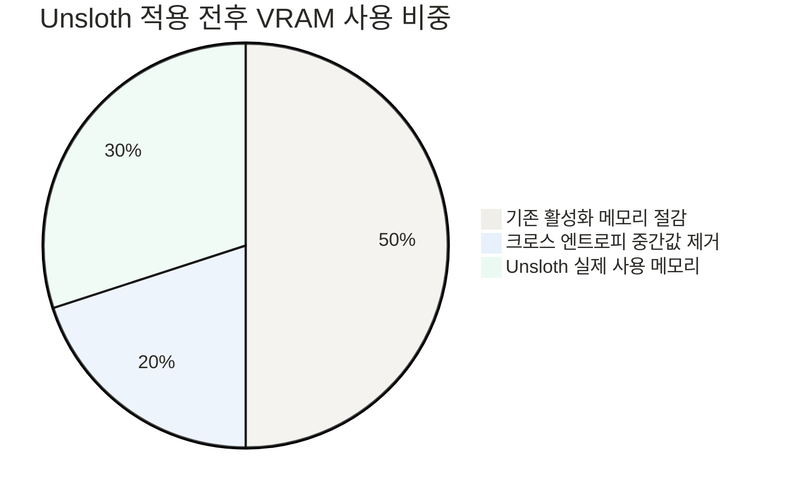
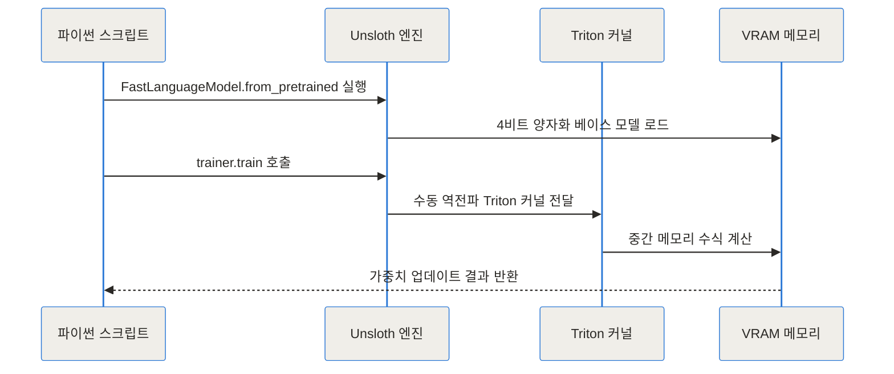
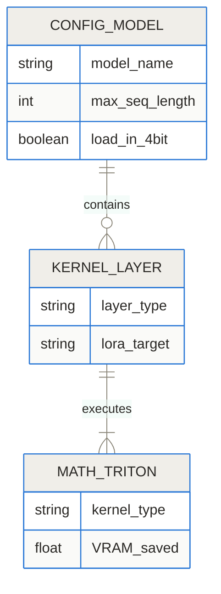
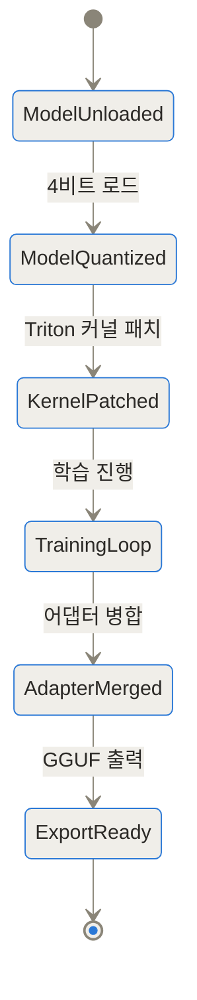
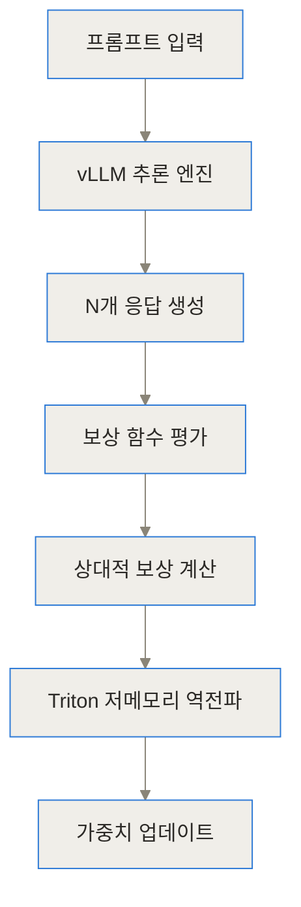
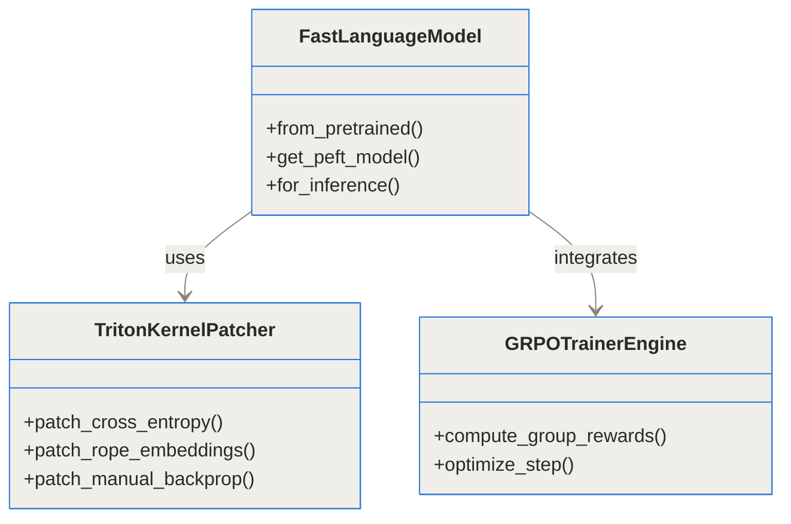

- GitHub 저장소: [unslothai/unsloth](https://github.com/unslothai/unsloth)
- 공식 문서: [Unsloth Documentation](https://docs.unsloth.ai)

> - **TL;DR 1**: Unsloth는 PyTorch의 기본 수식과 역전파 과정을 Triton 커널로 재작성하여 LLM 파인튜닝 속도를 최대 5배 향상시키고 VRAM 사용량을 80% 절감하는 파이썬 라이브러리입니다.
> - **TL;DR 2**: Llama 3.3, DeepSeek-R1, Qwen 2.5, Gemma 3 등 최신 오픈소스 모델을 무료 Google Colab T4 환경이나 단일 상용 GPU 환경에서 간편하게 학습할 수 있습니다.
> - **TL;DR 3**: SFT, LoRA, QLoRA는 물론 최근 거대언어모델 연구의 중심인 GRPO 기반 강화학습과 GGUF 원클릭 변환 기능을 제공합니다.


## 단 한 대의 GPU로 LLM을 학습시킬 때 겪는 현실적인 문제

최근 수십억 개의 매개변수를 가진 대형 언어 모델(LLM)을 기업의 내부 데이터나 특정 도메인 지식에 맞게 파인튜닝(미세조정)하려는 시도가 활발하게 이루어지고 있어요. 하지만 현업 엔지니어가 실제로 학습 스크립트를 돌려보면 가장 먼저 부딪히는 장벽이 바로 **OOM(Out of Memory)** 에러입니다.

8B(80억) 매개변수를 가진 모델을 16비트 정밀도로 학습하려면 가중치 자체에만 약 16GB의 VRAM이 필요해요. 여기에 학습 과정에서 발생하는 기울기(Gradient), 옵티마이저 상태(Optimizer State), 그리고 입력 문장에 따른 중간 계산값인 활성화 메모리(Activation Memory)가 추가되면 필요 VRAM은 순식간에 80GB 이상으로 폭증하게 됩니다.

결국 고가의 데이터센터용 GPU를 여러 대 대여하거나 긴 학습 시간을 견뎌야만 했죠. 기존의 PyTorch 및 Hugging Face 생태계는 매우 유연하지만, 메모리와 파이프라인 가속 측면에서 비효율적인 연산이 다수 존재한다는 한계가 있었습니다.


## 대형 언어 모델 파인튜닝 시 VRAM 소모와 속도 저하가 발생하는 이유

PyTorch의 자동 미분 기능인 Autograd(신경망의 기울기를 자동으로 계산해주는 시스템)는 매우 편리하지만, 역전파 계산을 위해 순전파 과정에서 생성된 모든 중간 상태(Activation)를 VRAM에 저장해 둡니다.

비유하자면, 마치 복잡한 수학 시험을 풀 때 시험지 여백 전체에 모든 풀이 과정을 일일이 적어두고 지우지 않아 연습장이 금방 부족해지는 것과 같아요. 실제로 LLM 학습 시 모델 가중치보다 이 **활성화 메모리**가 차지하는 비중이 훨씬 더 큽니다.

또한, 언어 모델의 마지막 레이어에서 출력 단어 집합(Vocab) 전체에 대한 확률을 계산하는 크로스 엔트로피 손실(Cross-Entropy Loss) 단계에서도 거대한 로짓(Logit) 행렬이 메모리에 배치됩니다. Llama 3처럼 어휘집 크기가 128,000개에 달하는 모델은 이 로짓 행렬을 VRAM에 올리는 것만으로도 수 기가바이트의 메모리를 순식간에 소비하게 되더라고요.



## Unsloth는 기존 파인튜닝 방식과 무엇이 다른가

Unsloth는 PyTorch의 자동 미분에 의존하는 대신, 파인튜닝 시 필요한 핵심 연산 수식을 수학적으로 단순화하고 이를 OpenAI가 개발한 **Triton 커널**(C/CUDA 수준의 GPU 고성능 커널을 파이썬으로 작성할 수 있게 해주는 도구)로 직접 구현했습니다.

Unsloth의 접근법은 모델의 출력 결과나 학습 정확도를 희생하는 근사법이 아닙니다. 수학적으로 100% 동일한 미분 수식을 유도한 뒤, 메모리 할당과 GPU 스레드 병렬 처리를 극도로 최적화한 커널로 대체한 것이죠.

이 덕분에 똑같은 LoRA(Low-Rank Adaptation, 가중치 일부만 효율적으로 업데이트하는 기법) 및 QLoRA 학습을 진행하더라도, VRAM 소모량은 최대 80% 줄어들고 학습 속도는 2배에서 5배까지 빨라지게 됩니다.



## Unsloth의 내부 가속 및 메모리 절감 작동 원리

Unsloth가 어떻게 높은 속도와 메모리 효율을 달성하는지 내부 구조를 구체적으로 파헤쳐 볼게요.

1. **수동 역전파(Manual Backpropagation) 커널**: PyTorch Autograd가 자동으로 생성하는 거대한 연산 그래프 대신, 연쇄 법칙(Chain Rule)을 이용하여 손실 함수와 각 레이어의 미분 수식을 직접 핸드 코딩된 Triton 커널로 수식화했습니다.
2. **메모리 절약형 RoPE 및 아텐션**: 위치 인코딩 방식인 RoPE(Rotary Position Embedding)와 멀티 헤드 아텐션 연산을 통합 커널로 묶어 인플레이스(In-place, 기존 메모리 공간을 재활용하는 방식)로 계산해요. 중간 결과를 메모리에 쓰지 않으므로 VRAM 대폭 절감이 가능합니다.
3. **로짓 행렬 생성 생략(Fused Cross-Entropy)**: 어휘집 전체 크기(Batch Size x Sequence Length x Vocab Size)의 거대한 텐서를 VRAM에 물리적으로 생성하지 않고, 손실 값을 즉시 계산하는 융합 커널을 사용합니다.
4. **GRPO(Group Relative Policy Optimization) 지원**: DeepSeek-R1 스타일의 추론 모델 학습에 사용되는 GRPO 강화를 지원할 때, 보상 계산과 생성 과정에서 발생하는 메모리 누수를 방지하여 단 7GB 내외의 VRAM에서도 추론 모델 학습이 가능합니다.



## 파이썬 코드로 살펴보는 Unsloth 설치 및 기본 파인튜닝 구현

Unsloth의 가장 큰 장점 중 하나는 기존 Hugging Face의 `SFTTrainer`나 `Trl` 라이브러리와 100% 호환된다는 점입니다. 기존 코드를 거의 수정하지 않고 로딩 클래스만 바꿈으로써 바로 가속을 적용할 수 있어요.

설치는 파이썬 패키지 관리자를 통해 간단히 진행할 수 있습니다.

```bash
pip install unsloth
pip install --no-deps trl peft accelerate bitsandbytes
```

아래는 Llama 3 8B 모델을 4비트 QLoRA로 로드하여 파인튜닝하는 파이썬 코드 예시입니다.

```python
import torch
from unsloth import FastLanguageModel
from datasets import load_dataset
from trl import SFTTrainer
from transformers import TrainingArguments

max_seq_length = 2048
dtype = None # None 지정 시 GPU에 맞춰 Float16 또는 Bfloat16 자동 선택
load_in_4bit = True

# 1. Unsloth의 FastLanguageModel을 통해 4비트 양자화 모델 로드
model, tokenizer = FastLanguageModel.from_pretrained(
    model_name = "unsloth/llama-3-8b-Instruct-bnb-4bit",
    max_seq_length = max_seq_length,
    dtype = dtype,
    load_in_4bit = load_in_4bit,
)

# 2. LoRA 어댑터 설정
model = FastLanguageModel.get_peft_model(
    model,
    r = 16, # LoRA 랭크
    target_modules = ["q_proj", "k_proj", "v_proj", "o_proj",
                      "gate_proj", "up_proj", "down_proj"],
    lora_alpha = 16,
    lora_dropout = 0,
    bias = "none",
    use_gradient_checkpointing = "unsloth", # Unsloth 고유의 그래디언트 체크포인팅
    random_state = 3407,
)

# 3. 데이터셋 준비 및 SFTTrainer 학습
dataset = load_dataset("alpaca", split = "train")

trainer = SFTTrainer(
    model = model,
    tokenizer = tokenizer,
    train_dataset = dataset,
    dataset_text_field = "text",
    max_seq_length = max_seq_length,
    dataset_num_proc = 2,
    args = TrainingArguments(
        per_device_train_batch_size = 2,
        gradient_accumulation_steps = 4,
        warmup_steps = 5,
        max_steps = 60,
        learning_rate = 2e-4,
        fp16 = not torch.cuda.is_bf16_supported(),
        bf16 = torch.cuda.is_bf16_supported(),
        logging_steps = 1,
        output_dir = "outputs",
    ),
)

trainer_stats = trainer.train()

# 4. GGUF 포맷으로 원클릭 저장 (Ollama 서빙용)
model.save_pretrained_gguf("model_gguf", tokenizer, quantization_method = "q4_k_m")
```



## 현업 엔지니어가 겪는 실전 파인튜닝 활용 시나리오

Unsloth가 유용한 대표적인 세 가지 실전 사용 시나리오를 살펴볼게요.

### 시나리오 1: 무료 Google Colab T4 인스턴스에서 도메인 특화 모델 만들기
스타트업이나 개인 연구자의 경우 고가의 A100 GPU를 사용할 예산이 부족할 수 있습니다. Unsloth를 활용하면 무료 Google Colab 환경(VRAM 15GB 제한의 Tesla T4)에서도 8B 규모 모델을 2048 컨텍스트 길이로 안정적으로 학습시킬 수 있어요.

### 시나리오 2: GRPO를 활용한 R1 스타일 추론 모델(Reasoning Model) 로컬 학습
최근 DeepSeek-R1의 성공으로 주목받는 GRPO 방식은 모델이 스스로 생각하는 과정을 학습하도록 유도합니다. 기존 트레이너는 여러 개의 응답을 동시 생성해야 하므로 VRAM 소모가 극심했지만, Unsloth의 GRPO 최적화를 적용하면 단일 GPU(8GB~15GB VRAM)에서도 보상 기반 강화학습을 진행할 수 있습니다.



### 시나리오 3: 사내 보안용 에지 온프레미스 모델 구축 및 Ollama 배포
데이터가 외부로 유출되면 안 되는 금융 및 의료 분야에서는 모델 학습부터 추론 서빙까지 완전한 폐쇄망에서 이루어져야 합니다. Unsloth로 파인튜닝을 마친 후 단 한 줄의 `save_pretrained_gguf` 명령으로 GGUF 파일을 생성하면, Ollama나 llama.cpp를 통해 사내 온프레미스 서버에 즉시 배포할 수 있습니다.


## 성능 벤치마크 및 기존 라이브러리와의 비교

실제 파인튜닝 환경에서 기존 PyTorch 기반 서드파티 라이브러리와 Unsloth가 보여주는 성능 차이는 수치로도 명확하게 증명됩니다.

| 구 분 | Hugging Face 기본 | FlashAttention-2 적용 | Unsloth 오픈소스 | Unsloth Pro |
| :--- | :--- | :--- | :--- | :--- |
| **학습 상대 속도** | 1.0x (기준) | 1.2x | **2.5x ~ 5.0x** | **최대 15x~30x** |
| **VRAM 절감 비율** | 0% | 약 15% | **약 70% ~ 80%** | **약 80% 이상** |
| **최대 컨텍스트 길이** | 4K ~ 8K | 16K | **수십만 토큰 이상** | **500K+ 토큰** |
| **GGUF 즉시 내보내기** | 미지원 (별도 변환) | 미지원 | **원클릭 지원** | **원클릭 지원** |
| **지원 방식** | 순정 Autograd | 커널 일부 가속 | **전체 수동 역전파 커널** | **고급 멀티 GPU 최적화** |

```chartjs
{"type":"bar","data":{"labels":["HuggingFace 기본","HuggingFace FlashAttention2","Unsloth 오픈소스","Unsloth Pro"],"datasets":[{"label":"학습 속도 배율","data":[1.0,1.2,2.5,15.0]}]}}
```

아래는 대표적인 8B 모델 학습 시 요구되는 VRAM 용량 비교 그래프입니다.

```chartjs
{"type":"bar","data":{"labels":["Llama-3 8B Full","HuggingFace QLoRA","Unsloth QLoRA","Unsloth GRPO 추론학습"],"datasets":[{"label":"필요 VRAM (GB)","data":[32,16,7,5]}]}}
```



## Unsloth 적용 시 유의해야 할 한계와 트레이드오프

모든 프로젝트가 그렇듯 Unsloth 역시 전능한 해결책은 아니며 몇 가지 고려해야 할 제약 사항이 있습니다.

- **하드웨어 제약**: Unsloth의 핵심 연산은 Triton 커널에 기반하고 있으므로, NVIDIA CUDA Compute Capability 7.0 이상(Tesla T4, RTX 2000 시리즈 이상)의 GPU가 필요합니다. AMD GPU 지원은 WSL 및 Linux 수동 설정을 통해 꾸준히 개선되고 있으나 NVIDIA 환경이 가장 안정적이에요.
- **아키텍처 패칭 방식**: Llama, Qwen, Mistral, Gemma, Phi 등 주요 인기 오픈소스 구조는 커널 최적화가 완벽히 완비되어 있으나, 비주류 신규 아키텍처나 독자 구조 모델은 지원 대상에 포함되기까지 시간이 걸릴 수 있습니다.
- **다중 GPU(Multi-GPU) 확장**: 오픈소스 버전은 단일 GPU 환경 최적화에 초점이 맞춰져 있습니다. 수십 대의 GPU를 동시 연결하는 분산 학습에는 별도의 Pro/Enterprise 설정이 요구될 수 있습니다.

## LLM 파인튜닝 생태계의 미래와 결론

Unsloth는 거대한 컴퓨팅 자원을 가진 소수 빅테크 기업의 전유물이었던 LLM 파인튜닝을 대중화하는 데 크게 기여하고 있습니다. PyTorch의 상위 아키텍처에만 의존하지 않고 수식 자체를 다시 작성하는 저전력 커널 최적화 접근법은 인공지능 엔지니어링이 나아가야 할 방향을 명확히 보여줍니다.

비용과 VRAM의 한계로 인해 오픈소스 LLM 도입을 주저했던 개발자나 기업이라면, Unsloth를 사용해 로컬 환경이나 단일 GPU 인스턴스에서 가볍고 빠르게 나만의 최적화 모델 구축을 시도해 보시길 권장합니다.

<!-- primary-sources:start -->
## 원문과 버전 확인

- [공식 GitHub 저장소](https://github.com/unslothai/unsloth)
<!-- primary-sources:end -->

<!-- internal-links:start -->
## 함께 읽으면 이해가 이어지는 글

- [로컬 LLM은 클라우드보다 쌀까: VRAM, 전력, 운영비 계산]() — 로컬 LLM의 양자화, 메모리 대역폭, KV 캐시를 이해하고, 하드웨어 구매 전에 품질, 동시성, 전력, 운영비를 비교하는 방법을 정리합니다.
- [DeepSeek Engram이 VRAM을 DRAM으로 옮길까: O(1) N-gram 조회와 PCIe 병목]() — 정적 N-gram 지식을 DRAM, CXL에서 조회하고 GPU를 추론에 집중시키는 Engram의 구조와, 초기 레이어 삽입, PCIe, OOV, 데모 코드 한계를 정리합니다.
- [Replicate 모델 배포 전 꼭 계산할 것: Cold Start와 Cog setup, predict 분리]() — Replicate의 사용량 기반 GPU 실행이 항상 빠른 API를 뜻하지 않는 이유를 lifecycle로 설명하고, Cog의 환경 정의와 모델 1회 로드, 요청별 추론 구조를 점검합니다.
<!-- internal-links:end -->

## 자주 묻는 질문 (FAQ)

### Unsloth는 무료로 사용할 수 있나요?

네, Unsloth 오픈소스 버전은 Apache 2.0 라이선스로 제공되며 누구나 무료로 사용할 수 있습니다. 단일 GPU 환경이나 Google Colab 무료 인스턴스에서도 제약 없이 강력한 학습 가속 기능을 이용할 수 있습니다.

### Unsloth 사용 시 모델의 학습 정확도가 떨어지지 않나요?

아닙니다. Unsloth는 근사 계산이나 정밀도 손실 방식을 쓰지 않고, 수학적으로 100% 동일한 손실 함수와 역전파 수식을 Triton 커널로 직접 구현했습니다. 따라서 기존 PyTorch 학습 대비 정확도 및 손실 오차가 완전히 일치합니다.

### Unsloth로 학습한 모델을 Ollama나 vLLM에서 바로 사용할 수 있나요?

네, 학습 완료 후 단 한 줄의 명령어로 GGUF 포맷이나 16비트 Safetensors 포맷으로 내보낼 수 있습니다. 내보낸 파일은 Ollama, vLLM, llama.cpp 등 현업 추론 엔진에서 즉시 서빙 가능합니다.

### DeepSeek-R1 스타일의 추론 모델도 Unsloth로 직접 학습할 수 있나요?

네, Unsloth는 GRPO(Group Relative Policy Optimization) 강화를 완벽하게 지원합니다. 기존에 수백 기가바이트의 VRAM이 필요했던 추론 모델 학습 과정을 단 7GB 내외의 VRAM에서도 동작하도록 최적화하여 상용 GPU에서도 R1 스타일 모델을 만들 수 있습니다.

### 어떤 GPU 환경에서 Unsloth를 구동할 수 있나요?

NVIDIA CUDA Compute Capability 7.0 이상을 지원하는 GPU(Tesla T4, RTX 2000 시리즈 이상)에서 기본 작동합니다. 또한 Windows WSL 및 Linux 환경을 공식 지원합니다.


## References
- [https://github.com/unslothai/unsloth](https://github.com/unslothai/unsloth)
- [https://docs.unsloth.ai](https://docs.unsloth.ai)
