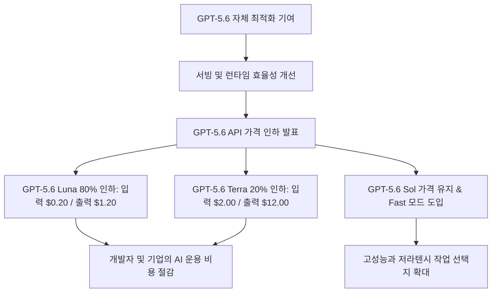
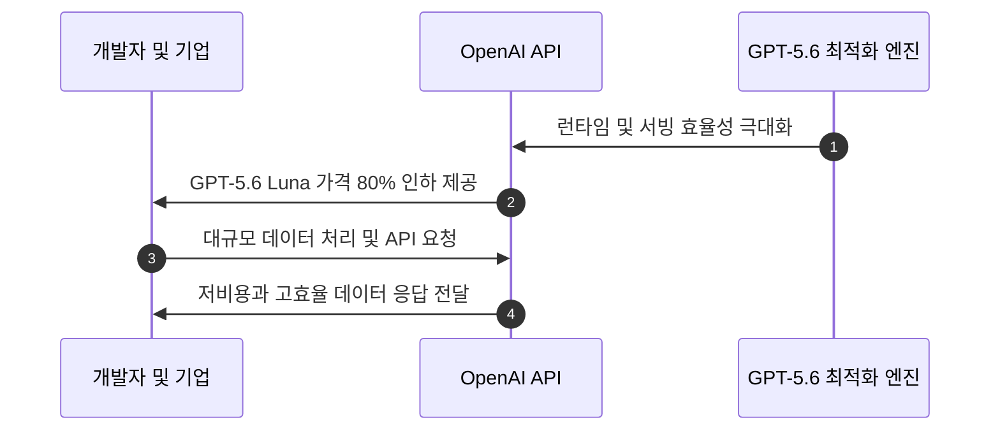
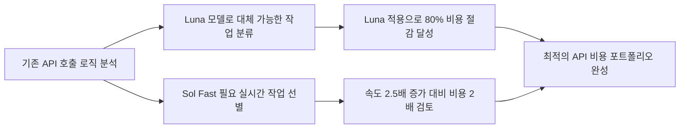

이번 조정의 직접적인 수혜는 호출량이 많고 작업 난도가 비교적 낮은 API 워크로드입니다. 다만 80%라는 인하율만 보고 전체 비용이 같은 폭으로 줄어든다고 계산하면 안 됩니다. 입력, 출력 토큰 비율, 재시도, 캐시 사용, 모델 교체 후 품질 보정 비용까지 함께 비교해야 실제 절감 여부를 판단할 수 있습니다.

## 무슨 일이 벌어진 걸까?

2026년 7월 30일 OpenAI가 자사의 핵심 모델 라인업인 GPT-5.6 시리즈의 API 이용 가격을 인하했습니다. 하위 모델인 GPT-5.6 Luna의 인하율은 80%이며, 중위 모델인 GPT-5.6 Terra 역시 20% 저렴해졌습니다 <a href="#source-1" aria-label="OpenAI 공식 발표 출처">[1]</a>.

세부적인 요금을 살펴보면 GPT-5.6 Luna의 API 이용료는 100만 입력 토큰당 0.20달러, 100만 출력 토큰당 1.20달러로 크게 조정되었습니다 <a href="#source-2" aria-label="VentureBeat 출처">[2]</a>. 이는 대규모 텍스트 전처리나 단순 반복성 작업을 수행할 때 기존보다 비용을 5분의 1 수준으로 줄일 수 있다는 의미입니다.

한편 중급 모델인 GPT-5.6 Terra의 요금은 100만 입력 토큰당 2.00달러, 100만 출력 토큰당 12.00달러로 인하되었습니다 <a href="#source-3" aria-label="Axios 출처">[3]</a>. 최상위 모델인 GPT-5.6 Sol의 표준 API 이용료는 100만 입력 토큰당 5.00달러, 100만 출력 토큰당 30.00달러로 이전과 동일하게 유지됩니다 <a href="#source-1" aria-label="OpenAI 공식 발표 출처">[1]</a>. 대신 OpenAI는 빠른 응답 속도가 필수적인 작업을 위해 표준 가격의 2배를 지불하면 최대 2.5배 빠르게 작동하는 GPT-5.6 Sol Fast 모드를 API에 새로 도입했습니다 <a href="#source-2" aria-label="VentureBeat 출처">[2]</a>.

위 차트는 이번 가격 조정을 반영한 GPT-5.6 API 모델별 100만 토큰당 이용 단가 비교입니다. 가장 가벼운 Luna 모델의 단위 비용이 획기적으로 낮아진 점을 확인할 수 있습니다.

<figure class="news-source-image">
  
  <figcaption>OpenAI가 원문과 함께 공개한 이미지입니다. <a href="https://openai.com/index/advancing-the-price-performance-frontier-with-gpt-5-6" target="_blank" rel="noopener noreferrer">출처: OpenAI</a></figcaption>
</figure>

## 왜 지금 다들 이 이야기를 할까?

이번 GPT-5.6 API 가격 인하는 인공지능 모델 스스로가 인프라 효율성 개선에 직접 기여하여 결실을 맺었다는 점에서 큰 화제를 모으고 있습니다. OpenAI는 서빙 및 런타임 효율성 개선 덕분에 인하가 가능했으며, 이 최적화 작업 과정에 GPT-5.6 자체가 활용되었다고 설명했습니다 <a href="#source-3" aria-label="Axios 출처">[3]</a>.

시장 환경 측면에서도 의미가 큽니다. 대용량 운영 환경을 갖춘 기업들과 개발자 사이에서 오픈웨이트(Open-weight) 모델과의 가격 경쟁이 치열해진 시점에 일어난 전략적 변화입니다 <a href="#source-2" aria-label="VentureBeat 출처">[2]</a>. 대규모 AI 서비스 운영진에게 비용은 모델 성능 못지않은 핵심 결정 요소이기 때문입니다.

위 시퀀스 다이어그램은 인공지능 최적화를 통한 인프라 효율성 향상이 어떻게 개발자의 비용 절감으로 연결되는지 보여줍니다.

<figure class="news-source-image">
  
  <figcaption>OpenAI가 원문과 함께 공개한 이미지입니다. <a href="https://openai.com/index/advancing-the-price-performance-frontier-with-gpt-5-6" target="_blank" rel="noopener noreferrer">출처: OpenAI</a></figcaption>
</figure>

## 발표 단가를 실제 월 비용으로 어떻게 바꿔 계산할까?

AI 기반 서비스를 제작하거나 운용하는 개발자와 기업은 Luna에 맞는 작업을 옮겼을 때 동일한 예산으로 더 많은 요청을 처리할 여지가 생겼습니다. 데이터 전처리, 대용량 텍스트 요약, 단순 정보 추출처럼 호출 빈도가 높은 업무가 후보지만, Luna가 기존 모델과 같은 품질을 낸다는 전제가 먼저 확인돼야 합니다 <a href="#source-1" aria-label="OpenAI 공식 발표 출처">[1]</a>.

월 비용의 기본식은 `입력 토큰(백만 단위) × 입력 단가 + 출력 토큰(백만 단위) × 출력 단가`입니다. 예를 들어 한 달에 입력 1억 토큰과 출력 1천만 토큰을 처리한다는 가정에서는 Luna의 표시 단가 기준 비용이 20달러와 12달러를 합친 32달러이고, Terra는 200달러와 120달러를 합친 320달러입니다. 이는 모델 성능이나 부가 기능을 같다고 놓은 단순 단가 비교일 뿐이며, 실제 청구액에는 요청 실패 후 재시도와 불필요하게 긴 출력도 영향을 줍니다.

실시간 응답 속도가 중요한 작업에서는 GPT-5.6 Sol Fast 모드를 비교할 수 있습니다. 100만 입력 토큰당 10.00달러, 출력 토큰당 60.00달러로 표준 API 단가의 2배이므로, 최대 2.5배라는 속도 수치가 사용자가 체감하는 대기 시간과 처리량 개선으로 이어지는지 측정해야 합니다 <a href="#source-2" aria-label="VentureBeat 출처">[2]</a>. 모델 계산 외부의 검색, 도구 호출, 네트워크 지연이 병목이라면 Fast 모드에 비용을 더 내도 전체 응답 시간은 그만큼 줄지 않을 수 있습니다.

상단 흐름도처럼 작업의 복잡도와 필요한 속도에 맞춰 적절한 모델을 지정하는 지능형 라우팅 체계를 구축할 수 있습니다.

## 어떤 순서로 모델을 바꿔야 실패 비용을 줄일까?

개발자 및 서비스 테크 리더라면 자사 시스템의 API 호출 패턴을 분석해 모델 배치를 재조정해야 합니다. 상대적으로 복잡도가 낮은 작업을 정교하게 분류해 GPT-5.6 Luna로 전환하는 파이프라인 개편이 주요 포인트입니다.

먼저 운영 로그에서 작업 유형별 입력, 출력 토큰, 재시도율, 응답 시간과 오류율을 나눠 기준선을 만듭니다. 그다음 정답을 자동으로 채점하기 쉬운 추출이나 분류 작업부터 소량의 트래픽을 Luna로 보내 기존 결과와 비교합니다. 비용이 줄어도 누락률이 높아져 사람이 다시 검수한다면 총비용은 오히려 늘 수 있으므로, API 청구액과 함께 후처리 시간도 기록해야 합니다.

Terra와 Sol은 모든 요청에 고정하기보다 Luna가 불확실성을 보인 요청을 승격하는 경로로 시험할 수 있습니다. 다만 라우터가 잘못 판단하면 같은 요청이 여러 모델을 거치며 토큰을 중복 소비합니다. 따라서 승격 조건, 최대 재시도 횟수, 요청당 비용 상한을 먼저 정하고, 모델별 품질 차이가 확인된 작업에만 라우팅을 적용하는 편이 안전합니다.

또한, 새로 추가된 GPT-5.6 Sol Fast 모드의 레이턴시 개선 효과를 실제 트래픽 환경에서 벤치마크해볼 가치가 있습니다. 2배의 비용 추가 대비 속도 향상(최대 2.5배)이 가져다주는 서비스 만족도 상승폭을 유효하게 측정하는 과정이 필요합니다 <a href="#source-2" aria-label="VentureBeat 출처">[2]</a>.

이 흐름도는 기존 시스템의 API 호출 방식을 점검하고 신규 단가에 맞춰 포트폴리오를 최적화하는 단계를 정리한 그림입니다.

가격 변경 뒤에는 예산 경보도 새 단가에 맞춰 다시 설정해야 합니다. 일평균 토큰만 보면 갑작스러운 트래픽 급증이나 에이전트의 반복 호출을 늦게 발견할 수 있으므로, 요청당 비용과 사용자당 비용을 함께 추적합니다. 전환 전후 같은 기간을 비교할 때는 트래픽 구성과 출력 길이가 달라졌는지도 기록해야 모델 교체 효과와 이용량 변화를 혼동하지 않습니다.

## 아직은 선을 그어야 할 부분

이번 가격 발표가 모든 모델 라인업의 가격 하락을 의미하지는 않습니다. GPT-5.6 Sol의 기본 단가는 100만 입력 토큰당 5.00달러, 출력 토큰당 30.00달러로 이전과 동일합니다 <a href="#source-1" aria-label="OpenAI 공식 발표 출처">[1]</a>.

아울러 Sol Fast 모드는 표준 요금의 2배가 적용되는 옵션입니다. 사전 테스트 없이 일괄 적용할 경우 API 지출이 늘 수 있으므로 작업별 비용과 지연 시간을 먼저 비교해야 합니다 <a href="#source-2" aria-label="VentureBeat 출처">[2]</a>. 발표 단가는 시점에 따라 바뀔 수 있으므로, 마이그레이션을 확정할 때는 공식 가격표와 실제 계정의 청구 조건을 다시 확인해야 합니다.

<!-- primary-sources:start -->
## 원문과 버전 확인

- [발표 원문](https://openai.com/index/advancing-the-price-performance-frontier-with-gpt-5-6)
- [VentureBeat](https://venturebeat.com/ai/ai-price-wars-openai-cuts-gpt-5-6-luna-prices-by-80-as-model-competition-shifts-toward-cost)
- [Axios](https://www.axios.com/2026/07/30/openai-gpt-5-6-price-cuts)
<!-- primary-sources:end -->

<!-- internal-links:start -->
## 함께 읽으면 이해가 이어지는 글

- [OpenAI 프론티어 API 제로 데이터 보존 발표, Private Safety Processing으로 기업 보안 강화]() — OpenAI가 2026년 8월 19일 프론티어 모델 API 사용자를 대상으로 제로 데이터 보존(ZDR) 옵션을 발표하고 Private Safety Processing을 미리보기로 공개했습니다. ZDR을 적용하면 프롬프트와 모델 출력…
- [DeepSeek-V4-Flash-0731 출시: 100만 토큰당 $0.14로 V4-Pro 넘은 에이전트 성능]() — DeepSeek는 2026년 7월 31일 DeepSeek-V4-Flash-0731 모델을 API 공개 베타로 출시하고 Hugging Face에 MIT 라이선스로 가중치를 공개했습니다. 13B 활성화 파라미터와 DSpark 모듈을 통해…
- [Replicate 모델 배포 전 꼭 계산할 것: Cold Start와 Cog setup, predict 분리]() — Replicate의 사용량 기반 GPU 실행이 항상 빠른 API를 뜻하지 않는 이유를 lifecycle로 설명하고, Cog의 환경 정의와 모델 1회 로드, 요청별 추론 구조를 점검합니다.
<!-- internal-links:end -->

## 자주 묻는 질문

### OpenAI의 GPT-5.6 API 가격은 얼마나 인하되었나요?

GPT-5.6 Luna는 80% 인하되어 100만 입력 토큰당 $0.20, 출력 토큰당 $1.20로 조정되었습니다. GPT-5.6 Terra는 20% 인하되어 입력 토큰당 $2.00, 출력 토큰당 $12.00가 적용됩니다. 단, GPT-5.6 Sol의 기본 가격은 기존과 동일합니다.

### GPT-5.6 Sol Fast 모드는 어떤 특징과 가격을 갖추고 있나요?

GPT-5.6 Sol Fast 모드는 표준 Sol 모델 대비 최대 2.5배 빠른 응답 속도를 제공합니다. 요금은 표준 API 요금의 2배인 100만 입력 토큰당 $10.00, 출력 토큰당 $60.00로 책정되었습니다.

### 이번 GPT-5.6 API 가격 인하가 가능했던 이유는 무엇인가요?

OpenAI가 모델 서빙 및 런타임 효율성을 크게 향상시켰기 때문입니다. 이 인프라 최적화 및 서빙 개선 작업에는 GPT-5.6 모델 자체가 활용되어 비용을 줄이는 데 기여했습니다.

## 직접 확인한 원문

<ol class="checked-source-list">
  <li id="source-1"><a href="https://openai.com/index/advancing-the-price-performance-frontier-with-gpt-5-6" target="_blank" rel="noopener noreferrer">OpenAI — Advancing the price-performance frontier with GPT-5.6</a> (2026-07-30)</li>
  <li id="source-2"><a href="https://venturebeat.com/ai/ai-price-wars-openai-cuts-gpt-5-6-luna-prices-by-80-as-model-competition-shifts-toward-cost" target="_blank" rel="noopener noreferrer">VentureBeat — AI price wars: OpenAI cuts GPT-5.6 Luna prices by 80% as model competition shifts toward cost</a> (2026-07-30)</li>
  <li id="source-3"><a href="https://www.axios.com/2026/07/30/openai-gpt-5-6-price-cuts" target="_blank" rel="noopener noreferrer">Axios — OpenAI cuts GPT-5.6 prices</a> (2026-07-30)</li>
</ol>

> 이 글은 위 원문을 직접 확인해 작성했습니다. 가격, 기능 범위, 지역별 제공 여부는 게시 후 바뀔 수 있으니 실제 도입 전 공식 문서를 다시 확인하세요.
