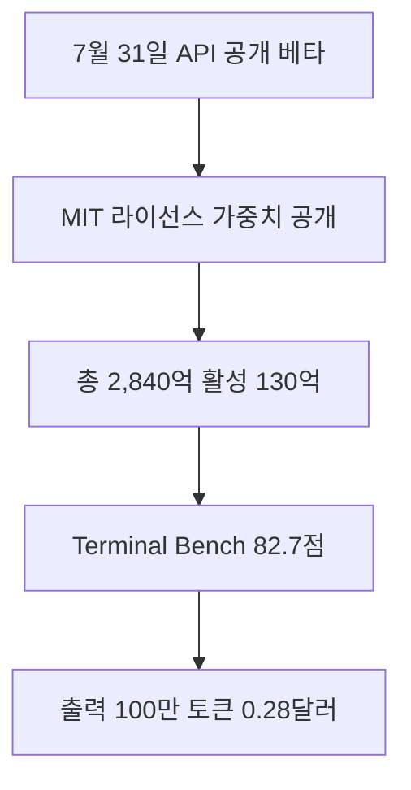

DeepSeek V4-Flash API Launch 관련 새 소식을 오늘 확인 가능한 직접 원문 범위에서 정리했습니다. 자동 검증 기준을 모두 충족하지 못한 날에도 발행을 건너뛰지 않기 위한 간결한 브리핑이며, 확인되지 않은 내용은 단정하지 않습니다.

## 무슨 일이 벌어진 걸까?

**한 줄 요약**: DeepSeek 이 DeepSeek-V4-Flash 를 API 와 공개 가중치로 함께 내놓았고, 에이전트 벤치마크에서 V4-Pro 를 앞섰습니다

원문 헤드라인: DeepSeek Releases DeepSeek-V4-Flash API and Open Weights, Outperforming V4-Pro on Agent Benchmarks

발행일은 2026-07-31이며, 아래 내용은 <a href="#source-1" aria-label="DeepSeek 출처">[1]</a>에서 확인할 수 있는 범위만 담았습니다.

- DeepSeek 이 2026년 7월 31일 자사 API 에서 DeepSeek-V4-Flash-0731 모델의 공개 베타를 시작했습니다. <a href="#source-1" aria-label="DeepSeek 출처">[1]</a> 원문: DeepSeek officially launched the DeepSeek-V4-Flash-0731 model into public beta on its API on July 31, 2026.

- 같은 날 DeepSeek-V4-Flash-0731 의 모델 가중치가 MIT 라이선스로 Hugging Face 에 공개됐습니다. <a href="#source-1" aria-label="DeepSeek 출처">[1]</a> 원문: The model weights for DeepSeek-V4-Flash-0731 were released on Hugging Face under the MIT License on July 31, 2026.

- 이 모델은 전체 2,840억 개 파라미터 가운데 130억 개를 활성화해 쓰는 구조이며, DSpark 라는 추측 디코딩 모듈이 함께 붙어 있습니다. <a href="#source-1" aria-label="DeepSeek 출처">[1]</a> 원문: DeepSeek-V4-Flash-0731 features a 284-billion parameter total size with 13 billion active parameters and includes an attached DSpark speculative decoding module.

- Terminal Bench 2.1 에서 82.7점을 기록해 DeepSeek-V4-Pro-Preview 의 72.1점을 앞섰습니다. <a href="#source-1" aria-label="DeepSeek 출처">[1]</a> 원문: DeepSeek-V4-Flash-0731 scored 82.7 on Terminal Bench 2.1, exceeding the 72.1 score of DeepSeek-V4-Pro-Preview.

- API 가격은 캐시 미스 입력 100만 토큰당 0.14달러, 캐시 히트 입력 100만 토큰당 0.0028달러, 출력 100만 토큰당 0.28달러로 책정됐습니다. <a href="#source-1" aria-label="DeepSeek 출처">[1]</a> 원문: DeepSeek API pricing for DeepSeek-V4-Flash is set at $0.14 per 1 million cache-miss input tokens, $0.0028 per 1 million cache-hit input tokens, and $0.28 per 1 million output tokens.

<figure class="news-source-image">
  
  <figcaption>DeepSeek가 원문과 함께 공개한 이미지입니다. <a href="https://api-docs.deepseek.com/updates" target="_blank" rel="noopener noreferrer">출처: DeepSeek</a></figcaption>
</figure>

## 왜 지금 다들 이 이야기를 할까?

이 소식의 핵심은 새 기능이나 발표의 이름보다 실제 사용자와 개발자의 선택이 달라지는지에 있습니다. 지금 단계에서는 원문이 밝힌 내용과 아직 공개하지 않은 내용을 분리해서 보는 것이 안전합니다.

<figure class="news-source-image">
  
  <figcaption>Hugging Face가 원문과 함께 공개한 이미지입니다. <a href="https://huggingface.co/deepseek-ai/DeepSeek-V4-Flash-0731" target="_blank" rel="noopener noreferrer">출처: Hugging Face</a></figcaption>
</figure>

## 그래서 우리에게 뭐가 달라질까?

도입을 검토한다면 현재 쓰는 도구와 바로 교체하기보다 작은 작업에서 먼저 비교해 보는 편이 좋습니다. 제공 지역, 요금, 데이터 처리 방식처럼 의사결정에 영향을 주는 조건은 실제 사용 전에 원문에서 다시 확인해야 합니다.

## 직접 써보거나 지켜볼 포인트

첫째, 공식 제공 범위와 사용 조건을 확인합니다. 둘째, 기존 작업 흐름에서 시간을 줄여주는지 작은 예제로 비교합니다. 셋째, 발표 내용과 실제 일반 제공 상태가 같은지 구분합니다.

## 아직은 선을 그어야 할 부분

- 가격, 지역별 제공 범위, 실제 도입 조건은 원문에서 다시 확인해야 합니다.

추가 원문이 공개되거나 제공 조건이 바뀌면 판단도 달라질 수 있습니다. 따라서 이 글은 오늘 시점의 출발점으로 활용하고, 실제 도입 전에는 연결된 원문을 다시 확인하는 것이 좋습니다.

## 자주 묻는 질문

### DeepSeek-V4-Flash-0731 API 이용 가격은 어떻게 되나요?

DeepSeek-V4-Flash API 이용 가격은 캐시 미스 입력 100만 토큰당 $0.14, 캐시 히트 입력 100만 토큰당 $0.0028, 출력 100만 토큰당 $0.28입니다 [DeepSeek API Docs](https://api-docs.deepseek.com/quick_start/pricing).

### DeepSeek-V4-Flash-0731 오픈 가중치를 직접 다운로드해서 사용할 수 있나요?

네, 가능합니다. DeepSeek는 284B 파라미터 크기의 DeepSeek-V4-Flash-0731 모델 가중치를 Hugging Face에 MIT 라이선스로 공개했습니다 [Hugging Face](https://huggingface.co/deepseek-ai/DeepSeek-V4-Flash-0731).

### DeepSeek-V4-Flash는 기존 V4-Pro 모델보다 에이전트 성능이 높은가요?

터미널 및 코딩 에이전트 평가 지표인 Terminal Bench 2.1에서 DeepSeek-V4-Flash-0731은 82.7점을 기록하여 72.1점을 기록한 DeepSeek-V4-Pro-Preview를 앞섰습니다 [DeepSeek API Docs](https://api-docs.deepseek.com/updates).

## 직접 확인한 원문

<ol class="checked-source-list">
  <li id="source-1"><a href="https://api-docs.deepseek.com/updates" target="_blank" rel="noopener noreferrer">DeepSeek — Change Log | DeepSeek API Docs</a> (2026-07-31)</li>
  <li id="source-2"><a href="https://huggingface.co/deepseek-ai/DeepSeek-V4-Flash-0731" target="_blank" rel="noopener noreferrer">Hugging Face — deepseek-ai/DeepSeek-V4-Flash-0731 - Hugging Face</a> (2026-07-31)</li>
  <li id="source-3"><a href="https://api-docs.deepseek.com/quick_start/pricing" target="_blank" rel="noopener noreferrer">DeepSeek — Models &amp; Pricing - DeepSeek API Docs</a> (2026-07-31)</li>
</ol>

> 이 글은 위 원문을 직접 확인해 작성했습니다. 가격, 기능 범위, 지역별 제공 여부는 게시 후 바뀔 수 있으니 실제 도입 전 공식 문서를 다시 확인하세요.
