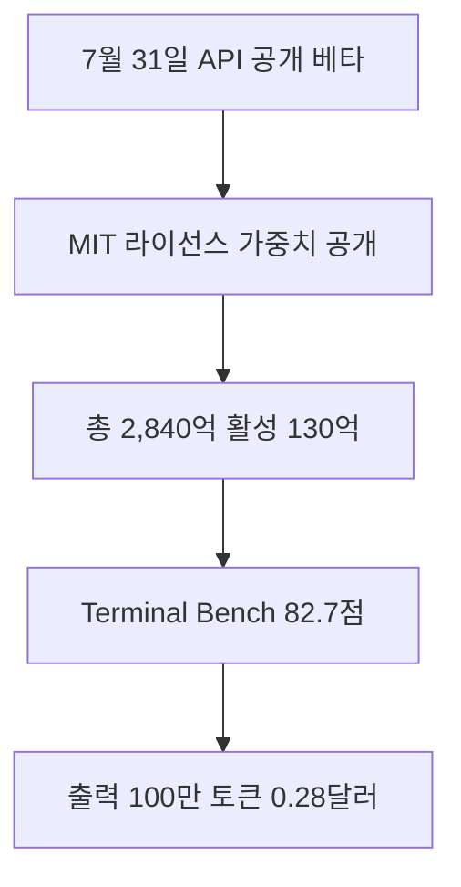

DeepSeek-V4-Flash-0731은 낮은 표시 단가의 API로 먼저 시험하고, 데이터 통제나 자체 운영이 필요할 때 MIT 가중치를 검토할 수 있는 모델입니다. 다만 활성 파라미터가 130억 개라는 사실이 전체 2,840억 개 가중치를 가볍게 내려받아 운용할 수 있다는 뜻은 아닙니다. Terminal Bench 2.1의 우위도 에이전트 작업 한 평가에서 나온 결과이므로, 기존 모델을 교체하려면 조직의 실제 도구 호출과 오류 복구 시나리오로 다시 비교해야 합니다.

## 무슨 일이 벌어진 걸까?

**한 줄 요약**: DeepSeek 이 DeepSeek-V4-Flash 를 API 와 공개 가중치로 함께 내놓았고, 에이전트 벤치마크에서 V4-Pro 를 앞섰습니다

원문 헤드라인: DeepSeek Releases DeepSeek-V4-Flash API and Open Weights, Outperforming V4-Pro on Agent Benchmarks

발행일은 2026-07-31이며, 아래 내용은 <a href="#source-1" aria-label="DeepSeek 출처">[1]</a>에서 확인할 수 있는 범위만 담았습니다.

- DeepSeek 이 2026년 7월 31일 자사 API 에서 DeepSeek-V4-Flash-0731 모델의 공개 베타를 시작했습니다. <a href="#source-1" aria-label="DeepSeek 출처">[1]</a> 원문: DeepSeek officially launched the DeepSeek-V4-Flash-0731 model into public beta on its API on July 31, 2026.

- 같은 날 DeepSeek-V4-Flash-0731 의 모델 가중치가 MIT 라이선스로 Hugging Face 에 공개됐습니다. <a href="#source-1" aria-label="DeepSeek 출처">[1]</a> 원문: The model weights for DeepSeek-V4-Flash-0731 were released on Hugging Face under the MIT License on July 31, 2026.

- 이 모델은 전체 2,840억 개 파라미터 가운데 130억 개를 활성화해 쓰는 구조이며, DSpark 라는 추측 디코딩 모듈이 함께 붙어 있습니다. <a href="#source-1" aria-label="DeepSeek 출처">[1]</a> 원문: DeepSeek-V4-Flash-0731 features a 284-billion parameter total size with 13 billion active parameters and includes an attached DSpark speculative decoding module.

- Terminal Bench 2.1 에서 82.7점을 기록해 DeepSeek-V4-Pro-Preview 의 72.1점을 앞섰습니다. <a href="#source-1" aria-label="DeepSeek 출처">[1]</a> 원문: DeepSeek-V4-Flash-0731 scored 82.7 on Terminal Bench 2.1, exceeding the 72.1 score of DeepSeek-V4-Pro-Preview.

- API 가격은 캐시 미스 입력 100만 토큰당 0.14달러, 캐시 히트 입력 100만 토큰당 0.0028달러, 출력 100만 토큰당 0.28달러로 책정됐습니다. <a href="#source-1" aria-label="DeepSeek 출처">[1]</a> 원문: DeepSeek API pricing for DeepSeek-V4-Flash is set at $0.14 per 1 million cache-miss input tokens, $0.0028 per 1 million cache-hit input tokens, and $0.28 per 1 million output tokens.

<figure class="news-source-image">
  
  <figcaption>DeepSeek가 원문과 함께 공개한 이미지입니다. <a href="https://api-docs.deepseek.com/updates" target="_blank" rel="noopener noreferrer">출처: DeepSeek</a></figcaption>
</figure>

## 2,840억 전체·130억 활성 파라미터는 무엇을 뜻할까?

이 소식의 핵심은 새 기능이나 발표의 이름보다 실제 사용자와 개발자의 선택이 달라지는지에 있습니다. 전체 파라미터와 요청마다 활성화되는 파라미터가 다른 구조에서는 모든 가중치가 매 토큰 계산에 참여하지 않습니다. 따라서 활성 130억이라는 수치는 추론 때의 계산량을 이해하는 단서지만, 모델 파일 전체를 보관하고 메모리에 올리는 요구까지 130억 모델과 같아진다는 뜻은 아닙니다.

자체 호스팅을 검토할 때는 모델 카드에 적힌 숫자 하나보다 가중치 형식, 양자화 가능 여부, 사용하려는 추론 엔진의 지원, 여러 장치 사이의 통신 비용을 함께 봐야 합니다. DSpark 추측 디코딩 모듈 역시 처리량을 높이려는 구성 요소로 소개됐지만, 실제 이득은 입력 길이와 동시 요청 수, 하드웨어 구성에 따라 달라질 수 있습니다. 공식 예제와 같은 조건을 재현하지 않았다면 API 응답 속도나 로컬 처리량을 단정하기 어렵습니다.

<figure class="news-source-image">
  
  <figcaption>Hugging Face가 원문과 함께 공개한 이미지입니다. <a href="https://huggingface.co/deepseek-ai/DeepSeek-V4-Flash-0731" target="_blank" rel="noopener noreferrer">출처: Hugging Face</a></figcaption>
</figure>

## Terminal Bench 점수만으로 기존 모델을 바꿔도 될까?

Terminal Bench 2.1에서 82.7점을 기록해 V4-Pro-Preview의 72.1점을 앞섰다는 결과는 터미널 기반 에이전트 작업을 비교하는 유용한 출발점입니다. 하지만 이 한 점수는 코드 리뷰의 정확성, 한국어 지시 이해, 조직 내부 도구의 스키마 준수, 긴 작업 중 상태 복구까지 모두 대표하지 않습니다. 비교 대상도 이름 그대로 Preview 모델이므로 다른 버전이나 설정으로 결과를 일반화하면 안 됩니다.

도입을 검토한다면 현재 쓰는 모델과 바로 교체하기보다, 실패 여부를 판정할 수 있는 작은 작업 묶음에서 먼저 비교하는 편이 좋습니다. 동일한 프롬프트와 도구 권한으로 명령 성공률, 잘못된 파일 변경, 불필요한 재시도, 총 출력 토큰을 기록해야 합니다. 첫 답변의 정답률이 높아도 복구 과정에서 호출을 반복하면 표시 단가의 이점이 줄어들 수 있습니다.

## API와 공개 가중치 중 무엇을 먼저 선택할까?

빠른 검증이 목적이라면 공개 베타 API가 운영 부담이 적습니다. 캐시 미스 입력, 캐시 히트 입력, 출력 단가가 크게 다르므로 월비용은 `각 토큰량 × 해당 단가`를 모두 더해 계산해야 합니다. 반복되는 시스템 지시와 문맥이 실제로 캐시 히트되는 비율이 낮다면 가장 낮은 0.0028달러만으로 예산을 잡을 수 없고, 긴 답변이 많다면 출력 단가의 비중도 커집니다.

가중치 운영은 요청 데이터를 자체 환경에 둘 필요가 있거나 모델 실행 방식을 통제해야 할 때 검토할 수 있습니다. MIT 라이선스는 이용 조건을 판단하는 중요한 정보지만, 하드웨어·추론 서버·모니터링·업데이트를 자동으로 제공하지는 않습니다. API 비용과 비교할 때는 GPU나 서버 비용뿐 아니라 배포, 장애 대응, 보안 패치에 드는 인력까지 포함해야 합니다.

첫째, 공식 제공 범위와 사용 조건을 확인합니다. 둘째, 기존 작업 흐름에서 시간을 줄여주는지 작은 예제로 비교합니다. 셋째, 공개 베타와 일반 제공 상태를 구분하고, 베타 중 모델 동작이나 조건이 바뀌어도 서비스가 견딜 수 있는지 확인합니다.

## 아직은 선을 그어야 할 부분

- 가격, 지역별 제공 범위, 실제 도입 조건은 원문에서 다시 확인해야 합니다.

추가 원문이 공개되거나 제공 조건이 바뀌면 판단도 달라질 수 있습니다. 특히 벤치마크 점수는 모델 자체뿐 아니라 실행 환경과 평가 설정의 영향을 받으므로, 다른 표의 점수와 이름만 맞춰 비교하지 않아야 합니다. 이 글은 발표 시점의 출발점으로 활용하고, 실제 도입 전에는 연결된 모델 카드·가격 문서·업데이트 기록을 다시 확인하는 것이 좋습니다.

<!-- primary-sources:start -->
## 원문과 버전 확인

- [발표 원문](https://api-docs.deepseek.com/updates)
- [Hugging Face](https://huggingface.co/deepseek-ai/DeepSeek-V4-Flash-0731)
- [DeepSeek](https://api-docs.deepseek.com/quick_start/pricing)
<!-- primary-sources:end -->

<!-- internal-links:start -->
## 함께 읽으면 이해가 이어지는 글

- [DeepSeek Engram이 VRAM을 DRAM으로 옮길까: O(1) N-gram 조회와 PCIe 병목]() — 정적 N-gram 지식을 DRAM·CXL에서 조회하고 GPU를 추론에 집중시키는 Engram의 구조와, 초기 레이어 삽입·PCIe·OOV·데모 코드 한계를 정리합니다.
- [OpenCode는 어떤 개발자에게 맞을까: 터미널 에이전트의 설치와 권한]() — 터미널 환경에서 벗어나지 않고 모든 AI 모델을 자유롭게 사용하는 Go 언어 기반의 초고속 AI 에이전트, OpenCode를 소개합니다. 설치부터 아키텍처, 실전 활용법까지 완벽하게 가이드합니다.
- [Multica로 코딩 Agent를 비동기 운영해도 될까: daemon·작업 큐·권한]() — Multica가 로컬 AI CLI를 daemon과 작업 보드에 연결하는 구조를 살펴보고, 비동기 실행의 격리·중단·로그·Skill 검증 비용을 기준으로 도입 범위를 정합니다.
<!-- internal-links:end -->

## 자주 묻는 질문

### DeepSeek-V4-Flash-0731 API 이용 가격은 어떻게 되나요?

DeepSeek-V4-Flash API 이용 가격은 캐시 미스 입력 100만 토큰당 $0.14, 캐시 히트 입력 100만 토큰당 $0.0028, 출력 100만 토큰당 $0.28입니다 [DeepSeek API Docs](https://api-docs.deepseek.com/quick_start/pricing).

### DeepSeek-V4-Flash-0731 오픈 가중치를 직접 다운로드해서 사용할 수 있나요?

네, 가능합니다. DeepSeek는 284B 파라미터 크기의 DeepSeek-V4-Flash-0731 모델 가중치를 Hugging Face에 MIT 라이선스로 공개했습니다 [Hugging Face](https://huggingface.co/deepseek-ai/DeepSeek-V4-Flash-0731).

### DeepSeek-V4-Flash는 기존 V4-Pro 모델보다 에이전트 성능이 높은가요?

터미널 및 코딩 에이전트 평가 지표인 Terminal Bench 2.1에서 DeepSeek-V4-Flash-0731은 82.7점을 기록하여 72.1점을 기록한 DeepSeek-V4-Pro-Preview를 앞섰습니다 [DeepSeek API Docs](https://api-docs.deepseek.com/updates).

## 직접 확인한 원문

<ol class="checked-source-list">
  <li id="source-1"><a href="https://api-docs.deepseek.com/updates" target="_blank" rel="noopener noreferrer">DeepSeek — Change Log | DeepSeek API Docs</a> (2026-07-31)</li>
  <li id="source-2"><a href="https://huggingface.co/deepseek-ai/DeepSeek-V4-Flash-0731" target="_blank" rel="noopener noreferrer">Hugging Face — deepseek-ai/DeepSeek-V4-Flash-0731 - Hugging Face</a> (2026-07-31)</li>
  <li id="source-3"><a href="https://api-docs.deepseek.com/quick_start/pricing" target="_blank" rel="noopener noreferrer">DeepSeek — Models &amp; Pricing - DeepSeek API Docs</a> (2026-07-31)</li>
</ol>

> 이 글은 위 원문을 직접 확인해 작성했습니다. 가격, 기능 범위, 지역별 제공 여부는 게시 후 바뀔 수 있으니 실제 도입 전 공식 문서를 다시 확인하세요.
