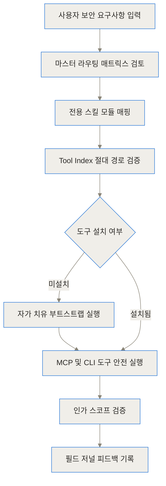
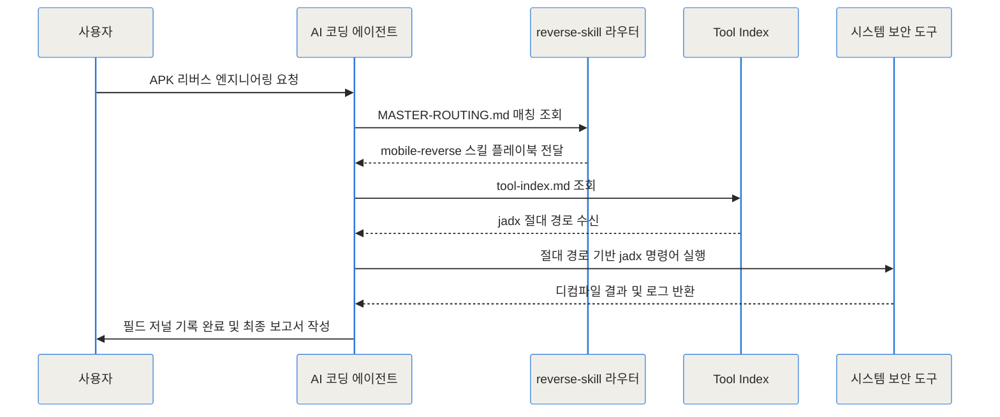
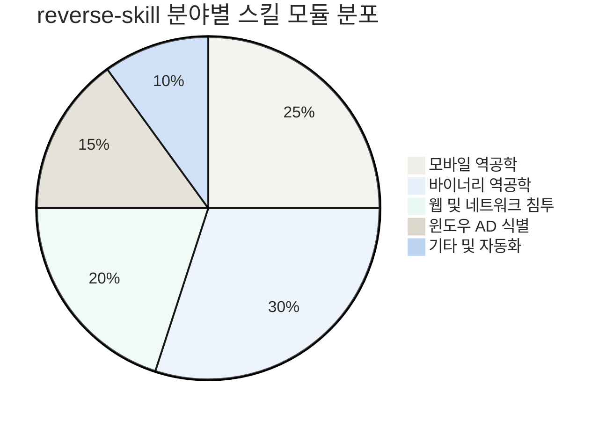
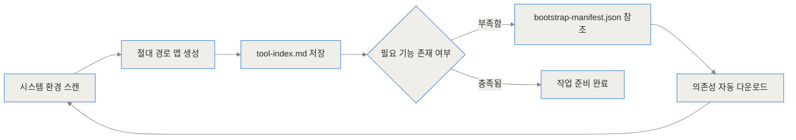
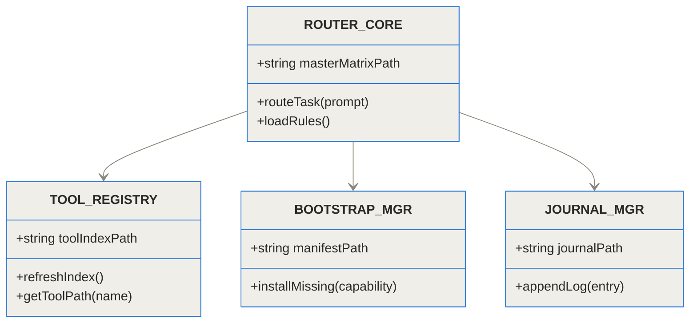
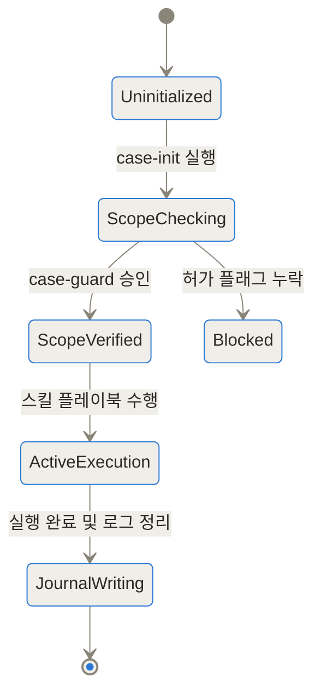
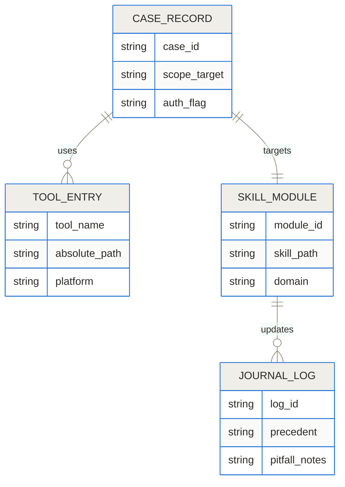

[reverse-skill GitHub 저장소](https://github.com/zhaoxuya520/reverse-skill)
[reverse-skill 릴리즈 노트](https://github.com/zhaoxuya520/reverse-skill/releases)

## TL;DR (한 줄 요약)
reverse-skill은 자연어로 터미널 명령을 무작위 추측하던 AI 코딩 에이전트에 엄격한 통제 기준과 보안 작업 경로를 제공하는 오픈소스 프레임워크예요.
'경로 우선 실행(Route-First, Execute-Second)' 모델을 바탕으로 시스템에 설치된 보안 도구의 절대 경로를 파악하고 인가된 대상 범위(Scope) 안에서만 작동하도록 제한하죠.
이를 통해 AI의 환각(Hallucination) 현상으로 인한 명령 오작동을 막고, APK 역공학, 바이너리 분석, 웹 침투 테스트의 재현성과 신뢰성을 획기적으로 높여줘요.

## AI 보안 분석에서 기존 방식이 겪던 치명적인 문제점은 무엇인가

AI 코딩 에이전트가 발전하면서 개발뿐만 아니라 리버스 엔지니어링(Reverse Engineering, 빌드된 소프트웨어를 역으로 분석해 구조나 원리를 파악하는 기술)이나 침투 테스트 영역에서도 대형 언어 모델(LLM)을 활용하려는 시도가 늘고 있어요. 하지만 일반적인 AI 에이전트를 보안 분석 작업에 그대로 투입하면 매우 치명적인 실행 격차(Execution Gap)가 발생하곤 하더라고요.

첫째로, AI 에이전트는 로컬 시스템에 어떤 보안 도구가 어디에 설치되어 있는지 정확히 알지 못해요. 그래서 존재하지 않는 옵션을 붙여 터미널 명령어를 실행하거나, `jadx`, `gdb`, `frida` 같은 도구가 환경변수에 등록되어 있지 않으면 명령 실패를 반복하며 무의미하게 토큰을 소비하죠. 심지어 존재하지 않는 CLI 명령어를 환각으로 만들어내어 환경을 오염시키기도 해요.

둘째로, 보안 작업은 엄격한 법적과 기술적 경계(Authorization Scope) 안에서만 이루어져야 해요. 인가되지 않은 IP나 파일 시스템을 조작하면 심각한 법적 문제나 시스템 파손으로 이어질 수 있죠. 하지만 기존 LLM 프롬프팅 방식은 상위 맥락을 쉽게 잊어버리고 통제 범위를 벗어나는 무작위 명령을 시도하는 경향이 있었어요.

셋째로, 보안 분석 과정에서 얻은 실패 경험이나 시행착오가 다음 작업으로 이어진다는 보장이 없었어요. 이전 시도에서 파악한 안티 디버깅 기법이나 난독화 패턴이 다음 프롬프트 제출 시 잊혀져 똑같은 시행착오를 처음부터 다시 반복하곤 했죠.



## reverse-skill은 어떤 원리로 AI를 통제하나 (쉬운 개념 이해)

[zhaoxuya520/reverse-skill 저장소](https://github.com/zhaoxuya520/reverse-skill)는 이 문제를 해결하기 위해 AI에게 직접적인 행동권을 바로 주지 않고, 체계적인 '항공 관제탑' 역할을 수행하는 스킬 라우팅 팩을 제시해요.

이 개념은 마치 베테랑 파일럿에게 초행길 비행을 맡길 때 비행 경로나 체크리스트를 전달하는 것과 같아요. 파일럿(AI 에이전트)이 아무 방향으로나 조종간을 잡지 않도록, 관제탑(reverse-skill)이 현재 기상 상태(로컬 도구 설치 상황)와 비행 허가 구역(인가 스코프)을 먼저 확인한 뒤 정확한 비행 매뉴얼(스킬 모듈)을 펼쳐주는 방식이죠.

이를 가능하게 하는 핵심 규칙이 바로 '경로 우선 실행, 실행 후순위(Route First, Execute Second)' 법칙이에요. 자연어로 요청이 들어오면 AI가 즉시 명령어를 터미널에 입력하는 것을 금지하고, 먼저 목적에 맞는 스킬 모듈과 도구의 절대 경로를 조회하도록 요구해요.



## 내부 구조와 작동 메커니즘은 어떻게 설계되었나 (Under the Hood)

reverse-skill의 내부 아키텍처는 결합도가 낮으면서도 제어가 매우 촘촘하게 연결된 여러 레이어로 구성되어 있어요. 프로젝트 구조는 단순히 텍스트 파일을 모아둔 것이 아니라, AI의 컨텍스트 윈도우에 주입되어 실행 흐름을 제약하는 실시간 프레임워크 역할을 해요.

| 플랫폼 / 구성 요소 | 요구 버전 / 도구 | 주요 역할 및 용도 |
| --- | --- | --- |
| Node.js | v22.12 이상 | MCP(Model Context Protocol) 브릿지 서버 및 자동화 로직 구동 |
| Python | 3.x 이상 | 동적 계측(Frida) 및 자동화 스크립트 실행 |
| Java / JDK | JDK 11 이상 | Android APK 디컴파일 도구(jadx 등) 실행 환경 |
| 주 지원 OS | Windows, Linux, macOS, Kali Linux | 스크립트 기반 도구 경로 인덱싱 및 샌드박스 제공 |

### 1. 마스터 라우팅 매트릭스 (Master Routing Matrix)

AI가 사용자의 요구사항을 분석할 때 첫 번째로 참조하는 핵심 이정표가 `MASTER-ROUTING.md`와 `SKILL.md`예요. 사용자가 "이 APK 파일에서 패킷 암호화 로직을 찾아줘"라고 요청하면, 라우팅 매트릭스가 요청의 의도를 감지하여 `skills/mobile-reverse/`에 정의된 절차로 즉시 유도해요.

각 모듈 안에는 해당 영역에 특화된 수순(Playbook)이 정립되어 있어서, AI가 임의로 절차를 건너뛰거나 잘못된 도구를 선택하는 일을 막아주더라고요.



### 2. 절대 경로 기반 도구 인덱싱 (Tool Indexing)

AI 에이전트가 터미널에서 가장 많이 일으키는 오류 중 하나는 명령어를 찾지 못하는 `command not found` 에러예요. reverse-skill은 이를 방지하기 위해 `refresh-tool-index.ps1` 또는 `refresh-tool-index.sh` 스크립트를 제공해요.

이 스크립트는 로컬 시스템의 디스크 전체와 PATH 경로를 스캔하여 IDA Pro, Ghidra, jadx, Frida, nmap, BurpSuite 등의 위치를 파악한 뒤 `tool-index.md`에 절대 경로 형태로 기록해 둬요. AI는 명령을 실행할 때 상대 경로가 아닌 `D:\Tools\jadx\bin\jadx.bat` 형태의 절대 경로를 직접 호출하므로 명령 실패율이 제로에 가깝게 줄어들죠.



### 3. 자가 치유형 의존성 부트스트랩 (Self-Healing Bootstrap)

만약 AI가 분석 작업을 수행하던 중 `tool-index.md`에 필요한 도구(예: `apktool`)가 빠져 있는 것을 발견하면 어떻게 할까요? 기존이라면 사용자에게 설치해 달라고 요청하거나 에러를 내뿜으며 멈췄을 거예요.

reverse-skill은 `bootstrap-reverse.ps1` 또는 `bootstrap-reverse.sh`와 `bootstrap-manifest.json` 모듈을 통해 자가 치유(Self-Healing) 설치 프로세스를 가동해요. 명시된 매니페스트 선언에 따라 부족한 소프트웨어를 검증된 릴리즈 출처에서 자동으로 다운로드하고 압축을 풀어 도구 인덱스에 새로 등록하더라고요.



### 4. 인가 스코프 케이스 게이트 (Scoped Case Authorization Gate)

보안 분석에서 가장 중요한 법적 안정성을 지키기 위해 `case-init` 및 `case-guard`라는 격리 장치가 동작해요. 격리된 사건 디렉터리(Case Directory)가 생성되고 내부에 허가 플래그가 설정되어야만 AI의 실행 권한이 활성화돼요.

만약 AI가 허가 플래그나 스코프 설정 파일을 확인하지 못한 상태에서 인가되지 않은 IP 스캐닝이나 디컴파일 명령을 수행하려 하면 프로그램 수준에서 차단당하게 돼요.



### 5. 경험 자가 진화: 필드 저널 (Field Journal)

분석 도중 특정 패커(Packer)를 만났거나, 특정 Java 버전 문제로 디컴파일이 깨지는 현상이 발생하면 AI는 분석 결과를 정리함과 동시에 `field-journal/` 디렉터리에 작업 경험(Precedent)과 주의사항(Pitfalls)을 마크다운 형태로 기록하도록 강제돼요.

동일한 프로젝트나 유사 대상에 대해 다음 작업을 진행할 때 AI는 이 필드 저널을 먼저 읽어들여 과거에 겪었던 시행착오를 되풀이하지 않죠.



## 실제 환경에서는 어떻게 설치하고 설정하나

reverse-skill은 단순한 standalone 실행 파일이 아니기 때문에 저장소를 클론하고 규칙 문서를 AI 클라이언트에 주입하는 과정으로 설치해요.

### 1단계: 저장소 클론 및 환경 준비

먼저 Node.js(v22.12 이상), Python 3, Java 환경이 설치되어 있는지 확인한 뒤 저장소를 가져와요.

```bash
git clone https://github.com/zhaoxuya520/reverse-skill.git
cd reverse-skill
```

### 2단계: 로컬 도구 인덱스 생성

현재 내 컴퓨터에 설치된 보안 도구들의 위치를 파악하기 위해 인덱스 갱신 스크립트를 실행해요.

Windows 환경 (PowerShell):
```powershell
powershell -NoProfile -ExecutionPolicy Bypass -File skills/scripts/refresh-tool-index.ps1
```

Linux / macOS / Kali Linux 환경:
```bash
bash skills/scripts/refresh-tool-index.sh
```

실행이 끝나면 `skills/tool-index.md` 파일에 로컬 환경의 도구 절대 경로가 정리되어 저장돼요.

### 3단계: AI 클라이언트 규칙 주입 (Rules Injection)

Claude Code, Cursor, Cline, Windsurf, Kiro 등의 AI 에이전트에 프로젝트 규칙으로 `RULES.md`와 `README_AI.md`를 등록하거나 컨텍스트 상단에 주입해요.

AI 클라이언트 시스템 프롬프트 예시 지시문:
```text
ALWAYS read RULES.md and skills/MASTER-ROUTING.md before processing any cybersecurity or reverse engineering request. Follow the Route-First principle.
```

```chartjs
{"type":"bar","data":{"labels":["자유 프롬프트 실행","reverse-skill 라우팅"],"datasets":[{"label":"작업 완료 시 평균 토큰 소비량","data":[385000,42000]}]}}
```

## 실전 활용 시나리오 3가지

### 시나리오 1: Android APK 리버스 엔지니어링 및 통신 로직 분석

모바일 애플리케이션 보안 점검 시 분석가가 AI에게 "target.apk 파일의 네트워크 통신 암호화 키 추출 과정을 점검해 줘"라고 지시하는 상황을 생각해 볼게요.

1. AI는 라우터 법칙에 따라 `skills/mobile-reverse/SKILL.md`를 읽어요.
2. `tool-index.md`에서 `jadx`와 `apktool`의 절대 경로를 확인해요.
3. `jadx -d ./output target.apk` 명령을 실행해 디컴파일을 완료해요.
4. 소스 코드 파싱 결과 암호화 모듈을 발견하면, `frida` 후킹 스크립트 작성 매뉴얼에 따라 가상 디바이스 연결 후 실시간 메모리 값을 검증해요.
5. 모든 결과와 특이사항은 `field-journal/precedent-mobile.md`에 산출물 형태로 누적돼요.

### 시나리오 2: C/C++ 네이티브 바이너리 취약점 분석

리눅스 ELF 바이너리의 버퍼 오버플로우 가능성을 조사하는 작업이에요.

1. AI가 `skills/binary-reverse/` 스킬 모듈로 진입해요.
2. 로컬에 설치된 `gdb-pwndbg` 또는 `radare2` 경로를 인덱스에서 조회해요.
3. 바이너리의 보호 기법(NX, ASLR, Canary 등)을 `checksec` 경로 명령으로 먼저 파악해요.
4. 정적 분석 플레이북에 따라 함수 심볼과 의심스러운 `strcpy` 호출 지점을 탐색한 후 보고서를 작성해요.

### 시나리오 3: 인가된 웹 시스템 보안성 점검

지정된 내부 웹 애플리케이션 범위 안에서 입력값 검증 취약점을 찾는 시나리오예요.

1. `case-init`으로 `case-web-01` 디렉터리가 생성되고 허가 대상 URL이 지정돼요.
2. AI는 `case-guard`를 거쳐 접근 승인 플래그를 확인해요.
3. `skills/pentest/` 매뉴얼을 따라 `nmap`으로 허용된 포트만 정밀 스캔하고 `ffuf` 경로를 통해 하위 디렉터리를 구조적으로 탐색해요.

```chartjs
{"type":"bar","data":{"labels":["일반 추측 실행","Tool Index 검증 실행"],"datasets":[{"label":"터미널 명령어 실행 성공률 퍼센트","data":[38,96]}]}}
```

## 기존 AI 에이전트 프롬프팅 및 다른 접근법과의 비교

| 비교 항목 | 기존 AI 에이전트 프롬프팅 | reverse-skill 프레임워크 |
| --- | --- | --- |
| 실행 전략 | 프롬프트 수신 즉시 임의 CLI 시도 | 경로 우선 매핑 후 순차 실행 (Route-First) |
| 도구 위치 파악 | PATH 환경변수 및 이름 추측 | Absolute Path 맵핑 (`tool-index.md`) |
| 도구 부재 시 동작 | 명령 에러 발생 후 우왕좌왕 | 자가 치유 부트스트랩 스크립트 실행 |
| 법적 권한 통제 | 통제 메커니즘 없음 | 케이스 게이트 (`case-guard`) 필수 검증 |
| 세션 간 지식 전달 | 대화 세션 종료 시 기억 소실 | 필드 저널 (`field-journal/`) 지속 누적 |
| 지원 에디터 | 단일 에디터 의존 | Claude Code, Cursor, Cline, Kiro 등 범용 |

## reverse-skill의 한계와 주의점은 무엇인가

reverse-skill은 AI 보안 분석의 신뢰성을 크게 높여주지만, 모든 상황을 해결해 주는 만능 도구는 아니에요.

첫째, 초기 환경 설정에 일정한 손길이 필요해요. Node.js 22.12 이상과 Python, Java 스택이 기본적으로 요구되며, 윈도우 환경에서는 PowerShell 실행 정책(ExecutionPolicy) 조정이 필요해요.

둘째, 타깃 시스템의 난독화 수준이 매우 높거나(예: VMProtect, Themida 적용 바이너리) 커스텀 커널 드라이버 분석 같은 고난도 영역에서는 AI 플레이북만으로 한계가 있으며 숙련된 보안 연구자의 개입이 필수적이에요.

셋째, '자가 치유 부트스트랩' 기능이 작동할 때 외부 패키지를 다운로드하므로, 완전히 폐쇄된 망(Air-Gapped Environment)에서는 스크립트가 로컬 미러 서버를 바라보도록 사전에 매니페스트를 수정해야 하는 제약이 있어요.

## 결론: AI 보안 자동화 생태계에 가져올 변화

[zhaoxuya520/reverse-skill 저장소](https://github.com/zhaoxuya520/reverse-skill)는 통제되지 않은 AI 모델이 보안이라는 위험천만한 영역에서 어떻게 제 자리를 찾을 수 있는지 보여주는 훌륭한 구조적 이정표예요.

단순히 프롬프트를 길게 작성하는 차원을 넘어, '경로 우선 실행', '절대 경로 도구 인덱싱', '권한 수용 케이스 게이트', '지속적 필드 저널'이라는 엔지니어링 통제 장치를 결합하여 비결정적인 LLM을 예측 가능하고 안전한 보안 에이전트로 업그레이드시켰죠.

인가된 리버스 엔지니어링이나 침투 테스트를 진행하는 보안 연구원, DevSecOps 팀, CTF 참가자라면 reverse-skill을 도입하여 AI의 환각과 터미널 오작동을 차단하고 업무 생산성을 극대화해 보시길 권해드려요.

## 자주 묻는 질문 (FAQ)

### reverse-skill은 독립 실행형 소프트웨어나 MCP 서버인가요?

reverse-skill은 독립 실행형 단일 프로그램이 아닙니다. Claude Code, Cursor, Cline 등의 AI 코딩 에이전트에 통합되어 보안 작업 경로와 도구 매핑, 가이드라인을 주입해 주는 기술 스킬 라우팅 프레임워크 팩입니다.

### MCP(Model Context Protocol)를 직접 지원하지 않는 개발 환경에서도 사용할 수 있나요?

네, 가능합니다. MCP 연동 방식 외에도 SKILL.md, MASTER-ROUTING.md, tool-index.md 등의 텍스트 규칙을 커스텀 시스템 프롬프트나 에디터 커스텀 규칙으로 주입하면 일반 CLI 에이전트 환경에서도 동작합니다.

### 무단 침투 테스트나 악성 행위에 악용될 위험은 없나요?

reverse-skill은 케이스 초기화(case-init) 및 권한 검증 게이트(case-guard)를 강제합니다. 인가 상태 플래그가 확인되지 않으면 공격성 명령 실행을 프로그램 차원에서 블록하므로 합법적으로 승인된 연구 범위 안에서만 작동하도록 방어되어 있습니다.

### 내 컴퓨터에 리버스 엔지니어링 도구가 설치되어 있지 않으면 작동하지 않나요?

필요한 도구가 없더라도 자가 치유 부트스트랩 스크립트(bootstrap-reverse)가 동작합니다. bootstrap-manifest.json 선언에 따라 jadx, apktool, frida, nmap 등 부족한 도구를 자동 탐색하여 설치하고 도구 인덱스에 등록해 줍니다.

### 어떤 AI 코딩 클라이언트와 호환되나요?

Claude Code, Cursor, Cline, Windsurf, Kiro, Codex CLI 등 사용자 정의 지침(Custom Instructions) 주입이나 MCP 연결을 지원하는 대부분의 최신 AI 코딩 에이전트 환경과 호환됩니다.


## References
- [https://github.com/zhaoxuya520/reverse-skill](https://github.com/zhaoxuya520/reverse-skill)
- [https://github.com/zhaoxuya520/reverse-skill/releases](https://github.com/zhaoxuya520/reverse-skill/releases)
