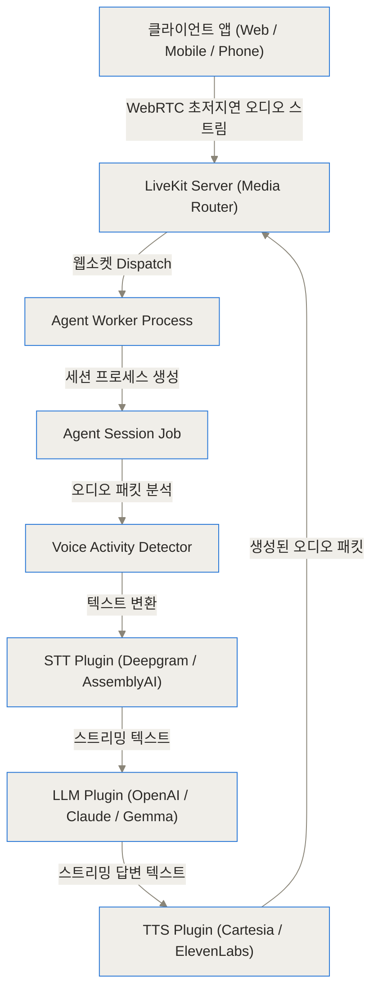
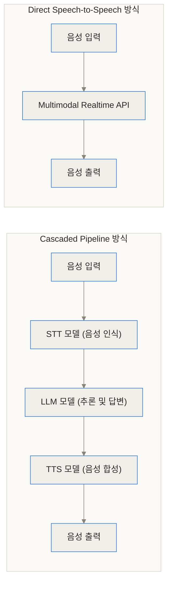
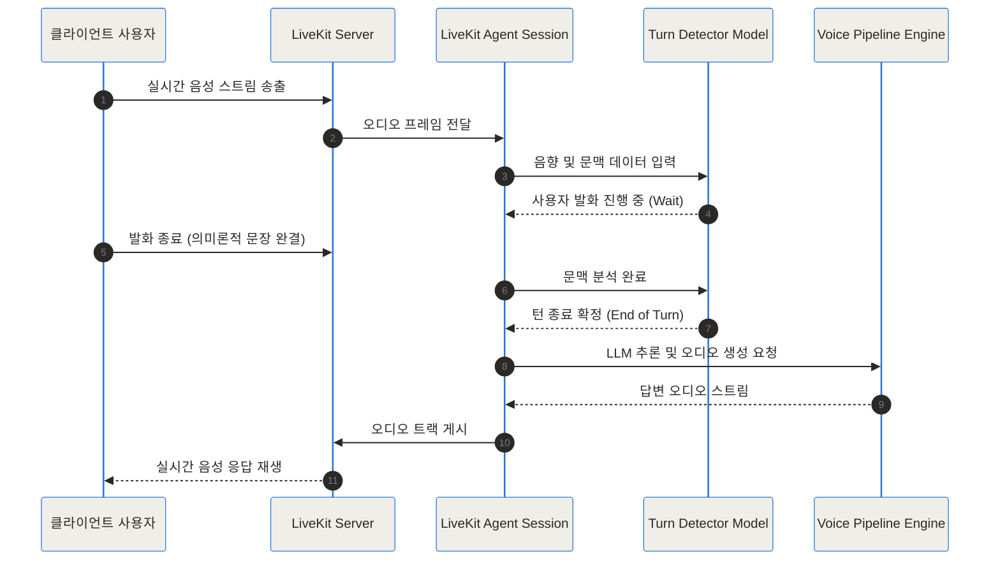
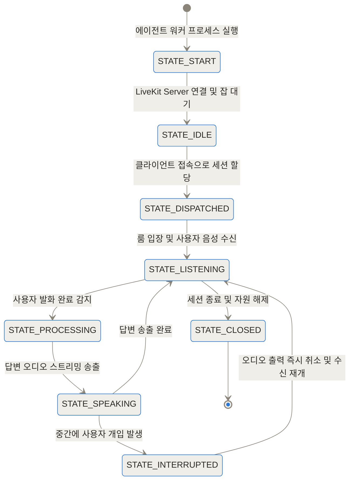
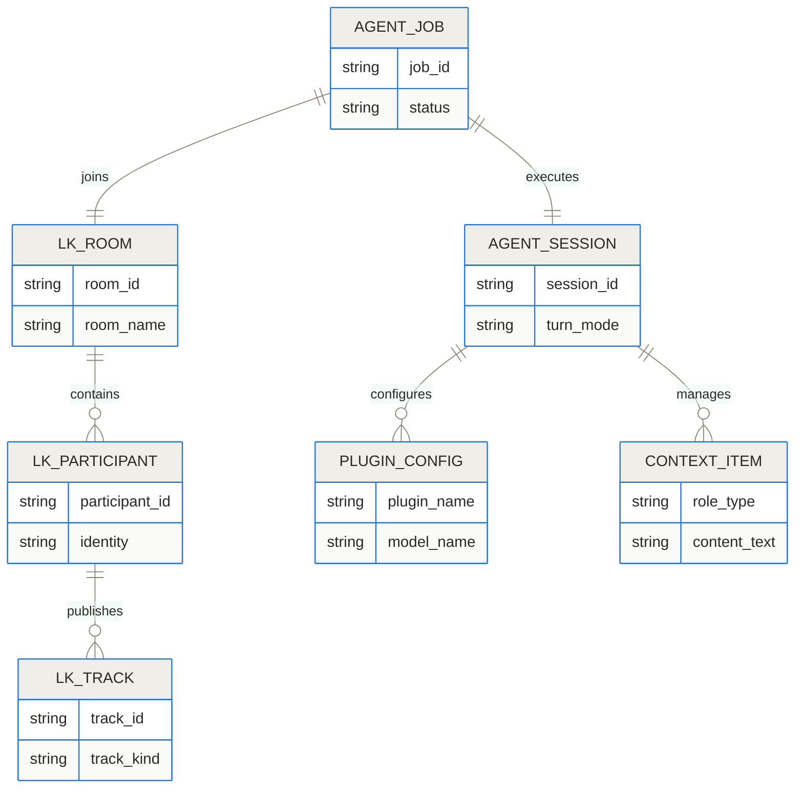
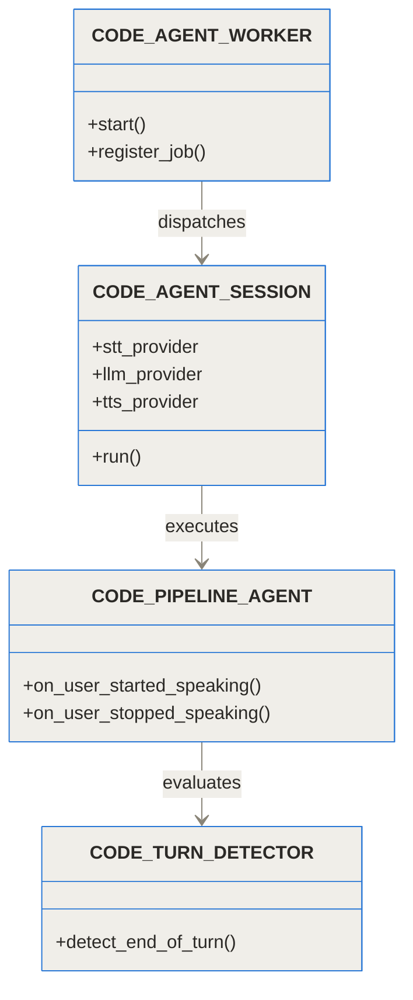
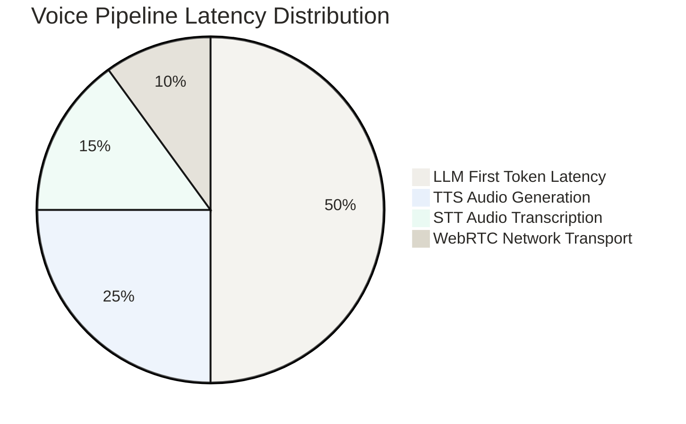
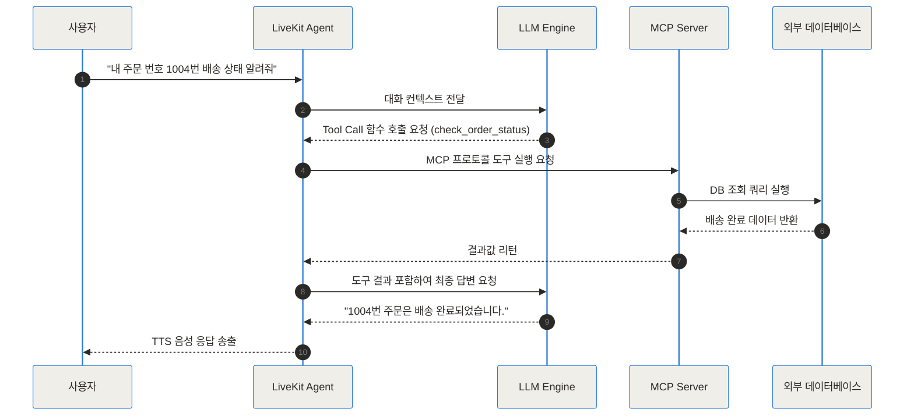

[LiveKit Agents GitHub 저장소](https://github.com/livekit/agents)
[LiveKit 공식 문서](https://docs.livekit.io/agents)
[LiveKit Cloud 플랫폼](https://cloud.livekit.io)


## TL;DR (한 줄 요약)

- LiveKit Agents는 WebRTC 기술 기반으로 수백 밀리초 수준의 초저지연 반응 속도를 제공하는 오픈소스 음성 AI 에이전트 개발 프레임워크입니다.
- 기존의 Cascaded 파이프라인(STT -> LLM -> TTS)과 최신 음성 대 음성(Speech-to-Speech) 모델을 모두 지원하여 완벽한 모듈화 및 커스텀 제어를 제공합니다.
- 고도화된 턴 디텍션(Turn Detection), 말 끊기(Interruption) 처리, MCP(Model Context Protocol) 연동 및 SIP 전화 망 연동을 지원하여 실제 서비스 구축에 즉시 적용할 수 있습니다.


## 대화형 음성 AI 개발이 까다로웠던 이유와 배경

최근 몇 년간 텍스트 기반 대화형 AI는 놀라운 발전을 이루었지만, 음성 기반 실시간 AI 대화 시스템을 구축하는 일은 여전히 수많은 개발자들에게 높은 진입 장벽이었습니다. 텍스트 대화는 수초 정도의 응답 지연이 발생해도 사용자가 자연스럽게 기다릴 수 있습니다. 하지만 사람 간의 음성 대화에서는 응답 지연이 300밀리초(ms)에서 500밀리초를 넘어서는 순간 대화의 흐름이 어색해지고 흐름이 깨지게 됩니다.

기존 음성 AI 시스템 구축 시 개발자들이 겪던 대표적인 어려움은 다음과 같습니다.

- **높은 지연 시간(Latency)**: 기존 HTTP/REST 기반 구조나 단순 웹소켓 연결에서는 오디오 데이터를 녹음한 뒤 파일 형태로 서버에 전송하고, 음성 인식(STT), 언어 모델(LLM), 음성 합성(TTS)을 순차적으로 거치면서 전체 지연 시간이 2초~3초 이상으로 늘어났습니다.
- **턴 제어와 말 끊기(Interruption)의 모호함**: 사람이 말을 끝냈는지 판별하는 정교한 Voice Activity Detection(VAD) 알고리즘이 부족하여, 사용자가 잠시 숨을 쉬거나 망설일 때 에이전트가 말을 덮어씌우거나 반대로 사용자가 에이전트의 말을 끊고 개입할 때 적절히 대답을 멈추지 못하는 문제가 있었습니다.
- **네트워크 변동성 및 인프라의 복잡성**: 모바일 네트워크나 불안정한 Wi-Fi 환경에서 오디오 패킷 손실이 발생하면 음성이 깨지거나 대화 세션이 끊어지는 현상이 빈번했습니다. 이를 안정적으로 관리하기 위한 RTC(Real-time Communication) 미디어 서버를 직접 운용하는 것은 극도로 높은 난이도를 요구합니다.

LiveKit Agents는 이러한 네트워크 인프라 문제와 오디오 파이프라인 처리 문제를 한 번에 해결하기 위해 탄생한 오픈소스 파이프라인 프레임워크입니다. 대표적인 실시간 대화 모델인 OpenAI ChatGPT의 Voice Mode 역시 LiveKit의 실시간 인프라를 기반으로 작동하고 있습니다.


## LiveKit Agents란 무엇인가: 일상 비유로 이해하기

LiveKit Agents를 쉽게 이해하자면 **'초고속 실시간 방송국 관제 시스템과 전문 동시통역 팀'**에 비유할 수 있습니다.

방송국 관제 시스템(LiveKit Server)은 시청자(사용자)와 방송 출연진(AI 에이전트) 간의 음성 및 영상 신호를 마이크로초 단위로 유연하게 전달해 주는 고성능 미디어 통신망입니다. 그리고 관제 시스템 뒤에서 실시간으로 말을 듣고, 생각하고, 답변 목소리를 만들어 내는 동시통역사 엔진이 바로 LiveKit Agents 프레임워크입니다.

LiveKit Agents는 미디어 전송 레이어로 WebRTC를 활용합니다. WebRTC(Web Real-Time Communication)는 웹 브라우저나 앱 간에 별도의 플러그인 없이 오디오, 비디오, 데이터를 실시간으로 동기화하여 전송하는 표준 기술입니다. 일반적인 HTTP 요청이 **'편지를 써서 우체통에 넣고 답장을 기다리는 방식'**이라면, LiveKit의 WebRTC 방식은 **'상대방과 직접 연결된 전용 전화를 개통해 두고 대화하는 방식'**과 같습니다.




## 작동 원리 심층 (Under the Hood)

LiveKit Agents는 유연한 오디오 파이프라인 설계를 지원합니다. 대화형 AI 구축 시 가장 널리 쓰이는 접근 방식인 Cascaded Pipeline과 차세대 대화 방식인 Direct Speech-to-Speech 방식을 모두 완벽하게 처리할 수 있습니다.



### 1. Cascaded Pipeline (STT -> LLM -> TTS)
Cascaded 파이프라인은 음성 인식(STT), 텍스트 언어 모델(LLM), 음성 합성(TTS) 세 가지 전문 모듈을 사슬처럼 연결하는 방식입니다. 이 방식의 최대 장점은 각 단계의 모듈을 프로젝트 요건에 맞게 자유롭게 조합(Mix & Match)할 수 있다는 점입니다. 예컨대 한국어 음성 인식률이 우수한 STT 엔진과 논리 추론이 우수한 LLM, 지연 시간이 짧은 TTS 엔진을 골라 연결할 수 있습니다.

- **STT (Speech-to-Text)**: 입력되는 실시간 오디오 패킷을 스트리밍 방식으로 수신하여 실시간 텍스트 토큰으로 변환합니다.
- **LLM (Large Language Model)**: 완성된 텍스트나 스트리밍 토큰을 전달받아 답변 텍스트 토큰을 즉시 반환합니다.
- **TTS (Text-to-Speech)**: LLM이 텍스트 문장을 완결하기 전이라도, 의미 단위의 첫 번째 토큰이 생성되는 즉시 오디오 청크(Chunk)로 합성하여 사용자에게 전송합니다.

### 2. Direct Speech-to-Speech (Multimodal Realtime API)
OpenAI Realtime API(`gpt-4o-realtime`, `gpt-mini-realtime`)나 Gemini Live와 같은 최신 네이티브 음성 모델을 활용하는 방식입니다. 중간에 텍스트 변환 과정을 거치지 않고 오디오 바이너리 스트림을 모델에 직접 입력하고, 모델로부터 오디오 바이너리 스트림을 직접 전달받습니다. 중간 변환 단계가 생략되므로 지연 시간을 극도로 줄일 수 있으며, 억양, 감정표현, 어조까지 모델이 직접 인지하고 표현할 수 있습니다.

```chartjs
{"type":"bar","data":{"labels":["기존 HTTP 파이프라인","LiveKit Cascaded (STT+LLM+TTS)","LiveKit Direct Realtime API","사람 간 대화 반응 속도"],"datasets":[{"label":"평균 응답 지연 시간 (ms)","data":[2200,550,280,300]}]}}
```

### 3. 의미론적 턴 디텍션 (Semantic Turn Detection)
대화형 음성 AI에서 가장 어려운 요소 중 하나는 사용자가 말을 마쳤는지 판단하는 것입니다. 단순 음량 기반 VAD를 사용할 경우 사용자가 "음... 그렇다면..." 하면서 1초 정도 뜸을 들일 때 AI가 성급하게 대화를 치고 들어오는 실수를 범합니다.

LiveKit Agents는 이를 해결하기 위해 트랜스포머 기반의 **Turn Detector Model**을 탑재하고 있습니다. 이 모델은 소리의 음향적 정보(Acoustic Cues)뿐만 아니라, 오디오에서 변환된 텍스트의 문법적·의미론적 맥락(Semantic Context)을 동시에 분석합니다. 문장이 완결되었는지 여부를 실시간으로 예측하여, 사용자 대화의 흐름을 자연스럽게 보장합니다.



### 4. 세션 생명주기 및 상태 관리
LiveKit Agents 프레임워크는 분산 환경에서 다수의 에이전트 워커(Worker) 프로세스를 관리합니다. 각 사용자 세션은 독립된 Subprocess로 분리되어 격리 실행되므로, 하나의 세션에서 에러가 발생하더라도 전체 서버 시스템에 영향을 주지 않습니다.



### 5. 데이터 스키마 및 아키텍처 관계
LiveKit Agents 내부에서 세션, 미디어 트랙, 플러그인, 컨텍스트 메모리가 어떻게 결합되어 작동하는지 스키마 구조로 파악할 수 있습니다.



### 6. 핵심 코드 구조 및 클래스 다이어그램
파이프라인을 이끄는 주요 클래스들의 상호 작용과 상속 관계입니다.



### 7. 파이프라인 지연 시간 요소별 비중
Cascaded 음성 AI 파이프라인에서 응답 시간에 미치는 각 요소별 비중을 분석한 데이터입니다. LLM의 첫 번째 토큰 생성 시간(TTFT)이 전체 지연 시간의 절반 이상을 차지하는 것을 확인할 수 있습니다.



```chartjs
{"type":"bar","data":{"labels":["기존 HTTP REST 폴링","웹소켓 데이터 패킷 전송","LiveKit WebRTC 데이터 패킷 전송"],"datasets":[{"label":"네트워크 오버헤드 지연 (ms)","data":[850,220,45]}]}}
```


## 구현 및 코드 예시: 어떻게 설치하고 구축하나

LiveKit Agents는 Python SDK와 Node.js/TypeScript SDK를 제공합니다. 아래는 가장 많이 활용되는 Python 프레임워크 기반의 설치 및 실전 구축 방법입니다.

### 1. 패키지 설치
기본 에이전트 라이브러리와 함께 Deepgram(STT), OpenAI(LLM), Cartesia(TTS) 등의 플러그인을 한 번에 설치합니다.

```bash
pip install "livekit-agents[openai,deepgram,cartesia]"
```

### 2. 음성 AI 에이전트 작성 (`agent.py`)
다음은 사용자가 방에 들어왔을 때 인사하고, 실시간 대화를 나누는 음성 에이전트의 전체 예시 코드입니다.

```python code
import asyncio
from livekit.agents import AutoSubscribe, JobContext, WorkerOptions, cli, llm
from livekit.agents.pipeline import VoicePipelineAgent
from livekit.plugins import cartesia, deepgram, openai

async def entrypoint(ctx: JobContext):
    # 세션 룸 연결 설정
    await ctx.connect(auto_subscribe=AutoSubscribe.AUDIO_ONLY)

    # 대화 컨텍스트 초기화
    initial_ctx = llm.ChatContext().append(
        role="system",
        text="당신은 친절하고 전문적인 AI 고객 지원 상담원입니다. 한국어로 자연스럽고 정중하게 답변하세요."
    )

    # 실시간 음성 파이프라인 구성
    agent = VoicePipelineAgent(
        vad=openai.VAD.load(),
        stt=deepgram.STT(model="nova-3", language="ko"),
        llm=openai.LLM(model="gpt-4o-mini"),
        tts=cartesia.TTS(model="sonic-multilingual", voice="79a125e8-cd45-4c13-8a67-188112f4dd22"),
        chat_ctx=initial_ctx,
    )

    # 에이전트를 LiveKit 룸에 시작
    agent.start(ctx.room)

    # 사용자 입장 시 첫 인사말 송출
    await agent.say("안녕하세요! 무엇을 도와드릴까요?", allow_interruptions=True)

if __name__ == "__main__":
    cli.run_app(WorkerOptions(entrypoint_fnc=entrypoint))
```

### 3. MCP (Model Context Protocol) 및 외부 도구(Tools) 연동
LiveKit Agents는 LLM이 대화 도중 외부 DB나 API를 조회할 수 있는 Tool Calling을 내장하고 있으며, 최근 표준으로 자리 잡은 MCP(Model Context Protocol) 서버 연동을 완벽히 지원합니다.




## 실전 활용 시나리오

### 시나리오 1: AICC 고객센터 자동화 및 SIP 전화 망 연동
LiveKit의 SIP Gateway 통신을 이용하면 기존 기업용 전화망(PSTN)과 연동할 수 있습니다. 1800이나 080 전화번호로 전화가 걸려왔을 때 AI 에이전트가 통화를 수신하고, 사용자의 음성을 실시간 분석하여 예약 확인, 주소 변경, 자주 묻는 질문(FAQ)에 대응합니다. 유선 통화 특유의 노이즈 처리와 패킷 유실을 제어하여 깨끗한 음성품질을 유지합니다.

### 시나리오 2: 원격 의료(Telehealth) 및 시각 기반 맞춤형 조언
LiveKit Agents는 음성뿐만 아니라 비디오 트랙도 수신할 수 있습니다. 사용자가 모바일 카메라로 피부 질환 부위나 약품 라벨을 촬영하여 비디오 스트림을 공유하면, 음성 AI가 실시간으로 화면 이미지(Vision)를 함께 분석하여 대답합니다. "지금 카메라에 보이는 약은 하루에 두 번 복용하시는 약입니다"와 같이 시각과 음성이 결합된 멀티모달 서비스 구축이 가능합니다.

### 시나리오 3: 화면 공유 기반의 기술 지원 및 화상 코칭
사용자가 PC 화면을 공유하며 소프트웨어 사용 방법을 물어보면, AI 에이전트가 화면의 클릭 위치와 에러 메시지를 실시간 인식하여 음성으로 차근차근 해결 방법을 안내합니다.


## 비교 분석 및 트레이드오프

기술 선택을 고민 중인 엔지니어들을 위해 주요 방식과 플랫폼들의 차이점을 표로 정리했습니다.


| 비교 항목 | Cascaded Pipeline (STT+LLM+TTS) | Direct Speech-to-Speech (Realtime API) |
| :--- | :--- | :--- |
| **지연 시간 (Latency)** | 400ms ~ 800ms | 200ms ~ 350ms |
| **유연성 및 커스텀** | 최고 (각 단계별 모델 자유롭게 교체 가능) | 제한적 (제공사의 모놀리식 API에 의존) |
| **비용 효율성** | 오픈소스 LLM/STT/TTS 조합으로 최적화 가능 | 음성 토큰 단위 과금으로 비교적 비쌈 |
| **감정 및 어조 표현** | TTS 엔진의 오디오 태그 설정 필요 | 네이티브 모델이 감정과 억양을 자연스럽게 표현 |
| **한국어 인식 정확도** | 국내 특화 STT 조합 시 최상급 | 모델 버전별로 편차가 존재함 |


| 기능 및 특징 | LiveKit Agents | 블랙박스 SaaS (Vapi, Bland AI 등) |
| :--- | :--- | :--- |
| **소스 코드 제어** | 100% 오픈소스 파이프라인 (Apache 2.0) | 제공사 플랫폼 내부에서 작동하는 블랙박스 |
| **인프라 호스팅** | 온프레미스 자가 호스팅 / Cloud 선택 가능 | 100% 제공사 인프라에 종속 |
| **비용 구조** | 사용한 LLM/미디어 트랙 비용만 발생 | 분당 커스텀 마진 수수료 추가 과금 |
| **도구 연동성** | MCP, 백엔드 직접 연결, 프론트엔드 RPC 등 자유로움 | 플랫폼이 제공하는 정해진 Webhook 위주 |


| 호스팅 옵션 | 자가 호스팅 (Self-Hosted LiveKit Server) | LiveKit Cloud 관리형 서비스 |
| :--- | :--- | :--- |
| **운영 난이도** | 높은 네트워크 및 RTC 인프라 지식 요구 | 클릭 한 번으로 전 세계 엣지 노드 자동 배포 |
| **글로벌 지연 시간** | 자체 서버 위치에 따라 지연 시간 변동 | 글로벌 분산 PoP 제공으로 최단 거리 연결 |
| **데이터 보안** | 완전한 로컬 망 구축 및 보안 가이드 준수 용이 | SOC2 Type II, HIPAA 등 규정 준수 인증 활용 |


## 솔직한 평가: 한계와 적용 시 주의할 점

LiveKit Agents는 실시간 음성 AI 구축에 있어 현존하는 가장 완성도 높은 프레임워크 중 하나지만, 도입 전 고려해야 할 명확한 리스크와 한계점이 존재합니다.

- **API 호출 및 오디오 토큰 비용 관리**: Realtime API나 Cartesia와 같은 고성능 음성 파이프라인을 24시간 연속 운용할 경우, 텍스트 기반 대화 대비 5배에서 10배 이상의 비용이 발생할 수 있습니다. VAD 세팅을 정교하게 하지 않으면 사용자가 조용히 있는 동안에도 지속적으로 오디오 스트림 비용이 청구될 수 있습니다.
- **네트워크 환경에 따른 가변적 경험**: 사용자의 모바일 네트워크 전파 상태가 불량하여 패킷 유실률이 15% 이상으로 치솟을 경우, 아무리 백엔드가 뛰어나도 음성 끊김 현상이 발생할 수 있습니다.
- **환각(Hallucination)의 실시간성 리스크**: 텍스트 대화와 달리 음성 대화에서는 AI가 잘못된 단어나 내용을 발화하기 시작하면 실시간으로 중간에 가로채고 교정하기가 매우 까다롭습니다. 프롬프트 세이프가드 구축이 필수적입니다.


## 마무리 및 전망

실시간 대화형 음성 AI는 단순한 재미용 시데모 수준을 넘어, 고객센터 자동화, 의료 비서, 교육, 피트니스 트레이너 등 실제 산업 현장에서 필수적인 서비스 형태로 자리 잡고 있습니다. 

LiveKit Agents는 복잡한 WebRTC 네트워크 인프라 구축의 고통을 덜어주고, 개발자가 대화 로직과 비즈니스 가치 창출에만 집중할 수 있게 도와주는 프레임워크입니다. 자체적인 커스텀 음성 AI 서비스를 구축하려는 팀이라면 가장 먼저 검토해 볼 가치가 충분한 도구입니다.

## 자주 묻는 질문 (FAQ)

### LiveKit Agents는 오픈소스로 직접 온프레미스 환경에 구축이 가능한가요?

네, LiveKit Agents 프레임워크와 LiveKit Server는 Apache 2.0 라이선스로 완벽히 공개되어 있는 오픈소스입니다. 자체 온프레미스 서버나 Kubernetes 클러스터에 배포하여 데이터 외부 유출 없이 인하우스 음성 AI 서비스를 구축할 수 있습니다.

### OpenAI Realtime API 같은 스피치 투 스피치(Speech-to-Speech) 모델도 사용할 수 있나요?

네, LiveKit Agents는 STT-LLM-TTS 조합 파이프라인뿐만 아니라, OpenAI Realtime API(`gpt-4o-realtime`)나 Gemini Live와 같은 최신 스피치 투 스피치 모델 전용 플러그인을 기본 제공합니다. 단 한 줄의 인스턴스 변경으로 두 방식을 유연하게 전환할 수 있습니다.

### 사용자가 에이전트의 말을 중간에 끊었을 때(Interruption) 어떻게 처리되나요?

사용자의 음성 입력이 수신되는 즉시 에이전트의 VAD가 이를 감지하여 현재 송출 중이던 TTS 오디오 패킷 버퍼를 즉시 비우고 재생을 중단시킵니다. 동시에 수신된 사용자의 새로운 발화를 기반으로 대화 맥락을 즉시 재계산합니다.

### 기존 유선 전화망(PSTN) 연결을 통한 AI 전화 응대 서비스 구축이 가능한가요?

네, LiveKit의 SIP Gateway 스택을 활성화하면 기존 전화 통신사 및 PBX 시스템과 연동할 수 있습니다. 1800번이나 일반 전화번호로 들어오는 걸려오는 전화(Inbound) 및 걸어가는 전화(Outbound)를 AI 에이전트가 직접 처리하도록 구현할 수 있습니다.

### LiveKit Agents 구축 시 주요 지연 시간(Latency) 감소 요인은 무엇인가요?

첫째, HTTP 대신 WebRTC를 통해 오디오 스트림을 마이크로초 단위로 전달합니다. 둘째, STT 및 LLM, TTS를 독립적으로 문장 완결을 기다리지 않고 청크(Chunk) 단위로 스트리밍 처리합니다. 셋째, 의미론적 턴 디텍션을 사용하여 무의미한 대기 시간을 최적화합니다.


## References
- [https://github.com/livekit/agents](https://github.com/livekit/agents)
- [https://docs.livekit.io/agents](https://docs.livekit.io/agents)
- [https://cloud.livekit.io](https://cloud.livekit.io)
