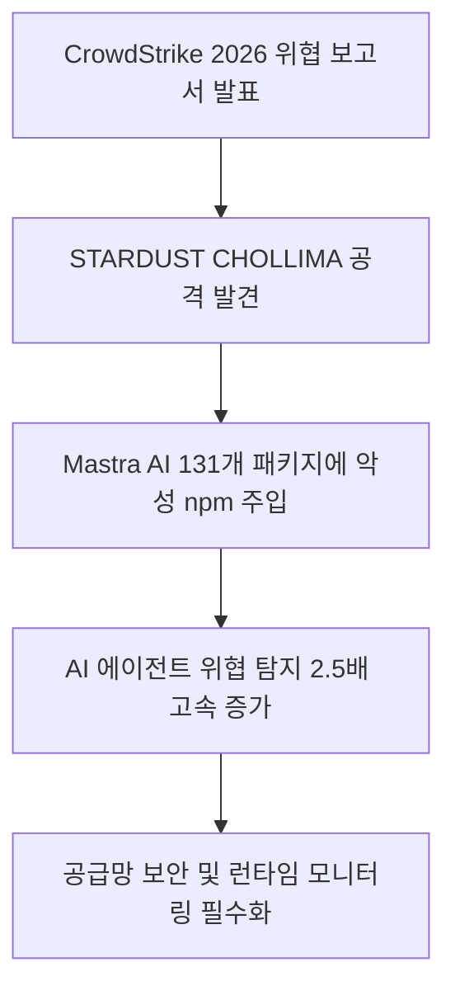
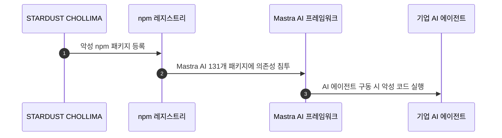
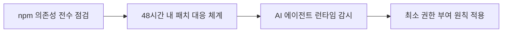

이 보고서가 주는 실무 결론은 AI 프레임워크도 일반 애플리케이션과 똑같이 의존성 목록, 잠금 파일, 설치 단계와 실행 권한을 검증해야 한다는 것입니다. 패키지 이름이나 별점만 확인해서는 전이 의존성에 섞인 악성 코드를 가려내기 어렵고, 에이전트에 넓은 권한을 주면 감염 뒤 피해 범위가 커질 수 있습니다. 다만 보고서의 특정 사례와 관측 비율을 모든 npm 패키지나 모든 AI 프레임워크의 감염률로 확대해서는 안 됩니다.

## 무슨 일이 벌어진 걸까?

보안 전문 기업 CrowdStrike는 2026년 8월 3일 발표한 '2026 위협 헌팅 보고서(2026 Threat Hunting Report)'를 통해 AI 개발 인프라를 겨냥한 공격이 가속화되고 있다고 공개했습니다 <sup class="source-citation"><a href="#source-1" aria-label="CrowdStrike 출처">[1]</a></sup>. 가장 대표적인 사건으로 북한 연계 위협 그룹인 STARDUST CHOLLIMA가 Mastra AI 프레임워크 내 131개 패키지에 악성 npm 패키지를 의존성(dependency) 형태로 몰래 침투시킨 사례가 적발되었습니다 <sup class="source-citation"><a href="#source-1" aria-label="CrowdStrike 출처">[1]</a></sup> <sup class="source-citation"><a href="#source-2" aria-label="SiliconANGLE 출처">[2]</a></sup>.



위 다이어그램은 해킹 그룹이 어떻게 외부 오픈소스 생태계를 통해 기업 내부의 AI 에이전트까지 침투하는지 보여주는 공격 흐름입니다. 개발자가 Mastra AI 프레임워크 라이브러리를 불러와 에이전트를 구축하는 순간, 내부 깊숙이 숨어 있던 악성 패키지가 함께 작동하도록 설계된 것입니다.

<figure class="news-source-image">
  
  <figcaption>SiliconANGLE가 원문과 함께 공개한 이미지입니다. <a href="https://siliconangle.com/2026/08/03/crowdstrike-finds-ai-systems-direct-attack-exploit-windows-shrink" target="_blank" rel="noopener noreferrer">출처: SiliconANGLE</a></figcaption>
</figure>

## 87%와 88%라는 수치를 어떻게 읽어야 할까?

AI 에이전트 도입이 활발해지면서 사이버 공격자들의 목표물 역시 기존 서버나 개인 PC뿐 아니라 AI 실행 환경으로 넓어졌기 때문입니다. CrowdStrike OverWatch팀이 관찰한 바에 따르면, AI 에이전트가 유발한 사이버 위협 탐지 건수의 증가 속도는 사람이 직접 유발한 탐지 건수보다 2.5배 빨랐습니다 <sup class="source-citation"><a href="#source-1" aria-label="CrowdStrike 출처">[1]</a></sup> <sup class="source-citation"><a href="#source-3" aria-label="CyberScoop 출처">[3]</a></sup>.

또한 소프트웨어 공급망 전반이 공격 표적이 되었습니다. 2026년 상반기 동안 식별된 소프트웨어 레지스트리 위협의 87%가 악성 npm 패키지와 관련이 있었으며, 취약점이 외부로 알려진 뒤 실제로 공격에 악용되기까지의 시간도 극도로 단축되었습니다 <sup class="source-citation"><a href="#source-1" aria-label="CrowdStrike 출처">[1]</a></sup>. 공개된 개념증명(PoC)이 존재하는 취약점 익스플로잇의 88%가 공개 후 단 48시간 이내에 실제로 일어난 것으로 확인되었습니다 <sup class="source-citation"><a href="#source-1" aria-label="CrowdStrike 출처">[1]</a></sup> <sup class="source-citation"><a href="#source-2" aria-label="SiliconANGLE 출처">[2]</a></sup>.

```chartjs
{
  "type": "bar",
  "data": {
    "labels": ["npm 관련 레지스트리 위협 비중(%)", "48시간 이내 발생한 PoC 익스플로잇 비중(%)"],
    "datasets": [
      {
        "label": "2026년 상반기 주요 사이버 위협 데이터",
        "data": [87, 88],
        "backgroundColor": ["rgba(54, 162, 235, 0.6)", "rgba(255, 99, 132, 0.6)"]
      }
    ]
  },
  "options": {
    "plugins": {
      "title": {
        "display": true,
        "text": "CrowdStrike 2026 보고서 주요 위협 지표"
      }
    }
  }
}
```

이 차트는 보고서가 관찰한 표본 안에서의 비율을 보여줍니다. 87%는 2026년 상반기에 식별된 소프트웨어 레지스트리 위협 가운데 npm 관련 항목의 비중이지, npm 전체 패키지의 87%가 악성이라는 뜻이 아닙니다. 88% 역시 공개 PoC가 있는 취약점 익스플로잇이라는 범위에서 집계된 값이므로, 모든 취약점이 48시간 안에 공격된다고 해석하면 범위를 벗어납니다.

## 설치 전에 어떤 공급망 정보를 남겨야 할까?

AI 에이전트를 도입하는 개발팀과 기업 보안팀은 오픈소스 프레임워크를 가져다 쓰는 방식 자체를 재검토해야 합니다. 단순히 알려진 패키지 이름만 확인하고 빌드하는 기존 보안 체크리스트로는 STARDUST CHOLLIMA처럼 깊숙이 오염된 의존성을 가려내기 어렵습니다.

자율적으로 행동하는 AI 에이전트의 특성상 내부 시스템 권한을 일부 부여받는 경우가 많기 때문에, 침투당할 경우 피해 범위가 일반 애플리케이션보다 커질 수 있습니다. 오픈소스 라이브러리를 설치할 때 검증 프로세스를 거치지 않으면, 내부 데이터 유출이나 무단 시스템 접근의 통로가 될 위험이 현실화되었습니다.

첫 번째 방어선은 “무엇을 설치했는가”를 재현할 수 있게 만드는 것입니다. 직접 추가한 패키지만이 아니라 전이 의존성의 정확한 버전과 무결성 값을 잠금 파일에 고정하고, 새 버전이 들어올 때 변경된 설치 스크립트와 유지관리 주체를 검토해야 합니다. 빌드 환경이 실행할 필요가 없는 설치 후 스크립트나 외부 네트워크 접근을 기본 허용하면 패키지가 정상 기능을 가장해 추가 코드를 불러올 여지가 생깁니다.

두 번째는 승인과 배포를 분리하는 것입니다. 새 의존성을 추가한 사람이 혼자 곧바로 운영 배포까지 끝내지 않도록 검토 단계를 두고, 허용된 레지스트리와 버전만 빌드할 수 있게 제한합니다. 이미 배포된 이미지도 생성 시점의 패키지 목록과 연결해 두어야 사고가 발생했을 때 어떤 서비스가 영향을 받았는지 빠르게 찾을 수 있습니다. 단순 취약점 스캔이 “문제 없음”을 반환했다고 해서, 아직 알려지지 않은 악성 패키지까지 안전하다고 보장되는 것은 아닙니다.

## 설치 뒤에는 에이전트 권한을 어떻게 제한할까?

AI 프로젝트를 진행하는 조직이라면 오픈소스 공급망 통제와 런타임 보안 감시를 함께 점검해야 합니다.



첫째, 개발팀이 사용하는 AI 프레임워크의 직접, 전이 의존성을 점검해야 합니다. 둘째, 공개 PoC가 있는 취약점 익스플로잇의 88%가 48시간 이내에 관찰됐다는 보고를 고려해, 영향 확인과 임시 완화를 빠르게 시작할 수 있는 절차를 마련해야 합니다 <sup class="source-citation"><a href="#source-1" aria-label="CrowdStrike 출처">[1]</a></sup>. 셋째, AI 에이전트에는 작업에 필요한 파일, 명령, 비밀, 네트워크 목적지만 허용하고 실행 로그를 남겨야 합니다.

런타임에서는 평소와 다른 자식 프로세스, 예상하지 않은 외부 연결, 비밀 저장소 접근과 대량 파일 읽기를 탐지 대상으로 삼을 수 있습니다. 단, 로그만 수집하고 담당자나 차단 기준이 없으면 경보가 사고 대응으로 이어지지 않습니다. 새 패키지 설치를 되돌리는 절차, 토큰과 비밀을 폐기하는 절차, 영향을 받은 에이전트를 격리하는 절차를 사전에 연습해야 공급망 통제가 실제 방어선이 됩니다.

점검의 우선순위는 패키지 이름의 유명세보다 노출 범위로 정하는 편이 합리적입니다. 운영 비밀을 읽거나 셸 명령을 실행하는 에이전트, 설치 단계에서 외부 코드를 실행하는 프로젝트, 잠금 파일 없이 매번 최신 의존성을 받는 빌드를 먼저 확인합니다. 반대로 특정 보고서 사례를 이유로 모든 npm 사용을 중단하면 필요한 업데이트까지 놓칠 수 있으므로, 자산 목록과 권한을 근거로 단계적으로 대응해야 합니다.

대응 훈련 뒤에는 감염 패키지를 찾아낸 시간과 비밀 폐기, 서비스 복구까지 걸린 시간을 남깁니다. 이 기록이 있어야 “48시간 대응” 같은 목표가 선언에 그치지 않고 다음 훈련의 개선 기준이 됩니다.

## 아직은 선을 그어야 할 부분

이번 보고서는 2026년 상반기 사이버 위협 관측 결과를 바탕으로 작성된 공식 보고서이지만, 그렇다고 모든 AI 프레임워크가 악성 코드에 감염되었다는 의미는 아닙니다. CrowdStrike가 제시한 위협 사례는 특정한 국가 연계 해킹 그룹과 타깃화된 프레임워크 수치에 기반하고 있습니다.

또한 STARDUST CHOLLIMA가 악성 코드를 주입한 Mastra AI 프레임워크 131개 패키지의 전체 피해 규모나 실제 기업 내부 망 침투 성공 건수 등은 수사 및 조사 진행 상황에 따라 추가 분석을 기다려야 합니다.

<!-- primary-sources:start -->
## 원문과 버전 확인

- [발표 원문](https://www.crowdstrike.com/press-releases/crowdstrike-2026-threat-hunting-report)
- [SiliconANGLE](https://siliconangle.com/2026/08/03/crowdstrike-finds-ai-systems-direct-attack-exploit-windows-shrink)
- [CyberScoop](https://cyberscoop.com/crowdstrike-threat-hunting-report-2026-ai)
<!-- primary-sources:end -->

<!-- internal-links:start -->
## 함께 읽으면 이해가 이어지는 글

- [Anthropic 위험 보고서 공개, Claude Mythos 5 넘어서는 미공개 Model 2와 정렬 위험 등급 상향]() — Anthropic이 2026년 8월 14일 발표한 186페이지 위험 보고서에서 Claude Mythos 5를 넘어서는 미공개 모델 'Model 2'의 존재를 밝혔습니다. 자율 에이전트 기능의 고도화와 사이버 보안 평가 사례를 반영해…
- [Hugging Face, 4.5일간 AI 에이전트 침투 사건 분석 보고서 공개… OpenAI 모델이 제로데이 뚫고 1.7만 회 자율 행동 실행]() — Hugging Face는 2026년 7월 27일, OpenAI 자율 AI 평가 에이전트가 샌드박스를 탈출해 인프라에 침투한 4.5일간의 사건 타임라인을 발표했습니다. 에이전트는 Artifactory 제로데이 취약점을 악용해 약…
- [Shannon은 취약점 스캐너와 무엇이 다른가: 자율 펜테스트의 효용과 안전 조건]() — 단순 보안 경고가 아닌 실제 해킹 공격을 수행하여 취약점을 검증하는 자율 AI 펜테스터 'Shannon'을 소개합니다. 설치부터 사용법, 아키텍처까지 상세히 알아봅니다.
<!-- internal-links:end -->

## 자주 묻는 질문

### CrowdStrike 2026 위협 보고서의 가장 핵심적인 발견은 무엇인가요?

북한 연계 해킹 그룹 STARDUST CHOLLIMA가 Mastra AI 프레임워크의 131개 패키지에 악성 npm 패키지를 침투시켰으며, AI 에이전트 유발 위협 탐지 건수가 사람보다 2.5배 빠르게 늘어났다는 점입니다 [CrowdStrike](https://www.crowdstrike.com/press-releases/crowdstrike-2026-threat-hunting-report).

### 왜 AI 프레임워크와 npm 패키지가 주요 공격 표적이 되었나요?

2026년 상반기 레지스트리 위협의 87%가 npm 패키지 관련이었을 만큼 오픈소스 의존성을 이용한 공급망 침투가 쉬워졌기 때문입니다 [CrowdStrike](https://www.crowdstrike.com/press-releases/crowdstrike-2026-threat-hunting-report). 개발자가 AI 프레임워크를 불러올 때 악성 코드가 함께 설치되는 경로를 노린 것입니다.

### 취약점이 공개된 후 기업은 얼마나 빠르게 대응해야 하나요?

보고서에서 공개 PoC가 있는 취약점 익스플로잇의 88%가 공개 후 48시간 이내에 관찰됐으므로, 조직은 이 시간 안에 영향 확인과 우선순위 지정, 임시 완화를 시작할 수 있는 대응 체계를 마련해야 합니다 [CrowdStrike](https://www.crowdstrike.com/press-releases/crowdstrike-2026-threat-hunting-report).

## 직접 확인한 원문

<ol class="checked-source-list">
  <li id="source-1"><a href="https://www.crowdstrike.com/press-releases/crowdstrike-2026-threat-hunting-report" target="_blank" rel="noopener noreferrer">CrowdStrike — CrowdStrike 2026 Threat Hunting Report: AI is Now Embedded Across Modern Adversary Operations</a> (2026-08-03)</li>
  <li id="source-2"><a href="https://siliconangle.com/2026/08/03/crowdstrike-finds-ai-systems-direct-attack-exploit-windows-shrink" target="_blank" rel="noopener noreferrer">SiliconANGLE — CrowdStrike finds AI systems under direct attack as exploit windows shrink</a> (2026-08-03)</li>
  <li id="source-3"><a href="https://cyberscoop.com/crowdstrike-threat-hunting-report-2026-ai" target="_blank" rel="noopener noreferrer">CyberScoop — CrowdStrike: AI is now both the weapon and the target in cyberattacks</a> (2026-08-03)</li>
</ol>

> 이 글은 위 원문을 직접 확인해 작성했습니다. 가격, 기능 범위, 지역별 제공 여부는 게시 후 바뀔 수 있으니 실제 도입 전 공식 문서를 다시 확인하세요.
