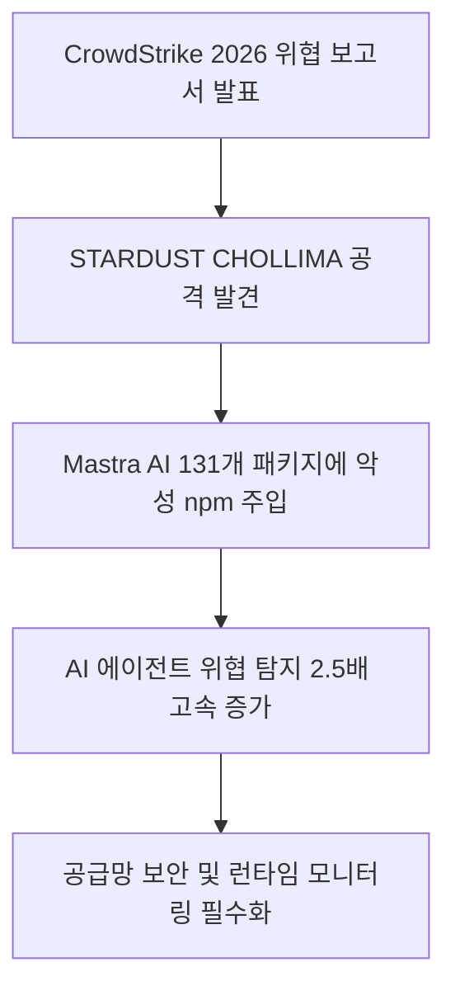
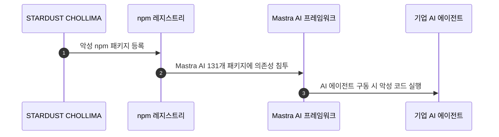
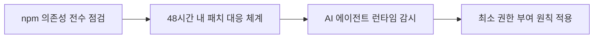

AI 기술을 활용해 업무 자동화를 추진하던 기업들에게 경종을 울리는 실제 사이버 공격 사례가 확인되었습니다. 북한 해킹 그룹이 개발자들이 자주 사용하는 AI 프레임워크에 악성 코드를 몰래 침투시켜 오픈소스 공급망을 직접 공격한 사실이 밝혀졌습니다.

## 무슨 일이 벌어진 걸까?

보안 전문 기업 CrowdStrike는 2026년 8월 3일 발표한 '2026 위협 헌팅 보고서(2026 Threat Hunting Report)'를 통해 AI 개발 인프라를 겨냥한 공격이 가속화되고 있다고 공개했습니다 <sup class="source-citation"><a href="#source-1" aria-label="CrowdStrike 출처">[1]</a></sup>. 가장 대표적인 사건으로 북한 연계 위협 그룹인 STARDUST CHOLLIMA가 Mastra AI 프레임워크 내 131개 패키지에 악성 npm 패키지를 의존성(dependency) 형태로 몰래 침투시킨 사례가 적발되었습니다 <sup class="source-citation"><a href="#source-1" aria-label="CrowdStrike 출처">[1]</a></sup> <sup class="source-citation"><a href="#source-2" aria-label="SiliconANGLE 출처">[2]</a></sup>.



위 다이어그램은 해킹 그룹이 어떻게 외부 오픈소스 생태계를 통해 기업 내부의 AI 에이전트까지 침투하는지 보여주는 공격 흐름입니다. 개발자가 Mastra AI 프레임워크 라이브러리를 불러와 에이전트를 구축하는 순간, 내부 깊숙이 숨어 있던 악성 패키지가 함께 작동하도록 설계된 것입니다.

<figure class="news-source-image">
  
  <figcaption>SiliconANGLE가 원문과 함께 공개한 이미지입니다. <a href="https://siliconangle.com/2026/08/03/crowdstrike-finds-ai-systems-direct-attack-exploit-windows-shrink" target="_blank" rel="noopener noreferrer">출처: SiliconANGLE</a></figcaption>
</figure>

## 왜 지금 다들 이 이야기를 할까?

AI 에이전트 도입이 활발해지면서 사이버 공격자들의 목표물 역시 기존 서버나 개인 PC에서 AI 실행 환경 자체로 이동했기 때문입니다. CrowdStrike OverWatch팀이 관찰한 바에 따르면, AI 에이전트가 유발한 사이버 위협 탐지 건수는 사람이 직접 유발한 탐지 건수보다 무려 2.5배나 빠른 속도로 증가하고 있습니다 <sup class="source-citation"><a href="#source-1" aria-label="CrowdStrike 출처">[1]</a></sup> <sup class="source-citation"><a href="#source-3" aria-label="CyberScoop 출처">[3]</a></sup>.

또한 소프트웨어 공급망 전반이 공격 표적이 되었습니다. 2026년 상반기 동안 식별된 소프트웨어 레지스트리 위협의 87%가 악성 npm 패키지와 관련이 있었으며, 취약점이 외부로 알려진 뒤 실제로 공격에 악용되기까지의 시간도 극도로 단축되었습니다 <sup class="source-citation"><a href="#source-1" aria-label="CrowdStrike 출처">[1]</a></sup>. 공개된 개념증명(PoC)이 존재하는 취약점 익스플로잇의 88%가 공개 후 단 48시간 이내에 실제로 일어난 것으로 확인되었습니다 <sup class="source-citation"><a href="#source-1" aria-label="CrowdStrike 출처">[1]</a></sup> <sup class="source-citation"><a href="#source-2" aria-label="SiliconANGLE 출처">[2]</a></sup>.

```chartjs
{
  "type": "bar",
  "data": {
    "labels": ["npm 관련 레지스트리 위협 비중(%)", "48시간 이내 발생한 PoC 익스플로잇 비중(%)"],
    "datasets": [
      {
        "label": "2026년 상반기 주요 사이버 위협 데이터",
        "data": [87, 88],
        "backgroundColor": ["rgba(54, 162, 235, 0.6)", "rgba(255, 99, 132, 0.6)"]
      }
    ]
  },
  "options": {
    "plugins": {
      "title": {
        "display": true,
        "text": "CrowdStrike 2026 보고서 주요 위협 지표"
      }
    }
  }
}
```

이 차트는 위협 보고서에서 확인된 위험 수치를 직관적으로 보여줍니다. 오픈소스 레지스트리 위협의 대다수가 npm에 쏠려 있고, 취약점이 노출된 지 불과 이틀 만에 수많은 해킹 공격이 몰아친다는 수치적 증거입니다.

## 그래서 우리에게 뭐가 달라질까?

AI 에이전트를 도입하는 개발팀과 기업 보안팀은 오픈소스 프레임워크를 가져다 쓰는 방식 자체를 재검토해야 합니다. 단순히 알려진 패키지 이름만 확인하고 빌드하는 기존 보안 체크리스트로는 STARDUST CHOLLIMA처럼 깊숙이 오염된 의존성을 가려내기 어렵습니다.

자율적으로 행동하는 AI 에이전트의 특성상 내부 시스템 권한을 일부 부여받는 경우가 많기 때문에, 침투당할 경우 피해 범위가 일반 애플리케이션보다 커질 수 있습니다. 오픈소스 라이브러리를 설치할 때 검증 프로세스를 거치지 않으면, 내부 데이터 유출이나 무단 시스템 접근의 통로가 될 위험이 현실화되었습니다.

## 직접 써보거나 지켜볼 포인트

AI 프로젝트를 진행하는 조직이라면 오픈소스 공급망 통제와 런타임 보안 감시라는 두 가지 과제를 즉시 점검해야 합니다.



첫째, 개발팀이 사용 중인 Mastra AI 등 AI 프레임워크의 의존성 패키지를 전수 점검해야 합니다. 둘째, 보안 취약점 PoC가 공개된 후 48시간 이내에 익스플로잇의 88%가 일어나는 점을 감안해, 보안 업데이트 및 패치 자동화 주기를 대폭 단축시켜야 합니다 <sup class="source-citation"><a href="#source-1" aria-label="CrowdStrike 출처">[1]</a></sup>. 셋째, AI 에이전트에 필요 이상의 높은 권한을 주지 말고 실행 타임의 정밀 모니터링 체계를 갖추는 것이 중요합니다.

## 아직은 선을 그어야 할 부분

이번 보고서는 2026년 상반기 사이버 위협 관측 결과를 바탕으로 작성된 공식 보고서이지만, 그렇다고 모든 AI 프레임워크가 악성 코드에 감염되었다는 의미는 아닙니다. CrowdStrike가 제시한 위협 사례는 특정한 국가 연계 해킹 그룹과 타깃화된 프레임워크 수치에 기반하고 있습니다.

또한 STARDUST CHOLLIMA가 악성 코드를 주입한 Mastra AI 프레임워크 131개 패키지의 전체 피해 규모나 실제 기업 내부 망 침투 성공 건수 등은 수사 및 조사 진행 상황에 따라 추가 분석을 기다려야 합니다.

## 자주 묻는 질문

### CrowdStrike 2026 위협 보고서의 가장 핵심적인 발견은 무엇인가요?

북한 연계 해킹 그룹 STARDUST CHOLLIMA가 Mastra AI 프레임워크의 131개 패키지에 악성 npm 패키지를 침투시켰으며, AI 에이전트 유발 위협 탐지 건수가 사람보다 2.5배 빠르게 늘어났다는 점입니다 [CrowdStrike](https://www.crowdstrike.com/press-releases/crowdstrike-2026-threat-hunting-report).

### 왜 AI 프레임워크와 npm 패키지가 주요 공격 표적이 되었나요?

2026년 상반기 레지스트리 위협의 87%가 npm 패키지 관련이었을 만큼 오픈소스 의존성을 이용한 공급망 침투가 쉬워졌기 때문입니다 [CrowdStrike](https://www.crowdstrike.com/press-releases/crowdstrike-2026-threat-hunting-report). 개발자가 AI 프레임워크를 불러올 때 악성 코드가 함께 설치되는 경로를 노린 것입니다.

### 취약점이 공개된 후 기업은 얼마나 빠르게 대응해야 하나요?

공개 PoC가 존재하는 취약점 익스플로잇의 88%가 공개 후 48시간 이내에 발생하므로 기업은 최소 48시간 이내에 패치 및 격리 조치를 완료해야 합니다 [CrowdStrike](https://www.crowdstrike.com/press-releases/crowdstrike-2026-threat-hunting-report).

## 직접 확인한 원문

<ol class="checked-source-list">
  <li id="source-1"><a href="https://www.crowdstrike.com/press-releases/crowdstrike-2026-threat-hunting-report" target="_blank" rel="noopener noreferrer">CrowdStrike — CrowdStrike 2026 Threat Hunting Report: AI is Now Embedded Across Modern Adversary Operations</a> (2026-08-03)</li>
  <li id="source-2"><a href="https://siliconangle.com/2026/08/03/crowdstrike-finds-ai-systems-direct-attack-exploit-windows-shrink" target="_blank" rel="noopener noreferrer">SiliconANGLE — CrowdStrike finds AI systems under direct attack as exploit windows shrink</a> (2026-08-03)</li>
  <li id="source-3"><a href="https://cyberscoop.com/crowdstrike-threat-hunting-report-2026-ai" target="_blank" rel="noopener noreferrer">CyberScoop — CrowdStrike: AI is now both the weapon and the target in cyberattacks</a> (2026-08-03)</li>
</ol>

> 이 글은 위 원문을 직접 확인해 작성했습니다. 가격, 기능 범위, 지역별 제공 여부는 게시 후 바뀔 수 있으니 실제 도입 전 공식 문서를 다시 확인하세요.
