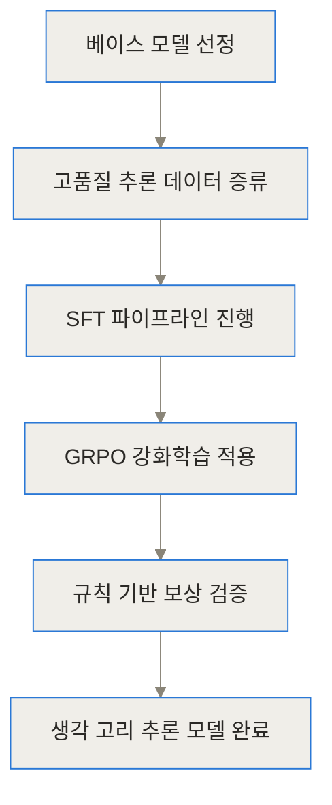
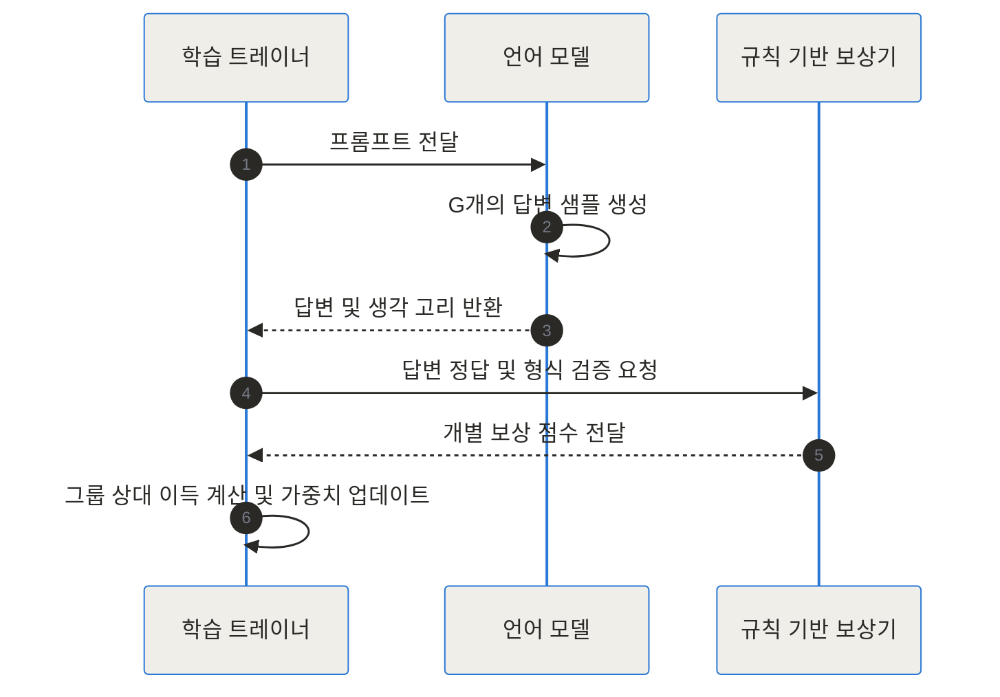
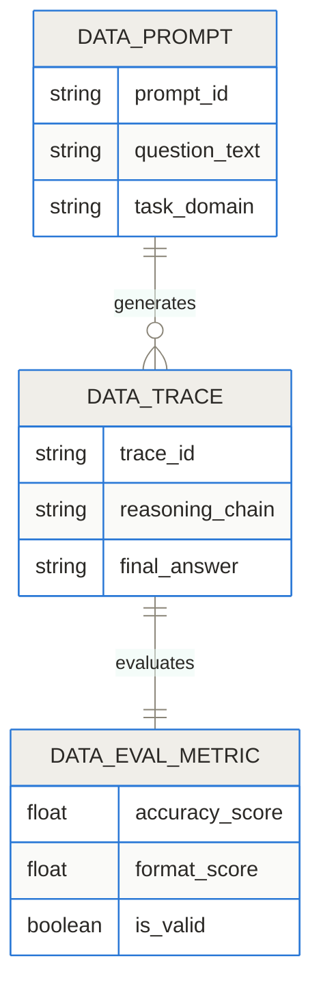
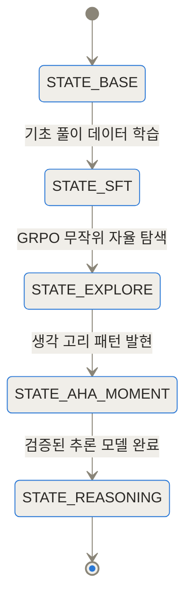
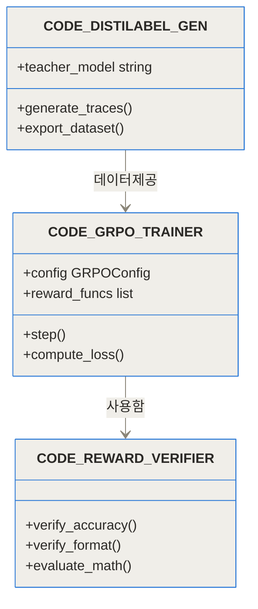
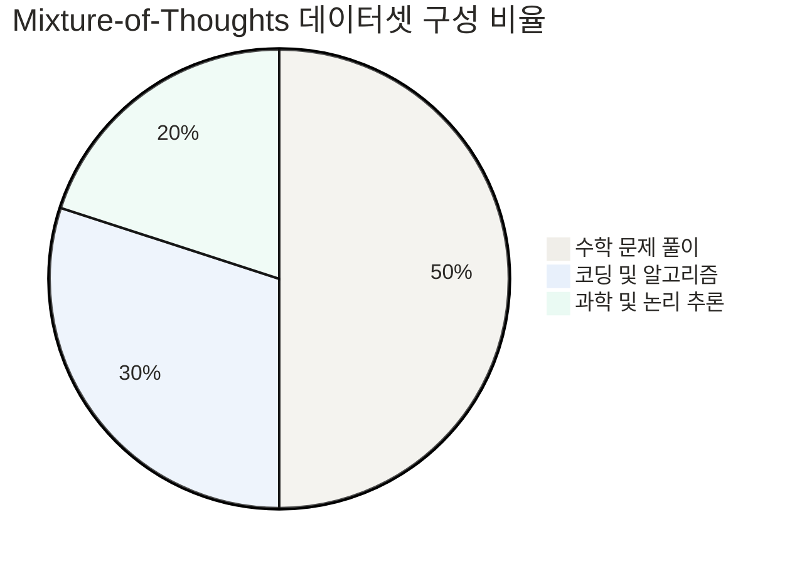
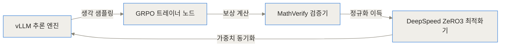
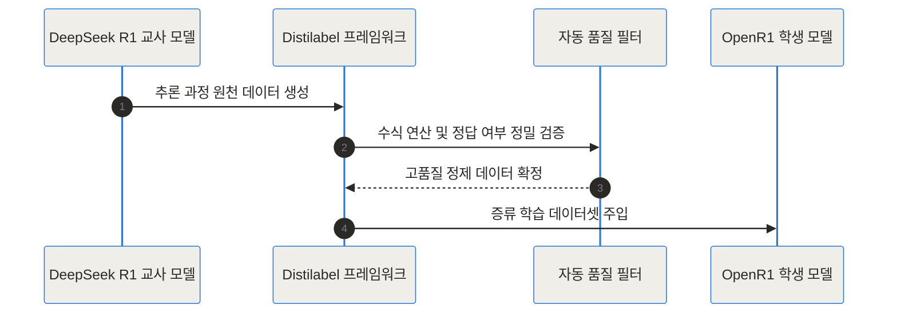

- [Open-R1 GitHub 저장소](https://github.com/huggingface/open-r1)
- [Open-R1 허깅페이스 블로그](https://huggingface.co/blog/open-r1)
- [Open-R1 허깅페이스 커뮤니티](https://huggingface.co/open-r1)

## 도입과 TL;DR

> **TL;DR (3줄 요약)**
> - Open-R1은 허깅페이스가 DeepSeek-R1의 추론 파이프라인과 데이터셋, 학습 코드를 100% 오픈소스로 재현하기 위해 구축한 글로벌 프로젝트예요.
> - 그룹 상대 정책 최적화(GRPO) 강화학습 기술과 Distilabel 파이프라인을 통합하여 누구나 자율적 사고 모델을 직접 학습시키도록 지원해요.
> - 수학, 코딩, 과학 영역에서 생각 고리(Chain of Thought)를 스스로 형성하도록 구동하는 투명한 구현 프레임워크를 제공해요.

DeepSeek-R1이 공개된 이후, AI 연구자와 현업 개발자들의 관심은 추론 시점(Inference Time) 연산량을 늘려 복잡한 문제를 해결하는 추론형 언어 모델로 급격히 이동했어요. 하지만 대기업의 독점적 모델이나 비공개 파이프라인은 구체적인 데이터 정제 방식과 강화학습 소스코드를 제공하지 않아 기술 재현에 큰 어려움이 존재했죠.

허깅페이스가 추진하는 Open-R1 프로젝트는 이러한 정보의 격차를 해소하고, 누구나 자유롭게 추론 AI를 구현할 수 있도록 모든 과정과 데이터를 투명하게 공유하는 오픈소스 이니셔티브예요. 이 글에서는 Open-R1이 기존의 문제점을 어떻게 극복하고 있으며, 어떠한 구조와 원리로 동작하는지 기술적 깊이까지 차근차근 둘러보겠습니다.

## 배경과 문제 정의: 왜 Open-R1 프로젝트가 등장했을까요?

DeepSeek-R1의 성공적인 발표는 인공지능 업계에 커다란 이정표를 제시했어요. 복잡한 수학 문제나 프로그래밍 알고리즘을 풀 때 인간처럼 차근차근 생각 과정을 거치도록 유도하면 모델의 최종 정확도가 비약적으로 상승한다는 점을 입증했기 때문이에요.

하지만 기술 보고서의 아이디어를 실제 작동하는 코드로 구현하는 과정에서 연구 현장은 세 가지 커다란 난관에 봉착했습니다.

1. **학습 소스코드의 결여**: 대규모 파라미터를 가진 언어 모델에 강화학습을 적용하기 위한 분산 트레이닝 코드가 공개되지 않았습니다.
2. **사고 과정(Reasoning Traces) 데이터의 부재**: 모델이 스스로 고찰하도록 유도하는 `<think>...</think>` 형태의 고품질 사고 데이터를 대량으로 수집하고 검증할 방법이 마땅치 않았습니다.
3. **막대한 하드웨어 컴퓨팅 비용**: 기존 RLHF(인간 피드백 기반 강화학습) 알고리즘은 가치 평가 모델(Critic Model)을 추가로 띄워야 해서 메모리 소모가 극심했습니다.

| 기존 접근법의 한계 | Open-R1의 해결 방안 |
| --- | --- |
| 비공개 강화학습 트레이닝 코드 | TRL 라이브러리 기반의 100% 오픈소스 GRPO 트레이너 제공 |
| 폐쇄적인 지식 증류 데이터셋 | Mixture-of-Thoughts, OpenR1-Math-220k 등 완전 공개 데이터 배포 |
| 크리틱 모델로 인한 VRAM 부족 | 크리틱 모델이 필요 없는 GRPO 적용으로 메모리 사용량 절감 |

이러한 장애물을 극복하기 위해 허깅페이스 연구팀은 Open-R1 프로젝트를 출범시켰어요. 단순히 기존 모델을 따라 만드는 것에 그치지 않고, 가공되지 않은 베이스 모델에서 출발하여 순수 강화학습만으로 논리적 사고력을 발현시키는 오픈 이니셔티브를 구축했습니다.

## 기본 개념: Open-R1은 어떤 원리로 구동되나요?

Open-R1의 핵심 아이디어를 쉽게 이해하기 위해 주관식 문제를 공부하는 학생의 모습에 비유해 볼 수 있어요.

이전의 지도 미세조정(SFT) 방식이 선생님이 써준 해설지와 정답을 그대로 따라 적으며 단순 암기하는 방식이었다면, Open-R1의 학습 방식은 **시험 문제를 받은 학생이 여백에 스스로 풀이 과정을 적어보며 정답에 도달할 때까지 여러 번 시도하는 독학 공부법**과 같아요.

이 공부법이 성과를 거두려면 다음 세 가지 규칙이 제대로 잘 작동해야 해요.

- **생각 공간의 제공**: 정답을 말하기 전에 반드시 `<think>`와 `</think>` 태그 사이의 여백에 브레인스토밍, 중간 계산, 오류 검증 과정을 거치도록 유도합니다.
- **그룹 상대 평가(GRPO)**: 동일한 문제를 여러 번 풀어보게 한 뒤, 제출한 답안지들의 상대적인 우수성을 비교하여 잘한 풀이에 포상을 내립니다.
- **자동화된 규칙 기반 보상**: 사람이 일일이 채점하는 대신, 수학 연산 검증기나 코드 실행기를 통해 최종 정답의 정확성을 자동 평가합니다.

이처럼 체계적인 피드백 루프가 형성되면, AI 모델은 인간의 개입 없이도 정답률을 높이기 위해 스스로 더 깊이 오랫동안 생각하는 방식을 터득하게 됩니다.

## 내부 작동 원리: Open-R1 파이프라인 완전 분석

Open-R1의 아키텍처는 고품질 데이터 수집부터 SFT 미세조정, GRPO 강화학습, 그리고 지식 증류(Distillation)까지 유기적으로 이어지는 4단계 구조로 설계되어 있습니다.



### 1. GRPO (Group Relative Policy Optimization) 연산 과정

기존의 PPO(Proximal Policy Optimization) 방식은 생성된 문장의 품질을 실시간으로 추정하기 위해 생성 모델과 비슷한 크기의 가치 모델(Critic Model)을 추가로 로드해야 했습니다. 이는 GPU 메모리 점유율을 두 배로 늘리는 주원인이었죠.

반면 Open-R1에 도입된 GRPO 기법은 가치 모델을 완전히 제거했습니다. 하나의 질문 $q$에 대해 현재 모델이 $G$개의 서로 다른 답변 그룹 $O = \{o_1, o_2, ..., o_G\}$를 동시 생성하게 한 후, 그룹 내 평균과 표준편차를 기반으로 상대적 이득(Advantage) $A_i$를 산출합니다.

$$A_i = \frac{r_i - \text{mean}(\mathbf{r})}{\text{std}(\mathbf{r})}$$

여기서 $r_i$는 $i$번째 답변이 받은 보상 점수입니다. 이렇게 정규화된 이득을 바탕으로 정책(Policy) 파라미터를 업데이트하므로, 가치 모델 없이도 안정적인 학습 유지가 가능해집니다.



### 2. 정밀 보상 함수(Reward Functions) 설계

Open-R1은 인간의 모호한 주관적 피드백 대신 수학적 정밀도를 가진 자동화된 보상 함수를 조합하여 사용해요.

- **정확도 보상 (Accuracy Reward)**: `math_verify` 패키지를 활용해 정답과 모델 응답 수식을 파싱 및 비교합니다. 표기법이 다르더라도 수학적으로 동등하다면 1.0의 보상을 지급합니다.
- **형식 보상 (Format Reward)**: 모델이 정확히 `<think>`로 시작해 `</think>`로 생각 과정을 닫고, 최종 정답을 `\boxed{}` 태그 내부에 작성했는지를 정규표현식으로 정밀 검사합니다.

### 3. 데이터 구조 및 스토리지 스키마

Open-R1에서 사용하는 추론 파이프라인의 데이터 스키마 관계도는 다음과 같습니다.



### 4. 강화학습 과정에서의 모델 상태 전이

학습 진행 상황에 따라 모델의 상태는 자율적인 탐색에서 논리적 수렴 단계로 점진적으로 전이됩니다.



### 5. 모듈 및 클래스 계층 구조

Open-R1의 내부 코드베이스 모듈 간 상호작용은 다음과 같이 정교하게 분리되어 설계되었습니다.



### 6. Mixture-of-Thoughts 데이터 분포

Open-R1 프로젝트가 공개한 35만 건 규모의 정제 데이터셋 범주별 수집 비율입니다.



### 7. 분산 학습 아키텍처 및 노드 간 데이터 통신

고속 토큰 생성 엔진인 vLLM과 분산 최적화 라이브러리 DeepSpeed ZeRO-3를 통합 구동하여 강화학습 오버헤드를 대폭 경감합니다.



### 8. 합성 데이터 증류 파이프라인

거대 교사 모델로부터 사고 과정을 추출하여 소형 학생 모델에 주입하는 합성 데이터 증류 절차입니다.



## 구현 및 사용 디테일: 설치부터 학습까지

Open-R1 파이프라인을 로컬 환경이나 GPU 클러스터에 설치하고 직접 스크립트를 실행하는 가이드입니다.

### 레포지토리 설치 및 필수 라이브러리 로드

```bash
git clone https://github.com/huggingface/open-r1.git
cd open-r1
pip install -e .
pip install vllm slurm
```

### GRPO 파인튜닝 스크립트 실행 명령어 (`src/open_r1/grpo.py`)

```bash
ACCELERATE_LOG_LEVEL=info accelerate launch \
    --config_file recipes/accelerate_configs/zero3.yaml \
    src/open_r1/grpo.py \
    --model_name_or_path Qwen/Qwen2.5-Math-7B-Instruct \
    --dataset_name open-r1/OpenR1-Math-220k \
    --max_prompt_length 512 \
    --max_completion_length 1024 \
    --per_device_train_batch_size 1 \
    --num_generations 8 \
    --learning_rate 1e-6 \
    --reward_funcs accuracy format
```

### 커스텀 보상 함수 연동 소스코드 예시

```python loss
import re
from math_verify import parse, verify

def accuracy_reward_func(completions, solution, **kwargs):
    contents = [completion[0]["content"] for completion in completions]
    rewards = []
    for content, sol in zip(contents, solution):
        parsed_sol = parse(sol)
        parsed_pred = parse(content)
        if parsed_sol and parsed_pred and verify(parsed_sol, parsed_pred):
            rewards.append(1.0)
        else:
            rewards.append(0.0)
    return rewards

def format_reward_func(completions, **kwargs):
    pattern = r"^<think>
.*?
</think>
.*$"
    contents = [completion[0]["content"] for completion in completions]
    return [1.0 if re.match(pattern, content, re.DOTALL) else 0.0 for content in contents]
```

## 실전 활용 시나리오: 현업 트러블슈팅과 응용

### 시나리오 1: 정밀 수식 계산이 필요한 금융/세무 자동화 서비스

금융 복리 연산이나 과세 표준 계산 시스템에서는 결과값의 정확성뿐만 아니라 세부 계산 과정이 법적 기준을 만족하는지 검증해야 해요. Open-R1의 GRPO 보상 체계에 금융 수식 검증 모듈을 결합하면, 중간 계산 단계를 명확히 서술하면서 오차율 0%에 도전하는 금융 특화 AI를 구축할 수 있습니다.

### 시나리오 2: 기업 사내 커스텀 코드 리팩토링 에이전트

특정 기업 내부의 레거시 프레임워크나 비공개 API를 사용하는 소프트웨어 구축 시, 단위 테스트(Unit Test) 통과 여부를 보상 엔진으로 설정할 수 있어요. 모델이 코드 수정 시 `<think>` 영역에서 테스트 케이스를 미리 설계해 보고, 테스트를 100% 통과하는 코드만을 출력하도록 자동 훈련시킵니다.

### 시나리오 3: 로컬 리소스 기반 온프레미스 경량 추론 모델 배포

보안 문제로 외부 API 사용이 금지된 기업 환경에서는 OpenR1-Distill-7B 모델을 단일 GPU 서버에 탑재하여 오프라인 상태에서도 정교한 문제 해결 능력과 논리 보고서 작성 기능을 구동할 수 있습니다.

## 벤치마크 및 평가: 성능 지표 비교

Open-R1 프레임워크를 통해 학습된 모델 및 데이터셋의 객관적 성능과 자원 효율성을 비교분석한 데이터입니다.

```chartjs
{"type":"bar","data":{"labels":["MATH-500","AIME 2024","AIME 2025","GPQA-Diamond"],"datasets":[{"label":"DeepSeek-Distill-Qwen-7B","data":[93.5,51.3,35.8,52.4]},{"label":"OpenR1-Qwen-7B","data":[90.6,48.2,33.5,49.8]}]}}
```

```chartjs
{"type":"bar","data":{"labels":["PPO (Critic 포함)","GRPO (Open-R1)","Unsloth GRPO (최적화)"],"datasets":[{"label":"필요 VRAM (GB)","data":[80,32,7]}]}}
```

| 비교 항목 | 기존 RLHF (PPO) | Open-R1 (GRPO) |
| --- | --- | --- |
| 가치 모델 (Critic) | 필수 (추가 VRAM 로드) | 불필요 (그룹 상대 정규화 사용) |
| 보상 측정 방식 | 스칼라 보상 모델 | 규칙 기반 정밀 검증기 |
| 메모리 소모량 | 매우 높음 (대형 클러스터 필요) | 낮음 (단일 GPU 가동 가능) |
| 생각 고리 제어 | 태그 강제 제어 어려움 | `<think>` 형식 보상으로 강력 통제 |

| 모델 이름 | MATH-500 | AIME 2024 | AIME 2025 | GPQA-Diamond |
| --- | --- | --- | --- | --- |
| DeepSeek-Distill-Qwen-7B | 93.5% | 51.3% | 35.8% | 52.4% |
| OpenR1-Qwen-7B | 90.6% | 48.2% | 33.5% | 49.8% |
| OpenThinker-7B | 89.1% | 45.0% | 31.2% | 47.5% |

## 솔직한 평가: 한계점과 고려해야 할 트레이드오프

Open-R1 프로젝트는 고성능 추론 모델의 대중화를 이끌었지만, 실제 도입 시 유의해야 할 공학적 한계점이 명확히 존재해요.

- **보상 편향(Reward Hacking) 위험**: 모델이 실제 논리적 추론 능력을 키우는 대신, 보상 점수를 얻기 위해 의미 없는 단어를 `<think>` 공간에 늘려 써서 꼼수를 부리는 현상이 관찰될 수 있습니다.
- **주관적/자연어 질의에 대한 보상 정의의 어려움**: 수학이나 정규식처럼 정답 판단이 명확한 수식 문제와 달리, 에세이 작성이나 다변량 컨설팅 질의에는 엄격한 보상 규칙을 설계하기 어렵습니다.
- **생성 지연시간(Latency)의 증가**: 사용자가 원하는 답을 내놓기 전 수백~수천 토큰에 달하는 사고 문장을 먼저 출력하므로, 초저지연 대화형 서비스에는 적합하지 않습니다.

## 마무리: 오픈소스 AI 추론 기술의 미래

Open-R1 프로젝트는 빅테크 기업의 비공개 장벽에 맞서, 인공지능 연구 커뮤니티가 지속 가능한 형태의 오픈 생태계를 구축할 수 있음을 입증해 보였습니다. 투명한 데이터 공개와 GRPO 기술 기반의 고효율 파이프라인은 향후 수많은 도메인 특화 추론 모델의 탄생을 이끄는 든든한 밑거름이 될 것입니다.

## 자주 묻는 질문 (FAQ)

### Open-R1 프로젝트의 주요 목적은 무엇인가요?

Open-R1은 허깅페이스가 주도하여 DeepSeek-R1의 데이터 수집, 학습 파이프라인, 강화학습 코드를 완전히 오픈소스로 재현하는 글로벌 이니셔티브입니다. 누구나 고성능 추론 모델을 투명하게 파악하고 직접 튜닝할 수 있는 종합 프레임워크와 데이터셋을 제공하는 것을 목적으로 합니다.

### GRPO는 기존 PPO 방식과 어떤 점이 다르며 왜 VRAM을 적게 소비하나요?

기존 PPO 알고리즘은 답변의 가치를 평가하기 위해 대형 별도 크리틱(Critic) 네트워크를 필수로 로드해야 했지만, GRPO는 동일 질문에서 복수의 답변을 그룹으로 생성하고 그룹 내 상대적 평균과 표준편차로 이득을 산출합니다. 이로 인해 가치 모델을 메모리에 올릴 필요가 없어 VRAM 소비량이 절반 이하로 감소합니다.

### Open-R1을 이용해 직접 파이프라인을 학습하려면 어떤 하드웨어가 필요한가요?

7B 규모 모델을 GRPO로 파인튜닝하려면 80GB VRAM을 갖춘 H100/A100 GPU 1대 이상이 권장되며, Unsloth 최적화 기법을 결합하면 24GB VRAM 단일 GPU 환경에서도 구동할 수 있습니다. 대규모 멀티 노드 학습 시에는 DeepSpeed ZeRO-3 설정을 통해 다중 GPU로 확장할 수 있습니다.

### 학습 도중 모델이 생각 태그를 무한히 반복하는 문제는 어떻게 해결하나요?

생성 길이 제한 설정과 함께 패널티 보상 함수를 추가하는 것이 효과적입니다. 특정 길이 이상으로 무의미한 문구가 반복될 때 보상을 감점하거나, 적절한 </think> 종료 태그 배치 시에만 형식 보상을 부여하도록 유도하여 학습을 안정화할 수 있습니다.

### Open-R1에서 배포하는 데이터셋은 어떻게 활용할 수 있나요?

OpenR1-Math-220k 및 Mixture-of-Thoughts 데이터셋은 허깅페이스 Datasets 라이브러리를 통해 즉시 불러올 수 있습니다. 자체 모델의 SFT 학습용 데이터나 성능 평가용 벤치마크, 또는 추가적인 GRPO 강화학습 입력 데이터로 자유롭게 활용할 수 있습니다.


## References
- [https://github.com/huggingface/open-r1](https://github.com/huggingface/open-r1)
- [https://huggingface.co/blog/open-r1](https://huggingface.co/blog/open-r1)
- [https://huggingface.co/open-r1](https://huggingface.co/open-r1)
