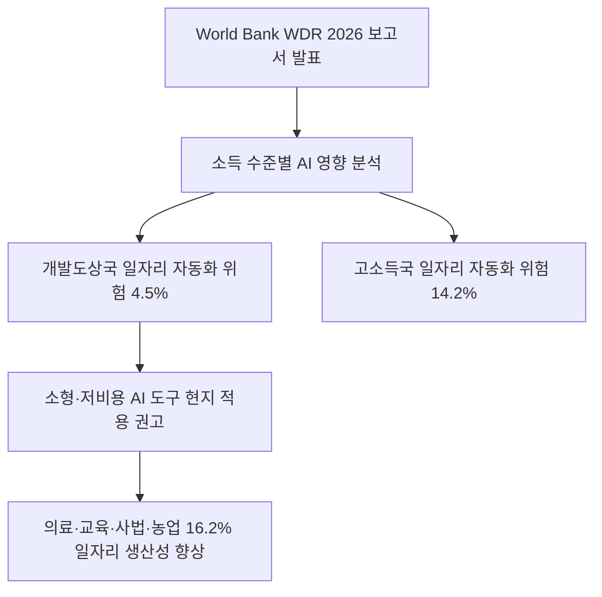
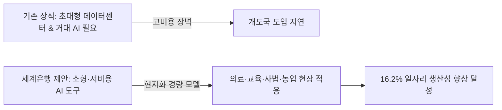
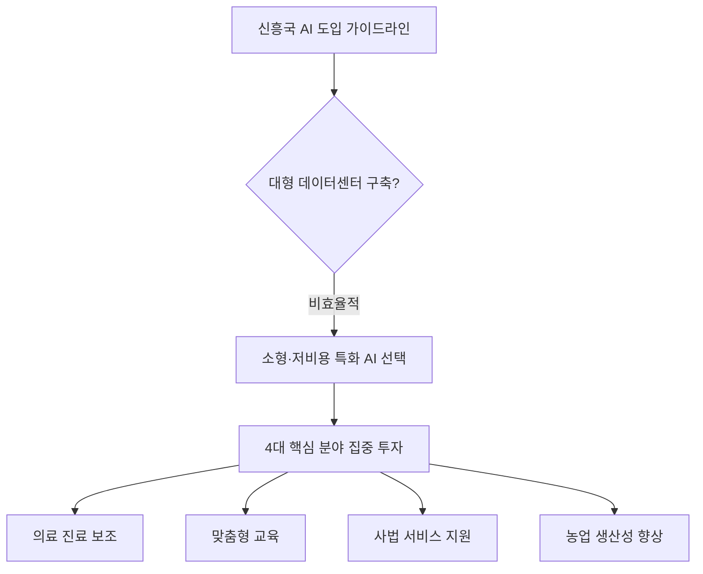

## 무슨 일이 벌어진 걸까?

World Bank가 2026년 8월 4일 연례 핵심 보고서인 '세계개발보고서 2026: 인공지능의 약속(World Development Report 2026: The Promise of Artificial Intelligence)'을 정식 발간했습니다 <sup class="source-citation"><a href="#source-2" aria-label="World Bank 출처">[2]</a></sup>. 이번 보고서의 핵심은 인공지능 기술이 전 세계 노동 시장에 가져올 파급력을 소득 수준별로 비교 분석한 점입니다.

World Bank의 분석에 따르면 생성형 AI로 인해 자동화 위험에 노출된 일자리 비율은 저소득국과 중소득국에서 4.5%에 불과합니다 <sup class="source-citation"><a href="#source-1" aria-label="World Bank 출처">[1]</a></sup>. 반면 고소득 국가에서는 전체 일자리의 14.2%가 자동화 위험에 직면해 있어 개발도상국보다 위험도가 3배 이상 높게 나타났습니다 <sup class="source-citation"><a href="#source-3" aria-label="South China Morning Post 출처">[3]</a></sup>. 반대로 AI를 활용해 일자리의 생산성을 의미 있게 끌어올릴 수 있는 비율은 개도국에서도 16.2%에 달하며, 고소득국(18.7%)과 비교해도 결코 적지 않은 수치입니다 <sup class="source-citation"><a href="#source-1" aria-label="World Bank 출처">[1]</a></sup>.

<figure class="news-source-image">
  
  <figcaption>World Bank가 원문과 함께 공개한 이미지입니다. <a href="https://www.worldbank.org/en/publication/wdr2026" target="_blank" rel="noopener noreferrer">출처: World Bank</a></figcaption>
</figure>

## 왜 지금 다들 이 이야기를 할까?

World Bank Group의 Indermit Gill 총괄 이코노미스트는 개발도상국이 AI의 혜택을 누리기 위해 반드시 대규모 AI 모델이나 거대한 데이터센터를 지을 필요는 없다고 강조했습니다 <sup class="source-citation"><a href="#source-1" aria-label="World Bank 출처">[1]</a></sup>. 지금까지는 수조 원이 들어가는 데이터센터 인프라와 초거대 언어모델을 보유한 강대국만 AI 혁신의 수혜를 독점할 것이라는 우려가 지배적이었습니다.

하지만 World Bank는 거대 모델 대신 현지 실정에 맞춘 소형·저비용 AI 도구를 활용하는 실용적 접근법을 제시했습니다 <sup class="source-citation"><a href="#source-2" aria-label="World Bank 출처">[2]</a></sup>. 굳이 천문학적인 자본을 들여 최첨단 GPU 서버 단지를 구축하지 않더라도, 특정 업무에 특화된 경량화 AI 모델을 적재적소에 도입하면 저성장 국면에 빠진 신흥국 경제의 강력한 돌파구가 될 수 있다는 뜻입니다.

아래 차트는 World Bank 보고서에서 발표한 소득 수준별 일자리 자동화 위험 수치와 생산성 향상 기대 수치를 직관적으로 보여줍니다.

```chartjs
{
  "type": "bar",
  "data": {
    "labels": ["자동화 위험 일자리 비율 (%)", "생산성 향상 기대 일자리 비율 (%)"],
    "datasets": [
      {
        "label": "저·중소득국 (개발도상국)",
        "data": [4.5, 16.2]
      },
      {
        "label": "고소득국",
        "data": [14.2, 18.7]
      }
    ]
  },
  "options": {
    "plugins": {
      "title": {
        "display": true,
        "text": "세계은행 WDR 2026: 소득 수준별 AI 자동화 위험 및 생산성 향상 비교"
      }
    }
  }
}
```



<figure class="news-source-image">
  
  <figcaption>World Bank가 원문과 함께 공개한 이미지입니다. <a href="https://www.worldbank.org/en/publication/wdr2026" target="_blank" rel="noopener noreferrer">출처: World Bank</a></figcaption>
</figure>

## 그래서 우리에게 뭐가 달라질까?

World Bank 보고서는 개도국이 AI를 적용해야 할 4대 핵심 분야로 의료 진료, 교육, 사법 서비스, 농업을 콕 집어 제시했습니다 <sup class="source-citation"><a href="#source-1" aria-label="World Bank 출처">[1]</a></sup>. 전문가가 부족한 지방 의료원에 보조 진단용 소형 AI 도구를 배포하거나, 오지 학교에 맞춤형 학습 보조 AI를 도입하고, 농가에 기상·병충해 예측 AI를 보급하는 방식입니다 <sup class="source-citation"><a href="#source-2" aria-label="World Bank 출처">[2]</a></sup>.

제가 보기엔 이번 발표가 글로벌 AI 기업들과 신흥국 정부 모두의 전략에 커다란 변화를 가져올 것으로 보입니다. 거대 솔루션을 그대로 수출하려던 AI 기업들은 이제 특정 국가나 지역의 언어, 환경, 작업 절차에 맞춘 '맞춤형 경량 AI 도구' 개발에 눈을 돌려야 합니다. 글로벌 비즈니스 관점에서도 천문학적인 인프라 경쟁 대신 실제 현장 문제를 해결하는 실용적 AI 솔루션의 가치가 더욱 커질 것입니다.

## 직접 써보거나 지켜볼 포인트

World Bank가 제안한 전략이 현장에서 제대로 작동하는지 확인하려면, 앞으로 신흥국 정부들이 수조 원대 데이터센터 유치 대신 어떤 소형 AI 도구 도입 사업에 예산을 집행하는지 관찰해야 합니다. 특히 의료, 교육, 사법, 농업 등 4대 핵심 분야에서 실제 현지 언어와 데이터를 학습시킨 특화 모델들이 얼마나 빠르게 확산하는지가 관건입니다 <sup class="source-citation"><a href="#source-2" aria-label="World Bank 출처">[2]</a></sup>.



## 아직은 선을 그어야 할 부분

이번 World Bank 보고서는 소형 AI 도구의 가능성을 제시했지만, 구체적으로 어떤 신흥국이 어느 규모의 예산으로 이 솔루션을 실현할 수 있는지에 대한 실행 세부안이나 구체적인 기술 표준까지는 포함하지 않았습니다. 또한 소형 AI 모델이라 하더라도 최소한의 통신 인프라와 디지털 기기, 기본적인 AI 리터러시 교육이 뒷받침되지 않으면 실제 일자리 생산성 향상(16.2%)으로 이어지기 어렵다는 한계가 존재합니다 <sup class="source-citation"><a href="#source-1" aria-label="World Bank 출처">[1]</a></sup>.

개도국의 일자리 자동화 위험이 4.5%로 낮다는 분석도 개도국 노동자에게 해고 위험이 전혀 없다는 뜻은 아닙니다. 고소득국(14.2%)에 비해 상대적으로 지식 노동자 비율이 적어 당장의 자동화 위험 수치가 낮게 나온 측면이 크므로, 기술 변화에 따른 사회적 안전망 구축은 여전히 해결해야 할 과제로 남아있습니다 <sup class="source-citation"><a href="#source-3" aria-label="South China Morning Post 출처">[3]</a></sup>.

## 자주 묻는 질문

### World Bank가 발표한 WDR 2026 보고서의 핵심 내용은 무엇인가요?

개발도상국의 AI 일자리 자동화 위험은 4.5%로 고소득국(14.2%)보다 낮지만, 소형 AI 도구를 활용하면 16.2%의 일자리에서 생산성을 높일 수 있다는 내용입니다. 거대 데이터센터 없이도 의료, 교육, 사법, 농업 분야에서 실용적인 AI 도입이 가능하다고 강조했습니다.

### 개발도상국이 AI 혜택을 보려면 초대형 데이터센터가 반드시 필요한가요?

아니요, 초대형 데이터센터나 거대 AI 모델이 반드시 필요한 것은 아닙니다. World Bank Group의 Indermit Gill 총괄 이코노미스트는 저비용의 소형 AI 도구를 현지 실정에 맞춰 적용하는 것으로도 충분히 생산성을 끌어올릴 수 있다고 밝혔다.

### World Bank가 개도국에 추천한 AI 우선 적용 분야는 어디인가요?

World Bank는 의료 진료, 교육, 사법 서비스, 농업의 4대 분야를 우선 추천했습니다. 현지 상황에 맞춘 경량화 AI 도구를 이들 현장에 배포하면 서비스 접근성과 일자리 생산성을 효과적으로 개선할 수 있습니다.

## 직접 확인한 원문

<ol class="checked-source-list">
  <li id="source-1"><a href="https://www.worldbank.org/en/news/press-release/2026/08/04/ai-offers-lifeline-to-developing-economies" target="_blank" rel="noopener noreferrer">World Bank — AI Offers Lifeline to Developing Economies in an Era of Weak Growth</a> (2026-08-04)</li>
  <li id="source-2"><a href="https://www.worldbank.org/en/publication/wdr2026" target="_blank" rel="noopener noreferrer">World Bank — WDR 2026: The Promise of Artificial Intelligence</a> (2026-08-04)</li>
  <li id="source-3"><a href="https://www.scmp.com/news/world/article/3273188/world-bank-urges-developing-countries-embrace-ai-lifeline-or-be-left-behind" target="_blank" rel="noopener noreferrer">South China Morning Post — World Bank urges developing countries to embrace AI &#x27;lifeline&#x27; or be left behind</a> (2026-08-04)</li>
</ol>

> 이 글은 위 원문을 직접 확인해 작성했습니다. 가격, 기능 범위, 지역별 제공 여부는 게시 후 바뀔 수 있으니 실제 도입 전 공식 문서를 다시 확인하세요.
