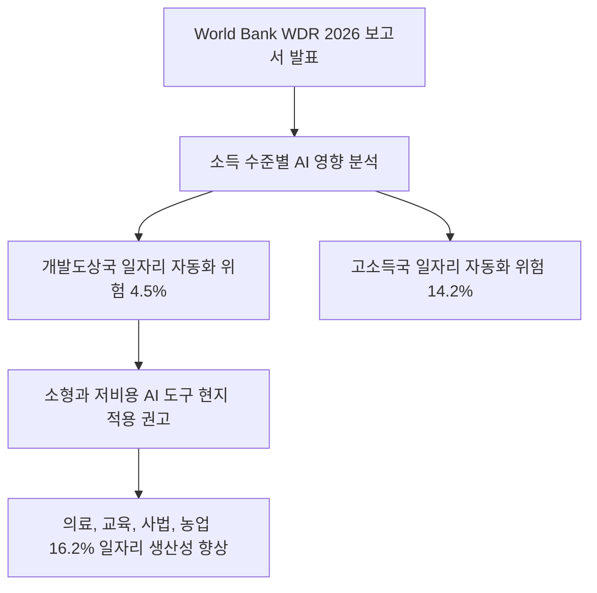
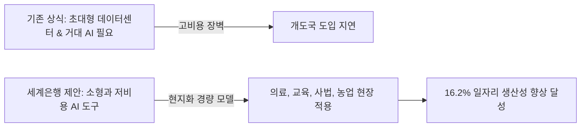
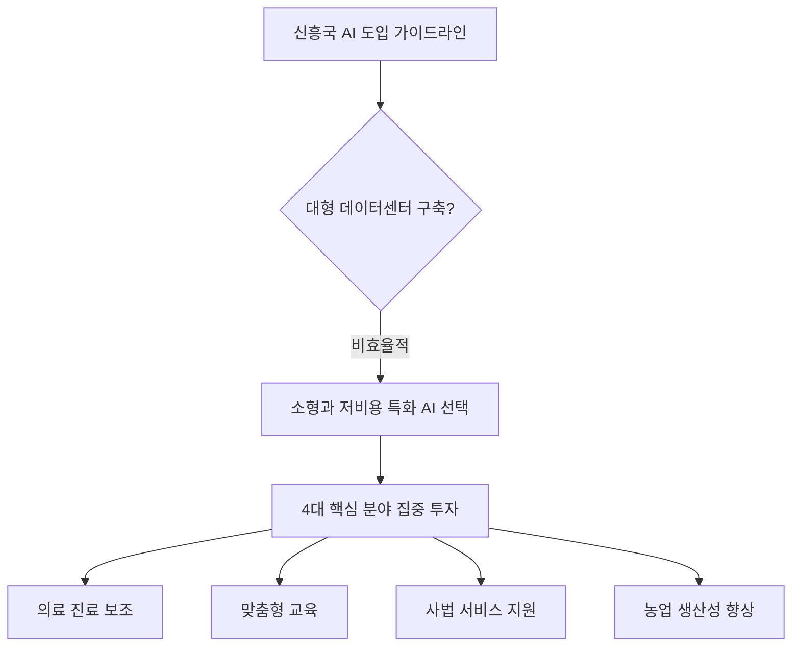

World Bank의 결론은 개발도상국이 초대형 데이터센터부터 지어야 AI의 생산성 효과를 얻는다는 통념과 다릅니다. 우선순위는 의료·교육·사법·농업의 구체적 업무를 고르고, 현지 언어와 통신 환경에서 작동하는 소형 도구를 시험하는 것입니다. 다만 보고서의 16.2%는 가능한 영향 범위를 나타내는 분석값이지, 모델을 배포하면 그만큼 생산성이 자동으로 오른다는 보장은 아닙니다.



## 무슨 일이 벌어진 걸까?

World Bank가 2026년 8월 4일 연례 핵심 보고서인 '세계개발보고서 2026: 인공지능의 약속(World Development Report 2026: The Promise of Artificial Intelligence)'을 정식 발간했습니다 <sup class="source-citation"><a href="#source-2" aria-label="World Bank 출처">[2]</a></sup>. 이번 보고서의 핵심은 인공지능 기술이 전 세계 노동 시장에 가져올 파급력을 소득 수준별로 비교 분석한 점입니다.

World Bank의 분석에 따르면 생성형 AI로 인해 자동화 위험에 노출된 일자리 비율은 저소득국과 중소득국에서 4.5%에 불과합니다 <sup class="source-citation"><a href="#source-1" aria-label="World Bank 출처">[1]</a></sup>. 반면 고소득 국가에서는 전체 일자리의 14.2%가 자동화 위험에 직면해 있어 개발도상국보다 위험도가 3배 이상 높게 나타났습니다 <sup class="source-citation"><a href="#source-3" aria-label="South China Morning Post 출처">[3]</a></sup>. 반대로 AI를 활용해 일자리의 생산성을 의미 있게 끌어올릴 수 있는 비율은 개도국에서도 16.2%에 달하며, 고소득국(18.7%)과 비교해도 결코 적지 않은 수치입니다 <sup class="source-citation"><a href="#source-1" aria-label="World Bank 출처">[1]</a></sup>.

<figure class="news-source-image">
  
  <figcaption>World Bank가 원문과 함께 공개한 이미지입니다. <a href="https://www.worldbank.org/en/publication/wdr2026" target="_blank" rel="noopener noreferrer">출처: World Bank</a></figcaption>
</figure>

## 거대 데이터센터 없이도 가능한 일은 무엇일까?

World Bank Group의 Indermit Gill 총괄 이코노미스트는 개발도상국이 AI의 혜택을 누리기 위해 반드시 대규모 AI 모델이나 거대한 데이터센터를 지을 필요는 없다고 강조했습니다 <sup class="source-citation"><a href="#source-1" aria-label="World Bank 출처">[1]</a></sup>. 지금까지는 수조 원이 들어가는 데이터센터 인프라와 초거대 언어모델을 보유한 강대국만 AI 혁신의 수혜를 독점할 것이라는 우려가 지배적이었습니다.

하지만 World Bank는 거대 모델 대신 현지 실정에 맞춘 소형과 저비용 AI 도구를 활용하는 실용적 접근법을 제시했습니다 <sup class="source-citation"><a href="#source-2" aria-label="World Bank 출처">[2]</a></sup>. 대규모 GPU 서버 단지를 먼저 구축하지 않더라도 특정 업무에 특화된 경량 도구를 적용해 효과를 검증할 수 있다는 뜻입니다. 이는 인프라가 필요 없다는 주장이 아니라, 문제에 비해 과도한 모델과 시설을 선행 투자하지 말자는 우선순위에 가깝습니다.

아래 차트는 World Bank 보고서에서 발표한 소득 수준별 일자리 자동화 위험 수치와 생산성 향상 기대 수치를 직관적으로 보여줍니다.

```chartjs
{
  "type": "bar",
  "data": {
    "labels": ["자동화 위험 일자리 비율 (%)", "생산성 향상 기대 일자리 비율 (%)"],
    "datasets": [
      {
        "label": "저와 중소득국 (개발도상국)",
        "data": [4.5, 16.2]
      },
      {
        "label": "고소득국",
        "data": [14.2, 18.7]
      }
    ]
  },
  "options": {
    "plugins": {
      "title": {
        "display": true,
        "text": "세계은행 WDR 2026: 소득 수준별 AI 자동화 위험 및 생산성 향상 비교"
      }
    }
  }
}
```



<figure class="news-source-image">
  
  <figcaption>World Bank가 원문과 함께 공개한 이미지입니다. <a href="https://www.worldbank.org/en/publication/wdr2026" target="_blank" rel="noopener noreferrer">출처: World Bank</a></figcaption>
</figure>

## 4.5%와 16.2%는 어떻게 해석해야 할까?

World Bank 보고서는 개도국이 AI를 적용해야 할 4대 핵심 분야로 의료 진료, 교육, 사법 서비스, 농업을 콕 집어 제시했습니다 <sup class="source-citation"><a href="#source-1" aria-label="World Bank 출처">[1]</a></sup>. 전문가가 부족한 지방 의료원에 보조 진단용 소형 AI 도구를 배포하거나, 오지 학교에 맞춤형 학습 보조 AI를 도입하고, 농가에 기상과 병충해 예측 AI를 보급하는 방식입니다 <sup class="source-citation"><a href="#source-2" aria-label="World Bank 출처">[2]</a></sup>.

4.5%는 저·중소득국의 일자리 가운데 생성형 AI 자동화 위험에 노출된 비율로 제시된 값이고, 16.2%는 생산성 향상 가능성이 있는 일자리 비율입니다. 두 수치는 서로 빼서 순고용 효과로 계산할 수 없으며, 개별 국가의 해고율이나 성장률을 예측하는 값도 아닙니다. 직업 구성과 디지털 접근성이 다른 국가·지역·직종에서는 실제 영향이 평균과 다를 수 있으므로, 정책과 사업 타당성 검토에서는 보고서의 정의와 분류 기준을 함께 확인해야 합니다.

기업과 정부가 여기서 얻을 수 있는 전략은 초거대 솔루션을 그대로 배포하기보다 특정 지역의 언어, 환경, 작업 절차에 맞춘 도구를 작은 단위로 검증하는 것입니다. 의료에서는 전문가의 최종 판단을 대체하지 않는 보조 업무, 교육에서는 교사가 오류를 확인할 수 있는 자료 준비처럼 책임 주체가 분명한 작업부터 시작할 수 있습니다. 농업이나 사법 분야도 “AI 도입” 자체를 목표로 두기보다 처리 시간, 오류, 접근성처럼 측정할 문제를 먼저 정해야 합니다.

## 소형 모델 사업을 어떤 기준으로 시험해야 할까?

World Bank가 제안한 전략이 현장에서 작동하는지 확인하려면, 신흥국 정부가 대규모 시설뿐 아니라 어떤 소형 AI 도구와 기반 역량에 예산을 집행하는지 함께 봐야 합니다. 특히 의료, 교육, 사법, 농업에서 현지 언어와 업무 자료를 처리할 수 있는지, 연결이 불안할 때도 핵심 기능이 유지되는지, 담당자가 오류를 수정할 수 있는지가 관건입니다 <sup class="source-citation"><a href="#source-2" aria-label="World Bank 출처">[2]</a></sup>.

시범 사업은 도입 전 기준선을 남겨야 평가할 수 있습니다. 예를 들어 문서 처리 시간을 줄이는 사업이라면 기존 처리 시간과 반려율을 먼저 측정하고, AI 사용 뒤 같은 표본에서 변화와 오류 유형을 비교합니다. 모델 크기가 작아 비용이 낮더라도 잘못된 답을 검토하는 시간이 더 길거나 취약 계층이 서비스를 이용하지 못한다면 생산성 개선으로 보기 어렵습니다.

확장 결정에는 모델 정확도 외에도 현지 데이터 관리, 사용자 교육, 책임과 이의 제기 절차가 포함돼야 합니다. 한 지역의 성공 사례를 다른 언어권에 그대로 복제하면 데이터 형식과 제도 차이 때문에 실패할 수 있습니다. 짧은 시범 운영에서 효과가 확인된 작업만 넓히고, 연결 장애나 오답이 발생했을 때 사람이 기존 절차로 돌아갈 수 있는 경로를 남기는 편이 안전합니다.

예산을 비교할 때는 모델 호출이나 기기 구입비만 보지 않아야 합니다. 현지 언어 자료를 정비하는 비용, 담당자 교육과 유지보수, 오류 때문에 재처리되는 업무까지 포함한 총비용을 계산합니다. 작은 모델이 더 싸더라도 중요한 집단에서 오류가 집중되거나 기존 서비스 접근성이 낮아진다면 확대 근거가 되기 어렵고, 그 차이를 공개적으로 설명할 지표가 필요합니다.

시범 사업의 종료 조건도 시작 전에 정해야 합니다. 정확도나 접근성이 기준에 못 미칠 때 기존 절차로 되돌릴 수 있어야 낮은 성과를 기술 투자 때문에 계속 유지하는 오류를 피할 수 있습니다.



## 아직은 선을 그어야 할 부분

이번 World Bank 보고서는 소형 AI 도구의 가능성을 제시했지만, 구체적으로 어떤 신흥국이 어느 규모의 예산으로 이를 실현할지에 대한 단일 실행안이나 기술 표준까지 정해 주지는 않습니다. 또한 소형 AI 모델이라 하더라도 통신 인프라와 디지털 기기, 데이터 관리, 사용자 교육이 뒷받침되지 않으면 16.2%라는 가능성이 실제 생산성 향상으로 이어지기 어렵습니다 <sup class="source-citation"><a href="#source-1" aria-label="World Bank 출처">[1]</a></sup>.

개도국의 일자리 자동화 위험이 4.5%로 낮다는 분석도 개도국 노동자에게 해고 위험이 전혀 없다는 뜻은 아닙니다. 고소득국(14.2%)에 비해 상대적으로 지식 노동자 비율이 적어 당장의 자동화 위험 수치가 낮게 나온 측면이 크므로, 기술 변화에 따른 사회적 안전망 구축은 여전히 해결해야 할 과제로 남아있습니다 <sup class="source-citation"><a href="#source-3" aria-label="South China Morning Post 출처">[3]</a></sup>.

<!-- primary-sources:start -->
## 원문과 버전 확인

- [발표 원문](https://www.worldbank.org/en/news/press-release/2026/08/04/ai-offers-lifeline-to-developing-economies)
- [World Bank](https://www.worldbank.org/en/publication/wdr2026)
- [South China Morning Post](https://www.scmp.com/news/world/article/3273188/world-bank-urges-developing-countries-embrace-ai-lifeline-or-be-left-behind)
<!-- primary-sources:end -->

<!-- internal-links:start -->
## 함께 읽으면 이해가 이어지는 글

- [NVIDIA, 데이터센터 전력 병목 풀 800 VDC 직류 전력 아키텍처 공개]() — NVIDIA가 Google, Microsoft 및 80개 이상의 OCP 파트너와 함께 AI 데이터센터 전력 병목을 극복할 MGX 호환 800 VDC 전력 아키텍처를 발표했습니다. 기존 데이터센터 건물의 AC 인프라를 재건축하지 않고도…
- [OpenAI 프론티어 API 제로 데이터 보존 발표, Private Safety Processing으로 기업 보안 강화]() — OpenAI가 2026년 8월 19일 프론티어 모델 API 사용자를 대상으로 제로 데이터 보존(ZDR) 옵션을 발표하고 Private Safety Processing을 미리보기로 공개했습니다. ZDR을 적용하면 프롬프트와 모델 출력…
- [100달러로 ChatGPT를 처음부터 학습할 수 있을까? NanoChat의 비용 조건]() — NanoChat의 토크나이저·사전학습·SFT·웹 UI 전 과정을 살펴보고 100달러·4시간이라는 문구에 숨은 8×H100 조건과 교육용 코드의 경계를 짚습니다.
<!-- internal-links:end -->

## 자주 묻는 질문

### World Bank가 발표한 WDR 2026 보고서의 핵심 내용은 무엇인가요?

개발도상국의 AI 일자리 자동화 위험은 4.5%로 고소득국(14.2%)보다 낮지만, 소형 AI 도구를 활용하면 16.2%의 일자리에서 생산성을 높일 수 있다는 내용입니다. 거대 데이터센터 없이도 의료, 교육, 사법, 농업 분야에서 실용적인 AI 도입이 가능하다고 강조했습니다.

### 개발도상국이 AI 혜택을 보려면 초대형 데이터센터가 반드시 필요한가요?

아니요, 초대형 데이터센터나 거대 AI 모델이 반드시 필요한 것은 아닙니다. World Bank Group의 Indermit Gill 총괄 이코노미스트는 저비용의 소형 AI 도구를 현지 실정에 맞춰 적용하는 것으로도 충분히 생산성을 끌어올릴 수 있다고 밝혔다.

### World Bank가 개도국에 추천한 AI 우선 적용 분야는 어디인가요?

World Bank는 의료 진료, 교육, 사법 서비스, 농업의 4대 분야를 우선 추천했습니다. 현지 상황에 맞춘 경량화 AI 도구를 이들 현장에 배포하면 서비스 접근성과 일자리 생산성을 효과적으로 개선할 수 있습니다.

## 직접 확인한 원문

<ol class="checked-source-list">
  <li id="source-1"><a href="https://www.worldbank.org/en/news/press-release/2026/08/04/ai-offers-lifeline-to-developing-economies" target="_blank" rel="noopener noreferrer">World Bank — AI Offers Lifeline to Developing Economies in an Era of Weak Growth</a> (2026-08-04)</li>
  <li id="source-2"><a href="https://www.worldbank.org/en/publication/wdr2026" target="_blank" rel="noopener noreferrer">World Bank — WDR 2026: The Promise of Artificial Intelligence</a> (2026-08-04)</li>
  <li id="source-3"><a href="https://www.scmp.com/news/world/article/3273188/world-bank-urges-developing-countries-embrace-ai-lifeline-or-be-left-behind" target="_blank" rel="noopener noreferrer">South China Morning Post — World Bank urges developing countries to embrace AI &#x27;lifeline&#x27; or be left behind</a> (2026-08-04)</li>
</ol>

> 이 글은 위 원문을 직접 확인해 작성했습니다. 가격, 기능 범위, 지역별 제공 여부는 게시 후 바뀔 수 있으니 실제 도입 전 공식 문서를 다시 확인하세요.
