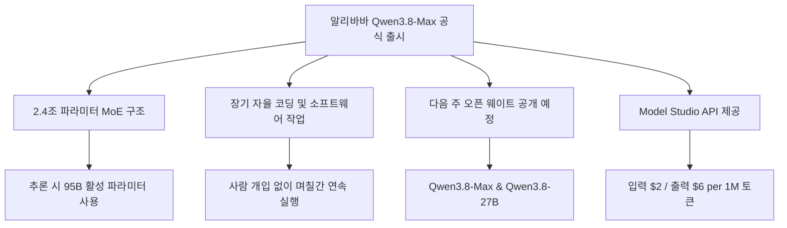
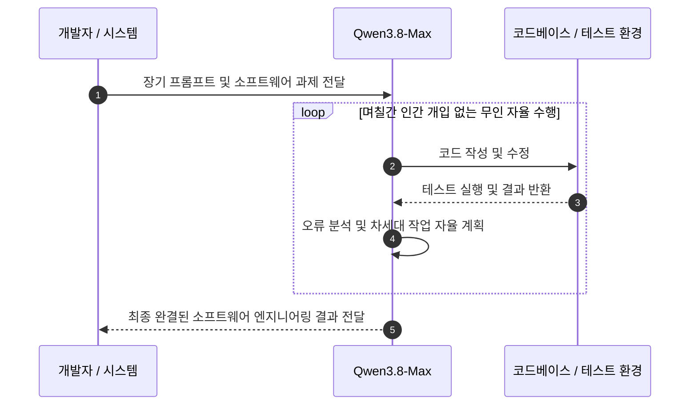
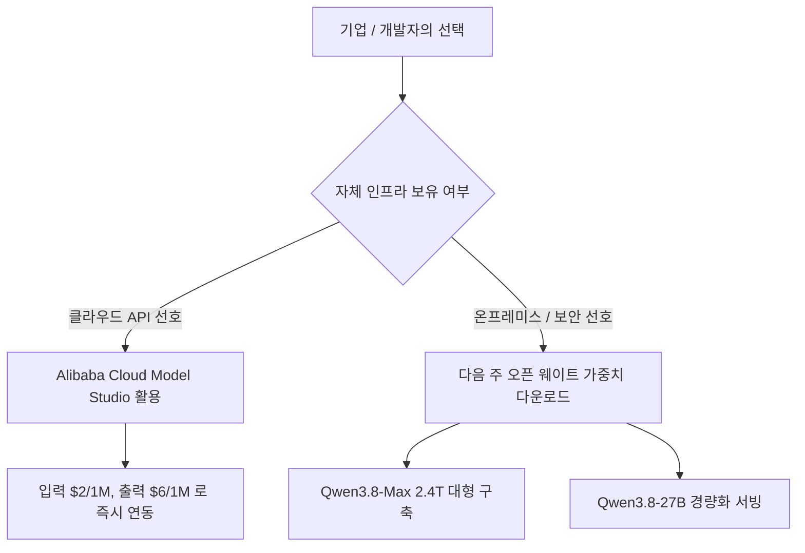

위 다이어그램은 이번 알리바바 Qwen3.8-Max 출시의 핵심 구조와 독자 여러분이 챙겨봐야 할 흐름을 한눈에 정리한 결과입니다.

## 무슨 일이 벌어진 걸까?

알리바바가 2026년 8월 3일 2.4조 파라미터 규모의 초거대 AI 모델인 Qwen3.8-Max를 정식으로 세상에 내놓았습니다 <sup class="source-citation"><a href="#source-1" aria-label="알리바바 클라우드 블로그 출처">[1]</a></sup>.

이번에 공개된 Qwen3.8-Max는 단순한 대형 언어 모델이 아닙니다. 전체 파라미터는 2조 4,000억 개에 달하지만, 연산을 수행할 때 필요한 전문가 모델만 골라 쓰는 Mixture-of-Experts(MoE) 방식을 채택했습니다 <sup class="source-citation"><a href="#source-1" aria-label="알리바바 클라우드 블로그 출처">[1]</a></sup>. 덕분에 실제 연산 과정에서는 전체의 일부인 950억 개(95B)의 활성 파라미터만 작동해 효율성을 대폭 끌어올렸습니다 <sup class="source-citation"><a href="#source-3" aria-label="벤처비트 출처">[3]</a></sup>.

입력 문맥 처리 능력도 엄청납니다. 무려 100만 토큰(1-million-token)의 컨텍스트 윈도우를 지원하며, 텍스트뿐만 아니라 이미지와 비디오 입력까지 한 번에 처리할 수 있는 멀티모달 모델입니다 <sup class="source-citation"><a href="#source-2" aria-label="사우스 차이나 모닝 포스트 출처">[2]</a></sup>.

입력 데이터가 들어오면 100만 토큰 대용량 메모리를 거쳐 MoE 시스템이 연산을 최적화하는 흐름을 보여줍니다.

## 왜 지금 다들 이 이야기를 할까?

Qwen3.8-Max가 단순한 스펙 싸움을 넘어 개발자 사이에서 폭발적인 반응을 얻는 이유는 '장기 자율 코딩' 능력 때문입니다.

알리바바의 내부 테스트 및 시연 결과에 따르면, Qwen3.8-Max는 사람이 중간에서 지시하거나 수정해주지 않아도 며칠 동안 연속해서 복잡한 소프트웨어 엔지니어링 과제와 장기 코딩 워크플로우를 스스로 수행해냈습니다 <sup class="source-citation"><a href="#source-1" aria-label="알리바바 클라우드 블로그 출처">[1]</a></sup>. 단순 코드 몇 줄 생성이 아니라, 시스템 전체의 문제를 진단하고 테스트를 돌리며 에러를 고쳐나가는 자율형 에이전트 역할을 해낸 셈입니다.



사람의 개입 없이 AI가 주도적으로 코드를 수정하고 테스트를 반복하는 루프가 핵심입니다.

여기에 더해 가격 정책도 파격적입니다. 알리바바 클라우드 Model Studio를 통해 이용할 수 있는 Qwen3.8-Max API 가격은 입력 100만 토큰당 2달러($2), 출력 100만 토큰당 6달러($6)로 책정되었습니다 <sup class="source-citation"><a href="#source-3" aria-label="벤처비트 출처">[3]</a></sup>.

```chartjs
{
  "type": "bar",
  "data": {
    "labels": ["입력 토큰 (1M당)", "출력 토큰 (1M당)"],
    "datasets": [
      {
        "label": "Qwen3.8-Max API 가격 (USD)",
        "data": [2, 6]
      }
    ]
  },
  "options": {
    "plugins": {
      "title": {
        "display": true,
        "text": "Qwen3.8-Max Model Studio API 이용 비용 ($)"
      }
    }
  }
}
```

상대적으로 매우 저렴하게 책정된 입력 및 출력 토큰 비용을 한눈에 확인할 수 있습니다.

## 그래서 우리에게 뭐가 달라질까?

Qwen3.8-Max 출시로 개발자와 기업들이 AI 인프라를 구축하고 활용하는 방식에 즉각적인 변화가 생깁니다.

우선, 알리바바 클라우드 Model Studio API를 통해 곧바로 프론티어급 자율 코딩 에이전트를 서비스에 이식할 수 있습니다 <sup class="source-citation"><a href="#source-3" aria-label="벤처비트 출처">[3]</a></sup>. 100만 토큰 컨텍스트 덕분에 대규모 코드베이스 전체나 수십 장의 문서, 길다란 가이드 영상을 한 번에 밀어 넣고 작업 시나리오를 짜는 것이 가능해집니다 <sup class="source-citation"><a href="#source-1" aria-label="알리바바 클라우드 블로그 출처">[1]</a></sup>.

제가 보기엔 가장 강력한 파도는 다음 주에 찾아올 것 같습니다. 알리바바는 Qwen3.8-Max 본체뿐만 아니라 온프레미스나 자체 서버에 올릴 수 있는 270억 파라미터 경량화 버전인 Qwen3.8-27B의 오픈 웨이트(가중치)를 다음 주에 동시에 풀겠다고 공식 발표했습니다 <sup class="source-citation"><a href="#source-1" aria-label="알리바바 클라우드 블로그 출처">[1]</a></sup>. 초거대 오픈소스 AI 생태계가 또 한 번 크게 흔들릴 것으로 보입니다.

| 구 분 | Qwen3.8-Max | Qwen3.8-27B |
| :--- | :--- | :--- |
| **전체 파라미터** | 2조 4,000억 개 (2.4T MoE) | 270억 개 (27B) |
| **활성 파라미터** | 950억 개 (95B) | 미공개 (단일/MoE 여부 미확인) |
| **컨텍스트 윈도우** | 100만 토큰 (1M) | 미공개 |
| **오픈 웨이트 공개** | 다음 주 예정 | 다음 주 예정 |
| **API 가격** | 입력 $2 / 출력 $6 (1M 토큰 기준) | Model Studio 사양 확인 필요 |

## 직접 써보거나 지켜볼 포인트

당장 사용할 수 있는 옵션과 다음 주 오픈 웨이트 공개 이후 선택지를 전략적으로 구분할 필요가 있습니다.

현재는 알리바바 클라우드의 Model Studio 플랫폼에 접속해 Qwen3.8-Max API를 직접 호출해볼 수 있습니다 <sup class="source-citation"><a href="#source-3" aria-label="벤처비트 출처">[3]</a></sup>. 긴 비디오 분석이나 수만 줄에 달하는 프로젝트 코드 리팩토링처럼 기존 AI가 중도 포기하던 작업에 투입해보는 것이 좋습니다.



기업의 인프라 조건과 보안 요구사항에 따른 최적의 도입 경로입니다.

자체 구축을 고려하는 연구소나 기업이라면 다음 주 오픈 웨이트 가중치가 파일 형태로 풀릴 때를 기다려야 합니다. 2.4조 파라미터 가중치가 공개되면 가중치를 직접 다운로드해 고성능 클러스터에 올리거나, 27B 모델을 가져와 자체 데이터로 파인튜닝하는 전략을 취할 수 있습니다 <sup class="source-citation"><a href="#source-1" aria-label="알리바바 클라우드 블로그 출처">[1]</a></sup>.

## 아직은 선을 그어야 할 부분

기술적 성과와 별개로, 실제 현장 도입 시 냉정하게 따져봐야 할 확인되지 않은 사실과 제한 요소가 있습니다.

첫째, 알리바바가 다음 주 오픈 웨이트 공개를 약속하긴 했지만 정확한 배포 일자와 라이선스 조건은 아직 공개되지 않았습니다 <sup class="source-citation"><a href="#source-1" aria-label="알리바바 클라우드 블로그 출처">[1]</a></sup>. 완전히 자유로운 상업적 이용이 가능한 라이선스일지, 아니면 일정한 사용자 수나 매출 제한이 붙는 오픈 라이선스일지는 가중치가 실제로 올라와 봐야 압니다.

둘째, 2.4조 파라미터 오픈 웨이트가 풀리더라도 이를 로컬에서 자체 구동하기 위한 하드웨어 장비 비용은 별개의 문제입니다. 추론 시 950억 개의 파라미터만 활성화된다고 해도 2.4조 개의 전체 가중치를 메모리에 적재해야 하므로, 수백 GB 이상의 고성능 VRAM을 갖춘 GPU 클러스터가 필수적입니다.

## 자주 묻는 질문

### Qwen3.8-Max의 파라미터 규모와 활성 파라미터는 각각 얼마인가요?

Qwen3.8-Max는 전체 2조 4,000억 개(2.4T)의 파라미터로 구성된 MoE 모델이며, 실제 추론 연산 시에는 950억 개(95B)의 활성 파라미터만 작동합니다.

### Qwen3.8-Max API의 이용 가격은 어떻게 되나요?

알리바바 클라우드 Model Studio 기준으로 입력 토큰 100만 개당 2달러($2), 출력 토큰 100만 개당 6달러($6)에 제공됩니다.

### Qwen3.8-Max 모델 가중치(오픈 웨이트)를 직접 다운로드할 수 있나요?

알리바바는 다음 주에 Qwen3.8-Max와 Qwen3.8-27B 모델의 오픈 웨이트를 정식 공개할 예정입니다. 다만 구체적인 라이선스 조건과 정확한 공개 날짜는 아직 명시되지 않았습니다.

## 직접 확인한 원문

<ol class="checked-source-list">
  <li id="source-1"><a href="https://www.alibabacloud.com/blog/qwen3.8-max-a-new-bar-for-coding-and-cowork" target="_blank" rel="noopener noreferrer">Alibaba Cloud Community — Qwen3.8-Max: A New Bar for Coding and Cowork</a> (2026-08-03)</li>
  <li id="source-2"><a href="https://www.scmp.com/tech/tech-war/article/3272981/alibabas-ai-model-qwen38-max-widely-accessible-ahead-open-weights-release" target="_blank" rel="noopener noreferrer">South China Morning Post — Alibaba&#x27;s AI model Qwen3.8-Max widely accessible ahead of open-weights release</a> (2026-08-03)</li>
  <li id="source-3"><a href="https://venturebeat.com/ai/qwen3-8-max-arrives-with-a-bold-claim-it-outperforms-gpt-5-6-sol-max-and-fable-5-on-agentic-computer-use" target="_blank" rel="noopener noreferrer">VentureBeat — Qwen3.8-Max arrives with a bold claim: it outperforms GPT-5.6 Sol Max and Fable 5 on agentic computer use</a> (2026-08-03)</li>
</ol>

> 이 글은 위 원문을 직접 확인해 작성했습니다. 가격, 기능 범위, 지역별 제공 여부는 게시 후 바뀔 수 있으니 실제 도입 전 공식 문서를 다시 확인하세요.
