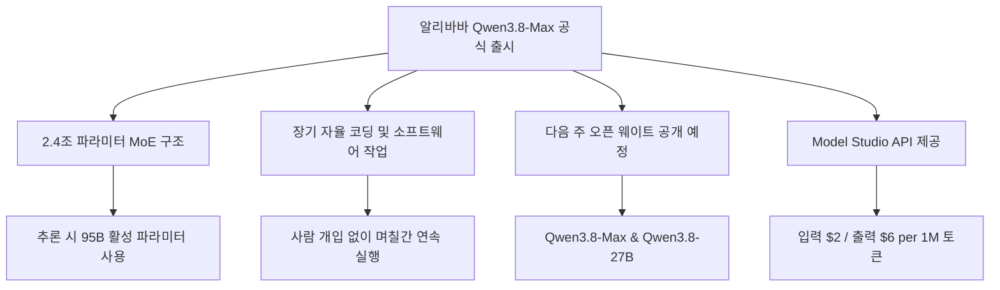
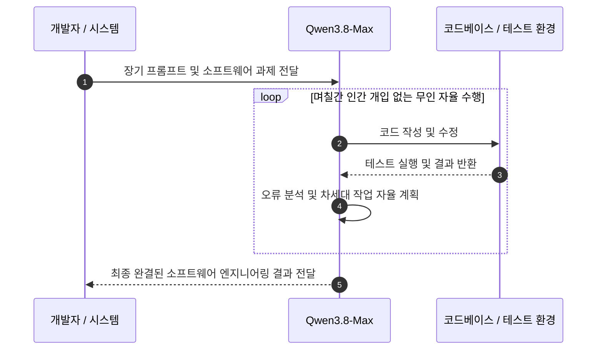
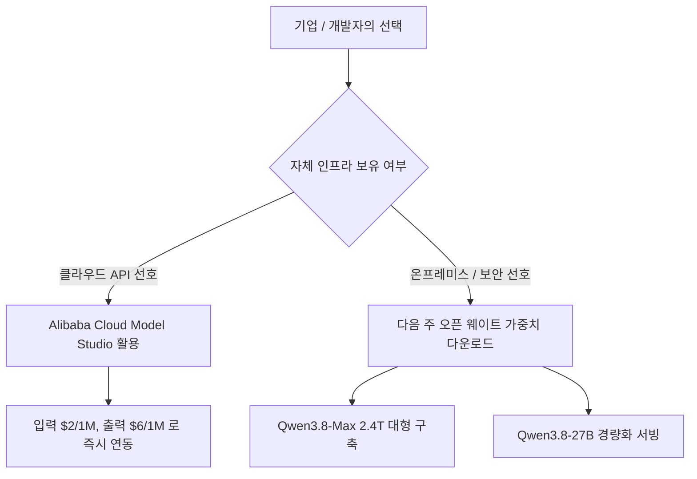

Qwen3.8-Max를 검토할 때는 2.4조라는 전체 파라미터보다 요청당 활성화되는 950억 파라미터, 실제 API 비용, 장기 작업의 실패 복구 방식을 함께 봐야 합니다. 100만 토큰 문맥은 많은 자료를 넣을 수 있다는 상한이지, 모든 내용을 같은 정확도로 기억하거나 코드베이스 전체를 무인 운영할 수 있다는 보장은 아닙니다. 오픈 웨이트 역시 발표 당시 계획이었으므로 실제 배포와 라이선스를 확인하기 전에는 자체 호스팅을 확정하면 안 됩니다.



위 다이어그램은 발표에 포함된 모델 구조, API와 오픈 웨이트 계획을 구분해 보여줍니다.

## 무슨 일이 벌어진 걸까?

알리바바가 2026년 8월 3일 2.4조 파라미터 규모의 초거대 AI 모델인 Qwen3.8-Max를 정식으로 세상에 내놓았습니다 <sup class="source-citation"><a href="#source-1" aria-label="알리바바 클라우드 블로그 출처">[1]</a></sup>.

Qwen3.8-Max의 전체 파라미터는 2조 4,000억 개이며, 연산을 수행할 때 필요한 전문가를 고르는 Mixture-of-Experts(MoE) 방식을 채택했습니다 <sup class="source-citation"><a href="#source-1" aria-label="알리바바 클라우드 블로그 출처">[1]</a></sup>. 실제 추론 과정에서는 전체의 일부인 950억 개(95B)의 활성 파라미터가 작동한다고 설명됐습니다 <sup class="source-citation"><a href="#source-3" aria-label="벤처비트 출처">[3]</a></sup>. 이는 토큰마다 모든 파라미터를 계산하지 않는다는 뜻이지만, 전체 가중치의 저장과 분산 실행 부담까지 95B 밀집 모델과 같아진다는 뜻은 아닙니다.

100만 토큰(1-million-token)의 컨텍스트 윈도우를 지원하며, 텍스트뿐만 아니라 이미지와 비디오 입력을 처리할 수 있는 멀티모달 모델로 소개됐습니다 <sup class="source-citation"><a href="#source-2" aria-label="사우스 차이나 모닝 포스트 출처">[2]</a></sup>. 실제로 긴 문맥을 모두 채우면 입력 비용과 지연 시간도 늘고, 중요한 지시가 긴 자료 사이에 묻힐 수 있으므로 상한과 유효 활용량을 구분해야 합니다.

입력 데이터가 들어오면 100만 토큰 대용량 메모리를 거쳐 MoE 시스템이 연산을 최적화하는 흐름을 보여줍니다.

## 며칠간 자율 코딩했다는 주장을 어떻게 검증할까?

발표에서 특히 강조된 항목은 '장기 자율 코딩' 능력입니다.

알리바바의 내부 테스트와 시연에서는 사람이 중간에 수정하지 않은 채 며칠 동안 소프트웨어 엔지니어링 과제를 이어간 결과가 소개됐습니다 <sup class="source-citation"><a href="#source-1" aria-label="알리바바 클라우드 블로그 출처">[1]</a></sup>. 그러나 실행 시간이 길다는 사실만으로 결과가 정확하거나 비용 효율적이라고 판단할 수는 없습니다. 같은 테스트를 반복했을 때의 성공률, 잘못 변경한 파일 수, 되돌림과 재시도 횟수, 최종 테스트 통과 여부를 함께 확인해야 합니다.

장기 작업에서는 모델 성능 외에도 실행 장치가 중요합니다. 체크포인트 없이 며칠간 진행하면 한 번의 오류나 만료된 세션으로 앞선 작업을 잃을 수 있고, 넓은 셸 권한을 주면 잘못된 명령의 피해가 커집니다. 작업을 작은 단계로 나누고 각 단계의 변경 내역과 테스트 결과를 저장하며, 비용, 시간, 파일 변경 범위에 상한을 두어야 발표의 시연을 운영 가능한 워크플로로 바꿀 수 있습니다.



사람의 개입 없이 AI가 주도적으로 코드를 수정하고 테스트를 반복하는 루프가 핵심입니다.

알리바바 클라우드 Model Studio의 Qwen3.8-Max API 가격은 입력 100만 토큰당 2달러($2), 출력 100만 토큰당 6달러($6)로 소개됐습니다 <sup class="source-citation"><a href="#source-3" aria-label="벤처비트 출처">[3]</a></sup>. 100만 토큰을 모두 입력하는 호출이라면 표시 단가만으로도 입력 비용이 2달러이므로, 긴 문맥을 반복해서 보내는 에이전트는 호출 횟수와 출력량까지 포함해 예산을 잡아야 합니다.

```chartjs
{
  "type": "bar",
  "data": {
    "labels": ["입력 토큰 (1M당)", "출력 토큰 (1M당)"],
    "datasets": [
      {
        "label": "Qwen3.8-Max API 가격 (USD)",
        "data": [2, 6]
      }
    ]
  },
  "options": {
    "plugins": {
      "title": {
        "display": true,
        "text": "Qwen3.8-Max Model Studio API 이용 비용 ($)"
      }
    }
  }
}
```

차트는 발표 시점의 입력 및 출력 토큰 표시 단가를 보여줍니다.

## API와 자체 호스팅 중 무엇을 선택할까?

Model Studio API는 인프라를 먼저 마련하지 않고 Qwen3.8-Max의 긴 문맥과 도구 사용을 시험하는 경로입니다 <sup class="source-citation"><a href="#source-3" aria-label="벤처비트 출처">[3]</a></sup>. 대규모 코드베이스나 여러 문서를 입력 후보로 삼을 수 있지만, 전부 한 번에 넣기보다 검색으로 필요한 부분을 고른 방식과 품질, 비용을 비교하는 것이 좋습니다 <sup class="source-citation"><a href="#source-1" aria-label="알리바바 클라우드 블로그 출처">[1]</a></sup>.

발표 당시 알리바바는 Qwen3.8-Max와 270억 파라미터 Qwen3.8-27B의 오픈 웨이트를 다음 주에 공개할 계획이라고 밝혔습니다 <sup class="source-citation"><a href="#source-1" aria-label="알리바바 클라우드 블로그 출처">[1]</a></sup>. 계획과 실제 배포는 구분해야 하며, 자체 서버 도입 여부는 파일 공개와 라이선스, 지원 엔진을 확인한 뒤 판단해야 합니다.

| 구 분 | Qwen3.8-Max | Qwen3.8-27B |
| :--- | :--- | :--- |
| **전체 파라미터** | 2조 4,000억 개 (2.4T MoE) | 270억 개 (27B) |
| **활성 파라미터** | 950억 개 (95B) | 미공개 (단일/MoE 여부 미확인) |
| **컨텍스트 윈도우** | 100만 토큰 (1M) | 미공개 |
| **오픈 웨이트 공개** | 다음 주 예정 | 다음 주 예정 |
| **API 가격** | 입력 $2 / 출력 $6 (1M 토큰 기준) | Model Studio 사양 확인 필요 |

## 직접 써보거나 지켜볼 포인트

당장 사용할 수 있는 옵션과 다음 주 오픈 웨이트 공개 이후 선택지를 전략적으로 구분할 필요가 있습니다.

발표 시점에는 알리바바 클라우드 Model Studio에서 Qwen3.8-Max API를 호출할 수 있다고 안내됐습니다 <sup class="source-citation"><a href="#source-3" aria-label="벤처비트 출처">[3]</a></sup>. 긴 비디오 분석이나 프로젝트 코드 리팩터링을 시험한다면, 정답이 알려진 작은 자료로 시작해 입력 길이를 늘리면서 누락과 비용이 어떻게 변하는지 확인하는 편이 안전합니다.



기업의 인프라 조건과 보안 요구사항에 따른 최적의 도입 경로입니다.

자체 구축을 고려하는 연구소나 기업은 실제 오픈 웨이트 저장소와 라이선스가 공개됐는지부터 확인해야 합니다. 가중치를 받을 수 있다는 사실만으로 현재 추론 엔진에서 바로 실행되거나 자체 데이터 학습이 허용된다고 볼 수 없으며, 모델별 하드웨어와 소프트웨어 지원 조건을 따로 검증해야 합니다 <sup class="source-citation"><a href="#source-1" aria-label="알리바바 클라우드 블로그 출처">[1]</a></sup>.

API 시험에서는 긴 문맥과 장기 실행을 한꺼번에 켜기보다 변수를 나눠야 합니다. 먼저 짧은 코드 작업의 정확성과 도구 호출 형식을 확인하고, 같은 과제에서 입력 길이만 늘린 뒤, 마지막으로 체크포인트를 둔 장기 작업을 평가합니다. 이렇게 해야 오류가 모델의 기본 추론, 문맥 검색, 에이전트 실행기 중 어디에서 생겼는지 구분할 수 있고 표시 단가와 실제 완료 작업당 비용도 연결할 수 있습니다.

실패한 실행도 결과에서 빼지 않아야 합니다. 성공한 한 번의 비용만 보고하면 재시도와 사람이 되돌린 변경이 사라져 장기 에이전트의 실제 효율을 과대평가하게 됩니다.

## 아직은 선을 그어야 할 부분

기술적 성과와 별개로, 실제 현장 도입 시 냉정하게 따져봐야 할 확인되지 않은 사실과 제한 요소가 있습니다.

첫째, 알리바바는 발표 당시 다음 주 오픈 웨이트 공개를 예고했지만 정확한 배포 일자와 라이선스 조건은 명시하지 않았습니다 <sup class="source-citation"><a href="#source-1" aria-label="알리바바 클라우드 블로그 출처">[1]</a></sup>. 상업 이용과 재배포 조건은 가중치 저장소의 실제 라이선스를 확인해야 합니다.

둘째, 2.4조 파라미터 오픈 웨이트가 배포되더라도 자체 구동 비용은 별개의 문제입니다. 추론 시 950억 개가 활성화된다는 설명만으로 저장, 메모리, 장치 간 통신 요구를 계산할 수 없으며, 정밀도와 양자화, 추론 엔진에 따라 필요한 구성이 달라집니다. 공식 하드웨어 지침과 작은 벤치마크 없이 운영 규모를 추정해서는 안 됩니다.

<!-- primary-sources:start -->
## 원문과 버전 확인

- [발표 원문](https://www.alibabacloud.com/blog/qwen3.8-max-a-new-bar-for-coding-and-cowork)
- [South China Morning Post](https://www.scmp.com/tech/tech-war/article/3272981/alibabas-ai-model-qwen38-max-widely-accessible-ahead-open-weights-release)
- [VentureBeat](https://venturebeat.com/ai/qwen3-8-max-arrives-with-a-bold-claim-it-outperforms-gpt-5-6-sol-max-and-fable-5-on-agentic-computer-use)
<!-- primary-sources:end -->

<!-- internal-links:start -->
## 함께 읽으면 이해가 이어지는 글

- [Nvidia Nemotron 3.5 Lightning과 NeMo Switchyard: 에이전트 모델 라우팅 판단법]() — Nvidia가 자율 에이전트 시스템을 위해 개발된 30B 규모의 오픈 모델 Nemotron 3.5 Lightning과 오픈소스 라우터 라이브러리 NeMo Switchyard를 2026년 8월 11일 공개했습니다. NeMo…
- [Google Gemini 3.7 Flash 출시: 코딩 성능 향상과 50% 수준의 API 가격 할인]() — Google AI가 2026년 8월 13일 소프트웨어 엔지니어링과 에이전트 추론 성능을 끌어올린 Gemini 3.7 Flash 모델을 정식 출시했습니다. 100만 토큰 문맥 창과 최대 64K 출력 토큰을 지원하며…
- [OpenRouter에 등장한 스텔스 AI 모델 OX Alpha 무료 공개, 100만 토큰과 DeepSWE 80% 성능 분석]() — 2026년 8월 20일 OpenRouter에 100만 토큰 컨텍스트 창과 다중 모달 입력을 지원하는 스텔스 모델 OX Alpha가 등장했습니다. 프리뷰 기간 무료로 제공되는 이 모델은 DeepSWE 코딩 벤치마크 하위 집합에서 80%…
<!-- internal-links:end -->

## 자주 묻는 질문

### Qwen3.8-Max의 파라미터 규모와 활성 파라미터는 각각 얼마인가요?

Qwen3.8-Max는 전체 2조 4,000억 개(2.4T)의 파라미터로 구성된 MoE 모델이며, 실제 추론 연산 시에는 950억 개(95B)의 활성 파라미터만 작동합니다.

### Qwen3.8-Max API의 이용 가격은 어떻게 되나요?

알리바바 클라우드 Model Studio 기준으로 입력 토큰 100만 개당 2달러($2), 출력 토큰 100만 개당 6달러($6)에 제공됩니다.

### Qwen3.8-Max 모델 가중치(오픈 웨이트)를 직접 다운로드할 수 있나요?

발표 당시 알리바바는 Qwen3.8-Max와 Qwen3.8-27B의 오픈 웨이트를 다음 주에 공개할 계획이라고 밝혔습니다. 다만 이 글의 근거 범위에는 실제 배포 완료 여부와 라이선스 조건이 포함되지 않으므로 저장소에서 다시 확인해야 합니다.

## 직접 확인한 원문

<ol class="checked-source-list">
  <li id="source-1"><a href="https://www.alibabacloud.com/blog/qwen3.8-max-a-new-bar-for-coding-and-cowork" target="_blank" rel="noopener noreferrer">Alibaba Cloud Community — Qwen3.8-Max: A New Bar for Coding and Cowork</a> (2026-08-03)</li>
  <li id="source-2"><a href="https://www.scmp.com/tech/tech-war/article/3272981/alibabas-ai-model-qwen38-max-widely-accessible-ahead-open-weights-release" target="_blank" rel="noopener noreferrer">South China Morning Post — Alibaba&#x27;s AI model Qwen3.8-Max widely accessible ahead of open-weights release</a> (2026-08-03)</li>
  <li id="source-3"><a href="https://venturebeat.com/ai/qwen3-8-max-arrives-with-a-bold-claim-it-outperforms-gpt-5-6-sol-max-and-fable-5-on-agentic-computer-use" target="_blank" rel="noopener noreferrer">VentureBeat — Qwen3.8-Max arrives with a bold claim: it outperforms GPT-5.6 Sol Max and Fable 5 on agentic computer use</a> (2026-08-03)</li>
</ol>

> 이 글은 위 원문을 직접 확인해 작성했습니다. 가격, 기능 범위, 지역별 제공 여부는 게시 후 바뀔 수 있으니 실제 도입 전 공식 문서를 다시 확인하세요.
