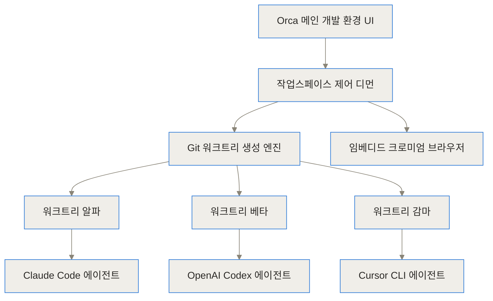
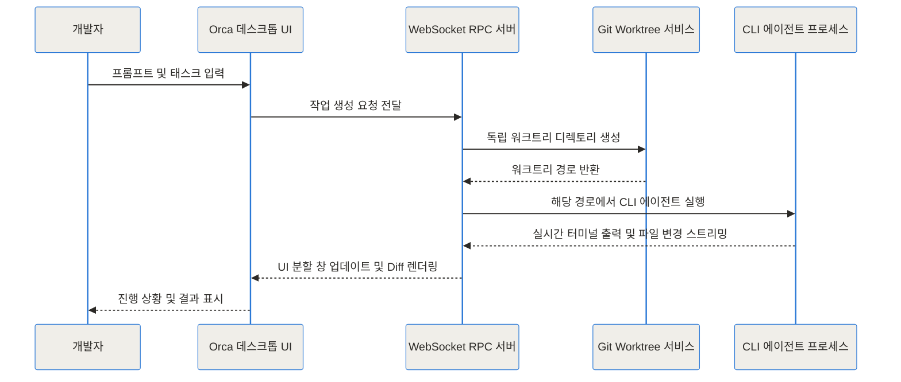
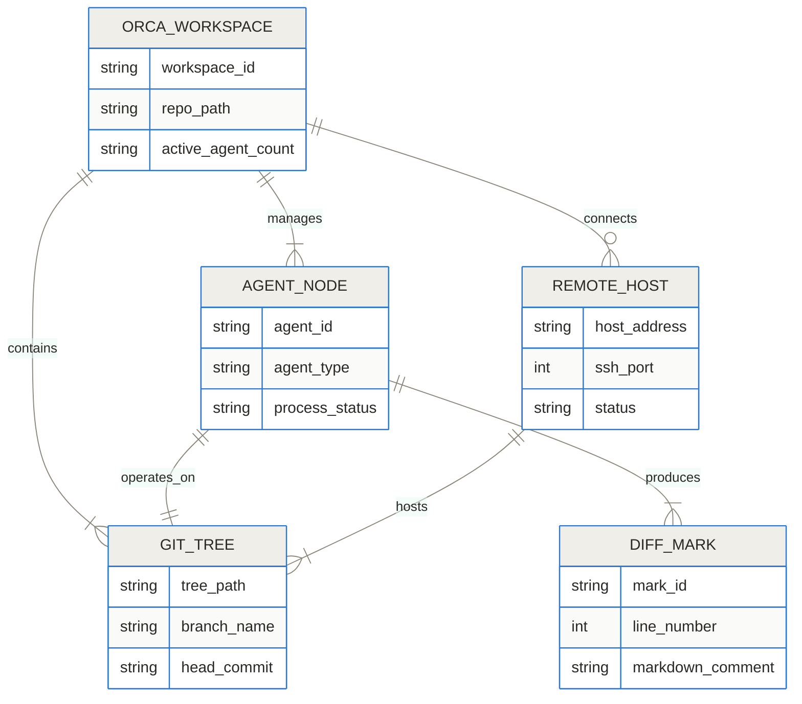
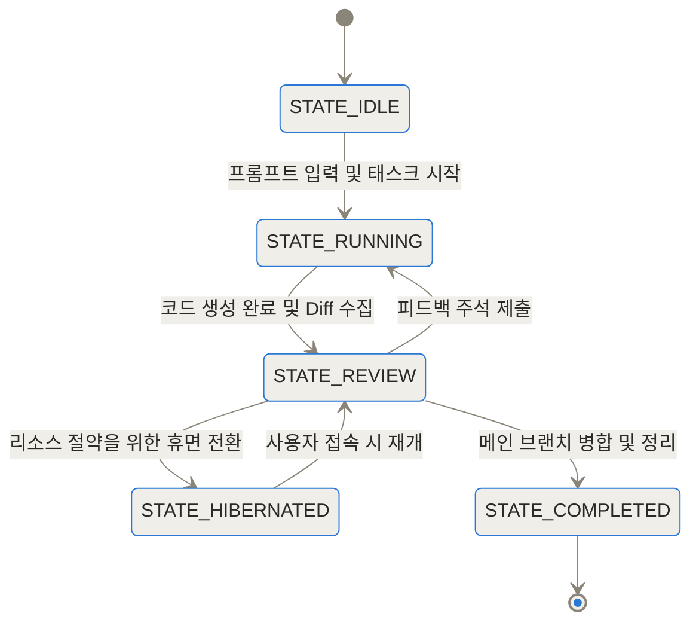
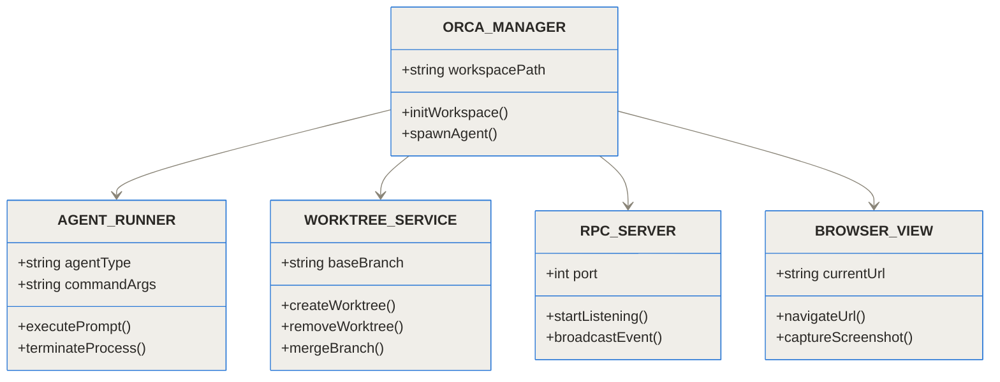
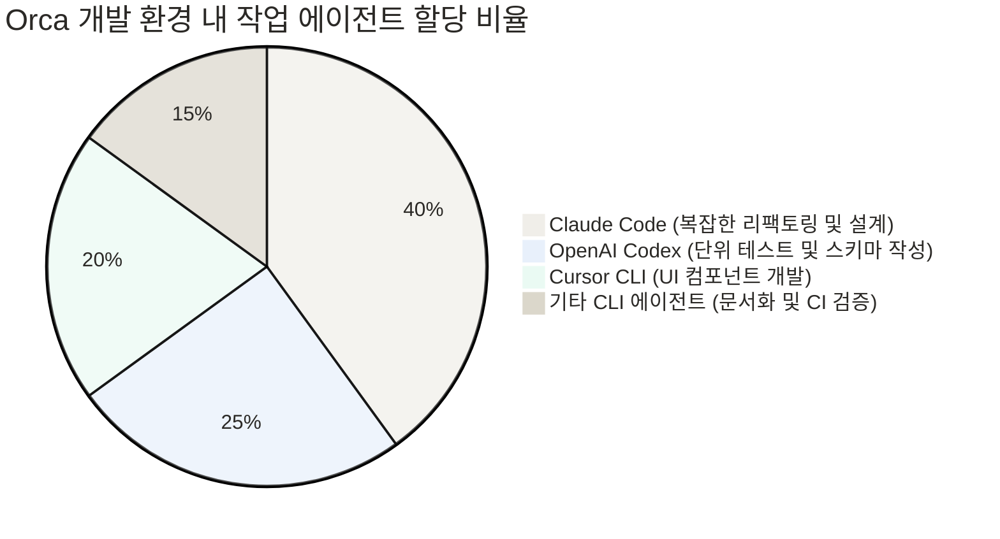

- [stablyai/orca GitHub 저장소](https://github.com/stablyai/orca)
- [Orca 공식 프로젝트 페이지](https://onorca.dev)

## 멀티 에이전트 개발 시대의 새로운 패러다임

**TL;DR (3줄 요약)**
- stablyai/orca는 Claude Code, OpenAI Codex, Cursor CLI 등 다양한 터미널 기반 AI 에이전트를 한곳에서 실행하고 통합 제어하는 오픈소스 ADE(Agent Development Environment)입니다.
- Git Worktree 기술을 활용해 개별 에이전트의 작업 영역을 완전 격리함으로써 소스코드 수정 중 발생하는 파일 충돌과 Git 인덱스 잠금을 차단합니다.
- 개인 에이전트 구독 계정(BYO Subscription)을 그대로 사용할 수 있으며 데스크톱, 원격 VPS, 모바일 companion 환경까지 확장된 병렬 개발 체계를 제공합니다.

단일 AI 코딩 도우미에게 의존하던 시대에서 여러 AI 에이전트를 동시에 운용하는 시대로 개발 패러다임이 빠르게 변화하고 있어요. 그러나 터미널 창을 여러 개 열어 두고 각기 다른 AI 에이전트를 실행해 본 개발자라면 누구나 극심한 파일 충돌과 Git 인덱스 잠금 현상을 경험해 보셨을 겁니다.

한 에이전트가 백엔드 API를 수정하는 동안 다른 에이전트가 데이터베이스 스키마를 고치다가 서로의 코드를 덮어써 버리거나, Git 커밋 상태가 꼬여 작업 내용이 날아가는 상황이 빈번하게 발생하죠. 게다가 에이전트가 긴 리팩토링 작업을 수행하는 동안 개발자는 화면을 지켜보며 대기해야만 했습니다.

stablyai/orca는 이러한 멀티 에이전트 병목 현상을 해결하기 위해 등장한 에이전트 개발 환경(Agent Development Environment, ADE)입니다. 여러 AI 에이전트가 서로를 방해하지 않고 독립된 Git Worktree 영역에서 수평적으로 코드를 작성하도록 오케스트레이션해 줍니다.

## stablyai/orca란 무엇인가: ADE 개념과 기존 IDE와의 비교

기존의 통합 개발 환경(IDE, Integrated Development Environment)인 VS Code나 JetBrains 제품군이 '사람 개발자'가 직접 코드를 입력하고 편집하는 데 최적화된 도구라면, ADE(Agent Development Environment)는 '자율형 AI 에이전트 군단'이 코드를 개발하도록 환경을 조성하고 감독하는 지휘 통제소 역할을 합니다.

기존 IDE에 에이전트 플러그인을 붙여 쓰는 방식은 단일 작업 영역(Working Directory)을 공유하기 때문에 병렬 작업이 불가능했어요. 반면 Orca는 프로젝트 구동부터 버전 관리, 브라우저 테스트, 원격 서버 실행까지 멀티 에이전트 관점에 맞춰 처음부터 다시 설계되었습니다.

특히 Orca는 사용자 소유 구독 모델(BYO - Bring Your Own Subscription)을 지향해요. 별도의 중계 API 비용을 지불할 필요 없이, 개발자가 이미 이용 중인 Claude Code, OpenAI Codex, Cursor CLI, Gemini, Grok 등의 CLI 계정 자격 증명을 그대로 터미널 환경에 연결하여 사용할 수 있습니다.

## stablyai/orca 내부 아키텍처와 분리 메커니즘 (Under the Hood)

Orca가 내부적으로 작동하는 방식과 에이전트 간 독립성을 보장하는 기술적 아키텍처를 하나씩 풀어보겠습니다.

### Git Worktree 기반 상호 격리 엔진

Orca 오케스트레이션의 가장 중요한 요소는 **Git Worktree(하나의 Git 저장소 내에서 여러 작업 디렉토리를 동시에 체크아웃하여 사용할 수 있게 해주는 Git의 자체 기능)** 활용입니다.

에이전트에게 새로운 태스크를 할당할 때마다 Orca는 메인 브랜치를 더럽히지 않고 숨겨진 영역에 독립된 Git Worktree 디렉토리를 순간적으로 생성합니다. 에이전트는 자신에게 할당된 별도의 파일 시스템 디렉토리 안에서만 읽고 쓰기를 수행하므로, 다른 에이전트나 개발자의 로컬 작업 영역에 어떠한 영향도 주지 않아요.



위 다이어그램처럼 Orca 제어 레이어가 하위의 Git 워크트리를 생성하고, 각 워크트리에 서로 다른 CLI 에이전트를 매핑하여 병렬 조율을 달성합니다.

### WebSocket RPC 통신과 터미널 자동화

Orca는 데스크톱 프론트엔드(Electron, React, Vite)와 내부 백엔드 디먼 간에 WebSocket 기반의 RPC(Remote Procedure Call) 서버 구조를 사용합니다. 각 에이전트 터미널의 표준 입출력(STDIN/STDOUT)은 가상 터미널(pty) 프로세스 형태로 RPC 디먼에 수집되며, 실시간으로 UI 캔버스에 분할 창(Split Panes) 구조로 렌더링됩니다.



개발자는 여러 터미널을 번갈아 들어갈 필요 없이, Orca의 통합 반응형 인터페이스에서 동시에 구동 중인 수십 개의 에이전트 상태를 실시간으로 모니터링할 수 있어요.

### 엔티티 데이터 모델 관계

Orca의 내부 데이터 모델은 작업스페이스, 에이전트 노드, Git 워크트리, 코드 차이점 주석(Diff Annotations), 원격 호스트 간의 정교한 관계 구조를 띱니다.



### 에이전트 수명주기와 상태 전이 모델

에이전트는 단순히 실행과 종료로 나뉘지 않고, 휴면(Hibernation) 상태를 포함한 여러 단계의 생명주기를 거칩니다.



태스크가 끝나거나 개발자의 피드백을 기다릴 때 에이전트는 `STATE_HIBERNATED` 상태로 들어가 CPU와 메모리 자원 할당을 낮추고, 개발자가 다시 세션을 열었을 때 `STATE_REVIEW` 상태로 빠르게 즉시 복원됩니다.

### 주요 클래스 및 런타임 서비스 모듈

Orca의 코어 소프트웨어 디자인을 클래스 구조로 살펴보면 다음과 같습니다.



`ORCA_MANAGER`가 전체 시스템을 총괄하며, `WORKTREE_SERVICE`를 통해 깃 작업을 격리하고 `AGENT_RUNNER`를 통해 CLI 에이전트 수명주기를 제어합니다.

### 임베디드 크로미엄과 Computer Use 브라우저 바운딩

Orca 내부에는 단순 코드 에디터뿐만 아니라 일급 객체로서의 **임베디드 크로미엄(Embedded Chromium Browser)** 영역이 내장되어 있습니다. 웹 프론트엔드 작업을 수행하는 에이전트는 자신이 수정한 코드가 화면에 어떻게 출력되는지 내장 브라우저를 직접 조작(Computer Use)하거나 스크린샷 및 DOM 요소를 수집하여 검증할 수 있어요.

### 에이전트 작업 리소스 및 워크로드 분배 예시

실제 개발 현장에서 Orca를 활용해 작업을 나눌 때 지원되는 다양한 CLI 에이전트의 활용 비중은 다음 그래프와 같습니다.



### 코드 차이점 주석(Annotate AI Diffs) 피드백 루프

Orca의 또 다른 강력한 기능은 생성된 코드 차이점에 개발자가 마크다운 주석을 남겨 에이전트에게 피드백을 수월하게 돌려주는 시스템입니다.


개발자가 코드 변경 내역의 특정 줄에 인라인 마크다운 피드백을 남기면, Orca는 이 주석들을 하나의 컨텍스트 묶음으로 구조화하여 에이전트의 터미널 프롬프트로 전송합니다. 개발자는 긴 문장을 직접 입력할 필요 없이 마우스 클릭과 간단한 메모만으로 에이전트의 오답을 정교하게 수정할 수 있어요.

다음 그래프는 기존 단일 작업 방식과 Orca의 병렬 에이전트 워크트리 방식을 비교한 수치입니다.

```chartjs
{"type":"bar","data":{"labels":["기존 단일 에디터 작업","Orca 병렬 워크트리 작업"],"datasets":[{"label":"동일 복합 태스크 처리 소요 시간 (분)","data":[180,35]}]},"options":{"responsive":true}}
```

아래 그래프는 Orca에서 지원하는 주요 AI 코딩 에이전트 생태계 분포 현황을 보여줍니다.

```chartjs
{"type":"doughnut","data":{"labels":["Claude Code","OpenAI Codex","Cursor CLI","Gemini / Grok / OpenCode / 기타"],"datasets":[{"label":"지원 에이전트 연동 비율 (","data":[35,30,20,15]}]},"options":{"responsive":true}}
```

## 어떻게 설치하고 원격 개발 환경을 구성하나

Orca는 cross-platform을 지원하므로 macOS, Linux, Windows 데스크톱 환경에 손쉽게 설치할 수 있습니다.

### 데스크톱 패키지 관리자 설치

macOS 사용자라면 Homebrew Cask를 통해 단 한 줄의 명령어로 설치가 가능합니다.

```bash
# macOS (Homebrew)
brew install --cask stablyai/orca/orca
```

Arch Linux 환경에서는 AUR 패키지 리포지토리를 활용해 빌드할 수 있습니다.

```bash
# Arch Linux (AUR)
yay -S stably-orca
```

### 원격 VPS 및 Headless Linux 서버 구동 (`orca serve`)

고성능 클라우드 VPS 또는 서버실의 리눅스 머신에서 에이전트 군단을 고속으로 구동하고 싶다면, `orca serve` 헤드리스 디먼을 활용하면 됩니다.

```bash
# 원격 서버에서 Orca RPC 서버 실행
orca serve --port 9090 --secret-key my-secure-token
```

이후 로컬 데스크톱 앱이나 모바일 Companion 앱에서 SSH 터널 및 WebSocket으로 원격 서버에 연결하면, 로컬 머신의 리소스를 전혀 쓰지 않고도 원격 서버의 강력한 CPU/GPU 및 대역폭 위에서 수십 개의 에이전트를 실시간 조종할 수 있습니다.

### 저장소 지침 파일 설정 (`agents.mmd` 및 Context 파일)

에이전트들이 공통적으로 지켜야 할 프로젝트 코딩 스타일, 리포지토리 레이아웃, 빌드 명령어를 정의하기 위해 프로젝트 루트에 지침 파일들을 배치할 수 있습니다.

```markdown
# agents.mmd 예시 내용
- 모든 백엔드 코드는 TypeScript strict 모드를 준수할 것.
- 데이터베이스 스키마 변경 시 반드시 migration 스크립트를 동시 생성할 것.
- 개별 워크트리 작업 완료 후 pnpm test 명령을 실행하여 통과 여부를 검증할 것.
```

Orca는 워크트리가 생겨날 때 이 컨텍스트 문서를 에이전트의 프롬프트 초기 환경 지침(System Prompt Grounding)으로 자동 주입합니다.

## 실전 소프트웨어 개발 시나리오

실무 소프트웨어 개발 프로세스에서 Orca가 어떻게 활용되는지 3가지 유용한 시나리오를 통해 알아보겠습니다.

### 시나리오 1: 백엔드 API 리팩토링과 프론트엔드 연동의 완전 병렬화

기존 방식에서는 백엔드 개발 에이전트가 API 규격을 고칠 때까지 프론트엔드 에이전트는 대기해야 했습니다. Orca에서는 두 개의 워크트리를 동시에 엽니다.
1. **워크트리 A (Claude Code)**: 레거시 REST API를 gRPC 기반 포맷으로 리팩토링 및 데이터베이스 쿼리 최적화 수행.
2. **워크트리 B (Cursor CLI)**: 예상되는 gRPC 인터페이스 사양을 모킹(Mocking)하여 프론트엔드 UI 컴포넌트 신규 개발.
3. 각 작업이 끝나면 Orca 내장 브라우저로 통합 동작을 테스트한 후 메인 브랜치로 한번에 Squash Merge합니다.

### 시나리오 2: 알고리즘 복수 후보 비교 및 벤치마킹

복잡한 데이터 처리 알고리즘을 구현할 때 어떤 접근법이 최고 성능을 낼지 모르는 상황입니다.
1. **워크트리 A**: OpenAI Codex에게 메모리 효율 중심의 퀵소트 변형 알고리즘 작성을 지시.
2. **워크트리 B**: Gemini 에이전트에게 병렬 루티닝 중심의 알고리즘 작성을 지시.
3. 두 에이전트가 완수하면 Orca의 빠른 벤치마크 실행 명령을 통해 처리 속도와 메모리 점유율을 측정하고, 뛰어난 솔루션의 워크트리만 채택하고 나머지는 폐기합니다.

### 시나리오 3: CI/CD 실패 원인 추적 및 자동 패치

GitHub Actions 빌드가 실패했을 때, Orca CLI 명령(`orca worktree create --from-ci`)을 발동하여 실패 로그를 에이전트에게 전달합니다. 에이전트가 즉각 별도 워크트리에서 원인을 분석하고 통과하는 패치 PR을 자동으로 생성해 줍니다.

## 기존 코딩 환경 및 경쟁 도구와의 기능 비교

기존의 주류 개발 도구들과 Orca ADE가 갖는 차별점을 표로 정리했습니다.

| 비교 항목 | 기존 VS Code + Copilot | Cursor IDE | Aider CLI | stablyai/orca ADE |
| :--- | :--- | :--- | :--- | :--- |
| **기본 패러다임** | 단일 개발자 중심 에디터 | AI 내장 단일 IDE | 단일 터미널 에이전트 | 병렬 멀티 에이전트 ADE |
| **에이전트 작업 영역** | 단일 디렉토리 공유 | 단일 디렉토리 공유 | 단일 작업 디렉토리 | **Git Worktree 기반 완전 격리** |
| **동시 병렬 실행 수** | 1개 | 1개 | 1개 (수동 복수 실행 시 충돌) | **수십 개 동시 구동 가능** |
| **수수료 및 구독** | 자체 구독 | 자체 플랜 구독 | CLI 개인 키 사용 | **BYO 구독 (기존 계정 활용)** |
| **원격 SSH / VPS** | 기본 Remote SSH | 제한적 지원 | 터미널 의존 | **Headless RPC 디먼 지원** |
| **코드 피드백 방식** | 텍스트 채팅 재입력 | 텍스트 채팅 | 터미널 텍스트 입력 | **마크다운 인라인 Diff 주석** |
| **임베디드 브라우저** | 기본 미지원 | 부분 지원 | 미지원 | **내장 크로미엄 Computer Use 연동** |

## Orca 도입 시 고려해야 할 한계점과 유의사항

모든 도구가 그렇듯 Orca 역시 만능은 아니며, 프로젝트에 도입하기 전 유의해야 할 요소들이 있습니다.

첫째, **디스크 공간 점유율 상승**입니다. 수십 개의 AI 에이전트를 병렬 구동하면 그 개수만큼 Git Worktree 디렉토리가 복제됩니다. 노드 모듈(`node_modules`)이나 대용량 빌드 아티팩트가 존재하는 프로젝트에서는 디스크 용량이 순식간에 수십 기가바이트 이상 늘어날 수 있습니다. 이를 막기 위해 pnpm과 같은 하드링크 기반 패키지 매니저를 쓰거나 작업을 마친 워크트리를 주기적으로 정리해 주는 관리가 필요해요.

둘째, **시스템 메모리 및 CPU 리소스 소모**입니다. Electron 기반 UI 및 내장 크로미엄, 그리고 여러 개 구동되는 Node.js/Python CLI 에이전트 프로세스는 로컬 PC의 RAM을 넉넉하게 사용합니다. RAM이 16GB 이하인 환경에서는 많은 수의 에이전트를 동시에 돌릴 때 속도 저하를 느낄 수 있으므로, 원격 VPS 기반의 `orca serve` 활용을 권장합니다.

셋째, **Git Merge 갈등의 사후 통합 부담**입니다. 비록 작업 중에는 파일이 완벽히 격리되어 충돌이 없지만, 에이전트 5개가 각자 수백 줄의 코드를 고친 후 메인 브랜치로 병합하려 할 때는 상당한 양의 Git Merge Conflict가 일어날 수 있습니다. 따라서 작업을 너무 크게 벌리기보다 작고 명확한 단위 기능으로 태스크를 쪼개어 자주 병합하는 전략이 필수적입니다.

## 멀티 에이전트 개발 생태계의 미래

stablyai/orca는 AI 코딩 에이전트를 사용하는 방식의 본질을 '1:1 대화'에서 '1:N 지휘 통제'로 완전히 바꾼 프로젝트입니다. 단일 에이전트가 코드를 다 쓸 때까지 멍하니 대기하던 기존의 비효율성을 Git Worktree 격리와 병렬 오케스트레이션을 통해 말끔히 해소해 줍니다.

개발자는 이제 직접 타이핑하는 사람을 넘어, 여러 특화 AI 에이전트에게 적절한 역할을 분배하고 최종 산출물의 코드 리뷰와 구조를 검증하는 고차원 아키텍터로 진화하고 있습니다. 멀티 에이전트 병렬 개발 체계를 구축하여 생산성 격차를 벌리고 싶은 팀이라면 stablyai/orca는 훌륭한 선택지가 될 것입니다.

## 자주 묻는 질문 (FAQ)

### stablyai/orca는 어떤 AI 에이전트를 지원하나요?

Claude Code, OpenAI Codex, Cursor CLI, Gemini, Grok, OpenCode, Cline 등 터미널 CLI 환경에서 구동 가능한 대부분의 코딩 에이전트를 지원합니다. 별도의 플랫폼 중계 수수료 없이 개발자가 기존에 구독하여 소지하고 있는 에이전트 계정을 그대로 연결하여 사용할 수 있습니다.

### 여러 에이전트가 동시에 실행될 때 소스코드 충돌은 어떻게 방지하나요?

Orca는 Git Worktree 기법을 활용하여 각 에이전트마다 독자적인 전용 파일 디렉토리와 브랜치를 생성합니다. 에이전트들은 서로 격리된 독립 환경에서 작업하므로 동일 파일에 대한 쓰기 충돌이나 Git 인덱스 잠금 현상이 발생하지 않습니다.

### 원격 서버나 VPS 환경에서도 Orca를 구동할 수 있나요?

네, `orca serve` 명령을 통해 헤드리스 Linux 서버에서 RPC 디먼 형태로 실행할 수 있습니다. 로컬 데스크톱 앱이나 모바일 Companion 앱에서 SSH 및 WebSocket 통신으로 원격 서버에 연결하면 고성능 클라우드 자원으로 수십 개의 에이전트를 원격 제어할 수 있습니다.

### Orca 사용 시 디스크 용량이나 리소스 소모를 줄이려면 어떻게 해야 하나요?

여러 워크트리가 생성되면 복제본으로 인해 디스크 용량이 커질 수 있으므로 pnpm 같은 하드링크 패키지 매니저를 사용하는 것이 좋습니다. 또한 작업이 끝난 에이전트는 휴면(Hibernation) 상태로 전환하거나 완성된 워크트리를 제때 삭제·병합하여 시스템 메모리와 디스크 공간을 관리할 수 있습니다.

### 에이전트가 작성한 코드 차이점(Diff)에 피드백을 전달하는 주석 기능은 어떻게 쓰나요?

Orca UI 내부의 코드 Diff 뷰에서 수정이 필요한 라인에 마크다운 주석을 작성할 수 있습니다. 작성된 인라인 피드백 주석들은 Orca에 의해 하나의 프롬프트 맥락으로 패키징되어 해당 에이전트의 터미널 콘솔로 직접 피드백 스트리밍 전송됩니다.


## References
- [https://github.com/stablyai/orca](https://github.com/stablyai/orca)
- [https://onorca.dev](https://onorca.dev)
