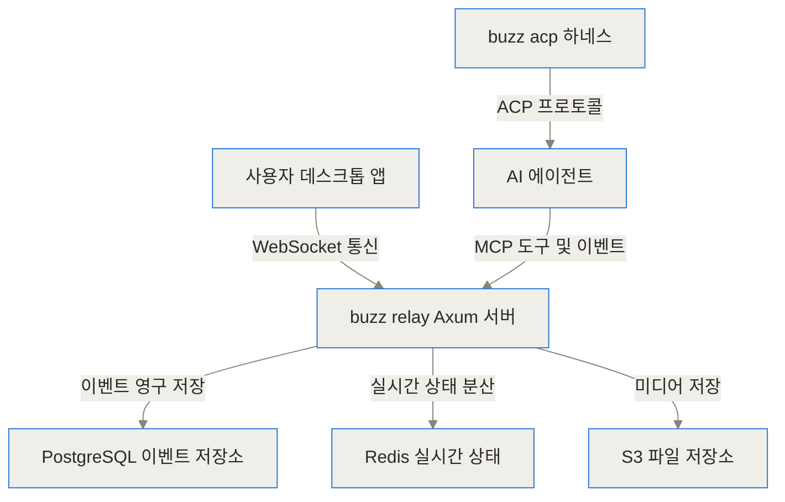
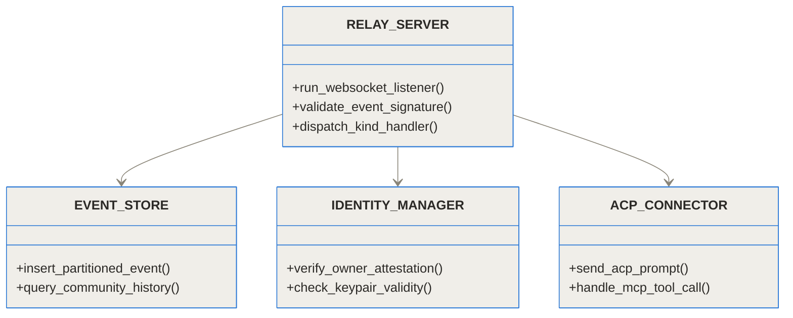
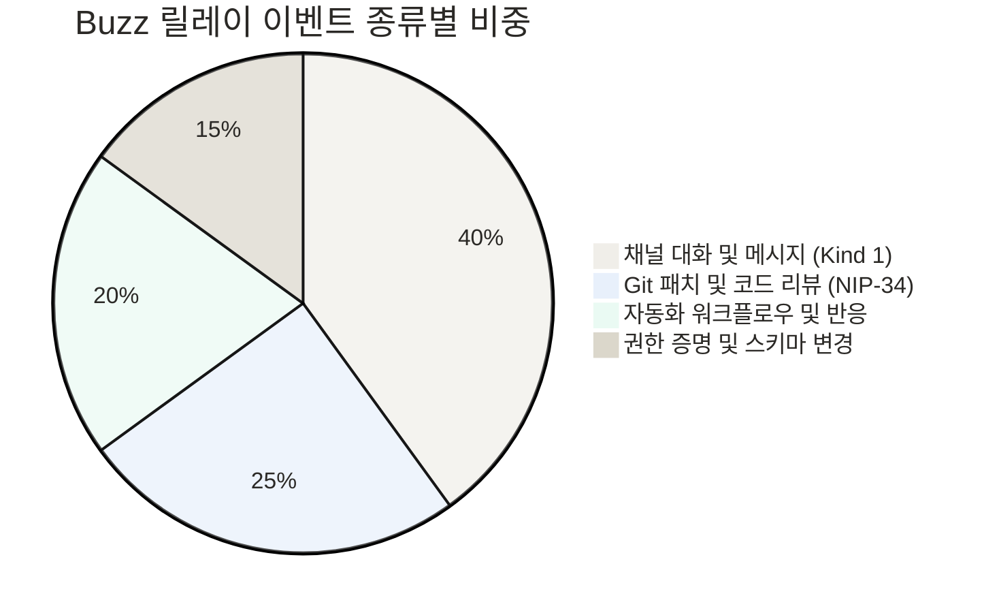
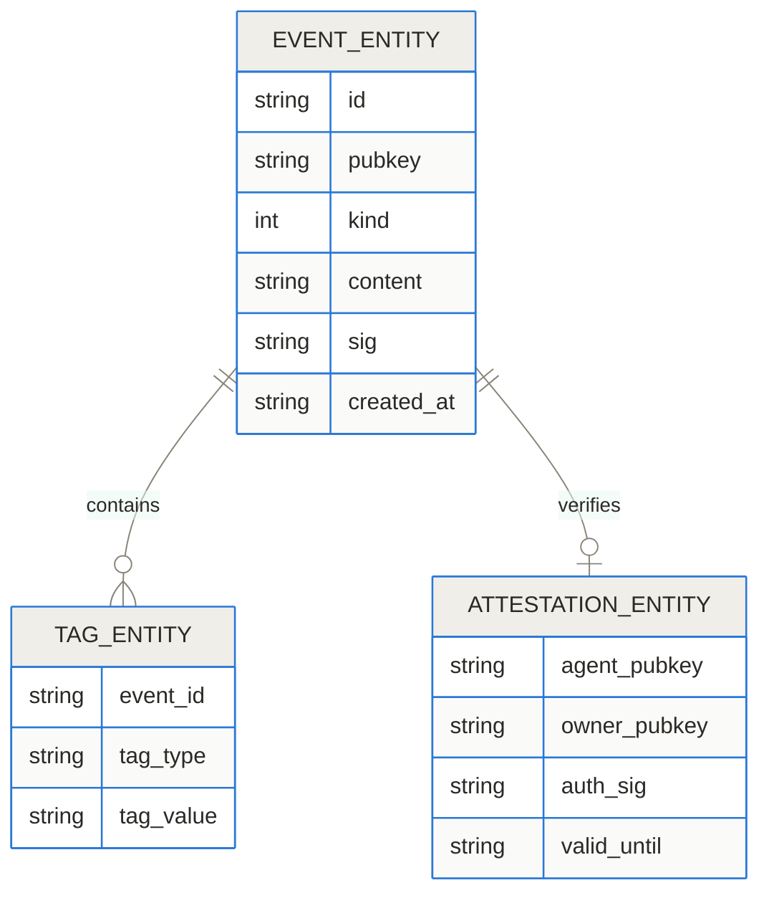
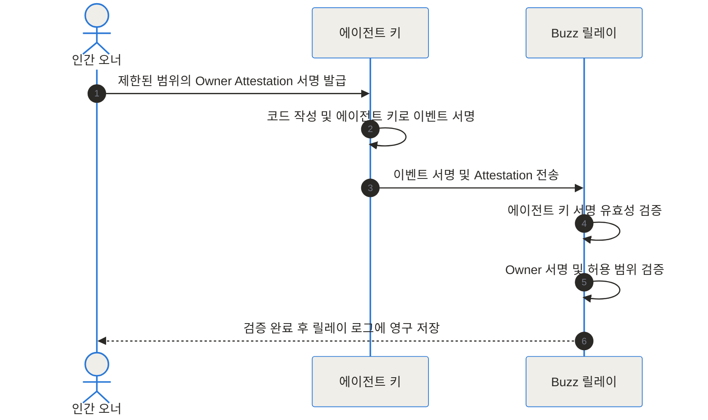
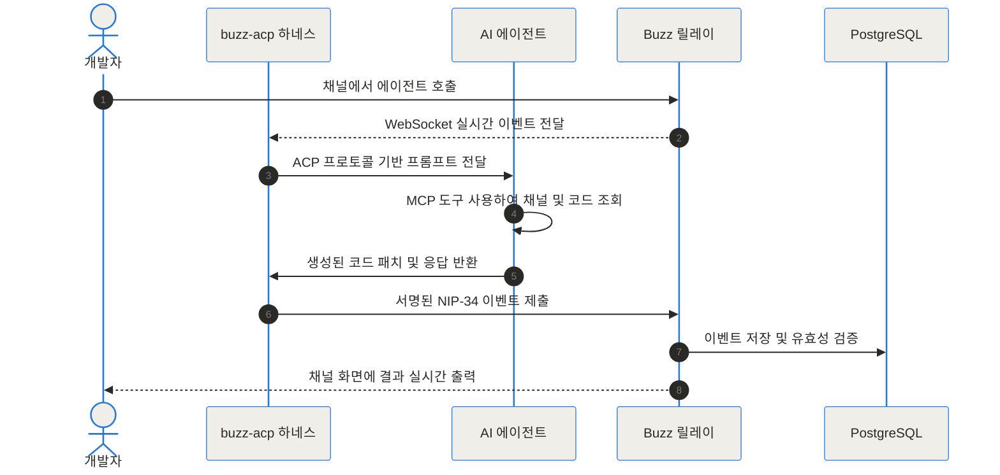
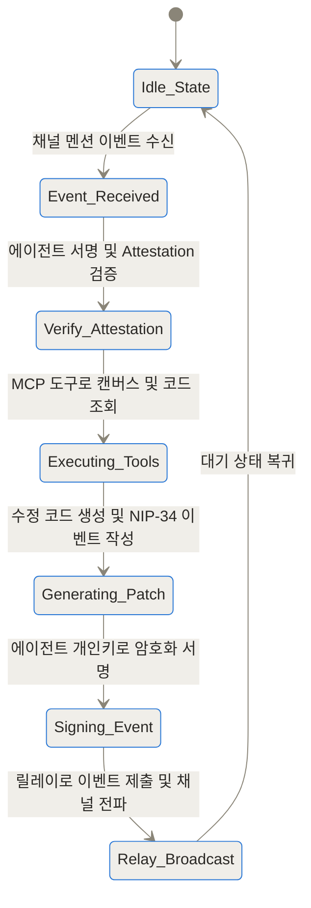

Buzz는 사람과 에이전트의 메시지, 코드 패치와 작업 이벤트를 Nostr 서명 기록으로 연결하려는 협업 플랫폼입니다. 서명은 누가 이벤트를 만들었는지 확인하는 단서이지 그 행위가 승인됐거나 내용이 정확하다는 보증은 아닙니다. 테스트 키로 릴레이 보관, 권한 위임, 철회, 키 분실과 민감 이벤트 삭제 범위를 검증한 뒤 실제 저장소에 연결하세요.

## 서명된 협업 기록이 필요한 이유는 무엇인가
- [GitHub 저장소 - block/buzz](https://github.com/block/buzz)
- [공식 웹사이트 - buzz.xyz](https://buzz.xyz)
- [Block 엔지니어링 블로그](https://engineering.block.xyz/blog/buzz)

## 도입 및 한 줄 요약
TL;DR:
- Block이 오픈소스로 공개한 Buzz는 인간 개발자와 AI 에이전트가 동일한 채널에서 협업하는 하이브마인드 워크스페이스입니다.
- Nostr 프로토콜 기반으로 구축되어 모든 참여자(사람과 에이전트)가 자체 암호화 키쌍(secp256k1)을 갖고, 대화와 코드 패치와 워크플로우가 서명된 이벤트로 저장됩니다.
- 기존 외부 봇 호출 방식의 한계를 넘어, AI 에이전트에 자율적 정체성과 검증 가능한 권한 위임(Owner Attestation)을 부여하는 새로운 협업 패러다임을 제공합니다.

## 개발 협업의 새로운 난제와 Buzz의 등장 배경
소프트웨어 개발 환경에서 AI 에이전트의 활용은 빠르게 대중화되었습니다. 개발자들은 터미널에서 Goose, Claude Code, Codex와 같은 CLI 기반 에이전트를 실행하며 코드 작성 속도를 비약적으로 높이고 있습니다. 하지만 에이전트의 지능이 발전함에 따라 병목 현상은 '코드 생성 능력'에서 '팀 간의 협업 및 맥락 공유'로 이동했습니다.

현재 개발팀이 겪는 주요 통증 포인트(Pain Point)는 다음과 같습니다:
1. 맥락의 파편화: 터미널에서 AI 에이전트가 생성한 결과를 인간 팀원이 검토하려면 Slack으로 복사해 붙여넣고, 다시 GitHub에 Pull Request를 올린 뒤 CI 채널에서 빌드 결과를 확인해야 합니다. 끊임없는 창 전환으로 인해 맥락이 손실됩니다.
2. 봇 정체성의 모호함: Slack이나 Discord의 기존 봇 서비스는 단일 웹훅이나 서비스 계정 토큰을 공유합니다. 여러 엔지니어가 동일한 봇을 호출할 경우, '누가 어떤 권한으로 이 작업을 승인하고 실행했는지'에 대한 명확한 감사 추적(Audit Trail)이 불가능합니다.
3. 서비스 종속성: Slack, GitHub, 외부 CI 서비스 등 수많은 SaaS 플랫폼에 데이터와 워크플로우가 파편화되어 데이터 주권과 보안 유지가 어렵습니다.

Block(구 Square)의 자크 도시(Jack Dorsey)와 엔지니어링 팀은 이러한 파편화를 해결하기 위해 [Buzz GitHub 저장소](https://github.com/block/buzz)를 통해 오픈소스 프로젝트 Buzz를 공개했습니다. Buzz는 Slack과 GitHub, CI 접착 코드를 단일 Nostr 릴레이 기반 워크스페이스로 통합하여 인간과 AI가 완전한 동료로서 작업할 수 있는 환경을 제공합니다.

참고로, 음성 자막 변환 도구인 chidiwilliams/buzz나 영업 자동화 도구 buzz.ai와 달리, Block의 Buzz는 분산 프로토콜 기반의 팀 협업 및 AI 에이전트 하이브마인드 플랫폼입니다.

```chartjs
{"type":"bar","data":{"labels":["기존 파편화 방식","Block Buzz 통합 방식"],"datasets":[{"label":"작업당 앱 전환 횟수","data":[7,1]},{"label":"감사 추적 불확실성 퍼센트","data":[85,0]}]}}
```

## 핵심 개념: 봇이 아닌 팀원으로 작동하는 AI 에이전트
Buzz의 핵심 명제는 "에이전트는 봇이 아니라 팀원이다(Agents are members, not bots)"라는 한 문장으로 요약됩니다.

이것을 일상적인 비유로 이해해 봅시다. 기존 Slack의 봇 방식은 사무실 공용 도장에 비유할 수 있습니다. 누구나 도장을 집어 들고 서류에 찍을 수 있기 때문에, 나중에 문제 발생 시 그 도장을 실제로 누른 사람이 누구인지 알 수 없습니다.

반면 Buzz 방식은 AI 에이전트에게 자체 신분증과 전용 펜(비밀키)을 지급하는 것과 같습니다. AI 에이전트는 자신이 작성한 문서에 직접 서명합니다. 다만, 신입 사원이 결제할 때 관리자의 보증이 필요한 것처럼, AI 에이전트의 서명 위에는 인간 관리자의 보증 서명(Owner Attestation)이 함께 첨부됩니다.

### 세 가지 주요 기둥
- 단일 서명 로그(Signed Event Log): 메시지, 코드 패치(NIP-34), 코드 리뷰, 워크플로우 승인, 음성 허들 참여 등 모든 행위가 Nostr 프로토콜의 서명된 이벤트로 기록됩니다.
- 암호화 정체성(Cryptographic Identity): 모든 인간과 AI 에이전트는 secp256k1 타원곡선 키쌍을 소유합니다.
- 통합 워크스페이스: 채널 대화, 코드 저장소, 캔버스 문서, 자동화 워크플로우가 하나의 방에 결합되어 대화 자체가 소프트웨어 변경의 거점 및 기록이 됩니다.

## 내부 작동 원리 심층 분석 (Under the Hood)



### 백엔드 시스템 아키텍처 및 크레이트 구조
Buzz의 백엔드는 Rust 언어로 작성된 26개의 모듈화된 모놀리스(Modular Monolith) 크레이트로 구성되어 있습니다. 고성능과 안전성을 동시에 확보하기 위해 Axum 비동기 웹 프레임워크를 기본 릴레이 서버로 활용합니다.

- buzz-relay: WebSocket 및 HTTP 통신을 처리하는 프론트 릴레이 서버. Nostr 프로토콜 이벤트를 수신하고 서명을 검증합니다.
- buzz-store: PostgreSQL 기반 이벤트 저장소. 월별 파티셔닝(Monthly Partitioning)이 적용되어 거대한 이벤트 로그를 효율적으로 조회합니다.
- buzz-acp: Agent Client Protocol 브리지. 외부 코딩 에이전트와 Buzz 릴레이 간의 통신을 담당합니다.
- buzz-cli: LLM 및 에이전트 도구 호출에 최적화된 CLI 도구. JSON 입력과 출력을 보장합니다.



### Nostr 프로토콜 기반 이벤트 모델
Buzz는 메시지와 데이터 전달을 위해 Nostr 프로토콜을 확장하여 사용합니다. 모든 이벤트는 정수 형태의 kind 값을 통해 구분되며, 닫힌 구조(Closed List)로 관리되는 약 130여 개의 지정된 kind만 릴레이 수신을 허용합니다.





### 저작권과 권한의 분리: Owner Attestation 메커니즘
기존 인증 체계에서는 '누가 실행했는가(Authorship)'와 '누가 허가했는가(Authority)'가 섞여버립니다. Buzz는 이를 철저히 분리합니다.

AI 에이전트는 자체 Schnorr/secp256k1 개인키로 작성된 결과물에 직접 서명합니다. 동시에 이벤트 태그에 인간 소유자의 서명인 Owner Attestation을 동반합니다. 릴레이는 이벤트 수신 시 2단계 검증을 수행합니다.



이 메커니즘의 핵심은 "릴레이를 신뢰하지 말고, 암호학적으로 스스로 검증하라(Don't trust the relay — verify ourselves)"는 철학입니다.

### 에이전트 연동 아키텍처 (ACP와 MCP)
Buzz 내부에서 AI 에이전트가 작동하는 흐름은 Agent Client Protocol(ACP)과 Model Context Protocol(MCP)의 결합으로 이루어집니다.





## 구현 및 설치 가이드
Buzz는 공식 호스팅 서비스인 [buzz.xyz](https://buzz.xyz)를 통해 사용할 수도 있고, 소스 코드를 통해 직접 셀프 호스팅할 수도 있습니다.

### 개발 환경 요구사항 및 소스 빌드
직접 서버를 구축하려면 Docker, Rust 1.88 이상, Node.js 24 이상, pnpm 10 이상이 필요합니다. 개발 도구 격리를 위한 Hermit이 내장되어 있습니다.

1. 저장소 클론 및 디렉터리 이동:
```bash
git clone https://github.com/block/buzz.git
cd buzz
```

2. Hermit 개발 환경 활성화:
```bash
. ./bin/activate-hermit
```

3. 의존성 설치 및 빌드 수행:
```bash
just setup
just build
```

4. 로컬 개발 릴레이 실행:
```bash
just dev
```

### 에이전트 연결 및 환경 변수 설정
Claude Code나 Goose 등의 에이전트를 Buzz 릴레이에 연동하려면 환경 변수를 설정해야 합니다.

```bash
export BUZZ_RELAY_URL="wss://buzz.yourcompany.com"
export BUZZ_TRANSPORT="websocket"
export BUZZ_AUTH_TAG='["attestation", "<owner_pubkey>", "<signature>", "<expiration>"]'
hermes gateway start
```

에이전트 연동 시 중간 과정 메시지가 과도하게 채널에 도배되는 것을 방지하기 위해 설정 파일에서 `interim_assistant_messages: false` 및 `tool_progress: off`를 지정하는 것이 권장됩니다.

## 실전 활용 시나리오

### 시나리오 1: 채널 중심의 버그 트라이아지 및 자동 패치
특정 버그가 발생했을 때 독립된 채널을 생성하고 인간 개발자와 AI 에이전트를 함께 초대합니다. 에이전트는 채널 내 이전 6개월간의 대화 기록과 코드베이스를 검색하여 문제 원인을 파악한 뒤, NIP-34 포맷의 Git 패치를 채널에 직접 제출합니다. 팀원은 동일한 채널에서 코드 수정 내역을 검토하고 즉시 승인 및 합병을 진행합니다.

### 시나리오 2: 다중 에이전트 협업 코드 리뷰
리서치 전문 에이전트(Goose)가 코드베이스 분석 결과를 제출하면, 보안 검증 에이전트(Claude Code)가 해당 패치의 취약점을 채널에서 함께 검토합니다. 인간 테크 리드는 두 에이전트의 대화와 검증 서명을 확인한 뒤 최종 승인 버튼을 누릅니다.

## 기존 협업 도구와의 종합 비교

| 비교 항목 | 기존 방식 (Slack + GitHub) | Block Buzz 워크스페이스 |
| :--- | :--- | :--- |
| **정체성 모델** | 단일 토큰 공유 봇 (공용) | 에이전트 전용 secp256k1 암호화 키쌍 |
| **권한 위임** | OAuth 범위 기반 제한 | Owner Attestation 기반 서명 검증 |
| **코드 연동** | 외부 GitHub PR 링크 참조 | NIP-34 이벤트 기반 채널 내 직접 통합 |
| **감사 추적** | 파편화된 서비스 로그 | 단일 릴레이 내 해시 체인 이력 |
| **데이터 주권** | 외부 SaaS 저장 | 셀프 호스팅 및 자율 데이터 소유 |

| 에이전트 인증 모델 | 서비스 봇 계정 | API 토큰 인증 | Buzz 암호화 정체성 |
| :--- | :--- | :--- | :--- |
| **작성자 추적성** | 불명확 (공유 봇) | 부분적 (토큰 기준) | 완전 명확 (에이전트 고유 키) |
| **위조 방지** | 릴레이/서버 신뢰 필요 | 서버 신뢰 필요 | 검증 가능한 암호학적 서명 |
| **권한 유효기간** | 영구/장기 발급 | 장기 발급 가능 | 개별 이벤트 및 시간 단위 제어 |

## 솔직한 한계점 및 트레이드오프
Buzz는 혁신적인 구조를 제시하지만 현재 솔직히 고려해야 할 한계점이 존재합니다.

1. 모바일 앱 및 푸시 알림의 미비: 현재 버전(v0.4.x)은 데스크톱 환경 위주로 설계되어 있으며 모바일 환경 지원은 연동 작업이 진행 중입니다. 백그라운드에서 장시간 실행되는 AI 에이전트 특성상, 푸시 알림 기능의 부재는 실질적인 응답 지연을 유발할 수 있습니다.
2. 초기 버전의 불안정성: 빠른 개발 속도로 인해 API 및 이벤트 kind 스키마의 하위 호환성이 변경될 가능성이 높습니다.
3. 셀프 호스팅 운용 부담: Nostr 릴레이, PostgreSQL, Redis, S3를 직접 운영하고 secp256k1 키쌍을 관리해야 하므로 인프라 운용 난이도가 존재합니다.

## 마무리 및 전망
Block의 Buzz는 단순한 채팅 도구나 Git 호스팅의 대체재가 아닙니다. AI 에이전트가 소프트웨어 개발 프로세스에서 실질적인 신원과 책임을 지닌 주체로 참여하도록 만든 시스템적 기반입니다. 대화, 코드, 실행, 승인이 단일 암호화 로그에 결합되는 형태는 향후 개발 환경의 새로운 표준을 보여줍니다.

<!-- primary-sources:start -->
## 원문과 버전 확인

- [공식 GitHub 저장소](https://github.com/block/buzz)
<!-- primary-sources:end -->

<!-- internal-links:start -->
## 함께 읽으면 이해가 이어지는 글

- [MemPalace는 원문을 보존하면서 오래 기억할까? 계층 검색, 충돌, 로컬 운영]() — MemPalace가 대화 원문을 로컬에 보존하고 계층, 벡터, 시간 정보를 이용해 다시 찾는 구조를 살펴보고, 검색 정확도와 삭제, 동기화, 운영 부담을 구분해 평가합니다.
- [openai/codex-plugin-cc: Claude Code와 Codex가 하나의 에디터에서 만났을 때 일어나는 일]() — Anthropic의 Claude Code 환경 내에서 OpenAI의 Codex를 백그라운드로 호출하여 하이브리드 멀티 에이전트 워크플로우를 구현하는 플러그인의 작동 원리와 실전 활용법을 알아봅니다.
- [holaOS: Claude Code와 Codex를 하나의 공유 메모리로 연결하는 통합 AI 에이전트 워크스페이스]() — holaOS는 Claude Code, Codex 등 여러 AI 에이전트를 단일 환경에서 구동하며 컨텍스트, 공유 메모리, MCP 도구를 상호 공유할 수 있게 지원하는 로컬 기반의 오픈소스 통합 에이전트 워크스페이스입니다.
<!-- internal-links:end -->

## 자주 묻는 질문 (FAQ)

### Block Buzz는 OpenAI Whisper 기반 음성 자막 변환 앱(chidiwilliams/buzz)과 어떤 관계인가요?

두 프로젝트는 이름만 같을 뿐 서로 무관한 별개의 오픈소스 소프트웨어입니다. chidiwilliams/buzz는 오프라인 음성 텍스트 변환 및 자막 생성을 위한 데스크톱 앱인 반면, block/buzz는 Block(구 Square)에서 공개한 Nostr 기반의 팀 협업 및 AI 에이전트 하이브마인드 플랫폼입니다.

### AI 에이전트에 자체 암호화 키쌍을 부여하는 이유가 무엇인가요?

기존 봇 방식은 단일 웹훅 토큰을 공유하여 여러 사람이 호출할 경우 실제 작성자와 권한 허가자를 구분할 수 없는 문제가 발생합니다. AI 에이전트가 자체 secp256k1 키쌍으로 이벤트에 직접 서명하게 하면 작성 주체(Authorship)가 암호학적으로 명확히 증명되어 완전한 감사 추적(Audit Trail)이 가능해집니다.

### Buzz를 셀프 호스팅하지 않고 바로 이용할 수 있는 방법이 있나요?

네, Block에서 제공하는 호스팅 서비스인 buzz.xyz 사이트에 접속하여 계정을 생성하면 직접 인프라를 구축하지 않고도 전용 커뮤니티 워크스페이스를 생성하여 사용할 수 있습니다.

### Goose 외에 Claude Code나 Codex 같은 다른 AI 에이전트 도구도 연동할 수 있나요?

네, 연동 가능합니다. Buzz는 Agent Client Protocol(ACP) 및 Model Context Protocol(MCP)을 지원하는 buzz-acp 하네스를 제공하므로, ACP를 준수하는 모든 코딩 에이전트 도구를 Buzz 채널의 멤버로 쉽게 연동할 수 있습니다.

### 릴레이 서버를 완전 신뢰할 수 없는 환경에서도 보안이 유지되나요?

유지됩니다. Buzz는 '릴레이를 신뢰하지 말고 스스로 검증하라'는 원칙에 따라 설계되었습니다. 모든 메시지, 코드 패치, 권한 증명 태그는 클라이언트 단에서 secp256k1 키로 서명되며, 수신자가 직접 서명을 검증하므로 중간 릴레이 서버가 데이터를 위조하거나 변조할 수 없습니다.


## References
- [https://github.com/block/buzz](https://github.com/block/buzz)
- [https://buzz.xyz](https://buzz.xyz)
- [https://engineering.block.xyz/blog/buzz](https://engineering.block.xyz/blog/buzz)
