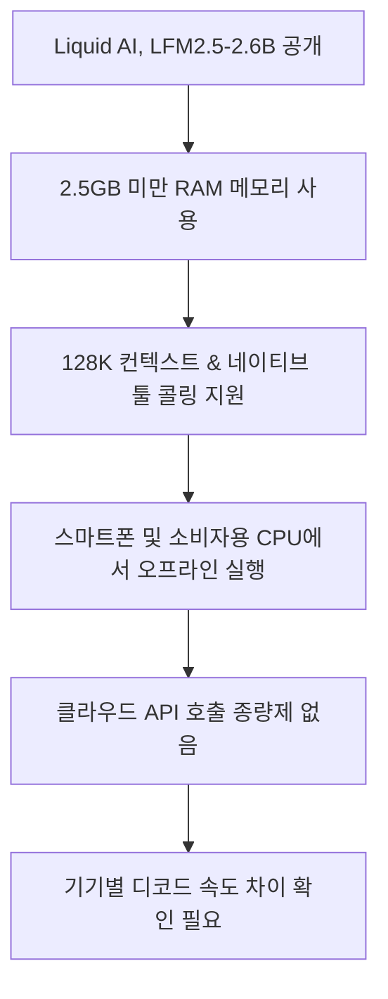
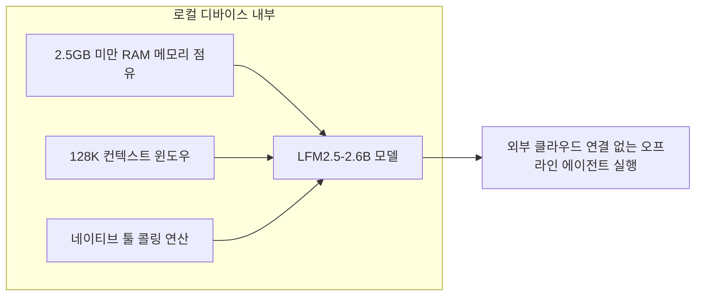
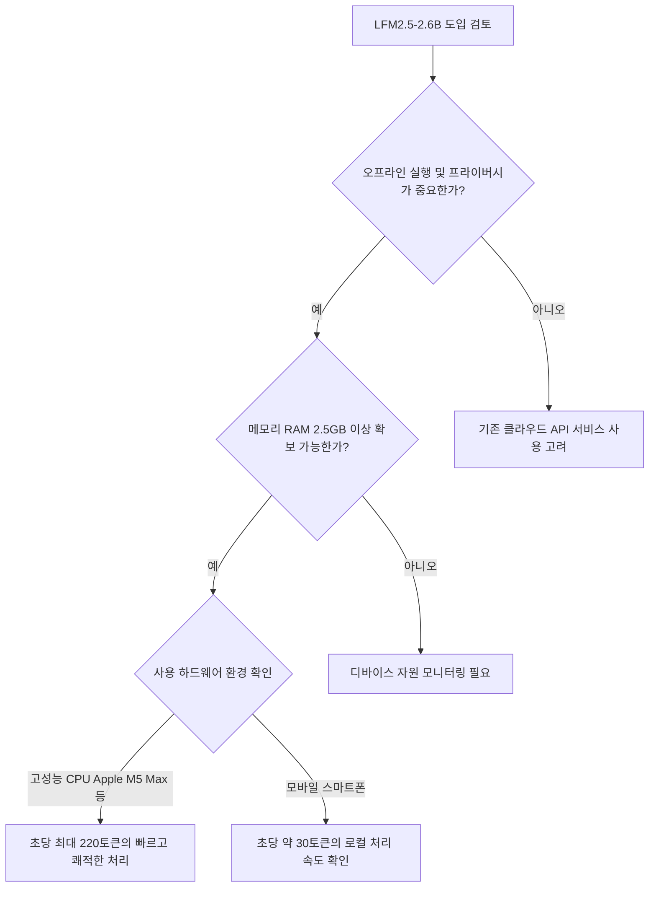

LFM2.5-2.6B는 네트워크가 불안하거나 입력 데이터를 외부 API로 보내기 어려운 환경에서 먼저 검토할 만한 소형 오픈웨이트 모델입니다. 다만 “2.5GB 미만”과 “128K 문맥”은 모든 스마트폰에서 동시에 같은 속도와 메모리로 작동한다는 보장이 아닙니다. 모델 파일, 긴 문맥의 실행 메모리, 도구 권한과 앱 자체 자원을 실제 대상 기기에서 함께 측정해야 도입 가능성을 판단할 수 있습니다.



위 흐름도는 Liquid AI가 공개한 LFM2.5-2.6B 모델의 핵심 특징과 독자가 얻을 수 있는 주요 이점을 요약한 구조입니다.

## 무슨 일이 벌어진 걸까?

Liquid AI가 2026년 8월 4일 클라우드 서버나 고성능 GPU 없이도 디바이스 자체에서 직접 작동하는 26억 매개변수(2.6B) 규모의 오픈웨이트 파운데이션 모델 LFM2.5-2.6B를 정식 출시했습니다 <sup class="source-citation"><a href="#source-1" aria-label="Liquid AI 공식 블로그 출처">[1]</a></sup>. 이번 모델은 비 트랜스포머(non-transformer) 구조로 설계되어 온디바이스 에이전트 연산을 효율적으로 처리하도록 제작되었습니다 <sup class="source-citation"><a href="#source-2" aria-label="Hugging Face 출처">[2]</a></sup>.

LFM2.5-2.6B는 별도의 클라우드 infrastructure 연결이 필요 없는 오프라인 환경을 겨냥합니다 <sup class="source-citation"><a href="#source-1" aria-label="Liquid AI 공식 블로그 출처">[1]</a></sup>. 일반 컴퓨터의 CPU는 물론, 호주머니 속 스마트폰 하드웨어에서도 로컬 AI 에이전트 작업을 곧바로 수행할 수 있습니다 <sup class="source-citation"><a href="#source-2" aria-label="Hugging Face 출처">[2]</a></sup>.

Liquid AI는 사용자가 용도에 맞게 도입할 수 있도록 포스트 트레이닝을 마친 LFM2.5-2.6B 모델과 사전 학습 단계의 LFM2.5-2.6B-Base 체크포인트를 Hugging Face 플랫폼에 동시에 배포했습니다 <sup class="source-citation"><a href="#source-2" aria-label="Hugging Face 출처">[2]</a></sup>.

<figure class="news-source-image">
  
  <figcaption>Liquid AI가 원문과 함께 공개한 이미지입니다. <a href="https://www.liquid.ai/blog/lfm2-5-2-6b" target="_blank" rel="noopener noreferrer">출처: Liquid AI</a></figcaption>
</figure>

## 2.5GB 미만 메모리와 128K 문맥을 동시에 기대해도 될까?

Liquid AI는 LFM2.5-2.6B가 2.5GB 미만의 메모리 사용 조건에서 동작한다고 소개했습니다 <sup class="source-citation"><a href="#source-1" aria-label="Liquid AI 공식 블로그 출처">[1]</a></sup>. 이 수치는 모델 실행의 한 조건으로 읽어야 하며 운영체제, 애플리케이션, 입력 버퍼와 다른 백그라운드 작업까지 포함한 기기 전체 사용량이라고 단정할 수는 없습니다.

기존의 온디바이스 소형 모델들은 메모리 제약으로 인해 긴 문맥을 다루지 못하거나 외부 도구를 불러오는 연산 능력이 부족한 경우가 많았습니다. 그러나 LFM2.5-2.6B는 128,000(128K) 토큰에 달하는 대용량 컨텍스트 윈도우를 지원하며, 네이티브 툴 콜링(native tool calling) 능력을 내장하고 있습니다 <sup class="source-citation"><a href="#source-1" aria-label="Liquid AI 공식 블로그 출처">[1]</a></sup>.

컨텍스트 윈도우는 받아들일 수 있는 최대 입력 길이이고, 최대 길이를 사용할 때의 메모리와 응답 속도는 짧은 대화와 다를 수 있습니다. 모델 가중치가 차지하는 공간 외에도 이전 토큰의 상태를 유지하는 실행 메모리가 필요하기 때문입니다. 2.5GB라는 발표 수치를 제품 요구사항으로 옮기려면 실제 문서 길이별 최대 메모리, 첫 토큰까지의 시간, 배터리와 발열을 같은 기기에서 측정해야 합니다.



위 다이어그램은 LFM2.5-2.6B가 로컬 디바이스 자원 내부에서 작동하여 오프라인 에이전트 출력을 내놓는 내부 실행 순서를 보여줍니다.

이러한 구조는 네트워크 연결이 불안정하거나 끊긴 상황에서 로컬 데이터를 처리하는 선택지를 제공합니다 <sup class="source-citation"><a href="#source-1" aria-label="Liquid AI 공식 블로그 출처">[1]</a></sup>. 다만 툴 콜링은 모델이 구조화된 호출을 제안하는 능력이지, 실행 권한을 안전하게 통제해 주는 기능은 아닙니다. 파일 삭제나 메시지 전송 같은 도구는 애플리케이션이 인자를 검증하고 사용자 승인과 허용 범위를 적용해야 합니다.

<figure class="news-source-image">
  
  <figcaption>Liquid AI가 원문과 함께 공개한 이미지입니다. <a href="https://www.liquid.ai/blog/lfm2-5-2-6b" target="_blank" rel="noopener noreferrer">출처: Liquid AI</a></figcaption>
</figure>

## 로컬 실행이 곧 프라이버시와 무료 운영을 뜻할까?

로컬 실행은 입력을 외부 모델 API에 보내지 않는 구조를 만들 수 있다는 점이 직접적인 이점입니다 <sup class="source-citation"><a href="#source-1" aria-label="Liquid AI 공식 블로그 출처">[1]</a></sup>. 그러나 에이전트가 웹 검색이나 외부 데이터베이스 도구를 호출하거나 앱이 진단 정보를 전송한다면 전체 워크플로가 오프라인인 것은 아닙니다. 데이터 거주성 요건이 있다면 모델 위치뿐 아니라 각 도구의 네트워크 목적지와 로그 저장 위치까지 확인해야 합니다.

연산 디바이스 하드웨어에 따른 디코드 속도 성능도 구체적으로 제시되었습니다 <sup class="source-citation"><a href="#source-1" aria-label="Liquid AI 공식 블로그 출처">[1]</a></sup>. Apple M5 Max CPU 환경에서는 초당 220토큰(220 tokens/s)의 디코드 속도를 발휘하며, 모바일 스마트폰 하드웨어 환경에서는 초당 약 30토큰(roughly 30 tokens/s)의 속도로 작동합니다 <sup class="source-citation"><a href="#source-2" aria-label="Hugging Face 출처">[2]</a></sup>.

```chartjs
{
  "type": "bar",
  "data": {
    "labels": ["Apple M5 Max CPU", "스마트폰 하드웨어"],
    "datasets": [
      {
        "label": "디코드 속도 (tokens/s)",
        "data": [220, 30]
      }
    ]
  },
  "options": {
    "plugins": {
      "title": {
        "display": true,
        "text": "LFM2.5-2.6B 하드웨어 환경별 디코드 속도 비교"
      }
    }
  }
}
```

위 차트는 Liquid AI가 제시한 Apple M5 Max CPU와 스마트폰 하드웨어의 디코드 속도 수치를 비교합니다. 서로 다른 기기 범주에서 측정된 값이므로 다른 스마트폰이나 입력 길이에 그대로 적용할 수는 없습니다.

로컬 실행은 클라우드 서비스의 토큰 종량제 비용을 피할 수 있습니다 <sup class="source-citation"><a href="#source-1" aria-label="Liquid AI 공식 블로그 출처">[1]</a></sup>. 그렇다고 운영 비용이 0이 되는 것은 아닙니다. 기기 구입, 전력과 배터리 소모, 모델 업데이트, 앱 최적화와 장애 지원을 포함해 API 방식의 월 청구액과 비교해야 합니다.

<figure class="news-source-image">
  
  <figcaption>Hugging Face가 원문과 함께 공개한 이미지입니다. <a href="https://huggingface.co/LiquidAI/LFM2.5-2.6B" target="_blank" rel="noopener noreferrer">출처: Hugging Face</a></figcaption>
</figure>

## 실제 기기에서 어떤 순서로 시험해야 할까?

LFM2.5-2.6B는 오픈웨이트(open-weight) 형태로 공개되었으므로 관심 있는 개발자라면 누구든 Hugging Face에서 모델 파일과 베이스 체크포인트를 내려받아 적용해볼 수 있습니다 <sup class="source-citation"><a href="#source-2" aria-label="Hugging Face 출처">[2]</a></sup>.



위 가이드 다이어그램은 사용자가 자신의 하드웨어 및 데이터 환경에 맞춰 LFM2.5-2.6B 도입 여부를 결정할 수 있도록 돕는 판단 흐름입니다.

직접 배포할 때는 짧은 입력과 목표 최대 입력에서 각각 RAM, 응답 지연, 발열과 배터리 변화를 기록합니다. 그다음 정답이 알려진 도구 호출 예제로 함수 이름과 인자 형식이 맞는지, 잘못된 호출이 실행 전에 차단되는지 확인합니다. 마지막으로 네트워크를 끈 상태에서도 필요한 기능이 실제로 유지되는지 시험해야 “오프라인” 요구를 충족했는지 알 수 있습니다 <sup class="source-citation"><a href="#source-1" aria-label="Liquid AI 공식 블로그 출처">[1]</a></sup>.

같은 모델이라도 런타임과 양자화 형식이 다르면 속도와 출력 품질이 달라질 수 있습니다. 따라서 발표 수치와 단말 결과가 다를 때 곧바로 모델 문제로 결론 내리지 말고 사용한 파일, 엔진, 스레드 수와 입력 길이를 함께 남겨야 재현 가능한 비교가 됩니다.

## 아직은 선을 그어야 할 부분

스마트폰 환경에서의 동작 성능은 초당 약 30토큰 수준으로, 고성능 PC CPU 환경(초당 220토큰)에 비하면 디코딩 속도가 다소 제한적입니다 <sup class="source-citation"><a href="#source-2" aria-label="Hugging Face 출처">[2]</a></sup>. 실시간에 가까운 고속 반응이 연속적으로 필요한 모바일 앱 서비스라면 이 속도가 충분한지 미리 테스트가 필요합니다.

또한 2.5GB 미만의 RAM을 점유한다고 발표되었으나, 모바일 OS나 다른 백그라운드 앱이 함께 실행되는 환경에서 배터리 소모량 및 발열에 관한 수치는 기기별로 상이할 수 있으므로 구체적인 디바이스 최적화 결과는 실제 적용 과정을 지켜보아야 합니다 <sup class="source-citation"><a href="#source-1" aria-label="Liquid AI 공식 블로그 출처">[1]</a></sup>.

<!-- primary-sources:start -->
## 원문과 버전 확인

- [발표 원문](https://www.liquid.ai/blog/lfm2-5-2-6b)
- [Hugging Face](https://huggingface.co/LiquidAI/LFM2.5-2.6B)
- [VentureBeat](https://venturebeat.com/ai/no-cloud-no-gpus-no-problem-liquid-ais-new-model-lfm2-5-2-6b-brings-powerful-ai-agents-to-devices-as-small-as-a-raspberry-pi)
<!-- primary-sources:end -->

<!-- internal-links:start -->
## 함께 읽으면 이해가 이어지는 글

- [Nvidia Nemotron 3.5 Lightning과 NeMo Switchyard: 에이전트 모델 라우팅 판단법]() — Nvidia가 자율 에이전트 시스템을 위해 개발된 30B 규모의 오픈 모델 Nemotron 3.5 Lightning과 오픈소스 라우터 라이브러리 NeMo Switchyard를 2026년 8월 11일 공개했습니다. NeMo…
- [Meta Muse Glimmer 30B 로컬 에이전트: 4비트 메모리 조건과 도입 판단]() — Meta가 2026년 8월 10일 소비자용 GPU 환경에 최적화된 300억 파라미터 오픈소스 모델 Muse Glimmer를 Apache 2.0 라이선스로 출시했습니다. 4비트 양자화를 적용해 메모리 점유율을 20GB RAM 이하로…
- [jcode의 14ms 부팅은 무엇을 바꿀까: Rust Harness, Semantic Memory, Swarm 검증 기준]() — jcode가 제시하는 14ms 부팅, 27.8MB idle RAM, vector semantic memory와 daemon 기반 swarm 구조를 살펴보고, 수치 재현, 검색 오류, 동시 편집, API 비용의 도입 조건을 정리합니다.
<!-- internal-links:end -->

## 자주 묻는 질문

### Liquid AI의 LFM2.5-2.6B는 인터넷 연결 없이 오프라인으로 실행할 수 있나요?

네, 모델 자체는 클라우드 GPU 없이 스마트폰이나 PC CPU에서 로컬로 실행하도록 공개됐습니다. 다만 2.5GB 미만이라는 메모리 수치는 발표 조건에서의 모델 사용량이며, 긴 문맥과 앱, 운영체제까지 포함한 전체 기기 메모리는 별도로 확인해야 합니다.

### LFM2.5-2.6B 모델이 지원하는 주요 기술 스펙은 무엇인가요?

26억 매개변수를 가진 비 트랜스포머 파운데이션 모델로, 128,000(128K) 토큰 컨텍스트 윈도우와 네이티브 툴 콜링 기능을 갖추고 있습니다.

### 스마트폰과 PC CPU에서 디코드 속도는 어느 정도 나오나요?

Apple M5 Max CPU 환경에서는 초당 220토큰, 일반 스마트폰 하드웨어 환경에서는 초당 약 30토큰의 디코드 속도를 나타냅니다.

### LFM2.5-2.6B 모델 파일은 어디서 다운로드할 수 있나요?

Hugging Face에서 오픈웨이트 포스트 트레이닝 모델과 LFM2.5-2.6B-Base 체크포인트를 확인할 수 있습니다. 실제 제품 사용 전에는 모델 카드의 파일 형식과 라이선스 조건을 함께 검토해야 합니다.

## 직접 확인한 원문

<ol class="checked-source-list">
  <li id="source-1"><a href="https://www.liquid.ai/blog/lfm2-5-2-6b" target="_blank" rel="noopener noreferrer">Liquid AI — LFM2.5-2.6B: Deploy Agents Everywhere</a> (2026-08-04)</li>
  <li id="source-2"><a href="https://huggingface.co/LiquidAI/LFM2.5-2.6B" target="_blank" rel="noopener noreferrer">Hugging Face — LiquidAI/LFM2.5-2.6B</a> (2026-08-04)</li>
  <li id="source-3"><a href="https://venturebeat.com/ai/no-cloud-no-gpus-no-problem-liquid-ais-new-model-lfm2-5-2-6b-brings-powerful-ai-agents-to-devices-as-small-as-a-raspberry-pi" target="_blank" rel="noopener noreferrer">VentureBeat — No cloud, no GPUs, no problem: Liquid AI&#x27;s new model LFM2.5-2.6B brings powerful AI agents to devices as small as a Raspberry Pi</a> (2026-08-06)</li>
</ol>

> 이 글은 위 원문을 직접 확인해 작성했습니다. 가격, 기능 범위, 지역별 제공 여부는 게시 후 바뀔 수 있으니 실제 도입 전 공식 문서를 다시 확인하세요.
