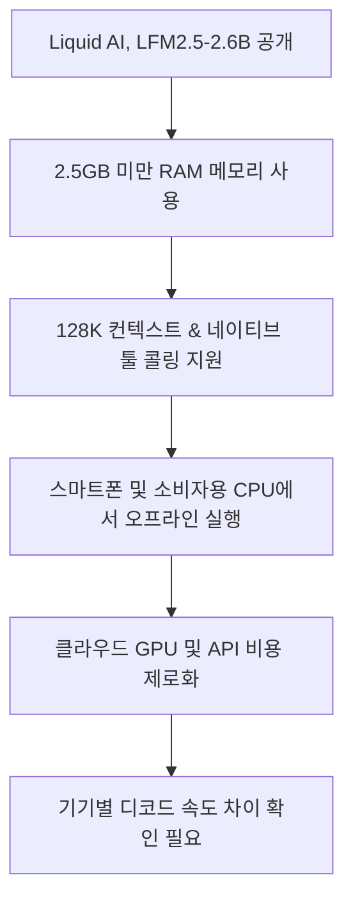
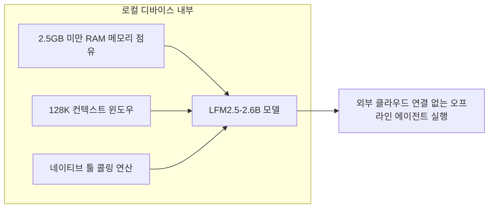
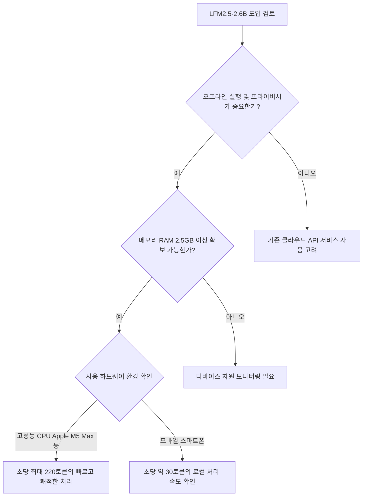

위 흐름도는 Liquid AI가 공개한 LFM2.5-2.6B 모델의 핵심 특징과 독자가 얻을 수 있는 주요 이점을 요약한 구조입니다.

## 무슨 일이 벌어진 걸까?

Liquid AI가 2026년 8월 4일 클라우드 서버나 고성능 GPU 없이도 디바이스 자체에서 직접 작동하는 26억 매개변수(2.6B) 규모의 오픈웨이트 파운데이션 모델 LFM2.5-2.6B를 정식 출시했습니다 <sup class="source-citation"><a href="#source-1" aria-label="Liquid AI 공식 블로그 출처">[1]</a></sup>. 이번 모델은 비 트랜스포머(non-transformer) 구조로 설계되어 온디바이스 에이전트 연산을 효율적으로 처리하도록 제작되었습니다 <sup class="source-citation"><a href="#source-2" aria-label="Hugging Face 출처">[2]</a></sup>.

LFM2.5-2.6B는 별도의 클라우드 infrastructure 연결이 필요 없는 오프라인 환경을 겨냥합니다 <sup class="source-citation"><a href="#source-1" aria-label="Liquid AI 공식 블로그 출처">[1]</a></sup>. 일반 컴퓨터의 CPU는 물론, 호주머니 속 스마트폰 하드웨어에서도 로컬 AI 에이전트 작업을 곧바로 수행할 수 있습니다 <sup class="source-citation"><a href="#source-2" aria-label="Hugging Face 출처">[2]</a></sup>.

Liquid AI는 사용자가 용도에 맞게 도입할 수 있도록 포스트 트레이닝을 마친 LFM2.5-2.6B 모델과 사전 학습 단계의 LFM2.5-2.6B-Base 체크포인트를 Hugging Face 플랫폼에 동시에 배포했습니다 <sup class="source-citation"><a href="#source-2" aria-label="Hugging Face 출처">[2]</a></sup>.

<figure class="news-source-image">
  
  <figcaption>Liquid AI가 원문과 함께 공개한 이미지입니다. <a href="https://www.liquid.ai/blog/lfm2-5-2-6b" target="_blank" rel="noopener noreferrer">출처: Liquid AI</a></figcaption>
</figure>

## 왜 지금 다들 이 이야기를 할까?

Liquid AI의 LFM2.5-2.6B가 눈길을 모으는 이유는 디바이스 시스템 메모리를 2.5GB 미만으로 점유하면서도 대형 AI 모델급 기능을 모두 갖췄기 때문입니다 <sup class="source-citation"><a href="#source-1" aria-label="Liquid AI 공식 블로그 출처">[1]</a></sup>.

기존의 온디바이스 소형 모델들은 메모리 제약으로 인해 긴 문맥을 다루지 못하거나 외부 도구를 불러오는 연산 능력이 부족한 경우가 많았습니다. 그러나 LFM2.5-2.6B는 128,000(128K) 토큰에 달하는 대용량 컨텍스트 윈도우를 지원하며, 네이티브 툴 콜링(native tool calling) 능력을 내장하고 있습니다 <sup class="source-citation"><a href="#source-1" aria-label="Liquid AI 공식 블로그 출처">[1]</a></sup>.



위 다이어그램은 LFM2.5-2.6B가 로컬 디바이스 자원 내부에서 작동하여 오프라인 에이전트 출력을 내놓는 내부 실행 순서를 보여줍니다.

이러한 구조 덕분에 네트워크 연결이 불안정하거나 끊긴 상황에서도 로컬 시스템 내부의 데이터를 바탕으로 스스로 판단하고 도구를 호출하는 AI 에이전트를 안정적으로 구동할 수 있습니다 <sup class="source-citation"><a href="#source-1" aria-label="Liquid AI 공식 블로그 출처">[1]</a></sup>.

<figure class="news-source-image">
  
  <figcaption>Liquid AI가 원문과 함께 공개한 이미지입니다. <a href="https://www.liquid.ai/blog/lfm2-5-2-6b" target="_blank" rel="noopener noreferrer">출처: Liquid AI</a></figcaption>
</figure>

## 그래서 우리에게 뭐가 달라질까?

개발자와 사용자 입장에서 가장 직접적인 변화는 데이터 프라이버시 확보와 한계 비용 제로(Zero Marginal Cost)입니다 <sup class="source-citation"><a href="#source-1" aria-label="Liquid AI 공식 블로그 출처">[1]</a></sup>. 데이터 거주성 요건이나 엄격한 보안 규정 때문에 외부 클라우드 API를 쓰지 못했던 기업 및 개인 사용자도 오프라인 환경에서 로컬 에이전트 워크플로우를 완성할 수 있습니다 <sup class="source-citation"><a href="#source-1" aria-label="Liquid AI 공식 블로그 출처">[1]</a></sup>.

연산 디바이스 하드웨어에 따른 디코드 속도 성능도 구체적으로 제시되었습니다 <sup class="source-citation"><a href="#source-1" aria-label="Liquid AI 공식 블로그 출처">[1]</a></sup>. Apple M5 Max CPU 환경에서는 초당 220토큰(220 tokens/s)의 디코드 속도를 발휘하며, 모바일 스마트폰 하드웨어 환경에서는 초당 약 30토큰(roughly 30 tokens/s)의 속도로 작동합니다 <sup class="source-citation"><a href="#source-2" aria-label="Hugging Face 출처">[2]</a></sup>.

```chartjs
{
  "type": "bar",
  "data": {
    "labels": ["Apple M5 Max CPU", "스마트폰 하드웨어"],
    "datasets": [
      {
        "label": "디코드 속도 (tokens/s)",
        "data": [220, 30]
      }
    ]
  },
  "options": {
    "plugins": {
      "title": {
        "display": true,
        "text": "LFM2.5-2.6B 하드웨어 환경별 디코드 속도 비교"
      }
    }
  }
}
```

위 차트는 Liquid AI가 제시한 검증 데이터에 따라 Apple M5 Max CPU와 스마트폰 하드웨어 간의 디코드 속도 차이를 나타낸 결과입니다.

매번 클라우드 서비스에 토큰 단위 비용을 지급할 필요가 없기 때문에 지속적인 연산을 수행하는 온디바이스 자동화 프로그램을 구축할 때 비용 부담을 없앨 수 있습니다 <sup class="source-citation"><a href="#source-1" aria-label="Liquid AI 공식 블로그 출처">[1]</a></sup>.

<figure class="news-source-image">
  
  <figcaption>Hugging Face가 원문과 함께 공개한 이미지입니다. <a href="https://huggingface.co/LiquidAI/LFM2.5-2.6B" target="_blank" rel="noopener noreferrer">출처: Hugging Face</a></figcaption>
</figure>

## 직접 써보거나 지켜볼 포인트

LFM2.5-2.6B는 오픈웨이트(open-weight) 형태로 공개되었으므로 관심 있는 개발자라면 누구든 Hugging Face에서 모델 파일과 베이스 체크포인트를 내려받아 적용해볼 수 있습니다 <sup class="source-citation"><a href="#source-2" aria-label="Hugging Face 출처">[2]</a></sup>.



위 가이드 다이어그램은 사용자가 자신의 하드웨어 및 데이터 환경에 맞춰 LFM2.5-2.6B 도입 여부를 결정할 수 있도록 돕는 판단 흐름입니다.

직접 배포 시에는 로컬 디바이스의 RAM 사용량이 2.5GB 미만으로 유지되는지 확인하고, 본인이 구현하고자 하는 도구 호출(tool calling) 로직이 네이티브 환경에서 제대로 작동하는지 점검해야 합니다 <sup class="source-citation"><a href="#source-1" aria-label="Liquid AI 공식 블로그 출처">[1]</a></sup>.

## 아직은 선을 그어야 할 부분

스마트폰 환경에서의 동작 성능은 초당 약 30토큰 수준으로, 고성능 PC CPU 환경(초당 220토큰)에 비하면 디코딩 속도가 다소 제한적입니다 <sup class="source-citation"><a href="#source-2" aria-label="Hugging Face 출처">[2]</a></sup>. 실시간에 가까운 고속 반응이 연속적으로 필요한 모바일 앱 서비스라면 이 속도가 충분한지 미리 테스트가 필요합니다.

또한 2.5GB 미만의 RAM을 점유한다고 발표되었으나, 모바일 OS나 다른 백그라운드 앱이 함께 실행되는 환경에서 배터리 소모량 및 발열에 관한 수치는 기기별로 상이할 수 있으므로 구체적인 디바이스 최적화 결과는 실제 적용 과정을 지켜보아야 합니다 <sup class="source-citation"><a href="#source-1" aria-label="Liquid AI 공식 블로그 출처">[1]</a></sup>.

## 자주 묻는 질문

### Liquid AI의 LFM2.5-2.6B는 인터넷 연결 없이 오프라인으로 실행할 수 있나요?

네, LFM2.5-2.6B는 클라우드 GPU 인프라 없이 스마트폰이나 PC CPU에서 직접 동작하는 로컬 오프라인 에이전트 모델입니다. 작동을 위해 필요한 메모리는 2.5GB RAM 미만입니다.

### LFM2.5-2.6B 모델이 지원하는 주요 기술 스펙은 무엇인가요?

26억 매개변수를 가진 비 트랜스포머 파운데이션 모델로, 128,000(128K) 토큰 컨텍스트 윈도우와 네이티브 툴 콜링 기능을 갖추고 있습니다.

### 스마트폰과 PC CPU에서 디코드 속도는 어느 정도 나오나요?

Apple M5 Max CPU 환경에서는 초당 220토큰, 일반 스마트폰 하드웨어 환경에서는 초당 약 30토큰의 디코드 속도를 나타냅니다.

### LFM2.5-2.6B 모델 파일은 어디서 다운로드할 수 있나요?

Hugging Face 플랫폼에서 오픈웨이트 포스트 트레이닝 모델과 LFM2.5-2.6B-Base 체크포인트를 직접 누구나 무료로 다운로드할 수 있습니다.

## 직접 확인한 원문

<ol class="checked-source-list">
  <li id="source-1"><a href="https://www.liquid.ai/blog/lfm2-5-2-6b" target="_blank" rel="noopener noreferrer">Liquid AI — LFM2.5-2.6B: Deploy Agents Everywhere</a> (2026-08-04)</li>
  <li id="source-2"><a href="https://huggingface.co/LiquidAI/LFM2.5-2.6B" target="_blank" rel="noopener noreferrer">Hugging Face — LiquidAI/LFM2.5-2.6B</a> (2026-08-04)</li>
  <li id="source-3"><a href="https://venturebeat.com/ai/no-cloud-no-gpus-no-problem-liquid-ais-new-model-lfm2-5-2-6b-brings-powerful-ai-agents-to-devices-as-small-as-a-raspberry-pi" target="_blank" rel="noopener noreferrer">VentureBeat — No cloud, no GPUs, no problem: Liquid AI&#x27;s new model LFM2.5-2.6B brings powerful AI agents to devices as small as a Raspberry Pi</a> (2026-08-06)</li>
</ol>

> 이 글은 위 원문을 직접 확인해 작성했습니다. 가격, 기능 범위, 지역별 제공 여부는 게시 후 바뀔 수 있으니 실제 도입 전 공식 문서를 다시 확인하세요.
