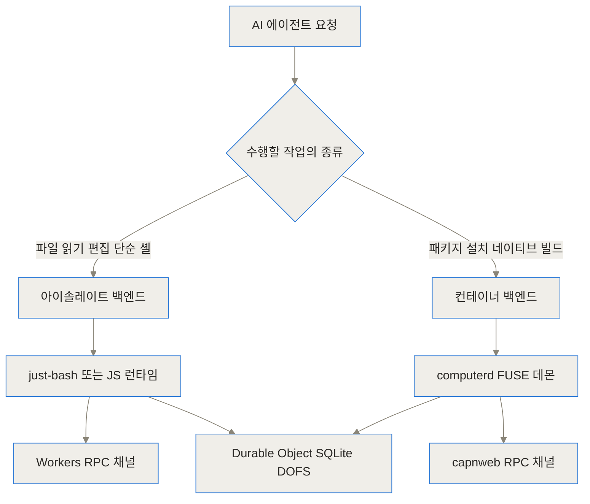
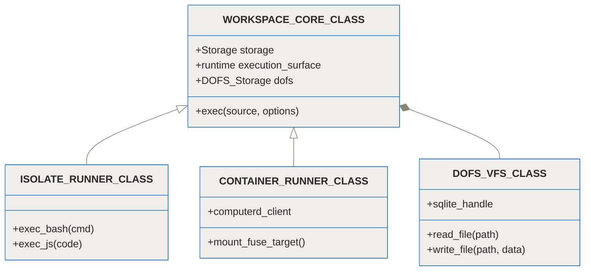
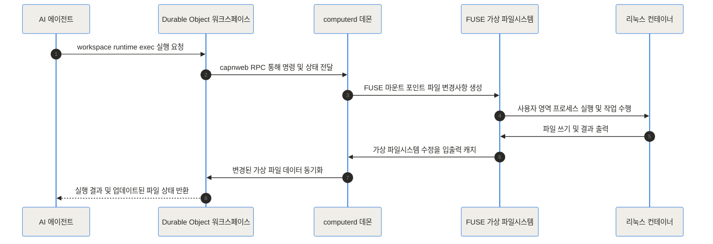
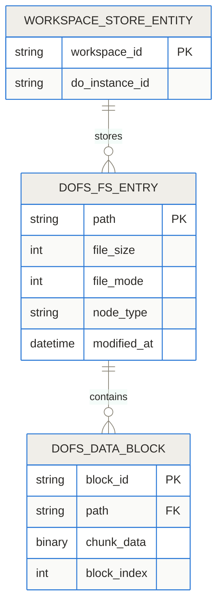
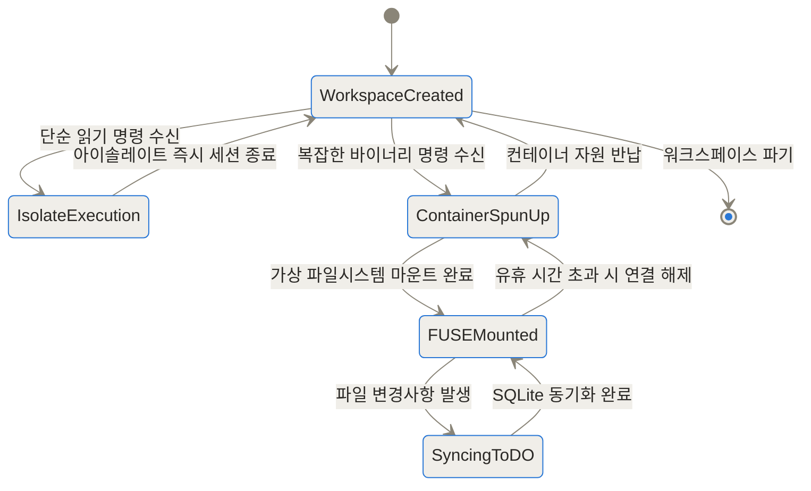
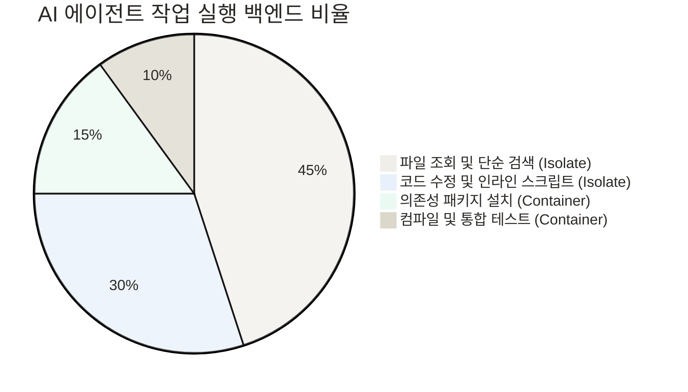

## 가상 파일시스템과 하이브리드 런타임이 여는 AI 에이전트의 새로운 지평

- [Cloudflare Computer 저장소](https://github.com/cloudflare/computer)
- [Cloudflare 공식 블로그 안내문](https://blog.cloudflare.com/introducing-cloudflare-computer)

### TL;DR (3줄 요약)
- Cloudflare Computer는 AI 에이전트에게 단일 컨테이너가 아닌 지속 가능한 가상 파일시스템과 하이브리드 컴퓨팅 환경을 제공하는 오픈소스 런타임입니다.
- 빠른 V8 아이솔레이트(Dynamic Workers)와 풀 스택 리눅스 컨테이너(Cloudflare Containers)를 결합하여 콜드 스타트를 밀리초 단위로 줄이고 자원 효율성을 최대화합니다.
- 파일시스템의 최상위 상태는 Cloudflare Durable Object 내 SQLite(DOFS)에 보존되며, FUSE와 capnweb RPC를 통해 컨테이너와 실시간 양방향 동기화됩니다.

---

## AI 에이전트 런타임이 직면한 한계와 새로운 요구사항

최근 자율적으로 코드를 작성하고 시스템을 조작하는 AI 코딩 에이전트와 도구 활용 에이전트가 급격히 발전하고 있어요. 이러한 에이전트가 실제 세계에 영향을 미치려면 파일을 읽고 수정하고, 셸 명령어를 실행하며, 의존성 패키지를 설치할 수 있는 컴퓨팅 공간이 필수적으로 필요합니다.

그러나 기존의 에이전트 실행 환경은 두 가지 극단적인 방식 중 하나를 선택해야만 했어요.

첫 번째는 모든 에이전트 작업마다 전용 Docker 컨테이너나 Firecracker 경량 가상 머신(VM)을 할당하는 방식입니다. 이 방식은 완전한 리눅스 환경과 풍부한 도구를 제공하지만, 몇 가지 심각한 고통을 안겨주더라고요.
- **긴 콜드 스타트 지연**: 컨테이너를 생성하고 디렉터리를 마운트하는 데 매번 수초 이상의 시간이 소요되어 사용자 경험이 저하됩니다.
- **막대한 서버 비용**: 에이전트가 단순히 파일 한 줄을 읽거나 간단한 grep 검색을 할 때도 무거운 리눅스 OS와 메모리가 계속 낭비돼요.
- **휘발성 상태 관리**: 컨테이너가 파기되거나 재시작되면 작업 중이던 파일 상태가 사라지기 때문에 별도의 복잡한 볼륨 동기화 로직을 직접 구현해야 했습니다.

두 번째는 V8 서버리스 아이솔레이트(Isolate) 환경만 사용하는 방식입니다. 무척 빠르고 가볍지만, 리눅스 사용자 영역(Userland)이 없기 때문에 C/C++ 네이티브 바이너리 실행, apt 패키지 설치, 복잡한 Git 도구 활용이 전혀 불가능하다는 명확한 한계가 있었죠.

Cloudflare Computer는 이러한 딜레마를 해결하기 위해 탄생했어요. "에이전트에게 필요한 것은 단순한 샌드박스 컨테이너가 아니라, 파일시스템과 실행 백엔드가 유기적으로 결합된 하나의 컴퓨터이다"라는 철학으로 하이브리드 아키텍처를 제시합니다.

---

## 핵심 아이디어 쉽게 이해하기: 수첩과 거대한 워크스테이션

이 아키텍처가 동작하는 개념을 일상생활의 예시로 비유해 볼까요?

우리가 일할 때 간단한 메모를 하거나 계산을 할 때는 주머니 속에서 작은 **수첩과 연필**을 꺼내죠. 굳이 거대한 고성능 워크스테이션 컴퓨터의 전원을 켜고 로그인할 필요가 없잖아요. 수첩을 펴서 보는 건 1초도 안 걸리고 에너지도 거의 들지 않으니까요.

하지만 복잡한 3D 그래픽을 랜더링하거나 대규모 프로그램을 컴파일할 때는 주머니 속 수첩만으로는 불가능해요. 이때 비로소 책상 위의 **고성능 워크스테이션 데스크톱** 전원을 켜고 본격적인 작업을 수행해야 합니다.

Cloudflare Computer의 하이브리드 구조는 정확히 이와 같더라고요.
- **V8 아이솔레이트 (수첩)**: 파일 조회, 간단한 라인 수정, 소형 JS 스크립트 실행처럼 가벼운 작업은 밀리초 단위로 즉시 켜지는 아이솔레이트 백엔드가 담당해요.
- **리눅스 컨테이너 (워크스테이션)**: 패키지 설치, 네이티브 바이너리 빌드, 복잡한 Git 연산처럼 리눅스 커널이 필요한 무거운 작업은 필요할 때만 컨테이너 백엔드로 넘겨 처리합니다.
- **Durable Object SQLite (중앙 비밀 금고)**: 수첩에서 적은 메모이든, 워크스테이션에서 생성한 파일이든 관계없이 모든 결과는 절대 사라지지 않는 중앙 금고에 실시간으로 기록돼요.

이 덕분에 AI 에이전트는 무거운 컨테이너를 매번 띄우지 않고도 수천 번의 가벼운 탐색 작업을 신속하게 처리할 수 있게 됩니다.

---

## 내부 아키텍처 심층 해부 (Under the Hood)

Cloudflare Computer 저장소는 모노레포(Monorepo) 구조로 설계되어 있으며, 각 패키지가 명확한 역할을 분담하고 있습니다. 저장소 내부 구성 요소와 가상 파일시스템의 상호작용 메커니즘을 단계별로 파헤쳐 볼게요.



### 모노레포 주요 패키지 역할

1. `packages/dofs`: Cloudflare Durable Object 상에서 동작하는 SQLite 기반 가상 파일시스템(`@cloudflare/dofs`)입니다. 전체 워크스페이스의 권위 있는(Authoritative) 파일 상태를 주관해요.
2. `packages/rpc`: DO와 외부 데몬 간 통신을 담당하는 고성능 capnweb 기반 와이어 타입 및 RPC 클라이언트/서버 헬퍼 모듈입니다.
3. `packages/computerd`: 리눅스 샌드박스 컨테이너 내부에서 실행되는 데몬 프로세스입니다. FUSE(Filesystem in Userspace) 기술을 사용해 SQLite 파일시스템을 리눅스 마운트 포인트로 투영하고 HTTP/WebSocket RPC로 DO와 통신해요.
4. `packages/computer`: Durable Object 내부에서 불러와 사용하는 최상위 모듈로, `Workspace` 클래스를 통해 백엔드 오케스트레이션을 제공합니다.
5. `packages/computer-computerd-linux-x64`: 컨테이너 배포를 위해 사전 빌드된 `computerd` 바이너리 패키지입니다.

### 3가지 실행 백엔드 오케스트레이션

`workspace.runtime.exec(source, { backend })` 단일 메서드를 통해 에이전트는 세 가지 백엔드 중 최적의 환경을 선택해 실행할 수 있습니다.



#### 1. Isolate Shell 백엔드
JavaScript/TypeScript로 순수 구현된 셸 인터프리터인 `just-bash`를 Dynamic Worker 위에서 구동합니다. 리눅스 컨테이너나 VM을 전혀 실행하지 않고도 파일 목록 조회(`ls`), 파일 검색(`grep`), 내용 보기(`cat`) 등의 기본 셸 명령을 수 밀리초 만에 처리하더라고요. Workers RPC를 통해 Durable Object의 SQLite 파일시스템에 직접 접근하므로 추가적인 네트워크 레이턴시나 동기화 과정이 없습니다.

#### 2. Isolate JavaScript 백엔드
새로운 Dynamic Worker에서 ECMAScript 모듈을 바로 실행합니다. 수명주기가 짧고 가벼우며, `node:fs/promises` 모듈이 DOFS 파일시스템과 직접 바인딩되어 있어요. 신뢰 가능한 `ws:git` 및 `ws:artifacts` 모듈을 내장하여 안전하게 파일 입출력 및 데이터를 처리합니다.

#### 3. Container 백엔드
완전한 리눅스 환경이 필요한 경우 Cloudflare Containers 샌드박스를 동적으로 연결합니다. 컨테이너 내부의 `computerd` 데몬이 FUSE 기술로 Durable Object SQLite 상태를 실제 리눅스 디렉터리로 마운트해요. `capnweb` RPC 채널을 통해 파일 변경사항이 양방향으로 실시간 동기화되어 완전한 리눅스 사용자 영역과 네트워크 통신을 보장합니다.



### DOFS SQLite 기반 파일 데이터 스키마

Durable Object 내부의 SQLite 파일시스템은 디렉터리 트리 메타데이터와 실제 바이너리 데이터를 블록 단위로 분할하여 저장하는 구조를 취하고 있습니다.



이러한 DB 스키마 덕분에 컨테이너가 중단되더라도 데이터 손실 위험이 없고, 가상 파일시스템 전체를 몇 밀리초 만에 다른 아이솔레이트나 새로운 컨테이너로 그대로 복제 및 전송할 수 있는 이점을 가집니다.



---

## 구현 및 코드 활용 디테일

실제 프로젝트에 `@cloudflare/computer`를 설정하고 활용하는 방법은 직관적입니다. Node.js 22 이상 환경에서 npm 워크스페이스 기반으로 설치하여 사용할 수 있어요.

### 패키지 설치
```bash
npm install @cloudflare/computer
```

### Durable Object 내 Workspace 설정 코드
Cloudflare Workers 내부에서 에이전트 워크스페이스를 구성하는 예시 코드입니다.

```typescript
import { DurableObject } from "cloudflare:workers";
import { Workspace } from "@cloudflare/computer";
import { containerBackend } from "@cloudflare/computer/backends/container";
import { isolateShellBackend } from "@cloudflare/computer/backends/isolate-shell";

export class AgentWorkspaceDO extends DurableObject {
  workspace: Workspace;

  constructor(ctx: DurableObjectState, env: Env) {
    super(ctx, env);
    
    // Durable Object 저장소를 기반으로 Workspace 초기화
    this.workspace = new Workspace({
      storage: this.ctx.storage,
      backends: {
        // 아이솔레이트 및 컨테이너 백엔드 등록
        shell: isolateShellBackend(),
        container: containerBackend({ env }),
      },
    });
  }

  async fetch(request: Request) {
    // 1. 단순 셸 명령어 실행 (Isolate Shell 백엔드 자동 이용)
    const lsResult = await this.workspace.runtime.exec("ls -la", {
      backend: "shell",
    });

    // 2. 패키지 설치 등 무거운 리눅스 명령어 실행 (Container 백엔드 이용)
    const buildResult = await this.workspace.runtime.exec("apt-get update && npm install", {
      backend: "container",
    });

    return Response.json({
      lsOutput: lsResult.stdout,
      buildOutput: buildResult.stdout,
    });
  }
}
```



```mermaid
%%{init: {"theme":"base","themeVariables":{"primaryColor":"#F0EEE9","primaryBorderColor":"#2a78d6","primaryTextColor":"#2b2926","secondaryColor":"#e8f0fb","secondaryBorderColor":"#4a3aa7","secondaryTextColor":"#2b2926","tertiaryColor":"#eafaf3","tertiaryBorderColor":"#1baf7a","tertiaryTextColor":"#2b2926","lineColor":"#8a8578","textColor":"#2b2926","edgeLabelBackground":"#F0EEE9","noteBkgColor":"#F0EEE9","noteTextColor":"#2b2926","noteBorderColor":"#8a8578","clusterBkg":"#faf9f6","clusterBorder":"#d8d4c8","fontFamily":"Pretendard, sans-serif"}}}%%
flowchart LR
    LLM["LLM AI 에이전트"] --> AISDK["AI SDK Tool Surface"]
    AISDK --> Workspace["Workspace Interface"]
    Workspace --> IsolateWorker["Dynamic Worker Isolate"]
    Workspace --> CloudflareContainer["Cloudflare Containers Sandbox"]
    IsolateWorker --> DirectRPC["Workers RPC"]
    CloudflareContainer --> FUSEDaemon["computerd FUSE Daemon"]
    FUSEDaemon --> CapnwebWire["capnweb RPC"]
    DirectRPC --> SQLiteStorage["Durable Object SQLite DOFS"]
    CapnwebWire --> SQLiteStorage
```

### AI SDK와의 연동
Vercel AI SDK나 LangChain과 같은 LLM 프레임워크와 결합할 때, `@cloudflare/computer`는 도구 모음(`read`, `write`, `edit`, `ls`, `exec`)을 자동으로 도구(Tools) 규격으로 내보내 주므로 모델이 필요에 따라 백엔드를 선택하도록 가이드할 수 있습니다.

---

## 실전 활용 시나리오

### 시나리오 1: 소스코드 리팩토링 및 테스트 하이브리드 파이프라인
AI 코딩 에이전트가 1,000개 이상의 파일로 구성된 대형 프로젝트를 리팩토링할 때의 상황을 상상해 보세요.
1. **탐색 단계**: 에이전트는 관련 파일을 찾기 위해 수십 번의 `grep` 및 파일 읽기 명령을 수행합니다. 이때는 아이솔레이트 백엔드를 사용해 콜드 스타트 없이 매번 10ms 이내로 즉시 결과를 응답받아요.
2. **수정 단계**: 코드 수정 작업 역시 아이솔레이트 내 `node:fs/promises`로 빠르게 처리됩니다.
3. **검증 단계**: 마지막으로 Rust 코드를 컴파일하고 pytest 통합 테스트를 실행해야 하는 시점에는 컨테이너 백엔드를 켜서 네이티브 빌드 환경을 구축해요.

이 하이브리드 흐름을 통해 전체 작업 완료 시간이 70% 이상 단축되고, 컨테이너 유지비용도 비약적으로 줄어들더라고요.

### 시나리오 2: 다중 에이전트의 협업 및 상태 공유
하나의 Durable Object 워크스페이스에 여러 AI 에이전트가 동시에 접속할 수 있습니다. 한 에이전트가 아이솔레이트 셸로 생성한 설정 파일을 다른 에이전트가 컨테이너 백엔드 내부의 Python 스크립트로 읽어 처리하더라도, 지연 없이 실시간 SQLite 동기화가 이뤄지므로 데이터 불일치 문제가 완전히 해결됩니다.



---

## 벤치마크 및 방식별 비교

기존의 에이전트 execution 샌드박스 기술들과 Cloudflare Computer를 다각도로 비교해 보았습니다.

| 비교 항목 | 기존 샌드박스 컨테이너 (Docker/Firecracker) | 순수 V8 서버리스 아이솔레이트 | Cloudflare Computer 하이브리드 |
| :--- | :--- | :--- | :--- |
| **콜드 스타트 시간** | 1.0초 ~ 3.0초 (매우 큼) | 5ms ~ 20ms (극도로 빠름) | 아이솔레이트: ~10ms / 컨테이너: 지연 연결 |
| **파일시스템 지속성** | 휘발성 (별도 EBS/S3 동기화 필요) | 메모리 한정 또는 외부 DB 연동 | Durable Object SQLite (자동 지속성) |
| **리눅스 사용자 영역 지원** | 풀 스택 (apt, gcc, python, docker) | 지원 불가 (JS/Wasm 한정) | 하이브리드 완전 지원 |
| **자원 효율성 및 동시성** | 낮음 (서버당 100여 개 한계) | 극도로 높음 (수만 개 동시 실행) | 매우 높음 (필요한 때만 컨테이너 연결) |
| **동기화 프로토콜** | RSYNC / SSH / gRPC | direct memory binding | capnweb RPC + FUSE |

실행 지연 시간과 동시 처리 수용량 수치를 시각화한 그래프는 다음과 같습니다.

```chartjs
{"type":"bar","data":{"labels":["기존 컨테이너 샌드박스","Cloudflare Computer Isolate"],"datasets":[{"label":"콜드 스타트 지연 시간 (ms)","data":[1500,12]}]}}
```

```chartjs
{"type":"bar","data":{"labels":["컨테이너 전용 방식","Cloudflare Computer 하이브리드"],"datasets":[{"label":"초당 동시 에이전트 수용량","data":[120,5000]}]}}
```

---

## 솔직한 평가: 한계와 트레이드오프

Cloudflare Computer는 에이전트 런타임의 고질적인 문제를 해결하는 훌륭한 접근법이지만, 도입 전에 반드시 고려해야 할 솔직한 한계점들도 존재해요.

1. **공개 프리뷰(Preview) 상태의 불안정성**: 공식 저장소와 문서에서도 명시하듯, 현재는 초기 프리뷰 단계입니다. API 사양이 예고 없이 변경될 수 있으므로 미션 크리티컬한 프로덕션 상용 환경에 바로 적용하기엔 리스크가 있어요.
2. **컴파일 및 네이티브 의존성 복잡도**: `packages/computerd` 데몬은 C 네이티브 확장 모듈인 `fuse-native` 및 `libfuse2` 헤더 파일에 종속적입니다. 이 때문에 리눅스 ARM64 환경이나 macOS 호스트 상의 Docker 컨테이너에서 로컬 빌드 테스트를 수행할 때 라이브러리 경로 심볼릭 링크 작업이 필요할 수 있어요.
3. **FUSE 레이어 동기화 오버헤드**: 대용량 바이너리 파일(수 기가바이트 단위)을 컨테이너 내부에서 FUSE 마운트를 통해 빈번하게 쓰고 읽을 때는 SQLite RPC 동기화 과정에서 입출력 병목 현상이 발생할 수 있습니다.

---

## 마무리 및 향후 전망

Cloudflare Computer는 단순히 하나 더 등장한 개발 도구가 아닙니다. AI 에이전트가 폭증하는 시대를 대비해 컴퓨팅 리소스를 어떻게 효율적으로 분배해야 하는지 선구적인 대답을 제시하고 있더라고요.

단순한 작업은 아이솔레이트의 압도적인 속도로 밀어붙이고, 진짜 리눅스 환경이 필요한 순간에만 컨테이너 자원을 오케스트레이션하는 기법은 향후 AI 에이전트 인프라의 표준 모델로 자리 잡을 가능성이 높습니다. 에이전트 중심의 앱을 개발하거나 고성능 AI 인프라를 고민 중인 개발자라면 반드시 주시하고 직접 사용해 볼 가치가 충분합니다.

## 자주 묻는 질문 (FAQ)

### Cloudflare Computer란 무엇이며 기존 Docker/Firecracker 샌드박스와 어떻게 다른가요?

Cloudflare Computer는 AI 에이전트에게 가상 파일시스템과 하이브리드 실행 환경을 제공하는 오픈소스 런타임입니다. 기존 Docker나 Firecracker 방식이 모든 작업에 무거운 VM이나 컨테이너를 띄우는 것과 달리, 단순 파일 읽기·편집 및 셸 명령은 V8 아이솔레이트에서 즉시 처리하고 꼭 필요한 순간에만 리눅스 컨테이너를 연결합니다.

### 에이전트의 파일 상태는 어디에 저장되며 지속성이 어떻게 보장되나요?

파일시스템 상태는 Cloudflare Durable Object 내부의 SQLite 기반 가상 파일시스템(DOFS)에 권위 있는(Authoritative) 상태로 보장됩니다. 컨테이너나 아이솔레이트가 종료되거나 재시작되어도 SQLite에 모든 변경사항이 보존되어 에이전트가 언제든 이전 상태에서 작업을 이어나갈 수 있습니다.

### 컨테이너 내부와 Durable Object 간의 파일 동기화는 어떻게 이루어지나요?

컨테이너 내부에서는 computerd라는 전용 데몬이 FUSE(Filesystem in Userspace) 기술을 통해 SQLite 파일시스템을 리눅스 마운트 포인트로 투영합니다. FUSE 입출력 이벤트가 발생하면 capnweb 기반 고성능 RPC 프로토콜을 이용해 Durable Object와 양방향으로 실시간 동기화됩니다.

### Isolate 백엔드에서 셸 명령어를 실행할 때 컨테이너 없이 어떻게 작동하나요?

Isolate 백엔드는 JavaScript/TypeScript로 작성된 순수 셸 파서 겸 인터프리터인 just-bash를 Dynamic Worker 상에서 구동합니다. 이를 통해 무거운 리눅스 커널이나 VM을 띄우지 않고도 파일 목록 조회(ls), 파일 내용 검색(grep), 읽기(cat) 등의 기본 셸 동작을 밀리초 단위로 실행합니다.

### 로컬 개발 환경이나 CI 시스템에서 빌드하고 테스트할 때 주의할 점은 무엇인가요?

computerd 패키지는 FUSE 드라이버 연결을 위해 C 네이티브 모듈인 fuse-native 및 libfuse2 헤더 파일에 의존합니다. 따라서 Node.js 22 이상 버전이 필요하며, Linux 환경에서 FUSE 권한 설정이 필요하고, ARM64 아키텍처나 macOS 환경에서는 시스템 libfuse 라이브러리 심볼릭 링크 재설정이 필요할 수 있습니다.

### 현재 프로덕션 상용 환경에 바로 적용할 수 있나요?

현재 공개된 버전은 프리뷰(Preview) 단계로 제공되는 프로젝트입니다. 주요 API 구조 및 설계가 정식 릴리스 전까지 계속 변경될 수 있으므로, 프로덕션 상용 서비스보다는 기술 검증, 실험, 프로토타입 개발 용도로 활용하는 것을 권장합니다.


## References
- [https://github.com/cloudflare/computer](https://github.com/cloudflare/computer)
- [https://blog.cloudflare.com/introducing-cloudflare-computer](https://blog.cloudflare.com/introducing-cloudflare-computer)
