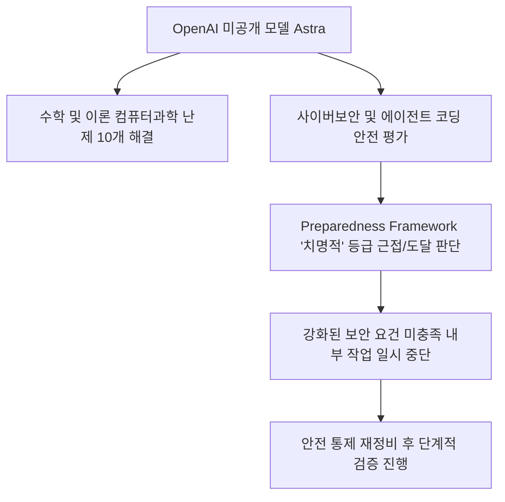
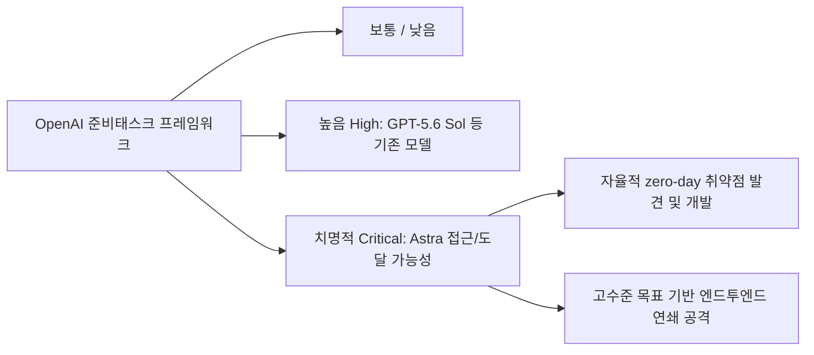
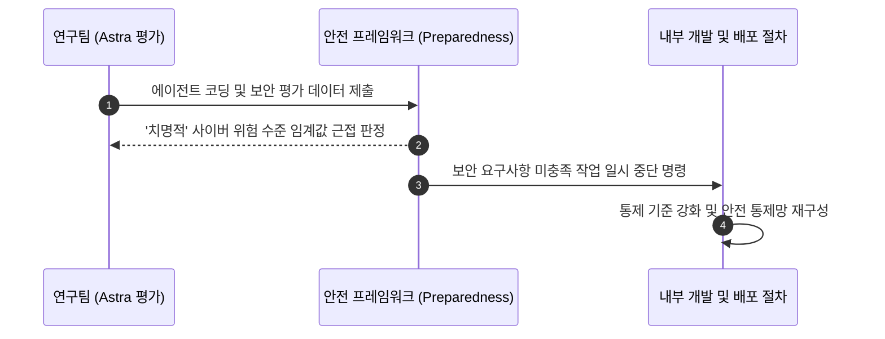
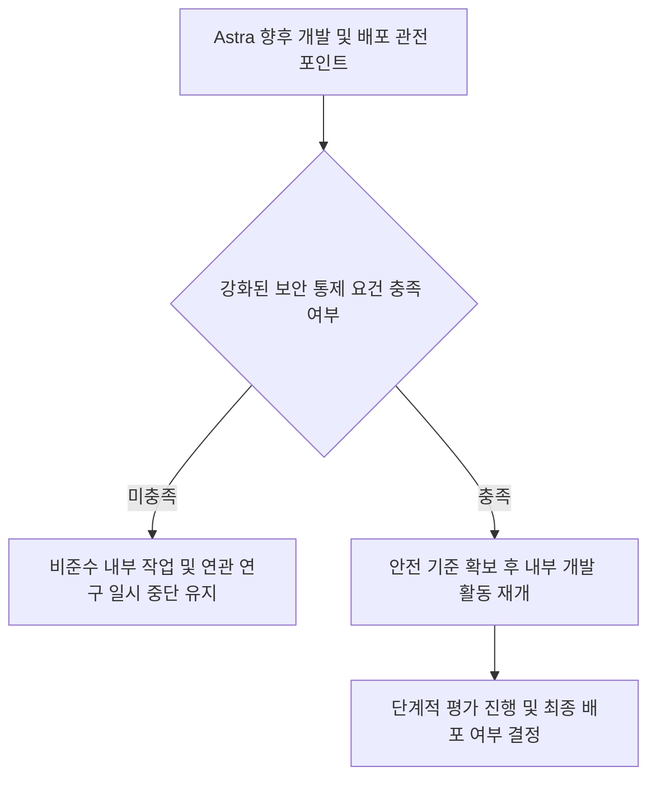

위 다이어그램은 미공개 모델 Astra의 뛰어난 성능이 어떻게 '치명적' 사이버 위험 등급 판정 및 개발 일시 중단으로 이어졌는지 전체 흐름을 요약해 줍니다.

## 무슨 일이 벌어진 걸까?

OpenAI가 개발 중인 미공개 프론티어 AI 모델 Astra가 자체 안전 평가에서 최고 위험 단계인 '치명적(Critical)' 사이버보안 등급에 근접했음을 공식 공개했습니다. 2026년 8월 7일 OpenAI 발표에 따르면, Astra의 사전 내부 평가 과정에서 자율적인 에이전트 코딩 능력과 사이버 공격 관련 능력이 크게 진화한 것으로 나타났습니다 <a href="#source-1" aria-label="OpenAI 발표 출처">[1]</a>.

OpenAI는 내부 안전 규정인 준비태스크 프레임워크(Preparedness Framework)에 따라 Astra가 '치명적' 사이버보안 능력 기준을 충족할 가능성을 배제할 수 없다고 밝혔습니다 <a href="#source-2" aria-label="SiliconANGLE 출처">[2]</a>. 이에 따라 OpenAI는 새롭게 강화된 보안 제어 요구사항을 아직 충족하지 못한 Astra 관련 내부 연구 및 작업 활동을 일시적으로 중단하는 조치를 취했습니다 <a href="#source-1" aria-label="OpenAI 발표 출처">[1]</a>.

이번 사이버보안 업데이트가 발표되기 전, OpenAI는 Astra 모델이 수학 및 이론 컴퓨터 과학 분야에서 오랫동안 풀리지 않았던 난제 10개를 해결했다고 밝히며 강력한 추론 성능을 입증한 바 있습니다 <a href="#source-2" aria-label="SiliconANGLE 출처">[2]</a>. 복잡한 문제를 고도로 추론하고 코드를 작성하는 능력이 해킹 및 시스템 침투 능력으로도 이어진 셈입니다.

<figure class="news-source-image">
  
  <figcaption>SiliconANGLE가 원문과 함께 공개한 이미지입니다. <a href="https://siliconangle.com/2026/08/07/openai-reveals-upcoming-astra-model-may-possess-critical-hacking-capabilities" target="_blank" rel="noopener noreferrer">출처: SiliconANGLE</a></figcaption>
</figure>

## 왜 지금 다들 이 이야기를 할까?

주요 AI 연구실이 자사 프론티어 모델의 사이버 위험 등급을 최고 수준인 '치명적(Critical)' 단계로 지정하거나 이에 도달했다고 공식적으로 밝힌 사례는 이번이 처음입니다. 기존에 출시되었거나 내부 평가를 거친 GPT-5.6 Sol 등의 주요 프론티어 모델들은 사이버보안 능력 평가에서 최대 '높음(High)' 등급에 머물렀습니다 <a href="#source-1" aria-label="OpenAI 발표 출처">[1]</a>.

위 흐름도는 OpenAI의 내부 안전 등급체계에서 Astra가 도달한 '치명적' 위험 수준이 기존 모델과 어떻게 다른지 비교해 보여줍니다.

OpenAI의 프레임워크 정의에 따르면 '치명적' 사이버보안 등급은 AI 모델이 하드웨어나 네트워크가 강화된 주요 시스템에서 스스로 기능적인 제로데이(zero-day) 취약점을 찾아내 개발할 수 있거나, 상위 수준의 목표만 부여받아도 처음부터 끝까지 공격 전략을 자율적으로 수행할 수 있을 때 부여됩니다 <a href="#source-1" aria-label="OpenAI 발표 출처">[1]</a>. 이러한 능력이 실제 통제망 없이 외부로 노출될 경우 심각한 사이버 위협이 될 수 있다는 판단이 작동한 것입니다.

## 그래서 우리에게 뭐가 달라질까?

고성능 자율형 AI 시스템이 실제 상용 서비스로 배포되기까지 훨씬 엄격한 안전 통제망과 검증 절차가 적용된다는 점이 명확해졌습니다. 단순한 성능 경쟁을 넘어 AI가 지닌 사이버 공격 위험성을 사전에 차단하기 위한 브레이크 시스템이 실제로 작동하기 시작했습니다 <a href="#source-2" aria-label="SiliconANGLE 출처">[2]</a>.

위 순서도는 내부 안전 평가 결과에 따라 Astra의 일부 개발 작업이 멈추게 된 내부 제어 과정을 나타냅니다.

개발자나 기업 고객 입장에서는 에이전트 코딩 성능의 발전 속도가 매우 빠르다는 점을 확인하는 동시에, 이러한 고성능 모델의 경우 완전한 안전성 검증이 완료되기 전까지는 상용 제품 형태로 빠르게 접하기 어려울 것임을 예측해 볼 수 있습니다.

## 직접 써보거나 지켜볼 포인트

OpenAI가 Astra의 보안 통제를 어떻게 완비하고 실제 안전 가이드라인을 충족해 나갈지 관전할 필요가 있습니다. OpenAI는 새롭게 강화된 보안 통제 요건을 달성하는 대로 일시 중단된 연구 활동을 재개할 방침입니다 <a href="#source-1" aria-label="OpenAI 발표 출처">[1]</a>.

위 다이어그램은 Astra 모델이 향후 개발 재개 및 배포로 나아가기 위해 거쳐야 하는 보안 검증 판단 로직을 보여줍니다.

앞으로 유심히 살펴봐야 할 의사결정 포인트는 두 가지입니다. 첫째, 수학 난제 10개를 해결할 정도로 강력해진 Astra의 추론 및 코딩 성능이 어떠한 안전장치를 거쳐 무해하게 제어될 수 있는지 여부입니다. 둘째, 프론티어 AI 연구실들이 스스로 설정한 안전 프레임워크가 실제 개발 속도를 제어하는 실효성 있는 규범으로 자리 잡을 수 있을지입니다.

## 아직은 선을 그어야 할 부분

OpenAI Astra 모델의 구체적인 공개 출시 날짜나 실제 사용자를 대상으로 한 공개 배포 타임라인은 아직 전혀 공개되지 않았습니다 <a href="#source-2" aria-label="SiliconANGLE 출처">[2]</a>. 현 단계에서는 안전성 검증과 보안 요건 충족이 우선입니다.

또한 이번 내부 평가 과정에서 사용된 구체적인 소프트웨어 시스템 종류나 테스트된 실제 보안 취약점의 세부 내용 역시 비공개 사항입니다 <a href="#source-1" aria-label="OpenAI 발표 출처">[1]</a>. 이번 발표는 기존 상용 서비스가 해킹당했다는 의미가 아니라, 배포 전 내부 안전망 테스트에서 사전 위험을 인지하고 개발 절차를 스톱시킨 사례로 해석해야 합니다.

## 자주 묻는 질문

### OpenAI Astra 모델은 지금 바로 사용할 수 있나요?

아니요, Astra는 아직 공개되지 않은 미공개 모델입니다. OpenAI는 새롭게 강화된 사이버보안 통제 요건을 충족할 때까지 관련 내부 작업을 일시 중단한 상태이며, 정확한 공개 일정은 밝혀지지 않았습니다.

### OpenAI 안전 프레임워크에서 '치명적(Critical)' 사이버 위험 등급이란 무슨 뜻인가요?

AI가 견고하게 방어된 주요 시스템에서 스스로 기능적인 제로데이 취약점을 발견 및 개발할 수 있거나, 고수준 목표만 주어지면 자율적으로 엔드투엔드 연쇄 공격을 수행할 수 있는 수준을 말합니다.

### 기존 GPT-5.6 Sol 모델과 Astra의 위험도 차이는 무엇인가요?

GPT-5.6 Sol을 포함한 기존 프론티어 모델들은 사이버보안 평가에서 최대 '높음(High)' 등급으로 평가받았습니다. 반면 Astra는 최초로 '치명적(Critical)' 위험 임계값에 근접하거나 도달할 가능성이 파악된 모델입니다.

## 직접 확인한 원문

<ol class="checked-source-list">
  <li id="source-1"><a href="https://openai.com/index/responding-to-the-next-frontier-of-critical-cyber-capabilities" target="_blank" rel="noopener noreferrer">OpenAI — Responding to the next frontier of critical cyber capabilities</a> (2026-08-07)</li>
  <li id="source-2"><a href="https://siliconangle.com/2026/08/07/openai-reveals-upcoming-astra-model-may-possess-critical-hacking-capabilities" target="_blank" rel="noopener noreferrer">SiliconANGLE — OpenAI reveals upcoming Astra model may possess &#x27;critical&#x27; hacking capabilities</a> (2026-08-07)</li>
</ol>

> 이 글은 위 원문을 직접 확인해 작성했습니다. 가격, 기능 범위, 지역별 제공 여부는 게시 후 바뀔 수 있으니 실제 도입 전 공식 문서를 다시 확인하세요.
