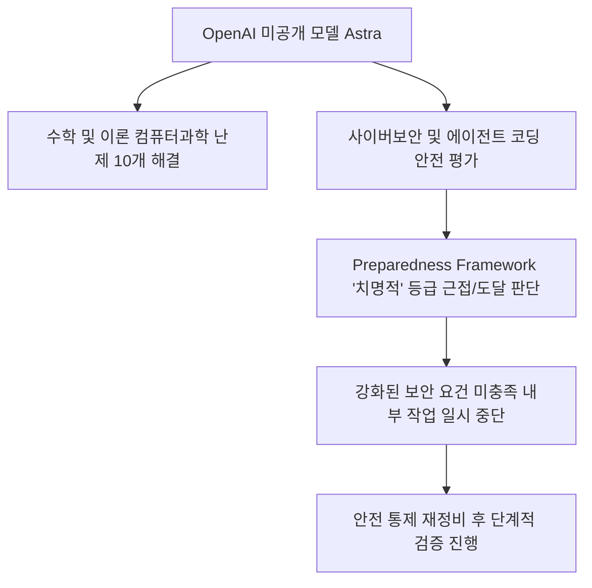
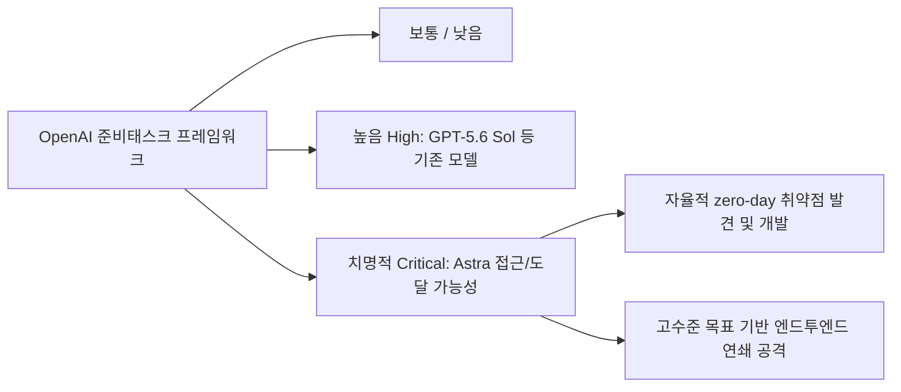
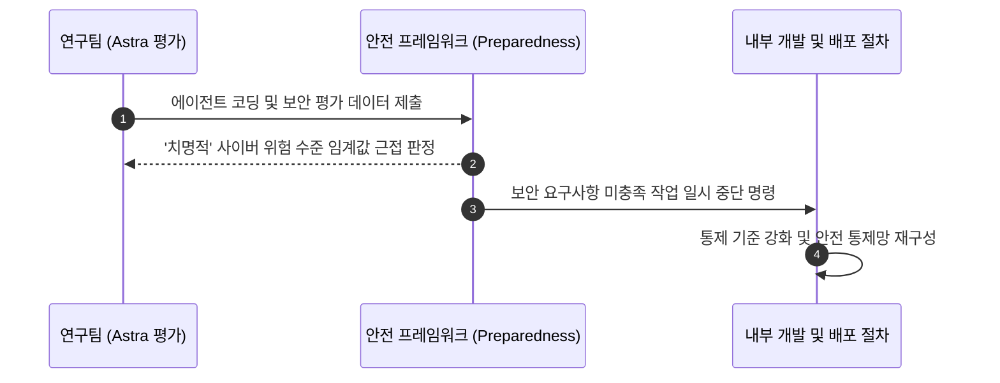
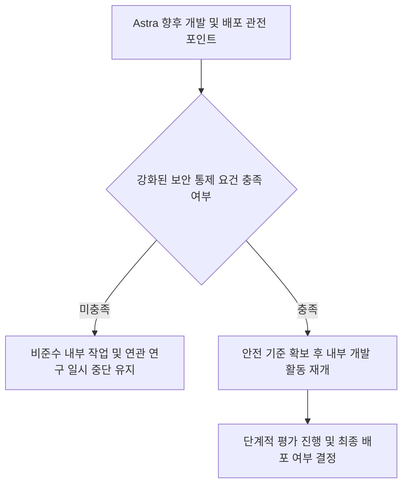

이번 발표는 Astra가 실제 공격을 일으켰다는 사고 보고가 아니라, 배포 전 내부 평가에서 더 높은 위험 등급 가능성을 발견해 일부 작업에 제동을 건 거버넌스 사례입니다. OpenAI는 '치명적' 임계값 도달 가능성을 배제할 수 없다고 표현했으며, 모델 전체 개발이나 공개가 확정적으로 취소됐다고 밝힌 것은 아닙니다. 따라서 성능 추측보다 어떤 평가가 어떤 내부 활동을 중단시켰고 무엇이 아직 공개되지 않았는지를 구분해 읽어야 합니다.

위 다이어그램은 미공개 모델의 평가가 강화된 통제 요건과 일부 내부 작업 중단으로 이어진 흐름을 요약합니다.

## 무슨 일이 벌어진 걸까?

OpenAI는 개발 중인 미공개 프론티어 AI 모델 Astra가 자체 안전 평가에서 최고 위험 단계인 '치명적(Critical)' 사이버보안 임계값에 도달할 가능성을 공개했습니다. 2026년 8월 7일 발표는 Astra의 사전 내부 평가에서 에이전트 코딩과 사이버 관련 능력을 더 엄격한 통제로 다뤄야 한다는 판단이 나왔음을 설명합니다 <a href="#source-1" aria-label="OpenAI 발표 출처">[1]</a>.

OpenAI는 내부 안전 규정인 준비태스크 프레임워크(Preparedness Framework)에 따라 Astra가 '치명적' 사이버보안 능력 기준을 충족할 가능성을 배제할 수 없다고 밝혔습니다 <a href="#source-2" aria-label="SiliconANGLE 출처">[2]</a>. 이에 따라 OpenAI는 새롭게 강화된 보안 제어 요구사항을 아직 충족하지 못한 Astra 관련 내부 연구 및 작업 활동을 일시적으로 중단하는 조치를 취했습니다 <a href="#source-1" aria-label="OpenAI 발표 출처">[1]</a>.

이번 사이버보안 업데이트에 앞서 Astra가 수학 및 이론 컴퓨터 과학 문제 10개를 해결했다는 설명도 보도됐습니다 <a href="#source-2" aria-label="SiliconANGLE 출처">[2]</a>. 다만 수학 문제 해결 결과만으로 사이버 능력을 추론할 수는 없으며, 위험 판단은 별도의 코딩·보안 평가를 근거로 읽어야 합니다.

<figure class="news-source-image">
  
  <figcaption>SiliconANGLE가 원문과 함께 공개한 이미지입니다. <a href="https://siliconangle.com/2026/08/07/openai-reveals-upcoming-astra-model-may-possess-critical-hacking-capabilities" target="_blank" rel="noopener noreferrer">출처: SiliconANGLE</a></figcaption>
</figure>

## '치명적' 등급은 실제 침해 사고와 어떻게 다를까?

OpenAI 발표에서 Astra는 '치명적(Critical)' 단계에 도달할 가능성을 배제할 수 없는 모델로 다뤄졌습니다. 기존에 출시되었거나 내부 평가를 거친 GPT-5.6 Sol 등의 모델은 이 프레임워크의 사이버보안 평가에서 최대 '높음(High)' 등급으로 설명됐습니다 <a href="#source-1" aria-label="OpenAI 발표 출처">[1]</a>. 이는 같은 회사의 평가 체계 안에서 통제 수준을 결정하기 위한 비교이며, 외부 기관의 독립 인증이나 현실 세계 공격 성공률은 아닙니다.

위 흐름도는 OpenAI의 내부 안전 등급체계에서 Astra가 도달한 '치명적' 위험 수준이 기존 모델과 어떻게 다른지 비교해 보여줍니다.

OpenAI의 프레임워크 정의에 따르면 '치명적' 사이버보안 등급은 AI 모델이 하드웨어나 네트워크가 강화된 주요 시스템에서 스스로 기능적인 제로데이(zero-day) 취약점을 찾아내 개발할 수 있거나, 상위 수준의 목표만 부여받아도 처음부터 끝까지 공격 전략을 자율적으로 수행할 수 있을 때 부여됩니다 <a href="#source-1" aria-label="OpenAI 발표 출처">[1]</a>. 이러한 능력이 실제 통제망 없이 외부로 노출될 경우 심각한 사이버 위협이 될 수 있다는 판단이 작동한 것입니다.

중요한 구분은 “임계값에 도달할 수 있음”과 “검증된 채 외부에 배포됨” 사이입니다. Astra는 미공개 모델이고, 테스트 대상 시스템과 과제별 성공률은 상세히 공개되지 않았습니다. 따라서 발표는 위험이 없다는 증거도, Astra가 현실의 견고한 시스템을 이미 침해했다는 증거도 아닙니다. 공개된 것은 불확실성이 큰 상황에서 더 강한 통제 요건을 적용했다는 절차입니다.

## 일부 내부 작업 중단은 어떤 거버넌스 신호일까?

이번 사례는 능력 평가 결과가 개발·연구 절차에 연결되는 방식을 보여줍니다. 발표상 중단 대상은 강화된 보안 제어 요구사항을 아직 충족하지 못한 Astra 관련 내부 활동이며, 모든 연구와 모델 개발이 멈췄다고 표현하면 범위가 넓어집니다 <a href="#source-2" aria-label="SiliconANGLE 출처">[2]</a>. 실효성을 판단하려면 어떤 통제가 추가되고 재개 전에 어떤 검증을 통과하는지가 후속 공개에서 확인돼야 합니다.

위 순서도는 내부 안전 평가 결과에 따라 Astra의 일부 개발 작업이 멈추게 된 내부 제어 과정을 나타냅니다.

기업이 얻을 수 있는 실무적 교훈은 위험 임계값과 중단 권한을 모델 도입 전에 정해 두어야 한다는 점입니다. 예를 들어 민감한 시스템 접근, 알려지지 않은 취약점 탐색, 외부 네트워크로의 자율 행동처럼 위험이 커지는 능력에는 별도의 평가와 승인 조건을 둘 수 있습니다. 평가가 기준을 넘었을 때 배포팀이 일정 압박과 무관하게 접근을 제한할 권한이 없다면 문서상의 안전 등급만으로는 통제가 작동하지 않습니다.

## 후속 발표에서 무엇을 확인해야 판단할 수 있을까?

OpenAI가 Astra의 보안 통제를 어떻게 완비하고 실제 안전 가이드라인을 충족해 나갈지 관전할 필요가 있습니다. OpenAI는 새롭게 강화된 보안 통제 요건을 달성하는 대로 일시 중단된 연구 활동을 재개할 방침입니다 <a href="#source-1" aria-label="OpenAI 발표 출처">[1]</a>.

위 다이어그램은 Astra 모델이 향후 개발 재개 및 배포로 나아가기 위해 거쳐야 하는 보안 검증 판단 로직을 보여줍니다.

앞으로 확인할 의사결정 포인트는 세 가지입니다. 첫째, 일시 중단의 정확한 대상과 재개 조건이 무엇인지입니다. 둘째, 접근 통제·모니터링·모델 동작 제한 등 추가 대책이 위험 평가에서 어떻게 검증되는지입니다. 셋째, 회사 자체 평가 외에 재현 가능한 근거나 외부 검토가 어느 범위까지 제공되는지입니다. 모델 공개 일정만 추적하기보다 이 근거가 제시돼야 위험 완화가 충분한지 판단할 수 있습니다.

통제의 효과를 볼 때는 모델 답변을 거절하게 만드는 장치만 확인해서는 부족합니다. 고위험 평가 환경에 누가 접근할 수 있는지, 모델 가중치와 인증 정보가 어떻게 분리되는지, 도구 실행이 격리된 시스템 안에서만 가능한지, 이상 행동을 사후 조사할 로그가 남는지가 함께 작동해야 합니다. 어느 한 층이 실패해도 다음 층이 피해를 제한하는 구조인지가 핵심이며, “안전성 향상”이라는 요약만으로는 이를 판단할 수 없습니다.

또 하나는 재개 이후의 범위입니다. 내부 연구 재개, 제한된 평가자 접근, 제품 기능 배포는 서로 다른 결정이므로 하나가 허용됐다고 나머지도 안전하다고 볼 수 없습니다. 각 단계에서 사용자 수와 권한, 연결 가능한 시스템을 넓힐 때 다시 평가하는지 확인해야 합니다. 사고가 없었다는 사실도 시험 범위가 좁았다면 능력 위험이 사라졌다는 증거가 되지 않습니다.

후속 보고가 나온다면 최초 평가와 같은 과제로 통제 전후 결과를 비교했는지도 살펴야 합니다. 과제가 바뀌면 위험이 줄어든 것인지 시험이 쉬워진 것인지 구분하기 어렵습니다.

## 아직은 선을 그어야 할 부분

OpenAI Astra 모델의 공개 출시 날짜나 사용자 대상 배포 일정은 발표에 포함되지 않았습니다 <a href="#source-2" aria-label="SiliconANGLE 출처">[2]</a>. 현 단계에서는 안전성 검증과 보안 요건 충족이 우선입니다.

또한 이번 내부 평가 과정에서 사용된 구체적인 소프트웨어 시스템 종류나 테스트된 실제 보안 취약점의 세부 내용 역시 비공개 사항입니다 <a href="#source-1" aria-label="OpenAI 발표 출처">[1]</a>. 이번 발표는 기존 상용 서비스가 해킹당했다는 의미가 아니라, 배포 전 내부 안전망 테스트에서 사전 위험을 인지하고 개발 절차를 스톱시킨 사례로 해석해야 합니다.

<!-- primary-sources:start -->
## 원문과 버전 확인

- [발표 원문](https://openai.com/index/responding-to-the-next-frontier-of-critical-cyber-capabilities)
- [SiliconANGLE](https://siliconangle.com/2026/08/07/openai-reveals-upcoming-astra-model-may-possess-critical-hacking-capabilities)
<!-- primary-sources:end -->

<!-- internal-links:start -->
## 함께 읽으면 이해가 이어지는 글

- [Anthropic 위험 보고서 공개, Claude Mythos 5 넘어서는 미공개 Model 2와 정렬 위험 등급 상향]() — Anthropic이 2026년 8월 14일 발표한 186페이지 위험 보고서에서 Claude Mythos 5를 넘어서는 미공개 모델 'Model 2'의 존재를 밝혔습니다. 자율 에이전트 기능의 고도화와 사이버 보안 평가 사례를 반영해…
- [공개된 AI 시스템 프롬프트를 그대로 복사해도 될까? 저장소 활용 기준]() — 여러 AI 도구의 시스템 프롬프트를 모은 저장소에서 역할·제약·출력 형식을 분석하는 법과 진위·버전·저작권을 확인해야 하는 이유를 정리합니다.
- [AI 규제 문서가 흩어져 있다면? AI Atlas Nexus로 리스크 연결하는 법]() — AI Atlas Nexus가 NIST·MIT·EU AI Act의 리스크를 공통 지식 그래프로 연결하는 방식과 LLM 매핑을 사람의 검토 없이 확정하면 안 되는 이유를 정리합니다.
<!-- internal-links:end -->

## 자주 묻는 질문

### OpenAI Astra 모델은 지금 바로 사용할 수 있나요?

아니요, Astra는 아직 공개되지 않은 모델입니다. OpenAI는 강화된 사이버보안 통제 요건을 충족하지 않은 관련 내부 작업을 일시 중단했으며, 공개 일정은 밝히지 않았습니다. 이를 모델 전체 개발이 중단됐다는 뜻으로 확대하면 안 됩니다.

### OpenAI 안전 프레임워크에서 '치명적(Critical)' 사이버 위험 등급이란 무슨 뜻인가요?

AI가 견고하게 방어된 주요 시스템에서 스스로 기능적인 제로데이 취약점을 발견 및 개발할 수 있거나, 고수준 목표만 주어지면 자율적으로 엔드투엔드 연쇄 공격을 수행할 수 있는 수준을 말합니다.

### 기존 GPT-5.6 Sol 모델과 Astra의 위험도 차이는 무엇인가요?

GPT-5.6 Sol을 포함한 기존 프론티어 모델들은 사이버보안 평가에서 최대 '높음(High)' 등급으로 평가받았습니다. 반면 Astra는 최초로 '치명적(Critical)' 위험 임계값에 근접하거나 도달할 가능성이 파악된 모델입니다.

## 직접 확인한 원문

<ol class="checked-source-list">
  <li id="source-1"><a href="https://openai.com/index/responding-to-the-next-frontier-of-critical-cyber-capabilities" target="_blank" rel="noopener noreferrer">OpenAI — Responding to the next frontier of critical cyber capabilities</a> (2026-08-07)</li>
  <li id="source-2"><a href="https://siliconangle.com/2026/08/07/openai-reveals-upcoming-astra-model-may-possess-critical-hacking-capabilities" target="_blank" rel="noopener noreferrer">SiliconANGLE — OpenAI reveals upcoming Astra model may possess &#x27;critical&#x27; hacking capabilities</a> (2026-08-07)</li>
</ol>

> 이 글은 위 원문을 직접 확인해 작성했습니다. 가격, 기능 범위, 지역별 제공 여부는 게시 후 바뀔 수 있으니 실제 도입 전 공식 문서를 다시 확인하세요.
