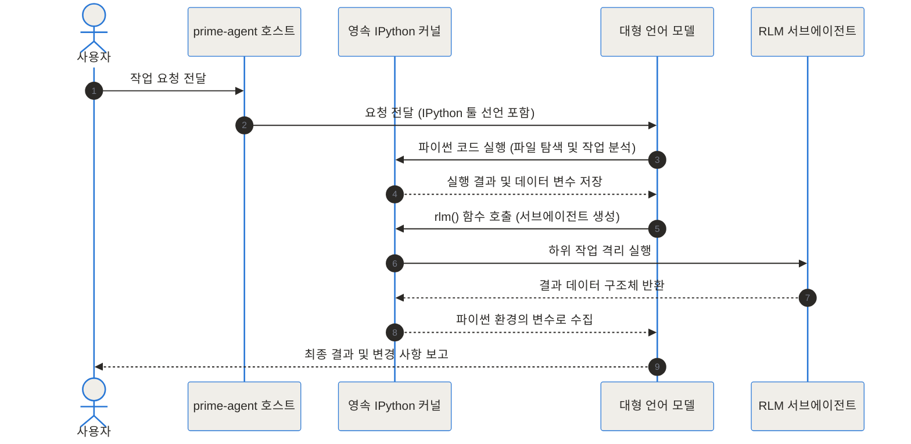
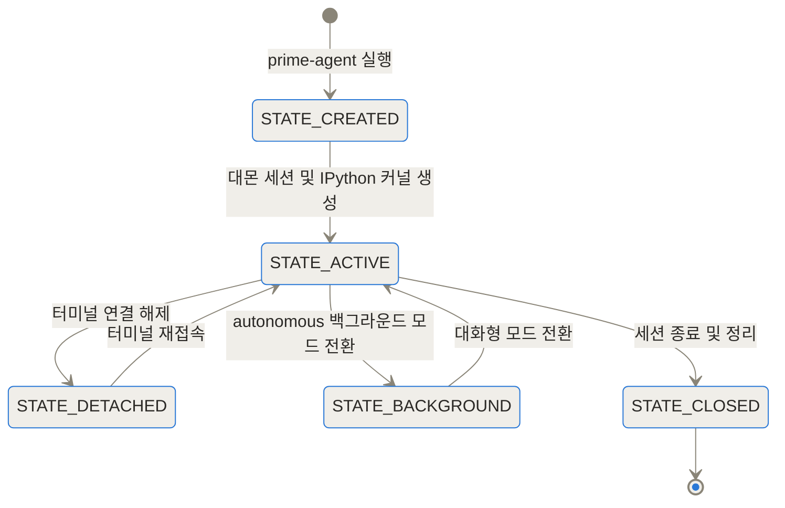
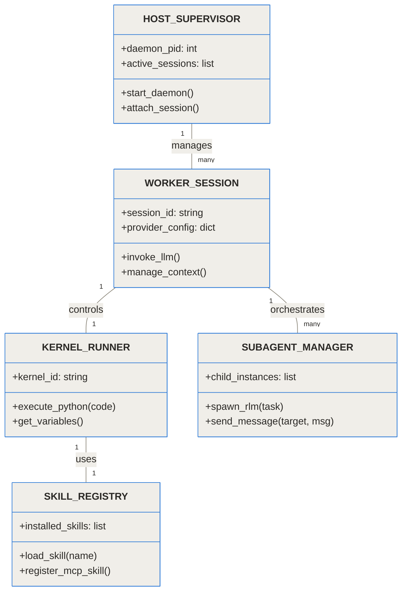
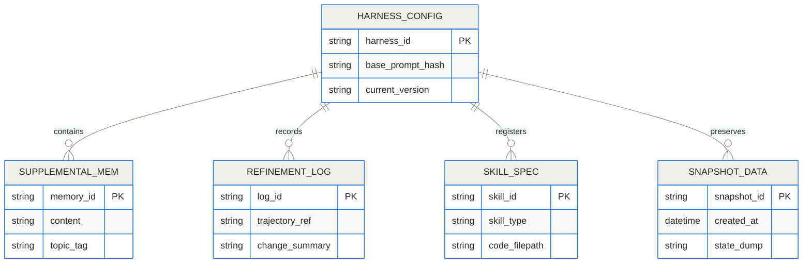
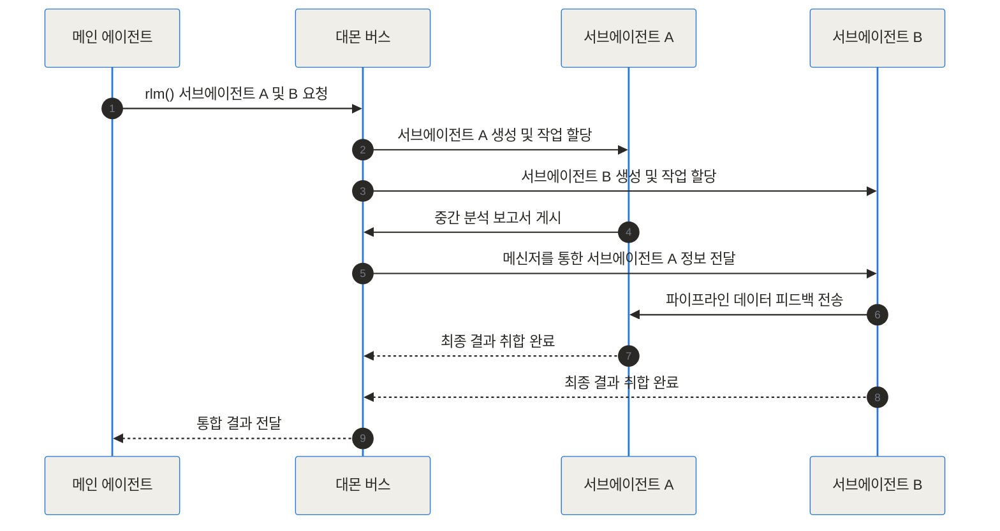
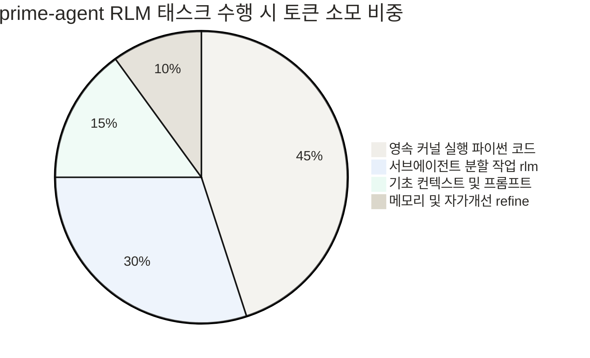

## 주요 참조 링크

- [Prime Agent GitHub 저장소](https://github.com/PrimeIntellect-ai/prime-agent)
- [Prime Intellect 공식 블로그 발표](https://www.primeintellect.ai/blog/prime-agent)

## 도입 및 한 줄 요약

AI 기반 코딩 에이전트를 현업 업무에 도입할 때 가장 흔히 겪는 문제는 대화가 길어질수록 과거 맥락을 잊어버리거나, 수십 개의 도구 정의(JSON Schema)로 인해 입력 토큰이 폭발적으로 증가하는 현상입니다. 또한 작업 도중 터미널이 끊기면 지금까지 에이전트가 수행해 온 중간 탐색 상태가 모두 사라져 처음부터 다시 명령을 내려야 하는 고통이 존재했습니다.

Prime Intellect가 공개한 오픈소스 프로젝트 prime-agent는 영속적인 IPython 커널을 AI 에이전트의 중심 인터페이스로 배치하여 이 문제를 완전히 새로운 접근법으로 해결합니다. 대화창마다 프롬프트를 덧붙이는 대신 에이전트가 직접 파이썬 코드를 작성하고 변수에 중간 데이터를 저장하며, 필요에 따라 하부 에이전트를 함수 호출 방식으로 동적 생성합니다.

> **한 줄 요약(TL;DR):** prime-agent는 단일 영속 IPython 커널을 제어 환경으로 삼아 재귀적 서브에이전트(RLM) 호출, /refine 명령 기반 자가 개선, 대몬 백그라운드 지속 실행을 제공하는 차세대 오픈소스 AI 코딩 하네스입니다.

```mermaid
%%{init: {"theme":"base","themeVariables":{"primaryColor":"#F0EEE9","primaryBorderColor":"#2a78d6","primaryTextColor":"#2b2926","secondaryColor":"#e8f0fb","secondaryBorderColor":"#4a3aa7","secondaryTextColor":"#2b2926","tertiaryColor":"#eafaf3","tertiaryBorderColor":"#1baf7a","tertiaryTextColor":"#2b2926","lineColor":"#8a8578","textColor":"#2b2926","edgeLabelBackground":"#F0EEE9","noteBkgColor":"#F0EEE9","noteTextColor":"#2b2926","noteBorderColor":"#8a8578","clusterBkg":"#faf9f6","clusterBorder":"#d8d4c8","fontFamily":"Pretendard, sans-serif"}}}%%
flowchart TD
    subgraph TRADITIONAL["기존 AI 코딩 에이전트 방식"]
        T1["LLM 프롬프트"] --> T2["수십 개 JSON 도구 스키마 전송"]
        T2 --> T3["개별 도구 호출 및 결과 반환"]
        T3 --> T4["맥락 누적으로 토큰 고갈"]
    end
    subgraph PRIME_AGENT["prime-agent RLM 방식"]
        P1["LLM 프롬프트"] --> P2["단일 IPython 커널 인터페이스"]
        P2 --> P3["파이썬 코드 실행으로 파일 및 쉘 및 서브에이전트 제어"]
        P3 --> P4["메모리 변수 활용 및 높은 토큰 효율성"]
    end
```



## 기존 AI 코딩 도구의 한계와 prime-agent 등장 배경

기존의 AI 코딩 보조 도구들은 대개 단일 대화 세션에 의존했습니다. AI 모델에게 다양한 능력을 부여하기 위해 에디터 읽기, 파일 쓰기, 터미널 명령 실행, 검색 등 수십 가지의 툴 스키마(Tool Schema)를 작성해 매 요청마다 전송하곤 했습니다. 이러한 구조는 다음과 같은 명확한 페인 포인트(Pain Point)를 유발했습니다.

- **토큰 낭비 및 프롬프트 노이즈:** 매 턴마다 수백 줄에 달하는 JSON 도구 정의를 주고받아야 하므로 컨텍스트 윈도우가 불필요한 도구 명세로 채워집니다.
- **휘발성 세션 상태:** 터미널 프로세스가 종료되면 이전 대화에서 탐색한 코드 구조나 생성된 중간 데이터가 완전히 사라집니다.
- **스프롤(Sprawl) 현상:** 에이전트가 긴 작업을 진행할수록 출력 로그가 길어져 중요한 지시사항이 묻히게 됩니다.
- **경단점 없는 프롬프트 오염:** 에이전트의 시스템 프롬프트를 직접 수정하다가 전체 성능이 저하되는 프롬프트 열화 현상이 발생합니다.

prime-agent는 이러한 구조적 한계를 극복하기 위해 제안된 하네스(Harness)입니다. 원래 pi-mono에서 시작되었으나 지속형 커널, RLM(Recursive Language Model), Continual Harness 기능을 탑재하면서 독립된 차세대 실행 프레임워크로 발전했습니다.

```chartjs
{"type":"bar","data":{"labels":["기존 AI 에이전트 JSON Tool","prime-agent Persistent Kernel"],"datasets":[{"label":"100턴 대화 시 누적 토큰 소비량 (k Tokens)","data":[1450,380]}]},"options":{"responsive":true,"plugins":{"title":{"display":true,"text":"100턴 연장 작업 시 토큰 소비량 비교"}}}}
```

## prime-agent 핵심 개념 쉽게 이해하기

prime-agent의 작동 패러다임을 이해하기 위해서는 개발 현장의 일상적 비유를 살펴보는 것이 유용합니다.

### 1. 영속 파이썬 커널: 만능 개발자 워크스테이션

기존 에이전트가 특정 수화(JSON 스키마)로만 대화할 수 있는 비서였다면, prime-agent는 자판과 파이썬 인터프리터가 열려 있는 실제 통합 개발 환경(IDE)을 부여받은 개발자와 같습니다. 파일 읽기, 검색, 코드 리팩토링, 외부 API 요청까지 모든 작업은 파이썬 코드로 작성되어 IPython 실행 환경에서 처리됩니다. 에이전트는 파이썬 변수에 수천 줄의 코드 분석 결과를 담아두고 이후 턴에서 자유롭게 재활용합니다.

### 2. Recursive Language Model (RLM): 팀장과 전문 하부 작업자

하나의 AI 모델이 전체 대형 프로젝트를 혼자 분석하려면 컨텍스트 한계에 도달합니다. prime-agent는 rlm()이라는 함수 호출을 통해 자신과 동일한 구조를 가진 서브에이전트를 생성합니다. 작업 지시를 내린 메인 에이전트(팀장)는 서브에이전트(작업자)가 격리된 공간에서 일을 마치고 반환한 요약 결과만 수신합니다.

### 3. Continual Harness: 베이스 프롬프트와 업무 매뉴얼 노트

회사 기본 규정(기본 시스템 프롬프트)을 함부로 고치면 조직 규칙이 깨집니다. prime-agent는 기본 프롬프트를 절대 수정할 수 없는 불변(Immutable) 상태로 두고, 작업 진행 중 깨달은 팁이나 실수를 /refine 명령을 통해 보완 메모리 및 스킬로 별도 기록합니다. 필요 시 이전 버전으로 되돌리는 스냅샷 기능도 갖추고 있습니다.



## prime-agent 내부 작동 원리 심층 분석

### 시스템 멀티 프로세스 아키텍처

prime-agent는 단순한 대화형 CLI 프론트엔드가 아닙니다. 백그라운드 대몬(Daemon) 기반의 멀티 프로세스 런타임 구조로 설계되어 있습니다. 클라이언트 인터페이스가 꺼지더라도 대몬 프로세스가 살아있어 긴 자율 작업을 계속 진행할 수 있습니다.

| 핵심 구성 요소 | 역할 및 주 책임 | 비고 |
| :--- | :--- | :--- |
| **TUI Client** | 사용자와 소통하는 터미널 대화형 사용자 인터페이스 | 슬래시 명령 및 실시간 키보드 입력 전달 |
| **Daemon Supervisor** | 세션 상태 유지, 백그라운드 스케줄링, 메시지 버스 관리 | 프로세스 연결 해제 시에도 백그라운드 지속 실행 |
| **Worker Session** | 프로바인더 인증 처리, LLM 요청 분가지 제어 및 가공 | Claude, ChatGPT, Copilot 등 다양한 공급자 연동 |
| **IPython Kernel** | 메모리 상태 보존, 파이썬 코드 실행 및 스킬/서브에이전트 호출 | 모델이 접근할 수 있는 유일한 표준 툴 레벨 |



### 프로그램 기반 툴 사용과 코드 중심 통합

prime-agent의 독특한 특성은 모델에게 제공되는 툴 패키지가 오직 `ipython` 하나라는 점입니다. 모델이 파일 시스템을 조회하거나 프로젝트 빌드 검사를 수행할 때 기존 하네스처럼 개별 API 스키마를 호출하지 않고, 내부 파이썬 환경에서 표준 라이브러리나 래핑된 Helper 함수를 직접 실행합니다.

MCP(Model Context Protocol) 연동 역시 프롬프트 레벨에 툴 명세를 주입하지 않고 파이썬 스킬 모듈로 내장하여 실행합니다. 이를 통해 프롬프트 오염을 최소화하고 실행의 자율성을 극대화합니다.



### Continual Harness와 자가 개선 스캐폴딩

에이전트가 코딩 과제를 해결하는 동안 실수를 저지를 수 있습니다. 사용자가 수정을 요구하거나 테스트가 실패할 경우, 사용자는 `/refine` 슬래시 명령을 실행할 수 있습니다.

이 때 prime-agent는 지금까지의 히스토리를 전수 검토하여 무엇이 문제였는지 분석합니다. 분석된 결과는 아래 4가지 형태의 보완 데이터로 자동 저장됩니다.

1. **보완 프롬프트(Supplemental Prompts):** 행동 지침 보완
2. **메모리 노드(Memories):** 리포지토리의 특이사항이나 프로젝트 컨벤션 기록
3. **재사용 스킬(Executable Skills):** 자주 반복되는 스크립트를 파이썬/마크다운 스킬 패키지로 변환
4. **서브에이전트 명세(Subagent Specs):** 특정 작업 전담 서브에이전트 정의

```mermaid
%%{init: {"theme":"base","themeVariables":{"primaryColor":"#F0EEE9","primaryBorderColor":"#2a78d6","primaryTextColor":"#2b2926","secondaryColor":"#e8f0fb","secondaryBorderColor":"#4a3aa7","secondaryTextColor":"#2b2926","tertiaryColor":"#eafaf3","tertiaryBorderColor":"#1baf7a","tertiaryTextColor":"#2b2926","lineColor":"#8a8578","textColor":"#2b2926","edgeLabelBackground":"#F0EEE9","noteBkgColor":"#F0EEE9","noteTextColor":"#2b2926","noteBorderColor":"#8a8578","clusterBkg":"#faf9f6","clusterBorder":"#d8d4c8","fontFamily":"Pretendard, sans-serif"}}}%%
flowchart LR
    A["수행 내역 수집"] --> B["성공 및 실패 패턴 분석"]
    B --> C["refine 명령 기반 증거 검증"]
    C --> D["보완 프롬프트 및 메모리 생성"]
    D --> E["보완 스킬 및 서브에이전트 저장"]
    E --> F["스냅샷 기록 및 하네스 업데이트"]
```





### 에이전트 간 통신(A2A) 및 자율 구동 구조

prime-agent는 에이전트와 서브에이전트 간 직접 통신(Agent-to-Agent Messaging)을 지원합니다. 대몬의 이벤트를 공유하며 서로 상태를 알리고 작업을 교차 검증합니다. 주기적인 작업 관리를 위해 하트비트(Heartbeat) 시스템 및 반복 크론(Cron) 스케줄러가 포함되어 있습니다.





## 설치 및 기본 사용 방법 안내

### 환경 설치 방법

Linux 및 macOS 환경에서는 단일 쉘 스크립트 명령어로 안정화 버전을 빠르게 설치할 수 있습니다.

```bash
curl -fsSL https://app.primeintellect.ai/prime-agent/install.sh | sh
```

소스를 직접 빌드하여 실행하고자 하는 경우 Node.js 22.8.0 이상이 필요합니다.

```bash
git clone https://github.com/PrimeIntellect-ai/prime-agent
cd prime-agent
npm ci
./prime-agent.sh
```

### 인증 로그인 및 시작 방법

설치 후 작업 대상 프로젝트 디렉토리로 이동하여 prime-agent를 실행합니다.

```bash
cd /path/to/your-project
prime-agent
```

최초 실행 시 `/login` 슬래시 명령어를 입력하면 Claude Pro/Max, ChatGPT Plus/Pro(Codex), GitHub Copilot과 같은 구독 계정으로 로그인하거나, Anthropic API Key를 설정할 수 있습니다. 환경 변수를 직접 설정하는 것도 가능합니다.

```bash
export ANTHROPIC_API_KEY=sk-ant-api-key-here
prime-agent
```

### 대화형 세션 주요 슬래시 명령어

- `/login`: 구독 로그인 및 API 키 설정
- `/refine`: 현재 세션의 실행 궤적을 분석하여 스캐폴딩 상태 자가 개선
- `/branch`: 현재 대화 세션의 상태에서 새로운 분기 생성
- `/compact`: 긴 대화 내역 축약 및 세션 요약

## 현업 실전 활용 시나리오

### 시나리오 1: 거대한 레거시 코드베이스의 대규모 리팩토링

수십 만 줄 크기의 모놀리식 리포지토리를 마이크로서비스로 분리하거나 타입스크립트로 전환할 때, 단일 에이전트는 파일 몇 개를 수정하다 맥락을 잃습니다. prime-agent는 파이썬 커널에서 전체 모듈 관계도를 파싱하여 메모리 변수에 저장한 뒤, 서브모듈 단위로 `rlm()` 서브에이전트를 동시 생성하여 독립 병렬 처리를 수행합니다.

### 시나리오 2: 무중단 백그라운드 자율 버그 탐색

복잡한 분산 환경에서 특정 조건에만 나타나는 결함을 추적할 때, 개발자가 터미널을 열어둘 필요가 없습니다. 백그라운드 대몬 상태로 자율 탐색 모드를 켜두면 prime-agent가 재현 스크립트를 작성하고, 로그 분석 스킬을 구동하며, 심야 시간 동안 독립적으로 원인을 탐색한 후 아침에 요약 리포트를 제출합니다.

### 시나리오 3: 연구 및 벤치마크 자동화(Autoresearch)

머신러닝 하이퍼파라미터 튜닝이나 논문 구현 실험 시, prime-agent는 반복 실험 데이터를 파이썬 커널 내부 판다스(Pandas) 데이터프레임으로 축적합니다. 실험 중 발생하는 오류 패턴을 `/refine`으로 기록하여 다음 실험 알고리즘 작성 시 스스로 동일 오류를 방지합니다.

## 벤치마크 및 기존 하네스 비교

prime-agent는 Claude 3.5 Sonnet 및 Opus 5 등의 최신 프론티어 모델과 조합되었을 때 차별화된 수치를 나타냅니다. 고난도 추론 테스트인 ARC-AGI-3 벤치마크에서 인간 전문가 기준치인 85%를 상회하는 95.5%의 정답률을 기록했습니다.

```chartjs
{"type":"bar","data":{"labels":["기존 프롬프트 방식","일반 AI 에이전트 하네스","prime-agent Opus 5"],"datasets":[{"label":"ARC-AGI-3 정답률 (%)","data":[62.0,82.5,95.5]}]},"options":{"responsive":true,"plugins":{"title":{"display":true,"text":"ARC-AGI-3 벤치마크 수행 성과 비교"}}}}
```

| 비교 항목 | 전통적 AI 에이전트 (Cursor/Aider/Claude Code) | prime-agent | 비고 |
| :--- | :--- | :--- | :--- |
| **도구 호출 방식** | JSON Schema 기반 다중 API 정의 | 단일 IPython 커널 내 파이썬 스크립트 | 토큰 노이즈 극적 감소 |
| **세션 생명주기** | 대화창/터미널 프로세스 종속 | 대몬 프로세스 기반 무중단 런타임 | 터미널 종료 후 재연결 가능 |
| **자가 개선 방식** | 프롬프트 직접 덮어쓰기 (손상 위험) | 불변 베이스 + 보완 스냅샷(/refine) | 안전한 롤백 지원 |
| **서브에이전트** | 제약적이거나 단일 수준 호출 | rlm() 함수 기반 재귀 다중 에이전트 | 자율 오케스트레이션 |

## prime-agent에 대한 솔직한 평가와 주의점

prime-agent는 강력한 자율성과 효율성을 제공하지만, 모든 상황에 적용할 수 있는 만능 도구는 아닙니다.

### 1. 보안 격리 샌드박스의 미비

prime-agent는 기본적으로 명령을 실행하는 사용자의 로컬 환경 권한 그대로 파이썬 코드와 쉘 명령을 구동합니다. 자체적으로 완벽히 격리된 샌드박스 컨테이너를 내장하고 있지 않으므로, 출처가 불분명한 코드베이스나 악성 코드가 포함될 수 있는 리포지토리에서 자율 모드를 켤 때에는 반드시 Docker 컨테이너나 격리된 VM 내부에서 실행해야 안전합니다.

### 2. 추론 능력이 뛰어난 상위 모델 필수 요구

IPython 커널을 제어 도구로 사용하고 파이썬 코드를 즉석에서 조합해야 하기 때문에, 에이전트의 코드 작성 정확도와 추론 성능이 매우 높아야 합니다. 경량화된 중소형 오픈소스 LLM을 사용할 경우 파이썬 구문 오류를 내거나 서브에이전트 파라미터를 잘못 전달하여 작업이 중단될 수 있습니다.

### 3. 높은 초기 학습 곡선

단순히 코드 몇 줄을 수정해주는 인라인 에디터와 달리, 대몬 구조, 파이썬 스킬 작성법, 서브에이전트 계층 제어 등 프레임워크 자체의 개념을 이해해야 100% 활용할 수 있습니다.

## 결론 및 미래 전망

Prime Intellect의 prime-agent는 지금까지 '대화창 래퍼(Wrapper)' 수준에 머물러 있던 AI 코딩 도구를 '지속 실행 가능한 소프트웨어 엔지니어링 런타임' 수준으로 끌어올렸습니다. 단일 영속 파이썬 커널이라는 직관적인 접근과 재귀적 에이전트 오케스트레이션, 그리고 안전한 스캐폴딩 자가 개선 메커니즘인 Continual Harness는 향후 에이전트 개발 표준에 큰 영향을 미칠 것입니다.

긴 시간에 걸쳐 복잡한 코드를 정밀하게 분석하고 백그라운드에서 끊김 없이 업무를 완수하는 AI 협업 도구를 찾고 있다면, 오픈소스로 제공되는 prime-agent를 직접 경험해 보는 것을 권장합니다.

## 자주 묻는 질문 (FAQ)

### prime-agent는 기존의 Cursor나 Claude Code 같은 AI 코딩 도구와 무엇이 다른가요?

prime-agent는 수십 개의 도구 스키마를 JSON으로 매번 전송하는 대신 영속적인 IPython 커널을 단일 도구로 사용합니다. 데이터와 중간 맥락을 파이썬 변수로 유지하므로 토큰 소비를 대폭 줄이고, 재귀적 서브에이전트 및 대몬 기반 무중단 실행 환경을 제공하는 점에서 차별화됩니다.

### 터미널을 닫거나 컴퓨터 세션이 끊겨도 에이전트 작업이 유지되나요?

네, prime-agent는 백그라운드 대몬 프로세스로 구동되기 때문에 터미널 창을 닫아도 작업이 계속 진행됩니다. 언제든지 터미널을 다시 열어 실행 중인 대몬 세션에 재접속(Reattach)할 수 있습니다.

### 자가 개선 명령인 /refine은 에이전트의 기본 동작 규칙을 망가뜨리지 않나요?

/refine 명령은 시스템 베이스 프롬프트를 직접 수정하지 않고 별도의 보완 메모리, 스킬, 서브에이전트 명세 파일에 변경 내역을 축적합니다. 모든 수정 내역은 버전화된 스냅샷으로 기록되므로 문제가 발생하면 이전 상태로 안전하게 롤백할 수 있습니다.

### 보안 측면에서 prime-agent 실행 시 주의해야 할 점은 무엇인가요?

prime-agent는 사용자의 로컬 환경과 동일한 권한으로 파이썬 코드와 쉘 명령을 구동합니다. 내장된 자체 격리 샌드박스가 없으므로 신뢰할 수 없는 외부 리포지토리나 코드 작업을 수행할 때는 Docker나 격리된 가상 머신 내부에서 실행해야 합니다.

### MCP(Model Context Protocol) 도구들을 prime-agent에서 연동할 수 있나요?

네, 연동할 수 있습니다. prime-agent는 MCP 서버를 LLM 시스템 프롬프트의 툴 스키마로 등록하지 않고, 영속 파이썬 커널 내의 스킬 모듈로 감싸서 실행합니다. 따라서 모델의 프롬프트 오염 없이 외부 MCP 서버 도구를 자유롭게 활용할 수 있습니다.


## References
- [https://github.com/PrimeIntellect-ai/prime-agent](https://github.com/PrimeIntellect-ai/prime-agent)
- [https://www.primeintellect.ai/blog/prime-agent](https://www.primeintellect.ai/blog/prime-agent)
