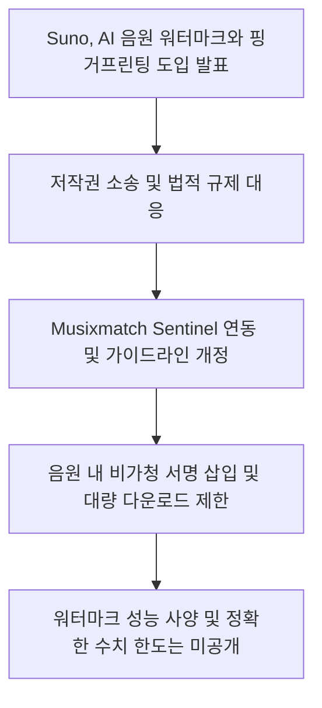
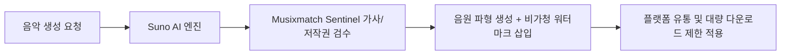
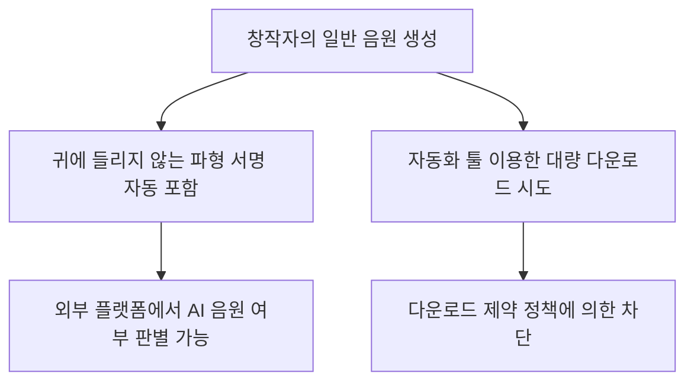

Suno의 발표는 생성 음원에 비가청 워터마크를 넣고, 별도의 핑거프린팅과 다운로드 제한, 가사 검수를 함께 운영하겠다는 내용입니다. <a href="#source-1" aria-label="Suno 출처">[1]</a> 이는 출처를 확인할 단서를 늘리지만, 모든 편집본을 반드시 탐지하거나 저작권 분쟁을 자동 해결한다는 뜻은 아닙니다. 창작자는 워터마크 여부와 별개로 사용한 가사, 음성의 권리, 배포 플랫폼 규정과 다운로드 한도를 확인해야 합니다.

## 무슨 일이 벌어진 걸까?

Suno CEO Mikey Shulman은 2026년 8월 6일, AI가 만든 음악 파형에 들리지 않도록 설계한 서명을 넣는 오디오 워터마크와 핑거프린팅 기술을 도입하겠다고 발표했습니다. <a href="#source-1" aria-label="Suno 출처">[1]</a> <a href="#source-2" aria-label="Gizmodo 출처">[2]</a> Suno는 제3자 플랫폼이 음원 파형을 분석해 자사에서 생성된 트랙인지 판별하는 데 쓸 수 있다고 설명했습니다. <a href="#source-1" aria-label="Suno 출처">[1]</a> <a href="#source-3" aria-label="TNW 출처">[3]</a> 발표에는 음질과 탐지 성능의 세부 검증값이 포함되지 않았으므로 “영향이 전혀 없다”거나 “항상 판별된다”고 확대하면 안 됩니다.

동시에 Suno는 스트리밍 서비스에 자동화 프로그램으로 음원을 무더기 업로드하는 행위를 방지하고자 대량 다운로드를 제한하는 새로운 다운로드 정책도 함께 내놓았습니다. <a href="#source-1" aria-label="Suno 출처">[1]</a> <a href="#source-2" aria-label="Gizmodo 출처">[2]</a> 또한 음악 가사 제공업체인 Musixmatch와 협력 관계를 맺고, 저작권이 있는 콘텐츠와 가사를 사전에 필터링하는 Sentinel 시스템을 통합하기로 결정했습니다. <a href="#source-1" aria-label="Suno 출처">[1]</a> <a href="#source-3" aria-label="TNW 출처">[3]</a> 커뮤니티 가이드라인 역시 업데이트되어 기만적인 음원 생성, 스캠, 조작된 참여, 허가받지 않은 목소리 복제 행위를 명확히 금지하게 됩니다. <a href="#source-1" aria-label="Suno 출처">[1]</a> <a href="#source-2" aria-label="Gizmodo 출처">[2]</a>

위 흐름도는 Suno 시스템 안에서 사용자 요청이 처리되고 출처 식별 서명과 필터링이 반영되는 전체 단계입니다.

<figure class="news-source-image">
  
  <figcaption>Suno가 원문과 함께 공개한 이미지입니다. <a href="https://suno.com/blog/building-the-future-of-music-responsibly" target="_blank" rel="noopener noreferrer">출처: Suno</a></figcaption>
</figure>

## 워터마크와 핑거프린팅은 무엇이 다를까?

워터마크는 생성 단계에서 음원에 식별 신호를 넣는 방식이고, 핑거프린팅은 음원의 특징을 기록해 나중에 비교하는 방식으로 이해할 수 있습니다. 두 방법을 함께 쓰면 원본 플랫폼과 유통본을 연결할 단서가 늘지만 서로 같은 역할은 아닙니다. 재인코딩, 잘라내기, 속도, 음정 변경, 다른 소리와의 혼합 뒤에도 신호나 특징이 얼마나 남는지가 실제 유효성을 결정합니다.

Suno가 이 조치를 강화한 배경에는 대형 음반사들이 제기한 법적 분쟁과 각국 사법부의 판결이 자리 잡고 있습니다. <a href="#source-2" aria-label="Gizmodo 출처">[2]</a> <a href="#source-3" aria-label="TNW 출처">[3]</a> 미국에서는 메이저 음반사들이 Suno를 상대로 저작권 침해 소송을 진행 중이며, 독일 법원에서는 Suno에 불리한 판결이 내려진 바 있다고 보도됐습니다. <a href="#source-2" aria-label="Gizmodo 출처">[2]</a> <a href="#source-3" aria-label="TNW 출처">[3]</a>

생성형 AI 음악의 유통이 늘면서 스트리밍 어뷰징과 저작권 논란도 커졌고, 출처 관리가 플랫폼 운영 과제로 떠올랐습니다. <a href="#source-3" aria-label="TNW 출처">[3]</a> Suno는 이번 조치를 책임성 강화 대책으로 발표했지만, 기술 도입이 진행 중인 소송의 주장이나 판결을 소급해 해결하는 것은 아닙니다. <a href="#source-1" aria-label="Suno 출처">[1]</a>

<figure class="news-source-image">
  
  <figcaption>Suno가 원문과 함께 공개한 이미지입니다. <a href="https://suno.com/blog/building-the-future-of-music-responsibly" target="_blank" rel="noopener noreferrer">출처: Suno</a></figcaption>
</figure>

## 창작자와 유통 플랫폼은 무엇을 따로 확인해야 할까?

Suno를 이용해 음악을 만드는 창작자에게 가장 직접적인 변화는 음원 식별과 다운로드 방식입니다. <a href="#source-1" aria-label="Suno 출처">[1]</a> 생성된 곡에는 사람이 듣기 어렵도록 설계된 서명이 포함되며, 외부 플랫폼은 지원되는 탐지 절차가 있을 때 이를 출처 단서로 활용할 수 있습니다. <a href="#source-1" aria-label="Suno 출처">[1]</a> <a href="#source-3" aria-label="TNW 출처">[3]</a>

반면 매크로나 자동화 프로그램을 이용해 곡을 대량으로 내려받은 뒤 외부 음원 플랫폼에 올리던 방식에는 제동이 걸립니다. <a href="#source-1" aria-label="Suno 출처">[1]</a> <a href="#source-2" aria-label="Gizmodo 출처">[2]</a> 또한 타인의 목소리를 무단 복제하거나 기만적인 스캠 음원을 만드는 행위는 개정된 규칙에 따라 엄격히 차단됩니다. <a href="#source-1" aria-label="Suno 출처">[1]</a> <a href="#source-2" aria-label="Gizmodo 출처">[2]</a>

워터마크가 검출된다는 사실은 그 곡이 Suno에서 생성됐다는 주장에 도움을 줄 수 있지만, 누가 저작권을 갖는지나 입력 자료가 적법했는지를 결정하지는 않습니다. 반대로 워터마크가 검출되지 않았다고 해서 사람이 만든 곡이라는 결론도 성급합니다. 탐지 도구를 운영하는 플랫폼은 오탐과 미탐이 발생했을 때 재검토와 이의 제기 경로를 마련해야 하며, 창작자는 생성 기록과 편집 과정, 권리 허가 자료를 따로 보관하는 편이 좋습니다.

이 다이어그램은 창작자가 음원을 생성하거나 다운로드할 때 시스템 내부에서 일어나는 작동 방식입니다.

## 음원을 배포하기 전 어떤 기록과 검수가 필요할까?

Suno를 활용할 때 사용자가 유의 깊게 살펴봐야 할 지점은 가사 입력 및 음원 추출 과정입니다. <a href="#source-1" aria-label="Suno 출처">[1]</a> Musixmatch Sentinel 시스템이 내장되면서 저작권이 있는 유명 가사나 상표권 요소가 포함된 프롬프트에 대한 사전 필터링이 강화됩니다. <a href="#source-1" aria-label="Suno 출처">[1]</a> <a href="#source-3" aria-label="TNW 출처">[3]</a>

또한 특정 보컬의 음색을 무단으로 모방하려는 시도나 기만적인 음원 등록은 이용약관 위반으로 제재를 받을 수 있습니다. <a href="#source-1" aria-label="Suno 출처">[1]</a> <a href="#source-2" aria-label="Gizmodo 출처">[2]</a> 음원 유통을 염두에 두고 있다면 대량 다운로드 제한 수치가 개인 작업량에 영향을 주는지 사전 확인이 필요합니다. <a href="#source-1" aria-label="Suno 출처">[1]</a>

배포 전에는 원본 생성 파일과 후편집본을 구분해 보관하고, 압축이나 마스터링 뒤 음질이 달라지지 않았는지 직접 들어봐야 합니다. 사용한 가사와 음성의 허가 범위, 유통사의 AI 음악 표시 규정도 확인해야 합니다. 여러 곡을 정상적으로 관리하는 사용자도 정확한 다운로드 한도가 공개되지 않은 상태에서는 자동화 파이프라인을 고정하기보다 계정에 표시되는 정책과 오류 처리 절차를 먼저 점검하는 편이 안전합니다.

탐지 성능을 검증하려는 플랫폼이라면 원본만 시험해서는 충분하지 않습니다. 배포 과정에서 흔히 생기는 압축, 음량 조정, 짧은 구간 사용과 다른 트랙 혼합본을 나눠 검사하고, Suno가 아닌 음원도 같은 조건으로 넣어야 오탐을 볼 수 있습니다. 탐지 결과가 수익 차단이나 계정 제재로 이어진다면 단일 자동 판정만 쓰기보다 원본 파일과 생성 기록을 검토할 사람이 필요합니다.

창작자에게 다운로드 제한은 권리 판정과도 별개입니다. 정상적인 프로젝트라도 백업이나 여러 버전 납품 때문에 다운로드 횟수가 늘 수 있으므로, 제한에 걸렸을 때 파일을 잃지 않도록 승인된 내보내기와 로컬 보관 절차를 마련해야 합니다. 반대로 제한 안에서 내려받았다는 사실이 음원을 자유롭게 상업 유통할 권리를 보장하지는 않으므로 이용약관과 배포처의 정책을 따로 확인해야 합니다.

플랫폼이 출처 표시를 사용자에게 보여 줄 계획인지, 탐지 기능을 파트너에게만 제공하는지도 확인할 사항입니다. 검출 기술이 있어도 결과를 누가 어떤 절차로 사용하는지에 따라 투명성 효과는 달라집니다.

## 아직은 선을 그어야 할 부분

Suno가 발표한 오디오 워터마크 시스템의 세부 기술 사양이나 검증 성능 수치는 공개되지 않았습니다. <a href="#source-1" aria-label="Suno 출처">[1]</a> 음원을 재가공하거나 인코딩을 변경했을 때 워터마크가 어느 정도 유지되는지, 오탐과 미탐이 어느 수준인지도 이 근거만으로는 알 수 없습니다.

아울러 새로 적용되는 다운로드 정책에서 요금제별 정확한 다운로드 제한 건수나 구체적인 제한 수치 조건 역시 명시되지 않은 상태입니다. <a href="#source-1" aria-label="Suno 출처">[1]</a> 또한 이번 워터마크 도입 조치가 미국 주요 음반사들과 진행 중인 저작권 침해 소송의 법적 결과를 즉각 바꿔주는 것은 아니라는 점을 염두에 두어야 합니다. <a href="#source-2" aria-label="Gizmodo 출처">[2]</a> <a href="#source-3" aria-label="TNW 출처">[3]</a>

<!-- primary-sources:start -->
## 원문과 버전 확인

- [발표 원문](https://suno.com/blog/building-the-future-of-music-responsibly)
- [Gizmodo](https://gizmodo.com/ai-music-startup-suno-is-adding-a-watermark-to-songs-as-legal-troubles-pile-up-2000639900)
- [TNW](https://thenextweb.com/news/suno-ai-music-watermark-fingerprinting-lawsuits)
<!-- primary-sources:end -->

<!-- internal-links:start -->
## 함께 읽으면 이해가 이어지는 글

- [긴 영상 배경음악이 장면 감정을 놓칠 때: NarraScore의 이중 제어]() — NarraScore가 영상의 전역 분위기와 시점별 Valence-Arousal 곡선을 나눠 음악 생성에 주입하는 방식, 평가 기준과 감정 단순화 한계를 다룹니다.
- [이미지, 오디오를 모두 다음 토큰으로 만들면 더 단순할까? LongCat-Next의 비용]() — DiNA와 dNaViT가 텍스트, 이미지, 오디오를 이산 토큰으로 통합하는 방식, 단일 목적 함수의 이점과 시퀀스, KV 캐시 비용 및 검증법을 살펴봅니다.
- [OpenAI와 Anthropic 등 AI 연구자 1,100명 속도 조절 공개 서한 'Pacing the Frontier' 발표]() — 2026년 7월 28일, OpenAI, Anthropic, Google DeepMind, Meta 등 주요 AI 기업 연구자 1,100여 명이 AI 개발 속도를 제어하기 위한 정부 지원을 요청하는 공개 서한 'Pacing the…
<!-- internal-links:end -->

## 자주 묻는 질문

### Suno가 도입하는 워터마크를 적용하면 음악 음질이 저하되나요?

Suno는 음원 파형에 사람이 듣기 어려운 서명을 넣는 방식이라고 설명했습니다. 다만 청취 시험과 압축, 편집 뒤 탐지 성능의 세부 수치는 공개되지 않았으므로, 모든 환경에서 음질 변화가 전혀 없다고 단정하기보다 원본과 배포본을 비교해야 합니다.

### Suno에서 다운로드할 수 있는 곡 수가 제한되나요?

대량 다운로드를 방지하는 새로운 정책이 도입됩니다. 자동화 프로그램을 통한 무단 대량 유통을 막기 위한 목적이며, 요금제별 정확한 다운로드 수치 한도는 아직 공개되지 않았습니다.

### 저작권 있는 가사나 음성을 Suno에 입력하면 어떻게 되나요?

Suno는 Musixmatch Sentinel 연동과 개정된 가이드라인을 통해 가사 검수와 정책 집행을 강화한다고 밝혔습니다. 허가받지 않은 보컬 복제와 저작권 침해 가사, 스캠 음원은 금지 대상이지만 자동 필터가 권리 판단을 대신하지는 않습니다.

## 직접 확인한 원문

<ol class="checked-source-list">
  <li id="source-1"><a href="https://suno.com/blog/building-the-future-of-music-responsibly" target="_blank" rel="noopener noreferrer">Suno — How We&#x27;re Building the Future of Music Responsibly</a> (2026-08-06)</li>
  <li id="source-2"><a href="https://gizmodo.com/ai-music-startup-suno-is-adding-a-watermark-to-songs-as-legal-troubles-pile-up-2000639900" target="_blank" rel="noopener noreferrer">Gizmodo — AI Music Startup Suno Is Adding a Watermark to Songs as Legal Troubles Pile Up</a> (2026-08-06)</li>
  <li id="source-3"><a href="https://thenextweb.com/news/suno-ai-music-watermark-fingerprinting-lawsuits" target="_blank" rel="noopener noreferrer">TNW — Suno made AI music a firehose. Now, facing lawsuits, it wants to watermark the flood</a> (2026-08-07)</li>
</ol>

> 이 글은 위 원문을 직접 확인해 작성했습니다. 가격, 기능 범위, 지역별 제공 여부는 게시 후 바뀔 수 있으니 실제 도입 전 공식 문서를 다시 확인하세요.
