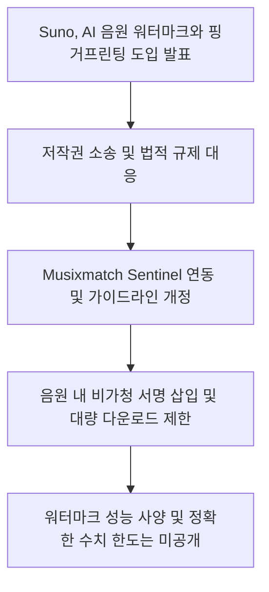
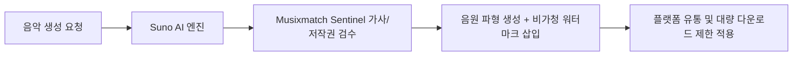
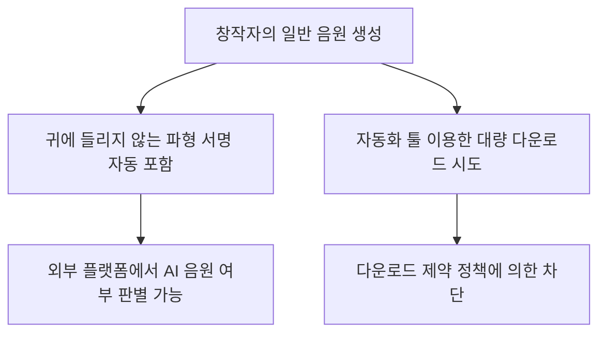

Suno가 AI 생성 음원의 무단 유통을 막고 출처를 투명하게 밝히기 위해 오디오 워터마크 기술을 도입합니다. <a href="#source-1" aria-label="Suno 출처">[1]</a> 이번 변화로 외부 플랫폼에서도 Suno로 만들어진 곡을 즉시 알아볼 수 있게 됩니다. <a href="#source-3" aria-label="TNW 출처">[3]</a>

## 무슨 일이 벌어진 걸까?

Suno CEO Mikey Shulman은 2026년 8월 6일, AI가 만든 음악 파형에 들리지 않는 서명을 넣는 오디오 워터마크와 핑거프린팅 기술을 도입하겠다고 발표했습니다. <a href="#source-1" aria-label="Suno 출처">[1]</a> <a href="#source-2" aria-label="Gizmodo 출처">[2]</a> 이 기술은 사람이 귀로 들었을 때는 음악 소리에 아무런 영향을 주지 않지만, 제3자 플랫폼이 음원 파형을 분석하면 Suno에서 생성된 트랙임을 판별할 수 있게 해줍니다. <a href="#source-1" aria-label="Suno 출처">[1]</a> <a href="#source-3" aria-label="TNW 출처">[3]</a>

동시에 Suno는 스트리밍 서비스에 자동화 프로그램으로 음원을 무더기 업로드하는 행위를 방지하고자 대량 다운로드를 제한하는 새로운 다운로드 정책도 함께 내놓았습니다. <a href="#source-1" aria-label="Suno 출처">[1]</a> <a href="#source-2" aria-label="Gizmodo 출처">[2]</a> 또한 음악 가사 제공업체인 Musixmatch와 협력 관계를 맺고, 저작권이 있는 콘텐츠와 가사를 사전에 필터링하는 Sentinel 시스템을 통합하기로 결정했습니다. <a href="#source-1" aria-label="Suno 출처">[1]</a> <a href="#source-3" aria-label="TNW 출처">[3]</a> 커뮤니티 가이드라인 역시 업데이트되어 기만적인 음원 생성, 스캠, 조작된 참여, 허가받지 않은 목소리 복제 행위를 명확히 금지하게 됩니다. <a href="#source-1" aria-label="Suno 출처">[1]</a> <a href="#source-2" aria-label="Gizmodo 출처">[2]</a>

위 흐름도는 Suno 시스템 안에서 사용자 요청이 처리되고 출처 식별 서명과 필터링이 반영되는 전체 단계입니다.

<figure class="news-source-image">
  
  <figcaption>Suno가 원문과 함께 공개한 이미지입니다. <a href="https://suno.com/blog/building-the-future-of-music-responsibly" target="_blank" rel="noopener noreferrer">출처: Suno</a></figcaption>
</figure>

## 왜 지금 다들 이 이야기를 할까?

Suno가 음원 보호 조치를 강화한 배경에는 대형 음반사들이 제기한 법적 분쟁과 각국 사법부의 판결이 자리 잡고 있습니다. <a href="#source-2" aria-label="Gizmodo 출처">[2]</a> <a href="#source-3" aria-label="TNW 출처">[3]</a> 미국에서는 메이저 음반사들이 Suno를 상대로 대규모 저작권 침해 소송을 진행 중이며, 독일 법원에서는 이미 Suno에 불리한 판결이 내려진 바 있습니다. <a href="#source-2" aria-label="Gizmodo 출처">[2]</a> <a href="#source-3" aria-label="TNW 출처">[3]</a>

생성형 AI 음악이 폭발적으로 늘어나면서 스트리밍 플랫폼 내 어뷰징과 저작권 침해 논란이 거세졌고, 이로 인해 책임 있는 출처 관리 시스템 마련이 사법적과 상업적으로 피할 수 없는 과제가 되었습니다. <a href="#source-3" aria-label="TNW 출처">[3]</a> Suno 입장에서는 플랫폼의 지속 가능성을 확보하고 법적 리스크를 줄이기 위해 이번 종합 대응책을 발표한 것입니다. <a href="#source-1" aria-label="Suno 출처">[1]</a>

<figure class="news-source-image">
  
  <figcaption>Suno가 원문과 함께 공개한 이미지입니다. <a href="https://suno.com/blog/building-the-future-of-music-responsibly" target="_blank" rel="noopener noreferrer">출처: Suno</a></figcaption>
</figure>

## 그래서 우리에게 뭐가 달라질까?

Suno를 이용해 음악을 만드는 창작자 입장에서 가장 먼저 체감할 변화는 음원 유통과 다운로드 방식입니다. <a href="#source-1" aria-label="Suno 출처">[1]</a> 생성된 곡에는 청각적으로 감지되지 않는 비가청 서명이 파형 자체에 기록되므로, 음악을 청취하는 일반 듣는 사람에게는 소리의 차이가 없습니다. <a href="#source-1" aria-label="Suno 출처">[1]</a> <a href="#source-3" aria-label="TNW 출처">[3]</a>

반면 매크로나 자동화 프로그램을 이용해 곡을 대량으로 내려받은 뒤 외부 음원 플랫폼에 올리던 방식에는 제동이 걸립니다. <a href="#source-1" aria-label="Suno 출처">[1]</a> <a href="#source-2" aria-label="Gizmodo 출처">[2]</a> 또한 타인의 목소리를 무단 복제하거나 기만적인 스캠 음원을 만드는 행위는 개정된 규칙에 따라 엄격히 차단됩니다. <a href="#source-1" aria-label="Suno 출처">[1]</a> <a href="#source-2" aria-label="Gizmodo 출처">[2]</a>

이 다이어그램은 창작자가 음원을 생성하거나 다운로드할 때 시스템 내부에서 일어나는 작동 방식입니다.

## 직접 써보거나 지켜볼 포인트

Suno를 활용할 때 사용자가 유의 깊게 살펴봐야 할 지점은 가사 입력 및 음원 추출 과정입니다. <a href="#source-1" aria-label="Suno 출처">[1]</a> Musixmatch Sentinel 시스템이 내장되면서 저작권이 있는 유명 가사나 상표권 요소가 포함된 프롬프트에 대한 사전 필터링이 강화됩니다. <a href="#source-1" aria-label="Suno 출처">[1]</a> <a href="#source-3" aria-label="TNW 출처">[3]</a>

또한 특정 보컬의 음색을 무단으로 모방하려는 시도나 기만적인 음원 등록은 이용약관 위반으로 제재를 받을 수 있습니다. <a href="#source-1" aria-label="Suno 출처">[1]</a> <a href="#source-2" aria-label="Gizmodo 출처">[2]</a> 음원 유통을 염두에 두고 있다면 대량 다운로드 제한 수치가 개인 작업량에 영향을 주는지 사전 확인이 필요합니다. <a href="#source-1" aria-label="Suno 출처">[1]</a>

## 아직은 선을 그어야 할 부분

Suno가 발표한 오디오 워터마크 시스템의 세부 기술 사양이나 정밀한 검증 성능 수치는 아직 공개되지 않았습니다. <a href="#source-1" aria-label="Suno 출처">[1]</a> 음원을 재가공하거나 인코딩을 변경했을 때 워터마크가 어느 정도까지 유지되는지에 대한 구체적인 벤치마크 결과도 현재로서는 알 수 없습니다.

아울러 새로 적용되는 다운로드 정책에서 요금제별 정확한 다운로드 제한 건수나 구체적인 제한 수치 조건 역시 명시되지 않은 상태입니다. <a href="#source-1" aria-label="Suno 출처">[1]</a> 또한 이번 워터마크 도입 조치가 미국 주요 음반사들과 진행 중인 저작권 침해 소송의 법적 결과를 즉각 바꿔주는 것은 아니라는 점을 염두에 두어야 합니다. <a href="#source-2" aria-label="Gizmodo 출처">[2]</a> <a href="#source-3" aria-label="TNW 출처">[3]</a>

## 자주 묻는 질문

### Suno가 도입하는 워터마크를 적용하면 음악 음질이 저하되나요?

음질 저하는 발생하지 않습니다. Suno가 발표한 오디오 워터마크는 음원 파형에 들리지 않는 서명을 넣는 방식이므로 사람이 청취할 때는 소리의 변화를 느낄 수 없습니다.

### Suno에서 다운로드할 수 있는 곡 수가 제한되나요?

대량 다운로드를 방지하는 새로운 정책이 도입됩니다. 자동화 프로그램을 통한 무단 대량 유통을 막기 위한 목적이며, 요금제별 정확한 다운로드 수치 한도는 아직 공개되지 않았습니다.

### 저작권 있는 가사나 음성을 Suno에 입력하면 어떻게 되나요?

Musixmatch Sentinel 시스템과 개정된 가이드라인에 의해 사전 필터링 및 제재를 받습니다. 허가받지 않은 보컬 복제나 저작권 침해 가사 사용, 스캠 음원 생성은 엄격히 금지됩니다.

## 직접 확인한 원문

<ol class="checked-source-list">
  <li id="source-1"><a href="https://suno.com/blog/building-the-future-of-music-responsibly" target="_blank" rel="noopener noreferrer">Suno — How We&#x27;re Building the Future of Music Responsibly</a> (2026-08-06)</li>
  <li id="source-2"><a href="https://gizmodo.com/ai-music-startup-suno-is-adding-a-watermark-to-songs-as-legal-troubles-pile-up-2000639900" target="_blank" rel="noopener noreferrer">Gizmodo — AI Music Startup Suno Is Adding a Watermark to Songs as Legal Troubles Pile Up</a> (2026-08-06)</li>
  <li id="source-3"><a href="https://thenextweb.com/news/suno-ai-music-watermark-fingerprinting-lawsuits" target="_blank" rel="noopener noreferrer">TNW — Suno made AI music a firehose. Now, facing lawsuits, it wants to watermark the flood</a> (2026-08-07)</li>
</ol>

> 이 글은 위 원문을 직접 확인해 작성했습니다. 가격, 기능 범위, 지역별 제공 여부는 게시 후 바뀔 수 있으니 실제 도입 전 공식 문서를 다시 확인하세요.
