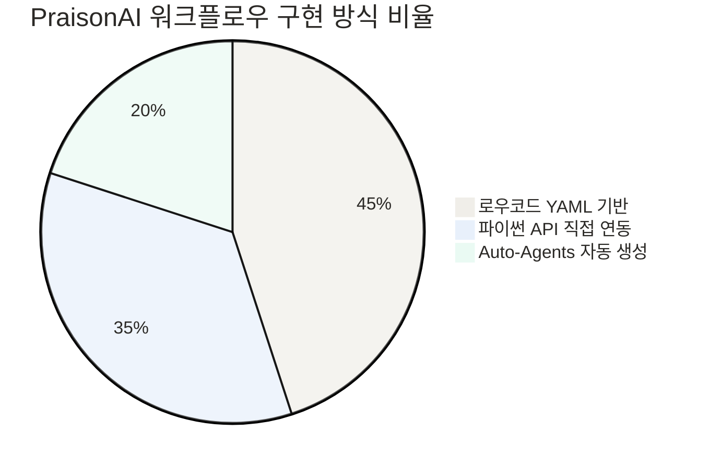
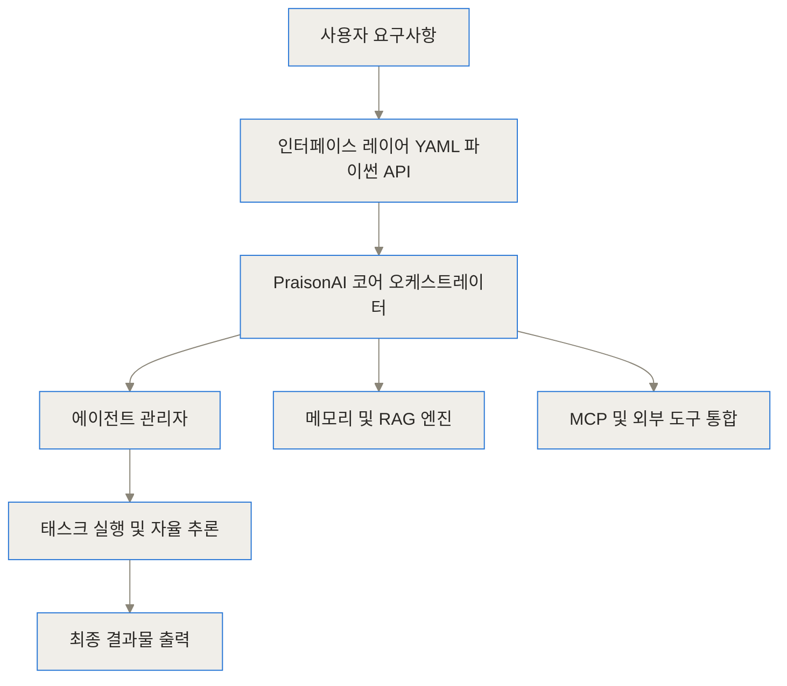
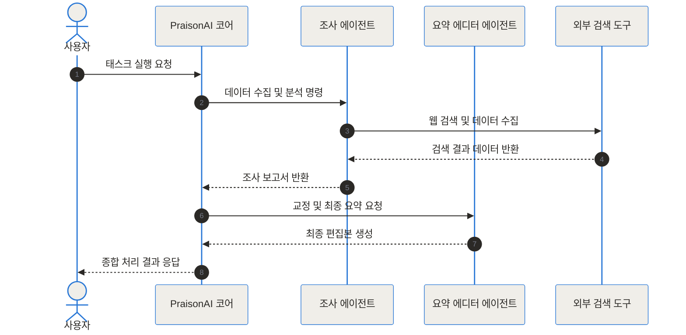
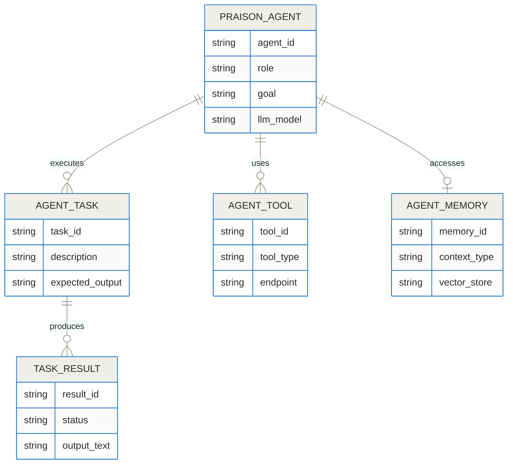
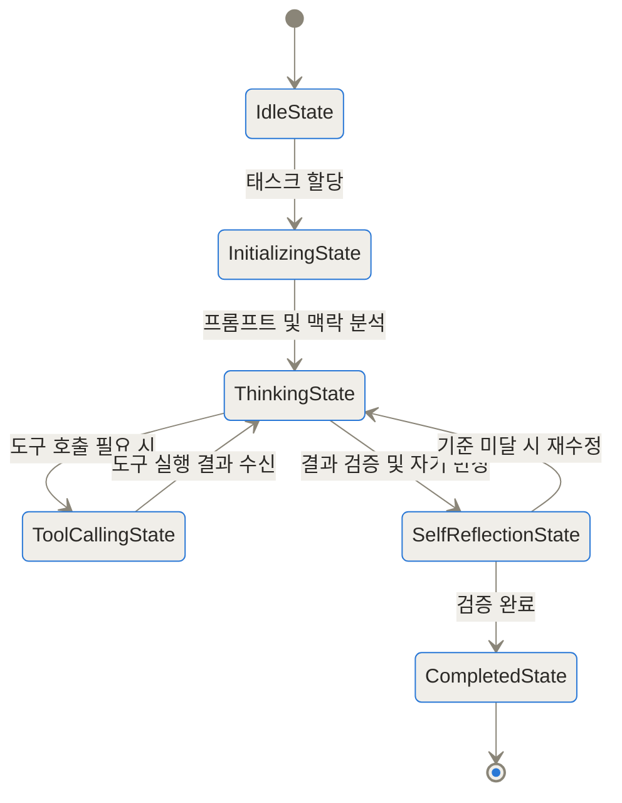
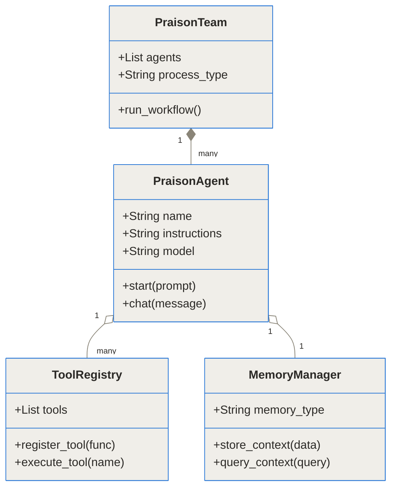
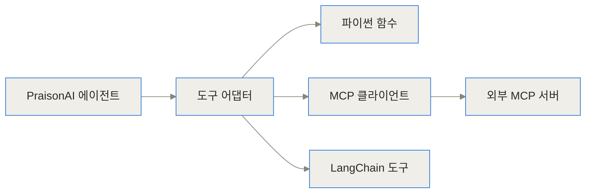

[PraisonAI GitHub 저장소](https://github.com/MervinPraison/PraisonAI)
[PraisonAI 공식 문서](https://docs.praison.ai)

## 빠른 요약 (TL;DR)

- PraisonAI는 로우코드 YAML 설정 파일이나 단 몇 줄의 파이썬 코드만으로 다중 AI 에이전트(Multi-Agent) 팀을 구성하고 제어하는 프레임워크입니다.
- CrewAI, AG2(구 AutoGen) 등 기존 프레임워크의 이점을 통합하고 100개 이상의 LLM, RAG, 메모리, MCP(Model Context Protocol) 지원을 상동형 인터페이스로 제공합니다.
- 자율형 에이전트 생성(Auto-Agents) 기능을 갖추어 목표 명세만으로 에이전트 팀과 실행 파이프라인을 자동 설계해 줍니다.

## 멀티 AI 에이전트 개발은 왜 복잡하고 어려울까

최근 생성형 AI 기술이 발전하면서 단일 대형 언어 모델(LLM)에 거대한 프롬프트를 입력해 모든 문제를 한 번에 해결하려는 방식은 한계에 부딪히고 있습니다. 하나의 프롬프트에 시장 조사, 데이터 분석, 코드 작성, 검수 지침까지 모두 집어넣으면 컨텍스트 윈도우(Context Window, 모델이 한 번에 처리하는 기억 용량)가 급격히 소모될 뿐만 아니라 모델의 환각(Hallucination) 현상이 증가하기 때문이죠.

이를 해결하기 위해 등장한 개념이 바로 에이전틱 아키텍처(Agentic Architecture)입니다. 복잡한 문제를 여러 개의 작은 임무로 나누고, 각 임무에 특화된 프롬프트와 도구를 가진 전문 에이전트들이 상호작용하게 만드는 방식이에요. 하지만 기존 프레임워크를 사용해 멀티 에이전트 시스템을 구축하려면 다음과 같은 페인 포인트가 존재했습니다.

- 복잡한 보일러플레이트 코드: 에이전트 하나를 선언하고 도구를 연결하기 위해 수십 줄의 초기화 코드가 필요했습니다.
- 프레임워크 파편화: 프로젝트마다 CrewAI, AutoGen, LangChain 등을 개별적으로 학습하고 구조를 맞춰야 하는 번거로움이 있었습니다.
- 유연성 부족: 에이전트의 역할이나 실행 파이프라인을 수정할 때 전체 파이프라인 코드를 재작성해야 했습니다.
- 외부 확장성 한계: 표준화된 도구 프로토콜 연결이 까다로워 custom wrapper 함수를 수없이 작성해야 했습니다.

PraisonAI는 이러한 보일러플레이트 코드와 복잡성을 제거하고, 개발자와 기획자 모두가 직관적으로 오케스트레이션을 다룰 수 있도록 만들어진 프레임워크입니다.


## PraisonAI란 무엇인가: 로우코드 중심의 에이전트 프레임워크

PraisonAI는 영화 제작 현장의 '프로덕션 팀'에 비유할 수 있습니다. 훌륭한 영화를 만들기 위해서는 감독, 시나리오 작가, 촬영 감독, 편집자가 각자의 명확한 역할과 지침을 갖고 협업해야 하듯, PraisonAI는 전문화된 LLM 에이전트들이 하나의 공동 목표를 향해 순차적 또는 병렬로 일하도록 지시하고 조율하는 총괄 연출자 역할을 맡습니다.

PraisonAI의 가장 큰 특징은 로우코드(Low-Code) 및 노코드(No-Code) 친화적 설계입니다. 파이썬 코드를 한 줄도 작성하지 않고도 `agents.yaml`이라는 설정 파일 하나만으로 여러 에이전트의 역할(Role), 목표(Goal), 백스토리(Backstory), 사용할 도구(Tools) 및 모델 종류를 정의할 수 있습니다.

동시에 개발자들을 위한 경량 파이썬 패키지(`praisonagents`)도 제공하므로, 수반되는 로직을 스크립트 수준으로 아주 간단하게 구현할 수 있죠.



## PraisonAI는 어떻게 작동하나: 내부 아키텍처와 오케스트레이션

PraisonAI의 내부 아키텍처는 레이어드 모듈 구조로 설계되어 있어, 요구사항에 맞춰 자유롭게 부품을 교체하거나 확장할 수 있습니다.



### 시스템 계층 및 핵심 구성 요소

1. 인터페이스 레이어: YAML 설정 파일, 파이썬 API, CLI 커맨드를 통해 사용자의 입력을 받고 구조화된 객체로 변환합니다.
2. 코어 오케스트레이터 Engine: 에이전트 간의 순차(Sequential), 계층적(Hierarchical), 병렬(Parallel) 태스크 흐름을 결정하고 실행 스케줄링을 관리합니다.
3. 에이전트 관리자: LLM 프로바이드 통신, 프롬프트 주입, 자기 반성(Self-Reflection) 메커니즘을 관장합니다.
4. 메모리 및 RAG 엔진: 단기 대화 기억(Short-term memory), 장기 스토리지(Long-term memory), 벡터 DB를 통한 외부 문서 검색(RAG)을 에이전트에 공급합니다.
5. 도구 어댑터: 커스텀 파이썬 함수, LangChain 도구, CrewAI 도구, 그리고 MCP(Model Context Protocol) 클라이언트를 연결합니다.

### 멀티 에이전트 협업 및 상호작용 흐름

에이전트 간에 작업이 전동되는 과정을 시퀀스 다이어그램으로 나타내면 다음과 같습니다. 조사 에이전트가 수집한 데이터가 요약 에이전트로 전달되며 검증을 거치는 흐름입니다.



### 엔티티 데이터 모델 및 스키마 관계

PraisonAI 내부에서 다루는 주요 엔티티들의 구조와 관계를 정리한 데이터 모델입니다. 각 에이전트는 독립적인 모델 지침, 메모리 영역, 사용할 도구 목록을 참조합니다.



### 에이전트 생명주기와 자기 반성(Self-Reflection)

PraisonAI의 에이전트는 무조건 일방향으로만 답을 내놓지 않습니다. 답변을 생성한 후 스스로 결과물이 목표 지침에 부합하는지 평가하는 자기 반성(Self-Reflection) 상태를 거칩니다.



### 파이썬 코어 모듈 클래스 구조

개발자가 코드 레벨에서 조작하게 되는 객체들의 연관성 구조입니다.



### 도구 및 MCP(Model Context Protocol) 확장 방식

PraisonAI는 표준 함수 연동부터 외부 MCP 서버까지 폭넓은 도구 생태계를 수용합니다.



## PraisonAI 어떻게 설치하고 사용하나

PraisonAI는 의존성이 가볍고 설치가 간단합니다. 개발 환경에 따라 전체 패키지 또는 초경량 에이전트 패키지 중 선택할 수 있습니다.

### 패키지 설치

```bash
# 일반 에이전트 실행 전용 경량 패키지
pip install praisonagents

# 오토 에이전트 및 CLI 포함 전체 프레임워크 패키지
pip install praisonai
```

### 방법 1: YAML 기반 로우코드 설정 (`agents.yaml`)

파이썬 코딩 없이 설정 파일 하나로 멀티 에이전트 팀을 구성하는 예시입니다.

```yaml
framework: crewai
topic: AI 오케스트레이션 동향 분석
roles:
  researcher:
    role: IT 기술 리서처
    goal: {topic}에 대한 최근 동향 조사
    backstory: 당신은 기술 동향을 정확하게 수집하는 분석가입니다.
    tasks:
      task_research:
        description: 최신 기술 트렌드 3가지를 정리하세요.
        expected_output: 주요 트렌드 요약 리포트
  writer:
    role: 테크 에디터
    goal: 리서처의 자료를 바탕으로 블로그 글 작성
    backstory: 당신은 복잡한 IT 기술을 알기 쉽게 풀어쓰는 에디터입니다.
    tasks:
      task_write:
        description: 조사된 리포트를 바탕으로 1000자 분량의 아티클을 작성하세요.
        expected_output: 완성된 마크다운 아티클
```

이후 터미널에서 다음 명령어 한 줄만 실행하면 전체 멀티 에이전트 시스템이 가동됩니다.

```bash
export OPENAI_API_KEY="your-api-key"
praisonai agents.yaml
```

### 방법 2: 파이썬 API를 활용한 직접 구현

개발자는 파이썬 스크립트에서 더 직관적으로 에이전트와 도구를 정의할 수 있습니다.

```python
from praisonagents import Agent, praisonAgents

# 1. 전문 에이전트 정의
researcher = Agent(
    name="IT 리서처",
    instructions="AI 에이전트 프레임워크 트렌드를 수집하고 핵심을 정리하세요.",
    llm="gpt-4o"
)

writer = Agent(
    name="테크 에디터",
    instructions="수집된 조사 내용을 바탕으로 대중이 이해하기 쉬운 기술 블로그 글을 작성하세요.",
    llm="gpt-4o"
)

# 2. 에이전트 팀 오케스트레이션 실행
agents = praisonAgents(
    agents=[researcher, writer],
    process="sequential"
)

agents.start()
```

```chartjs
{"type":"bar","data":{"labels":["기존 프레임워크 구축 코드","PraisonAI YAML 설정","PraisonAI Python 단축 코드"],"datasets":[{"label":"필요 코드 줄 수","data":[130,12,5]}]},"options":{"responsive":true}}
```


## 실전 활용 시나리오: 현업 업무 자동화 파이프라인 구축

PraisonAI가 현업에서 실제 문제를 해결하는 대표적인 시나리오 3가지를 살펴보겠습니다.

### 시나리오 1: 심층 기술 조사 및 보고서 자동 작성 파이프라인

기업의 R&D 팀이나 마케팅 팀에서는 매주 수많은 기술 자료와 시장 동향을 파악해야 합니다. PraisonAI를 활용해 웹 스크래핑 도구가 연결된 리서처 에이전트, 논리적 타당성을 검증하는 아키텍트 에이전트, 최종 보고서를 스타일 가이드에 맞춰 다듬는 에디터 에이전트로 구성된 파이프라인을 구축할 수 있습니다. 3단계 순차 오케스트레이션을 통해 사람이 4시간 이상 걸리던 조사 및 작성 업무를 수 분 내에 자동화할 수 있습니다.

### 시나리오 2: Automated Code Review 및 Pytest 생성 파이프라인

소프트웨어 개발 프로세스에서 개발자가 Pull Request를 올리면 PraisonAI 코드 분석 에이전트가 코드 품질, 보안 취약점, 정적 분석 결과를 검토합니다. 이후 테스트 생성 에이전트가 예외 케이스를 포함한 `pytest` 유닛 테스트 코드를 자동으로 생성하고, 최종적으로 리팩토링 제안서를 PR 댓글 형식으로 생성해 냅니다.

### 시나리오 3: RAG 기반 매뉴얼 자동 응답 지원 에이전트

고객 지원 센터에서는 제품 매뉴얼 기반의 정확한 안내가 필수적입니다. PraisonAI의 RAG 기능과 메모리 시스템을 이용하면 외부 VectorDB에 보관된 내부 문서를 실시간 검색하고, 사용자의 의도를 분석해 답변을 구성하는 CS 자율 에이전트를 손쉽게 만들 수 있습니다.

## PraisonAI와 기존 프레임워크는 무엇이 다른가

기존에 널리 알려진 주요 멀티 에이전트 프레임워크들과 비교한 특성은 다음과 같습니다.

| 비교 항목 | PraisonAI | CrewAI | AG2 (구 AutoGen) | LangGraph |
| --- | --- | --- | --- | --- |
| 진입 장벽 | 매우 낮음 (YAML 및 5줄 코드) | 보통 (파이썬 코드 중심) | 보통 ~ 높음 | 높음 (그래프 제어 구조) |
| 주요 접근 방식 | 로우코드 YAML / 단축 Python | 파이썬 클래스 기반 | 대화형 파이썬 스크립트 | 명시적 상태 그래프 모델 |
| Auto-Agents 지원 | 지원 (목표 설정 시 에이전트 자동 생성) | 미지원 | 부분 지원 | 미지원 |
| MCP 연동 | 공식 지원 (Server/Client) | 서드파티 패키지 필요 | 서드파티 패키지 필요 | 커스텀 구현 필요 |
| LLM 지원 범위 | 100+ 제공자 (Ollama, DeepSeek 등) | 다양한 상용 LLM 지원 | 다양한 상용 LLM 지원 | LangChain 기반 대다수 지원 |
| 상태 추적 디버깅 | 시각적 CLI 및 툴 연동 | 로깅 지원 | 커스텀 로깅 | LangSmith 강력 지원 |

```chartjs
{"type":"line","data":{"labels":["1개 에이전트","3개 에이전트","5개 에이전트","10개 에이전트"],"datasets":[{"label":"복합 태스크 처리 성공률 (%)","data":[62,81,93,96]}]},"options":{"responsive":true}}
```

## PraisonAI 도입 시 고려해야 할 한계와 대안

PraisonAI가 멀티 에이전트 구축 속도를 높여주는 효율적인 도구임은 분명하지만, 모든 프로젝트에 완벽하게 부합하는 것은 아닙니다. 도입 전 다음과 같은 한계점을 명확히 알아두어야 합니다.

### 복잡한 순환 그래프 트랜지션의 제한

PraisonAI는 순차적(Sequential), 계층적(Hierarchical) 오케스트레이션을 매우 단순하게 구성하도록 최적화되어 있습니다. 하지만 복잡한 조건 분기, 조건부 루프 반복, 섬세한 체크포인트 상태 복원이 핵심인 정밀한 백엔드 시스템 개발 시에는 LangGraph처럼 명시적으로 그래프 노드와 엣지를 제어하는 프레임워크가 더 적합할 수 있습니다.

### 디버깅 가시성의 제약

로우코드 설정 방식은 초기 구축 속도를 극대화하지만, 에이전트 간 주고받는 프롬프트나 프레임워크 내부 실행 흐름을 깊숙이 트레이싱하고 제어해야 할 때는 추상화 레이어가 장애물로 작용할 수 있습니다. 시스템이 복잡해질수록 상세한 로그 출력 모드(`verbose=True`)를 적극적으로 활용해야 합니다.

### 한계와 대응 방안 요약

| 직면할 수 있는 문제 | 원인 | 대응 및 개선 방안 |
| --- | --- | --- |
| 에이전트 간 무한 루프 발생 | 자율 반성 기준 미달 시 반복 재시도 | 에이전트 max_iter 제한 값 설정 |
| 프롬프트 컨텍스트 오버플로우 | 다수의 에이전트 대화 누적 | 메모리 압축 및 RAG 모듈 활성화 |
| 외부 도구 호출 오류 | 도구 스키마 정의 불일치 | Pydantic 기반 정밀 데이터 검증 도구 활용 |

## 결론: 지속적인 자율 에이전트 생태계의 미래

AI 개발 트렌드는 단일 프롬프트 작성에서 에이전틱 오케스트레이션으로 빠르게 이동하고 있습니다. PraisonAI는 이러한 변화의 진입 장벽을 낮추어 기획자, 데이터 분석가, 현업 개발자 누구나 실용적인 AI 에이전트 팀을 운용할 수 있도록 돕습니다.

특히 100개 이상의 다양한 LLM을 자유롭게 조합하고, MCP 도구 프로토콜을 즉시 사용할 수 있다는 점은 복잡한 기업용 자동화 파이프라인 구축 시 큰 이점을 제공합니다. 프로젝트 요구사항의 복잡도와 제어 수준을 잘 측정하여 PraisonAI를 적재적소에 도입한다면 빠른 프로토타이핑과 실용적인 업무 자동화를 달성할 수 있을 것입니다.

## 자주 묻는 질문 (FAQ)

### PraisonAI는 기존 CrewAI나 AutoGen과 어떻게 다른가요?

PraisonAI는 CrewAI 및 AG2(구 AutoGen)의 장점을 통합하고, 로우코드 YAML 설정과 파이썬 단축 API를 동시에 제공하는 오케스트레이션 프레임워크입니다. 복잡한 초기화 코드를 작성하지 않고도 빠르게 에이전트 팀을 구성할 수 있어 프로토타이핑 및 배포 속도가 뛰어납니다.

### PraisonAI를 사용하려면 파이썬 프로그래밍을 깊게 알아야 하나요?

그렇지 않습니다. PraisonAI는 agents.yaml 설정 파일만으로 에이전트 역할, 목표, 사용 모델을 정의할 수 있는 로우코드 접근법을 제공합니다. CLI 명령어를 통해 터미널에서 즉시 실행이 가능하므로 비개발자나 기획자도 무리 없이 활용 가능합니다.

### MCP(Model Context Protocol) 도구와 연동이 가능한가요?

네, PraisonAI는 MCP 서버 및 클라이언트 프로토콜을 지원합니다. Claude Desktop, Cursor 등 MCP 호환 클라이언트에 PraisonAI 도구를 노출하거나, 반대로 외부 MCP 서버의 도구를 에이전트의 실행 기능으로 연결할 수 있습니다.

### 지원하는 LLM 제공자는 몇 개이며 로컬 모델도 사용 가능한가요?

OpenAI, Anthropic, Google Gemini, DeepSeek 등 100개 이상의 상용 클라우드 LLM 지원뿐만 아니라 Ollama, vLLM 등을 통한 로컬 모델 연동도 기본 지원합니다. 환경변수와 설정만 바꾸면 다양한 모델을 자유롭게 조합할 수 있습니다.

### Auto-Agents 기능은 구체적으로 어떤 역할을 수행하나요?

사용자가 자연어로 해결하고자 하는 목표나 요구사항을 입력하면, PraisonAI가 필요한 에이전트 역할과 세부 작업 지침, 실행 순서를 담은 YAML 시스템 구성을 자동으로 생성해 주는 자율 설계 기능입니다.


## References
- [https://github.com/MervinPraison/PraisonAI](https://github.com/MervinPraison/PraisonAI)
- [https://docs.praison.ai](https://docs.praison.ai)
