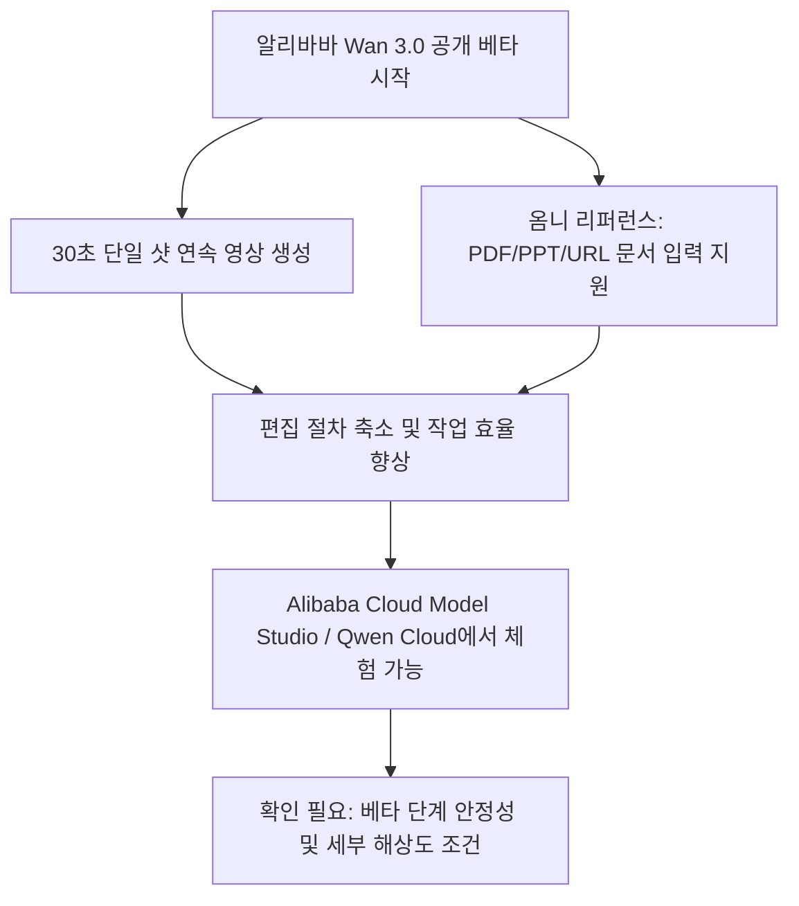
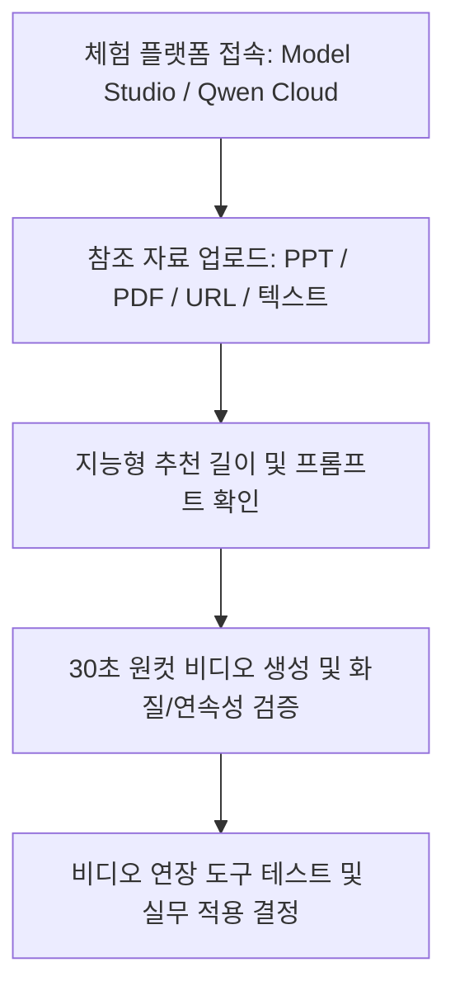
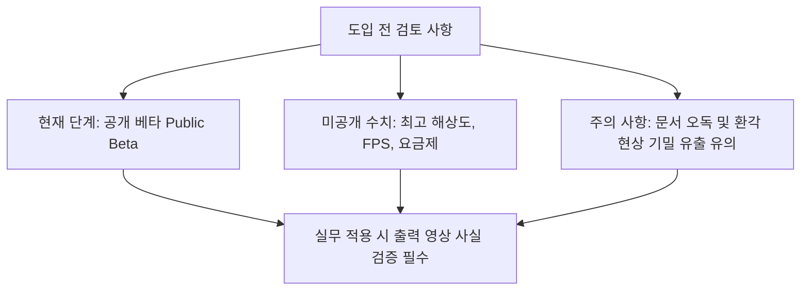

위 다이어그램은 알리바바가 새로 공개한 Wan 3.0 비디오 생성 모델의 주요 특징과 작동 흐름을 한눈에 보여줍니다.

## 무슨 일이 벌어진 걸까?

알리바바 클라우드(Alibaba Cloud)가 2026년 8월 6일, 자사의 차세대 비디오 생성 대형 모델인 'Wan 3.0'(통의완상 3.0, Tongyi Wanxiang 3.0)의 공개 베타(Public Beta) 테스트를 본격 시작했습니다 <sup class="source-citation"><a href="#source-1" aria-label="Alibaba Cloud Community 출처">[1]</a></sup>. 이번 공개 베타 출시로 기업과 개인 크리에이터 모두 알리바바의 향상된 AI 비디오 기술을 직접 경험할 수 있게 되었습니다 <sup class="source-citation"><a href="#source-2" aria-label="Moomoo 출처">[2]</a></sup>.

가장 눈에 띄는 변화는 단일 샷(Single-shot) 비디오 생성 시간의 획기적인 확장입니다. 기존 Wan 2.7 모델이 제공하던 최대 생성 시간인 15초를 2배로 뛰어넘어, 한 번의 생성 명령으로 끊김 없는 30초짜리 연속 원컷 비디오를 만들어낼 수 있게 되었습니다 <sup class="source-citation"><a href="#source-1" aria-label="Alibaba Cloud Community 출처">[1]</a></sup>.

```chartjs
{
  "type": "bar",
  "data": {
    "labels": ["Wan 2.7", "Wan 3.0"],
    "datasets": [{
      "label": "최대 단일 샷 영상 길이 (초)",
      "data": [15, 30]
    }]
  },
  "options": {
    "plugins": {
      "title": {
        "display": true,
        "text": "Alibaba Wan 모델 버전별 최대 단일 샷 영상 길이 비교"
      }
    }
  }
}
```

위 차트는 전작인 Wan 2.7과 이번 Wan 3.0의 최대 원컷 비디오 생성 시간을 수치로 비교한 결과입니다.

이에 더해 Wan 3.0은 다양한 형식의 자료를 참조 영상 제작에 직접 활용할 수 있는 '옴니 리퍼런스(Omni-reference)' 다중 모달 입력을 지원합니다 <sup class="source-citation"><a href="#source-2" aria-label="Moomoo 출처">[2]</a></sup>. 단순 텍스트나 이미지를 넘어 DOC, XLS, PPT, PDF, MD(마크다운) 등의 오피스 문서 파일은 물론 웹페이지 URL, 오디오, 비디오까지 통합 참조 입력으로 처리할 수 있습니다 <sup class="source-citation"><a href="#source-1" aria-label="Alibaba Cloud Community 출처">[1]</a></sup>.

현재 이번 공개 베타 버전은 알리바바 클라우드의 AI 개방형 플랫폼인 Alibaba Cloud Model Studio와 Qwen Cloud를 통해 손쉽게 액세스할 수 있습니다 <sup class="source-citation"><a href="#source-1" aria-label="Alibaba Cloud Community 출처">[1]</a></sup>.

## 왜 지금 다들 이 이야기를 할까?

기존의 생성형 AI 비디오 모델들은 재생 시간이 몇 초 단위로 매우 짧아, 긴 스토리라인을 연출하려면 여러 클립을 따로 생성한 뒤 이어 붙이는 번거로운 후가공 스티칭 작업을 거쳐야만 했습니다. Wan 3.0은 끊김 없는 30초 원컷 비디오를 한 번에 연출해 냄으로써 편집 과정에 들어가는 공수를 수월하게 줄여줍니다 <sup class="source-citation"><a href="#source-1" aria-label="Alibaba Cloud Community 출처">[1]</a></sup>.

특히 다양한 문서 및 웹페이지 URL을 참조 파일로 인식하는 기능은 비디오 제작 방식에 새로운 전환점을 제공합니다. 보고서 PDF나 기획 발표용 PPT, 심지어 엑셀 파일이나 웹사이트 링크를 넣으면 AI가 해당 자료의 핵심 내용을 파악해 어울리는 영상 그래픽으로 변환해주기 때문입니다 <sup class="source-citation"><a href="#source-2" aria-label="Moomoo 출처">[2]</a></sup>.


위 다이어그램은 오피스 문서나 웹 URL이 Wan 3.0을 거쳐 최종 비디오 연장 단계까지 연결되는 작업 경로를 보여줍니다.

또한 Wan 3.0에는 사용자 프롬프트를 분석하여 최적의 연출 시간을 자동으로 제안해주는 '지능형 영상 길이 제어(Intelligent duration control)' 기능이 포함되어 있습니다 <sup class="source-citation"><a href="#source-1" aria-label="Alibaba Cloud Community 출처">[1]</a></sup>. 여기에 완성된 영상을 자연스럽게 늘려주는 '비디오 연장 도구(Video extension tools)'도 함께 내장되어 길고 유연한 비디오 제작을 돕습니다 <sup class="source-citation"><a href="#source-2" aria-label="Moomoo 출처">[2]</a></sup>.

## 그래서 우리에게 뭐가 달라질까?

콘텐츠 마케터와 일반 업무 담당자가 비디오 시안을 제작할 때 소요되던 시간이 크게 단축됩니다. 신제품 소개용 PPT 파일이나 서비스 상세 안내 웹페이지 URL을 입력창에 집어넣는 것만으로 몇 분 만에 30초 분량의 마케팅 원컷 비디오 시안을 바로 얻을 수 있습니다 <sup class="source-citation"><a href="#source-1" aria-label="Alibaba Cloud Community 출처">[1]</a></sup>.

전문적인 촬영 장비나 비디오 편집 프로그램을 다루지 못하더라도, 이미 작성해 둔 보고서와 데이터 문서를 활용해 풍부한 시각 자료를 직접 제작할 수 있습니다. 엑셀 스프레드시트나 워드 문서의 내용을 AI가 참조하여 시각적인 연출로 풀어내기 때문입니다 <sup class="source-citation"><a href="#source-2" aria-label="Moomoo 출처">[2]</a></sup>.

영상 길이를 얼마로 정해야 할지 고민할 필요 없이, 지능형 영상 길이 제어 기능이 제공하는 연출 추천을 바탕으로 즉시 최적의 영상을 만들어낼 수 있습니다. 긴 분량의 영상이 필요할 경우 비디오 연장 도구를 연속으로 활용하면 스토리 흐름을 깬 지 않고 작업을 이어갈 수 있습니다 <sup class="source-citation"><a href="#source-1" aria-label="Alibaba Cloud Community 출처">[1]</a></sup>.

## 직접 써보거나 지켜볼 포인트

Wan 3.0을 직접 이용해보려는 사용자는 Alibaba Cloud Model Studio 또는 Qwen Cloud 플랫폼에 접속하여 공개 베타 테스트에 참여할 수 있습니다 <sup class="source-citation"><a href="#source-1" aria-label="Alibaba Cloud Community 출처">[1]</a></sup>.

가장 먼저 눈여겨봐야 할 부분은 오피스 문서(PDF, PPT, DOC, XLS, MD)나 웹 URL을 넣었을 때 AI가 본문 핵심 맥락을 얼마나 올바르게 시각적 요소로 반영하는가 하는 점입니다 <sup class="source-citation"><a href="#source-2" aria-label="Moomoo 출처">[2]</a></sup>.



위 다이어그램은 사용자가 플랫폼에 접속하여 Wan 3.0의 제반 기능과 품질을 단계별로 검증해보는 순서를 안내합니다.

30초라는 긴 시간 동안 단일 샷 비디오를 생성할 때 인물이나 피사체, 카메라 워킹의 연속성이 무너지지 않고 자연스럽게 유지되는지도 핵심적인 관전 포인트입니다 <sup class="source-citation"><a href="#source-1" aria-label="Alibaba Cloud Community 출처">[1]</a></sup>. AI가 추천하는 지능형 시간 배정이 실제 프롬프트 의도와 얼마나 부합하는지도 검증해볼 필요가 있습니다 <sup class="source-citation"><a href="#source-2" aria-label="Moomoo 출처">[2]</a></sup>.

## 아직은 선을 그어야 할 부분

현재 공개된 Wan 3.0은 완벽히 상용화된 정식 버전이 아니라 '공개 베타(Public Beta)' 서비스라는 점을 명심해야 합니다 <sup class="source-citation"><a href="#source-1" aria-label="Alibaba Cloud Community 출처">[1]</a></sup>. 베타 테스트 특성상 동시 사용자가 급증할 경우 비디오 생성 대기 시간이 늘어나거나 예동 없는 서버 지연이 발생할 수 있습니다.

또한, 생성 비디오의 최고 해상도 사양이나 초당 프레임 수(FPS), 그리고 베타 이후 정식 적용될 이용 요금제 체계 등의 세부 정보는 이번 공시에서 수치로 명시되지 않았으므로 향후 알리바바 클라우드의 추가 발표를 확인해야 합니다.



위 다이어그램은 사용자가 Wan 3.0을 실제 업무에 도입하기 전 반드시 고려해야 할 제한 요소와 검토 항목을 보여줍니다.

문서 참조 기능을 이용할 때도 주의가 필요합니다. 파일 안의 숫자나 표 데이터를 AI가 오독하여 잘못된 이미지나 가짜 정보를 생성하는 환각 현상이 나타날 수 있으므로, 대외 마케팅용이나 공식 보고용으로 영상을 활용하기 전 반드시 출력물 속 사실관계를 체크하는 검수 절차를 거쳐야 합니다.

## 자주 묻는 질문

### Wan 3.0은 어디에서 직접 써볼 수 있나요?

Wan 3.0은 현재 Alibaba Cloud Model Studio와 Qwen Cloud 플랫폼을 통해 공개 베타 버전을 써볼 수 있습니다.

### Wan 3.0이 한 번에 만들 수 있는 영상 길이는 얼마인가요?

단일 샷 기준으로 최대 30초 분량의 연속 비디오를 생성할 수 있으며, 이는 이전 Wan 2.7 모델의 15초 대비 2배 늘어난 수치입니다.

### 영상 생성 시 어떤 문서를 입력값으로 업로드할 수 있나요?

DOC, XLS, PPT, PDF, MD 파일 확장자의 문서와 웹페이지 URL을 참조 입력으로 넣을 수 있으며, 텍스트, 이미지, 오디오, 비디오도 지원됩니다.

### Wan 3.0은 정식 상용화되어 바로 이용할 수 있나요?

아니요, 2026년 8월 6일부터 시작된 공개 베타(Public Beta) 테스트 단계이며, 정식 서비스 및 최종 요금제 정책은 추후 공개될 예정입니다.

## 직접 확인한 원문

<ol class="checked-source-list">
  <li id="source-1"><a href="https://www.alibabacloud.com/en/notfound?_p_lc=1" target="_blank" rel="noopener noreferrer">Alibaba Cloud Community — Alibaba Unveils Wan3.0 with Twice as Long Video Outputs from a Richer Variety of Inputs</a> (2026-08-07)</li>
  <li id="source-2"><a href="https://www.moomoo.com/news/post/42691533/alibaba-09988-has-launched-the-public-beta-test" target="_blank" rel="noopener noreferrer">Moomoo — Alibaba (09988) has launched the public beta test of its video generation large model, Wan 3.0</a> (2026-08-06)</li>
</ol>

> 이 글은 위 원문을 직접 확인해 작성했습니다. 가격, 기능 범위, 지역별 제공 여부는 게시 후 바뀔 수 있으니 실제 도입 전 공식 문서를 다시 확인하세요.
