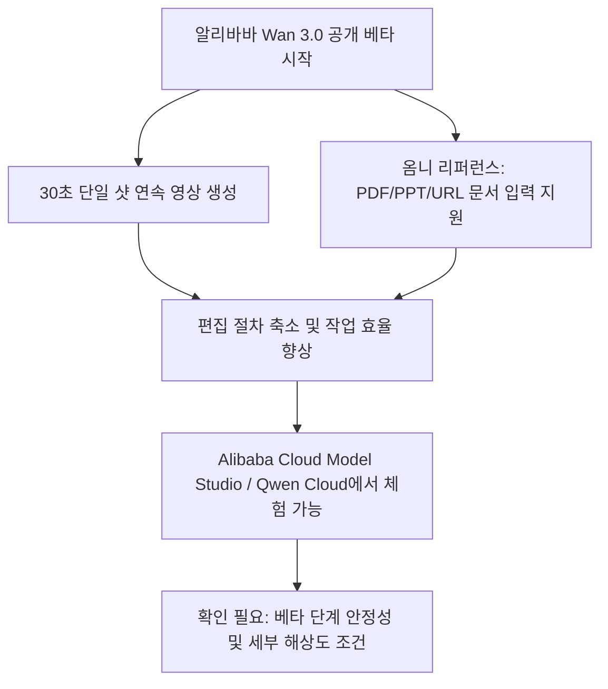
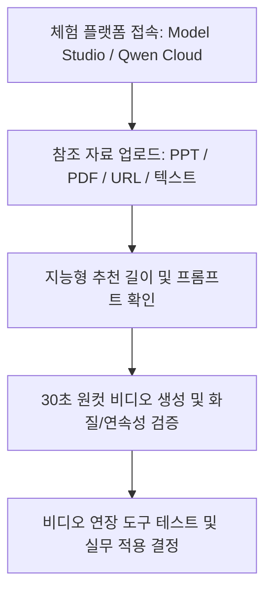
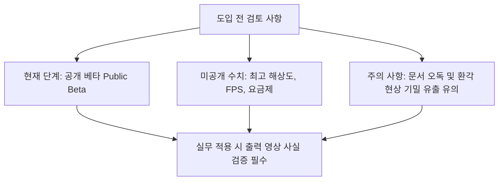

Wan 3.0 공개 베타의 실질적인 변화는 최대 30초 단일 샷과 문서, URL을 참조하는 영상 생성 흐름입니다. 기획서에서 빠르게 시안을 만드는 데는 유용할 수 있지만, 30초 내내 인물, 텍스트, 카메라 동작이 일관된지와 문서의 숫자를 정확히 옮겼는지는 별도로 검수해야 합니다. 공개 베타인 만큼 해상도, FPS, 최종 요금과 입력 자료의 처리 조건을 확인하기 전에는 납품 파이프라인을 고정하지 않는 편이 안전합니다.



위 다이어그램은 알리바바가 새로 공개한 Wan 3.0 비디오 생성 모델의 주요 특징과 작동 흐름을 한눈에 보여줍니다.

## 무슨 일이 벌어진 걸까?

알리바바 클라우드(Alibaba Cloud)가 2026년 8월 6일, 자사의 차세대 비디오 생성 대형 모델인 'Wan 3.0'(통의완상 3.0, Tongyi Wanxiang 3.0)의 공개 베타(Public Beta) 테스트를 본격 시작했습니다 <sup class="source-citation"><a href="#source-1" aria-label="Alibaba Cloud Community 출처">[1]</a></sup>. 이번 공개 베타 출시로 기업과 개인 크리에이터 모두 알리바바의 향상된 AI 비디오 기술을 직접 경험할 수 있게 되었습니다 <sup class="source-citation"><a href="#source-2" aria-label="Moomoo 출처">[2]</a></sup>.

가장 눈에 띄는 변화는 단일 샷(Single-shot) 비디오 생성 시간의 획기적인 확장입니다. 기존 Wan 2.7 모델이 제공하던 최대 생성 시간인 15초를 2배로 뛰어넘어, 한 번의 생성 명령으로 끊김 없는 30초짜리 연속 원컷 비디오를 만들어낼 수 있게 되었습니다 <sup class="source-citation"><a href="#source-1" aria-label="Alibaba Cloud Community 출처">[1]</a></sup>.

```chartjs
{
  "type": "bar",
  "data": {
    "labels": ["Wan 2.7", "Wan 3.0"],
    "datasets": [{
      "label": "최대 단일 샷 영상 길이 (초)",
      "data": [15, 30]
    }]
  },
  "options": {
    "plugins": {
      "title": {
        "display": true,
        "text": "Alibaba Wan 모델 버전별 최대 단일 샷 영상 길이 비교"
      }
    }
  }
}
```

위 차트는 전작인 Wan 2.7과 이번 Wan 3.0의 최대 원컷 비디오 생성 시간을 수치로 비교한 결과입니다.

이에 더해 Wan 3.0은 다양한 형식의 자료를 참조 영상 제작에 직접 활용할 수 있는 '옴니 리퍼런스(Omni-reference)' 다중 모달 입력을 지원합니다 <sup class="source-citation"><a href="#source-2" aria-label="Moomoo 출처">[2]</a></sup>. 단순 텍스트나 이미지를 넘어 DOC, XLS, PPT, PDF, MD(마크다운) 등의 오피스 문서 파일은 물론 웹페이지 URL, 오디오, 비디오까지 통합 참조 입력으로 처리할 수 있습니다 <sup class="source-citation"><a href="#source-1" aria-label="Alibaba Cloud Community 출처">[1]</a></sup>.

현재 이번 공개 베타 버전은 알리바바 클라우드의 AI 개방형 플랫폼인 Alibaba Cloud Model Studio와 Qwen Cloud를 통해 손쉽게 액세스할 수 있습니다 <sup class="source-citation"><a href="#source-1" aria-label="Alibaba Cloud Community 출처">[1]</a></sup>.

## 30초 단일 샷이 편집 시간을 실제로 줄일까?

짧은 생성 클립으로 긴 장면을 만들려면 여러 결과를 이어 붙이고 색과 동작을 맞춰야 합니다. Wan 3.0은 최대 30초 단일 샷을 제공해 이 연결 작업을 줄일 가능성이 있습니다 <sup class="source-citation"><a href="#source-1" aria-label="Alibaba Cloud Community 출처">[1]</a></sup>. 다만 길이가 두 배가 됐다는 사실만으로 재작업이 절반이 되지는 않습니다. 뒤쪽에서 인물 외형이 바뀌거나 움직임이 끊기면 짧은 클립 여러 개를 연결하는 방식보다 수정 범위가 커질 수 있습니다.

다양한 문서와 웹페이지 URL을 참조 입력으로 받는 기능은 보고서나 기획안을 시안으로 옮기는 단계를 줄일 수 있습니다. PDF, PPT, XLS나 웹페이지를 넣으면 모델이 자료를 바탕으로 영상을 생성하도록 안내할 수 있습니다 <sup class="source-citation"><a href="#source-2" aria-label="Moomoo 출처">[2]</a></sup>. 그러나 문서를 읽는 기능과 핵심을 정확히 선별하는 능력은 별개이므로, 표의 열, 단위, 각주가 영상에서 어떻게 표현됐는지 원문과 대조해야 합니다.


위 다이어그램은 오피스 문서나 웹 URL이 Wan 3.0을 거쳐 최종 비디오 연장 단계까지 연결되는 작업 경로를 보여줍니다.

또한 Wan 3.0에는 사용자 프롬프트를 분석하여 최적의 연출 시간을 자동으로 제안해주는 '지능형 영상 길이 제어(Intelligent duration control)' 기능이 포함되어 있습니다 <sup class="source-citation"><a href="#source-1" aria-label="Alibaba Cloud Community 출처">[1]</a></sup>. 여기에 완성된 영상을 자연스럽게 늘려주는 '비디오 연장 도구(Video extension tools)'도 함께 내장되어 길고 유연한 비디오 제작을 돕습니다 <sup class="source-citation"><a href="#source-2" aria-label="Moomoo 출처">[2]</a></sup>.

## 문서 입력은 어떤 자료부터 시험해야 할까?

콘텐츠 마케터와 업무 담당자는 신제품 소개용 PPT나 서비스 안내 페이지를 영상 시안의 참조 자료로 사용할 수 있습니다 <sup class="source-citation"><a href="#source-1" aria-label="Alibaba Cloud Community 출처">[1]</a></sup>. 첫 시험에는 공개해도 되는 짧은 문서와 정답이 분명한 제품명, 숫자를 넣는 것이 좋습니다. 모델이 어느 슬라이드를 우선하는지, 표를 장면으로 어떻게 바꾸는지와 출처에 없는 문구를 덧붙이는지를 확인한 뒤 복잡한 자료로 넓혀야 합니다.

이미 작성한 보고서와 데이터 문서를 활용해 촬영 전 콘티나 내부 검토용 시각 자료를 만들 수 있습니다. 엑셀 스프레드시트나 워드 문서를 참조 입력으로 쓸 수 있다는 설명이 있지만, 결과가 곧 공식 데이터 시각화가 되는 것은 아닙니다 <sup class="source-citation"><a href="#source-2" aria-label="Moomoo 출처">[2]</a></sup>. 숫자와 브랜드 자산이 중요한 외부 영상은 편집 가능한 원본 그래픽과 비교해 사람이 다시 확인해야 합니다.

지능형 영상 길이 제어가 연출 시간을 제안하고 비디오 연장 도구도 제공되지만, 추천 길이가 곧 최적 길이라는 뜻은 아닙니다. 긴 분량이 필요할 때 연장 도구를 사용할 수 있으나, 확장 경계에서 피사체와 배경, 오디오가 이어지는지 확인해야 합니다 <sup class="source-citation"><a href="#source-1" aria-label="Alibaba Cloud Community 출처">[1]</a></sup>.

## 공개 베타에서 어떤 합격 기준을 세울까?

Wan 3.0을 직접 이용해보려는 사용자는 Alibaba Cloud Model Studio 또는 Qwen Cloud 플랫폼에 접속하여 공개 베타 테스트에 참여할 수 있습니다 <sup class="source-citation"><a href="#source-1" aria-label="Alibaba Cloud Community 출처">[1]</a></sup>.

가장 먼저 눈여겨봐야 할 부분은 오피스 문서(PDF, PPT, DOC, XLS, MD)나 웹 URL을 넣었을 때 AI가 본문 핵심 맥락을 얼마나 올바르게 시각적 요소로 반영하는가 하는 점입니다 <sup class="source-citation"><a href="#source-2" aria-label="Moomoo 출처">[2]</a></sup>.



위 다이어그램은 사용자가 플랫폼에 접속하여 Wan 3.0의 제반 기능과 품질을 단계별로 검증해보는 순서를 안내합니다.

30초라는 긴 시간 동안 단일 샷 비디오를 생성할 때 인물이나 피사체, 카메라 워킹의 연속성이 무너지지 않고 자연스럽게 유지되는지도 핵심적인 관전 포인트입니다 <sup class="source-citation"><a href="#source-1" aria-label="Alibaba Cloud Community 출처">[1]</a></sup>. AI가 추천하는 지능형 시간 배정이 실제 프롬프트 의도와 얼마나 부합하는지도 검증해볼 필요가 있습니다 <sup class="source-citation"><a href="#source-2" aria-label="Moomoo 출처">[2]</a></sup>.

합격 기준은 “보기 좋다”보다 구체적이어야 합니다. 인물과 제품의 동일성, 화면 속 글자의 정확성, 시작, 중간, 끝의 동작 연결, 오디오와 입 모양의 관계, 잘못 생성된 로고나 숫자 유무를 항목별로 기록합니다. 같은 입력을 여러 번 생성해 성공한 결과의 비율과 평균 재시도 횟수를 계산해야 한 번의 좋은 샘플에 과대평가되지 않습니다.

문서와 URL에는 공개 전 정보나 개인정보가 들어갈 수 있으므로 업로드 전에 서비스의 저장, 학습, 삭제 조건을 확인해야 합니다. 입력 자료와 생성 영상의 상업적 이용 조건, 제3자 이미지, 음성의 권리도 공개 베타 이용 가능 여부와는 별개의 문제입니다. 이 조건이 불명확하면 비식별화한 샘플로 기능만 검증하고 실제 고객 자료는 넣지 않는 편이 안전합니다.

## 아직은 선을 그어야 할 부분

현재 공개된 Wan 3.0은 정식 버전이 아니라 '공개 베타(Public Beta)' 서비스입니다 <sup class="source-citation"><a href="#source-1" aria-label="Alibaba Cloud Community 출처">[1]</a></sup>. 베타에서는 기능과 제공 조건이 바뀔 수 있으므로, 운영 일정을 생성 속도에 고정하기 전에 실제 계정에서 안정성을 측정해야 합니다.

또한, 생성 비디오의 최고 해상도 사양이나 초당 프레임 수(FPS), 그리고 베타 이후 정식 적용될 이용 요금제 체계 등의 세부 정보는 이번 공시에서 수치로 명시되지 않았으므로 향후 알리바바 클라우드의 추가 발표를 확인해야 합니다.



위 다이어그램은 사용자가 Wan 3.0을 실제 업무에 도입하기 전 반드시 고려해야 할 제한 요소와 검토 항목을 보여줍니다.

문서 참조 기능을 이용할 때도 주의가 필요합니다. 파일 안의 숫자나 표 데이터를 AI가 오독하여 잘못된 이미지나 가짜 정보를 생성하는 환각 현상이 나타날 수 있으므로, 대외 마케팅용이나 공식 보고용으로 영상을 활용하기 전 반드시 출력물 속 사실관계를 체크하는 검수 절차를 거쳐야 합니다.

<!-- primary-sources:start -->
## 원문과 버전 확인

- [발표 원문](https://www.alibabacloud.com/en/notfound?_p_lc=1)
- [Moomoo](https://www.moomoo.com/news/post/42691533/alibaba-09988-has-launched-the-public-beta-test)
<!-- primary-sources:end -->

<!-- internal-links:start -->
## 함께 읽으면 이해가 이어지는 글

- [TMD는 50-step 비디오 생성을 정말 4-step으로 줄일까: Backbone, Flow Head 구조]() — TMD가 teacher의 긴 sampling trajectory를 네 transition으로 증류하고 무거운 backbone과 반복 flow head를 분리하는 방식, 95% 성능, 실시간 주장과 1~2-step 한계를 점검합니다.
- [대화문만으로 장편 AI 영상을 만들 수 있을까: ScripterAgent와 VSA의 현실적 한계]() — 대화를 장면별 실행 대본으로 바꾸는 두 에이전트 구조와 장면 일관성, 평가, 비용의 한계를 짚습니다.
- [12시간 AI 영상은 정말 일관적인가? LoL의 Sink-Collapse와 RoPE Jitter]() — LoL이 attention sink와 RoPE 주기 때문에 여러 head가 초기 frame에 동시에 쏠리는 sink-collapse를 추론 시 jitter로 완화하는 원리와 12시간 결과의 해석 한계를 정리합니다.
<!-- internal-links:end -->

## 자주 묻는 질문

### Wan 3.0은 어디에서 직접 써볼 수 있나요?

Wan 3.0은 현재 Alibaba Cloud Model Studio와 Qwen Cloud 플랫폼을 통해 공개 베타 버전을 써볼 수 있습니다.

### Wan 3.0이 한 번에 만들 수 있는 영상 길이는 얼마인가요?

단일 샷 기준으로 최대 30초 분량의 연속 비디오를 생성할 수 있으며, 이는 이전 Wan 2.7 모델의 15초 대비 2배 늘어난 수치입니다.

### 영상 생성 시 어떤 문서를 입력값으로 업로드할 수 있나요?

DOC, XLS, PPT, PDF, MD 파일 확장자의 문서와 웹페이지 URL을 참조 입력으로 넣을 수 있으며, 텍스트, 이미지, 오디오, 비디오도 지원됩니다.

### Wan 3.0은 정식 상용화되어 바로 이용할 수 있나요?

아니요, 2026년 8월 6일부터 시작된 공개 베타(Public Beta) 테스트 단계이며, 정식 서비스 및 최종 요금제 정책은 추후 공개될 예정입니다.

## 직접 확인한 원문

<ol class="checked-source-list">
  <li id="source-1"><a href="https://www.alibabacloud.com/en/notfound?_p_lc=1" target="_blank" rel="noopener noreferrer">Alibaba Cloud Community — Alibaba Unveils Wan3.0 with Twice as Long Video Outputs from a Richer Variety of Inputs</a> (2026-08-07)</li>
  <li id="source-2"><a href="https://www.moomoo.com/news/post/42691533/alibaba-09988-has-launched-the-public-beta-test" target="_blank" rel="noopener noreferrer">Moomoo — Alibaba (09988) has launched the public beta test of its video generation large model, Wan 3.0</a> (2026-08-06)</li>
</ol>

> 이 글은 위 원문을 직접 확인해 작성했습니다. 가격, 기능 범위, 지역별 제공 여부는 게시 후 바뀔 수 있으니 실제 도입 전 공식 문서를 다시 확인하세요.
