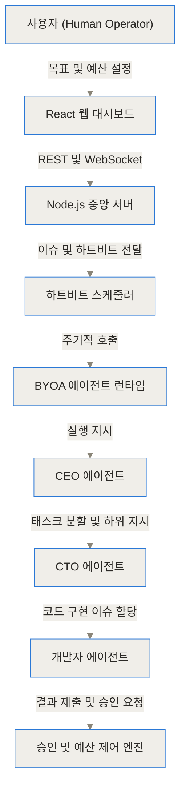
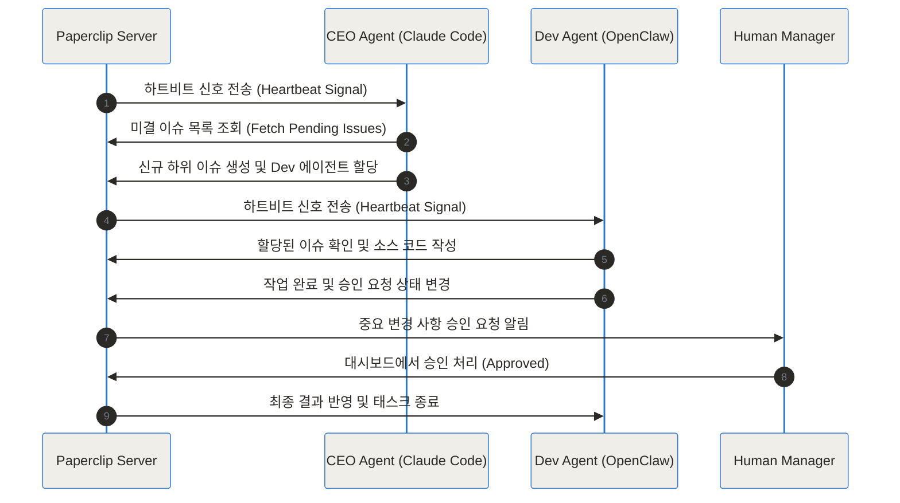
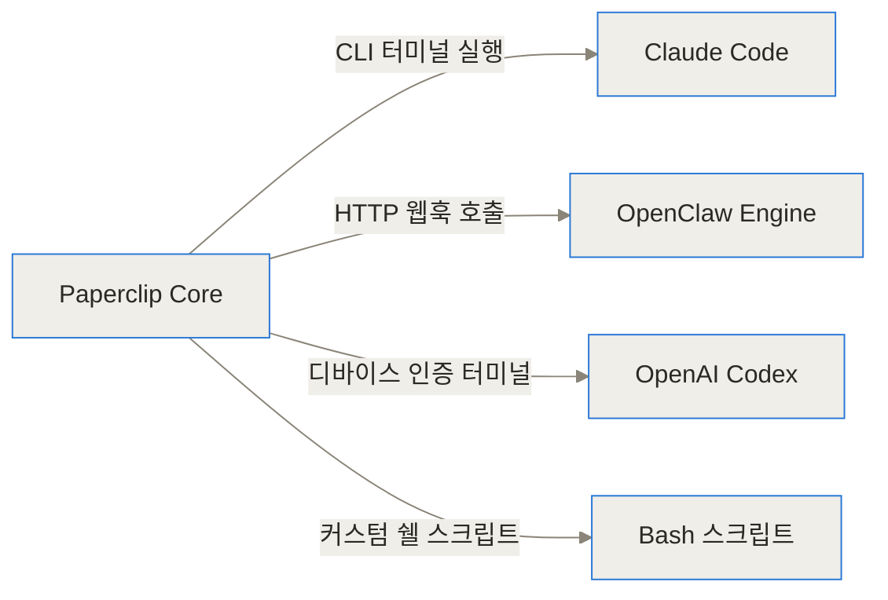
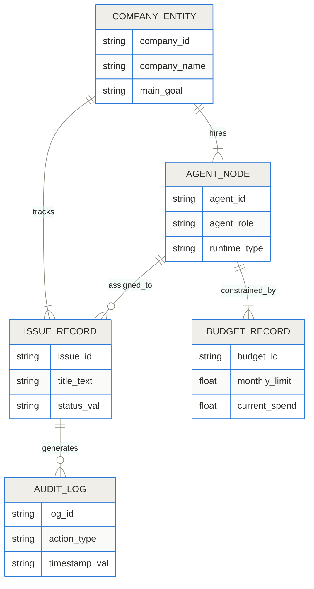
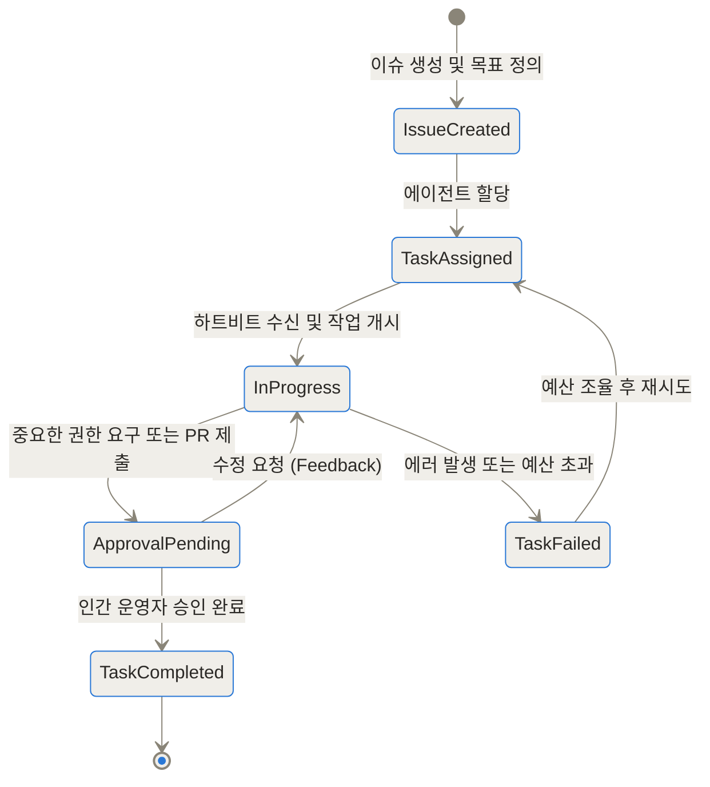
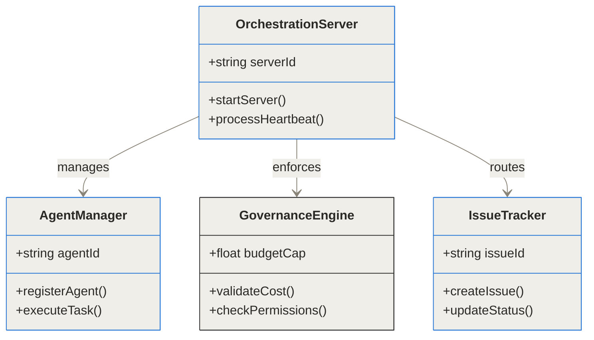
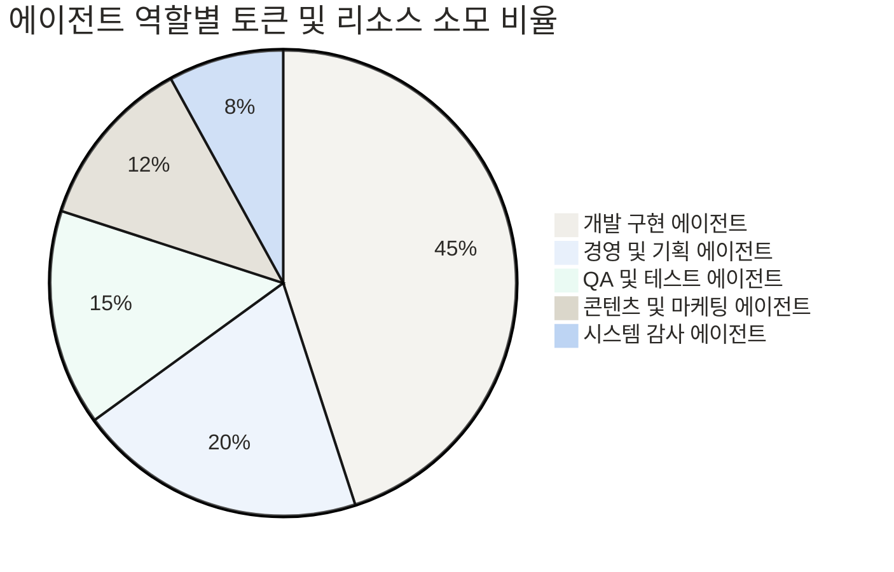

## Paperclip 관련 주요 링크

- [Paperclip GitHub 공식 저장소](https://github.com/paperclipai/paperclip)
- [Paperclip 공식 문서 사이트](https://paperclip.ing/)

## TL;DR (한 줄 요약)

> TL;DR
> - Paperclip은 Claude Code, OpenClaw, Codex 등 서로 다른 AI 에이전트들을 하나의 가상 회사 조직으로 묶어 자율 협업을 총괄하는 오픈소스 오케스트레이션 플랫폼이에요.
> - 조직도 설정, 월간 예산 한도, 하트비트 주기, 인간 승인 게이트를 통해 AI 에이전트의 폭주와 비용 낭비를 완벽히 통제해요.
> - 단일 코딩 에이전트를 넘어 CEO부터 개발자, QA, 마케터까지 연결된 완전 자율형 AI 팀을 구현할 수 있도록 돕더라고요.

## 단일 AI 에이전트 활용의 한계와 Paperclip의 등장 배경

최근 Claude Code나 Cursor, OpenClaw 같은 고성능 AI 개발 도구들이 대세로 자리 잡았죠. 혼자서 간단한 모듈을 개발하거나 버그를 잡을 때는 단일 에이전트만으로도 엄청난 생산성을 낼 수 있어요. 하지만 서비스 하나를 처음부터 끝까지 완성하려고 하면 곧바로 한계에 부딪히게 돼요. 터미널 창 10~20개를 동시에 열어두고 개별 에이전트에게 일일이 지시를 내리다 보면, 어떤 에이전트가 무엇을 작업하고 있는지 흐름을 놓치기 일쑤더라고요.

더 큰 문제는 리소스 관리와 안전성이에요. 에이전트가 루프에 빠져 무한히 API를 호출하면 순식간에 수백 달러의 비용이 청구되기도 하고, 검증되지 않은 외부 패키지를 마음대로 설치하거나 마스터 브랜치에 잘못된 코드를 집어넣는 사고가 발생하기도 해요. 개발자가 코드 풀 리퀘스트(PR) 하나하나를 일일이 감시하는 것도 지치는 일이죠.

Paperclip은 바로 이 지점에서 시작해요. 개발자가 풀 리퀘스트를 일일이 검수하는 대신 비즈니스 목표와 조직 구조를 관리하도록 패러다임을 바꾼 거예요. 에이전트들을 단순한 '도구'가 아니라 '조직원'으로 바라보고, 이들이 서로 역할을 분담하며 예산과 권한 범위 안에서 안전하게 자율 작동하도록 판을 깔아주는 거죠.

## Paperclip이란 무엇인가

Paperclip은 한 마디로 'AI 에이전트 전용 가상 회사 운영 시스템'이라고 할 수 있어요. 사람이 슬랙(Slack)이나 지라(Jira)로 업무를 소통하고 조직도에 따라 일을 위임하듯, Paperclip은 AI 에이전트들에게 대시보드, 칸반 보드, 조직도, 하트비트(Heartbeat) 신호를 제공해요.

이 플랫폼은 특정 AI 모델이나 에디터에 귀속되지 않는 중립성을 특징으로 해요. 이를 **BYOA(Bring Your Own Agent)** 철학이라고 불러요. CLI 터미널에서 작동하는 Claude Code든, 백그라운드 웹훅으로 실행되는 OpenClaw든, OpenAI Codex든 하트비트 신호를 받아 작업을 수행할 수만 있다면 어떤 런타임이든 회사의 직원으로 '고용'할 수 있어요.


Paperclip 공식 문서에서 소개하는 핵심 가치는 네 가지 기둥으로 요약돼요.
1. **조직도 및 하이레벨 목표(Org Chart & High-Level Goals)**: CEO, CTO, 개발자, 마케터 등 역할과 상하 관계를 정의하고 최상위 목표를 부여해요.
2. **목표 정렬 및 태스크 위임(Goal Alignment & Delegation)**: 상위 에이전트가 목표를 하위 태스크로 쪼개어 하위 에이전트에게 이슈를 자동 할당해요.
3. **하트비트 신호(Heartbeats)**: 주기적으로 에이전트를 깨워 할당된 이슈를 확인하고 자율적으로 작업을 이어가게 만들어요.
4. **거버넌스 및 예산 제어(Governance & Budget Caps)**: 에이전트별 월간 예산을 설정하고, 주요 권한이 필요한 작업에는 인간의 승인을 요구해요.

## Paperclip의 작동 원리와 핵심 아키텍처

Paperclip이 내부에서 어떻게 작동하는지 아키텍처와 핵심 메커니즘을 단계별로 파헤쳐 볼게요. 백엔드는 Node.js 기반 서버로 구성되어 있고, 사용자 인터페이스는 React 대시보드로 구현되어 있어요.



### BYOA 방식과 하트비트 스케줄러의 동작 구조

Paperclip의 중심에는 **하트비트 스케줄러(Heartbeat Scheduler)**가 있어요. AI 에이전트는 사람이 아니기 때문에 가만히 놔두면 스스로 계속 동작하지 않죠. Paperclip 서버는 주기적(예: 5분, 15분마다)으로 에이전트 런타임에 하트비트 신호를 전송해요.

하트비트 신호를 받은 에이전트는 다음과 같은 시퀀스로 작동하게 돼요.



1. 하트비트를 받으면 에이전트 프로세스가 깨어나 Paperclip REST API를 통해 자신에게 할당된 이슈(Issue)를 조회해요.
2. 할당된 이슈가 있으면 해당 작업의 컨텍스트와 목표를 읽어 들여 작업을 수행해요.
3. 작업을 마치면 작업 내역을 로그로 남기고 이슈 상태를 'In Progress', 'Approval Pending', 'Completed' 등으로 업데이트해요.
4. 작업 중 추가로 필요한 하위 작업이 생기면 직속 하위 에이전트에게 새 이슈를 생성해 할당해요.

### 가상 회사 조직도와 이슈 위임 체계

Paperclip은 지라(Jira) 스타일의 이슈 트래커를 내부 데이터 구조로 가지고 있어요. 모든 업무는 이슈 단위로 관리되며, 이슈는 상위 이슈(Parent Issue)와 하위 이슈(Sub-issue)로 트리 구조를 형성해요.

예를 들어 사용자가 회사 최상위 목표로 "100만 원 MRR을 달성하는 메모 앱 제작"이라는 지시를 내리면, CEO 에이전트가 이를 받아 "기술 스택 선정 및 아키텍처 설계", "랜딩 페이지 제작", "결제 모듈 연동"이라는 이슈로 분할해요. 그리고 CTO 및 마케터 에이전트에게 해당 이슈의 담당자(Assignee)를 지정하는 식이죠.



### 데이터 모델과 영속성 스키마

Paperclip의 내부 데이터베이스 구조는 회사(Company), 에이전트(Agent), 이슈(Issue), 예산(Budget), 감사 로그(Audit Log) 간의 관계를 명확하게 다뤄요.



### 에이전트 태스크 생명주기 및 상태 관리

에이전트가 처리하는 개별 태스크는 명확한 상태 변화 과정을 거쳐요. 하트비트를 통해 태스크가 진행되고, 실패 시 자동 재시도나 인간 개입 요청으로 전이되는 생명주기를 가져요.



### 예산 한도 및 인간 개입 승인 알고리즘

Paperclip 내부에는 안전망 역할을 하는 모듈이 두 개 있어요.
1. **예산 한도(Budget Controller)**: 에이전트가 API를 호출할 때마다 소모된 토큰과 추정 비용을 기록해요. 지정된 월간 예산 한도를 넘어설 경우 에이전트 상태를 강제로 일시정지(Paused)시키고 추가 하트비트 신호를 차단해요.
2. **거버넌스 엔진(Governance Engine)**: 소스 코드 푸시, 서버 배포, 타사 API 키 등록, 신규 에이전트 추가 고용 등 위험도가 높은 작업은 'Approval Required' 키워드로 플래그가 지정돼요. 대시보드에서 인간 관리자가 버튼을 눌러 승인하기 전까지는 다음 단계로 진행되지 않아요.



에이전트들이 소비하는 토큰 리소스 비율을 분석해 보면, 실제 코드를 작성하는 개발 에이전트와 경영/기획 에이전트가 가장 큰 비중을 차지하더라고요.



## Paperclip을 어떻게 설치하고 설정하나

Paperclip은 로컬 개발 환경이나 VPS(Virtual Private Server) 구름 환경에서 손쉽게 구축할 수 있어요.

### 로컬 환경 설치 및 환경변수 구성

가장 기본적인 로컬 설치 단계는 다음과 같아요.

```bash
# 1. Paperclip 저장소 클론
git clone https://github.com/paperclipai/paperclip.git
cd paperclip

# 2. 의존성 패키지 설치
npm install

# 3. 환경변수 파일 설정 (.env)
cat <<EOT > .env
PORT=3000
DATABASE_URL="sqlite://./paperclip.db"
ANTHROPIC_API_KEY="your-anthropic-api-key"
OPENAI_API_KEY="your-openai-api-key"
EOT

# 4. 개발 서버 실행
npm run dev
```

실행이 완료되면 브라우저에서 `http://localhost:3000`으로 접속하여 대시보드 UI를 확인할 수 있어요.

### Docker 및 VPS 서버 배포 방법

24시간 멈추지 않는 자율 AI 기업을 운영하려면 VPS 서버에 Docker 컨테이너로 배포하는 것이 좋아요.

```yaml
# docker-compose.yml 예시
version: '3.8'
services:
  paperclip-server:
    build: .
    ports:
      - "3000:3000"
    environment:
      - NODE_ENV=production
      - PORT=3000
      - ANTHROPIC_API_KEY=${ANTHROPIC_API_KEY}
    volumes:
      - ./data:/app/data
    restart: always
```

`docker compose up -d` 명령어를 입력하면 백그라운드에서 데몬 형태로 지속 가동돼요.

### 에이전트 하트비트 설정 코드 예시

Paperclip REST API를 이용해 커스텀 에이전트를 등록하고 하트비트를 주고받는 예시 JSON 설정이에요.

```json
{
  "agentName": "CTO-Claude-Code",
  "role": "Chief Technology Officer",
  "runtime": "claude-code-cli",
  "heartbeatIntervalMinutes": 10,
  "monthlyBudgetUSD": 150.0,
  "skills": ["architecture-design", "code-review", "task-breakdown"],
  "environmentVariables": {
    "ALLOWED_REPOS": ["my-org/core-backend", "my-org/frontend"]
  }
}
```

## 개발 현업에서의 실전 활용 시나리오

실제 개발 현업에서 Paperclip을 어떻게 활용하는지 두 가지 대표적인 시나리오를 통해 설명해 드릴게요.

### 시나리오 1: 풀스택 신규 서비스 자동 구축

1. **목표 설정**: 사용자가 대시보드에서 "PostgreSQL과 React 기반의 웹 가계부 앱 제작"이라는 목표를 정의해요.
2. **조직 구성**: CEO 에이전트(Claude Code), 백엔드 개발자 에이전트(Codex), 프론트엔드 개발자 에이전트(OpenClaw), QA 에이전트를 고용해요.
3. **작업 분할 및 할당**: CEO 에이전트가 데이터베이스 스키마 설계 이슈, REST API 구현 이슈, UI 컴포넌트 개발 이슈로 쪼개어 각각 담당자에게 분배해요.
4. **자율 작업 및 검증**: 하트비트 신호에 맞춰 각 개발 에이전트가 코드를 작성하고 단위 테스트를 실행해요. QA 에이전트가 통합 테스트를 진행하고 에러가 발견되면 해당 개발 에이전트에게 수정 이슈를 재할당해요.
5. **승인 및 배포**: 모든 테스트가 통과되면 인간 관리자에게 배포 승인 요청 알림이 발송되고, 승인 버튼 클릭 시 자율 배포가 시작돼요.

### 시나리오 2: 멀티 에이전트 기반 콘텐츠 마케팅 파이프라인

1. **뉴스 수집 및 분석**: 리서처 에이전트가 최신 테크 뉴스를 긁어와 요약 이슈를 작성해요.
2. **초안 작성**: 작가 에이전트가 요약본을 토대로 블로그 포스팅 및 트위터 타래 초안을 작성해요.
3. **이미지 및 검수**: 이미지 생성 에이전트가 관련 일러스트 프롬프트를 실행하고, 교정 에이전트가 문맥과 오탈자를 검수해요.
4. **최종 발행**: 매주 월요일 아침 인간 관리자의 승인을 거쳐 발행 시스템에 자동 등록돼요.

## 기존 멀티 에이전트 도구와 비교하면 무엇이 다른가

Paperclip과 기존의 다른 도구들을 비교해 보면 독특한 위치를 확인할 수 있어요.

```chartjs
{"type":"bar","data":{"labels":["개별 터미널 수동 관리","Paperclip 조직 오케스트레이션"],"datasets":[{"label":"프로젝트 완수 소요시간(시간)","data":[84,14]},{"label":"예산 초과 발생률(%)","data":[65,3]}]}}
```

실제 멀티 에이전트 작업을 수동 관리할 때와 Paperclip 오케스트레이션을 사용할 때의 생산성 및 제어율 비교 데이터예요.

```chartjs
{"type":"line","data":{"labels":["1주차","2주차","3주차","4주차"],"datasets":[{"label":"자율 처리 이슈 수","data":[15,42,88,150]},{"label":"휴먼 에이전트 개입 횟수","data":[22,14,7,2]}]}}
```

주차별 자율 작업 처리량이 늘어남에 따라 인간의 수동 개입 횟수가 급격히 줄어드는 패턴을 보여줘요.

다음 표는 기존 기술들과의 세부적인 차이점을 정리한 것입니다.

| 비교 항목 | 단일 에이전트 (Claude Code / Cursor) | 에이전트 SDK (CrewAI / AutoGen) | Paperclip 오케스트레이션 | 
| :--- | :--- | :--- | :--- |
| **관점 및 지향점** | 단일 작업 중심 코딩 보조 | Python 프로그래밍 프레임워크 | 가상 회사 운영 대시보드 및 제어기 |
| **에이전트 조율 방식** | 수동 지시 및 대화 반복 | 코드 기반의 파이프라인 정의 | 조직도 기반 자동 태스크 위임 |
| **실행 주체** | 사용자의 프롬프트 입력 시 | 스크립트 실행 시 1회성 | 하트비트 기반 24/7 지속 가동 |
| **비용 및 예산 제어** | 사용자가 API 잔액 직접 확인 | 별도 한도 설정 코드 작성 필요 | 에이전트/회사별 월간 예산 한도 내장 |
| **인간 개입 방식** | 매 답변마다 개입 | 스크립트 종료 후 결과 확인 | 승인 게이트(Approval Gate) 기반 검수 |

런타임별 지원 특성도 다음과 같이 비교해 볼 수 있어요.

| 에이전트 런타임 | 연결 방식 | 장점 | 주의점 |
| :--- | :--- | :--- | :--- |
| **Claude Code** | CLI / Device Auth | 강력한 추론 능력과 높은 코드 완성도 | 클로드 서브스크립션 및 토큰 비용 관리 필요 |
| **OpenClaw** | HTTP / Webhook | 자율적인 외부 백그라운드 모듈 가동 | 개별 샌드박스 보안 설정 필요 |
| **OpenAI Codex** | CLI / API | 빠른 응답 속도와 우수한 API 연동성 | 복잡한 요구사항 시 맥락 유지 한계 |
| **Bash / Custom** | Local Script | 어떠한 커스텀 도구든 연결 가능 | 에러 예외 처리 로직 직접 구현 필요 |

## Paperclip의 한계점과 적용 시 고려할 트레이드오프

Paperclip이 매력적인 도구인 것은 분명하지만, 모든 상황에 다 맞아떨어지는 솔루션은 아니더라고요. 도입 전에 꼭 숙지해야 할 한계점이 있어요.

1. **초기 조직 설계의 복잡성**: 에이전트를 고용하고 역할을 부여하며 정교한 프롬프트 스킬을 설정하는 데 초기 공수가 꽤 들어가요. 단순한 1회성 스크립트 작성에는 오히려 오버헤드가 될 수 있어요.
2. **에이전트 간 컨텍스트 전달 손실**: 상위 에이전트가 하위 에이전트에게 이슈를 위임하는 과정에서 텍스트 기반 프롬프트로 변환되다 보니, 당초 의도했던 정교한 맥락이 일부 누락될 가능성이 존재해요.
3. **하트비트 신호 지연 문제**: 하트비트 주기를 너무 길게 잡으면 작업 처리가 느려지고, 너무 짧게 잡으면 의미 없는 API 호출로 기본 토큰 소모 비용이 늘어날 수 있어요.

## 총평 및 향후 AI 에이전트 생태계 전망

Paperclip은 'AI 에이전트 활용이 개인의 도구를 넘어 멀티 에이전트 조직화로 이동하는 흐름'을 명확하게 보여주는 프로젝트예요. 개발자가 일일이 코드를 작성하거나 에이전트 챗봇 창을 주시하는 시대에서, 에이전트들의 회사 구조와 가이드라인을 설계하고 고차원 비즈니스 목표를 관리하는 시대로 진화하고 있는 거죠.

멀티 에이전트 자율 가동 시스템을 도입하려는 팀이나, 클로드 코드/오픈클로 등을 한데 묶어 복잡한 프로젝트를 자동으로 돌려보고 싶은 개발자라면 Paperclip을 직접 구축해서 테스트해 보시는 것을 추천해요.

## 자주 묻는 질문 (FAQ)

### Paperclip은 Claude Code나 OpenClaw 외에 다른 LLM 모델도 지원하나요?

네, 지원해요. Paperclip은 BYOA(Bring Your Own Agent) 아키텍처를 채택하고 있어서 하트비트 신호를 받아 쉘 명령어나 HTTP 요청을 수행할 수 있는 런타임이라면 Anthropic Claude, OpenAI Codex, Llama, Ollama 등 어떤 AI 모델이나 에이전트 도구든 상관없이 조직도로 끌어와 연결할 수 있어요.

### 에이전트가 무한 루프에 빠져 API 비용이 엄청나게 청구되면 어떻게 하나요?

Paperclip은 에이전트 및 회사 단위의 월간 예산 한도(Budget Caps) 설정 기능을 기본 탑재하고 있어요. 에이전트가 사용할 수 있는 최대 토큰 및 비용이 지정된 한도를 초과하면 Governance 엔진이 자동으로 해당 에이전트의 하트비트 실행을 즉시 중단시키고 관리자에게 승인 알림을 보내요.

### 에이전트가 승인 없이 소스 코드를 마스터 브랜치에 반영하는 위험은 없나요?

승인 게이트(Approval Gates) 메커니즘이 존재해요. 주요 소스 코드 변경, 서버 배포, 신규 에이전트 고용 등 파급력이 높은 작업 단계는 에이전트가 임의로 완료 처리할 수 없으며, 대시보드에서 인간 운영자의 승인 버튼 클릭을 대기하도록 상태가 보관돼요.

### CrewAI, AutoGen 같은 Python 기반 멀티 에이전트 라이브러리와 무엇이 다른가요?

CrewAI나 AutoGen은 개발자가 Python 코드로 에이전트의 동작과 파이프라인을 직접 프로그래밍하는 SDK 라이브러리인 반면, Paperclip은 Node.js 서버와 React 웹 UI로 구성된 독립적인 운영 플랫폼이에요. 코드 작성 없이 대시보드에서 조직도 구성, 예산 설정, 이슈 추적, 로그 감시를 제어할 수 있다는 차이가 있죠.

### Paperclip을 로컬 컴퓨터가 아닌 클라우드 VPS 서버에 배포하여 24시간 가동할 수 있나요?

네, 가능해요. Docker 컨테이너 및 Docker Compose 환경을 공식적으로 지원하므로 Hostinger, AWS, DigitalOcean 등의 VPS 서버에 원클릭으로 서버를 띄워두고 모바일이나 웹 브라우저 대시보드로 접속하여 24시간 자율 작동하는 AI 회사 시스템을 관리할 수 있어요.


## References
- [https://github.com/paperclipai/paperclip](https://github.com/paperclipai/paperclip)
- [https://paperclip.ing/](https://paperclip.ing/)
