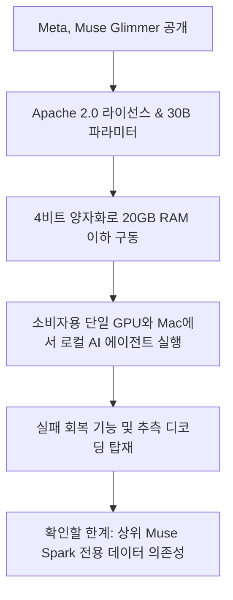
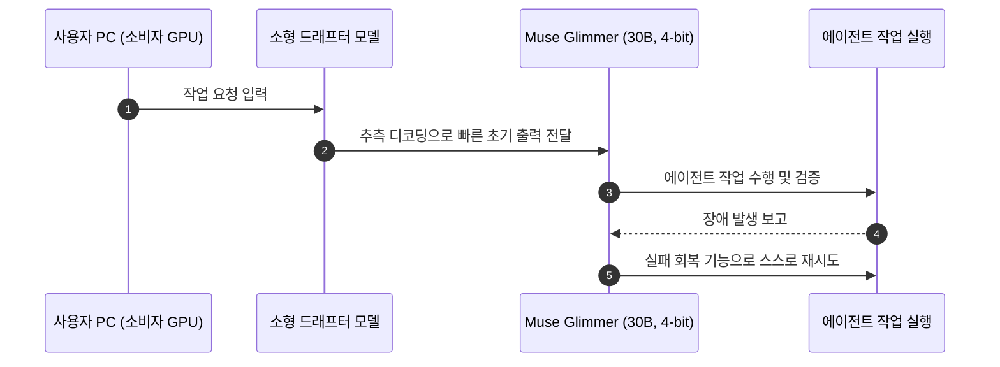
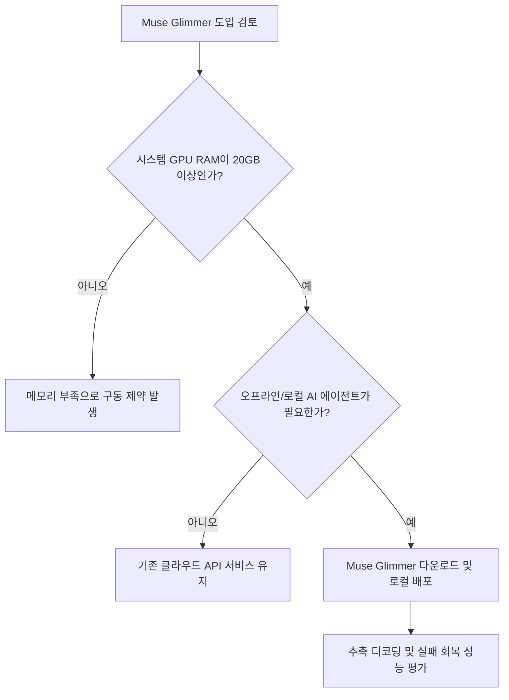

Muse Glimmer는 30B 에이전트 모델을 단일 소비자 GPU나 Apple Silicon 환경에서 직접 시험하려는 개발자에게 적합합니다. 다만 “20GB 이하”는 특정 4비트 구성의 모델 메모리 설명이지 모든 문맥 길이와 앱을 포함한 최소 시스템 사양은 아닙니다. 로컬 실행의 이점은 대상 하드웨어에서 속도, 정확도, 도구 권한과 전체 메모리를 확인했을 때 판단할 수 있습니다.

위 흐름도에서 보듯 이번 발표의 핵심은 거대한 클라우드 인프라 없이 내 컴퓨터 안에서 AI 에이전트를 직접 돌릴 수 있게 되었다는 점입니다.

## 무슨 일이 벌어진 걸까?

Meta가 2026년 8월 10일 개인용 PC와 Mac의 단일 소비자용 GPU에서 로컬로 실행 가능한 300억(30B) 파라미터 규모의 오픈소스 언어 모델 Muse Glimmer를 Apache 2.0 라이선스로 공개했습니다 <a href="#source-1" aria-label="Meta AI Research 출처">[1]</a>. 이번에 공개된 Muse Glimmer는 외부 클라우드 서버에 의존하지 않고 사용자의 개인 디바이스 안에서 AI 에이전트를 직접 작동시키도록 설계되었습니다 <a href="#source-2" aria-label="SiliconANGLE 출처">[2]</a>.

기술의 핵심은 메모리 효율성과 실행 속도 개선에 있습니다. Meta는 4비트 양자화(4-bit quantization) 기술을 적용하여 Muse Glimmer의 메모리 점유 용량을 20GB RAM 이하로 축소했습니다 <a href="#source-2" aria-label="SiliconANGLE 출처">[2]</a>. 이에 따라 비싼 기업용 클라우드 GPU 인프라를 빌리지 않고도 고성능 AI 에이전트를 로컬 환경에서 지연 시간 없이 실행할 수 있는 조건이 갖춰졌습니다 <a href="#source-2" aria-label="SiliconANGLE 출처">[2]</a>.

<figure class="news-source-image">
  
  <figcaption>SiliconANGLE가 원문과 함께 공개한 이미지입니다. <a href="https://siliconangle.com/2026/08/10/meta-releases-open-source-muse-glimmer-model-30b-parameters" target="_blank" rel="noopener noreferrer">출처: SiliconANGLE</a></figcaption>
</figure>

## 왜 지금 다들 이 이야기를 할까?

Meta의 Muse Glimmer 공개가 주목받는 이유는 비싼 클라우드 비용을 내지 않고도 일반 소비자용 하드웨어에서 저지연(Low-latency) 자율형 AI 에이전트를 구동할 수 있기 때문입니다 <a href="#source-2" aria-label="SiliconANGLE 출처">[2]</a>. 그동안 복잡한 연산과 도구 사용이 필수인 에이전트 모델은 막대한 메모리가 필요했지만, Muse Glimmer는 압축 기술과 구조 개선으로 이 한계를 극복했습니다 <a href="#source-1" aria-label="Meta AI Research 출처">[1]</a>.

속도와 실행 안정성을 동시에 높이기 위한 두 가지 핵심 기법이 적용되었습니다. 첫째는 '추측 디코딩(Speculative decoding)' 기법으로, 크기가 더 작은 드래프터(drafter) 모델을 함께 활용해 초기 텍스트 출력 생성 속도를 크게 올렸습니다 <a href="#source-2" aria-label="SiliconANGLE 출처">[2]</a>. 둘째는 에이전트가 작업 중 장애물을 만났을 때 스스로 오차를 복구하고 재시도하는 '실패 회복(Failure recovery)' 학습 기능입니다 <a href="#source-1" aria-label="Meta AI Research 출처">[1]</a>.

위 다이어그램처럼 소형 드래프터 모델이 초기 작성을 돕고, 본 모델이 오류 시 스스로 재시도하는 구조로 작동합니다. 또한 이 모델은 Meta의 비공개 고성능 모델인 Muse Spark 시리즈가 생성한 합성 데이터(Synthetic data)로 학습되어 30B라는 크기 대비 우수한 에이전트 수행 능력을 구현했습니다 <a href="#source-2" aria-label="SiliconANGLE 출처">[2]</a>.

## 그래서 우리에게 뭐가 달라질까?

개발자와 개인 사용자는 외부 API 비용이나 데이터 유출 걱정 없이 자신의 컴퓨터에서 온전히 작동하는 로컬 AI 에이전트를 구축할 수 있게 됩니다 <a href="#source-1" aria-label="Meta AI Research 출처">[1]</a>. 매달 누적되는 클라우드 GPU 사용료나 토큰당 결제 비용을 아낄 수 있으며, Apache 2.0 라이선스 덕분에 상용 서비스나 내부 프로젝트에 제한 없이 모델을 수정하여 도입할 수 있습니다 <a href="#source-1" aria-label="Meta AI Research 출처">[1]</a>.

제가 보기에 가장 피부에 와닿는 변화는 '응답 지연의 최소화'와 '민감 정보 보호'입니다. 외부 서버로 데이터를 보내지 않고 내 컴퓨터 안에서 연산이 완료되므로 반응 속도가 빠르고, 기밀 코드나 개인 데이터가 외부로 유출될 리스크가 근본적으로 차단됩니다 <a href="#source-2" aria-label="SiliconANGLE 출처">[2]</a>.

## 직접 써보거나 지켜볼 포인트

Muse Glimmer를 내 개발 환경이나 업무 시스템에 도입할지 판단하려면 보유한 그래픽 카드의 메모리 용량과 로컬 에이전트의 필요성을 먼저 체크해야 합니다 <a href="#source-2" aria-label="SiliconANGLE 출처">[2]</a>.

실제 테스트 시 꼭 살펴봐야 할 핵심 포인트 세 가지는 다음과 같습니다:

1. **20GB RAM 확보 여부**: 4비트 양자화로 압축되었지만 여전히 20GB RAM 근처의 메모리가 필요하므로, 단일 GPU나 Mac의 통합 메모리 용량이 충분한지 확인해야 합니다 <a href="#source-2" aria-label="SiliconANGLE 출처">[2]</a>.
2. **추측 디코딩 성능**: 소형 드래프터 모델이 연동되었을 때 첫 토큰 생성 속도가 실제로 얼마나 체감될 만큼 빠른지 테스트해볼 필요가 있습니다 <a href="#source-2" aria-label="SiliconANGLE 출처">[2]</a>.
3. **에이전트 자율 재시도**: 복잡한 작업 중 에러가 발생했을 때 실패 회복 메커니즘이 의도대로 동작하는지 확인해야 합니다 <a href="#source-1" aria-label="Meta AI Research 출처">[1]</a>.

## 20GB라는 수치를 실제 하드웨어 요구로 어떻게 바꿀까?

4비트 가중치가 20GB 아래에 들어간다는 설명과 운영체제, 런타임, KV 캐시까지 포함한 전체 메모리는 구분해야 합니다. 문맥이 길어질수록 실행 중 캐시가 커지고, 드래프터 모델을 함께 올리면 그 모델의 자원도 필요합니다. GPU 전용 메모리와 Mac 통합 메모리도 사용 방식이 다르므로 “RAM 20GB”라는 한 줄만으로 호환 여부를 확정하지 않는 편이 안전합니다.

시험할 때는 짧은 프롬프트로 모델 로드 후 남은 메모리를 확인하고, 실제 목표 문맥과 동시 요청 수를 단계적으로 늘립니다. 메모리 부족으로 스왑이 발생하면 모델이 실행되더라도 지연이 크게 늘 수 있습니다. 첫 토큰 시간, 생성 속도, 최대 메모리와 발열을 같은 양자화 파일, 런타임 조건에서 기록해야 다른 PC의 결과와 비교할 수 있습니다.

## 추측 디코딩과 실패 회복을 무엇으로 평가할까?

추측 디코딩의 이득은 드래프터가 본 모델의 다음 토큰을 잘 예측할 때 커집니다. 따라서 발표된 속도를 그대로 기대하기보다 드래프터를 켠 경우와 끈 경우의 첫 토큰 시간, 전체 처리량, 추가 메모리를 비교합니다. 출력 품질이 같다는 전제도 동일한 프롬프트와 생성 설정으로 확인해야 합니다.

실패 회복은 작업 성공을 보장하는 기능이 아니라 오류 뒤 다시 시도하는 행동을 학습했다는 설명입니다. 잘못된 명령을 같은 방식으로 반복하면 비용과 피해가 늘 수 있으므로 최대 단계 수, 재시도 횟수와 파일 변경 범위를 제한해야 합니다. 실패율뿐 아니라 불필요한 재시도와 사람이 되돌린 변경을 포함한 완료 작업당 시간을 기록하는 편이 유용합니다.

## 로컬 실행이면 데이터가 밖으로 나가지 않을까?

모델 추론이 로컬이어도 에이전트가 검색, 원격 저장소, 외부 도구를 호출하면 관련 데이터는 네트워크를 통과합니다. 텔레메트리와 업데이트 확인, 드래프터나 임베딩 모델의 별도 API 사용 여부도 살펴야 합니다. 민감한 코드로 시험하기 전 네트워크를 차단한 환경에서 핵심 기능이 유지되는지와 로그, 캐시에 입력이 얼마나 남는지 확인해야 합니다.

## 아직은 선을 그어야 할 부분

Muse Glimmer가 뛰어난 하드웨어 효율을 보여주지만, 수천억 파라미터급의 거대 클라우드 모델을 모든 영역에서 완전히 대체하는 것은 아닙니다. 이 모델은 Meta의 자체 비공개 모델인 Muse Spark가 만든 합성 데이터로 학습되었기 때문에, 원본 Muse Spark 수준의 지능이나 아주 까다로운 추론 능력에는 한계가 존재합니다 <a href="#source-2" aria-label="SiliconANGLE 출처">[2]</a>.

또한 4비트 양자화 과정을 거치며 메모리 사용량을 20GB 미만으로 낮춘 만큼, 16비트 원본 모델 대비 일부 미세한 정밀도 손실이 있을 수 있습니다 <a href="#source-2" aria-label="SiliconANGLE 출처">[2]</a>. 복잡한 분산 처리나 대규모 데이터 병렬 처리가 요구되는 초대형 기업용 워크로드에서는 여전히 클라우드 기반 인프라가 필수적이라는 점을 염두에 두어야 합니다 <a href="#source-1" aria-label="Meta AI Research 출처">[1]</a>.

<!-- primary-sources:start -->
## 원문과 버전 확인

- [발표 원문](https://research.meta.ai/blog/introducing-muse-glimmer-open-agentic-model)
- [SiliconANGLE](https://siliconangle.com/2026/08/10/meta-releases-open-source-muse-glimmer-model-30b-parameters)
<!-- primary-sources:end -->

<!-- internal-links:start -->
## 함께 읽으면 이해가 이어지는 글

- [로컬 LLM은 클라우드보다 쌀까: VRAM, 전력, 운영비 계산]() — 로컬 LLM의 양자화, 메모리 대역폭, KV 캐시를 이해하고, 하드웨어 구매 전에 품질, 동시성, 전력, 운영비를 비교하는 방법을 정리합니다.
- [Liquid AI, 스마트폰과 CPU에서 작동하는 로컬 에이전트 모델 LFM2.5-2.6B 공개]() — Liquid AI가 스마트폰 및 소비자용 CPU에서 로컬로 구동되는 26억 매개변수 온디바이스 에이전트 모델 LFM2.5-2.6B를 공개했습니다. 2.5GB 미만의 RAM 메모리로 128K 컨텍스트와 네이티브 툴 콜링을 지원하며…
- [Apple Mac Studio M5 Ultra 공개: 512GB 메모리와 로컬 AI 활용 조건]() — Apple은 2026년 8월 25일 M5 Max 및 M5 Ultra 칩을 탑재한 신형 Mac Studio 데스크톱을 공식 발표했습니다. M5 Ultra 모델은 최대 512GB 통합 메모리와 1.2TB/s 메모리 대역폭을 갖추어 외부…
<!-- internal-links:end -->

## 자주 묻는 질문

### Meta Muse Glimmer는 어떤 라이선스로 제공되며 상업적으로 쓸 수 있나요?

Muse Glimmer는 Apache 2.0 오픈소스 라이선스로 공개되어 상업적 이용 및 코드 수정이 완전히 허용됩니다. 2026년 8월 10일 발표된 300억 파라미터 모델로 개발자가 자유롭게 자체 서비스를 구축할 수 있습니다.

### Muse Glimmer를 내 PC에서 구동하기 위한 최소 하드웨어 사양은 어떻게 되나요?

4비트 양자화 기술을 적용해 메모리 점유율을 20GB RAM 이하로 낮추었으므로 단일 소비자용 GPU나 Mac에서 구동할 수 있습니다. 시스템의 여유 RAM 또는 그래픽 메모리가 최소 20GB 이상 확보되어야 안정적인 실행이 가능합니다.

### Muse Glimmer의 에이전트 속도와 작업 성공률을 높인 주요 기술은 무엇인가요?

소형 드래프터 모델을 사용하는 추측 디코딩으로 초기 출력 속도를 올렸고, 작업 중 오류가 발생하면 스스로 재시도하는 실패 회복 기법이 학습되어 있습니다. 또한 Meta의 Muse Spark 모델이 생성한 합성 데이터를 활용해 효율성을 극대화했습니다.

## 직접 확인한 원문

<ol class="checked-source-list">
  <li id="source-1"><a href="https://research.meta.ai/blog/introducing-muse-glimmer-open-agentic-model" target="_blank" rel="noopener noreferrer">Meta AI Research — Introducing Muse Glimmer: An Open Agentic Model That Runs on Your Device</a> (2026-08-10)</li>
  <li id="source-2"><a href="https://siliconangle.com/2026/08/10/meta-releases-open-source-muse-glimmer-model-30b-parameters" target="_blank" rel="noopener noreferrer">SiliconANGLE — Meta releases open-source Muse Glimmer model with 30B parameters</a> (2026-08-10)</li>
</ol>

> 이 글은 위 원문을 직접 확인해 작성했습니다. 가격, 기능 범위, 지역별 제공 여부는 게시 후 바뀔 수 있으니 실제 도입 전 공식 문서를 다시 확인하세요.
