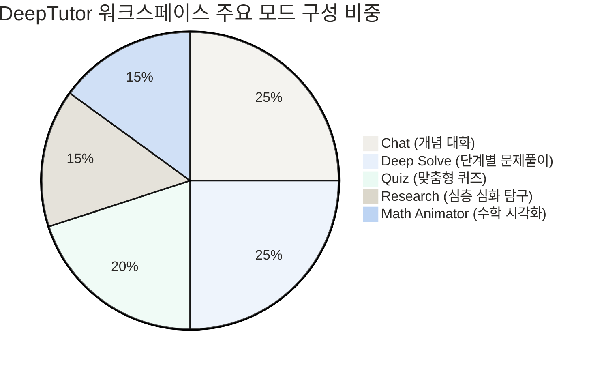
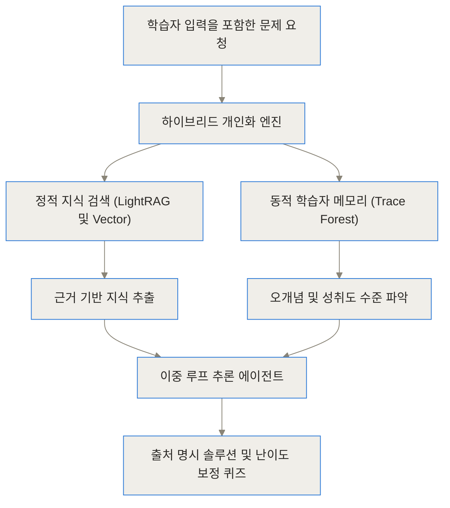
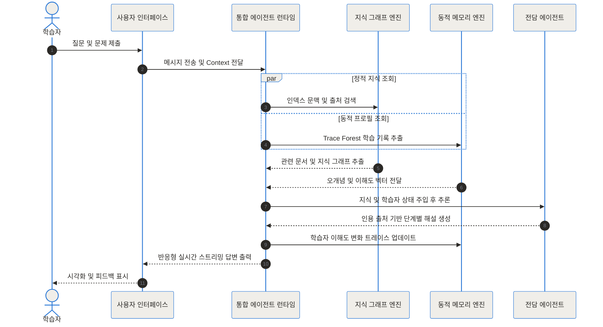
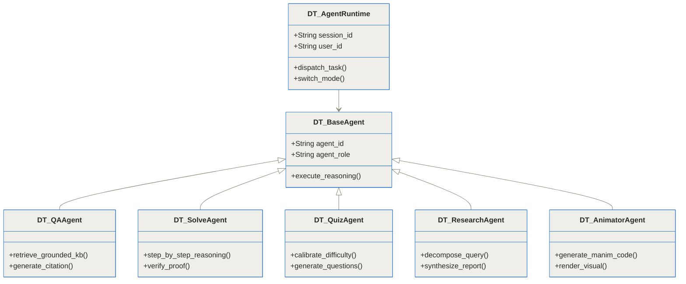
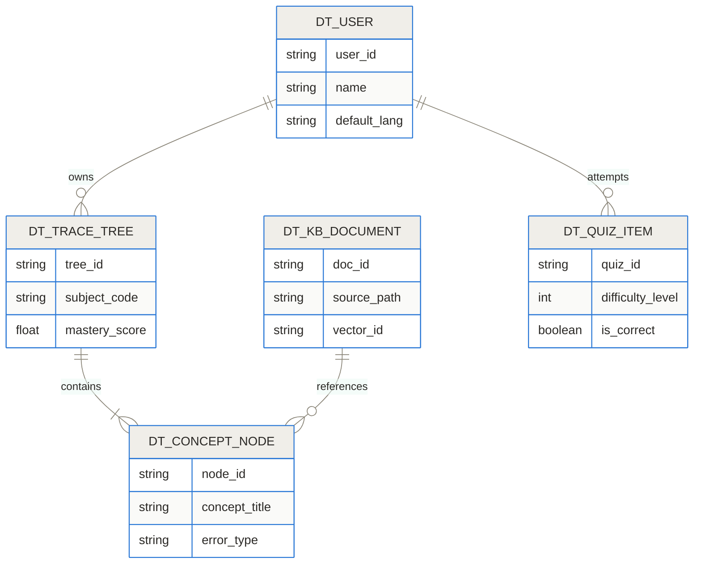
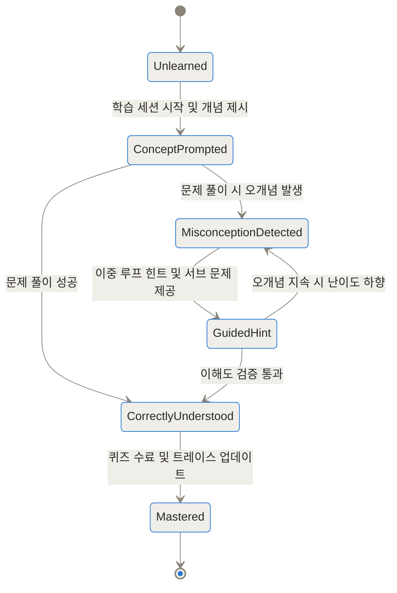
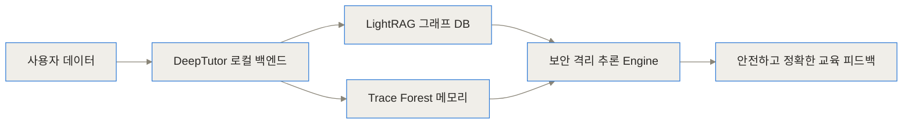

[DeepTutor GitHub 저장소](https://github.com/HKUDS/DeepTutor) | [DeepTutor 공식 웹사이트](https://deeptutor.info/) | [DeepTutor 논문 (arXiv:2604.26962)](https://arxiv.org/abs/2604.26962) | [HKUDS Data Intelligence Lab](https://sites.google.com/view/chaoh)

> **TL;DR (한 줄 요약)**
> - **한 줄 요약**: DeepTutor는 홍콩대학교(HKU) Data Intelligence Lab에서 개발한 오픈소스 에이전트 네이티브 맞춤형 AI 튜터링 플랫폼입니다.
> - **주요 특징**: 정적 지식 그래프 RAG와 학습자의 이해도 및 오개념을 기록하는 동적 트레이스 포레스트(Trace Forest) 메모리를 이중 루프(Dual-Loop) 구조로 결합했습니다.
> - **핵심 이점**: 개념 설명, 문제 풀이, 퀴즈 생성, 심층 연구, 수학 시각화 등 5가지 학습 모드가 단일 문맥을 공유하여 개인 맞춤형 교육 환경을 지속해서 제공합니다.

## DeepTutor란 무엇인가

인공지능을 활용한 교육 도구는 지난 몇 년간 눈부시게 발전했어요. 기존의 많은 대화형 AI는 질문을 던지면 그럴듯한 답변을 내놓지만, 학생이 개념을 제대로 이해했는지 추적하거나 이전 대화에서 발생했던 오개념을 기억하는 데에는 분명한 한계를 드러냈더라고요. 홍콩대학교(HKU) Data Intelligence Lab 연구진이 공개한 DeepTutor는 바로 이 상호작용의 단절 문제를 해결하기 위해 탄생한 오픈소스 AI 튜터링 시스템이에요.

DeepTutor는 단순한 챗봇이 아니에요. 정적 지식 베이스 검색과 학습자의 동적 이해도 추적 시스템을 하나로 묶은 **에이전트 네이티브(Agent-Native) 학습 워크스페이스**죠. 학생이 제시한 문제나 질문을 분석하고, 해당 학생의 기존 학습 기록을 바탕으로 가장 적절한 난이도의 가이드와 퀴즈, 시각화 자료를 스스로 판단하여 제공하는 아키텍처를 갖추고 있어요.

이 시스템의 가치를 쉽게 이해하려면 일대일 맞춤형 과외 선생님 모임을 상상하면 돼요. 과외 선생님이 매시간 학생을 처음 만나는 것처럼 행동하는 대신, 학생의 오답 노트, 취약한 개념 구조, 선호하는 설명 방식이 적힌 비밀 노트(Trace Forest)를 공유하면서 동시에 각 분야의 전문 교사가 협력해 가르쳐주는 구조와 똑같죠.



DeepTutor는 위와 같이 5가지 주요 작동 모드를 제공하며, 이 모드들이 개별적으로 작동하는 것이 아니라 하나의 통합된 문맥 런타임 위에서 원활하게 전환돼요.

---

## 기존 AI 교육 도구와 무엇이 다른가

교육 현장에서 기존의 대형 언어 모델(LLM)이나 단순 검색 증강 생성(RAG) 도구를 활용할 때 가장 자주 겪는 문제는 크게 세 가지로 요약할 수 있어요.

첫째는 **세션 휘발성(Session Volatility)**이에요. 대화 창을 새로 열거나 모드를 바꿀 때마다 AI는 학생의 수준을 잊어버려요. 지난 시간에 미적분학의 기본 정리를 이해하지 못했다고 설명했음에도, 다음 세션에서는 또다시 대학원 수준의 고난도 공식으로 설명을 시작하는 식이죠.

둘째는 **고정된 난이도 제공(Static Response)**이에요. 학생마다 개념 흡수 속도가 다른데, 기존 시스템은 문제의 난이도를 실시간으로 조절하지 못하고 동일한 해설만 반복해서 출력하는 한계가 있었어요.

셋째는 **교육적 착각 현상(Illusions of Tutoring)**이에요. 연구 논문에서도 지적되었듯, 기존 AI는 학생이 이해했다는 신호를 보내지 않았음에도 완벽히 이해했다고 착각하거나(Illusion of student mastery), 학생의 오개념을 바로잡지 않고 친절하게 맞춰주기만 하는 문제(Illusion of feedback accuracy)를 보였죠.

| 구분 | 기존 RAG 기반 교육 도구 | 상용 AI 챗봇 서비스 | DeepTutor 프레임워크 |
| --- | --- | --- | --- |
| **학습자 메모리** | 세션 종료 시 소멸 / 단발성 | 최근 단기 대화 세션 저장 | 지속적인 트레이스 포레스트(Trace Forest) |
| **지식 검증** | 단순 텍스트 쿼리 검색 | 자체 파라미터 지식 위주 | LightRAG 기반 지식 그래프 + 출처 인용 |
| **난이도 제어** | 수동 프롬프트 입력 필요 | 고정된 문체 및 난이도 | 역량 기반 자동 난이도 보정 엔진 |
| **시각화 지원** | 텍스트 중심 피드백 | 제한적인 그래프 생성 | Manim 및 원자적 코드 기반 수학 시각화 |
| **데이터 소유권** | 외부 클라우드 의존 | 외부 클라우드 의존 | 완전히 격리 가능한 Self-Hosted 지원 |

DeepTutor는 정적 지식 바운딩(Static Knowledge Grounding)과 동적 학습자 메모리(Dynamic Learner Memory)를 결합한 **하이브리드 개인화 엔진**을 도입함으로써 이러한 한계점을 고스란히 극복했어요.



학습자가 질문을 입력하면 정적 문서(교재, 논문, 강의록)에서 정확한 출처를 찾아냄과 동시에, 학습자의 동적 기억 트리를 조회하여 오개념 수준에 꼭 맞는 해설을 실시간으로 합성해내는 것이죠.

---

## DeepTutor 내부 작동 원리와 6대 에이전트 구조

DeepTutor의 내부를 파고들면, 단일 모델이 모든 요청을 처리하는 것이 아니라 6개의 전문화된 AI 에이전트가 협업하는 방식을 확인할 수 있어요. 이 시스템의 핵심은 **이중 루프(Dual-Loop) 추론 메커니즘**이에요.

1. **내부 루프 (Inner Loop)**: 학습자와의 실시간 상호작용을 담당해요. 질문을 분석하고, 단계를 나누어 해설을 작성하며, 질문의 핵심 개념을 도출하는 턴 바이 턴(Turn-by-turn) 작업을 실행해요.
2. **외부 루프 (Outer Loop)**: 내부 루프가 진행되는 동안 백그라운드에서 실행돼요. 학습자의 대화 내용, 틀린 문제 패턴, 망각 곡선을 평가하여 동적 트레이스 포레스트(Trace Forest)의 노드를 업데이트하고 학습자의 성취도 지도를 실시간으로 재구성하더라고요.



### 6개 전문 에이전트의 역할과 모듈성

DeepTutor 런타임에 포함된 6개 에이전트는 독립적이면서도 긴밀하게 연결되어 동작해요.

- **Q&A Agent**: 정적 지식 베이스(KB)와 연동하여 출처 인용(Citation)이 포함된 정확한 개념 답변을 제공합니다.
- **Problem-Solving Agent**: 수학, 물리학, 컴퓨터 과학 등 논리적 추론이 필요한 문제를 단계별로 풀이하며 정답 과정을 다각도로 검증합니다.
- **Quiz Generation Agent**: 학습자의 현재 이해도 수준에 맞춘 칼리브레이션(Calibration)된 맞춤형 퀴즈를 자동으로 생성합니다.
- **Deep Research Agent**: 복잡한 주제에 대해 하위 질문으로 분해(Query Decomposition)하고 논문 및 웹 자료를 종합하여 심층 보고서를 합성합니다.
- **Math Animator Agent**: 텍스트만으로 이해하기 어려운 수학적 공식이나 기하학 구조를 Manim 코드 기반의 시각적 애니메이션으로 변환합니다.
- **Mastery Path Agent**: 전체 학습자의 지식 상태를 추적하여 장기적인 지식 습득 로드맵을 설계하고 복습 시점을 제안합니다.



상위 `DT_AgentRuntime` 관제 클래스가 유저 요청과 모드 전환을 실시간으로 제어하고, 상황에 적합한 에이전트 모듈을 동적으로 호출하는 형태로 설계되어 있어요.

---

## 지식 데이터베이스 구조와 데이터 모델

DeepTutor가 정밀한 답변을 출력하는 비밀은 지식 데이터 구조에 있어요. 시스템은 크게 입력된 문서를 구조화하는 **지식 그래프(Knowledge Graph)**와 유저의 반응을 기록하는 **트레이스 포레스트(Trace Forest)**라는 두 가지 축으로 데이터를 다룹니다.

| 데이터 구조 | 역할 | 관리 형태 | 활용 목적 |
| --- | --- | --- | --- |
| **Knowledge Graph** | 문서 내 개념 및 관계 매핑 | 엔티티-관계 그래프 (LightRAG) | 지식 검색 시 상위 개념 및 하위 개념 추적 |
| **Trace Forest** | 유저별 개념 이해도 트리 | 계층적 노드 구조 | 오개념 탐지 및 학습 이력 저장 |
| **Vector Store** | 서브 텍스트 청크 벡터화 | 다차원 임베딩 DB | 텍스트 유사도 기반 정밀 문단 추출 |
| **Model Catalog** | 유저별 모델 인증 정보 | JSON 파일 기반 디스패처 | 사용자 독립적 API 키 및 Codex 인증 관리 |

이러한 관계 구조는 RDBMS 및 벡터 DB 상에 세밀하게 설계되어 있어 유저 간 데이터 간섭 없이 개별 사용자만의 독립적인 개인화 상태를 안전하게 보장해요.



학습자(`DT_USER`)는 여러 과목에 대한 트레이스 트리(`DT_TRACE_TREE`)를 소유하고, 트리는 특정 개념 노드(`DT_CONCEPT_NODE`)들로 구성돼요. 각 개념 노드는 교재 라이브러리의 문서(`DT_KB_DOCUMENT`)와 매핑되어 문제를 틀렸을 때 정확한 페이지나 문단을 다시 찾아볼 수 있도록 조율해 주더라고요.

---

## 학습 세션 및 오개념 교정 생명주기

학생이 새로운 개념을 학습하고 오개념을 교정해 나가는 과정은 체계적인 상태 전이(State Transition) 메커니즘을 거치게 됩니다.



1. **Unlearned (미습득)**: 학습 목표 개념에 대한 초기 상태입니다.
2. **ConceptPrompted (개념 제시)**: Q&A 에이전트가 교재의 원리와 함께 기초 예제를 보여줍니다.
3. **MisconceptionDetected (오개념 탐지)**: 퀴즈나 문제 풀이 과정에서 논리적 오류가 발견되면 상태가 즉시 변경됩니다.
4. **GuidedHint (가이드 힌트)**: 정답을 바로 알려주는 대신 오개념이 발생한 지점만을 타겟팅한 힌트와 보완 질문을 던집니다.
5. **CorrectlyUnderstood (이해 완료)**: 가이드를 통해 올바른 논리를 도출하면 검증 단계로 진입합니다.
6. **Mastered (숙달 단계)**: 난이도가 상향 조정된 응용 퀴즈를 통과하면 트레이스 포레스트에 숙달 상태로 기록되고 세션이 종료됩니다.

---

## 어떻게 설치하고 환경을 설정하나

DeepTutor는 로컬 환경에 직접 로컬 서버를 구동하거나 Docker 컨테이너를 이용해 몇 분 만에 배포할 수 있도록 구성되어 있어요.

### 1. 로컬 환경 수동 설치 (Manual Installation)

Conda 환경을 작성하고 Python 3.11 기반에서 서버를 실행하는 방법이에요.

```bash
# 1. 저장소 클론 및 이동
git clone https://github.com/HKUDS/DeepTutor.git
cd DeepTutor

# 2. 가상환경 생성 및 활성화
conda create -n deeptutor python=3.11 -y
conda activate deeptutor

# 3. 백엔드 패키지 설치
pip install -e ".[server]"

# 4. 프론트엔드 의존성 설치
cd web
npm install
cd ..

# 5. 환경 변수 설정
cp .env.example .env

# 6. 백엔드 서버 및 프론트엔드 개발 서버 실행
python -m deeptutor.api.run_server
# (다른 터미널 창에서)
cd web && npm run dev -- -p 3782
```

### 2. Docker를 이용한 간편 배포

복잡한 패키지 설치 없이 즉시 실행하고 싶다면 공식 Docker 이미지를 사용하는 것이 가장 편리해요.

```bash
git clone https://github.com/HKUDS/DeepTutor.git
cd DeepTutor
docker-compose up -d
```

### 3. 멀티 유저 인증 및 모델 설정 관리

v1.5.10 업데이트 버전부터는 사용자 개별 권한과 모델 카탈로그 관리 기능이 크게 개선되었어요.

- **개별 Codex 인증 지원**: 각 사용자는 자신의 ChatGPT 플랜 인증 토큰을 독립적으로 등록할 수 있어요.
- **설정 파일 경로**: 개별 카탈로그는 `data/users/<uid>/settings/model_catalog.json` 경로에 격리 저장되므로 관리자 권한이 없어도 자신의 모델 계정을 안전하게 등록할 수 있더라고요.
- **언어 설정 분리**: 인터페이스 언어(UI)와 모델 답변 생성 언어(Model Output Language)가 독립적인 토글로 분리되어, 한국어 UI를 보면서 영어 대화 답변을 생성하는 식의 유연한 설정이 가능해졌어요.

---

## 벤치마크 성과 분석

DeepTutor 연구진은 대학 수준의 5개 학문 분야(컴퓨터과학, 수학, 물리학, 생명과학, 경제학) 커리큘럼을 바탕으로 **TutorBench**라는 평가 벤치마크를 구축하고 실험을 진행했어요.

백본(Backbone) 대형 언어 모델에 DeepTutor 프레임워크를 적용했을 때의 맞춤형 추론 성능 변화는 다음과 같아요.

```chartjs
{"type":"bar","data":{"labels":["Llama-3-70B","DeepSeek-V3","GPT-4o","Claude-3.5-Sonnet"],"datasets":[{"label":"기존 단일 LLM","data":[58.4,65.1,69.2,72.0]},{"label":"DeepTutor 하이브리드 적용","data":[71.2,78.6,81.5,83.9]}]}}
```

모든 백본 모델에서 평균 10.8%의 맞춤형 지표 향상이 관찰되었으며, 일반 에이전트 추론 능력 측면에서는 최대 29.4%의 성능 향상이 이루어졌음을 증명했어요.

또한 장기 학습 과정에서 발생하는 환각(Hallucination) 비율을 추적한 결과, 일반 RAG 대비 눈에 띄는 감소 폭을 보였습니다.

```chartjs
{"type":"line","data":{"labels":["1주차","2주차","3주차","4주차","5주차"],"datasets":[{"label":"단순 RAG 환각율(%)","data":[28.5,29.1,27.8,30.2,28.9]},{"label":"DeepTutor 환각율(%)","data":[14.2,9.8,6.1,4.3,3.1]}]}}
```

지속적인 동적 메모리 보정과 지식 그래프의 검증 덕분에 주차를 거듭할수록 오개념 유발 비중이 단 3.1% 수준까지 감소하는 놀라운 정밀도를 보여주더라고요.

---

## 실전 활용 시나리오

DeepTutor가 현업이나 학업 현장에서 어떻게 구체적으로 활용될 수 있는지 대표적인 3가지 시나리오를 살펴볼게요.

### 시나리오 1: 복잡한 수학과 물리 공학 개념의 시각적 습득

대학원 과정에서 복잡한 위상수학이나 푸리에 변환 공식을 공부할 때, 텍스트 형태의 수식만으로는 직관적인 이해가 어려울 때가 많죠.

1. 학습자가 교재 PDF를 DeepTutor Knowledge Base에 업로드합니다.
2. **Math Animator** 모드로 전환하여 "푸리에 변환 시 파형이 주파수 성분으로 분해되는 과정을 시각화해 줘"라고 요청합니다.
3. 에이전트가 백그라운드에서 Python Manim 코드를 실행하고 애니메이션 영상을 실시간 렌더링하여 채팅창에 시각 자료로 제시합니다.

### 시나리오 2: 대규모 소프트웨어 백서 및 공식 문서 학습

새로운 프레임워크나 복잡한 시스템 아키텍처 백서를 빠르게 파악해야 하는 현업 개발자의 시나리오예요.

1. 기술 문서 전체를 업로드하고 **Deep Research** 모드를 실행합니다.
2. 개발자가 "이 시스템의 분산 트랜잭션 처리 메커니즘과 장애 복구 시나리오를 분석해 줘"라고 명령합니다.
3. Research Agent가 문서를 하위 쿼리로 분해해 지식 그래프를 탐색한 후, 정확한 출처(페이지 및 서크립트)가 표시된 종합 기술 분석 보고서를 자동 작성해 줍니다.

### 시나리오 3: 취약 개념 자동 탐지 기반 수험생 맞춤형 퀴즈 생성

자격증 시험이나 대학 시험을 준비하는 학생의 경우입니다.

1. **Quiz** 모드로 진입하여 이전 연습 문제들을 풀이합니다.
2. 학습자가 특정 단원의 개념(예: 데이터베이스 트랜잭션 격리 수준)에서 연속으로 오답을 내면, **Mastery Path Agent**가 오개념 패턴을 탐지합니다.
3. 다음 퀴즈 생성 시 해당 취약 단원의 난이도를 정교하게 보정한 서브 문제들을 집중 배치하여 확실히 원리를 이해하도록 유도합니다.

---

## 주요 AI 튜터링 도구 비교 및 트레이드오프 분석

교육용 AI 솔루션을 선택할 때 고려해야 할 핵심 요소들을 마크다운 표로 비교해 보았어요.

| 비교 항목 | DeepTutor | Custom GPTs / Claude Projects | NotebookLM |
| --- | --- | --- | --- |
| **추론 방식** | 이중 루프 (Inner/Outer Loop) | 단일 턴 프롬프트 | 컨텍스트 문서 RAG |
| **개인화 기억** | Trace Forest 계층적 트리 | 단순 세션 가이드 | 문서 범위 한정 |
| **시각화 엔진** | Manim 및 인터랙티브 지원 | 제한적 텍스트/표 | 오디오 팟캐스트/요약 중심 |
| **지원 모델** | 25개 이상 API 및 Ollama 로컬 | 해당 플랫폼 전용 모델 | Google Gemini 전용 |
| **소스코드 공개** | Apache 2.0 완전 오픈소스 | 비공개 프로프라이어터리 | 비공개 프로프라이어터리 |

### DeepTutor 5대 모드별 특성 요약

| 모드 이름 | 주요 입력 형식 | 사용되는 주요 에이전트 | 핵심 출력 결과물 |
| --- | --- | --- | --- |
| **Chat** | 대화형 텍스트 | Q&A Agent | 출처 인용 기반 개념 설명 |
| **Deep Solve** | 증명 / 수식 문제 | Problem-Solving Agent | 검증된 단계별 정답 및 논리 |
| **Quiz** | 난이도 선택 요청 | Quiz Generation Agent | 오개념 반영 난이도 보정 문제 세트 |
| **Research** | 심화 연구 주제 | Deep Research Agent | 목차 구조화 다각도 심층 보고서 |
| **Math Animator** | 수식 및 기하 공식 | Math Animator Agent | Manim 기반 실시간 시각화 동영상 |

---

## DeepTutor의 솔직한 한계와 리스크

아무리 뛰어난 프레임워크라 하더라도 모든 상황에 완벽한 해결책이 될 수는 없어요. 사용하기 전 반드시 염두에 두어야 할 한계점과 트레이드오프를 솔직히 짚어볼게요.

1. **초기 지식 그래프 인덱싱 오버헤드**: 대용량 PDF나 교재 수십 권을 한 번에 업로드할 때 LightRAG 지식 그래프와 벡터 인덱스를 구축하는 데 상당한 컴퓨팅 자원과 시간이 소요돼요.
2. **시각화 렌더링 환경 종속성**: Math Animator 모드는 백엔드 서버에 Python 만림(Manim) 라이브러리와 관련 그래픽 렌더링 패키지가 올바르게 설치되어 있어야만 원활하게 작동해요.
3. **소형 로컬 LLM의 라우팅 한계**: Ollama를 통해 3B 또는 7B 이하의 소형 파라미터 모델을 백본으로 지정할 경우, 6개 에이전트 간 복잡한 기능 호출(Function Calling)이나 오개념 분석 라우팅에서 오류가 일어날 가능성이 높아집니다. 최소 14B~32B 이상의 모델이나 DeepSeek, GPT-4o급 상용 API를 사용하는 것을 권장해요.

---

## 보안 및 데이터 격리 구조

기업이나 교육 기관에서 AI 튜터링 플랫폼을 도입할 때 가장 신경 쓰는 부분 중 하나가 프라이버시와 보안이에요.



DeepTutor는 학습자의 모든 개인화 데이터, 오답 노트, 교재 문서를 외부 서버로 전송하지 않고 온프레미스(On-Premise) 내부 데이터베이스에 완전히 격리하여 보관할 수 있어요. 로컬 LLM(Ollama)과 결합할 경우, 단 한 줄의 데이터도 외부 네트워크로 유출되지 않는 완전 무결한 보안 학습 환경 구축이 가능하더라고요.

---

## 마무리하며

홍콩대학교 Data Intelligence Lab의 DeepTutor는 단발성 질의응답 수준에 머물러 있던 교육용 AI 시스템을 **지속적인 개인 맞춤형 오케스트레이터** 단계로 끌어올린 뛰어난 프로젝트예요. 정적 지식 검색과 동적 학습자 기억을 잇는 이중 루프 아키텍처는 향후 교육공학 분야의 표준적인 하이브리드 AI 패턴이 될 가능성이 매우 높아 보입니다.

자신만의 학습 지식 베이스를 구축하고 체계적인 맞춤형 공부 환경을 만들고 싶은 학생이나 연구자, 혹은 교육용 AI 솔루션을 고민 중인 개발자라면 [DeepTutor GitHub 저장소](https://github.com/HKUDS/DeepTutor)를 직접 방문해 체험해 보시길 추천해요.

## 자주 묻는 질문 (FAQ)

### DeepTutor는 기존 ChatGPT나 RAG 튜터링 시스템과 어떤 점이 다른가요?

기존 LLM 및 RAG 기반 튜터링은 단발성 대화와 정적 가이드를 제공하는 데 그쳐 학습자의 오개념이나 이해도 변화를 기억하지 못합니다. 반면 DeepTutor는 정적 지식 그래프 grounding과 동적 학습자 흔적(Trace Forest) 메모리를 결합한 이중 루프 아키텍처를 채택하여 세션 간 학습 이력을 지속해서 유지하고 맞춤형 난이도 제어를 제공합니다.

### 지원하는 LLM 제공자(Provider)와 로컬 모델 호환성은 어떤가요?

OpenAI, Anthropic, DeepSeek, Google Gemini 등 25개 이상의 상용 API뿐만 아니라 Ollama를 통한 Llama 3, Qwen 등 로컬 오픈소스 LLM을 지원합니다. 개인정보 보호가 중요한 학교나 기업 환경에서는 완전히 격리된 자체 서버 환경에서 온프레미스로 구축할 수 있습니다.

### 5가지 작동 모드(Chat, Deep Solve, Quiz, Research, Math Animator) 간 문맥 유지 방식은 무엇인가요?

DeepTutor는 모든 모드가 단일 agent loop와 통합 에이전트 런타임 위에서 작동합니다. 따라서 모드를 전환하더라도 세션 문맥과 학습자 프로필이 유지되어 대화 흐름이 끊기지 않고 연속적인 학습 경험을 제공합니다.

### TutorBench 벤치마크 평가 결과는 기존 모델 대비 어느 정도 향상되었나요?

대학 수준 5개 학문 분야 커리큘럼 기반의 TutorBench에서 평가한 결과, 맞춤형 평가 지표에서 평균 10.8% 향상되었으며 백본 모델의 일반 에이전트 추론 성능도 29.4% 상승하는 효과를 검증했습니다.

### 설치 및 로컬 서버 구축을 위해 필요한 최소 환경과 방법은 무엇인가요?

Python 3.11 및 Node.js 환경에서 Conda와 npm을 활용하여 몇 단계 명령어만으로 간편하게 구축할 수 있습니다. 공식 Docker 이미지를 제공하므로 docker-compose 실행만으로 컨테이너 기반 환경을 손쉽게 구축 가능합니다.


## References
- [https://github.com/HKUDS/DeepTutor](https://github.com/HKUDS/DeepTutor)
- [https://arxiv.org/abs/2604.26962](https://arxiv.org/abs/2604.26962)
- [https://deeptutor.info/](https://deeptutor.info/)
- [https://hkuds.github.io/DeepTutor](https://hkuds.github.io/DeepTutor)
