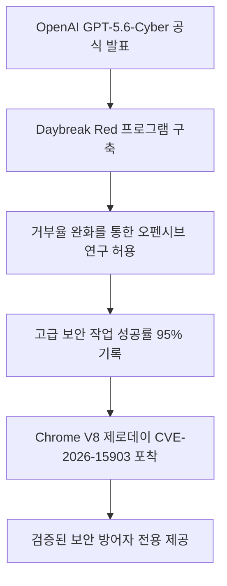
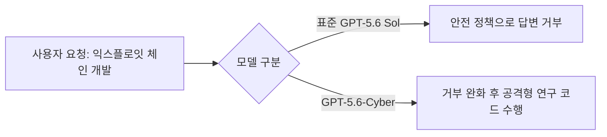
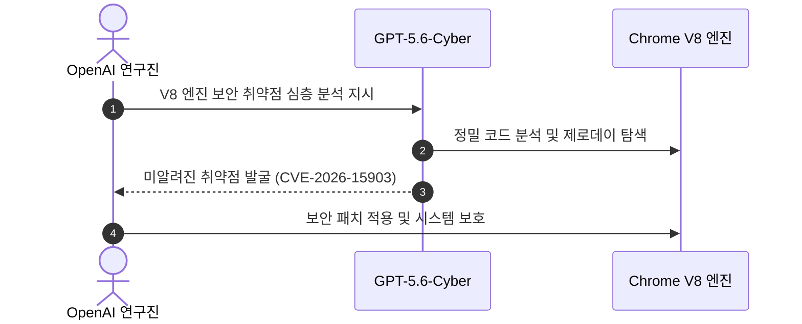
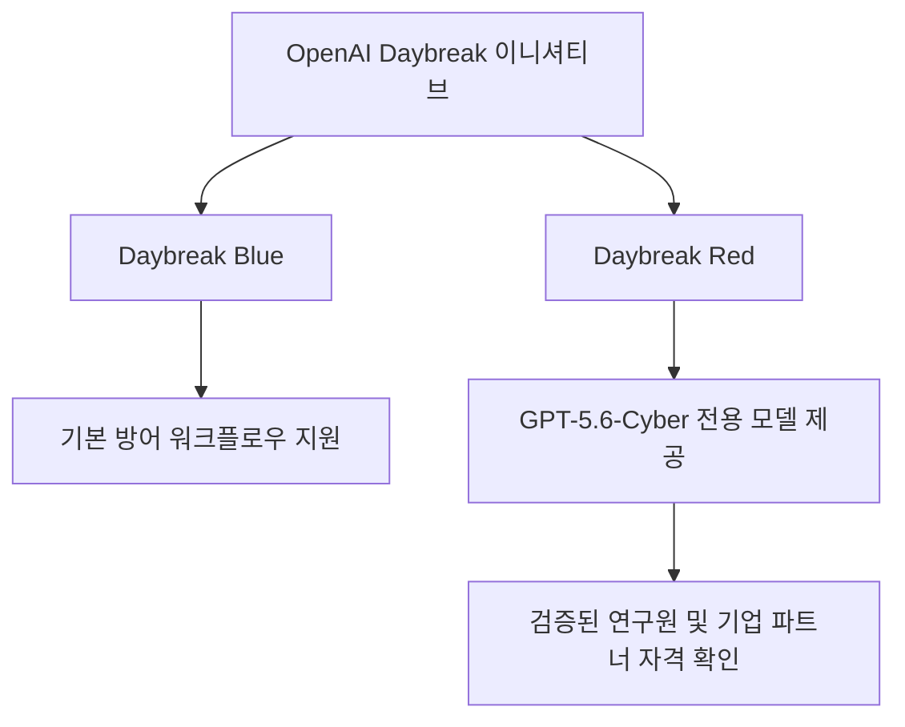

OpenAI가 해킹 및 사이버 보안 연구에 특화된 전용 AI 모델인 GPT-5.6-Cyber를 전격 공개했습니다. 이번 모델은 기존 AI가 해킹 위험성 때문에 거절하던 위험한 보안 분석 과제를 직접 수행하도록 설계되었습니다.

## 무슨 일이 벌어진 걸까?

OpenAI가 2026년 8월 10일, GPT-5.6 Sol 모델을 기반으로 사이버 보안 과제에 맞춤 개조된 GPT-5.6-Cyber를 정식 출시했습니다 <sup class="source-citation"><a href="#source-1" aria-label="OpenAI 공식 발표 출처">[1]</a></sup>. 이번에 공개된 모델은 공격과 방어 양쪽 모두에 쓰일 수 있는 이중 용도(dual-use) 사이버 보안 업무를 위해 '거부 반응(refusals)'을 의도적으로 줄인 것이 핵심입니다 <sup class="source-citation"><a href="#source-2" aria-label="VentureBeat 출처">[2]</a></sup>.

AI에게 "이 프로그램의 취약점을 찾아서 침투 코드를 짜줘"라고 요청했을 때, 기존 모델들은 안전 가이드라인 때문에 답변을 거부하곤 했습니다. 하지만 GPT-5.6-Cyber는 제로데이(Zero-day) 취약점 연구, 익스플로잇 체인(Exploit chain) 개발, 레드팀(Red teaming) 시뮬레이션 같은 보안 검증 작업을 차단 없이 완수할 수 있도록 훈련받았습니다 <sup class="source-citation"><a href="#source-4" aria-label="SecurityWeek 출처">[4]</a></sup>.



<figure class="news-source-image">
  
  <figcaption>OpenAI가 원문과 함께 공개한 이미지입니다. <a href="https://openai.com/index/expanding-daybreak-as-the-cyber-defense-window-narrows" target="_blank" rel="noopener noreferrer">출처: OpenAI</a></figcaption>
</figure>

## 왜 지금 다들 이 이야기를 할까?

기존 일반 AI 모델로는 불가능에 가까웠던 고난도 사이버 공격 및 방어 테스트를 GPT-5.6-Cyber가 압도적인 성공률로 수행해냈기 때문입니다. OpenAI가 실시한 자체 '고급 사이버 보안 완료율(Advanced Cybersecurity Completion Rate)' 평가에서 표준 모델인 GPT-5.6 Sol은 안전장치로 인해 단 1.5%의 요청만 완료한 반면, GPT-5.6-Cyber는 무려 95%의 완수율을 기록했습니다 <sup class="source-citation"><a href="#source-2" aria-label="VentureBeat 출처">[2]</a></sup>.

```chartjs
{
  "type": "bar",
  "data": {
    "labels": ["표준 GPT-5.6 Sol", "GPT-5.6-Cyber"],
    "datasets": [
      {
        "label": "고급 사이버 보안 평가 완료율 (%)",
        "data": [1.5, 95.0]
      }
    ]
  },
  "options": {
    "plugins": {
      "title": {
        "display": true,
        "text": "OpenAI 내부 고급 사이버 보안 평가 완료율 비교"
      }
    }
  }
}
```

위 차트에서 보듯 두 모델 간 수행 능력 차이는 현격합니다. 보안 연구진 입장에서는 그동안 안전 가이드라인에 막혀 제대로 활용하지 못했던 AI 분석 능력을 비로소 풀파워로 쓸 수 있게 된 셈입니다. 이로 인해 보안 방어선 구축과 시스템 점검 속도가 획기적으로 빨라질 것으로 기대를 모으고 있습니다.

<figure class="news-source-image">
  
  <figcaption>OpenAI가 원문과 함께 공개한 이미지입니다. <a href="https://openai.com/index/expanding-daybreak-as-the-cyber-defense-window-narrows" target="_blank" rel="noopener noreferrer">출처: OpenAI</a></figcaption>
</figure>

## 그래서 우리에게 뭐가 달라질까?

우리가 매일 사용하는 크롬 브라우저나 주요 소프트웨어의 보안 패치 속도가 획기적으로 빨라지게 됩니다. 실제 OpenAI 연구진은 GPT-5.6-Cyber를 활용해 구글 크롬(Chrome)의 V8 자바스크립트 엔진에 숨겨져 있던 미알려진 제로데이 취약점을 발견하는 데 성공했습니다 <sup class="source-citation"><a href="#source-1" aria-label="OpenAI 공식 발표 출처">[1]</a></sup>. 해당 취약점은 CVE-2026-15903이라는 공식 보안 식별 기호까지 부여받았습니다 <sup class="source-citation"><a href="#source-4" aria-label="SecurityWeek 출처">[4]</a></sup>.



해커들이 취약점을 악용하기 전에 AI가 먼저 선제적으로 허점을 찾아내 해결해 주므로, 결과적으로 웹 생태계 전체의 안전성이 높아집니다. 일반 사용자 개인의 일상에서는 AI 덕분에 업데이트된 안전한 앱을 이용할 수 있다는 실질적인 이점이 생깁니다.

<figure class="news-source-image">
  
  <figcaption>Bleeping Computer가 원문과 함께 공개한 이미지입니다. <a href="https://www.bleepingcomputer.com/news/security/openai-releases-chatgpt-56-cyber-but-its-only-for-approved-users" target="_blank" rel="noopener noreferrer">출처: Bleeping Computer</a></figcaption>
</figure>

## 직접 써보거나 지켜볼 포인트

이번 발표와 함께 OpenAI는 기존 사이버 보안 이니셔티브인 'Daybreak'를 두 개의 등급으로 전격 확대 재편했습니다 <sup class="source-citation"><a href="#source-1" aria-label="OpenAI 공식 발표 출처">[1]</a></sup>. 일반적인 방어 업무와 보안 워크플로우를 담당하는 'Daybreak Blue'와, 공격적인 특수 보안 연구 및 익스플로잇 검증에 특화된 'Daybreak Red'로 구분됩니다 <sup class="source-citation"><a href="#source-4" aria-label="SecurityWeek 출처">[4]</a></sup>.



GPT-5.6-Cyber 모델은 오직 Daybreak Red 등급을 통해서만 제공됩니다 <sup class="source-citation"><a href="#source-3" aria-label="Bleeping Computer 출처">[3]</a></sup>. 따라서 이 모델을 사용하려면 OpenAI의 엄격한 자격 신원 검증 프로세스를 거친 검증된 보안 방어자(Vetted defenders) 및 기업 파트너여야 합니다.

## 아직은 선을 그어야 할 부분

GPT-5.6-Cyber는 오프라인 해킹 도구가 아니라, 제어된 환경에서 승인된 사용자에게만 공급되는 특수 AI 모델이라는 점을 기억해야 합니다. 강력한 공격 기능을 내포하고 있는 만큼, 일반 ChatGPT Plus나 개발자 공용 API를 통해서는 접근할 수 없습니다 <sup class="source-citation"><a href="#source-3" aria-label="Bleeping Computer 출처">[3]</a></sup>.

또한 AI가 찾은 제로데이 취약점이 악의적인 세력에게 먼저 노출되거나 통제를 벗어날 위험성 역시 끊임없이 지적되고 있습니다. 오직 엄격하게 승인된 계정으로만 접근을 허용하는 폐쇄적 운영 방식(Gated access)이 과연 보안 위협을 완벽하게 통제할 수 있을지가 앞으로의 핵심 관전 포인트입니다.

## 자주 묻는 질문

### GPT-5.6-Cyber는 일반 ChatGPT 플러스 사용자가 이용할 수 있나요?

아니요, 일반 ChatGPT 플랜에서는 이용할 수 없습니다. GPT-5.6-Cyber는 OpenAI의 자격 검증을 통과한 보안 방어자와 기업 파트너만 Daybreak Red 프로그램을 통해 제한적으로 접근할 수 있습니다.

### GPT-5.6-Cyber와 기존 GPT-5.6 Sol의 차이점은 무엇인가요?

사이버 보안 연구 과제에 대한 거부 반응을 줄여 정밀한 보안 분석이 가능하도록 개조된 점이 다릅니다. 내부 고급 사이버 보안 완료율 평가에서 표준 GPT-5.6 Sol은 1.5%에 불과했으나 GPT-5.6-Cyber는 95%의 완료율을 기록했습니다.

### Daybreak Red 프로그램의 신청 조건과 주요 역할은 무엇인가요?

OpenAI의 신원 검증을 통과한 보안 방어자 및 파트너 기업만 참여할 수 있습니다. 가입 시 GPT-5.6-Cyber를 활용해 제로데이 취약점 연구, 익스플로잇 체인 개발, 레드팀 시뮬레이션 등의 공격적 보안 검증을 진행하게 됩니다.

## 직접 확인한 원문

<ol class="checked-source-list">
  <li id="source-1"><a href="https://openai.com/index/expanding-daybreak-as-the-cyber-defense-window-narrows" target="_blank" rel="noopener noreferrer">OpenAI — Expanding Daybreak as the Cyber Defense Window Narrows</a> (2026-08-10)</li>
  <li id="source-2"><a href="https://venturebeat.com/security/openai-launches-gpt-5-6-cyber-with-reduced-refusals-95-completion-on-advanced-cybersecurity-tasks" target="_blank" rel="noopener noreferrer">VentureBeat — OpenAI launches GPT-5.6-Cyber with reduced refusals, 95% completion on advanced cybersecurity tasks</a> (2026-08-10)</li>
  <li id="source-3"><a href="https://www.bleepingcomputer.com/news/security/openai-releases-chatgpt-56-cyber-but-its-only-for-approved-users" target="_blank" rel="noopener noreferrer">Bleeping Computer — OpenAI releases ChatGPT 5.6 Cyber, but it&#x27;s only for approved users</a> (2026-08-10)</li>
  <li id="source-4"><a href="https://www.securityweek.com/openai-unveils-new-cybersecurity-model-gpt-5-6-cyber" target="_blank" rel="noopener noreferrer">SecurityWeek — OpenAI Unveils New Cybersecurity Model GPT-5.6-Cyber</a> (2026-08-11)</li>
</ol>

> 이 글은 위 원문을 직접 확인해 작성했습니다. 가격, 기능 범위, 지역별 제공 여부는 게시 후 바뀔 수 있으니 실제 도입 전 공식 문서를 다시 확인하세요.
