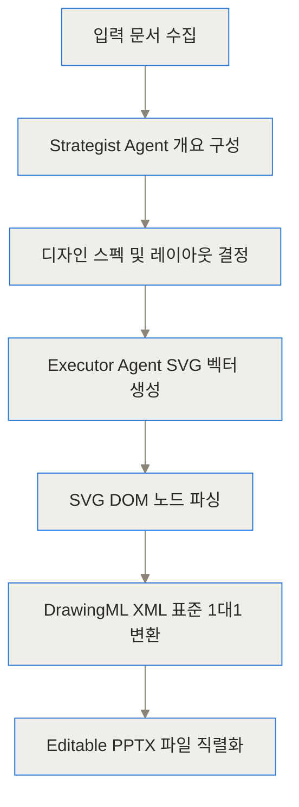
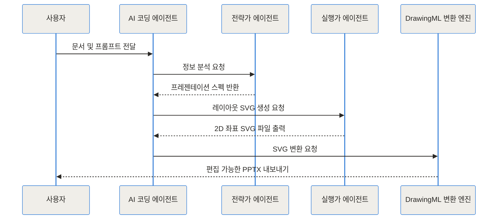
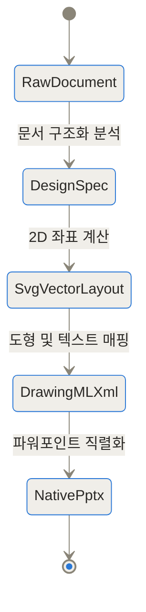
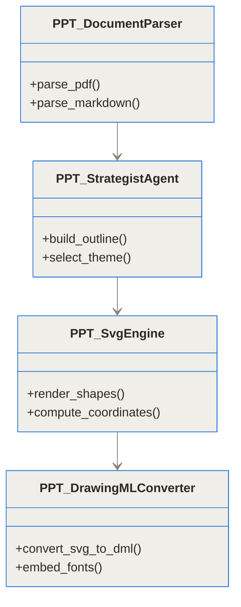
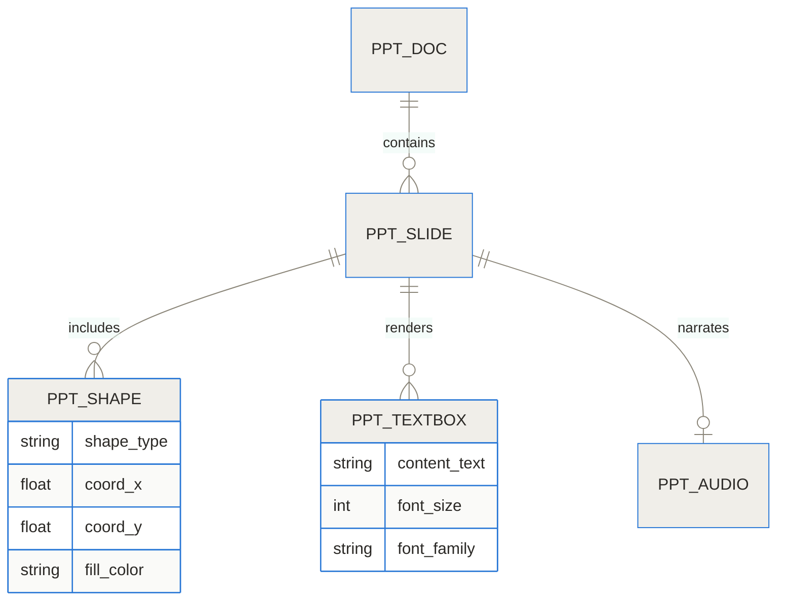
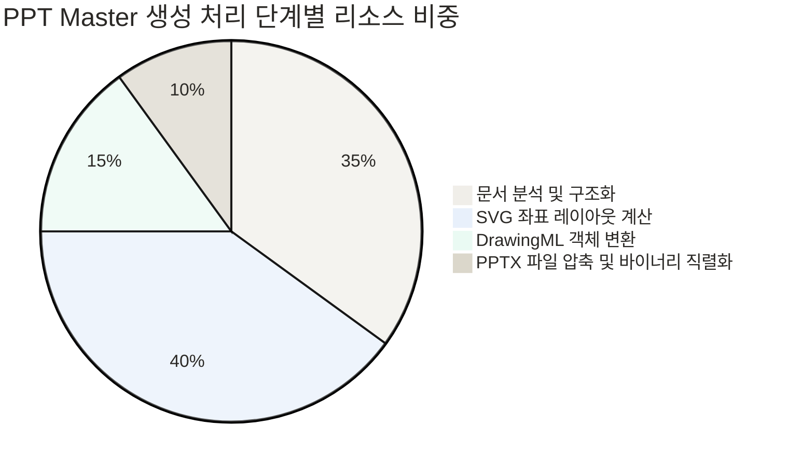
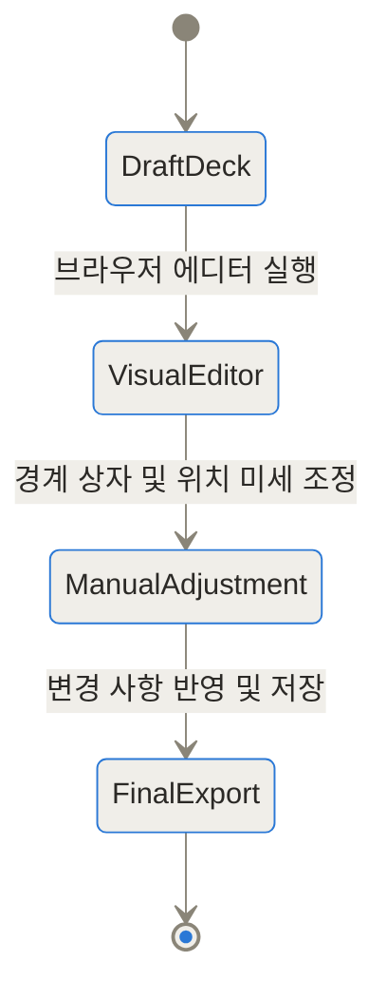

[PPT Master GitHub 저장소](https://github.com/hugohe3/ppt-master) | [PPT Master 공식 데모 갤러리](https://hugohe3.github.io/ppt-master/)

## 발표 자료 제작의 새로운 접근법과 한 줄 요약

TL;DR (3줄 요약)
- PPT Master는 문서나 주제를 입력하면 텍스트, 도형, 차트가 완전히 개별 편집 가능한 파워포인트(.pptx) 파일로 생성하는 오픈소스 AI 기술입니다.
- 기존 AI 도구들이 슬라이드를 수정 불가능한 통이미지나 깨진 구조로 만들던 문제를 SVG 2D 좌표 레이아웃 계산 및 DrawingML 벡터 직렬화를 통해 해결했습니다.
- Claude Code, Cursor 등 최신 AI 코딩 에이전트 스킬로 동작하며 로컬 파이썬 환경에서 실행되어 기업 내부 데이터 보안까지 안전하게 보호합니다.

기업이나 연구소에서 프레젠테이션 슬라이드를 만드는 일은 언제나 커다란 시간적 비용을 요구합니다. 보고서 원고나 연구 논문, 제품 기획서가 완성되어 있더라도 이를 파워포인트라는 시각적 매체에 맞추어 레이아웃을 짜고, 도형을 배치하며, 텍스트 상자를 정렬하는 작업은 별개의 중노동입니다.

최근 몇 년 동안 생성형 AI 기술이 발전하면서 많은 프레젠테이션 자동화 솔루션들이 시장에 등장했습니다. 그러나 실제 현업에서 이러한 도구들을 사용해 본 사람들은 한결같이 아쉬움을 토로합니다. 생성된 슬라이드가 보기에는 그럴듯하지만, 오타 하나를 고치거나 브랜드 컬러에 맞춰 도형 색상을 바꾸려고 하면 수정이 불가능하거나 전체 레이아웃이 깨져버리기 때문입니다.

PPT Master(개발자 Hugo He)는 이러한 현업의 고통점을 정확히 조준합니다. 단순한 텍스트 배치가 아니라 원본 문서의 맥락을 분석하고, 이를 파워포인트의 네이티브 벡터 표준인 DrawingML 규격으로 직접 번역해 냄으로써 글자 하나, 도형 하나까지 완전히 손댈 수 있는 가공 가능한 슬라이드를 만들어 냅니다.

## 기존 AI 발표 도구는 왜 수정이 불가능했을까

기존 AI 슬라이드 생성 도구들을 사용해 보면 한 가지 공통적인 한계를 마주하게 됩니다. 화면상에서는 대단히 화려해 보이지만 파일(.pptx)로 내보내기를 한 순간, 슬라이드 전체가 수정할 수 없는 고해상도 통이미지(Screenshot) 형태로 삽입되어 있거나 극도로 단순화된 텍스트 상자 몇 개만 덩그러니 남는 현상입니다.

왜 이런 현상이 발생할까요? 대부분의 생성형 AI는 2D 디자인 공간의 정교한 좌표계와 파워포인트 내부의 복잡한 XML 객체 구조를 직접 이해하지 못합니다. 따라서 웹 화면상에서 HTML/CSS나 캔버스로 화면을 그려낸 뒤 이를 캡처하여 파워포인트 배경으로 깔아버리는 손쉬운 편법을 택했던 것입니다. 이러한 '통이미지 스크린샷 렌더링' 방식은 디자이너나 기획자가 세부 요소를 수정하는 길을 완전히 막아버립니다.

전문 용어인 DrawingML(파워포인트 내부에서 벡터 도형과 텍스트, 애니메이션 효과를 정의하고 그리는 마이크로소프트의 XML 표준)은 작성 규칙이 매우 까다롭고 정교합니다. LLM이 직접 DrawingML 코드 세트를 한 번에 완벽히 생성해내는 것은 환각 현상(Hallucination)과 좌표 오차 때문에 거의 불가능에 가깝습니다.

이것은 마치 완성된 인화 사진을 받은 상황과 같아요. 사진 속 인물의 옷 색상을 바꾸고 싶어도 사진 자체를 새로 찍지 않는 한 부분적인 수정이 불가능한 것과 같습니다. 반면 PPT Master가 제공하는 결과물은 모든 파츠가 살아있는 '레고 조립 키트'와 같습니다. 완성된 상태로 제공되지만 언제든 사용자가 레고 블록 하나를 뽑아 색상을 바꾸거나 위치를 이동시킬 수 있죠.

## PPT Master는 어떻게 문서를 진짜 파워포인트 개체로 변환하나

PPT Master는 LLM이 직접 DrawingML을 생성할 때 발생하는 정확도 문제를 해결하기 위해 'SVG(Scalable Vector Graphics)'를 중간 매개 레이어(Intermediate Format)로 채택했습니다. SVG와 파워포인트의 DrawingML은 모두 절대 좌표 기반의 2D 벡터 구조라는 결정적인 공통점을 가지고 있습니다.

전체 변환 흐름은 4단계의 치밀한 파이프라인으로 구성됩니다. 가장 먼저 문서 수집 및 전략 분석 단계에서는 Strategist Agent가 입력된 PDF, 마크다운, DOCX 문서의 핵심 논리와 목차를 파악하고 각 슬라이드별 디자인 스펙을 수립합니다.

두 번째 단계에서는 Executor Agent가 수립된 디자인 스펙을 바탕으로 절대 좌표 기반의 SVG 2D 레이아웃을 생성합니다. 텍스트의 위치, 상자의 크기, 색상 그래디언트, 선의 두께가 SVG DOM 노드로 계산됩니다.

세 번째 단계는 PPT Master의 핵심인 변환 엔진의 동작입니다. 생성된 SVG 노드들을 하나씩 파싱하여 파워포인트 고유의 DrawingML XML 태그로 1대1 정밀 매핑합니다. 이 과정에서 SVG의 rect, circle, path, text 태그들이 파워포인트 내부의 정밀한 벡터 도형 및 네이티브 텍스트 상자로 전환됩니다.

마지막 네 번째 단계에서는 파이썬의 python-pptx 엔진 및 로컬 비주얼 에디터 모듈을 통해 최종 .pptx 파일로 직렬화하여 내보냅니다. 이 4단계 구조 덕분에 사용자는 완성된 슬라이드의 글꼴, 글자 크기, 도형 위치, 그래디언트까지 자유롭게 편집할 수 있게 됩니다.



에이전트 사이의 상호작용과 변환 흐름은 다음 순서도와 상태 전이도에서 더욱 명확하게 드러납니다.





## 내부 아키텍처와 핵심 데이터 구조

PPT Master의 내부 아키텍처는 결합도는 낮추고 확장성은 높인 모듈형 구조를 취하고 있습니다. 파이썬 환경의 PyMuPDF(fitz) 라이브러리를 통해 다양한 입력 문서를 추출하며, 내부 템플릿 엔진과 레이아웃 연산 엔진이 상호작용합니다.

자체 데이터 모델은 문서 전체를 관장하는 객체부터 개별 슬라이드, 슬라이드 내부의 벡터 도형, 텍스트 상자, 그리고 발표자 노트 기반의 오디오 트랙까지 계층적으로 정의되어 있습니다.



엔티티 관계도(ERD)를 살펴보면 데이터가 파워포인트 객체로 변환될 때 어떤 스키마를 가지는지 파악할 수 있습니다.



전체 작업 파이프라인에서 각 단계가 차지하는 리소스 및 연산 비중은 아래 원형 그래프와 같습니다.



PPT Master의 또 다른 놀라운 기능은 슬라이드별 '발표자 노트(Speaker Notes)'를 인식하여 음성 나레이션 오디오를 생성하고 파워포인트 슬라이드 내부에 내장시키는 기능입니다. 이 오디오 연동 파이프라인은 다음과 같이 동작합니다.


만약 생성 직후 레이아웃의 경계 상자(Bounding Box)나 텍스트 위치에 미세한 겹침이 발생하더라도 걱정할 필요가 없습니다. PPT Master는 브라우저 기반의 로컬 비주얼 에디터를 내장하고 있어, 사용자가 파워포인트를 열기 전에 레이아웃을 마우스 드래그로 손쉽게 교정할 수 있는 생명주기를 지원합니다.



## 수치로 보는 성능과 개체 수정 가능성

그렇다면 기존 AI 프레젠테이션 서비스들과 비교했을 때 PPT Master의 개체 수정 가능 수준은 어느 정도일까요? 차트를 통해 직관적으로 확인할 수 있습니다.

```chartjs
{"type":"bar","data":{"labels":["기존 이미지 생성 AI","HTML 스크린샷 도구","PPT Master"],"datasets":[{"label":"개별 도형 및 텍스트 수정 가능 비율 (%)","data":[0,15,100]}]}}
```

웹 기반 SaaS 생성 도구들의 경우 수정을 위해 해당 플랫폼의 유료 구독을 유지해야 하거나 파워포인트로 내보낼 때 레이아웃 파괴가 빈번히 발생하지만, PPT Master는 SVG-DrawingML 변환 파이프라인을 거치므로 100% 네이티브 객체 편집이 보장됩니다.

슬라이드 10장을 생성할 때 소비되는 전체 파이프라인의 처리 소요 시간 비중은 다음과 같이 집계됩니다.

```chartjs
{"type":"bar","data":{"labels":["문서 전략 분석","SVG 좌표 렌더링","DrawingML 변환","PPTX 파싱 내보내기"],"datasets":[{"label":"단계별 처리 시간 비중 (%)","data":[40,35,15,10]}]}}
```

## 어떻게 설치하고 바로 실행하나

PPT Master는 로컬 개발 환경이나 AI 코딩 에이전트(Claude Code, Cursor 등) 환경에서 단 몇 분 만에 설치하고 구동할 수 있습니다.

우선 시스템에 Python 3.10 이상이 설치되어 있어야 합니다. 터미널을 열고 저장소를 복사한 뒤 필요 라이브러리를 설치하는 과정은 다음과 같습니다.

1. 저장소 클론 및 이동
`git clone [https://github.com/hugohe3/ppt-master.git](https://github.com/hugohe3/ppt-master.git)`
`cd ppt-master`

2. 파이썬 의존성 패키지 설치
`pip install -r requirements.txt`

3. 코딩 에이전트 스킬 추가 (Claude Code / Cursor 환경)
`npx skills add hugohe3/ppt-master`

설치가 완료된 후에는 파이썬 스크립트나 AI 에이전트 대화창에 직접 자연어로 지시하여 생성을 시작할 수 있습니다. 스크립트 기반 실행의 기초 예시는 다음과 같이 간단합니다.

```python
import pptx
from ppt_master import PresentationGenerator

# 원본 문서 지정 및 생성기 초기화
generator = PresentationGenerator(
    source_doc="research_paper.pdf",
    theme="modern_dark",
    output_path="exports/final_presentation.pptx"
)

# 파이프라인 실행: 전략 수립 -> SVG 생성 -> DrawingML 직렬화
generator.run_pipeline()
print("슬라이드 생성 완료: exports/final_presentation.pptx")
```

AI 에이전트 환경(예: Claude Code)에서는 대화창에 단 한 문장만 입력해도 전체 파이프라인이 로컬에서 자동으로 돌아갑니다. 예를 들어 "docs/report.pdf 파일 내용을 바탕으로 5장짜리 사업 제안 PPT 만들어줘"라고 요청하면, 로컬 엔진이 작동하며 exports 폴더에 개별 수치가 들어있는 완전한 파워포인트를 생성해 냅니다.

## 실전 업무에서 PPT Master를 어떻게 활용하나

실제 현업에서는 다양한 관점의 프레젠테이션 자동화 요구가 존재합니다. PPT Master가 강력한 위력을 발휘하는 세 가지 주요 실전 시나리오를 살펴봅니다.

첫 번째 시나리오는 기술 보고서 및 학술 논문(PDF)의 슬라이드화입니다. 20쪽이 넘는 긴 PDF 논문을 입력으로 넣으면, Strategist Agent가 논문의 문제 제기, 핵심 가설, 실험 결과, 결론을 추려내어 8장 분량의 발표용 덱으로 구성합니다. 이 과정에서 논문의 수치 데이터는 파워포인트의 네이티브 표와 데이터 차트로 전환됩니다.


두 번째 시나리오는 기업 고유 브랜딩 템플릿(.pptx) 준수 시나리오입니다. 많은 기업들은 회사 고유의 폰트, 로고 위치, 슬라이드 마스터 레이아웃 규격을 엄격히 제한합니다. PPT Master는 커스텀 `.pptx` 파일 경로를 지정하여 기존 템플릿의 슬라이드 마스터 스펙을 인지하고, 그 위에 레이아웃과 요소를 배치하므로 사내 디자인 가이드라인을 완벽하게 준수할 수 있습니다.

세 번째 시나리오는 자율 학습형 교육 자료 제작입니다. 슬라이드 생성 시 각 페이지의 하단 발표자 노트를 기반으로 TTS 오디오 파일이 자동 생성되고 슬라이드 객체에 연결됩니다. 완성된 파워포인트 파일은 슬라이드 쇼를 실행하는 순간 자동으로 오디오 나레이션이 나와 발표자 없이도 신규 입사자 교육용 자료나 온라인 제품 설명 자료로 즉시 활용될 수 있습니다.

## 다른 AI 프레젠테이션 솔루션과 무엇이 다른가

현재 시장의 주요 프레젠테이션 자동화 솔루션들과 PPT Master를 다각도로 비교해 보면 구조적인 차이가 명확히 드러납니다.

| 비교 항목 | 기존 웹 기반 AI 서비스 (Gamma, Tome 등) | 일반 HTML/스크린샷 내보내기 도구 | PPT Master (hugohe3/ppt-master) |
| --- | --- | --- | --- |
| 출력 파일 형식 | 고유 웹 URL 또는 단순 PDF/PPTX | 스크린샷 이미지가 포함된 PPTX | 100% 네이티브 DrawingML PPTX |
| 개체 수정 가능 여부 | 웹 플랫폼 내에서만 제한적 수정 | 불가능 (통이미지) | 파워포인트에서 모든 글자/도형 완전 수정 |
| 데이터 보안 | 외부 클라우드 서버로 문서 전송 | 외부 클라우드 서버 전송 | 로컬 환경 실행으로 외부 유출 없음 |
| 비용 모델 | 월 구독료 발생 (SaaS) | 월 구독료 발생 | 오픈소스 (MIT 라이선스, 무료) |
| 커스텀 템플릿 | 플랫폼 제공 템플릿만 사용 | 적용 불가 | 기존 자사 .pptx 템플릿 완벽 지원 |
| 오디오 나레이션 | 별도 연동 필요 | 지원 불가 | 발표자 노트 기반 내장 오디오 자동 구성 |

이어서 솔루션 채택 시 고려해야 할 장단점 및 트레이드오프 분석 결과입니다.

| 구분 | 주요 특징 및 장점 | 고려해야 할 한계 및 단점 |
| --- | --- | --- |
| 기능적 측면 | 도형, 텍스트, 차트, 오디오 개체까지 살아있는 PPTX 출력 | 초기 환경 구축을 위한 파이썬/CLI 이해도 필요 |
| 보안 및 경제성 | 완전 로컬 구동 가능, 라이선스 비용 없음 | LLM API 비용(API 키 사용 시)은 별도 발생 |
| 디자인 자유도 | 파워포인트 내에서 디자이너가 2차 가공 가능 | 3D 입체 효과나 복잡한 특수 애니메이션 제약 |

## PPT Master가 가진 한계와 개선점은 무엇인가

PPT Master는 혁신적인 도구이지만 기술적 트레이드오프와 한계점도 분명히 존재합니다. 사용 전에 다음 사항들을 솔직하게 고려해야 합니다.

첫째, 사용되는 프롬프트와 LLM 모델의 성능에 따른 초기 레이아웃 기복입니다. 전략가(Strategist) 및 실행가(Executor) 역할을 맡은 LLM이 좌표 연산을 잘못할 경우, 텍스트 상자가 일부 겹치거나 도형이 어색하게 배치될 수 있습니다. 이를 보완하기 위해 내장된 비주얼 에디터로 미세 조정을 거쳐야 하는 경우가 생깁니다.

둘째, 개발자 중심의 실행 환경입니다. Web GUI 단독 프로그램이 아닌 파이썬 환경과 AI 코딩 에이전트를 기반으로 동작하기 때문에, 프로그래밍 환경에 익숙하지 않은 순수 비개발자 직군에게는 초기 설치와 실행 장벽이 다소 느껴질 수 있습니다.

셋째, 복잡한 파워포인트 애니메이션과 3D 그래픽의 한계입니다. SVG 표준을 기초로 변환을 수행하므로 파워포인트 고유의 매우 복잡한 3D 회전 효과나 다단계 시퀀스 애니메이션은 1대1로 구현되지 않을 수 있습니다. 일반적인 비즈니스 발표 자료나 학술 자료 수준에 가장 최적화되어 있습니다.

## 개발자와 기획자에게 주는 시사점과 결론

PPT Master는 'AI 생성 결과물은 실제 업무에서 수정할 수 없다'는 기존의 고정관념을 파괴한 대표적인 오픈소스 혁신 사례입니다. 이미지 생성에만 치중하던 기존 프레젠테이션 AI 분야에서 SVG 좌표계와 파워포인트 내부 DrawingML 표준을 잇는 매개 레이어를 도입해 실용성을 극대화했습니다.

사내 보고서나 발표 자료 제작으로 매주 수십 시간을 허비하던 기획자와 개발자에게 PPT Master는 진정한 생산성 도구가 되어 줄 것입니다. 무엇보다 로컬 환경에서 구동되어 데이터 유출 우려가 없고, 파워포인트에서 최종 마무리를 직접 손으로 다듬을 수 있다는 점에서 현업 실무진에게 가장 정직하고 현실적인 솔루션이라 평할 수 있습니다.

## 자주 묻는 질문 (FAQ)

### PPT Master로 만든 슬라이드는 파워포인트에서 정말 글자 하나까지 다 수정되나요?

네, 그렇습니다. PPT Master는 슬라이드를 스크린샷 이미지로 변환하지 않고 파워포인트 내부 고유 규격인 DrawingML로 텍스트 상자, 배경 도형, 선, 표를 직접 직렬화합니다. 따라서 파워포인트나 키노트에서 개별 글자를 수정하거나 도형 색상을 언제든지 바꿀 수 있습니다.

### 파이썬 개발 환경이나 코딩 지식이 없어도 사용할 수 있나요?

기본적으로 Python 3.10 이상과 관련 라이브러리 설치가 필요하지만, Claude Code나 Cursor 같은 AI 코딩 에이전트와 함께 사용할 수 있도록 스킬 형태 명령을 지원합니다. 안내된 설치 가이드를 따라 한 번 환경을 갖춰두면 이후에는 자연어 명령어만으로 동작시킬 수 있습니다.

### 기존에 회사에서 사용하던 자사 전용 PPTX 템플릿을 그대로 적용할 수 있나요?

네, 완벽하게 지원합니다. PPT Master는 커스텀 .pptx 템플릿 엔지니어링 기능을 갖추고 있습니다. 회사의 고유 브랜드 색상, 로고 위치, 지정 폰트가 들어간 슬라이드 마스터 파일 경로를 설정하면 해당 규격에 맞춰 슬라이드 요소를 자동 배열합니다.

### 인터넷이 연결되지 않은 폐쇄망이나 로컬 환경에서도 작동하나요?

네, 가능합니다. PPT Master의 변환 엔진은 로컬 파이썬 환경에서 동작하므로, Ollama나 vLLM 등을 통해 로컬 LLM 서버(예: Qwen 시리즈)와 연동할 경우 외부 네트워크 연결 없이 완전한 보안 상태에서 프레젠테이션 자료를 만들어냅니다.

### 슬라이드 음성 나레이션 기능은 어떻게 작동하나요?

AI가 슬라이드별 발표자 노트(Speaker Notes)를 작성한 뒤 TTS 엔진을 거쳐 오디오 파일로 생성합니다. 이 오디오 트랙이 파워포인트 각 슬라이드 내부의 네이티브 오디오 개체로 자동 연결되어, 발표 자료가 자동으로 음성 설명과 함께 재생되도록 구현됩니다.


## References
- [https://github.com/hugohe3/ppt-master](https://github.com/hugohe3/ppt-master)
- [https://hugohe3.github.io/ppt-master/](https://hugohe3.github.io/ppt-master/)
