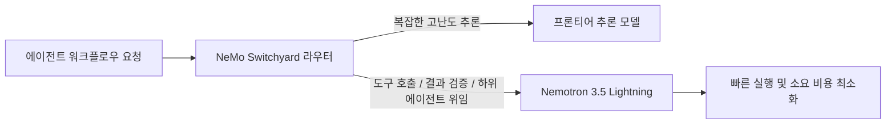
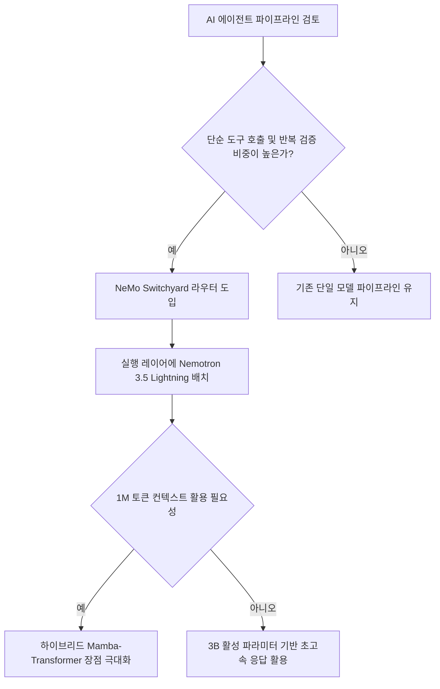
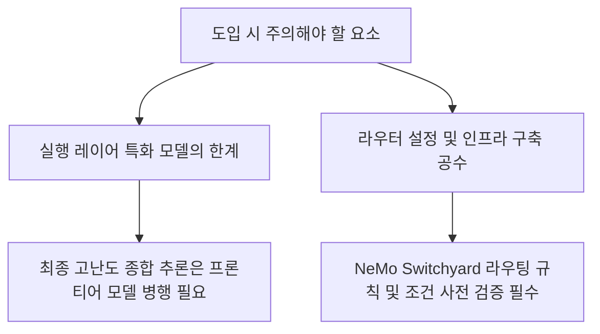

이 다이어그램은 이번 Nvidia 발표의 전체 구조와 핵심 가치를 요약합니다.

## 무슨 일이 벌어진 걸까?

Nvidia가 2026년 8월 11일 자율 에이전트 구축을 위한 오픈 모델 Nemotron 3.5 Lightning과 오픈소스 모델 라우팅 라이브러리 NeMo Switchyard를 동시에 공식 출시했습니다 <a href="#source-1" aria-label="NVIDIA Blog 출처">[1]</a>. 이번 발표의 핵심은 복잡한 AI 에이전트 시스템에서 매번 비싼 대형 언어 모델을 호출하지 않고도, 작업을 똑똑하게 분배하여 실행할 수 있는 고성능·고효율 생태계를 구축했다는 점입니다 <a href="#source-2" aria-label="NVIDIA Developer Blog 출처">[2]</a>.

Nemotron 3.5 Lightning은 전체 300억 개(30B)의 파라미터를 갖춘 전문가 혼합(Mixture-of-Experts, MoE) 구조의 오픈 모델이지만, 순방향 전파(forward pass) 시에는 단 30억 개(3B)의 파라미터만 활성화됩니다 <a href="#source-2" aria-label="NVIDIA Developer Blog 출처">[2]</a>. 함께 공개된 NeMo Switchyard는 에이전트의 작업 단계마다 가장 적절하고 비용 효율적인 모델을 찾아 자동으로 연결해 주는 라우터 역할을 수행합니다 <a href="#source-1" aria-label="NVIDIA Blog 출처">[1]</a>.

위의 흐름도에서 보듯, NeMo Switchyard는 작업의 난이도에 따라 프론티어 모델과 Nemotron 3.5 Lightning을 오가며 능동적으로 일을 분배합니다.

<figure class="news-source-image">
  
  <figcaption>NVIDIA Developer Blog가 원문과 함께 공개한 이미지입니다. <a href="https://developer.nvidia.com/blog/nvidia-nemotron-3-5-lightning-delivers-fast-accurate-specialized-task-execution-for-long-running-agents" target="_blank" rel="noopener noreferrer">출처: NVIDIA Developer Blog</a></figcaption>
</figure>

## 왜 지금 다들 이 이야기를 할까?

Nvidia의 이번 발표가 큰 주목을 받는 이유는 AI 에이전트가 오랫동안 작동할 때 발생하는 비효율과 막대한 토큰 비용 문제를 정면으로 해결하기 때문입니다 <a href="#source-3" aria-label="VentureBeat 출처">[3]</a>. 기존 에이전트 시스템은 단순한 도구 호출(tool call)이나 결과 검증, 하위 에이전트 위임 같은 반복 실행 작업에도 최고 성능의 프론티어 모델을 지속적으로 사용하면서 상당한 비용과 지연 시간을 유발했습니다 <a href="#source-2" aria-label="NVIDIA Developer Blog 출처">[2]</a>.

Nemotron 3.5 Lightning은 고출력 실행 레이어(high-throughput execution layer)에 특화되도록 설계되었습니다 <a href="#source-2" aria-label="NVIDIA Developer Blog 출처">[2]</a>. 특히 동급 비교 모델 대비 최대 4배 빠른 출력 속도를 보여주며, 동일한 정확도 조건에서 Qwen3.6-35B보다 에이전트 과업을 약 30% 더 빠르게 완료합니다 <a href="#source-2" aria-label="NVIDIA Developer Blog 출처">[2]</a>, <a href="#source-3" aria-label="VentureBeat 출처">[3]</a>.

이 차트는 동급 모델 대비 최대 4배에 달하는 빠른 속도와 Qwen3.6-35B 대비 30% 단축된 소요 시간(70% 수준)을 직관적으로 보여줍니다.

<figure class="news-source-image">
  
  <figcaption>NVIDIA Developer Blog가 원문과 함께 공개한 이미지입니다. <a href="https://developer.nvidia.com/blog/nvidia-nemotron-3-5-lightning-delivers-fast-accurate-specialized-task-execution-for-long-running-agents" target="_blank" rel="noopener noreferrer">출처: NVIDIA Developer Blog</a></figcaption>
</figure>

## 그래서 우리에게 뭐가 달라질까?

기업과 개발자 입장에서 NeMo Switchyard와 Nemotron 3.5 Lightning의 조합은 에이전트 운영 비용 절감과 서비스 응답성 개선이라는 두 마리 토끼를 한 번에 잡는 계기가 됩니다 <a href="#source-1" aria-label="NVIDIA Blog 출처">[1]</a>. Routine한 작업들을 프론티어 모델에서 Nemotron 3.5 Lightning으로 우회시킴으로써, 전체 에이전트 성능은 고스란히 유지하면서도 토큰 소비와 전반적인 실행 비용을 크게 줄일 수 있습니다 <a href="#source-3" aria-label="VentureBeat 출처">[3]</a>.

또한 Nemotron 3.5 Lightning은 하이브리드 Mamba-Transformer MoE 아키텍처를 적용하여 100만(1M) 토큰에 달하는 대용량 컨텍스트 창을 지원합니다 <a href="#source-2" aria-label="NVIDIA Developer Blog 출처">[2]</a>. 따라서 방대한 히스토리나 긴 문서를 참조해야 하는 장기 실행 자율 에이전트(long-running agents) 환경에서도 메모리나 컨텍스트 한계에 부딪히지 않고 안정적인 작업을 이어나갈 수 있습니다 <a href="#source-2" aria-label="NVIDIA Developer Blog 출처">[2]</a>.

## 직접 써보거나 지켜볼 포인트

Nvidia가 이번에 출시한 두 솔루션은 오픈 가중치(open-weights) 모델과 오픈소스 라이브러리 형태이므로 바로 시스템에 도입해 볼 수 있습니다 <a href="#source-1" aria-label="NVIDIA Blog 출처">[1]</a>. 실제로 에이전트 AI 프로젝트를 운영하는 팀이라면 어느 부분에 NeMo Switchyard를 배치할지 구조적 판단을 내리는 것이 중요합니다.

위 안내 흐름도를 따라 자사의 워크플로우 특성에 맞춰 라우터를 적용하면 최적의 에이전트 효율을 달성할 수 있습니다.

## 아직은 선을 그어야 할 부분

Nvidia Nemotron 3.5 Lightning과 NeMo Switchyard가 에이전트 실행의 효율성을 획기적으로 개선하지만, 모든 AI 과업을 이 모델 하나로 해결하려는 접근은 경계해야 합니다 <a href="#source-2" aria-label="NVIDIA Developer Blog 출처">[2]</a>. Nemotron 3.5 Lightning은 고출력 실행 레이어(도구 호출, 검증, 위임)에 특화되도록 설계된 모델이기 때문입니다 <a href="#source-2" aria-label="NVIDIA Developer Blog 출처">[2]</a>.

초고난도 다단계 추론이나 고도의 종합적인 의사결정이 필요한 구간에서는 여전히 프론티어 추론 모델의 역할이 필수적입니다 <a href="#source-3" aria-label="VentureBeat 출처">[3]</a>. 따라서 NeMo Switchyard 라우터의 분기 조건을 세심하게 설계하고, 실행 작업과 정밀 추론 작업의 영역을 분명하게 분리하는 사전 검증 단계가 수반되어야 합니다.

## 자주 묻는 질문

### Nvidia Nemotron 3.5 Lightning은 어떤 모델인가요?

Nvidia Nemotron 3.5 Lightning은 자율 에이전트의 고출력 실행 레이어를 위해 설계된 30B 규모의 오픈 Mixture-of-Experts(MoE) 모델입니다. 포워드 패스당 3B의 활성 파라미터만 사용하며 하이브리드 Mamba-Transformer 구조로 1M 토큰 컨텍스트를 지원합니다.

### NeMo Switchyard 라우터의 주요 역할은 무엇인가요?

NeMo Switchyard는 에이전트 워크플로우의 각 단계를 분석하여 가장 적절하고 효율적인 모델로 과업을 동적 배분하는 오픈소스 라우팅 라이브러리입니다. 반복적인 도구 호출이나 중간 검증을 프론티어 모델 대신 효율적인 실행 모델로 연결해 기업의 토큰 비용과 실행 지연을 절감합니다.

### Nemotron 3.5 Lightning의 실제 속도와 성능은 어느 정도인가요?

Nemotron 3.5 Lightning은 동급 모델 대비 최대 4배 빠른 출력을 자랑하며, 동일한 정확도 기준 Qwen3.6-35B보다 에이전트 과업을 약 30% 빠르게 완료합니다.

### Nemotron 3.5 Lightning 및 NeMo Switchyard는 언제 출시되었나요?

Nvidia는 2026년 8월 11일 Nemotron 3.5 Lightning과 NeMo Switchyard를 공식 출시했습니다.

## 직접 확인한 원문

<ol class="checked-source-list">
  <li id="source-1"><a href="https://blogs.nvidia.com/blog/nemotron-3-5-lightning-nemo-switchyard" target="_blank" rel="noopener noreferrer">NVIDIA Blog — NVIDIA Nemotron 3.5 Lightning and NeMo Switchyard Deliver Faster, Smarter, More Efficient Agentic AI</a> (2026-08-11)</li>
  <li id="source-2"><a href="https://developer.nvidia.com/blog/nvidia-nemotron-3-5-lightning-delivers-fast-accurate-specialized-task-execution-for-long-running-agents" target="_blank" rel="noopener noreferrer">NVIDIA Developer Blog — NVIDIA Nemotron 3.5 Lightning Delivers Fast, Accurate Specialized Task Execution for Long-Running Agents</a> (2026-08-11)</li>
  <li id="source-3"><a href="https://venturebeat.com/ai/nvidias-switchyard-router-reshuffles-ai-models-mid-task-cutting-task-costs-to-a-third-in-its-own-tests" target="_blank" rel="noopener noreferrer">VentureBeat — Nvidia&#x27;s Switchyard router reshuffles AI models mid-task, cutting task costs to a third in its own tests</a> (2026-08-11)</li>
</ol>

> 이 글은 위 원문을 직접 확인해 작성했습니다. 가격, 기능 범위, 지역별 제공 여부는 게시 후 바뀔 수 있으니 실제 도입 전 공식 문서를 다시 확인하세요.
