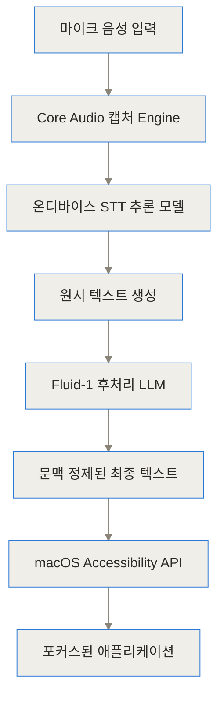
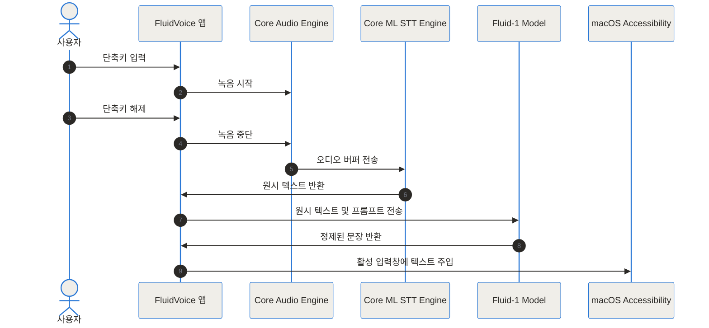
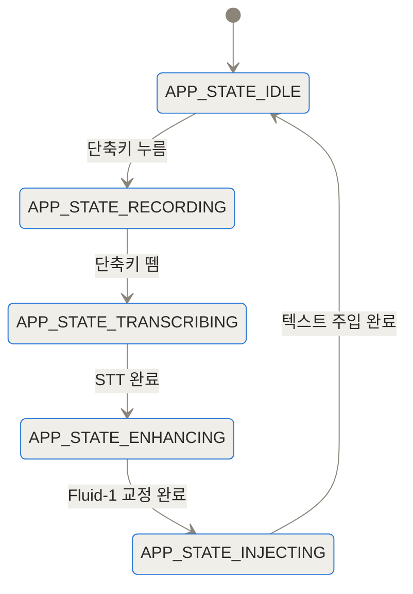
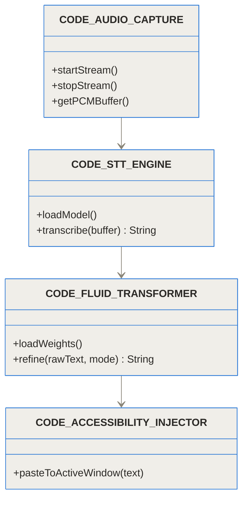
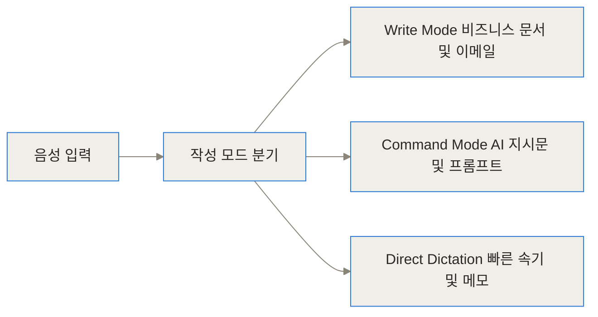
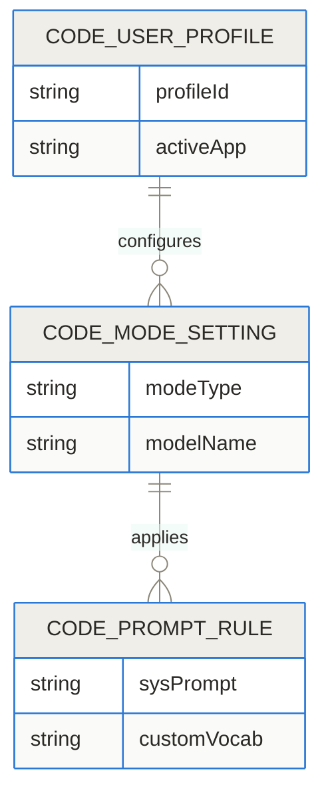
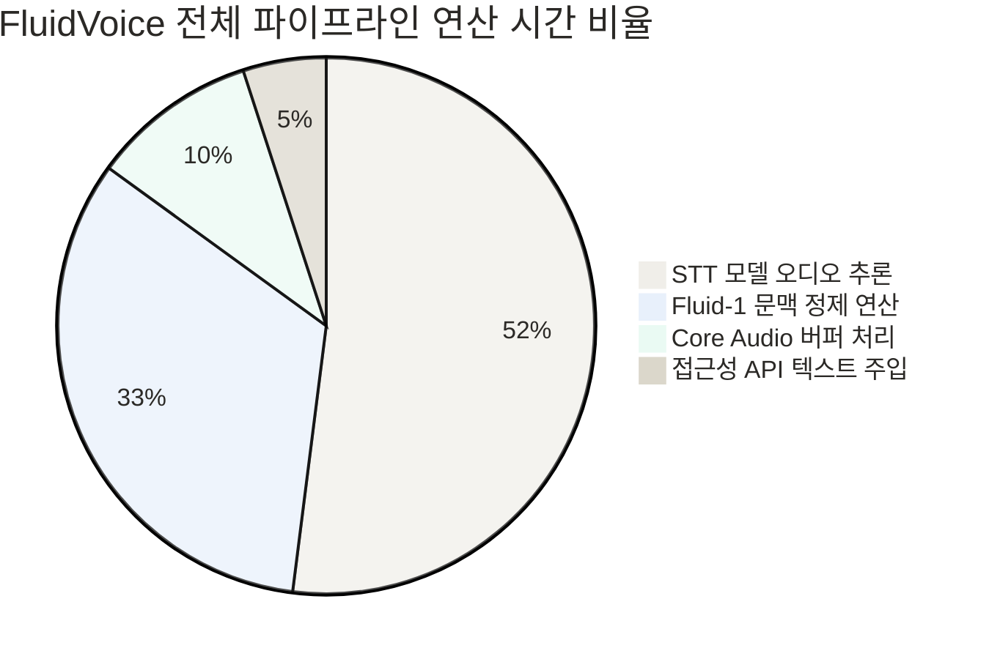

- GitHub 저장소: [altic-dev/FluidVoice GitHub](https://github.com/altic-dev/FluidVoice)
- 공식 웹사이트: [Altic FluidVoice 공식 페이지](https://altic.dev/fluid)

## 도입 및 3줄 요약

> **TL;DR (한 줄 요약)**
> - **한 줄 요약**: FluidVoice는 macOS 환경에서 100% 로컬로 구동되는 무료 오픈소스 AI 음성 받아쓰기 애플리케이션입니다.
> - **주요 가치**: 음성 인식(STT)과 문맥 정제 LLM을 모두 기기 내부에서 처리하여 개인정보 유출 걱정 없이 타이핑 대비 3.7배 빠른 속도로 글을 작성해요.
> - **차별점**: 거친 구어체 표현, 추임새, 문장 부호를 자체 학습된 Fluid-1 AI 모델이 알아서 정제해 주며, 월 구독료나 API 비용이 전혀 들지 않아요.

키보드로 길 글을 입력하거나 코드를 작성하다 보면 손목에 무리가 오고 생각이 끊기는 경험을 자주 하게 됩니다. 인간이 키보드로 글을 치는 속도보다 말로 전달하는 속도가 평균 3.7배 이상 빠르지만, 지금까지의 음성 입력 도구들은 잦은 오인식과 어색한 문장 포맷팅 때문에 실전 활용에 한계가 있었어요. FluidVoice는 이러한 문제를 해결하기 위해 등장한 오픈소스 오프라인 음성 받아쓰기 솔루션입니다.

## FluidVoice란 무엇이며 왜 주목받고 있는가

FluidVoice는 Altic 팀이 개발한 macOS 전용 오픈소스(GPLv3) 음성 받아쓰기 애플리케이션이에요. 기존의 많은 AI 음성 변환 도구가 사용자 음성을 클라우드 서버로 실시간 스트리밍하여 처리하는 방식이었다면, FluidVoice는 음성 데이터 수집부터 텍스트 정제, 최종 주입까지 모든 과정을 사용자의 Mac 기기 안에서 오프라인으로 완결합니다.

자유로운 오픈소스 소프트웨어이면서도 Wispr Flow나 Superwhisper 같은 유료 클라우드 서비스 수준의 매끄러운 텍스트 교정 능력을 보여주더라고요. GitHub 공개 이후 수만 회 이상의 다운로드와 수천 개의 별(Star)을 얻으며, 프라이버시를 중요하게 생각하는 개발자, 기획자, 연구자 사이에서 필수의 생산성 도구로 평가받고 있습니다.

## 기존 음성 입력 앱이 가졌던 세 가지 결정적 한계

음성 입력 기술 자체는 새로운 것이 아니지만, 현업에서 이를 메인 입력 수단으로 쓰기에는 세 가지 커다란 벽이 존재했어요.

첫째, **클라우드 스트리밍에 따른 보안 및 개인정보 위험**입니다. 대다수 AI 입력 앱은 오디오 데이터를 외부 서버로 송신합니다. 이 과정에서 비공개 소스 코드, 기업의 재무 데이터, 개인적인 비망록이 외부 네트워크를 거치게 되어 enterprise 환경에서의 도입이 불가능했죠.

둘째, **지속적인 월 구독료 비용 부담**입니다. 유료 AI 받아쓰기 서비스들은 매월 10달러에서 15달러 수준의 구독료를 요구해요. 매달 지불하는 비용에 비해 사용 빈도가 불규칙할 경우 가성비 문제가 지적되곤 했습니다.

셋째, **원시 음성 텍스트의 조잡함**입니다. macOS 기본 음성 입력이나 일반 STT 모델은 사용자가 말한 "음...", "어..." 같은 추임새나 중간에 말을 바꾼 흔적을 그대로 문자로 출력합니다. 대소문자 구분이 어색하고 문장 부호가 누락되어, 결국 사람이 손으로 재편집해야 하는 번거로움이 남아있었습니다.

| 비교 항목 | macOS 기본 음성 입력 | 기존 클라우드 AI 서비스 | FluidVoice |
| :--- | :--- | :--- | :--- |
| **이용 가격** | 무료 | 월 $10 ~ $15 (구독제) | **완전 무료 (GPLv3)** |
| **데이터 처리 위치** | 로컬 / 일부 클라우드 | 외부 클라우드 서버 | **100% 로컬 (On-Device)** |
| **문맥 교정 가능 여부** | 불가능 (단순 STT) | 가능 (클라우드 LLM) | **가능 (자체 Fluid-1 로컬 모델)** |
| **네트워크 필요 여부** | 필수의 경우 존재 | 필수 연결 필요 | **완전 오프라인 구동** |
| **데이터 외부 유출** | 일부 수집 가능성 있음 | 음성 데이터 전송됨 | **0 바이트 (완벽 차단)** |

## 음성 받아쓰기의 원리: 속기사와 에디터의 협업 비유

FluidVoice의 동작 구조를 이해할 때 가장 유용한 비유는 **속기사와 수석 에디터의 협업 시스템**이에요.

사용자가 단축키를 누르고 말을 시작하면, 1단계로 작동하는 온디바이스 STT(Speech-to-Text) 모델이 **속기사** 역할을 맡습니다. 이 속기사는 소리를 문자로 바꾸는 속도는 매우 빠르지만, 사용자가 중얼거린 추임새나 중복 단어를 있는 그대로 적어냅니다.

그다음 2단계로 동작하는 Fluid-1 모델이 **수석 에디터** 역할을 수행해요. 수석 에디터는 속기사가 적어준 거친 원고(Raw Transcript)를 넘겨받아 불필요한 추임새를 지우고, 문맥에 맞는 문장 부호를 찍어주며, 현재 작업 중인 앱이 이메일인지 메신저인지 소스 코드인지에 맞춰 어조를 매끄럽게 교정합니다.



## FluidVoice의 온디바이스 동작 원리와 내부 아키텍처

FluidVoice가 클라우드 연결 없이도 높은 정밀도와 신속성을 유지하는 비결은 파이프라인의 각 단계가 Apple Silicon 하드웨어 특성에 맞춰 정밀하게 설계되었기 때문이에요.

### 저지연 오디오 캡처와 Core ML 기반 STT 모델

사용자가 단축키를 누르는 순간 macOS의 Core Audio 프레임워크가 실시간 PCM 오디오 스트림을 캡처합니다. 고비율 샘플링 데이터를 작은 버퍼 단위로 쪼개어 메모리 지연을 극소화해요.

수집된 오디오 버퍼는 Apple Silicon의 Neural Engine 가속을 받도록 변환된 Core ML 기반 음성 인식 모델(Parakeet 또는 Whisper 계열)로 바로 전달됩니다. 이 단계에서 연산 지연 시간을 최소화함으로써 사용자가 말을 마치는 즉시 1차 원시 텍스트가 완성됩니다.



### 10만 건 데이터로 학습된 Fluid-1 후처리 LLM

1차로 생성된 원시 텍스트는 FluidVoice만의 자체 언어 모델인 Fluid-1로 진입해요. 개발진은 10만 건 이상의 실제 구어체 받아쓰기 합성 데이터셋을 구성하여 Fluid-1 모델을 직접 파인튜닝했습니다.

Fluid-1 모델은 단순히 문법 검사를 하는 수준을 넘어섭니다. 문맥 내의 대소문자 정렬, 문장부호 삽입, 중복 표현 제거는 물론, 사용자의 어조 가이드라인을 이행해요. 모델의 크기는 약 3GB 수준으로, 로컬 디스크 및 메모리에 상주하면서 밀리초 단위로 텍스트를 재작성합니다.



### Apple Silicon 통합 메모리와 macOS 접근성 API 연동

Apple Silicon 시스템은 CPU, GPU, Neural Engine이 동일한 물리 메모리 영역을 공유하는 통합 메모리(Unified Memory) 아키텍처를 채택하고 있습니다. FluidVoice는 오디오 데이터 및 모델 가중치를 CPU와 GPU 사이에서 별도로 복사할 필요가 없어 메모리 이동에 따른 오버헤드가 없어요.



문맥 교정이 끝난 최종 텍스트는 macOS의 Accessibility API(접근성 API)를 활용하여 현재 포커스가 맞춰진 애플리케이션의 커서 위치로 주입됩니다. 클립보드 이력을 더럽히지 않고 실제 키보드 타이핑 이벤트를 시뮬레이션하기 때문에 시스템 전반의 모든 앱에서 유연하게 작동해요.

```chartjs
{"type":"bar","data":{"labels":["Wispr Flow","Superwhisper","FluidVoice"],"datasets":[{"label":"월 구독료 (USD)","data":[15,10,0]},{"label":"네트워크 외부 유출 (KB)","data":[300,120,0]}]}}
```

## FluidVoice를 어떻게 설치하고 설정하나

FluidVoice는 패키지 관리자를 통해 간편하게 설치할 수 있으며, 개발자라면 소스 코드를 직접 빌드하여 사용할 수도 있습니다.

### Homebrew 및 소스 코드를 통한 설치 방법

macOS 사용자라면 터미널에서 Homebrew 명령어 한 줄로 즉시 설치가 가능해요.

```bash
brew install --cask fluidvoice
```

직접 최신 개발 버전을 빌드하고 싶다면 GitHub 저장소를 복제한 뒤 Xcode 환경에서 컴파일할 수 있습니다.

```bash
git clone https://github.com/altic-dev/FluidVoice.git
cd FluidVoice
open Fluid.xcodeproj
```

Xcode 오픈 후 Swift Package Manager 의존성이 모두 로드되면 `Cmd + R`을 눌러 애플리케이션을 즉시 구동할 수 있어요.

### 작성 모드와 결정론적 커스텀 사전 설정

FluidVoice는 사용자의 작성 목적에 맞춰 작동 모드를 변경할 수 있는 설정을 제공합니다.



- **Write Mode**: 오타 교정, 문장부호 정렬, 자연스러운 줄바꿈이 적용되어 이메일이나 보고서 작성에 적합해요.
- **Command Mode**: LLM 지시문이나 CLI 명령어를 말할 때 특수기호 및 인자 형식을 살려줍니다.
- **Direct Dictation**: AI 후처리를 최소화하고 음성 인식 본연의 정직한 문자열을 즉시 입력합니다.

또한 **결정론적 어휘 치환(Deterministic Vocabulary Overrides)** 기능을 통해 사용자 고유 사전 등록이 가능해요. 고유명사, 개발용 변수명, 회사 내부 프로젝트 이름을 등록해 두면 AI 환각 현상 없이 바르게 대체됩니다.



## 현업에서 빛을 발하는 3가지 실전 활용 시나리오

FluidVoice의 진짜 매력은 업무 흐름이 빠르게 전환되는 현업에서 발휘됩니다.

### 시나리오 1: 소스 코드 주석 및 커밋 메시지 작성

개발 중 complex한 알고리즘이나 비즈니스 로직에 주석을 남길 때, 키보드로 타이핑하려면 작성 흐름이 깨지기 쉽더라고요. FluidVoice를 켜고 "이 함수는 사용자 세션 토큰을 검증하고 만료 시 401 에러를 반환함"이라고 말하면, 정제된 영문 주석이나 깔끔한 한국어 주석으로 자동 치환되어 코드에 바로 삽입됩니다.



### 시나리오 2: 슬랙 메신저와 공식 이메일 톤 조율

동일한 음성 메시지라도 슬랙 메신저에서는 친근하고 캐주얼한 어조로, 메일 앱에서는 격식 있는 비즈니스 어조로 변환되는 설정이 가능해요. 앱 포커스를 감지하여 어조 프로필을 자동으로 전환해주므로 상사나 고객사 메일 작성을 손쉽게 마칠 수 있습니다.

### 시나리오 3: 회의록 작성 및 다국어 아이디어 메모

40개 이상의 언어를 지원하는 다국어 모델을 기반으로 한 한국어-영어 혼용 아이디어 스케치도 문제없습니다. "오늘 클라이언트 미팅 결과는 어서 프리뷰 릴리스 버전을 다움주까지 공유하기로 했어"처럼 섞어서 말해도 정교하게 교정됩니다.

```chartjs
{"type":"bar","data":{"labels":["Apple 기본 입력","Whisper Small","Parakeet + Fluid-1"],"datasets":[{"label":"메모리 점유량 (GB)","data":[0.2,1.5,3.2]},{"label":"음성 가독성 및 정제율 (%)","data":[55,70,95]}]}}
```

## 주요 음성 인식 도구와의 성능 및 비용 비교

각 제품 간 기능적 특성과 비용 요소를 종합 비교한 표입니다.

| 구문 및 사양 | FluidVoice | Wispr Flow | Superwhisper | Apple 기본 입력 |
| :--- | :--- | :--- | :--- | :--- |
| **라이선스 및 비용** | 완전 무료 (GPLv3) | 월 $15 (구독) | 월 $10 (하이브리드) | 시스템 기본 포함 |
| **오프라인 구동** | 100% 가능 | 불가능 | 일부 가능 | 가능 |
| **음성 데이터 보안** | 기기 내부 보존 (0B 유출) | 클라우드 수집 | 설정에 따라 다름 | 오프라인 시 보존 |
| **후처리 AI 모델** | Fluid-1 (온디바이스) | 클라우드 LLM | 선택적 로컬 LLM | 없음 |
| **입력 지연 속도** | 극저지연 | 네트워크 지연 영향 | 모델 사양에 따름 | 매우 빠름 |
| **커스텀 사전** | 지원 (결정론적) | 지원 | 지원 | 제한적 |

## 냉정한 평가: 한계점과 트레이드오프

FluidVoice가 뛰어난 장점을 많이 갖고 있지만, 솔직하게 짚고 넘어가야 할 단점과 트레이드오프도 존재합니다.

첫째, **메모리(RAM) 점유량**입니다. STT 모델과 3GB 규모의 Fluid-1 모델을 로컬 메모리에 항상 올려두기 때문에 기본적으로 3GB 이상의 가용 RAM을 점유해요. 8GB RAM을 탑재한 진입급 Mac에서는 다중 작업을 실행할 때 메모리 압박이 발생할 수 있습니다.

둘째, **플랫폼 및 칩셋 한계**입니다. 현재 macOS 및 Apple Silicon 환경에 극도로 최적화되어 있어 Intel 기반 Mac에서는 Neural Engine 가속을 받을 수 없어 처리 속도가 떨어집니다. Windows 및 Linux 지원은 현재 대기열 단계에 있어요.

셋째, **초기 모델 다운로드용 용량**입니다. 첫 설치 후 약 3GB~5GB 크기의 로컬 AI 모델 파일을 다운로드해야 하므로, 인터넷 연결 상태가 좋지 않은 환경에서는 초기 진입 장벽이 될 수 있습니다.

## 향후 전망과 개인적 견해

FluidVoice는 AI 보조 도구가 클라우드에서 로컬 디바이스로 이동하는 온디바이스 AI 전환을 보여주는 대표적인 사례입니다. 개발진은 현재 8GB RAM 사용자들을 위해 1GB 미만 용량의 Fluid-1 Mini 모델을 추가 개발 중이라고 밝혀 향후 진입 장벽이 더 낮아질 것으로 기대돼요.

단순한 편리함을 넘어 개인 정보 보호와 경제성을 동시에 챙긴 음성 입력 레이어로서, 로컬 생산성 생태계에 중요한 이정표가 될 프로젝트입니다.

## 자주 묻는 질문 (FAQ)

### FluidVoice는 정말 완전히 무료인가요? 사용 제한이나 별도 유료 플랜이 있나요?

FluidVoice는 GPLv3 오픈소스 라이선스 기반의 완전 무료 프로그램입니다. 모든 AI 추론이 사용자의 Mac 내부에서 오프라인으로 실행되므로 서버 유지비나 API 사용료가 발생하지 않으며, 사용량 제한이나 유료 구독 기능이 일절 존재하지 않습니다.

### 유료 클라우드 음성 인식 앱인 Wispr Flow와 비교했을 때 성능 차이가 어떤가요?

클라우드 서비스는 서버 전송 과정에서 네트워크 지연과 데이터 유출 리스크가 발생하는 반면, FluidVoice는 완전 오프라인으로 처리되어 보안이 완벽하고 지연 시간이 매우 짧습니다. 또한 10만 건 이상의 음성 데이터로 학습된 Fluid-1 로컬 모델 덕분에 추임새 제거와 문맥 정제 성능면에서도 유료 서비스에 뒤처지지 않습니다.

### FluidVoice를 구동하기 위한 최소 Mac 시스템 사양은 어떻게 되나요?

Apple Silicon(M1, M2, M3, M4, M5 등) 프로세서가 탑재된 Mac이 권장됩니다. Fluid-1 모델 상주를 위해 최소 3GB 이상의 가용 메모리가 필요하며, 8GB RAM 기기를 위해 1GB 미만의 Fluid-1 Mini 모델도 개발 중입니다.

### 내가 말한 음성이나 작성된 텍스트가 외부 서버로 수집될 가능성이 있나요?

전혀 없습니다. FluidVoice는 0바이트의 데이터도 외부로 송신하지 않는 오프라인 퍼스트 아키텍처로 설계되었습니다. 오디오 녹음부터 STT 변환, 문맥 교정, final 텍스트 입력까지 모든 프로세스가 온디바이스로 수행되므로 극비 문서 작업에도 안전하게 쓸 수 있습니다.

### 개발자용 변수명이나 사람 이름 같은 고유명사를 정확히 인식하게 할 수 있나요?

가능합니다. FluidVoice는 결정론적 어휘 치환(Deterministic Vocabulary Overrides) 기능을 탑재하고 있습니다. 사용자가 직접 커스텀 사전을 등록해 두면 AI가 멋대로 단어를 바꾸지 않고 지정된 전문 용어로 정확하게 변환해 줍니다.


## References
- [https://github.com/altic-dev/FluidVoice](https://github.com/altic-dev/FluidVoice)
- [https://altic.dev/fluid](https://altic.dev/fluid)
