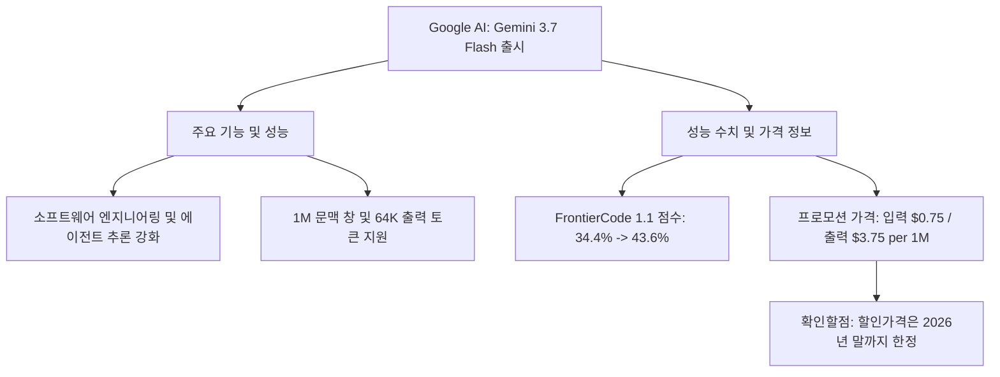
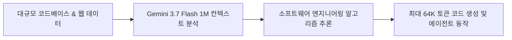
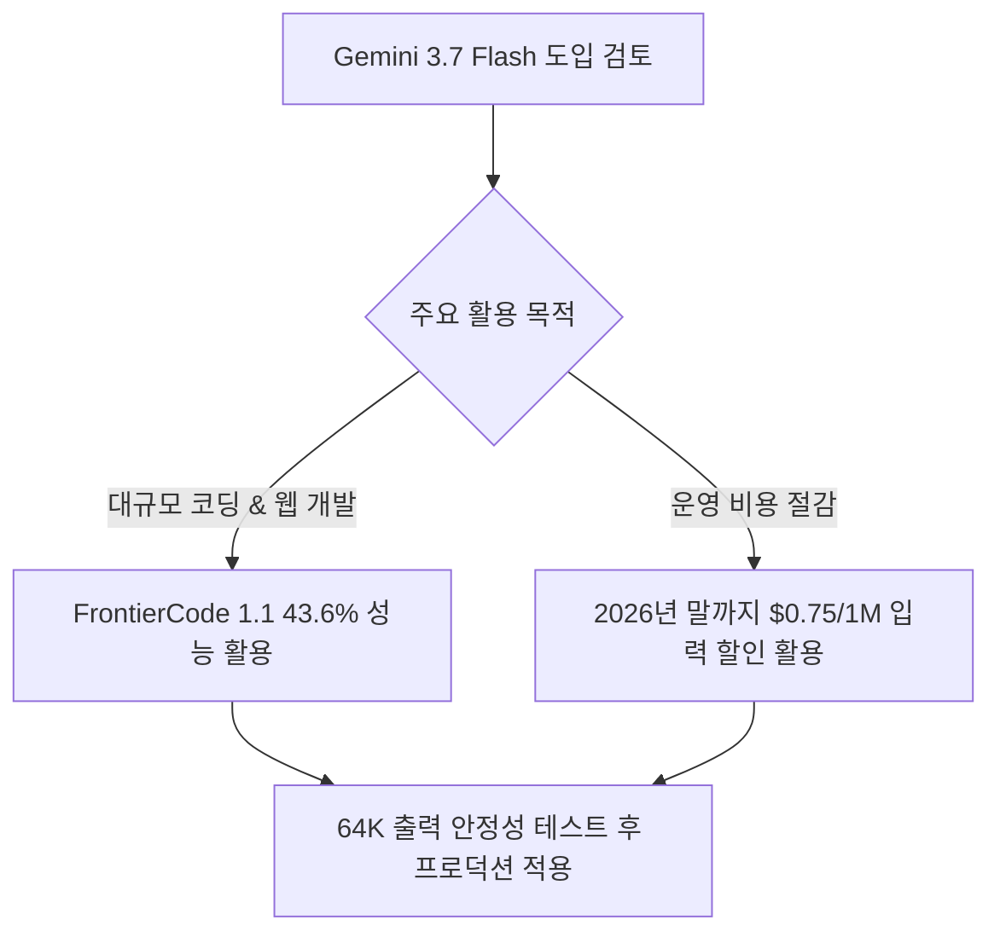

Gemini 3.7 Flash는 코딩, 에이전트 작업에서 낮은 지연과 긴 문맥을 함께 시험하려는 API 사용자에게 적합합니다. 43.6% 벤치마크와 100만 토큰 창은 각각 특정 평가 점수와 입력 상한이며, 실제 코드베이스 정확도나 비용 절감을 보장하지 않습니다. 특히 $0.75/$3.75 단가는 2026년 말까지의 프로모션이므로 정가 전환 뒤 예산과 마이그레이션 경로까지 함께 계산해야 합니다.



Google AI가 개발자와 에이전트 구축자를 위해 성능은 높이고 비용 부담은 줄인 고성능 모델을 전격 공개했습니다 <sup class="source-citation"><a href="#source-2" aria-label="Google AI for Developers 출처">[2]</a></sup>. 대규모 코드베이스 처리와 자동화 워크플로우를 고민하던 개발팀이라면 이번 출시 소식에 주목해볼 필요가 있습니다 <sup class="source-citation"><a href="#source-3" aria-label="MarkTechPost 출처">[3]</a></sup>.

> **먼저 알아둘 용어**
>
> - **에이전트**: 사람이 단계마다 지시하지 않아도 스스로 여러 작업을 이어서 처리하는 AI입니다.
> - **추론**: 학습이 끝난 모델이 실제로 답을 만들어 내는 과정입니다. 이때 드는 계산 비용이 곧 사용료입니다.
> - **토큰**: AI가 글을 잘게 쪼개 세는 단위입니다. 한국어는 보통 한두 글자가 토큰 하나입니다.
> - **컨텍스트 윈도우**: AI가 한 번에 읽고 기억할 수 있는 글의 최대 길이입니다. 이 길이를 넘으면 앞부분을 잊습니다.
> - **벤치마크**: 같은 문제집을 여러 모델에 풀려 점수를 매기는 시험입니다. 실제 체감 성능과 다를 수 있습니다.
{: .prompt-info }

## 무슨 일이 벌어진 걸까?

Google AI가 2026년 8월 13일 Gemini 3.7 Flash 모델을 정식으로 출시했습니다 <sup class="source-citation"><a href="#source-2" aria-label="Google AI for Developers 출처">[2]</a></sup>. 이번 출시는 이전 버전인 Gemini 3.6 Flash가 나온 지 불과 3주 만에 이뤄진 매우 빠른 업데이트입니다 <sup class="source-citation"><a href="#source-1" aria-label="Google Blog 출처">[1]</a></sup>. Gemini 3.7 Flash는 소프트웨어 엔지니어링, 웹 개발, 그리고 자율형 에이전트 추론 워크플로우를 원활하게 수행할 수 있도록 전용 알고리즘 개선이 적용되었습니다 <sup class="source-citation"><a href="#source-3" aria-label="MarkTechPost 출처">[3]</a></sup>. 또한 방대한 분량의 데이터나 코드를 단번에 처리할 수 있도록 100만(1M) 토큰의 문맥 창(Context Window)을 기본 제공하며, 한 번에 생성 가능한 최대 출력은 6만 4천(64K) 토큰에 달합니다 <sup class="source-citation"><a href="#source-2" aria-label="Google AI for Developers 출처">[2]</a></sup>.

<figure class="news-source-image">
  
  <figcaption>Google AI for Developers가 원문과 함께 공개한 이미지입니다. <a href="https://ai.google.dev/gemini-api/docs/models/gemini-3.7-flash" target="_blank" rel="noopener noreferrer">출처: Google AI for Developers</a></figcaption>
</figure>

## 왜 지금 다들 이 이야기를 할까?

개발용 모델 성능 평가에서 가시적인 점수 상승을 증명함과 동시에 도입 문턱을 대폭 낮췄기 때문입니다 <sup class="source-citation"><a href="#source-1" aria-label="Google Blog 출처">[1]</a></sup>. 대표적인 코딩 평가 기준인 FrontierCode 1.1 Main 벤치마크에서 Gemini 3.7 Flash는 43.6%의 점수를 기록했습니다 <sup class="source-citation"><a href="#source-1" aria-label="Google Blog 출처">[1]</a></sup>. 이전 모델인 Gemini 3.6 Flash가 달성했던 34.4%와 비교해보면 단 3주 만에 9.2%포인트나 향상된 성과입니다 <sup class="source-citation"><a href="#source-3" aria-label="MarkTechPost 출처">[3]</a></sup>. 제가 보기엔 단기간 내에 이 정도의 점수 격차를 만들어낸 것은 개발 및 추론 관련 내부 알고리즘 고도화가 핵심적인 역할을 한 것으로 풀이됩니다.

아래 차트는 두 Flash 모델 간의 FrontierCode 1.1 Main 벤치마크 결과를 비교한 수치입니다.

```chartjs
{
  "type": "bar",
  "data": {
    "labels": ["Gemini 3.6 Flash", "Gemini 3.7 Flash"],
    "datasets": [{
      "label": "FrontierCode 1.1 Main 점수 (%)",
      "data": [34.4, 43.6]
    }]
  },
  "options": {
    "plugins": {
      "title": {
        "display": true,
        "text": "Gemini Flash 모델 간 FrontierCode 1.1 Main 점수 비교"
      }
    }
  }
}
```

이러한 구조적 개선은 에이전트가 복잡한 코딩 명령을 받아 처리할 때 전체 작업 흐름을 훨씬 매끄럽게 연결해줍니다.



## 그래서 우리에게 뭐가 달라질까?

에이전트 기반 서비스를 만들거나 대용량 코드를 다루는 개발팀의 운영 비용과 개발 속도가 눈에 띄게 개선될 수 있습니다 <sup class="source-citation"><a href="#source-3" aria-label="MarkTechPost 출처">[3]</a></sup>. Google AI는 이번 정식 출시를 기념해 2026년 말까지 특별 할인 요금을 적용한다고 밝혔습니다 <sup class="source-citation"><a href="#source-1" aria-label="Google Blog 출처">[1]</a></sup>. 이 프로모션 기간 동안 API 이용 가격은 백만(1M) 입력 토큰당 $0.75, 백만 출력 토큰당 $3.75로 제공됩니다 <sup class="source-citation"><a href="#source-2" aria-label="Google AI for Developers 출처">[2]</a></sup>. 100만 토큰이라는 대용량 문맥 창과 64K에 달하는 출력 한도 덕분에 긴 코드 파일 분석이나 복잡한 웹 개발용 자동화 프로그램을 만드는 데 훨씬 유리한 환경이 갖춰졌습니다 <sup class="source-citation"><a href="#source-2" aria-label="Google AI for Developers 출처">[2]</a></sup>.

## 직접 써보거나 지켜볼 포인트

실제 프로덕션 환경에 모델을 도입할 때는 64K 출력 생성이 안정적으로 유지되는지, 에이전트 추론이 요구 조건에 맞게 동작하는지 직접 테스트해보는 것이 좋습니다 <sup class="source-citation"><a href="#source-2" aria-label="Google AI for Developers 출처">[2]</a></sup>. 여기서 눈여겨볼 점은 Gemini 3.6 Flash 출시 후 불과 3주 만에 Gemini 3.7 Flash가 연이어 나왔다는 점입니다 <sup class="source-citation"><a href="#source-1" aria-label="Google Blog 출처">[1]</a></sup>. Google AI가 Flash 라인업의 성능 개선 속도를 얼마나 가파르게 끌어올리고 있는지 보여주는 대목입니다.

개발 현장에서 모델 도입을 결정할 때 참고할 판단 흐름은 다음과 같습니다.



## 프로모션 단가를 실제 월 비용으로 어떻게 계산할까?

기본 비용은 입력 백만 토큰 수에 0.75달러, 출력 백만 토큰 수에 3.75달러를 곱해 더합니다. 예를 들어 한 달 입력 1억 토큰과 출력 1천만 토큰을 쓴다면 프로모션 표시 단가 기준 75달러와 37.5달러, 합계 112.5달러입니다. 이는 실패 재시도, 도구 API와 저장, 검색 비용을 제외한 단순 모델 비용이며 2026년 말 이후에도 유지되는 예산은 아닙니다.

출력 토큰은 입력보다 단가가 높으므로 최대 64K를 항상 요청하면 비용과 대기 시간이 커질 수 있습니다. 작업별 최대 출력, 중단 조건과 재시도 횟수를 정하고 요청당 비용을 기록해야 합니다. 할인 종료 후 정가가 공개되면 같은 트래픽으로 다시 계산하고, 다른 모델로 되돌릴 수 있도록 모델 ID와 응답 형식의 결합을 줄여 두는 편이 좋습니다.

## 1M 컨텍스트를 모두 넣는 것이 좋은 선택일까?

컨텍스트 창은 넣을 수 있는 최대량이지 모델이 모든 토큰을 같은 정확도로 활용한다는 뜻은 아닙니다. 코드 저장소 전체를 매 요청마다 보내면 관련 없는 파일 때문에 중요한 오류가 묻히고 입력 비용도 반복됩니다. 파일 검색으로 필요한 부분을 고른 방식과 전체 입력 방식을 같은 과제로 비교해 정확도, 첫 토큰 시간과 비용을 측정해야 합니다.

긴 출력도 컴파일 가능한 완성 코드와 같지 않습니다. 생성 결과에 단위 테스트, 정적 분석과 보안 검사를 적용하고, 기존 동작을 깨뜨린 변경 수를 기록합니다. 에이전트에서는 도구 인자 스키마와 파일 변경 허용 범위를 검증해 긴 응답이 곧바로 실행되는 것을 막아야 합니다.

## FrontierCode 점수는 어떻게 사내 평가로 옮길까?

34.4%에서 43.6%로 오른 값은 FrontierCode 1.1 Main이라는 정해진 평가의 9.2%포인트 차이입니다. 언어, 저장소 규모와 도구 설정이 다른 업무에 그대로 대입할 수 없습니다. 사내에서 자주 발생하는 버그 수정, 테스트 작성, 리팩터링 과제를 익명화해 정답과 허용 변경 범위를 만들고, 기존 모델과 같은 프롬프트로 비교합니다.

완료율 외에도 잘못 수정한 파일, 테스트 통과, 사람이 검토한 시간, 토큰과 재시도를 봐야 합니다. 한 번의 높은 점수보다 여러 실행의 편차가 운영 안정성을 더 잘 보여 줍니다. 모델 업데이트 주기가 짧다면 버전을 고정하고 변경 전 회귀 평가를 반복할 절차도 필요합니다.

## 아직은 선을 그어야 할 부분

아무리 매력적인 조건이라도 몇 가지 제한 사항과 고려할 점은 존재합니다 <sup class="source-citation"><a href="#source-1" aria-label="Google Blog 출처">[1]</a></sup>. 우선 백만 입력 토큰당 $0.75, 백만 출력 토큰당 $3.75라는 가격은 2026년 말까지만 유효한 프로모션 할인 요금입니다 <sup class="source-citation"><a href="#source-1" aria-label="Google Blog 출처">[1]</a></sup>. 따라서 2027년 이후 정가로 전환될 때의 장기적인 예산 계획을 함께 수립해둘 필요가 있습니다. 또한 FrontierCode 1.1 점수가 43.6%로 크게 올랐다고 해서 모든 실제 프로그래밍 언어나 복잡한 레거시 시스템에서 오류가 없다는 뜻은 아니므로, 생성된 코드에 대한 자체 검증 절차는 필수입니다 <sup class="source-citation"><a href="#source-3" aria-label="MarkTechPost 출처">[3]</a></sup>.

<!-- primary-sources:start -->
## 원문과 버전 확인

- [발표 원문](https://blog.google/technology/ai/gemini-3-7-flash)
- [Google AI for Developers](https://ai.google.dev/gemini-api/docs/models/gemini-3.7-flash)
- [MarkTechPost](https://www.marktechpost.com/2026/08/13/google-ai-just-released-gemini-3-7-flash-a-coding-and-agent-model-at-0-75-1m-input-tokens)
<!-- primary-sources:end -->

<!-- internal-links:start -->
## 함께 읽으면 이해가 이어지는 글

- [Liquid AI, 스마트폰과 CPU에서 작동하는 로컬 에이전트 모델 LFM2.5-2.6B 공개]() — Liquid AI가 스마트폰 및 소비자용 CPU에서 로컬로 구동되는 26억 매개변수 온디바이스 에이전트 모델 LFM2.5-2.6B를 공개했습니다. 2.5GB 미만의 RAM 메모리로 128K 컨텍스트와 네이티브 툴 콜링을 지원하며…
- [OpenRouter에 등장한 스텔스 AI 모델 OX Alpha 무료 공개, 100만 토큰과 DeepSWE 80% 성능 분석]() — 2026년 8월 20일 OpenRouter에 100만 토큰 컨텍스트 창과 다중 모달 입력을 지원하는 스텔스 모델 OX Alpha가 등장했습니다. 프리뷰 기간 무료로 제공되는 이 모델은 DeepSWE 코딩 벤치마크 하위 집합에서 80%…
- [Athena-Public은 모델을 바꿔도 기억할까: 10K 부팅, 278개 프로토콜 검증]() — Athena-Public이 로컬 마크다운으로 상태를 보존하는 방식과 10K 부팅, 278개 프로토콜 주장을 살펴보고, 검색, 충돌, 클라우드 전송 한계를 정리합니다.
<!-- internal-links:end -->

## 자주 묻는 질문

### Gemini 3.7 Flash의 API 가격은 얼마인가요?

2026년 말까지 적용되는 프로모션 할인 요금 기준으로 백만(1M) 입력 토큰당 $0.75, 백만 출력 토큰당 $3.75입니다.

### Gemini 3.7 Flash의 컨텍스트 및 출력 토큰 한도는 어떻게 되나요?

문맥 창(Context Window)은 최대 100만(1M) 토큰을 지원하며, 한 번에 생성 가능한 최대 출력은 6만 4천(64K) 토큰입니다.

### Gemini 3.7 Flash는 코딩 성능이 얼마나 향상되었나요?

FrontierCode 1.1 Main 벤치마크 점수 기준 기존 Gemini 3.6 Flash의 34.4%에서 43.6%로 약 9.2%포인트 향상되었습니다.

### Gemini 3.7 Flash는 이전 모델 출시 후 얼마 만에 나왔나요?

Gemini 3.6 Flash 정식 출시 후 3주 만인 2026년 8월 13일에 정식 출시되었습니다.

## 직접 확인한 원문

<ol class="checked-source-list">
  <li id="source-1"><a href="https://blog.google/technology/ai/gemini-3-7-flash" target="_blank" rel="noopener noreferrer">Google Blog — Gemini 3.7 Flash: our most intelligent workhorse model</a> (2026-08-13)</li>
  <li id="source-2"><a href="https://ai.google.dev/gemini-api/docs/models/gemini-3.7-flash" target="_blank" rel="noopener noreferrer">Google AI for Developers — Gemini 3.7 Flash | Gemini API</a> (2026-08-13)</li>
  <li id="source-3"><a href="https://www.marktechpost.com/2026/08/13/google-ai-just-released-gemini-3-7-flash-a-coding-and-agent-model-at-0-75-1m-input-tokens" target="_blank" rel="noopener noreferrer">MarkTechPost — Google AI Just Released Gemini 3.7 Flash: A Coding and Agent Model at $0.75/1M Input Tokens</a> (2026-08-13)</li>
</ol>

> 이 글은 위 원문을 직접 확인해 작성했습니다. 가격, 기능 범위, 지역별 제공 여부는 게시 후 바뀔 수 있으니 실제 도입 전 공식 문서를 다시 확인하세요.
