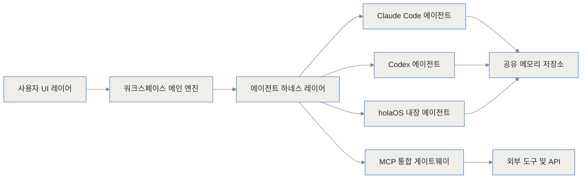
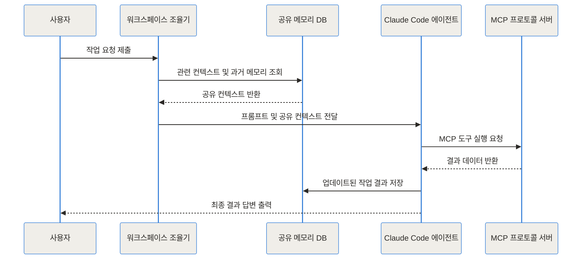
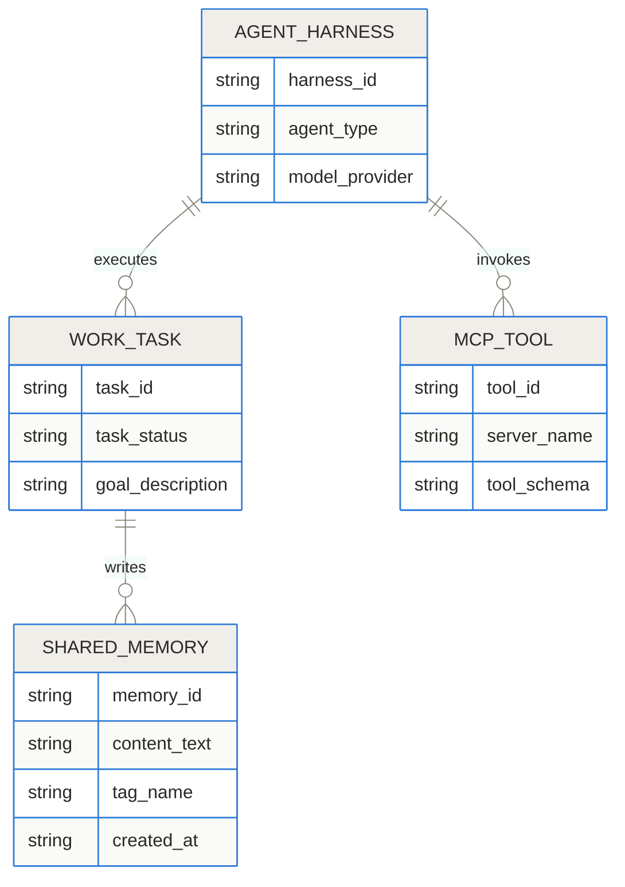
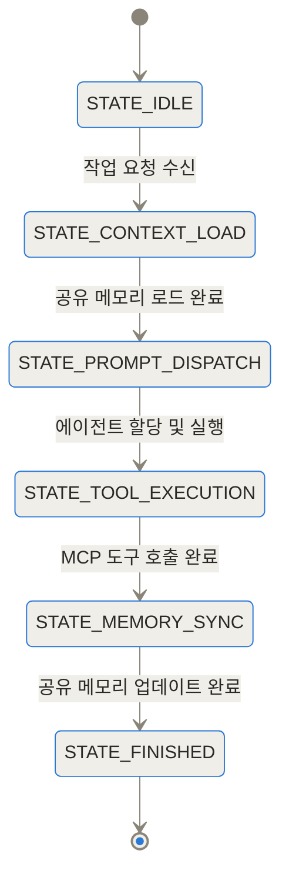
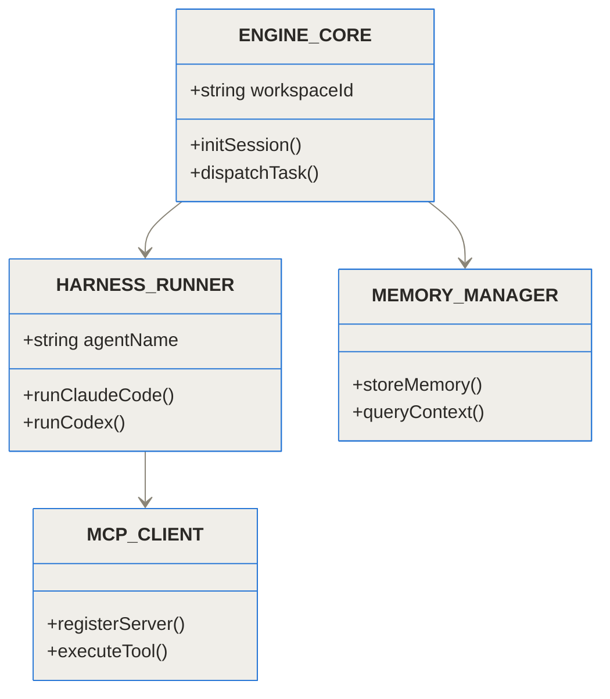
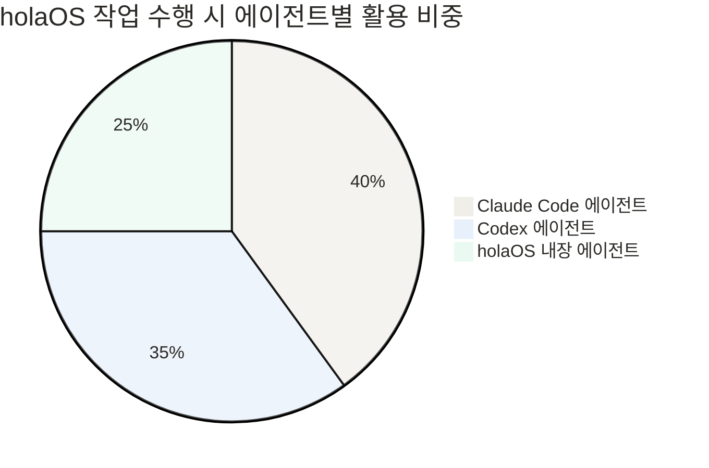
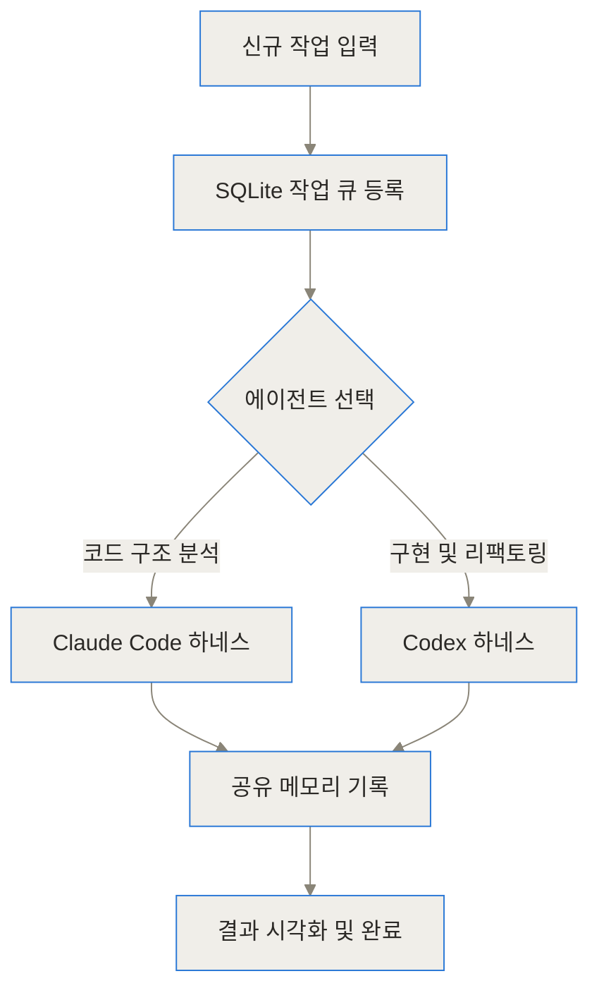
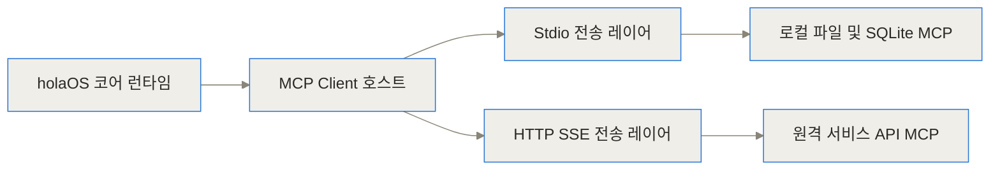

## 상단 링크
- [holaOS GitHub 저장소](https://github.com/holaboss-ai/holaOS)
- [holaboss 공식 사이트](https://www.holaos.ai)
- [holaboss-apps 저장소](https://github.com/holaboss-ai/holaboss-apps)

## 요약 (TL;DR)
- holaOS는 Claude Code, Codex, 내장 에이전트 등 다양한 AI 실행 도구를 단일 로컬 환경에서 구동하는 오픈소스 All-in-One AI 에이전트 워크스페이스예요.
- 에이전트가 바뀌더라도 맥락이 끊기지 않는 공유 메모리(Shared Memory) 스토리지와 100개 이상의 MCP(Model Context Protocol) 도구 생태계를 원스톱으로 지원해요.
- 자체 제공 모델 연동 및 BYOK(Bring Your Own Key) 방식을 채택하여 개인정보 및 보안 통제 권한을 개발자에게 완벽히 제공해요.

## 파편화된 AI 도구의 한계와 단열된 개발 환경 (배경과 문제 정의)
최근 AI 기술의 가속화로 인해 수많은 AI 에이전트 도구가 쏟아지고 있어요. CLI 환경에서 강력한 코딩 능력을 보여주는 Claude Code부터 최적화된 코드 생성을 지원하는 Codex, 그리고 개별 IDE 내의 확장 프로그램까지 다양하죠. 하지만 이러한 도구들이 늘어날수록 개발자들이 경험하는 피로감과 오버헤드도 함께 급증하고 있어요.

가장 치명적인 문제는 컨텍스트의 절단 현상이예요. 특정 코드베이스의 거대한 리팩토링 작업을 수행할 때, 분석 단계에서는 Claude Code의 뛰어난 추론 능력을 사용하고 구현 및 테스트 단계에서는 Codex나 다른 전문 도구를 활용하고 싶을 때가 많아요. 하지만 현재 스택에서는 A 도구에서 수행한 분석 결과와 탐색된 프로젝트 맥락을 B 도구로 전달하기 위해 개발자가 직접 텍스트를 복사하고 붙여넣거나 프롬프트를 재구성해야 해요.

이 과정에서 수많은 토큰이 의미 없이 재소비되고, 중간 맥락이 유실되거나 AI가 잘못된 환각을 일으키는 원인이 되곤 해요. 또한 각 에이전트마다 외부 API, 데이터베이스, 로컬 브라우저 등을 연결하기 위한 도구(Tool) 및 MCP 설정을 개별적으로 반복해야 하므로 환경 구성 및 관리 오버헤드가 극심해지는 한계에 직면하게 돼요.

## holaOS란 무엇인가: AI 에이전트를 위한 공용 워크스페이스 (개념 쉽게 설명하기)
holaOS는 도구별로 파편화되어 있던 AI 에이전트 실행 환경을 하나로 모아주는 로컬 중심의 에이전트 운영체제 겸 워크스페이스예요. 어려운 개념 같아 보이지만, 일상적인 사무실 환경에 비유하면 매우 쉽게 이해할 수 있어요.

기존 방식이 서로 다른 방에 격리된 전문가들에게 매번 서류 가방을 들고 찾아가 똑같은 설명을 반복하는 것이었다면, holaOS는 거대한 공용 회의실을 만드는 것과 같아요. 이 공용 회의실의 중앙에는 커다란 공유 화이트보드(공유 메모리)가 있고, 벽면에는 누구나 즉시 꺼내 쓸 수 있는 공용 공구함(MCP 도구 연동 레이어)이 배치되어 있죠.

개발자는 작업의 성격에 따라 회의실 안에 Claude Code를 불러올 수도 있고, Codex를 띄울 수도 있어요. 에이전트가 바뀌더라도 중앙 화이트보드에 정리된 프로젝트 맥락과 지금까지의 작업 이력은 그대로 유지돼요. 따라서 에이전트는 처음부터 다시 코드를 읽을 필요 없이 이전 에이전트가 남긴 기록을 바탕으로 즉시 작업을 이어받아 수행할 수 있답니다.

## 내부 동작 원리와 아키텍처 깊이 보기 (Under the Hood)
holaOS의 내부 구조는 단순한 UI 래퍼가 아니에요. Electron 기반의 데스크톱 셸 아래에 강력한 Node.js/TypeScript 런타임 하네스, TanStack Start 앱 모듈, SQLite 기반의 지속성 작업 큐(Job Queue), 그리고 표준화된 MCP 클라이언트 호스트가 톱니바퀴처럼 연동되어 구동돼요.

### 시스템 전체 구조 및 아키텍처 레이어
holaOS의 중심에는 메인 워크스페이스 엔진이 위치하며, 하부의 에이전트 하네스, 공유 메모리, MCP 게이트웨이를 종합적으로 제어해요.



### 에이전트 간 요청 처리 및 메모리 동기화 흐름
사용자가 작업을 요청했을 때 공유 메모리와 MCP 도구가 어떻게 상호작용하며 에이전트 간 맥락을 유지하는지 살펴보죠.



### 공유 메모리 및 워크스페이스 데이터 스키마
로컬 SQLite에 저장되는 데이터 스키마 관계를 나타낸 다이어그램이에요.



### 에이전트 태스크 생명주기
에이전트가 생성되어 컨텍스트를 로드하고 MCP 도구를 실행한 뒤 저장하는 상태 전이 구조예요.



### 메인 코어 모듈 클래스 구조
오케스트레이션 엔진의 주요 모듈 클래스 구조예요.



### 작업 유형별 에이전트 활용 비중
holaOS 워크스페이스 내부에서 각 에이전트가 주로 담당하는 전형적인 역할 비중이에요.



### 작업 파이프라인 흐름
단일 작업이 들어왔을 때 로컬 SQLite 큐를 거쳐 적절한 에이전트로 분배되는 파이프라인을 시각화했어요.



### MCP 연결 및 도구 전송 아키텍처
stdio 및 HTTP SSE를 포함한 MCP 커넥터 통합 레이어 구조예요.



### 코드로 보는 런타임 오케스트레이션 예시
실제 TypeScript 런타임 내부에서 공유 메모리를 로드하고 도구를 실행하는 핵심 의사코드 패턴은 다음과 같아요.

```typescript
import { WorkspaceRuntime, SharedMemoryStore, AgentHarness } from "@holaboss/runtime";
import { MCPClientManager } from "@holaboss/mcp";

export class AgentWorkspaceOrchestrator {
  private memoryStore: SharedMemoryStore;
  private mcpClient: MCPClientManager;

  constructor() {
    this.memoryStore = new SharedMemoryStore({ dbPath: "./data/shared_memory.sqlite" });
    this.mcpClient = new MCPClientManager();
  }

  public async initializeWorkspace(): Promise<void> {
    await this.memoryStore.initSchema();
    await this.mcpClient.connectRegisteredServers();
  }

  public async runMultiAgentTask(taskGoal: string): Promise<void> {
    const context = await this.memoryStore.fetchContextByQuery(taskGoal);
    
    const claudeHarness = new AgentHarness({ agentType: "claude-code" });
    const analysisResult = await claudeHarness.execute({ prompt: taskGoal, initialContext: context });
    
    await this.memoryStore.saveRecord({
      sourceAgent: "claude-code",
      content: analysisResult.output,
      tags: ["analysis", "architecture"]
    });

    const codexHarness = new AgentHarness({ agentType: "codex" });
    const updatedContext = await this.memoryStore.fetchLatestContext();
    const refactorResult = await codexHarness.execute({
      prompt: "위 분석 결과를 바탕으로 구현 코드를 작성하세요.",
      initialContext: updatedContext
    });

    await this.memoryStore.saveRecord({
      sourceAgent: "codex",
      content: refactorResult.output,
      tags: ["refactored-code"]
    });
  }
}
```

## 설치 및 환경 구성 가이드 (어떻게 설치하고 사용하나)
holaOS는 로컬 퍼스트 애플리케이션으로, 간단한 클론 및 빌드 과정을 통해 본인 시스템에 바로 설치할 수 있어요.

1. 사전 필수 요구사항 확인
   - Node.js v20.x 이상 설치
   - pnpm 패키지 매니저 설치
   - Electron 앱 실행을 위한 OS 개발 환경 구성

2. 저장소 복제 및 의존성 설치
```bash
git clone https://github.com/holaboss-ai/holaOS.git
cd holaOS
pnpm install
```

3. 런타임 빌드 및 개발 모드 구동
```bash
pnpm run build:runtime
pnpm run dev
```

4. API 키 및 MCP 서버 설정 (BYOK 모드)
`holaos.config.json` 파일을 작업 공간 루트에 생성하여 API 키와 로컬 MCP 서버 경로를 정의할 수 있어요.

```json
{
  "models": {
    "provider": "anthropic",
    "apiKey": "ENV_ANTHROPIC_API_KEY",
    "fallbackProvider": "openai"
  },
  "mcpServers": {
    "filesystem": {
      "command": "npx",
      "args": ["-y", "@modelcontextprotocol/server-filesystem", "./projects"]
    },
    "sqlite": {
      "command": "uvx",
      "args": ["mcp-server-sqlite", "--db-path", "./data/app.db"]
    }
  }
}
```

## 실전 활용 시나리오 (현업 트러블슈팅 관점)

### 시나리오 1: 복잡한 레거시 시스템의 단계별 리팩토링
대규모 프로젝트에서 레거시 코드를 변경할 때 가장 큰 위험은 전체 구조를 파악하지 못해 발생하는 부작용이에요. holaOS 환경에서는 첫째, Claude Code 에이전트를 호출하여 코드베이스 전체 구조를 스캔하고 영향도 분석 보고서를 작성시켜 공유 메모리에 저장해요. 둘째, Codex 에이전트를 불러와 공유 메모리에 저장된 분석 보고서를 바탕으로 실제 리팩토링 코드를 작성하고 단위 테스트를 생성하게 해요. 복사-붙여넣기 없이 완벽하게 맥락이 연결되는 경험을 제공하죠.

### 시나리오 2: MCP 기반 브라우저 및 데이터베이스 자동화
개발 과정에서 DB 상태를 점검하고 외부 API 스펙 문서나 웹 UI 동작을 함께 검증해야 할 때가 있어요. holaOS의 MCP 통합 레이어를 통해 에이전트는 로컬 SQLite 데이터베이스를 직접 조회하는 동시에, 브라우저 제어 MCP 서버를 띄워 웹 페이지의 동작 상태를 스크린샷으로 캡처하고 검증 보고서를 생성해 줘요.

### 시나리오 3: 백그라운드 반복 작업의 로컬 스케줄링
TanStack Start 기반의 모듈과 SQLite 작업 큐를 활용하여 주기적인 코드 품질 검사나 의존성 보안 패치 작업을 백그라운드 태스크로 등록해 둘 수 있어요. 개발자가 다른 작업을 하는 동안에도 holaOS 내장 에이전트가 백그라운드에서 코드 스타일을 검사하고 리포트를 축적해요.

## 기존 방식과의 성능 및 기능 비교 (벤치마크 및 분석)
독립 실행형 CLI/IDE 도구 방식과 holaOS 통합 워크스페이스 환경의 성능 및 생산성 지표를 다각도로 비교해 보았어요.

| 비교 항목 | 기존 파편화 방식 (독립 실행) | holaOS 통합 워크스페이스 |
| :--- | :--- | :--- |
| **컨텍스트 유지 방식** | 에이전트 전환 시 직접 프롬프트 재작성 | 로컬 SQLite 기반 공유 메모리 자동 동기화 |
| **MCP 및 도구 관리** | 에이전트/IDE별로 각각 설정 파일 작성 | 워크스페이스 중앙 게이트웨이에서 단일 관리 |
| **에이전트 스위칭** | 프로세스 종료 및 다른 CLI/UI로 이동 | 단일 Canvas/UI 내에서 에이전트 병렬 구동 |
| **작업 이력 보존** | 개별 터미널 로그에 파편화됨 | 로컬 지속성 DB에 통합 저장 및 검색 지원 |
| **보안 및 프라이버시** | 외부 클라우드 의존성 존재 가능 | 100% 로컬 퍼스트 아키텍처 및 BYOK 지원 |

```chartjs
{"type":"bar","data":{"labels":["기존 파편화 방식","holaOS 통합 워크스페이스"],"datasets":[{"label":"컨텍스트 전환 시간(분)","data":[28,3]},{"label":"에이전트 재설정 오버헤드(점수)","data":[85,12]}]},"options":{"responsive":true}}
```

```chartjs
{"type":"line","data":{"labels":["작업 1단계","작업 2단계","작업 3단계","작업 4단계"],"datasets":[{"label":"기존 토큰 누적 소비량(k 토큰)","data":[15,42,88,145]},{"label":"holaOS 공유 메모리 적용 시(k 토큰)","data":[15,22,31,42]}]},"options":{"responsive":true}}
```

## 솔직한 평가: 한계와 트레이드오프 (정직한 기술 검토)
아무리 뛰어난 도구라도 모든 문제의 정답이 될 수는 없어요. holaOS를 도입하기 전에 솔직하게 고려해야 할 한계점들이 존재해요.

1. Electron 데스크톱 앱의 리소스 점유율
Electron 환경과 여러 에이전트 런타임, 로컬 SQLite 프로세스가 동시에 구동되므로 기본 메모리(RAM) 사용량이 일반적인 텍스트 에디터보다 높아요. RAM 8GB 이하의 환경에서는 다중 에이전트 병렬 실행 시 성능 저하가 발생할 수 있어요.

2. 에이전트 API 호출 비용 누적 관리
공유 메모리를 토대로 여러 에이전트를 유기적으로 연동하다 보면, 의도치 않게 에이전트 간 백그라운드 프롬프트 교환이 증가해 API 토큰 비용이 늘어날 수 있어요. 토큰 사용량 상한 제한 설정이 필수적이예요.

3. 팀 단위 동기화 기능의 확장 과제
현재 holaOS는 단일 개발자의 로컬 퍼스트 환경에 최적화되어 있어요. 멀티 플레이어 동시 편집이나 팀 단위의 메모리 서버 공유 기능은 개발 중인 단계이므로, 팀 단위 협업 시에는 중앙 메모리 동기화 구축이 추가로 요구돼요.

## 마무리 및 향후 생태계 전망
holaOS는 단순히 에이전트를 모아둔 툴킷을 넘어, AI 에이전트들이 협업할 수 있는 인프라 레이어를 제시한다는 점에서 커다란 의미를 가져요. 개별 AI 도구의 성능 경쟁을 넘어 '어떻게 에이전트들이 공존하고 협력할 것인가'에 대한 명쾌한 답을 로컬 아키텍처로 구현해 냈죠.

Claude Code나 Codex 같은 강력한 에이전트를 유기적으로 결합하고, MCP 생태계를 한곳에서 통합 통제하고 싶은 개발자라면 [holaOS GitHub 저장소](https://github.com/holaboss-ai/holaOS)를 방문해 직접 설치하고 테스트해 보시는 것을 적극 추천해요.

## 자주 묻는 질문 (FAQ)

### holaOS는 기존의 Cursor나 VS Code 확장 프로그램과 어떻게 다른가요?

기존의 AI 확장 프로그램은 개별 IDE 내부에서 특정 AI 모델 하나에 의존해 작동하는 경우가 많습니다. 반면 holaOS는 로컬 데스크톱 애플리케이션 형태의 독립된 에이전트 워크스페이스로, Claude Code나 Codex 같은 서로 다른 AI 에이전트를 동시에 띄우고 동일한 맥락과 메모리를 공유할 수 있도록 지원합니다.

### holaOS를 사용할 때 API 키가 필요한가요?

holaOS는 자체 내장 모델을 활용하는 방식과 사용자 본인의 API 키를 직접 등록해 사용하는 BYOK(Bring Your Own Key) 방식을 모두 지원합니다. 따라서 필요에 따라 Anthropic, OpenAI 등의 API 키를 직접 입력하거나 내장된 실행 환경을 통해 곧바로 사용할 수 있습니다.

### MCP(Model Context Protocol)는 무엇이며 holaOS에서 어떻게 활용되나요?

MCP는 AI 에이전트가 외부 데이터 소스나 파일, 브라우저, API 도구와 표준화된 방식으로 통신할 수 있게 해주는 프로토콜입니다. holaOS는 100개 이상의 내장 통합 기능과 MCP 서버를 제공하여 에이전트가 로컬 파일 시스템, 데이터베이스, 웹 브라우저 등을 자유롭게 제어할 수 있도록 돕습니다.

### 개인정보나 코드 보안은 안전하게 유지되나요?

holaOS는 로컬 퍼스트(Local-first) 아키텍처를 지향합니다. 공유 메모리와 작업 데이터, SQLite 기반의 작업 큐 등이 사용자의 로컬 컴퓨터 내부에서 저장되고 처리되므로 외부 클라우드 서비스로 민감한 코드베이스나 메모리가 무단 전송될 위험이 줄어듭니다.

### 로컬 환경 구축 시 시스템 사양 요구사항은 어느 정도인가요?

Electron 기반의 데스크톱 앱과 Node.js/TypeScript 런타임으로 작동하므로 일반적인 개발용 PC(RAM 16GB 이상 권장)에서 원활하게 동작합니다. 직접 로컬 LLM을 구동하지 않고 API 연동 방식을 주로 사용할 경우 중저사양 노트북에서도 충분히 구동 가능합니다.


## References
- [https://github.com/holaboss-ai/holaOS](https://github.com/holaboss-ai/holaOS)
- [https://www.holaos.ai](https://www.holaos.ai)
- [https://github.com/holaboss-ai/holaboss-apps](https://github.com/holaboss-ai/holaboss-apps)
