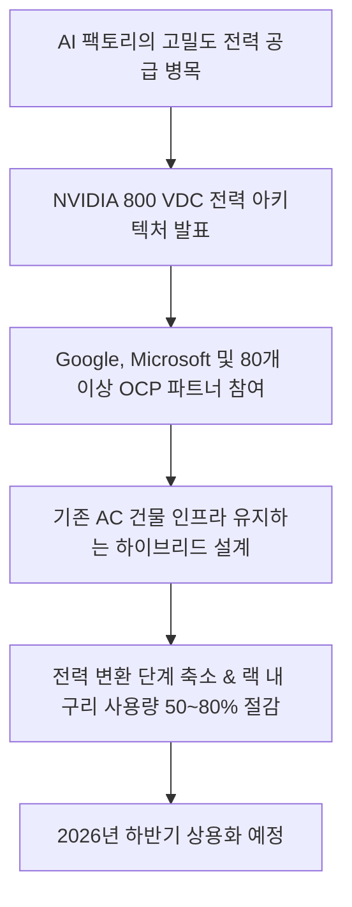
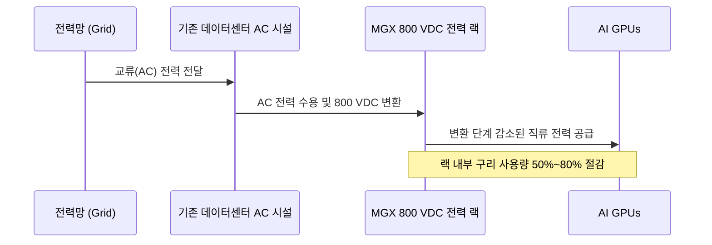
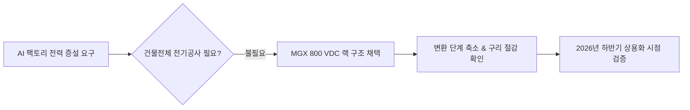

위 다이어그램은 NVIDIA가 발표한 800 VDC 전력 아키텍처의 핵심 흐름을 한눈에 보여줍니다. 차세대 AI 데이터센터의 전력 병목을 풀기 위해 업계 주요 기업들이 어떤 방식으로 협력하고 있는지 파악할 수 있습니다.

## 무슨 일이 벌어진 걸까?

NVIDIA가 AI 팩토리의 고밀도 전력 공급 병목 현상을 극복하기 위해 MGX 호환 800 VDC(직류) 전력 랙 아키텍처를 발표했습니다 <sup class="source-citation"><a href="#source-1" aria-label="NVIDIA 공식 블로그 출처">[1]</a></sup>. 초대형 AI 모델을 학습시키고 실시간으로 추론할 때 가장 큰 장애물로 지목되던 전기 공급 문제를 랙 레벨에서 직접 해결하겠다는 구상입니다.

이번에 공개된 기술은 NVIDIA 단독 작품이 아닙니다. NVIDIA는 Google, Microsoft, 그리고 80개 이상의 Open Compute Project(OCP) 생태계 파트너들과 손잡고 800 VDC 오픈 표준 사양을 함께 개발했습니다 <sup class="source-citation"><a href="#source-2" aria-label="Network World 출처">[2]</a></sup>. 특정 기업만의 독점 기술이 아니라 데이터센터 산업 전반이 함께 사용할 수 있는 개방형 표준을 목표로 정한 셈입니다.

특히 흥미로운 지점은 데이터센터 건물의 기존 교류(AC) 전력 인프라를 대대적으로 재건축할 필요가 없다는 사실입니다. 이번 아키텍처는 기존 AC 데이터센터 시설 내에 800 VDC 연산 랙을 그대로 배치할 수 있도록 지원하는 하이브리드 방식입니다 <sup class="source-citation"><a href="#source-1" aria-label="NVIDIA 공식 블로그 출처">[1]</a></sup>. 해당 랙 아키텍처의 본격적인 상용화 시점은 2026년 하반기로 계획되어 있습니다 <sup class="source-citation"><a href="#source-3" aria-label="Wccftech 출처">[3]</a></sup>.

<figure class="news-source-image">
  
  <figcaption>Wccftech가 원문과 함께 공개한 이미지입니다. <a href="https://wccftech.com/nvidia-800-vdc-platforms-break-past-traditional-power-distros-to-scale-up-performance" target="_blank" rel="noopener noreferrer">출처: Wccftech</a></figcaption>
</figure>

## 왜 지금 다들 이 이야기를 할까?

AI 컴퓨팅 성능의 한계를 결정짓는 진짜 요소가 이제는 전력 배전 인프라로 이동했기 때문입니다. 수만 개의 GPU가 한 공간에서 동시에 작동하는 현대 AI 팩토리에서는 전력망(Grid)에서 전기를 끌어와 각 GPU 조각에 손실 없이 전달하는 일 자체가 엄청난 기술적 난제였습니다.

기존 전력 체계에서는 교류 전력을 직류로 바꾸고 다시 전압을 낮추는 등 전력 변환 단계를 여러 번 거쳐야 했습니다. 변환 단계가 많을수록 불필요한 에너지 손실이 발생하고 열이 발생합니다. 800 VDC 아키텍처는 전력망과 GPU 사이의 변환 단계를 대폭 줄여 전력 전달 효율을 끌어올립니다 <sup class="source-citation"><a href="#source-1" aria-label="NVIDIA 공식 블로그 출처">[1]</a></sup>.



위 시퀀스 다이어그램은 전력망에서 출발한 전기가 GPU까지 도달하는 과정을 나타냅니다. 중간 변환 단계를 단순화하여 전력 손실을 잡는 원리를 시각적으로 이해할 수 있습니다.

또한 전압을 800V 직류로 높여 공급하면 동일한 전력을 보낼 때 필요한 전류의 양이 줄어듭니다. 이는 곧 전선을 두껍게 만들 필요가 없어진다는 의미입니다. 실제로 이 방식을 적용하면 랙 내부에서 사용되는 구리(copper) 자원 사용량을 50%에서 최대 80%까지 절감할 수 있습니다 <sup class="source-citation"><a href="#source-2" aria-label="Network World 출처">[2]</a></sup>.

```chartjs
{
  "type": "bar",
  "data": {
    "labels": ["구리 사용량 절감 최소치", "구리 사용량 절감 최대치"],
    "datasets": [
      {
        "label": "랙 내부 구리 사용 절감 비율 (%)",
        "data": [50, 80]
      }
    ]
  },
  "options": {
    "plugins": {
      "title": {
        "display": true,
        "text": "800 VDC 전력 아키텍처 도입에 따른 랙 내부 구리 절감율"
      }
    }
  }
}
```

위 차트는 800 VDC 아키텍처 도입 시 기대할 수 있는 랙 내부 구리 사용량 절감 범위를 보여줍니다. 전력 전달 효율 향상과 자원 자재 절감 효과가 직관적으로 드러납니다.

## 그래서 우리에게 뭐가 달라질까?

데이터센터를 직접 운영하는 클라우드 기업과 AI 인프라 담당자에게는 대규모 비용 및 시설 투자 부담을 대폭 낮춰주는 현실적인 해결책이 생깁니다. 새로운 고성능 GPU 랙을 도입하기 위해 수천억 원을 들여 데이터센터 건물의 전력 설비를 새로 짓지 않아도 기존 AC 시설을 그대로 활용할 수 있기 때문입니다 <sup class="source-citation"><a href="#source-1" aria-label="NVIDIA 공식 블로그 출처">[1]</a></sup>.

동시에 구리 자원 절감과 전력 변환 단계를 통한 효율 증대는 인프라 운영 비용 최적화로 이어집니다 <sup class="source-citation"><a href="#source-2" aria-label="Network World 출처">[2]</a></sup>. 제가 보기엔 이러한 전력 효율 개선이 향후 AI 클라우드 컴퓨팅 서비스 가격 안정화에도 긍정적인 기초 체력이 될 것으로 기대됩니다.

일반 개발자와 이용자 관점에서도 중요한 의미를 가집니다. AI 모델이 점점 커지면서 전력 제약 때문에 컴퓨팅 단지 확장이 막히는 물리적 병목이 해소되면, 더 거대하고 강력한 AI 모델의 학습과 실시간 추론 서비스가 한층 안정적인 환경에서 지속적으로 확장될 수 있습니다.

## 직접 써보거나 지켜볼 포인트

인프라 도입 판단이나 기술 트렌드를 팔로우할 때 살펴봐야 할 의사결정 포인트는 다음과 같습니다.



위 의사결정 흐름도는 데이터센터 확장 시 기존 시설을 활용하면서 800 VDC 기술을 검토하는 단계를 나타냅니다.

첫째, 2026년 하반기 상용화 시점에 맞춰 주요 하드웨어 제조사들이 MGX 800 VDC 규격 호환 제품을 얼마나 신속하게 시장에 출하하는지 지켜봐야 합니다 <sup class="source-citation"><a href="#source-3" aria-label="Wccftech 출처">[3]</a></sup>.

둘째, Google, Microsoft 및 80여 개 OCP 파트너사들이 이 표준 사양을 자신들의 글로벌 데이터센터에 얼마나 빠르게 확장 배치하는지 검증하는 것이 좋습니다 <sup class="source-citation"><a href="#source-2" aria-label="Network World 출처">[2]</a></sup>. 글로벌 빅테크의 실제 도입 속도가 전체 하드웨어 생태계의 표준화 속도를 결정짓기 때문입니다.

## 아직은 선을 그어야 할 부분

반드시 냉정하게 짚고 넘어갈 한계점들도 존재합니다.

첫째, 이번 발표는 기술 규격 및 표준 아키텍처의 공개이며 실제 상용 제품 출시는 2026년 하반기로 예정되어 있습니다 <sup class="source-citation"><a href="#source-3" aria-label="Wccftech 출처">[3]</a></sup>. 따라서 당장 운영 중인 데이터센터 현장에 즉각 투입할 수 있는 완성품 단계는 아닙니다.

둘째, 건물 수준의 AC 전력 시설 전체를 갈아엎을 필요는 없지만, 랙 내부 단위에서의 800V 직류 전력 공급을 받아들이기 위한 전용 변환 장비 및 OCP 규격 랙 구축 비용은 별도로 수반됩니다 <sup class="source-citation"><a href="#source-1" aria-label="NVIDIA 공식 블로그 출처">[1]</a></sup>.

셋째, 실제 현장 투입 시 얻을 수 있는 구체적인 전력 손실 단가 절감액이나 투자 대비 수익률(ROI) 같은 상세 실측 수치는 2026년 하반기 실증 제품 배치가 이뤄진 이후에야 정밀한 검증이 가능합니다.

## 자주 묻는 질문

### NVIDIA가 발표한 800 VDC 전력 아키텍처는 무엇인가요?

AI 데이터센터(AI 팩토리)의 전력 배전 병목을 해결하기 위해 개발된 MGX 호환 800V 직류 전력 랙 규격입니다 [NVIDIA 공식 블로그](https://blogs.nvidia.com/blog/800-vdc-power-architecture-ai-factories). Google, Microsoft 등 80개 이상의 OCP 파트너와 함께 공동 개발되었으며 전력 변환 단계를 줄여 연산 밀도를 높여줍니다.

### 기존 데이터센터 건물을 전면 재건축해야 도입할 수 있나요?

아닙니다, 기존 건물의 교류(AC) 전력 시설 전체를 교체하지 않고도 800 VDC 연산 랙을 그대로 배치할 수 있는 하이브리드 아키텍처입니다 [NVIDIA 공식 블로그](https://blogs.nvidia.com/blog/800-vdc-power-architecture-ai-factories).

### 800 VDC 전력 아키텍처의 구체적인 절감 효과와 상용화 시기는 언제인가요?

랙 내부 구리 자원 사용량을 50%에서 80%까지 줄이고 전력 손실을 줄이며, 실제 상용 제품은 2026년 하반기에 출시될 예정입니다 [Network World](https://www.networkworld.com/article/3522295/google-microsoft-and-nvidia-back-800v-dc-standard-for-ai-data-centers.html), [Wccftech](https://wccftech.com/nvidia-800-vdc-platforms-break-past-traditional-power-distros-to-scale-up-performance).

## 직접 확인한 원문

<ol class="checked-source-list">
  <li id="source-1"><a href="https://blogs.nvidia.com/blog/800-vdc-power-architecture-ai-factories" target="_blank" rel="noopener noreferrer">NVIDIA — Why Scaling AI Compute Performance Requires a New Power Architecture</a> (2026-08-11)</li>
  <li id="source-2"><a href="https://www.networkworld.com/article/3522295/google-microsoft-and-nvidia-back-800v-dc-standard-for-ai-data-centers.html" target="_blank" rel="noopener noreferrer">Network World — Google, Microsoft and Nvidia back 800V DC standard for AI data centers</a> (2026-08-13)</li>
  <li id="source-3"><a href="https://wccftech.com/nvidia-800-vdc-platforms-break-past-traditional-power-distros-to-scale-up-performance" target="_blank" rel="noopener noreferrer">Wccftech — NVIDIA Ditches AC Power For 800 VDC AI Factories To Scale Up Compute, Backed By Microsoft, Google and 80 Ecosystem Firms For 2H 2026</a> (2026-08-13)</li>
</ol>

> 이 글은 위 원문을 직접 확인해 작성했습니다. 가격, 기능 범위, 지역별 제공 여부는 게시 후 바뀔 수 있으니 실제 도입 전 공식 문서를 다시 확인하세요.
