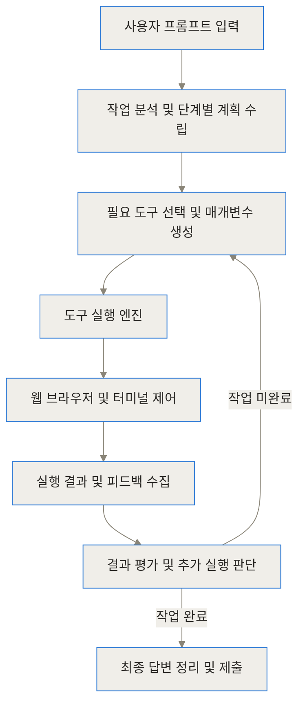
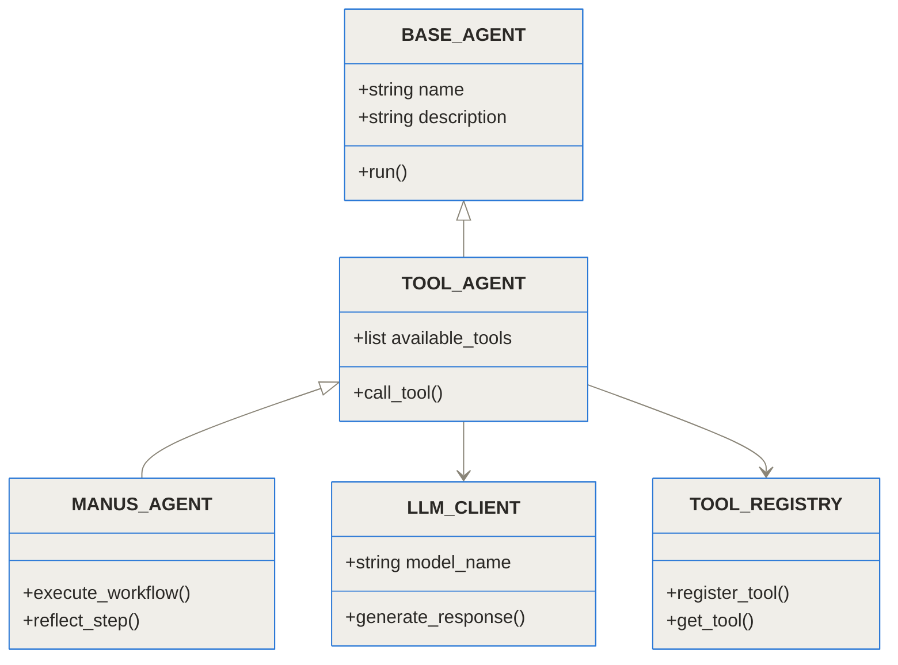
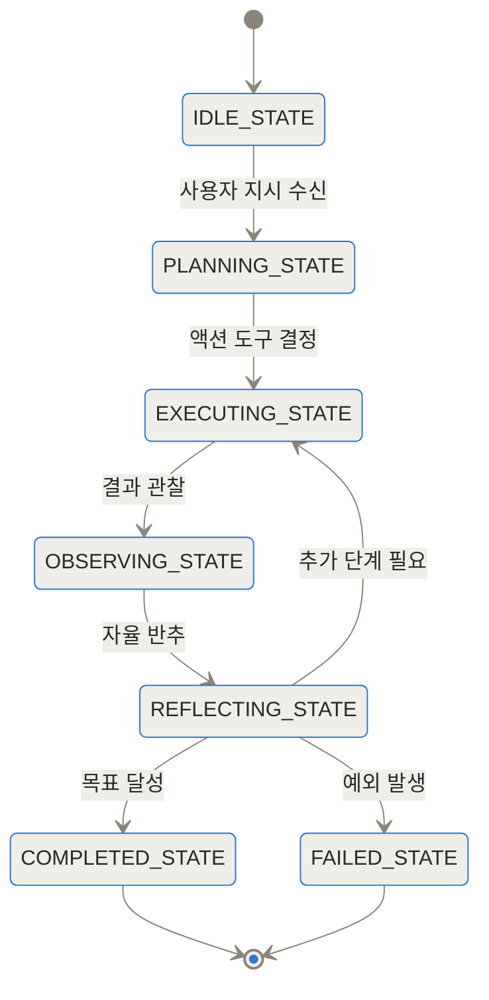
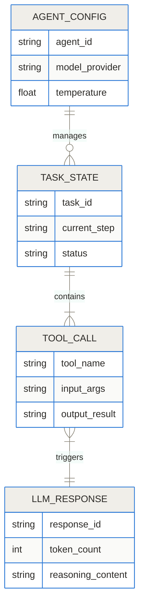
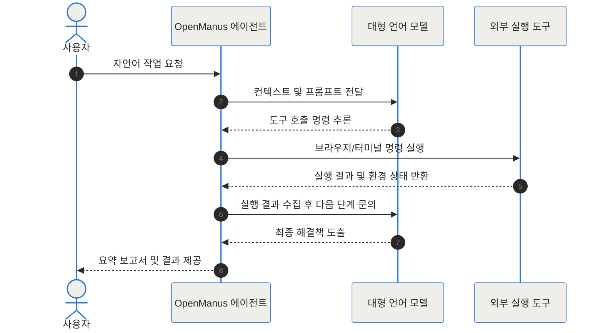
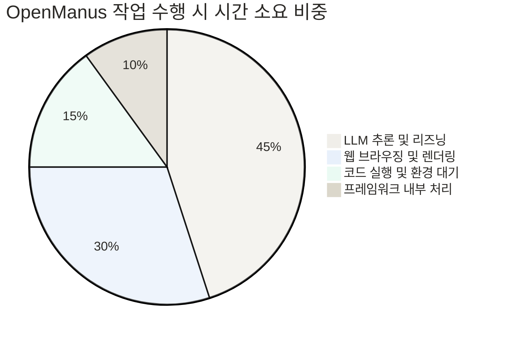

[OpenManus GitHub 저장소](https://github.com/mannaandpoem/OpenManus) | [OpenManus 공식 문서](https://openmanus.github.io/)

## 자율형 AI 에이전트의 새로운 선택지

복잡한 요구사항을 자연어로 입력하면 스스로 계획을 세우고, 웹 검색을 수행하며, 코드를 작성하고 실행 결과까지 검증해 주는 자율형 AI 에이전트(Autonomous AI Agent)가 주목받고 있어요. 하지만 기존 상용 에이전트 서비스들은 엄격한 웨이트리스트나 초대 코드 제약으로 인해 일반 개발자와 연구자들의 접근이 자유롭지 못했죠.

이러한 폐쇄형 생태계의 장벽을 허물고 누구나 제한 없이 고성능 자율 에이전트를 구축할 수 있도록 등장한 프로젝트가 바로 OpenManus예요. MetaGPT 커뮤니티의 기여자들이 중심이 되어 공개한 이 프로젝트는 공개 직후 오픈소스 생태계에서 뜨거운 반응을 얻으며 빠르게 발전하고 있어요.

> **TL;DR (한 줄 요약)**
> - OpenManus는 초대 코드가 필요 없는 완전히 개방된 오픈소스 자율형 AI 에이전트 프레임워크예요.
> - 웹 브라우징, 터미널 실행, 파일 조작 등의 외부 도구를 자율적으로 조합해 다단계 복합 과제를 해결해요.
> - Python과 비동기 커스텀 구조를 기반으로 다양한 LLM 연동 및 강화학습 파이프라인까지 자유롭게 확장 가능해요.

## OpenManus란 무엇이며 왜 등장했나

기존의 대화형 AI는 사용자에게 친절한 답변을 제공하지만, 실제 행동을 대신 해주는 데에는 한계가 있었어요. 예를 들어 최신 데이터 분석 라이브러리를 비교 조사해서 웹사이트 데이터를 수집하고 요약 보고서 파일로 저장해 달라는 요청이 들어왔을 때, 기존 대화형 모델은 안내 코드나 절차를 텍스트로만 알려줄 뿐이었죠. 사용자는 결국 브라우저를 열고 코드를 직접 복사해서 실행해야 하는 번거로움을 겪어야 했어요.

이러한 불편을 해결하기 위해 나타난 자율 에이전트 서비스들은 뛰어난 성능을 보여주었지만, 폐쇄적인 초대 코드 정책과 불투명한 내부 작동 구조라는 새로운 문제를 안겨주었어요. 내부에서 어떤 프롬프트가 동작하는지, 어떤 도구가 어떤 순서로 호출되는지 알 수 없어 현업 시스템에 이식하거나 커스터마이징하는 것이 사실상 불가능했더라고요.

OpenManus는 바로 이 지점에서 출발해요. 개발자가 자신의 로컬 환경이나 클라우드 인프라에 직접 에이전트를 배포하고, 원하는 대형 언어 모델과 커스텀 도구를 자유롭게 붙여서 제어할 수 있는 투명한 오픈소스 기반을 제공하는 것이 주요 목적이에요.

## OpenManus는 어떤 방식으로 작동하나

OpenManus의 작동 방식을 쉽게 이해하기 위해, 일을 아주 잘하는 신입 소프트웨어 엔지니어를 한 명 고용했다고 생각해 볼까요?

사수가 경쟁사 요금제를 조사해서 엑셀 보고서로 만들어 놓으라고 지시했다고 해봐요. 이 신입 개발자는 모르는 것이 나오면 무작정 질문하기보다 다음과 같은 단계로 스스로 생각하고 행동해요.

1. **계획 수립**: 우선 경쟁사 웹사이트 3곳을 접속해서 요금제 페이지를 확인하고, 데이터를 수집한 뒤 파일로 저장하겠다고 구상해요.
2. **도구 선택 및 실행**: 브라우저 도구를 사용해 경쟁사 사이트에 접속하고, 웹 페이지의 텍스트와 표 데이터를 스크래핑해요.
3. **결과 관찰**: 수집된 데이터가 정확한지, 차단된 페이지는 없는지 실행 결과를 확인해요.
4. **반추 및 자율 수정**: 만약 특정 사이트에서 접근 거부 에러가 발생했다면, 다른 검색 쿼리로 접근하거나 다른 도구를 사용하도록 계획을 수정해요.

OpenManus는 바로 이 추론, 행동, 관찰, 반추의 순환 고리를 무한히 반복하면서 사용자가 부여한 최종 목표가 달성될 때까지 스스로 작업을 추진하는 구조예요.

## OpenManus 내부 구조와 모듈 설계 파헤치기

OpenManus의 백엔드는 단순한 프롬프트 연동 스크립트가 아니라, 비동기 파이프라인과 객체지향 설계 패턴으로 구성되어 있어요. 프로젝트 전체를 지탱하는 주요 시스템 파이프라인을 다이어그램으로 살펴보죠.



### 1) 클래스 상속 체계와 역할 분담

OpenManus는 재사용성을 높이기 위해 에이전트 클래스를 단계별로 추상화했어요. 기본 에이전트 클래스에서부터 도구 호출 기능이 추가된 상위 에이전트로 확장되는 구조죠.



- **BASE_AGENT**: 에이전트의 상태 관리 및 기본 실행 입출력을 담당하는 최상위 추상 클래스예요.
- **TOOL_AGENT**: LLM이 반환하는 JSON 형태의 함수 호출 규격을 해석하여 등록된 도구를 안전하게 호출해 줘요.
- **MANUS_AGENT**: OpenManus의 메인 에이전트로, 브라우저 탐색, 터미널 명령 실행, 파일 시스템 읽기 및 쓰기 등 모든 시스템 도구를 총괄 제어하며 자율 반추 작업을 수행해요.

### 2) 작업 생명주기와 상태 전이

에이전트가 단일 요청을 처리하는 과정에서 거치는 내부 상태 흐름을 상태도(State Diagram)로 표현하면 다음과 같아요.



에이전트는 각 단계에서 발생한 도구 실행 결과를 단기 기억 버퍼에 누적해요. 만약 OBSERVING_STATE에서 도구 실행 실패나 타임아웃이 감지되면 REFLECTING_STATE로 전이하여 원인을 분석하고 대체 전략을 세우더라고요.

### 3) 데이터 모델과 엔티티 관계

OpenManus 내부 데이터 구조는 Pydantic을 통해 엄격하게 검증돼요. 에이전트 설정, 작업 상태, 도구 호출 기록 간의 관계는 아래 엔티티 관계도와 같아요.



### 4) 실시간 상호작용 및 시퀀스 흐름

사용자가 요청을 보냈을 때 백엔드 비동기 엔진이 LLM과 외부 도구 간에 상호작용하는 시퀀스를 정리했어요.



### 5) 소스 코드 구현 디테일

app/agent/toolcall.py에 구현된 실행 루프 코드를 살펴보면, Python의 asyncio 기반으로 도구 실행과 LLM 응답 대기가 비동기적으로 처리되는 것을 확인할 수 있어요.

```python
import asyncio
from typing import List, Dict, Any
from app.agent.base import BaseAgent
from app.llm import LLMClient
from app.tool.base import ToolCollection

class ToolCallAgent(BaseAgent):
    def __init__(self, name: str, llm: LLMClient, tools: ToolCollection):
        super().__init__(name=name)
        self.llm = llm
        self.tools = tools
        self.messages: List[Dict[str, Any]] = []

    async def step(self) -> bool:
        response = await self.llm.generate(messages=self.messages, tools=self.tools.to_schema())
        self.messages.append(response.to_message())

        if not response.tool_calls:
            return True

        for tool_call in response.tool_calls:
            tool_name = tool_call.function.name
            args = tool_call.function.arguments
            
            result = await self.tools.execute(name=tool_name, args=args)
            
            self.messages.append({
                "role": "tool",
                "tool_call_id": tool_call.id,
                "content": str(result)
            })
        return False
```

이처럼 OpenManus는 단순한 프롬프트 조합이 아닌, 비동기 루프 내에서 도구 호출 결과를 받아 다음 추론 단계로 피드백하는 구조를 형성하고 있어요.

## OpenManus 설치 및 실행 방법

OpenManus는 Python 3.12 이상의 환경을 권장하며, 패키지 매니저로 uv 또는 conda를 지원해요. 속도와 의존성 해결 측면에서는 uv를 사용하는 것이 빠르더라고요.

### 1단계: 저장소 복제 및 가상환경 구성

터미널을 열고 다음 명령어를 순서대로 실행해 환경을 구축해요.

```bash
git clone https://github.com/mannaandpoem/OpenManus.git
cd OpenManus

curl -LsSf https://astral.sh/uv/install.sh | sh
uv venv --python 3.12
source .venv/bin/activate

uv pip install -r requirements.txt
playwright install
```

### 2단계: API 키 및 모델 환경 설정

프로젝트 루트 디렉토리에 위치한 config/config.toml 파일을 열어 사용할 LLM 정보와 API 키를 설정해요.

```toml
[llm]
model = "gpt-4o"
base_url = "https://api.openai.com/v1"
api_key = "sk-YOUR-OPENAI-API-KEY"
max_tokens = 4096
temperature = 0.0

[agent]
max_steps = 30
system_prompt_path = "app/prompt/manus.toml"
```

### 3단계: 대화형 에이전트 실행

모든 설정이 완료되면 메인 스크립트를 실행하여 자율 에이전트와 대화를 시작할 수 있어요.

```bash
python main.py
```

터미널 화면에 에이전트의 생각 과정, 사용할 도구 선택 이유, 실행 결과가 실시간으로 출력되며 작업이 진행돼요.

## 현업에서 OpenManus를 활용하는 방법

OpenManus가 가진 가장 큰 장점은 복잡한 지시를 내렸을 때 사람이 개입하지 않아도 작업을 진행한다는 점이에요. 현업에서 유용하게 쓰이는 3가지 실전 시나리오를 소개해 볼게요.

### 시나리오 1: IT 기술 동향 분석 및 요약 문서 자동 생성

- **요청 문구**: 최신 자율 AI 에이전트 관련 논문 3편과 GitHub 오픈소스 2개를 조사하고, 주요 특징과 기술 스택을 비교한 마크다운 보고서를 result.md 파일로 작성해줘.
- **자율 수행 과정**:
  1. Google Search 도구를 호출해 관련 논문과 저장소를 검색해요.
  2. Browser-use 도구로 해당 웹 페이지들에 접속해 본문 텍스트를 수집해요.
  3. 수집된 정보를 바탕으로 공통점과 차이점을 종합 분석해요.
  4. File Write 도구를 호출해 result.md 파일로 작성해요.

### 시나리오 2: 로컬 코드 베이스 버그 수정 및 테스트 실행

- **요청 문구**: 현재 프로젝트의 tests 폴더에 있는 파이썬 단위 테스트를 실행하고, 실패하는 테스트가 있다면 원인을 분석해 코드 버그를 수정한 뒤 다시 테스트를 통과시켜줘.
- **자율 수행 과정**:
  1. Bash Execution 도구로 pytest 명령어를 실행해 실패한 테스트 로그를 확인해요.
  2. 파일 읽기 도구로 문제가 발생한 파이썬 소스 코드 파일과 테스트 코드를 확인해요.
  3. LLM의 추론 기능을 활용해 버그 원인을 파악해요.
  4. 파일 수정 도구로 소스 코드를 교정하고, 다시 pytest를 실행하여 통과 여부를 검증해요.

### 시나리오 3: 웹 스크래핑 파이프라인 자동화 스크립트 작성

- **요청 문구**: 특정 뉴스 사이트의 헤드라인을 가져오는 Python 스크립트를 작성하고, 직접 실행해서 작동하는지 확인해줘.
- **자율 수행 과정**:
  1. 뉴스 사이트의 HTML 구조를 웹 브라우저 도구로 확인해요.
  2. BeautifulSoup 및 requests를 이용하는 파이썬 코드를 생성해요.
  3. 파이썬 실행 도구로 스크립트를 직접 구동해 정상 동작을 검증해요.

## OpenManus와 기존 방식 비교

OpenManus의 위치와 역량을 정확히 파악하기 위해, 기존의 단일 프롬프트 방식 및 상용 폐쇄형 에이전트 서비스와 비교해 보았어요.

| 비교 항목 | 단일 프롬프트 대화형 LLM | 상용 폐쇄형 에이전트 | OpenManus 오픈소스 |
| :--- | :--- | :--- | :--- |
| **접근성** | 즉시 사용 가능 | 초대 코드 및 대기열 존재 | 소스 복제 후 즉시 사용 가능 |
| **도구 실행 권한** | 제한적 또는 없음 | 서버 샌드박스 내부 실행 | 로컬 브라우저 및 터미널 제어 |
| **커스텀 도구 추가** | 불가능 | 제공된 도구만 사용 | 파이썬 코드로 자유롭게 확장 |
| **LLM 모델선택** | 해당 플랫폼 전용 모델 사용 | 고정된 백엔드 모델 | GPT-4o, Claude, DeepSeek 등 선택 |
| **비용 구조** | 월 구독료 또는 토큰 비용 | 월 구독료 | 사용한 LLM API 실비용만 지불 |
| **데이터 보안** | 외부 서버에 데이터 전송 | 외부 서버에 데이터 전송 | 로컬 격리 환경 구축 가능 |

다음 차트는 복합 과제 수행 능력과 환경 자동 재시도율 측면에서의 성공률 비교를 나타내요.

```chartjs
{
  "type": "bar",
  "data": {
    "labels": ["단일 프롬프트 대화형 LLM", "기존 스크립트 자동화", "OpenManus 자율 에이전트"],
    "datasets": [
      {
        "label": "복합 다단계 작업 성공률 (%)",
        "data": [28, 45, 82]
      },
      {
        "label": "환경 변수에 따른 자동 재시도율 (%)",
        "data": [0, 15, 78]
      }
    ]
  }
}
```

또한, 각 기능 영역별 역량 수준을 레이더 차트로 시각화하면 OpenManus의 다중 모델 호환성과 확장성이 돋보여요.

```chartjs
{
  "type": "radar",
  "data": {
    "labels": ["웹 정보 수집", "코드 작성 및 실행", "자율 오류 수정", "다중 모델 호환성", "커스텀 도구 확장성"],
    "datasets": [
      {
        "label": "OpenManus",
        "data": [85, 88, 80, 95, 90]
      },
      {
        "label": "폐쇄형 에이전트 서비스",
        "data": [90, 85, 75, 50, 40]
      }
    ]
  }
}
```

에이전트가 과제를 수행할 때 내부적으로 소요되는 작업 시간 비중은 다음과 같이 분포해요.



## OpenManus 도입 시 주의해야 할 한계점

OpenManus는 훌륭한 오픈소스 대안이지만, 실제 현업에 도입할 때는 몇 가지 주의해야 할 한계점이 있어요.

### 1) 무한 루프 위험과 API 비용 누적

에이전트가 모호한 지시를 받거나 외부 웹사이트의 구조 변경으로 인해 도구 실행에 계속 실패할 경우, 자율 반추 과정에서 동일한 시도를 반복하는 무한 루프에 빠질 수 있어요. 이 경우 대량의 토큰이 LLM에 반복 전송되어 상당한 API 비용이 청구될 위험이 있더라고요. 따라서 config.toml에서 max_steps 매개변수를 적절한 수준(예: 20~30회)으로 제한하는 것이 필요해요.

### 2) 로컬 시스템 권한 및 보안 리스크

OpenManus는 개발자의 로컬 터미널에서 파이썬 코드나 쉘 명령어를 직접 실행할 수 있어요. 검증되지 않은 외부 웹페이지 데이터를 스크래핑하는 과정에서 프롬프트 주입 공격에 노출될 경우, 의도치 않은 파일 삭제나 시스템 설정 변경 명령이 수행될 여지가 있어요. 이를 방지하려면 Docker 컨테이너나 격리된 가상 머신 내부에서 작동시켜야 해요.

### 3) 강화학습 기반 최적화(OpenManus-RL)의 필요성

단순 프롬프트 지시만으로는 복잡한 다단계 환경에서 에이전트가 최적의 경로를 선택하지 못할 때가 있어요. 이를 극복하기 위해 프로젝트 팀은 UIUC 연구진과 협력하여 GRPO 기반의 OpenManus-RL을 공개하고 에이전트 정책 최적화를 추진하고 있어요.


강화학습을 통해 에이전트가 불필요한 브라우징이나 잘못된 시도를 줄이도록 파인튜닝하는 작업이 이어지고 있어요.

## 자율형 AI 에이전트 생태계의 미래

OpenManus는 특정 기업의 독점적인 상용 플랫폼에 의존하지 않고도, 개발자 누구나 고성능 자율 AI 에이전트를 소유하고 개선할 수 있음을 증명해 준 오픈소스 프로젝트예요.

단 몇 줄의 프롬프트를 넘어서 웹, 터미널, 파일 시스템을 직접 자유롭게 오가며 복잡한 현업 문제를 스스로 풀어내는 에이전트 기술은 앞으로 소프트웨어 개발의 형태를 변화시킬 것으로 기대돼요. 초대 코드를 기다리는 대신, OpenManus 저장소를 복제하여 나만의 맞춤형 AI 에이전트를 직접 구축해 보는 것을 추천해요.

## 자주 묻는 질문 (FAQ)

### OpenManus를 실행하려면 어떤 API 키가 필요한가요?

OpenManus는 다양한 대형 언어 모델을 지원하므로 OpenAI API 키, Anthropic Claude API 키, 또는 DeepSeek나 Qwen을 지원하는 LLM 제공업체의 API 키가 필요해요. config.toml 파일에 원하는 모델 이름과 API 키를 설정하면 곧바로 연동할 수 있으며, 로컬 LLM을 사용하는 것도 가능해요.

### 상용 자율형 에이전트인 Manus AI와 OpenManus의 차이점은 무엇인가요?

Manus AI는 초대 코드와 유료 구독 기반의 폐쇄형 웹 서비스인 반면, OpenManus는 누구나 무료로 다운로드하여 소스 코드를 수정하고 로컬 환경에 구축할 수 있는 오픈소스 프로젝트예요. 또한 사용자가 원하는 커스텀 도구를 자유롭게 추가하거나 프롬프트 파이프라인 및 강화학습 구조를 직접 커스터마이징할 수 있는 확장성을 제공해요.

### 웹 브라우저 자동화 도구 실행 시 보안 문제는 없나요?

OpenManus는 웹 브라우징과 터미널 명령어 실행 권한을 에이전트에 부여하므로, 격리된 가상 환경 또는 Docker 컨테이너 내부에서 실행하는 것이 안전해요. 중요 개인정보가 담긴 환경에서 무제한 권한을 부여하면 의도치 않은 브라우저 동작이나 파일 변경이 일어날 수 있으므로 샌드박스 환경을 권장해요.

### OpenManus의 토큰 소비량을 줄이거나 비용을 최적화하는 방법이 있나요?

에이전트의 관찰 및 반추 루프가 길어질수록 컨텍스트 누적으로 인한 토큰 소비가 증가해요. 이를 최적화하려면 config.toml에서 추론 단계의 max_steps 수를 제한하거나, 추론 성능이 중요한 단계에는 Claude 3.5 Sonnet / GPT-4o를 사용하고 단순 결과 추출 단계에는 상대적으로 비용이 저렴한 모델을 배치하는 다중 모델 혼합 전략을 사용할 수 있어요.

### Python을 잘 몰라도 OpenManus를 설치하고 사용할 수 있나요?

기본적인 터미널 명령어와 Python 환경 설정을 다룰 줄 안다면 공식 가이드를 따라 몇 분 안에 설치할 수 있어요. 깃 저장소를 복제한 뒤 패키지를 설치하고 API 키만 config.toml에 입력하면 main.py 명령어로 바로 자율형 에이전트를 테스트할 수 있어요.


## References
- [https://github.com/mannaandpoem/OpenManus](https://github.com/mannaandpoem/OpenManus)
- [https://openmanus.github.io/](https://openmanus.github.io/)
