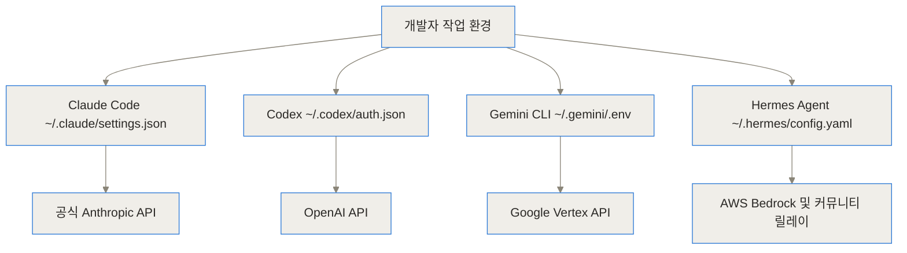
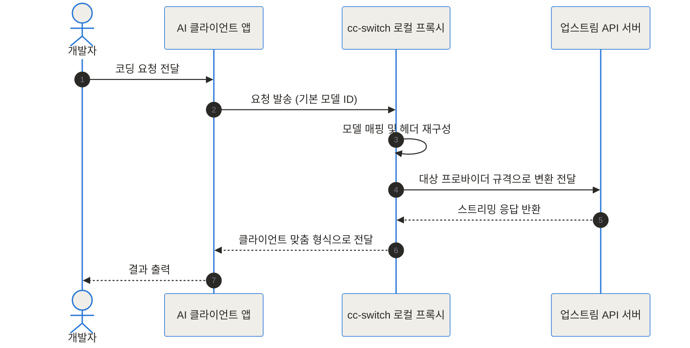
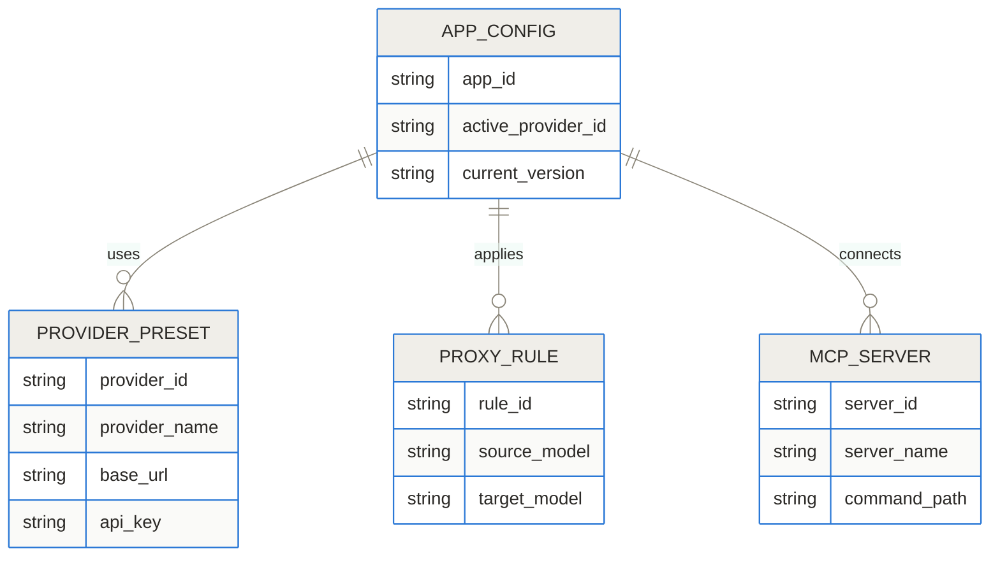
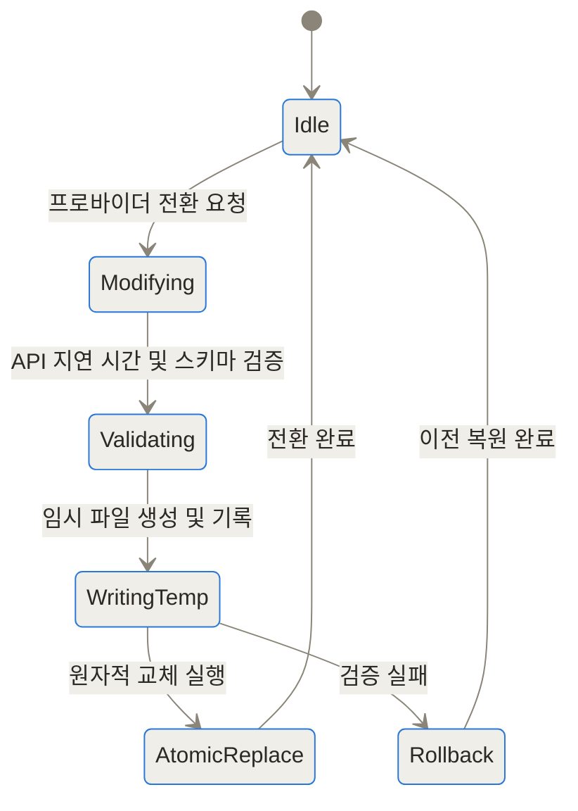
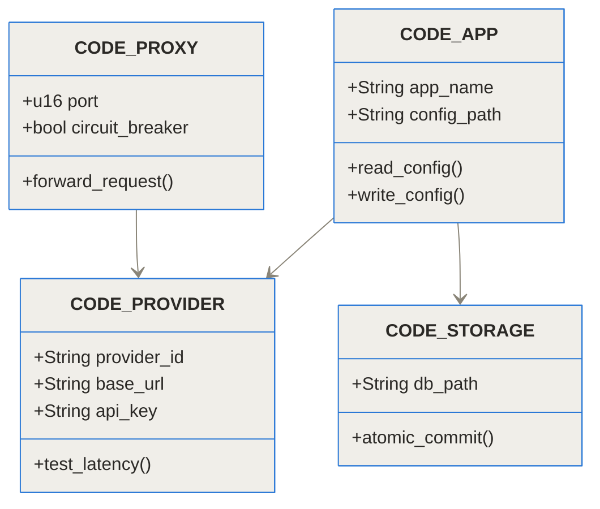
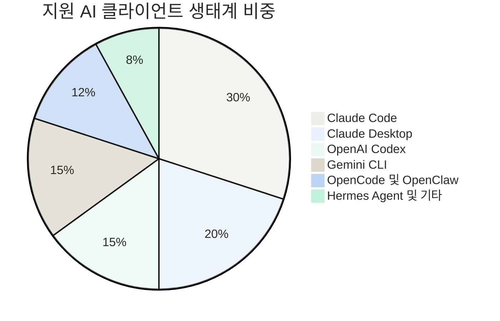
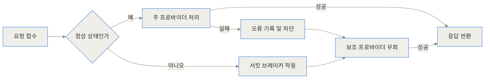

- [CC Switch GitHub 저장소](https://github.com/farion1231/cc-switch)
- [CC Switch 공식 웹사이트](https://ccswitch.io)

cc-switch는 Claude Code·Codex·Gemini CLI처럼 서로 다른 도구의 프로바이더 설정을 자주 바꾸는 사용자에게 유용합니다. 한곳에서 키와 프록시를 관리하면 편해지지만, 그 관리 앱이 여러 자격 증명의 단일 실패 지점이 되기도 합니다. 도입 전 저장 위치와 파일 권한, 백업 복원, 프록시 장애 시 요청 중복과 각 CLI 버전의 설정 호환성을 확인해야 합니다.

> **TL;DR (3줄 요약)**
> 1. Claude Code, Codex, Gemini CLI 등 다양한 AI 코딩 CLI 및 에디터의 프로바이더 설정과 API 키를 한곳에서 통합 관리해요.
> 2. 수동 설정 파일 편집 없이 원클릭 프로바이더 전환, 지연 시간 테스트, 로컬 프록시 게이트웨이 기반의 모델 매핑과 자동 페일오버를 지원해요.
> 3. Tauri 2와 Rust 백엔드로 구축되어 가볍고 빠르며, SQLite 기반 데이터 관리와 원자적 파일 쓰기로 설정 오염을 방지해요.

> **cc-switch 설정 화면에서 만나는 개념**
>
> - **프로바이더**: 모델 API를 실제로 제공하는 상위 서비스입니다. 엔드포인트·인증 키·사용할 모델 ID가 한 설정 묶음으로 연결됩니다.
> - **로컬 프록시 게이트웨이**: 코딩 도구의 요청을 사용자 컴퓨터에서 먼저 받은 뒤 선택한 프로바이더 형식으로 전달하는 중간 계층입니다. 편의성이 커지는 만큼 이 프로세스가 멈췄을 때의 영향도 확인해야 합니다.
> - **모델 매핑**: 클라이언트가 요청한 모델 이름을 상위 서비스가 이해하는 모델 ID로 대응시키는 규칙입니다. 이름이 비슷하다는 이유만으로 기능과 출력 품질까지 같아지는 것은 아닙니다.
> - **원자적 파일 쓰기**: 새 설정을 임시 파일에 기록하고 검증이 끝난 뒤 기존 파일과 교체하는 방식입니다. 쓰기 도중 실패해도 반쯤 수정된 JSON·YAML이 남는 위험을 줄입니다.
> - **자동 페일오버**: 주 프로바이더의 요청이 실패했을 때 미리 정한 대체 경로로 전환하는 동작입니다. 재시도가 중복 요청이나 예상 밖 모델 사용으로 이어지는지는 별도로 시험해야 합니다.
{: .prompt-info }

## 여러 AI 코딩 도구를 동시에 사용할 때 발생하는 문제는 무엇인가

최근 터미널과 에디터 환경에서 작동하는 AI 코딩 에이전트 도구가 급격히 늘어났어요. 대표적으로 Anthropic의 Claude Code, OpenAI의 Codex, Google의 Gemini CLI, 그 외에도 Grok Build, OpenCode, OpenClaw, Hermes Agent 등 다양한 도구가 현업에 도입되고 있죠. 하지만 개발자가 업무 목적이나 비용 효율성에 따라 여러 AI 모델을 교체하며 사용할 때 큰 작업 병목이 발생해요.

가장 큰 문제는 각 도구마다 설정 정보를 저장하는 위치와 파일 형식이 제각각이라는 점이에요. 예를 들어 Claude Code는 `~/.claude/settings.json`을 사용하고, Codex는 `~/.codex/auth.json`을, Gemini CLI는 `~/.gemini/.env` 환경변수를 참조하며, Hermes Agent는 `~/.hermes/config.yaml`을 읽어 들여요. 공식 API 엔드포인트에서 AWS Bedrock, NVIDIA NIM, 혹은 커뮤니티 릴레이 서비스나 로컬 Ollama 모델로 프로바이더를 변경하려면 매번 해당 경로의 설정 파일을 직접 열어서 JSON이나 YAML 구조를 수정해야 하죠.

이러한 수동 작업 과정에서 오탈자가 발생해 CLI 도구가 정상 작동하지 않거나, 보안 API 키가 잘못된 위치에 노출되는 위험이 상존해요. 또한 Windows 호스트 환경과 WSL(Windows Subsystem for Linux) 가상 환경을 함께 사용하는 경우 양쪽의 설정 경로를 각각 동기화해야 하는 번거로움도 존재해요.



## cc-switch는 이러한 복잡한 환경을 어떻게 단순화하는가

`farion1231/cc-switch` 프로젝트는 이러한 파편화된 AI CLI 설정 생태계를 단일 제어판으로 통합하기 위해 탄생한 오픈소스 데스크톱 애플리케이션이에요. 쉽게 비유하자면, 다양한 가전제품의 전원 플러그를 매번 뽑았다 꼈다 하는 대신, 중앙에서 스위치 하나로 전원과 전압을 한 번에 제어하는 **스마트 멀티탭**과 같은 역할을 해요.

개발자는 더 이상 개별 파일 경로를 찾아 들어갈 필요가 없어요. cc-switch의 직관적인 GUI 화면이나 시스템 트레이(System Tray) 메뉴에서 원하는 프로바이더를 클릭하기만 하면, 앱이 알아서 해당 도구의 설정 파일을 정확한 스키마로 원자적 업데이트를 수행해요.

또한 AWS Bedrock, NVIDIA NIM, 커뮤니티 API 릴레이 등 50여 개 이상의 주요 프로바이더 프리셋이 미리 등록되어 있어, 사용자는 발급받은 API 키만 입력하면 몇 초 만에 완벽한 연동 환경을 구축할 수 있어요.

```chartjs
{"type":"bar","data":{"labels":["수동 파일 수정","환경변수 재설정","cc-switch 원클릭 전환"],"datasets":[{"label":"설정 전환 소요 시간(초)","data":[180,120,3]}]}}
```

## cc-switch 내부 작동 원리와 아키텍처 깊이 들여다보기

cc-switch는 성능과 메모리 효율성을 극대화하기 위해 Tauri 2 프레임워크와 Rust 언어를 기반으로 구축되었어요. 프론트엔드는 React와 TypeScript로 구성되어 직관적인 사용자 경험을 제공하고, 백엔드는 Rust 가 핵심 로직을 담당하여 리소스 점유율을 수 메가바이트 수준으로 낮게 유지해요.

### 로컬 프록시 게이트웨이와 모델 매핑 엔진

cc-switch의 주요 기능 중 하나는 앱 내부에 구현된 **로컬 프록시 게이트웨이(Local Proxy Gateway)**예요. 일부 AI 에디터(예: Claude Desktop)는 공식 Anthropic 모델 이름(`claude-3-5-sonnet` 등)만을 강제로 요구하는 제약이 있어요. cc-switch 프록시 게이트웨이는 이 요청을 중간에서 수신하여 사용자가 지정한 업스트림 프로바이더의 모델 ID로 유연하게 변환(Model Mapping)해 줘요.



### 데이터 모델 및 저장소 구조

cc-switch는 내부 구성을 안전하게 수용하기 위해 SQLite 데이터베이스를 채택하고 있어요. 앱 버전 업그레이드 시 마이그레이션 파이프라인(예: v9에서 v10으로의 마이그레이션)이 자동으로 작동하여 데이터 손실 없이 구성을 보존해요.



### 원자적 파일 쓰기와 트랜잭션 안전성

설정 파일을 수정하는 도중 컴퓨터가 꺼지거나 오류가 발생하면 CLI 도구 전체가 동작 불능 상태에 빠질 수 있어요. cc-switch는 이를 방지하기 위해 **원자적 쓰기(Atomic Write)** 패턴을 사용해요. 새로운 설정을 적용할 때 임시 파일(`.tmp`)에 먼저 기록하고, 파싱 및 검증을 통과한 경우에만 기존 파일을 교체(Replace)하는 방식이에요. 문제 발생 시 이전 정상 상태로 즉시 롤백돼요.



### 백엔드 모듈 및 계층 구조

Rust 코어는 각 역할에 맞게 명확히 모듈화되어 있어 높은 안정성과 테스트 커버리지를 보장해요.



### 생태계 클라이언트 비중

cc-switch가 관리하는 대표적인 CLI 및 AI 에디터 생태계 비중은 다음과 같이 다양하게 분포되어 있어요.



### 서킷 브레이커와 자동 페일오버 시스템

지정된 프로바이더 API에서 5xx 서버 오류나 네트워크 타임아웃이 발생하면, cc-switch의 서킷 브레이커(Circuit Breaker)가 상태를 차단하고 미리 설정된 보조 프로바이더 엔드포인트로 요청을 우회 처리해요.



## 어떻게 설치하고 구성하는가

cc-switch는 Windows, macOS, Linux 등 주요 운영체제를 모두 지원해요. 각 플랫폼에 맞는 최신 바이너리를 간편하게 설치할 수 있어요.

### macOS 사용자 설치

macOS 환경에서는 Homebrew Cask를 통해 명령어 한 줄로 편리하게 설치할 수 있어요.

```bash
brew install --cask cc-switch
```

업데이트가 필요할 때는 다음 명령어를 실행하면 돼요.

```bash
brew upgrade --cask cc-switch
```

### Windows 및 Linux 설치

- **Windows**: [CC Switch GitHub Releases](https://github.com/farion1231/cc-switch/releases) 페이지에서 `.msi` 설치 파일이나 무설치 무이동 포터블 `.zip` 파일을 다운로드하여 실행해요.
- **Linux**: Debian/Ubuntu 계열용 `.deb`, Fedora/RHEL 계열용 `.rpm`, 혹은 범용 `.AppImage` 패키지를 제공해요.


### 프로바이더 설정 및 MCP 연동 예시

앱을 실행한 뒤 새로운 프로바이더를 추가할 때는 프리셋 목록에서 원하는 플랫폼(예: AWS Bedrock, NVIDIA NIM, PackyCode 등)을 선택하거나, 사용자 정의 Base URL과 API 키를 직접 입력해요. Model Context Protocol(MCP) 서버 역시 GUI 내에서 원클릭으로 활성화하거나 비활성화할 수 있어요.

```json
{
  "provider_name": "Custom-Bedrock-Relay",
  "base_url": "https://bedrock-runtime.us-east-1.amazonaws.com",
  "api_key": "sk-custom-api-key-example",
  "models": {
    "sonnet": "anthropic.claude-3-5-sonnet-20241022-v2:0",
    "haiku": "anthropic.claude-3-haiku-20240307-v1:0"
  }
}
```

## 실전 트러블슈팅과 활용 시나리오

### 시나리오 1: 메인 API 서비스 장애 시 자동 전환

개발 중 Anthropic 공식 API가 일시적 장애를 일으킬 경우, cc-switch의 지연 시간 측정(Speed Testing) 기능 및 페일오버 설정으로 AWS Bedrock 기반 프로바이더로 3초 만에 전환하여 작업 중단 없이 코딩을 이어갈 수 있어요.

### 시나리오 2: Claude Desktop에서 서드파티 LLM 모델 활용

Claude Desktop 앱은 공식 규격 외 엔드포인트 수정을 지원하지 않지만, cc-switch의 로컬 프록시 게이트웨이를 켜고 `127.0.0.1:8080` 포트로 트래픽을 라우팅하면, OpenCode나 다른 오픈소스 LLM 엔드포인트를 Claude Desktop 인터페이스에서 그대로 사용할 수 있어요.

### 시나리오 3: WSL 터미널과의 실시간 설정 동기화

Windows 데스크톱 GUI 환경에서 프로바이더를 바꿨을 때 WSL 내부 Linux 디렉터리의 `.claude/settings.json`까지 자동 동기화되므로, 터미널 재시작이나 스크립트 재실행 없이 즉시 새로 지정된 API 엔드포인트로 명령을 내릴 수 있어요.

```chartjs
{"type":"bar","data":{"labels":["공식 API","AWS Bedrock","NVIDIA NIM","커뮤니티 릴레이"],"datasets":[{"label":"평균 응답 지연 시간(ms)","data":[450,320,380,510]}]}}
```

## 기존 관리 방식과의 다각도 비교

기존 수동 방식 및 개별 환경변수 관리 스크립트와 cc-switch를 비교한 결과는 아래 표와 같아요.

| 비교 항목 | 수동 파일 직접 수정 | 환경변수(ENV) 스크립트 | cc-switch 활용 |
| :--- | :--- | :--- | :--- |
| **전환 편의성** | 파일 경로 수동 탐색 및 편집 | 터미널 명령어 및 export 수동 입력 | 원클릭 GUI / 트레이 메뉴 전환 |
| **설정 안전성** | JSON 구문 오류 및 파손 위험 높음 | 세션 종료 시 설정 초기화 위험 | 원자적 쓰기 및 자동 백업(10개 보관) |
| **다중 도구 지원** | 도구별로 개별 파일 관리 필요 | 도구마다 변수 이름 개별 설정 | 단일 플랫폼 통합 중앙 제어 |
| **장애 대응** | 수동으로 타 엔드포인트 재입력 | 스크립트 재작성 필요 | 서킷 브레이커 기반 자동 페일오버 |
| **지연 시간 검서** | 별도 curl 테스트 필요 | 별도 스크립트 구현 필요 | 앱 내 실시간 원클릭 속도 측정 |

각 AI CLI 도구별 cc-switch 지원 기능 범위는 다음과 같이 정리할 수 있어요.

| 지원 AI 도구 | 프로바이더 원클릭 전환 | 로컬 프록시 라우팅 | MCP 서버 관리 | WSL 자동 동기화 |
| :--- | :--- | :--- | :--- | :--- |
| **Claude Code** | 지원 | 지원 | 지원 | 지원 |
| **Claude Desktop** | 지원 | 지원 (모델 매핑) | 지원 | 미적용 (GUI 전용) |
| **OpenAI Codex** | 지원 | 지원 | 지원하지 않음 | 지원 |
| **Gemini CLI** | 지원 | 지원 | 지원하지 않음 | 지원 |
| **Hermes Agent** | 지원 | 지원 | 지원 | 지원 |

## 솔직한 한계점과 고려해야 할 트레이드오프

cc-switch가 뛰어난 편의성을 제공하지만 사용 시 유의해야 할 점들도 존재해요.

1. **서드파티 프록시 이용 시 보안 주의**: 커뮤니티 릴레이나 제3자 엔드포인트를 등록할 때는 민감한 소스코드나 API 키가 외부로 노출되지 않는지 유의해야 해요. 로컬 프록시 자체는 사용자 컴퓨터 내에서만 작동하지만, 연결 대상 업스트림의 신뢰성을 확인해야 해요.
2. **공식 클라이언트 업데이트에 따른 영향**: Claude Code나 Codex의 설정 JSON 파일 구조가 공식 업데이트를 통해 대폭 변경되는 경우, cc-switch의 스키마 파서가 업데이트되기 전까지 일시적인 연동 불일치가 생길 수 있어요.
3. **로컬 프록시 레이어의 오버헤드**: 로컬 프록시 게이트웨이를 경과하는 경우 밀리초(ms) 단위의 미세한 지연이 발생할 수 있어요. 극단적인 응답 속도가 필요한 환경에서는 직접 공식 엔드포인트를 연결하는 것이 유리할 수 있어요.

## 앞으로의 전망과 결론

`farion1231/cc-switch` 프로젝트는 다양한 AI 코딩 도구와 LLM 프로바이더 사이에서 개발자가 겪던 파편화 문제를 깔끔하게 해결해 주는 제어판 도구예요. Tauri 2 기반의 가벼운 설치 용량과 빠른 반응 속도, 원자적 파일 처리를 통한 데이터 안정성을 갖추어 AI 기반 개발 흐름에서 생산성을 크게 높여줘요.

앞으로 더 많은 AI 에디터와 커뮤니티 프로바이더 프리셋이 확장됨에 따라, cc-switch는 AI 코딩 환경 구축 시 필수적인 보조 소프트웨어로 자리매김할 것으로 기대돼요.

<!-- primary-sources:start -->
## 원문과 버전 확인

- [공식 GitHub 저장소](https://github.com/farion1231/cc-switch)
<!-- primary-sources:end -->

<!-- internal-links:start -->
## 함께 읽으면 이해가 이어지는 글

- [opencodex: Codex CLI와 Claude Code에 원하는 언어 모델을 연결하는 방법]() — opencodex는 OpenAI Codex 도구 및 Claude Code에서 기본 모델 대신 Ollama, Gemini, DeepSeek 등 원하는 모든 언어 모델을 사용할 수 있게 해주는 강력한 로컬 프록시 도구입니다.
- [stablyai/orca: 멀티 AI 에이전트를 격리된 환경에서 병렬 실행하는 ADE 개발 플랫폼]() — stablyai/orca는 Claude Code, OpenAI Codex, Cursor CLI 등 여러 AI 코딩 에이전트를 단일 프로젝트 내에서 충돌 없이 병렬로 제어하는 오픈소스 ADE(Agent Development…
- [Destructive Command Guard: AI 코딩 에이전트의 터미널 명령어 실행을 통제하는 안전 계층 설계]() — AI 에이전트(Claude Code, Cursor 등)가 실행하는 파괴적인 셸 명령어를 서브 밀리초 단위로 사전 차단하고, 텍스트 피드백을 통해 AI가 스스로 안전한 명령어로 우회할 수 있도록 돕는 오픈소스 가드레일…
<!-- internal-links:end -->

## 자주 묻는 질문 (FAQ)

### cc-switch는 어떤 AI 코딩 도구를 지원하나요?

Claude Code, Claude Desktop, OpenAI Codex, Gemini CLI, Grok Build, OpenCode, OpenClaw, Hermes Agent 등 주요 AI 코딩 CLI 및 데스크톱 애플리케이션을 지원합니다. 단일 인터페이스에서 각 도구의 설정 파일과 API 엔드포인트를 손쉽게 전환할 수 있습니다.

### 여러 API 프로바이더를 등록해 사용할 때 API 키가 외부에 유출될 위험은 없나요?

cc-switch는 사용자의 모든 설정 파일과 API 키를 암호화된 로컬 SQLite 데이터베이스 및 각 도구의 로컬 설정 경로에만 저장합니다. 외부 서버로 API 키를 전송하지 않으며 모든 데이터 처리는 사용자 컴퓨터 내에서 원자적으로 수행됩니다.

### WSL(Windows Subsystem for Linux) 환경에서도 사용할 수 있나요?

네, cc-switch는 Windows 호스트 환경과 WSL 가상 환경 간의 디렉터리 변경 사항을 감지하여 설정을 자동으로 동기화하는 기능을 제공합니다. 이를 통해 Windows 데스크톱 GUI에서 설정한 프로바이더 정보가 WSL 터미널 환경에도 즉시 반영됩니다.

### Claude Desktop에서 서드파티 AI 모델이나 커뮤니티 릴레이를 연결해 쓸 수 있나요?

가능해요. cc-switch 내장 로컬 프록시 게이트웨이를 활성화하면 Anthropic의 모델명 제약을 우회하여 업스트림 프로바이더의 모델 ID와 Claude Desktop의 가상 모델 이름을 매핑해 줄 수 있습니다.

### 설정을 변경하다가 기존 설정 파일이 손상되거나 파손될 가능성은 없나요?

cc-switch는 설정 변경 시 임시 파일 생성 후 트랜잭션 검증을 거쳐 교체하는 원자적 파일 쓰기(Atomic Write) 방식을 채택하고 있습니다. 작업 중 오류가 발생하면 자동으로 이전 상태로 롤백되며, 최근 10개의 설정 백업이 회전식으로 자동 보관됩니다.


## References
- [https://github.com/farion1231/cc-switch](https://github.com/farion1231/cc-switch)
- [https://ccswitch.io](https://ccswitch.io)
