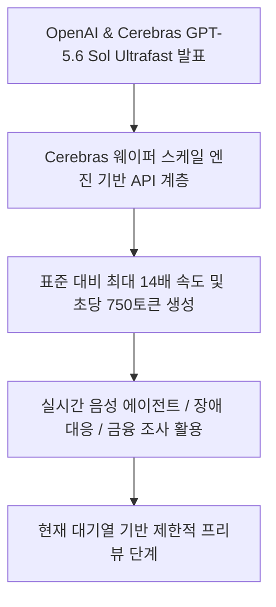
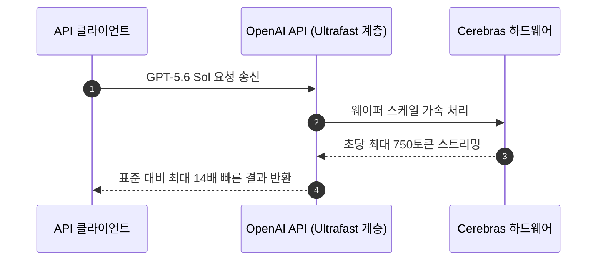
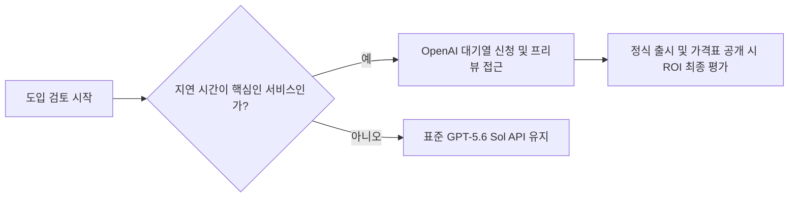

Ultrafast mode는 답변 생성 속도가 서비스 병목인 음성·코딩·운영 에이전트에서 시험할 프리뷰입니다. 초당 최대 750토큰은 출력이 시작된 뒤의 처리량 지표로, 첫 토큰 시간이나 검색·도구·음성 합성을 포함한 전체 응답 시간이 14배 줄어든다는 뜻은 아닙니다. 가격과 일반 제공 일정도 공개되지 않았으므로 기존 API를 대체하기보다 동일 요청으로 종단 지연과 비용을 비교해야 합니다.

AI가 아무리 똑똑해져도 답답한 응답 속도 때문에 실시간 서비스 도입을 주저했던 경험이 있으신가요? OpenAI가 Cerebras와 손잡고 기존 표준 처리보다 최대 14배 빠른 GPT-5.6 Sol Ultrafast mode를 전격 공개하며 이 문제를 해결하겠다고 나섰습니다.

> **초당 750토큰을 해석하는 데 필요한 지표**
>
> - **출력 처리량**: 응답 스트리밍이 시작된 뒤 일정 시간에 생성되는 토큰 수입니다. 긴 답변의 출력 구간은 잘 보여 주지만 요청을 보낸 직후의 대기까지 설명하지는 않습니다.
> - **첫 토큰 시간(TTFT)**: 요청 전송부터 첫 출력 조각이 도착할 때까지의 시간입니다. 답이 짧은 대화형 서비스에서는 최고 처리량보다 체감 속도에 더 큰 영향을 줄 수 있습니다.
> - **종단 지연 시간**: 네트워크·대기열·첫 토큰 계산·전체 생성·도구 호출과 후처리를 모두 합쳐 사용자가 결과를 받기까지 걸린 시간입니다. 표준 모드와 비교할 때 같은 입력과 출력 길이를 써야 합니다.
> - **제한적 프리뷰**: 정식 일반 제공 전에 선택된 사용자에게 기능과 운영 조건을 시험하는 단계입니다. 이 글의 공개 시점에는 가격과 일반 제공 일정이 확정되지 않았으므로 프리뷰 수치를 장기 운영 조건으로 간주하면 안 됩니다.
{: .prompt-info }

## 무슨 일이 벌어진 걸까?

OpenAI가 2026년 8월 13일 Cerebras와 손을 잡고 GPT-5.6 Sol 모델용 'Ultrafast mode'의 프리뷰를 공개했습니다 <a href="#source-1" aria-label="Cerebras 출처">[1]</a>. 초당 최대 750토큰을 쏟아내는 이 새로운 API 서비스 계층은 그동안 실시간 서비스 구현을 가로막던 지연 시간의 벽을 허무는 데 주력합니다 <a href="#source-2" aria-label="Help Net Security 출처">[2]</a>.

이번에 프리뷰로 선보인 Ultrafast mode는 단순한 소프트웨어 최적화가 아닙니다. 바로 Cerebras의 핵심 하드웨어 기술인 웨이퍼 스케일 엔진(Wafer-scale engine)을 기반으로 작동하는 전용 API 서비스 계층입니다 <a href="#source-1" aria-label="Cerebras 출처">[1]</a>. 기존 표준 처리 방식과 비교했을 때 출력 속도가 최대 14배나 향상되었습니다 <a href="#source-2" aria-label="Help Net Security 출처">[2]</a>.

<figure class="news-source-image">
  
  <figcaption>Cerebras가 원문과 함께 공개한 이미지입니다. <a href="https://www.cerebras.ai/blog/accelerating-gpt-5-6-sol-ultrafast-with-openai" target="_blank" rel="noopener noreferrer">출처: Cerebras</a></figcaption>
</figure>

## 왜 지금 다들 이 이야기를 할까?

GPT-5.6 Sol Ultrafast mode가 기술 업계에서 폭발적인 관심을 받는 이유는 초당 최대 750개에 달하는 출력 토큰 생성 속도 때문입니다 <a href="#source-1" aria-label="Cerebras 출처">[1]</a>. 대형 언어 모델(LLM)을 실무나 상용 서비스에 도입해 본 개발자라면, 모델의 높은 지능에도 불구하고 한 글자씩 타이핑되듯 느리게 출력되는 지연 시간 때문에 고민했던 경험이 많았을 겁니다.

이번 발표는 최고 수준의 플래그십 모델 지능을 유지하면서도 속도를 극한으로 끌어올릴 수 있음을 증명했다는 점에서 큰 의미가 있습니다. OpenAI와 Cerebras는 전용 하드웨어 가속 기공을 통해 응답 지연을 획기적으로 줄였습니다 <a href="#source-2" aria-label="Help Net Security 출처">[2]</a>.

아래 시퀀스 다이어그램은 API 요청이 전용 하드웨어를 통해 어떤 흐름으로 전달되어 압도적인 속도로 변환되는지 보여줍니다.

<figure class="news-source-image">
  
  <figcaption>Cerebras가 원문과 함께 공개한 이미지입니다. <a href="https://www.cerebras.ai/blog/accelerating-gpt-5-6-sol-ultrafast-with-openai" target="_blank" rel="noopener noreferrer">출처: Cerebras</a></figcaption>
</figure>

## 그래서 우리에게 뭐가 달라질까?

GPT-5.6 Sol Ultrafast mode의 등장으로 사람과 대화하는 속도를 뛰어넘는 실시간 자율 에이전트 구축이 가능해집니다 <a href="#source-1" aria-label="Cerebras 출처">[1]</a>. 단순히 텍스트를 빠르게 화면에 띄우는 차원을 넘어, 1초의 지연도 용납되지 않는 산업 현장의 오퍼레이션 방식이 근본적으로 변하게 됩니다 <a href="#source-2" aria-label="Help Net Security 출처">[2]</a>.

공식 발표에서 명시된 Ultrafast mode의 핵심 타겟 유즈케이스는 다음과 같이 매우 구체적입니다 <a href="#source-1" aria-label="Cerebras 출처">[1]</a>:
- 인터랙티브 음성 에이전트 (Interactive Voice Agents)
- 자동화된 시스템 장애 대응 (Automated Incident Response)
- 라이브 금융 리서치 및 분석 (Live Financial Research)
- 실시간 코딩 지원 (Coding)
- 고성능 고객 지원 서비스 (Customer Support)

제가 보기엔 특히 음성 상담과 장애 대응 시스템에서 이번 기술의 가치가 가장 폭발적일 것으로 보입니다. 음성 서비스는 0.2~0.3초의 지연만 생겨도 대화의 흐름이 깨지는데, 초당 750토큰이라는 속도는 오디오 합성 프로세스와 맞물려 완벽히 자연스러운 대화를 가능하게 만듭니다. 서버 장애 시 수백 줄의 로그를 수초 내로 분석하고 복구 명령을 내리는 자동화 에이전트 분야에서도 14배의 속도는 치명적인 장애 시간을 대폭 줄여줄 수 있습니다 <a href="#source-2" aria-label="Help Net Security 출처">[2]</a>.

<figure class="news-source-image">
  
  <figcaption>Help Net Security가 원문과 함께 공개한 이미지입니다. <a href="https://www.helpnetsecurity.com/2026/08/14/openais-gpt-5-6-sol-runs-up-to-14x-faster-with-ultrafast-mode" target="_blank" rel="noopener noreferrer">출처: Help Net Security</a></figcaption>
</figure>

## 직접 써보거나 지켜볼 포인트

GPT-5.6 Sol Ultrafast mode는 2026년 8월 13일 기준으로 일부 API 고객을 대상으로 한 대기열(Waitlist) 기반의 제한적 프리뷰로만 운영되고 있습니다 <a href="#source-1" aria-label="Cerebras 출처">[1]</a>. 따라서 모든 개발자가 지금 바로 일반 API 호출하듯 사용할 수 있는 것은 아닙니다 <a href="#source-2" aria-label="Help Net Security 출처">[2]</a>.

기업이나 개발팀 입장에서 향후 어떤 의사결정 흐름을 가져가야 할지 다이어그램으로 정리해 보았습니다.

현재 운영 중인 서비스가 실시간 음성 응답이나 즉각적인 자동 장애 대응처럼 지연 시간이 절대적인 성능 표준인 경우, 미리 대기열에 등록하여 프리뷰 접근 권한을 확보해 두는 것이 권장됩니다 <a href="#source-2" aria-label="Help Net Security 출처">[2]</a>. 반면 비동기 보고서 생성이나 단순 요약 작업 위주라면 정식 출시 시점까지 기존 표준 API를 사용하면서 인프라 단가 변동 상황을 지켜보는 것이 합리적입니다.

## 토큰 처리량과 사용자가 느끼는 지연은 어떻게 다를까?

사용자가 기다리는 시간은 요청 전송, 대기열, 모델의 첫 토큰 계산, 출력 스트리밍, 도구 호출과 후처리를 모두 합친 값입니다. 초당 토큰은 주로 출력 구간의 속도를 보여 주므로 짧은 답변에서는 첫 토큰 시간이 더 중요할 수 있습니다. 반대로 긴 코드나 보고서에서는 높은 처리량의 이점이 커질 수 있지만, 결과를 읽고 검증하는 시간도 남습니다.

음성 에이전트라면 음성 인식과 검색, 모델, 음성 합성 시간을 단계별로 측정하고 사용자 발화 종료부터 첫 오디오 재생까지의 p50·p95를 봅니다. 장애 대응은 로그 수집과 명령 승인, 금융 리서치는 데이터 조회가 병목일 수 있습니다. 모델 출력만 빨라진 상태에서 나머지 단계가 느리면 전체 체감은 발표 배수만큼 개선되지 않습니다.

## 프리뷰를 어떤 기준으로 시험해야 할까?

표준 GPT-5.6 Sol과 같은 프롬프트·출력 길이로 품질, 첫 토큰 시간, 초당 토큰, 전체 완료 시간을 비교합니다. 동시 사용자가 늘어날 때 대기열과 오류율이 어떻게 변하는지도 확인하고, 빠른 스트리밍 때문에 클라이언트가 처리하지 못하거나 취소 요청이 늦게 반영되는 문제를 살핍니다. 최고값 한 번보다 반복 실행의 분포가 운영 판단에 적합합니다.

속도가 빨라지면 에이전트가 같은 시간에 더 많은 도구를 호출할 수 있으므로 비용과 권한 위험도 함께 커질 수 있습니다. 요청당 단계 수와 지출 상한, 파괴적 명령 승인과 중복 실행 방지를 그대로 유지해야 합니다. 가격표가 공개된 뒤에는 절약된 대기 시간이 실제 전환·매출·장애 시간 감소로 이어지는지까지 포함해 ROI를 계산합니다.

## 아직은 선을 그어야 할 부분

기술적인 속도 향상이 매력적이지만, 상용 서비스 전면 교체를 결정하기에는 아직 명확히 검증되지 않은 불확실한 요소들이 남아있습니다 <a href="#source-1" aria-label="Cerebras 출처">[1]</a>. 비즈니스 관점에서 신중해야 할 미확인 포인트 두 가지를 꼭 기억해야 합니다.

첫째, 프리뷰 공개 시점에서 Ultrafast mode의 상업적 가격 정책(Commercial Pricing)이 전혀 공개되지 않았습니다 <a href="#source-1" aria-label="Cerebras 출처">[1]</a>. Cerebras의 하드웨어 인프라를 전용으로 사용하는 가속 티어인 만큼 표준 API 대비 비용이 얼마에 책정될지가 사업적 수익성(ROI)을 결정짓는 핵심 변수가 될 것입니다 <a href="#source-2" aria-label="Help Net Security 출처">[2]</a>.

둘째, 일반 제공(General Availability, GA) 일정이 아직 발표되지 않은 상태입니다 <a href="#source-2" aria-label="Help Net Security 출처">[2]</a>. 현재는 제한된 수의 파트너 및 고객 대상 프리뷰이므로 전체 서비스 인프라를 당장 Ultrafast mode 기반으로 전환하겠다는 로드맵을 잡는 것은 다소 성급합니다 <a href="#source-1" aria-label="Cerebras 출처">[1]</a>.

결론적으로 속도 측면의 혁신은 명확하지만, 상용화 비용과 정식 출시 시점이 확실해질 때까지는 프로토타입 검증과 모니터링 단계를 유지하는 태도가 바람직합니다.

<!-- primary-sources:start -->
## 원문과 버전 확인

- [발표 원문](https://www.cerebras.ai/blog/accelerating-gpt-5-6-sol-ultrafast-with-openai)
- [Help Net Security](https://www.helpnetsecurity.com/2026/08/14/openais-gpt-5-6-sol-runs-up-to-14x-faster-with-ultrafast-mode)
<!-- primary-sources:end -->

<!-- internal-links:start -->
## 함께 읽으면 이해가 이어지는 글

- [FluidVoice: 구독료 없이 Mac에서 작동하는 온디바이스 AI 음성 받아쓰기 구축기]() — FluidVoice는 Apple Silicon 환경에서 완전 오프라인으로 동작하는 무료 오픈소스 음성 인식 및 AI 문맥 교정 애플리케이션입니다. 외부 서버 전송 없이 로컬에서 음성-텍스트 변환(STT)과 Fluid-1 모델 후처리를…
- [OpenAI 프론티어 API 제로 데이터 보존 발표, Private Safety Processing으로 기업 보안 강화]() — OpenAI가 2026년 8월 19일 프론티어 모델 API 사용자를 대상으로 제로 데이터 보존(ZDR) 옵션을 발표하고 Private Safety Processing을 미리보기로 공개했습니다. ZDR을 적용하면 프롬프트와 모델 출력…
- [금융 API를 MCP로 감싸면 규제·권한 문제가 끝날까? 현실적인 경계]() — MCP가 금융 시스템의 도구 발견과 호출 형식을 표준화하는 범위, 그리고 권한·감사·상태·고빈도 처리까지 자동 해결하지는 못하는 이유를 구분합니다.
<!-- internal-links:end -->

## 자주 묻는 질문

### OpenAI GPT-5.6 Sol Ultrafast mode의 속도는 어느 정도인가요?

Ultrafast mode는 초당 최대 750개의 토큰을 생성하며 기존 표준 처리 방식보다 최대 14배 빠른 속도를 제공합니다. 현재는 Cerebras 하드웨어를 통해 일부 API 고객 대상 제한적 프리뷰로 운영됩니다.

### GPT-5.6 Sol Ultrafast mode는 지금 누구나 바로 이용할 수 있나요?

아니요, 현재는 신청 후 대기열(Waitlist)을 거쳐 선택된 일부 API 고객에게만 제공되는 제한적 프리뷰 상태입니다. 전체 개발자 대상의 정식 출시(GA) 일정은 아직 발표되지 않았습니다.

### GPT-5.6 Sol Ultrafast mode의 API 가격은 얼마인가요?

프리뷰 기간 동안의 상업적 가격 정책(Commercial Pricing)은 아직 공개되지 않았습니다. 전용 하드웨어 인프라를 활용하는 만큼 향후 정식 가격표 발표를 확인해야 합니다.

### GPT-5.6 Sol Ultrafast mode는 주로 어떤 서비스에 사용하나요?

실시간 음성 에이전트, 자동화된 장애 대응, 라이브 금융 리서치, 실시간 코딩 지원, 고성능 고객 지원 등 빠른 지연 시간이 핵심인 서비스에 최적화되어 있습니다.

## 직접 확인한 원문

<ol class="checked-source-list">
  <li id="source-1"><a href="https://www.cerebras.ai/blog/accelerating-gpt-5-6-sol-ultrafast-with-openai" target="_blank" rel="noopener noreferrer">Cerebras — Accelerating GPT-5.6 Sol Ultrafast with OpenAI</a> (2026-08-13)</li>
  <li id="source-2"><a href="https://www.helpnetsecurity.com/2026/08/14/openais-gpt-5-6-sol-runs-up-to-14x-faster-with-ultrafast-mode" target="_blank" rel="noopener noreferrer">Help Net Security — OpenAI&#x27;s GPT-5.6 Sol runs up to 14x faster with Ultrafast mode</a> (2026-08-14)</li>
</ol>

> 이 글은 위 원문을 직접 확인해 작성했습니다. 가격, 기능 범위, 지역별 제공 여부는 게시 후 바뀔 수 있으니 실제 도입 전 공식 문서를 다시 확인하세요.
