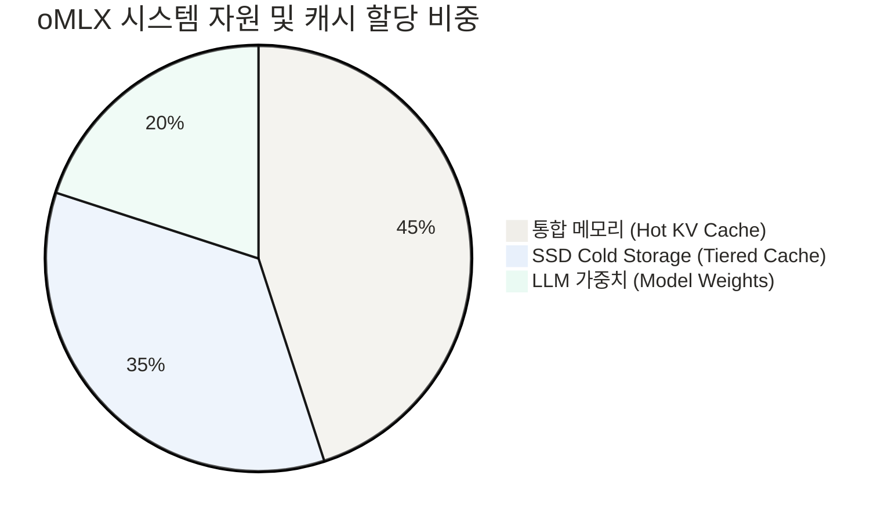
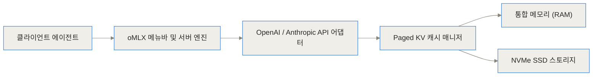
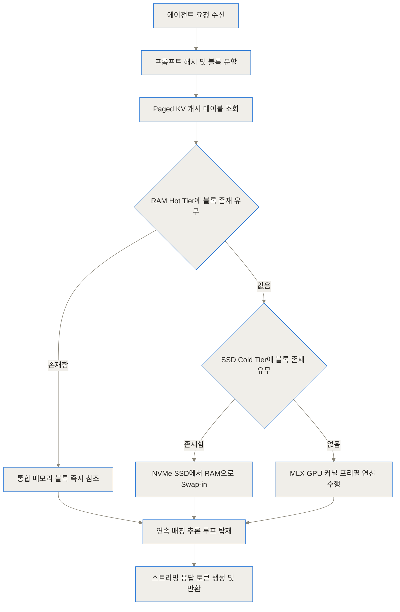
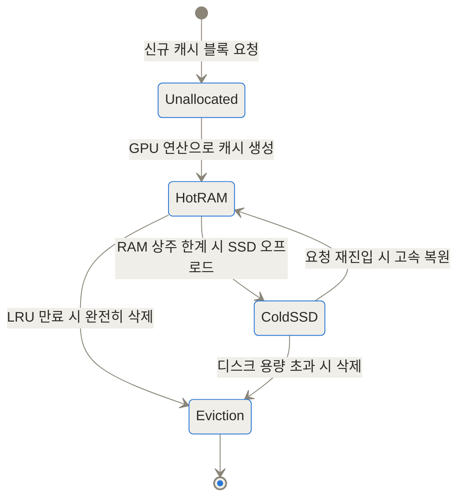

oMLX는 긴 공통 프롬프트를 반복하는 로컬 코딩 에이전트에서 첫 토큰 대기 시간을 줄이고 싶을 때 검토할 서버입니다. 효과는 캐시가 실제로 재사용되는 요청 패턴과 SSD, 통합 메모리 조건에 달려 있으며, 모든 모델과 대화에서 같은 1~3초가 보장되는 것은 아닙니다. 기존 엔진과 같은 모델, 프롬프트로 캐시 적중률, TTFT, 전체 생성 시간과 SSD 쓰기량을 함께 비교해야 합니다.

> **oMLX 캐시 구조를 이해하는 핵심 용어**
>
> - **KV 캐시**: 모델이 이미 읽은 토큰의 attention 계산에서 만든 Key, Value 값을 보관해, 다음 토큰을 생성할 때 같은 앞부분을 다시 계산하지 않게 하는 데이터입니다.
> - **프리픽스 복원**: 새 요청의 앞부분이 이전 요청과 같을 때 일치하는 캐시 블록을 찾아 재사용하는 과정입니다. 시스템 프롬프트와 코드 문맥이 반복되는 요청일수록 확인할 가치가 큽니다.
> - **Hot, Cold 계층**: 자주 쓰는 캐시는 Apple Silicon의 통합 메모리에 두고, 당장 필요하지 않은 블록은 SSD에 내렸다가 다시 불러오는 구분입니다. 메모리를 아끼는 대신 SSD 입출력과 쓰기량이 생깁니다.
> - **페이징 블록**: 커지는 KV 캐시를 하나의 연속 공간이 아니라 고정 크기 단위로 나눠 관리하는 방식입니다. 필요한 블록만 이동하거나 공유할 수 있어 전체 캐시 복사와 파편화를 줄이는 데 쓰입니다.
> - **연속 배칭**: 여러 요청을 완전히 순서대로 끝내지 않고 실행 가능한 토큰 단계를 묶어 처리하는 서빙 방식입니다. 단일 요청 속도와 동시 사용자 처리량을 분리해 측정해야 효과를 판단할 수 있습니다.
{: .prompt-info }

## 도입: AI 코딩 에이전트를 로컬 Mac에서 쓸 때 부딪히는 기술적 한계

최근 Claude Code, Cursor, OpenClaw, Codex 등 AI 코딩 에이전트가 개발자들의 필수 도구로 자리 잡았습니다. 하지만 클라우드 API를 지속적으로 호출할 경우 상당한 비용이 발생하며, 보안이 중요한 독자적인 코드베이스를 다룰 때는 외부 서버로 코드가 전송되는 것에 대한 부담이 커집니다. 이에 따라 애플 실리콘 Mac의 강력한 통합 메모리(Unified Memory)를 활용해 로컬 환경에서 대형 언어 모델(LLM)을 직접 실행하려는 시도가 빠르게 늘고 있습니다.

그러나 기존의 로컬 LLM 추론 엔진(Ollama, mlx-lm 등)을 AI 코딩 에이전트와 함께 사용할 때 치명적인 병목 현상이 발생합니다. 코딩 에이전트는 대화가 한 턴 진행될 때마다 전체 코드 파일, 시스템 프롬프트, 도구 호출 결과, 그리고 사용자의 추가 요청을 하나로 묶어 거대한 프롬프트를 다시 전송합니다. 이때 프롬프트 앞부분의 일부 코드만 수정되거나 맥락이 살짝 바뀌어도, 기존 MLX 엔진들은 이전에 연산해 둔 키-값 캐시(KV Cache)를 전부 무효화(Invalidation)하고 처음부터 다시 계산을 수행합니다.

그 결과, 대화가 몇 턴만 진행되어 컨텍스트가 길어지면 답변의 첫 번째 토큰이 나올 때까지 매번 30초에서 90초 이상 기다려야 하는 고통스러운 지연이 발생합니다. 로컬 AI 인프라의 가능성을 가로막던 이 고질적인 문제를 해결하기 위해 등장한 오픈소스 프로젝트가 바로 oMLX입니다.

> **TL;DR (3줄 요약)**
> - **oMLX란?**: 애플 실리콘 Mac에 최적화된 MLX 기반 고성능 LLM 추론 서버이자 네이티브 메뉴바 관리 도구입니다.
> - **해결한 문제**: 에이전트 대화 중 프롬프트 맥락이 변경되어도, 페이징 SSD 캐싱을 통해 이전 KV 캐시 블록을 복원하여 첫 토큰 응답 시간(TTFT)을 30~90초에서 1~3초대로 축소합니다.
> - **주요 특징**: OpenAI 및 Anthropic 호환 API 제공, 연속 배칭 지원, 기존 Hugging Face 및 LM Studio 모델 캐시의 재다운로드 없는 연동을 지원합니다.



---

## oMLX란 무엇인가: 애플 실리콘 전용 MLX 추론 서버의 개념

oMLX는 개발자 Jun Kim(`jundot`)이 개발하여 공개한 오픈소스 프로젝트로, 애플의 공식 머신러닝 프레임워크인 MLX를 기반으로 아키텍처가 설계되었습니다. 애플 실리콘은 CPU와 GPU가 동일한 고속 메모리 공간을 공유하는 통합 메모리 구조를 가지고 있어, 대용량 모델 가중치를 효율적으로 로드할 수 있는 최적의 하드웨어 환경을 제공합니다.

하지만 단순한 모델 로딩을 넘어, 복잡한 에이전트 워크로드를 다루기 위해서는 하드웨어 자원을 극대화하는 추론 서버 레이어가 필수적입니다. oMLX는 vLLM 프로젝트에서 영감을 받은 블록 단위 페이징 메모리 관리 방식을 애플 실리콘 아키텍처에 맞게 재구성했습니다. 메모리에 올려둔 KV 캐시를 고정된 페이지 블록으로 나누어 관리하며, 주 메모리가 부족해지면 사용하지 않는 캐시 블록을 SSD로 오프로드하고 필요할 때 즉시 복원합니다.

이 과정은 마치 **지능형 서재 관리 시스템**과 유사합니다. 자주 꺼내보는 대용량 참고 서적(Hot KV Cache)은 책상 위(통합 메모리)에 펼쳐두고, 당장 사용하지 않는 참고 서적은 바로 옆의 빠른 서랍(SSD)에 정돈해 넣어두는 것입니다. 그리고 다시 해당 내용이 필요해지면 책 전체를 처음부터 새로 인쇄하는 대신 서랍에서 필요한 페이지 블록만 꺼내어 책상으로 올려놓는 원리입니다.



---

## 기존 MLX 서버 및 Ollama와 무엇이 다른가: 핵심 문제와 한계

기존의 Ollama는 llama.cpp를 기반으로 동작하며 C++ Metal 커널을 사용합니다. 반면 oMLX는 애플의 MLX 프레임워크와 직접 통신하므로 애플 실리콘 하드웨어 성능을 더욱 깊이 있게 활용합니다. 또한 가장 중요한 차이점은 프롬프트 프리픽스(Prefix) 변경 시의 캐시 처리 메커니즘에 있습니다.

에이전트가 코드를 작성할 때 파일 중간에 주석 하나를 추가하거나 이전 출력을 참고하여 새 질의를 보낼 경우, 전체 문맥의 앞부분이 미세하게 이동합니다. 기존 서버들은 이 변경을 감지하는 순간 기존의 캐시가 무용지물이라고 판단하여 전체 컨텍스트를 새로 계산하는 프리필(Prefill) 과정을 수행합니다. 컨텍스트가 32k, 64k 토큰으로 늘어나면 이 프리필 단계에서만 수십 초 이상 걸리며, Mac의 CPU/GPU 점유율이 100%로 치솟게 됩니다.

oMLX는 변경되지 않은 이전 블록들을 정확히 식별하여 SSD에서 즉시 복원(Prefix Restoration)하므로, 재계산 분량을 최소화합니다.

```mermaid
%%{init: {"theme":"base","themeVariables":{"primaryColor":"#F0EEE9","primaryBorderColor":"#2a78d6","primaryTextColor":"#2b2926","secondaryColor":"#e8f0fb","secondaryBorderColor":"#4a3aa7","secondaryTextColor":"#2b2926","tertiaryColor":"#eafaf3","tertiaryBorderColor":"#1baf7a","tertiaryTextColor":"#2b2926","lineColor":"#8a8578","textColor":"#2b2926","edgeLabelBackground":"#F0EEE9","noteBkgColor":"#F0EEE9","noteTextColor":"#2b2926","noteBorderColor":"#8a8578","clusterBkg":"#faf9f6","clusterBorder":"#d8d4c8","fontFamily":"Pretendard, sans-serif"}}}%%
sequenceDiagram
    autonumber
    actor Agent as 코딩 에이전트 (Claude Code)
    participant Engine as 기존 MLX 서버
    participant oMLX as oMLX 추론 서버
    participant SSD as NVMe SSD

    Agent->>Engine: 수정된 프리픽스가 포함된 프롬프트 전달
    Engine->>Engine: KV 캐시 전체 무효화 발생
    Engine->>Engine: 64k 토큰 프리필 재계산 (30~90초 소요)
    Engine-->>Agent: 응답 반환 (극심한 지연)

    Agent->>oMLX: 동일한 수정 프롬프트 전달
    oMLX->>SSD: Paged 캐시 블록 복원 요청
    SSD-->>oMLX: 고속 캐시 블록 복원 (1초 내)
    oMLX-->>Agent: 1~3초 내 첫 토큰 응답 반환
```



| 비교 항목 | Ollama (Metal) | 기존 MLX (mlx-lm serve) | oMLX (jundot/omlx) |
| :--- | :--- | :--- | :--- |
| **기반 프레임워크** | C++ llama.cpp | Apple MLX | Apple MLX (vllm-mlx 확장) |
| **KV 캐시 아키텍처** | 단순 Ring/Linear 캐시 | 메모리 단일 캐시 | Paged SSD 계층형 캐시 |
| **프리픽스 변경 대응** | 전체 재계산 | 전체 무효화 | 선택적 블록 복원 (TTFT 1~3초) |
| **API 프로토콜** | Ollama 전용 API | 기본 OpenAI API | OpenAI + Anthropic 호환 API |
| **GUI 관리 도구** | CLI 중심 | CLI 전용 | 네이티브 macOS 메뉴바 (PyObjC) |
| **멀티 모델 동시 서빙** | 제한적 | 미지원 | LLM + Embedding + Reranker 동시 상주 |

---

## oMLX는 어떻게 동작하나: 페이징 SSD 캐싱과 아키텍처 내부 구조

oMLX의 고성능 추론 메커니즘은 3가지 핵심 축으로 구성됩니다: **페이징 KV 캐시(Paged KV Cache)**, **계층형 SSD 오프로딩(SSD Tiered Caching)**, 그리고 **연속 배칭(Continuous Batching)**입니다.

### 1. vLLM 스타일 Paged Block 관리 및 Copy-on-Write

LLM 추론 과정에서 생성되는 Key와 Value의 행렬 값은 동적으로 크기가 커지기 때문에 메모리 파편화를 유발합니다. oMLX는 연속적인 메모리 공간을 요구하는 대신, 가상 메모리 기법처럼 KV 캐시를 고정된 크기의 블록(Block) 단위로 파편화하여 관리합니다. 여러 분기나 대화 흐름이 공통의 이전 프롬프트를 공유하는 경우, 메모리 사본을 복사하지 않고 동일한 블록을 참조하게 만들며, 새로운 수정이 일어날 때만 해당 블록을 복사하는 Copy-on-Write 방식을 채택했습니다.

### 2. 계층형 KV 캐시 (Hot Memory & Cold SSD Storage)

애플 실리콘 Mac의 통합 메모리 용량은 한정되어 있습니다. oMLX는 메모리 용량 초과 시 오래된 캐시 블록을 삭제하지 않고 NVMe SSD 스토리지로 내보냅니다(Swap-out). 맥북에 탑재된 초고속 NVMe SSD는 초당 수 기가바이트의 읽기/쓰기 속도를 제공하므로, 다시 동일한 프롬프트 맥락이 들어왔을 때 GPU 연산으로 토큰을 재계산하는 것보다 SSD에서 캐시 블록을 읽어오는 것(Swap-in)이 훨씬 빠릅니다. 이 캐시 블록들은 서버가 재시작되어도 디바이스에 유지되는 영속성(Persistent Cache)을 갖습니다.

### 3. 연속 배칭과 동적 멀티 모델 서빙

`mlx-lm`을 한 단계 확장하여 여러 사용지 또는 에이전트 도구가 동시 다발적으로 보낸 요청을 한 번의 추론 루프에서 함께 처리하는 연속 배칭(Continuous Batching)을 지원합니다. 또한 메인 LLM 외에 메모리 검색을 위한 임베딩(Embedding) 모델과 리랭커(Reranker) 모델을 동시에 로드하여 필요에 따라 LRU(Least Recently Used) 방식으로 자원을 교체하며 서비스할 수 있습니다.





```mermaid
erDiagram
    MODEL_ENTITY ||--o{ SESSION_ENTITY :
```

위 ER 다이어그램은 파일 끝에서 관계 설명이 잘린 조각이므로 실제 oMLX 스키마를 완성해 보여 주는 자료는 아닙니다. 현재 저장소의 설정과 API 문서를 기준으로 모델, 세션 저장 구조를 다시 확인해야 합니다.

## 페이징 캐시가 효과적인 요청과 그렇지 않은 요청은?

시스템 프롬프트와 코드베이스 앞부분이 반복되고 뒤쪽 질문만 바뀌는 에이전트 요청은 공통 프리픽스 블록을 재사용하기 좋습니다. 반대로 매번 파일 순서가 달라지거나 프롬프트 앞부분에 시간값, 요청 ID가 들어가면 같은 내용도 해시가 달라져 캐시 적중률이 낮아질 수 있습니다. 캐시를 켠 뒤 TTFT만 보지 말고 적중, 미적중 요청을 나눠 전체 처리 시간과 생성 토큰 속도를 측정해야 합니다.

SSD 오프로딩은 재계산을 줄이는 대신 읽기, 쓰기와 저장 공간을 사용합니다. 세션이 많을 때 캐시가 얼마나 커지는지, 용량 상한과 퇴출 정책이 작동하는지, 민감한 프롬프트의 KV 데이터가 디스크와 백업에 남는지를 확인해야 합니다. 암호화와 삭제 요구가 있는 코드베이스라면 단순히 “로컬”이라는 이유만으로 보존을 허용해서는 안 됩니다.

## 기존 코딩 에이전트와 연결할 때 무엇을 검증할까?

OpenAI, Anthropic 호환 API는 연결 형식을 맞춘다는 뜻이지 두 서비스의 모든 옵션과 도구 호출 동작이 동일하다는 뜻은 아닙니다. 스트리밍 종료, 도구 인자, 오류 코드, 중단과 재시도가 클라이언트가 기대하는 방식으로 전달되는지 작은 작업으로 시험합니다. 실패 뒤 클라이언트가 같은 요청을 다시 보내면 캐시와 실제 도구 실행이 중복되지 않는지도 확인해야 합니다.

마지막으로 같은 모델과 양자화, 동일한 긴 프롬프트로 기존 서버와 oMLX를 번갈아 실행합니다. 첫 실행과 캐시 재사용 실행을 분리해 TTFT, 전체 완료 시간, 최대 통합 메모리, SSD 쓰기량과 결과 일치성을 기록하면 캐시 효과를 과장 없이 판단할 수 있습니다.

<!-- primary-sources:start -->
## 원문과 버전 확인

- [공식 GitHub 저장소](https://github.com/jundot/omlx)
<!-- primary-sources:end -->

<!-- internal-links:start -->
## 함께 읽으면 이해가 이어지는 글

- [oh-my-pi(omp) 코딩 에이전트 분석: Hashline, LSP, DAP와 권한 검증법]() — oh-my-pi(omp)가 content hash anchor, LSP, DAP, 하위 에이전트와 메모리를 코딩 작업에 연결하는 방식을 공식 저장소 기준으로 설명합니다. 설치, 권한, 벤치마크, 팀 파일럿의 검증 항목도 정리합니다.
- [pi-mono의 네 가지 기본 도구로 충분할까: 확장성, 권한, 유지비 판단법]() — pi-mono가 read, write, edit, bash와 TypeScript 확장으로 코딩 에이전트를 구성하는 방식과 최소 기능의 장점, 권한, 확장 유지비 한계를 정리합니다.
- [카파시의 Autoresearch는 무엇을 자동화하나: 반복 실험의 범위와 한계]() — Autoresearch가 단일 GPU의 고정 시간 안에서 코드를 수정하고 평가하는 방식과, 단기 지표, 재현성, 하드웨어 편향을 검증하는 기준을 설명합니다.
<!-- internal-links:end -->
