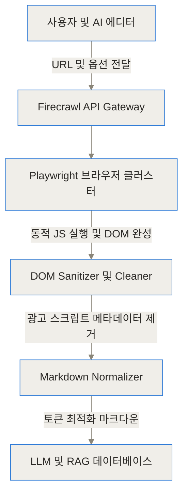
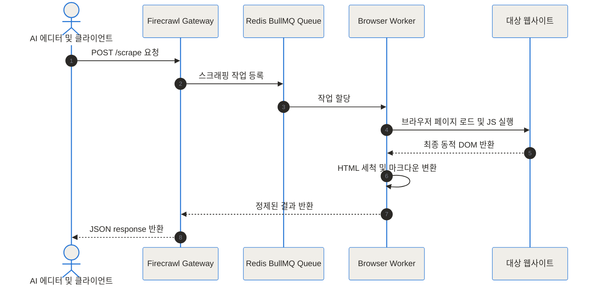
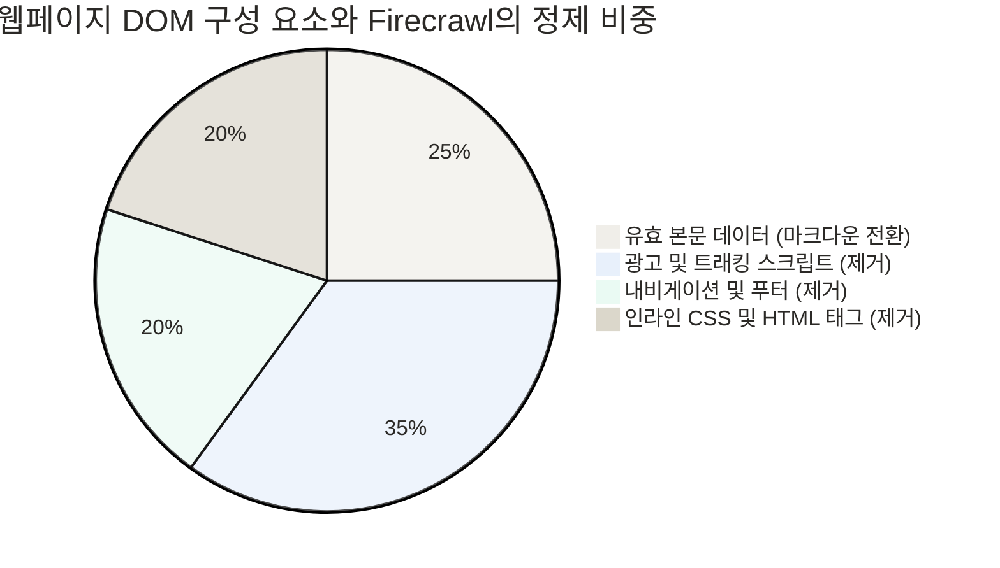
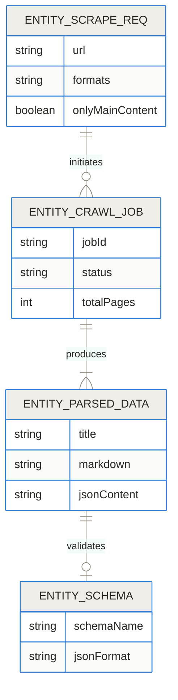
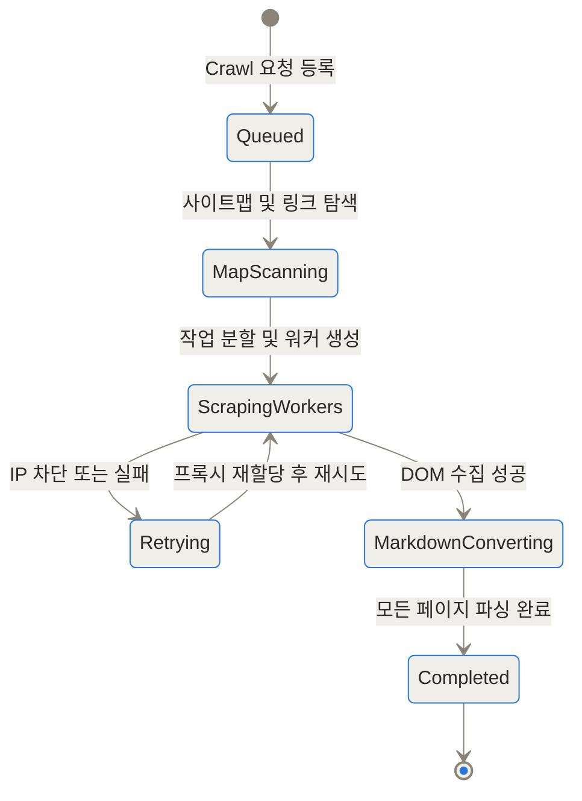
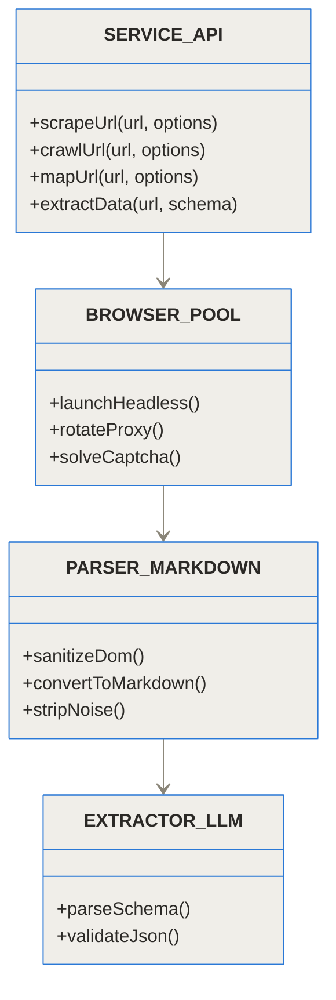

- [Firecrawl GitHub 저장소](https://github.com/firecrawl/firecrawl)
- [Firecrawl 공식 웹사이트](https://www.firecrawl.dev/)
- [Firecrawl 공식 문서](https://docs.firecrawl.dev/)

Firecrawl은 JavaScript 렌더링과 본문 정제를 직접 운영하기 어려운 RAG, 에이전트 데이터 수집에 적합합니다. URL이 마크다운으로 바뀐다는 사실만으로 내용의 최신성, 완전성, 수집 권한이 보장되지는 않습니다. 실제 도입 전 허용된 도메인과 갱신 주기, 로그인, 무한 스크롤, 표가 있는 표본에서 누락률과 재시도 비용을 확인해야 합니다.


> **먼저 알아둘 용어**
>
> - **LLM**: 엄청난 양의 글을 학습해 문장을 만들어 내는 대형 AI 모델입니다. ChatGPT 가 대표적입니다.
> - **오픈소스**: 소스 코드를 공개해 누구나 보고 고쳐 쓸 수 있게 한 것입니다. 조건은 라이선스마다 다릅니다.
> - **RAG**: AI가 답하기 전에 정해진 문서를 찾아 읽고, 그 내용을 근거로 답하게 하는 방식입니다.
> - **토큰**: AI가 글을 잘게 쪼개 세는 단위입니다. 한국어는 보통 한두 글자가 토큰 하나입니다.
> - **컨텍스트 윈도우**: AI가 한 번에 읽고 기억할 수 있는 글의 최대 길이입니다. 이 길이를 넘으면 앞부분을 잊습니다.
{: .prompt-info }

## 도입 및 3줄 요약

> **TL;DR (한 줄 요약)**
> 1. Firecrawl은 웹사이트 URL을 입력하면 동적 JavaScript를 렌더링하고, 불필요한 HTML 노이즈를 제거한 뒤, 대규모 언어 모델(LLM)이 즉시 이해할 수 있는 최적의 마크다운(Markdown)과 정형 JSON 데이터로 바꿔주는 오픈소스 엔진입니다.
> 2. IP 차단, 프록시 우회, CAPTCHA, 쿠키 팝업, 페이지 스크롤 등 기존 웹 스크래핑이 직면한 까다로운 관문들을 자체 브라우저 관리 계층에서 완벽히 처리해 줍니다.
> 3. 단순 스크래핑을 넘어 사이트 전체의 구조를 그리는 맵(Map), 재귀 탐색(Crawl), AI 기반 스키마 추출(Extract), 상호작용(Interact), MCP 연동까지 지원하여 RAG 및 AI 에디터 생태계의 대표적인 데이터 수집기 역할을 합니다.


---

## 기존 웹 스크래핑 방식이 AI 데이터 파이프라인에서 겪던 문제점

AI 모델에게 웹의 최신 정보를 학습시키거나 실시간 맥락(Context)을 제공할 때 개발자들이 가장 먼저 부딪히는 장벽은 바로 데이터의 질입니다. 전통적인 웹 스크래퍼나 HTTP 클라이언트는 단순히 서버가 전달하는 HTML 문서 전체를 가져옵니다. 그러나 이 방식은 AI 파이프라인에서 다음과 같은 고통을 유발합니다.

1. **엄청난 토큰 낭비와 비용 증대**: 날것의 HTML에는 본문 내용 외에도 CSS 스타일시트, JavaScript 코드, 광고 스크립트, 내비게이션 바, 푸터, 트래킹 태그 등이 가득합니다. 이를 그대로 LLM에 넘기면 컨텍스트 윈도우의 70% 이상이 쓰레기 데이터로 채워져 API 비용이 급증합니다.
2. **환각(Hallucination) 현상 증가**: HTML의 시각적 구조나 무의미한 스크립트 텍스트를 LLM이 본문 정보로 오인하면서 잘못된 정보나 엉뚱한 답변을 생성할 위험이 커집니다.
3. **동적 웹사이트 수집의 불능**: 최근 웹사이트는 React, Vue, Next.js 등으로 구축된 싱글 페이지 애플리케이션(SPA)이 대부분입니다. 단순 HTTP GET 요청만 보내면 실제 데이터가 없는 껍데기 HTML만 돌아옵니다.
4. **지속적인 차단과 엔지니어링 낭비**: 클라우드플레어(Cloudflare) 같은 안티 봇 시스템, IP 래이트 리밋, 캡차 등에 막혀 스크래퍼가 끊임없이 작동을 멈추며, 프록시를 관리하고 Headless 브라우저를 직접 운용하는 데 막대한 개발 자원이 소비됩니다.

--- 

## Firecrawl이란 무엇인가

Firecrawl은 웹에 존재하는 임의의 페이지를 **LLM-ready 데이터(마크다운 및 정형 JSON)**로 정제하여 제공하는 오픈소스 웹 컨텍스트 엔진입니다.

이 도구를 비유하자면, **날것의 재료(HTML 태그와 스크립트)가 가득한 다듬어지지 않은 밭에서, 셰프(LLM)가 바로 요리할 수 있도록 흙을 털어내고 신선한 알맹이만 깔끔하게 세척하여 손질해 주는 자동 주방 보조원**과 같아요.

개발자는 더 이상 CSS 셀렉터가 깨질까 봐 불안해하거나 프록시 풀을 직접 매니징할 필요가 없습니다. 단 한 줄의 API 호출만으로 최적화된 마크다운 결과물을 얻을 수 있습니다.



--- 

## Firecrawl 내부 동작 원리와 아키텍처 (Under the Hood)

Firecrawl이 어떻게 복잡한 웹사이트에서 깔끔한 마크다운과 구조화된 데이터를 추출해 내는지 내부 원리를 단계별로 살펴보겠습니다.

### 1. 동적 JavaScript 렌더링 및 브라우저 세션 제어

Firecrawl은 요청이 들어오면 내부적으로 격리된 Headless 브라우저(Playwright 기반) 환경을 띄웁니다. 수집 대상 사이트의 자바스크립트를 완벽히 실행하고 비동기 네트워크 요청(XHR/Fetch)이 완료되어 최종 DOM 트리 구축이 끝날 때까지 대기합니다.



### 2. DOM 세척과 메인 컨텍스트 추출 알고리즘

페이지가 로드된 후, Firecrawl은 HTML 문서 내부에서 본문과 상관없는 레이어들을 지워냅니다. `<script>`, `<style>`, `<iframe>`, `<nav>`, `<footer>`, 광고 블록 및 팝업 레이어를 레이아웃 및 의미론적(Semantic) 분석을 통해 차단합니다. 그 후 본문(Main Article) 영역을 추적하여 시각적 위계 구조를 표준 마크다운 헤더(`#`, `##`, `###`)와 목록, 표로 재구성합니다.



### 3. LLM 기반 데이터 구조화 (Extract API)

Firecrawl의 파워풀한 기능 중 하나는 Pydantic 스키마나 JSON 스키마를 지정하면, 스크래핑과 동시에 원본 웹페이지에서 원하는 데이터 구조를 직접 추출해 준다는 점입니다. LLM 파서가 텍스트를 읽고 해당 스키마 형태의 정형 JSON으로 맞춰 출력합니다.



### 4. 재귀적 사이트 매핑 및 크롤링 처리 엔진 (/map & /crawl)

Firecrawl은 단일 URL 스크래핑(`/scrape`)에 그치지 않고, 사이트 전체의 URL 지도를 즉각적으로 그려주는 `/map` 기능과, 하위 페이지를 깊이에 따라 자동 추적하는 `/crawl` 기능을 제공합니다.

- **Map 엔드포인트**: 사이트맵(sitemap.xml)과 내부 링크 그래프를 조합하여 불과 수 초 만에 사이트 내 수천 개의 모든 유효 URL 리스트를 뽑아냅니다.
- **Crawl 엔드포인트**: 지정된 URL부터 시작하여 자식 링크를 순회하며 전체 페이지를 병렬 수집하고, 결과를 비동기적으로 전달합니다.



### 5. 대화형 액션 수행 (/interact)

버튼 클릭, 검색어 입력, 스크롤, 로그인 폼 채우기 등 사람의 행동이 필요한 페이지의 경우 `/interact` 엔드포인트를 통해 브라우저 세션을 유지한 채 액션을 지시할 수 있습니다.



--- 

## 실제 코드 사용 디테일 및 셀프 호스팅 구축 방법

Firecrawl은 공식 파이썬 및 노드JS SDK와 REST API, 그리고 MCP(Model Context Protocol)까지 완벽히 지원합니다.

### 1. Node.js / TypeScript SDK 활용

```typescript
import FirecrawlApp from '@mendable/firecrawl-js';

const app = new FirecrawlApp({ apiKey: process.env.FIRECRAWL_API_KEY });

// 1. 단일 URL 마크다운 스크래핑
const scrapeResponse = await app.scrapeUrl('https://docs.stripe.com/api', {
  formats: ['markdown'],
  onlyMainContent: true,
});

console.log(scrapeResponse.markdown);

// 2. 스키마 지정을 통한 정형 데이터 추출
const extractResult = await app.scrapeUrl('https://news.ycombinator.com', {
  formats: ['json'],
  jsonOptions: {
    schema: {
      type: 'object',
      properties: {
        top_stories: {
          type: 'array',
          items: {
            type: 'object',
            properties: {
              title: { type: 'string' },
              points: { type: 'number' },
            },
          },
        },
      },
    },
  },
});
```

### 2. Python SDK 활용

```python rest
from firecrawl import FirecrawlApp
from pydantic import BaseModel
import os

app = FirecrawlApp(api_key=os.getenv(
```

위 Python 조각은 파일 끝이 잘린 예시이므로 그대로 실행 가능한 완성 코드로 보아서는 안 됩니다. SDK 버전별 생성자와 메서드 이름은 연결된 공식 문서에서 확인하고, API 키는 코드에 직접 쓰지 말고 실행 환경의 비밀 저장 방식으로 전달해야 합니다.

## 단일 스크랩과 사이트 크롤링 중 무엇을 선택해야 할까?

한 페이지의 본문만 필요하면 `/scrape`부터 시작하는 편이 범위와 비용을 통제하기 쉽습니다. 문서 사이트 전체를 수집하려면 먼저 `/map` 결과에서 필요한 경로와 제외할 로그인, 검색, 태그 페이지를 정한 뒤 `/crawl`로 넓힙니다. 경계를 정하지 않은 재귀 크롤링은 달력, 필터 URL처럼 내용이 비슷한 페이지를 반복 방문해 작업량과 중복 문서를 늘릴 수 있습니다.

동적 페이지는 브라우저가 “로드 완료”를 판단한 시점과 사용자가 실제 내용을 본 시점이 다를 수 있습니다. 지연 로딩 표나 버튼 뒤의 내용이 필요한 경우 기다릴 조건과 상호작용 단계를 명시하고, 성공 응답뿐 아니라 빈 본문, 로그인 화면, 오류 페이지를 구별해야 합니다. 재시도 횟수와 동시성도 대상 서버의 허용 범위와 서비스 안정성을 해치지 않도록 제한합니다.

## RAG에 넣기 전에 어떤 품질 검사를 해야 할까?

마크다운이 깔끔해도 제목, 본문, 표, 코드 블록이 원문과 일치하는지 표본을 대조해야 합니다. 내비게이션 제거가 과도하면 문서 계층과 중요한 경고가 사라질 수 있고, 반대로 쿠키 문구가 남으면 검색 결과를 오염시킬 수 있습니다. URL, 수집 시각, 문서 해시를 함께 저장하면 변경된 페이지만 다시 임베딩하고 답변의 근거 시점을 설명하기 쉽습니다.

Extract API의 JSON은 스키마에 맞더라도 값이 원문에 없거나 단위를 잘못 해석할 수 있습니다. 필수 필드, 허용 범위와 원문 인용 위치를 별도로 검증하고, 실패한 추출을 빈 값으로 조용히 저장하지 않아야 합니다. 법적, 정책적 판단이 필요한 데이터는 사이트 이용 조건과 robots 지침, 개인정보와 접근 권한을 확인한 뒤 수집 범위를 정해야 합니다.

## 클라우드 API와 셀프 호스팅은 어떻게 고를까?

관리형 API는 브라우저, 큐, 프록시 운영을 줄이는 대신 제공 조건과 사용량 비용에 의존합니다. 셀프 호스팅은 데이터 경로와 배포를 통제할 수 있지만 브라우저 워커, 큐, 저장소, 장애 복구와 보안 업데이트를 직접 맡아야 합니다. 월 호출 수만 비교하지 말고 실패 재처리, 대상 사이트 변화에 따른 유지보수와 운영 인력까지 포함해 결정해야 합니다.

<!-- primary-sources:start -->
## 원문과 버전 확인

- [공식 GitHub 저장소](https://github.com/firecrawl/firecrawl)
<!-- primary-sources:end -->

<!-- internal-links:start -->
## 함께 읽으면 이해가 이어지는 글

- [WeKnora가 표, 수식 PDF RAG에 맞을까: 파싱, Hybrid Retrieval 검증]() — WeKnora의 layout, 표, 수식 parsing과 BM25, dense, graph 검색, agent, MCP 구조를 살펴보고 한국어 문서 정확도, 인용, 자원, 운영 조건을 검증합니다.
- [GitNexus는 코드를 밖으로 보내지 않나: 브라우저 Graph RAG와 MCP 경계]() — GitNexus가 브라우저에서 AST, 지식 그래프를 만드는 방식과 MCP로 외부 모델을 연결할 때 달라지는 데이터 경계, 규모, 정확도 검증법을 정리합니다.
- [RAG가 엉뚱한 문서를 찾는다면? RAFT의 Distractor 학습법]() — 정답 문서와 방해 문서를 함께 넣고 근거를 인용하게 만드는 RAFT의 데이터 구성, 성능표, 적용 조건
<!-- internal-links:end -->
