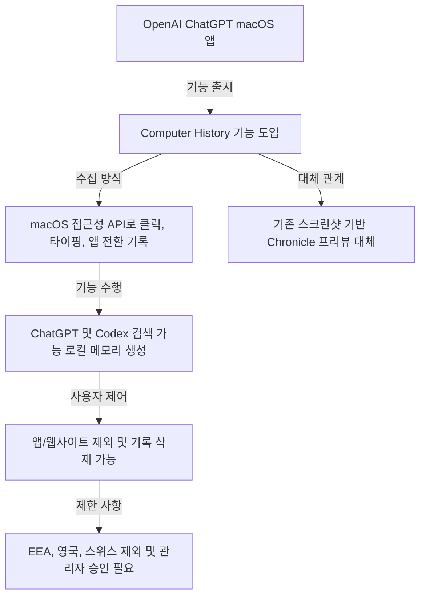
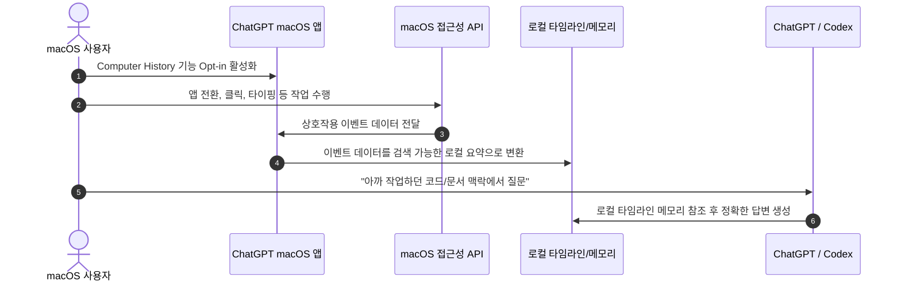
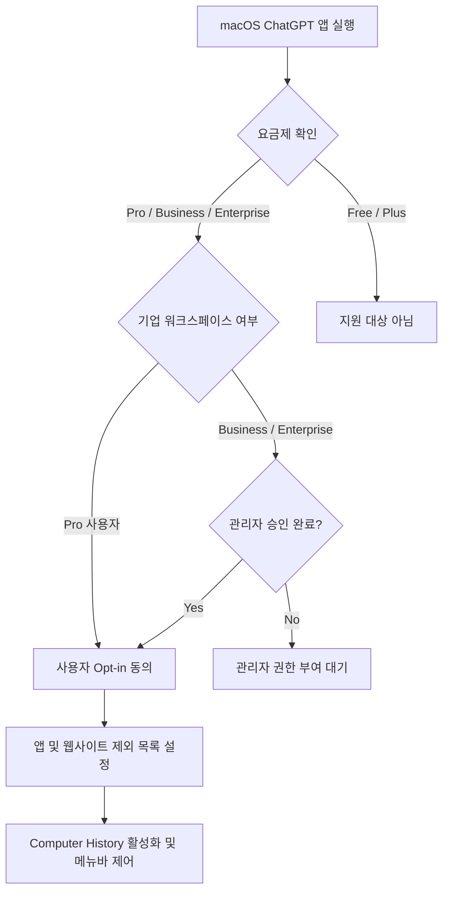

내 맥북에서 작업한 과정과 흐름을 AI가 스스로 기억하고 이해한다면 얼마나 편리할까요? OpenAI가 macOS용 ChatGPT 데스크톱 앱에 사용자의 컴퓨터 작업 활동을 기록하고 기억하는 'Computer History' 기능을 새로 선보였습니다.

이번에 공개된 Computer History 기능은 내가 맥에서 어떤 앱을 오갔는지, 어떤 버튼을 누르고 키보드를 쳤는지 작업 타임라인을 파악해 ChatGPT와 Codex가 답변을 줄 때 맥락을 반영할 수 있게 도와줍니다. 기존의 스크린샷 촬영 방식에서 벗어나 훨씬 깔끔하고 안전한 방식으로 진화한 이번 업데이트의 주요 내용과 활용법을 자세히 정리해 드립니다.

## 무슨 일이 벌어진 걸까?

OpenAI가 2026년 8월 13일과 14일에 걸쳐 macOS용 ChatGPT 데스크톱 앱에 'Computer History' 옵트인(Opt-in) 신기능을 출시했습니다 <a href="#source-1" aria-label="OpenAI Help Center 출처">[1]</a>. 이 기능은 사용자가 직접 활성화 여부를 선택하는 방식으로 작동하며, Pro, Business, Enterprise 요금제 이용자를 대상으로 제공됩니다 <a href="#source-2" aria-label="9to5Mac 출처">[2]</a>.

Computer History는 모니터 화면을 계속 캡처하는 이미지 방식이 아닙니다. macOS의 접근성(Accessibility) API를 활용해 사용자의 클릭, 키보드 입력, 단축키 사용, 애플리케이션 전환 등의 상호작용 이벤트를 기록합니다 <a href="#source-3" aria-label="CNET 출처">[3]</a>. 수집된 기록은 로컬에서 검색 가능한 타임라인 요약과 메모리로 변환되어 ChatGPT 및 코딩 보조 도구인 Codex가 언제든 참조할 수 있습니다 <a href="#source-2" aria-label="9to5Mac 출처">[2]</a>.

이 신규 기능은 OpenAI가 이전에 연구 목적으로 한시 선보였던 스크린샷 기반의 선행 프리뷰 기능 'Chronicle'을 정식 대체합니다 <a href="#source-1" aria-label="OpenAI Help Center 출처">[1]</a>. 과도한 화면 수집 오남용 방지와 개인정보 보호 요구를 반영해 완전히 새로운 방식으로 재설계된 셈입니다.

위 시퀀스 다이어그램에서 볼 수 있듯이, 사용자의 작업 데이터는 중앙 서버에 캡처 이미지를 계속 송출하는 방식이 아니라 접근성 이벤트 형태를 거쳐 local 검색 메모리로 저장된 뒤 AI 질문에 활용됩니다.

<figure class="news-source-image">
  
  <figcaption>OpenAI Help Center가 원문과 함께 공개한 이미지입니다. <a href="https://help.openai.com/en/articles/6825453-chatgpt-release-notes" target="_blank" rel="noopener noreferrer">출처: OpenAI Help Center</a></figcaption>
</figure>

## 왜 지금 다들 이 이야기를 할까?

OpenAI의 Computer History 도입은 단순한 채팅 창 중심 AI에서 OS 수준의 작업 맥락을 상시 파악하는 개인화 조수로 진화하는 중요한 전환점이기 때문에 주목받고 있습니다. 지금까지 AI에게 작업을 맡기려면 "내가 어떤 앱에서 무슨 작업을 하고 있었는지" 일일이 텍스트로 설명하거나 화면을 일일이 캡처해서 첨부해야 했습니다.

기존 Chronicle 방식은 주기적으로 모니터 스크린샷을 찍었기 때문에 용량 문제와 더불어 민감한 화면 정보 노출 위험이 항상 존재했습니다 <a href="#source-3" aria-label="CNET 출처">[3]</a>. 하지만 이번 Computer History는 텍스트와 이벤트 기반의 접근성 API를 활용함으로써 저장 효율성을 높이고 보안 부담을 대폭 줄였습니다 <a href="#source-2" aria-label="9to5Mac 출처">[2]</a>.

제가 보기엔 AI가 내 일상적인 작업 동선을 스스로 기억하게 됨으로써, 추후 업무 보고서 작성이나 작업 이력 추적 같은 반복 작업이 크게 줄어들 수 있을 것으로 보입니다. 사용자의 맥락을 끊김 없이 연결해 주는 디지털 작업 디렉터의 기초가 마련된 셈이죠.

<figure class="news-source-image">
  
  <figcaption>OpenAI Help Center가 원문과 함께 공개한 이미지입니다. <a href="https://help.openai.com/en/articles/6825453-chatgpt-release-notes" target="_blank" rel="noopener noreferrer">출처: OpenAI Help Center</a></figcaption>
</figure>

## 그래서 우리에게 뭐가 달라질까?

macOS 사용자들은 ChatGPT 및 Codex와 대화할 때 이전 작업을 매번 새로 설명해야 하는 번거로움을 크게 덜 수 있습니다 <a href="#source-3" aria-label="CNET 출처">[3]</a>. 예컨대 여러 브라우저 탭과 문서 작성 프로그램, IDE 환경을 오가며 작업했을 때 "방금 내가 정리하던 작업의 핵심 결론을 정리해줘"라고 요청하면 작업 타임라인을 바탕으로 즉시 맥락을 찾아냅니다.

기존 선행 프리뷰였던 Chronicle과 이번 Computer History의 차이점을 한눈에 정리하면 다음과 같습니다.

| 구분 | Chronicle (기존 프리뷰) | Computer History (신규 기능) |
| --- | --- | --- |
| 수집 방식 | 주기적 화면 스크린샷 캡처 | macOS 접근성 API 이벤트 기록 |
| 수집 데이터 | 이미지 및 화면 전체 비주얼 | 클릭, 타이핑, 단축키, 앱 전환 로그 |
| 메모리 형태 | 이미지 기반 선행 탐색 | 로컬 검색 가능 타임라인 및 메모리 |
| 지원 대상 | 초기 연구 프리뷰 대상자 | Pro, Business, Enterprise macOS 사용자 |
| 제어 기능 | 기본 일시정지 | 앱/웹 제외, 메뉴바 정지, 이력 삭제 및 관리자 승인 |

개발 환경에서는 Codex가 사용자의 입력 패턴과 앱 전환 내역을 참조하여 코딩 문제 해결 시 맥락에 알맞은 코드 보완책을 제시할 수도 있습니다 <a href="#source-2" aria-label="9to5Mac 출처">[2]</a>. 업무의 연속성이 훨씬 더 매끄러워지는 효과를 기대할 수 있습니다.

<figure class="news-source-image">
  
  <figcaption>9to5Mac가 원문과 함께 공개한 이미지입니다. <a href="https://9to5mac.com/2026/08/13/chatgpt-for-mac-adds-opt-in-computer-history-feature-replacing-chronicle" target="_blank" rel="noopener noreferrer">출처: 9to5Mac</a></figcaption>
</figure>

## 직접 써보거나 지켜볼 포인트

OpenAI는 이번 기능에 사용자가 자신의 작업 데이터를 완벽하게 제어할 수 있는 세부 관리 도구들을 함께 제공합니다 <a href="#source-3" aria-label="CNET 출처">[3]</a>. 사용자가 일상 업무에서 체크해야 할 세 가지 핵심 제어 요소는 다음과 같습니다.

1. 앱 및 웹사이트 예외 설정: 특정 뱅킹 앱이나 민감한 메시징 프로그램, 특정 웹사이트를 기록 대상에서 손쉽게 포함하거나 제외할 수 있습니다 <a href="#source-2" aria-label="9to5Mac 출처">[2]</a>.
2. 상단 메뉴바 일시 정지: macOS 메뉴바에 위치한 컨트롤러를 통해 추적을 원치 않을 때 즉시 일시 정지할 수 있습니다 <a href="#source-3" aria-label="CNET 출처">[3]</a>.
3. 이력 검토 및 삭제: 이미 수집되어 저장된 작업 히스토리를 직접 검토하고 언제든 선택적으로 삭제할 수 있는 권한을 제공합니다 <a href="#source-2" aria-label="9to5Mac 출처">[2]</a>.

기업용 요금제인 Business 및 Enterprise 워크스페이스의 경우 개별 팀원이 마음대로 켜서 쓸 수 없으며, 조직 관리자가 먼저 권한을 명시적으로 부여해야 팀원이 옵트인할 수 있도록 설계되었습니다 <a href="#source-2" aria-label="9to5Mac 출처">[2]</a>.

## 아직은 선을 그어야 할 부분

Computer History 기능이 매력적이지만 몇 가지 명확한 한계점과 지역적 제한이 존재하므로 도입 전 확인이 필요합니다 <a href="#source-1" aria-label="OpenAI Help Center 출처">[1]</a>.

첫째, 서비스 제공 지역의 제한입니다. 규제 및 프라이버시 검토 영향으로 유럽경제지역(EEA), 스위스, 영국 지역 사용자는 초기 출시 대상에서 제외되었습니다 <a href="#source-1" aria-label="OpenAI Help Center 출처">[1]</a>. 해당 지역 거주자나 관련 계정은 당장 이 기능을 활성화할 수 없습니다.

둘째, 이용 대상 요금제 조건입니다. 일반 무료(Free) 사용자는 물론 기본 Plus 개인 사용자 플랜 역시 이번 지원 범위에서 제외되며, Pro, Business, Enterprise 요금제 사용자에 한해서만 제공됩니다 <a href="#source-1" aria-label="OpenAI Help Center 출처">[1]</a>.

셋째, 접근성 API 기반 방식의 기술적 특성입니다. 화면 시각 정보 전체를 캡처하는 것이 아니기 때문에, 이미지나 그래픽 위주의 시각적 디자인 작업 내용까지 정확히 파악하는 데는 구조적 한계가 존재할 수 있습니다. 따라서 본인이 사용하는 작업 환경과 보안 정책을 꼼꼼히 점검한 후 활성화 여부를 결정하는 것이 좋습니다.

## 자주 묻는 질문

### ChatGPT Computer History 기능은 누구나 사용할 수 있나요?

아닙니다. macOS용 ChatGPT 데스크톱 앱의 Pro, Business, Enterprise 요금제 이용자만 사용할 수 있으며, 유럽경제지역(EEA), 스위스, 영국 지역은 초기 출시 대상에서 제외됩니다.

### 이 기능은 화면을 계속 스크린샷으로 캡처하나요?

아닙니다. 기존의 스크린샷 기반 Chronicle 프리뷰를 대체해 macOS 접근성 API를 사용하여 클릭, 타이핑, 앱 전환 등의 이벤트 정보만 기록합니다.

### 회사에서 쓰는데 민감한 정보가 수집될까 걱정됩니다. 제어가 가능한가요?

네, 기업 워크스페이스는 관리자 승인이 필수적이며, 개인 사용자는 특정 앱이나 웹사이트 제외 설정, 메뉴바 일시 정지, 이력 삭제를 자유롭게 진행할 수 있습니다.

## 직접 확인한 원문

<ol class="checked-source-list">
  <li id="source-1"><a href="https://help.openai.com/en/articles/6825453-chatgpt-release-notes" target="_blank" rel="noopener noreferrer">OpenAI Help Center — ChatGPT — Release Notes</a> (2026-08-14)</li>
  <li id="source-2"><a href="https://9to5mac.com/2026/08/13/chatgpt-for-mac-adds-opt-in-computer-history-feature-replacing-chronicle" target="_blank" rel="noopener noreferrer">9to5Mac — ChatGPT for Mac adds opt-in Computer History feature, replacing Chronicle</a> (2026-08-13)</li>
  <li id="source-3"><a href="https://www.cnet.com/tech/services-and-software/chatgpt-mac-activity-computer-history" target="_blank" rel="noopener noreferrer">CNET — ChatGPT Can Now Add Your Mac Activity to Its Memories</a> (2026-08-14)</li>
</ol>

> 이 글은 위 원문을 직접 확인해 작성했습니다. 가격, 기능 범위, 지역별 제공 여부는 게시 후 바뀔 수 있으니 실제 도입 전 공식 문서를 다시 확인하세요.
