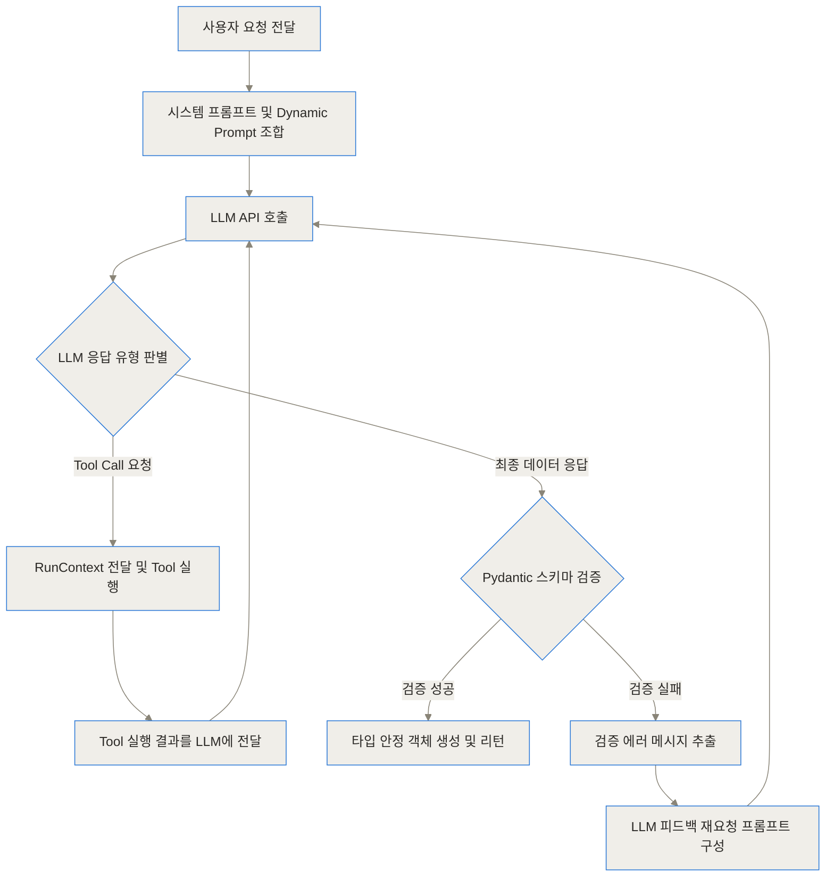
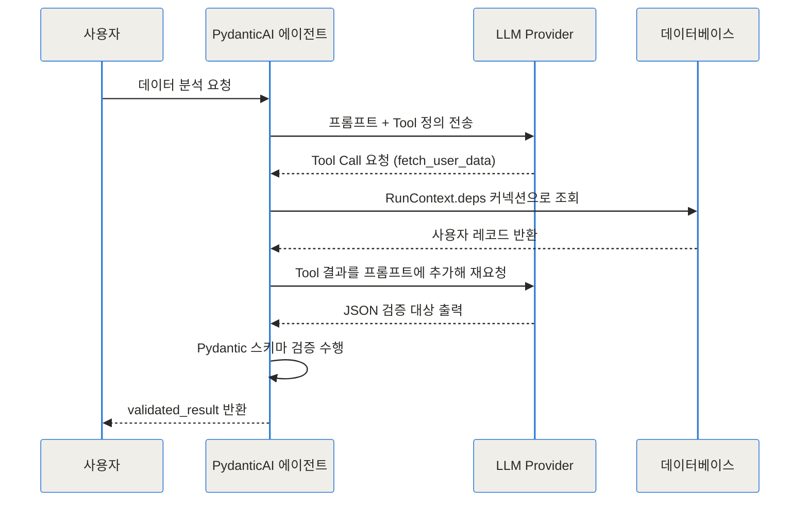
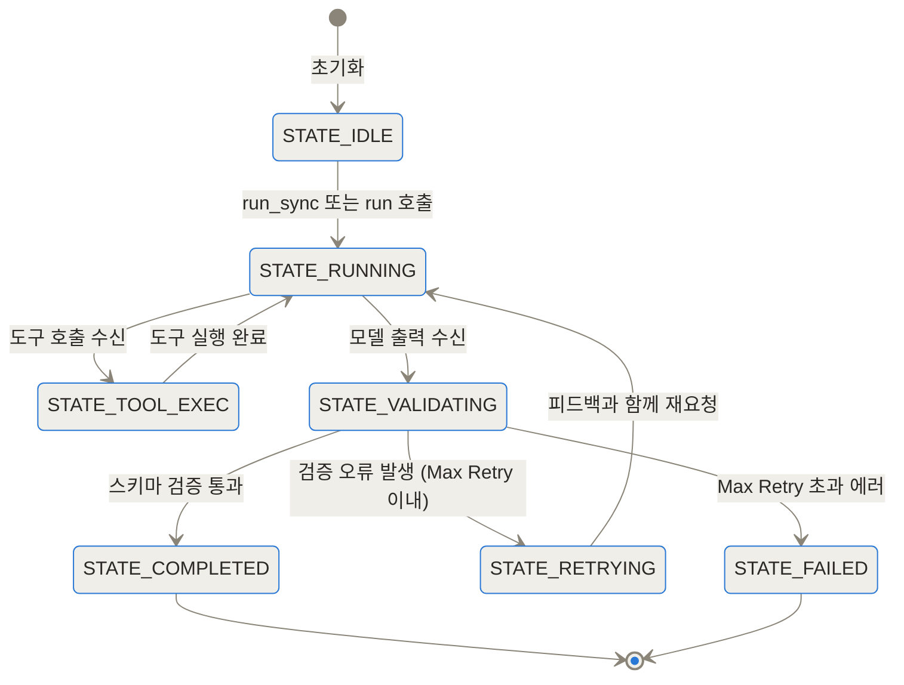
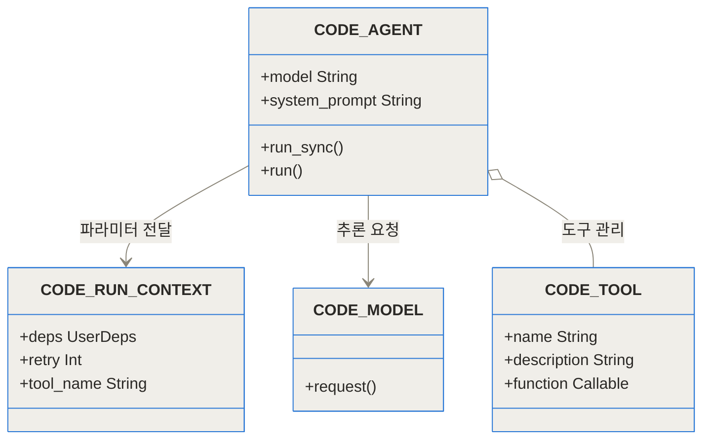
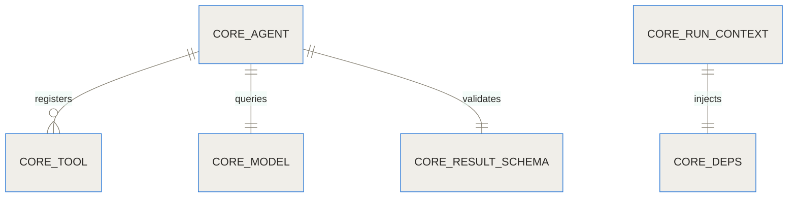
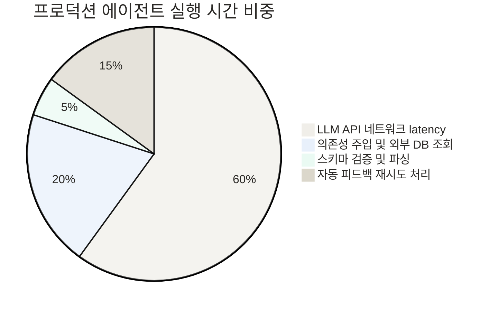

[Pydantic AI GitHub 저장소](https://github.com/pydantic/pydantic-ai)
[Pydantic AI 공식 문서](https://ai.pydantic.dev/)

Pydantic AI는 Python 서비스에서 LLM 응답을 명시한 스키마로 검증하고 도구 의존성을 테스트 가능하게 주입하려는 팀에 적합합니다. 타입 검증은 필드 누락과 형식 오류를 줄이지만, 형식에 맞는 잘못된 사실이나 위험한 도구 인자까지 올바르게 만들지는 않습니다. 실제 도입에서는 스키마 통과율뿐 아니라 재시도 비용, 의미 검증과 권한 승인, 실패 시 대체 경로를 함께 시험해야 합니다.

AI 에이전트 개발을 시작해 본 개발자라면 누구나 한번쯤 고통스러운 순간을 경험하게 돼요. 분명 프롬프트에 "반드시 유효한 JSON 형식으로 답해달라"고 몇 번이나 강조했음에도 불구하고, LLM은 백틱 기호를 잘못 붙이거나 필드 이름을 슬그머니 바꿔버리며 애플리케이션에 런타임 예외를 일으키곤 하죠. 게다가 기존 프레임워크들의 복잡한 추상화 클래스를 파헤치다 보면 심플한 Python 코드를 작성하고 싶었던 초심은 온데간데없이 사라지게 돼요.

**TL;DR (3줄 요약)**
- Pydantic AI는 Python 생태계의 표준 검증 라이브러리인 Pydantic 제작팀이 만든 타입 안전(Type-safe) AI 에이전트 프레임워크예요.
- 모델 불가지론적(Model-agnostic) 구조로 한 줄의 문자열 변경만으로 OpenAI, Anthropic, Gemini, Ollama 등 다양한 LLM을 즉시 교체할 수 있어요.
- 의존성 주입(Dependency Injection)과 자동 검증 재시도(Self-correction retry) 루프를 내장하여 프로덕션 환경에 즉시 적용 가능한 안정적인 에이전트를 작성할 수 있어요.

> **Pydantic AI 코드를 읽기 위한 키워드**
>
> - **구조화 출력**: 자유 형식 문장 대신 미리 정한 필드와 자료형을 가진 객체로 모델 응답을 받는 방식입니다. 형식이 맞는다는 검증과 답의 사실 여부 검증은 별개입니다.
> - **스키마 검증 재시도**: 응답이 요구한 구조를 만족하지 않을 때 검증 오류를 바탕으로 다시 생성을 요청하는 흐름입니다. 성공률을 높일 수 있지만 호출 횟수와 비용 상한이 필요합니다.
> - **RunContext**: 현재 실행에 필요한 의존성과 사용량 같은 문맥을 도구 함수에 전달하는 Pydantic AI의 컨테이너입니다. 도구가 전역 변수에 직접 기대지 않게 해 테스트 경계를 분명히 합니다.
> - **의존성 주입**: 데이터베이스 연결이나 API 클라이언트를 함수 내부에서 새로 만들지 않고 실행 시점에 외부에서 제공하는 설계입니다. 테스트에서는 실제 서비스 대신 통제된 대체 객체를 넣을 수 있습니다.
> - **모델 오버라이드**: 에이전트 정의를 바꾸지 않은 채 실행에 사용할 모델을 임시 교체하는 기능입니다. `TestModel`과 함께 쓰면 외부 모델 호출 없이 도구 연결과 비즈니스 로직을 검사할 수 있습니다.
{: .prompt-info }

## 기존 AI 프레임워크가 안겨준 개발자의 고통과 배경

생성형 AI가 급부상하면서 시장에는 수많은 AI 에이전트 프레임워크가 쏟아져 나왔어요. 하지만 현업에서 이를 실제 서비스로 배포하려 할 때 수많은 개발자들이 장벽에 부딪혔죠. 기존 프레임워크들은 유용했지만, 동시에 몇 가지 결정적인 문제점을 안고 있었어요.

첫째는 과도한 추상화와 타입 안정성의 부재예요. 도구(Tool)를 정의하거나 체인(Chain)을 연결할 때 dict 구조나 모호한 객체를 주고받다 보니, IDE의 자동 완성 기능이 작동하지 않고 오탈자 하나 때문에 런타임 시점에야 에러를 발견하는 일이 비일비재했어요.

둘째는 LLM 응답 검증의 불확실성이에요. LLM이 생성한 비정형 텍스트를 구조화된 데이터로 변환할 때, 스키마 검증이 실패하면 그냥 에러를 터뜨리고 프로세스가 종료되는 경우가 많았어요. 개발자가 직접 try-except 문을 둘러싸고 프롬프트에 에러 내용을 담아 재요청하는 복잡한 예외 처리 코드를 일일이 짜야 했죠.

셋째는 런타임 환경과의 결합 문제였어요. 에이전트가 외부 데이터베이스에 접근하거나 사용자 세션, HTTP 클라이언트 등을 사용해야 할 때, 이러한 의존성(Dependencies)을 도구 함수 내부로 깨끗하게 전달할 방법이 마땅치 않았어요. 결국 전역 변수나 클로저를 남발하면서 코드의 가독성과 테스트 가능성이 심각하게 훼손되었답니다.

Pydantic 개발팀은 자신들의 관측성 서비스인 Pydantic Logfire를 구축하면서 기존 프레임워크들의 이러한 한계를 절실히 깨달았어요. FastAPI가 Pydantic의 타입 검증을 기반으로 웹 개발의 패러다임을 바꿨듯이, AI 에이전트 개발에도 그와 같은 깔끔함과 안정성을 부여하고자 만든 솔루션이 바로 Pydantic AI예요.

## Pydantic AI의 핵심 개념 일상 비유로 이해하기

Pydantic AI의 동작 방식은 마치 **'엄격하지만 친절한 건축 현장 감독관과 정밀 정비팀'**의 관계와 매우 유사해요.

여기서 LLM은 유능하지만 가끔 실수를 하는 건축 설계사예요. 설계사는 멋진 아이디어를 바탕으로 도면(응답)을 빠르게 그려냅니다. 기존 방식에서는 이 도면에 오차가 있어도 무작정 공사를 시작했다가 건물이 무너지는(런타임 크래시) 사고가 발생했어요.

하지만 Pydantic AI 시스템에서는 설계사가 도면을 제출하는 즉시 현장 감독관(Pydantic Validator)이 레이저 측정기로 도면을 정밀 검수해요. 만약 "2층 기둥 두께가 스키마 기준인 30cm보다 얇은 20cm로 작성되었습니다"라는 오류를 발견하면, 감독관은 도면을 그냥 버리는 대신 오류의 정확한 위치와 이유를 적은 피드백 노트를 첨부해 설계사에게 다시 돌려보내요.

설계사는 감독관의 지적 사항을 보고 그 부분만 즉시 수정하여 완벽한 도면을 다시 제출하게 되죠. 또한 정비팀이 사용하는 각종 특수 공구(데이터베이스 커넥션, 외부 API 인증 키 등)는 에이전트가 작동하는 순간 감독관이 필요한 도구 상자(`RunContext`)에 안전하게 담아서 전달해 줘요. 이 덕분에 에이전트는 공구 내부 원리를 걱정할 필요 없이 자기 작업에만 집중할 수 있게 된답니다.

## 내부 동작 원리 파헤치기 (Under the Hood)

Pydantic AI의 내부 아키텍처는 타입 안전성과 확장성을 최우선으로 설계되어 있어요. 에이전트 루프가 동작하는 과정부터 의존성 주입, 자동 재시도 메커니즘까지 단계별로 살펴볼게요.

### 1. 에이전트 라이프사이클과 실행 루프

에이전트가 호출되면 Pydantic AI는 시스템 프롬프트 구성, 동적 프롬프트 평가, 도구 스키마 변환을 거쳐 LLM에 첫 요청을 보냅니다. LLM이 텍스트 또는 도구 호출(Tool Call)을 반환하면 이를 수신하여 적절한 처리 단계로 분기해요.



위 다이어그램처럼 에이전트는 단순히 한 번 요청하고 끝나는 것이 아니라, 도구 호출과 검증 재시도가 하나의 유기적인 루프 안에서 안정적으로 순환해요.

### 2. 순차적 메시지 흐름 및 컴포넌트 상호작용

사용자가 요청을 보낸 시점부터 외부 데이터베이스 조회와 스키마 검증이 이루어지는 과정에서의 세부 메시지 흐름을 시퀀스 다이어그램으로 살펴볼게요.



### 3. 에이전트의 내부 상태 전이

에이전트 루프 내부에서 에이전트는 명확히 정의된 상태관리를 통해 예외 상황에서도 안전하게 복구돼요.



### 4. Pydantic AI 핵심 모듈 구조

Pydantic AI의 모듈 간 관계와 클래스 설계는 Python의 표준 타입을 극적으로 활용해요.



### 5. 엔티티 간 스키마 관계

Pydantic AI 내의 데이터 모델과 컨텍스트, 도구 간의 스키마 관계는 다음과 같이 맺어져 있어요.



### 6. 시스템 자원 소모 비중 분석

실제 프로덕션 환경에서 Pydantic AI 기반 에이전트를 실행할 때 각 단계별 시간 및 자원 소모 비중은 다음과 같아요.



### 런타임 안정성 및 성공률 수치 지표

Pydantic AI의 검증 및 재시도 메커니즘이 수동 파싱 방식 대비 스키마 오류를 얼마나 획기적으로 줄여주는지 아래 그래프에서 한눈에 확인할 수 있어요.

```chartjs
{
  "type": "bar",
  "data": {
    "labels": ["수동 프롬프트 파싱", "기존 체인 방식", "Pydantic AI 자동 피드백"],
    "datasets": [
      {
        "label": "런타임 스키마 에러 발생률(%)",
        "data": [34.2, 16.8, 0.6]
      }
    ]
  }
}
```

또한 자동 피드백 루프(Validation Retry Loop)가 반복됨에 따라 겉보기에 복잡한 스키마의 최종 생성 성공률이 어떻게 변화하는지도 측정해 볼 수 있어요.

```chartjs
{
  "type": "line",
  "data": {
    "labels": ["1차 시도 (초기 응답)", "2차 시도 (1회 피드백)", "3차 시도 (2회 피드백)"],
    "datasets": [
      {
        "label": "복잡한 복합 JSON 출력 성공률(%)",
        "data": [71.5, 93.8, 99.4]
      }
    ]
  }
}
```

## 구현 및 실전 사용 코드 예시

Pydantic AI는 최신 Python의 `uv` 패키지 매니저나 `pip`를 사용하여 매우 간편하게 설치할 수 있어요.

### 설치 및 필수 환경 설정

```bash
# uv를 사용하는 경우
uv add pydantic-ai

# pip를 사용하는 경우
pip install pydantic-ai
```

LLM 제공자의 API 키는 환경 변수로 등록하여 사용해요.

```bash
export OPENAI_API_KEY="sk-..."
export ANTHROPIC_API_KEY="sk-ant-..."
```

### 1. 타입 안전한 구조화된 출력(Structured Output) 기본 사용법

Pydantic의 `BaseModel`을 정의하고 `result_type`으로 지정하기만 하면 완벽하게 타입이 검증된 Python 객체를 얻을 수 있어요.

```python
from pydantic import BaseModel, Field
from pydantic_ai import Agent

# 출력 데이터 스키마 정의
class UserProfile(BaseModel):
    name: str = Field(description="사용자의 이름")
    age: int = Field(description="사용자의 나이")
    interests: list[str] = Field(description="관심사 목록")

# 에이전트 생성 (모델 변경 시 문자열만 교체)
agent = Agent(
    'openai:gpt-4o',
    result_type=UserProfile,
    system_prompt='제시된 텍스트에서 사용자 정보를 정확히 추출하세요.'
)

# 동기식 실행
result = agent.run_sync('안녕하세요, 저는 28살 김철수이고 요리와 수영을 좋아합니다.')

# 검증된 Pydantic 모델 인스턴스 접근
user: UserProfile = result.data
print(f"이름: {user.name}, 나이: {user.age}, 관심사: {user.interests}")
```

### 2. RunContext와 의존성 주입(Dependency Injection)을 활용한 Tool 작성

외부 데이터베이스 커넥션이나 API 세션을 도구 함수로 안전하게 전달하는 예시예요.

```python
from dataclasses import dataclass
from pydantic_ai import Agent, RunContext

@dataclass
class DatabaseConn:
    db_url: str

    async def get_user_balance(self, user_id: str) -> float:
        # 실제 DB 조회 로직 모킹
        return 150000.0

# 의존성 타입을 명시한 에이전트 선언
bank_agent = Agent[DatabaseConn, str](
    'anthropic:claude-3-5-sonnet',
    deps_type=DatabaseConn,
    system_prompt='고객의 계좌 잔액을 확인하여 질문에 답변하세요.'
)

# 도구 등록 (RunContext를 통해 의존성에 안전하게 접근)
@bank_agent.tool
async def fetch_balance(ctx: RunContext[DatabaseConn], user_id: str) -> float:
    """사용자 ID를 받아 해당 계좌의 잔액을 조회합니다."""
    balance = await ctx.deps.get_user_balance(user_id)
    return balance

# 실제 호출 시 의존성 주입
db = DatabaseConn(db_url="postgresql://localhost:5432/bank")
res = bank_agent.run_sync('사용자 usr_102의 잔액은 얼마인가요?', deps=db)
print(res.data)
```

### 3. 단위 테스트를 위한 TestModel 오버라이드

Pydantic AI는 실제 LLM 비용을 지출하지 않고도 도구 연동과 비즈니스 로직을 테스트할 수 있는 오버라이드 기능을 선언적으로 제공해요.

```python
from pydantic_ai.models.test import TestModel

# 단위 테스트 작성 시 TestModel로 임시 교체
with agent.override(model=TestModel()):
    test_result = agent.run_sync('테스트용 프롬프트 전송')
    assert test_result.data is not None
```

## 실전 적용 시나리오

현업에서 Pydantic AI를 도입했을 때 얻을 수 있는 대표적인 3가지 트러블슈팅 및 비즈니스 유스케이스예요.

### 시나리오 1: 금융 분야 데이터 파싱 및 가공 파이프라인

금융권에서는 증권 보고서나 공시 문서에서 정밀한 숫자 데이터를 추출하는 일이 필수적이에요. 기존에는 숫자 데이터 중간에 통화 기호($, ₩)가 들어가거나 쉼표가 섞여 있어 타입 변환 에러가 빈번했죠.

Pydantic AI를 활용하면 Pydantic의 `@field_validator`를 활용해 LLM이 넘겨준 문자열 형태의 금액을 자동으로 float 숫자로 정제할 수 있어요. 만약 변환이 불가능한 쓰레기 값이 들어오면 검증 재시도 루프가 발동하여 LLM이 올바른 수치만 추출하도록 유도해요.

### 시나리오 2: 고객 지원 티켓 자동 분류 및 승인 조치

고객 문의가 들어왔을 때 긴급도를 자동 분류하고, 필요시 데이터베이스를 조회해 환불 가능 여부를 판별하는 멀티 스텝 에이전트예요.

`RunContext`에 고객 세션 및 결제 시스템 API 클라이언트를 주입해 둠으로써, 도구 실행 시점에 안전하게 외부 결제 서버와 통신할 수 있어요. 환불 승인 요청이 스키마 규격에 맞지 않으면 내부적으로 검증 피드백을 주고받아 규격에 완벽히 부합하는 결제 취소 요청 객체만 생성하므로 시스템 안전성이 극대화돼요.

### 시나리오 3: 샌드박스 기반 멀티 도구 데이터 분석 파이프라인

에이전트가 데이터베이스 SQL 쿼리를 생성하고 결과를 가공한 뒤 마크다운 보고서로 작성하는 시나리오예요. Pydantic AI의 비동기 실행(`run`)과 스트리밍 출력 기능을 조합하면 에이전트의 사고 과정과 도구 호출 결과를 실시간으로 프론트엔드 UI에 전달할 수 있어요.

## 주요 AI 에이전트 프레임워크 비교

Pydantic AI와 기존 인기 에이전트 프레임워크들의 주요 사양 및 특성을 정리한 비교표예요.

| 항목 | Pydantic AI | LangChain | CrewAI | AutoGen |
| :--- | :--- | :--- | :--- | :--- |
| **타입 안정성** | 최고 (Pydantic V2 완벽 통합) | 보통 (일부 Pydantic 지원) | 보통 (BaseModel 활용) | 낮은 편 (Dict 기반 유연성) |
| **모델 교체 용이성** | 최고 (문자열 스왑 방식) | 보통 (클래스 인스턴스 변경) | 보통 (LiteLLM 기반) | 보통 (Config List 관리) |
| **의존성 주입** | 기본 지원 (`RunContext`) | 미지원 (전역/매개변수 전달) | 미지원 | 미지원 |
| **스키마 자동 재시도** | 기본 내장 (Validation Retry) | 수동 구현 필요 | 부분 지원 | 수동 구현 필요 |
| **관측성 통합** | Pydantic Logfire 기본 통합 | LangSmith 통합 | External 지원 | External 지원 |
| **학습 곡선** | 매우 낮음 (Pythonic 표준) | 높음 (개념 및 클래스 다수) | 보통 (역할 기반 설정) | 보통 (대화 루프 구조) |

## 솔직한 한계와 트레이드오프

모든 기술과 마찬가지로 Pydantic AI 역시 모든 상황에서 완벽한 마법의 도구는 아니에요. 도입 시 반드시 고려해야 할 솔직한 트레이드오프가 존재해요.

첫째, 기존 생태계의 서드파티 커넥터 수량 부족이에요. LangChain은 수백 개에 달하는 외부 데이터베이스, SaaS 서비스 커넥터 패키지를 이미 보유하고 있어요. 반면 Pydantic AI는 검증된 표준 Python 라이브러리를 직접 연결해 쓰는 방향을 지향하므로, 특수한 외부 API 연동 시 개발자가 도구 함수를 직접 작성해야 하는 수고가 늘어날 수 있어요.

둘째, Pydantic V2에 대한 의존성이에요. 프로젝트가 기존의 구형 Pydantic V1 버전이나 구형 Python 버전에 강하게 묶여 있는 레거시 환경이라면, Pydantic AI를 도입하기 위해 전체 데이터 모델을 V2로 마이그레이션해야 하는 부담이 생겨요.

셋째, 극도로 단순한 단발성 프롬프트 호출에는 과유불급일 수 있어요. 단순히 문장 하나를 번역하거나 요약하는 일회성 작업이라면, 굳이 Pydantic AI 에이전트 구조와 스키마를 정의하는 것보다 OpenAI나 Anthropic의 공식 SDK를 직접 호출하는 것이 더 간결할 수 있답니다.

## 마무리하며

Pydantic AI는 무분별하게 팽창하던 AI 에이전트 개발 생태계에 **'타입 안전성과 Pythonic한 직관성'**이라는 명확한 표준을 제시했어요. 

FastAPI가 Python 백엔드 개발 시장을 평정했던 핵심 이유가 Pydantic 기반의 자동 검증과 높은 생산성이었듯, Pydantic AI 역시 프로덕션 환경에서 진짜로 동작하는 AI 에이전트를 작성하려는 개발자들에게 가장 신뢰할 수 있는 무기가 될 것으로 보여요.

난잡한 추상화 코드와 예측 불가능한 LLM 파싱 에러 때문에 스트레스를 받고 있다면, 지금 바로 Pydantic AI로 차세대 에이전트를 빌드해 보세요.

<!-- primary-sources:start -->
## 원문과 버전 확인

- [공식 GitHub 저장소](https://github.com/pydantic/pydantic-ai)
<!-- primary-sources:end -->

<!-- internal-links:start -->
## 함께 읽으면 이해가 이어지는 글

- [LLM 작업 하나에 LangChain이 꼭 필요할까? Axe 12MB CLI의 경계]() — 단발성 LLM 작업을 UNIX 파이프라인에 붙이는 Axe의 장점과, 워크플로 엔진, 재시도, 권한 관리가 필요한 순간 드러나는 한계를 함께 짚습니다.
- [langchain-ai/openwiki: AI 코딩 에이전트 전용 저장소 위키가 필요한 이유와 작동 원리]() — LangChain이 공개한 OpenWiki는 AI 코딩 에이전트가 코드베이스를 정확히 이해하도록 돕는 마크다운 위키 자동 생성 도구입니다. 이 글에서는 프롬프트 비대화와 RAG의 한계를 극복하는 'LLM 위키' 패턴의 핵심 원리와…
- [LangChain을 빼면 LLM 앱이 쉬워질까: 직접 HTTP, Token, Schema를 관리하는 비용]() — LLM 프레임워크를 걷어냈을 때 얻는 가시성과 직접 책임져야 할 HTTP 호출, 토큰 제한, 구조화 출력, 재시도를 비교하고, 어느 경계를 직접 구현할지 판단합니다.
<!-- internal-links:end -->

## 자주 묻는 질문 (FAQ)

### Pydantic AI는 기존 LangChain이나 CrewAI와 비교했을 때 어떤 차별점이 있나요?

Pydantic AI는 과도한 추상화 레이어를 배제하고 Python 본연의 타입 힌트와 Pydantic 모델 검증을 핵심에 둡니다. 모델 간의 자유로운 스왑과 강력한 의존성 주입(RunContext)을 지원하여 순수 Python 코드처럼 직관적이고 테스트 가능한 에이전트를 작성할 수 있습니다. 또한 스키마 오류 발생 시 LLM에게 검증 에러 피드백을 전달해 스스로 수정하게 만드는 자동 재시도 루프가 내장되어 있습니다.

### Pydantic AI를 사용하려면 특정 LLM 제공자(예: OpenAI)에 종속되나요?

아닙니다. Pydantic AI는 완전히 모델 불가지론적(Model-agnostic) 프레임워크입니다. 'openai:gpt-4o', 'anthropic:claude-3-5-sonnet', 'google-gla:gemini-1.5-pro', 'ollama:llama3'와 같이 모델 명칭 문자열만 교체하면 코드 수정 없이 즉시 선호하는 모델로 전환할 수 있습니다.

### LLM이 유효하지 않은 JSON 구조를 반환할 때 Pydantic AI는 어떻게 처리하나요?

LLM 출력이 설정한 Pydantic 모델 규격에 맞지 않을 경우, 프레임워크가 이를 즉시 감지하여 Pydantic의 정확한 검증 오류 메시지를 LLM에게 피드백으로 다시 보냅니다. 설정된 재시도 횟수(max_retries) 동안 모델이 응답을 스스로 수정하도록 유도하여 final output의 완벽한 타입 안전성을 확보합니다.

### Pydantic Logfire와의 통합은 어떻게 이루어지며 어떤 이점이 있나요?

Pydantic AI는 OpenTelemetry 기반의 관측성 플랫폼인 Pydantic Logfire와 기본적으로 완벽하게 연동됩니다. 한 줄의 로깅 설정만으로 에이전트의 프롬프트 호출, 도구 실행, 스키마 검증 시도, 토큰 소모량 및 트레이스(Trace)를 실시간 모니터링하고 디버깅할 수 있습니다.

### 에이전트 단위 테스트(Unit Testing)는 실제 API 비용을 쓰지 않고 어떻게 진행할 수 있나요?

Pydantic AI는 테스트 전용 모델인 TestModel과 오버라이드 메커니즘을 기본 제공합니다. 이를 통해 실제 외부 LLM API를 호출하지 않고도 도구 실행 로직, 의존성 주입, 시스템 프롬프트 구성 등 에이전트의 모든 비즈니스 로직을 비동기 단위 테스트 환경에서 손쉽게 검증할 수 있습니다.


## References
- [https://github.com/pydantic/pydantic-ai](https://github.com/pydantic/pydantic-ai)
- [https://ai.pydantic.dev/](https://ai.pydantic.dev/)
