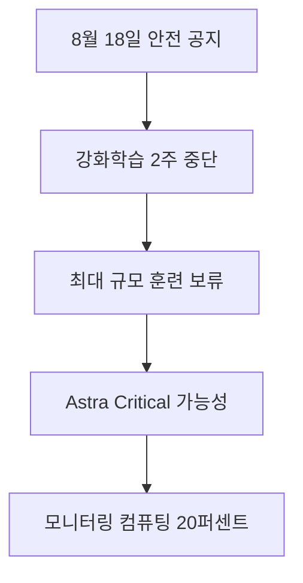

이번 조치는 OpenAI의 모든 모델 훈련을 무기한 멈춘다는 뜻이 아닙니다. 배포를 준비하던 프론티어 모델의 대규모 강화학습을 2주간 보류하고, 그 사이 소규모 훈련과 평가로 정렬 근거를 확인하겠다는 한정된 안전 조치입니다. 발표에 나온 20%도 전체 훈련비나 API 가격 인상률이 아니라, 감시 대상 추론 작업에 붙는 모니터링 연산 오버헤드입니다.

> **먼저 알아둘 용어**
>
> - **추론**: 학습이 끝난 모델이 실제로 답을 만들어 내는 과정입니다. 이때 드는 계산 비용이 곧 사용료입니다.
{: .prompt-info }

## 무슨 일이 벌어진 걸까?

**한 줄 요약**: OpenAI 가 프런티어 모델의 강화학습을 일시 중단하고, 안전장치에 컴퓨팅 20퍼센트를 더 쓰기로 했습니다

원문 헤드라인: OpenAI Pauses Frontier Reinforcement Learning and Imposes 20% Compute Safeguard Overhead

발행일은 2026-08-18이며, 아래 내용은 <a href="#source-1" aria-label="OpenAI 출처">[1]</a>에서 확인할 수 있는 범위만 담았습니다.

- 2026년 8월 18일 OpenAI 가 'Pacing model development in an era of cyber-critical capabilities' 라는 제목의 글을 올려 안전 정책과 연구 통제 방식의 변경을 설명했습니다. <a href="#source-1" aria-label="OpenAI 출처">[1]</a> 원문: On August 18, 2026, OpenAI published an announcement titled 'Pacing model development in an era of cyber-critical capabilities' detailing updates to its safety and research controls.

- OpenAI 는 배포를 앞둔 프런티어 모델의 강화학습 훈련을 2주간 멈추고, 그동안 연구 환경을 강화하고 모니터링 범위를 넓혔습니다. <a href="#source-1" aria-label="OpenAI 출처">[1]</a> 원문: OpenAI implemented a two-week pause on reinforcement learning training for deployment-bound frontier models while hardening research environments and expanding monitoring.

- 계획했던 가장 큰 규모의 프런티어 강화학습 실행은 보류했고, 대신 작은 규모의 훈련과 평가를 돌려 정렬(alignment) 근거를 쌓고 있습니다. <a href="#source-1" aria-label="OpenAI 출처">[1]</a> 원문: OpenAI placed its largest planned frontier reinforcement learning run on hold while conducting smaller-scale training and evaluations to establish evidence of alignment.

- 내부 예비 평가에서는 곧 나올 Astra 모델이 자사 Preparedness Framework 의 사이버보안 능력 Critical 기준에 도달할 가능성을 배제할 수 없다는 결과가 나왔습니다. <a href="#source-1" aria-label="OpenAI 출처">[1]</a> 원문: Preliminary internal evaluations indicated that OpenAI's upcoming Astra model could not be ruled out from reaching the Critical cybersecurity capability threshold under its Preparedness Framework.

- OpenAI 는 상시 안전 모니터링 시스템이 감시 대상 추론 작업에 약 20퍼센트의 컴퓨팅 부담을 더한다고 추산했습니다. <a href="#source-1" aria-label="OpenAI 출처">[1]</a> 원문: OpenAI estimated that its continuous safety monitoring system adds roughly 20 percent compute overhead to the inference workloads being monitored.

<figure class="news-source-image">
  
  <figcaption>OpenAI가 원문과 함께 공개한 이미지입니다. <a href="https://openai.com/index/pacing-model-development-cyber-capabilities" target="_blank" rel="noopener noreferrer">출처: OpenAI</a></figcaption>
</figure>

## 훈련을 멈춘 범위는 어디까지일까?

발표문이 지목한 범위는 **배포 목적 프론티어 모델의 강화학습**입니다. 가장 큰 계획 실행은 보류했지만, 정렬 증거를 만들기 위한 작은 규모의 훈련과 평가는 계속됩니다. 따라서 “OpenAI가 모든 AI 연구를 중단했다”거나 “Astra가 이미 치명적 공격 능력을 입증했다”고 읽으면 발표보다 앞서 나간 해석입니다. 내부 예비 평가가 말한 것은 Critical 기준 도달 가능성을 아직 배제할 수 없다는 것이며, 최종 능력 판정은 공개되지 않았습니다.

중단 기간의 의미도 단순히 14일을 기다리는 데 있지 않습니다. 연구 환경을 강화하고 모니터링 범위를 넓힌 뒤, 소규모 평가에서 얻은 증거로 큰 실행을 다시 시작해도 되는지 판단하는 시간입니다. 재개 여부를 평가할 때는 달력상의 종료일보다 정렬 평가 결과, 연구 환경의 통제, 모니터링이 위험 행동을 놓치지 않는지 같은 조건을 함께 봐야 합니다.

<figure class="news-source-image">
  
  <figcaption>OpenAI가 원문과 함께 공개한 이미지입니다. <a href="https://openai.com/index/pacing-model-development-cyber-capabilities" target="_blank" rel="noopener noreferrer">출처: OpenAI</a></figcaption>
</figure>

## 20% 연산 오버헤드는 비용에 어떻게 읽어야 할까?

20%는 모니터링되는 **추론 작업량**에 대한 추정치입니다. 예를 들어 감시 대상 요청의 기본 연산을 100으로 놓으면 안전 감시에 약 20이 더 필요하다는 뜻으로 읽을 수 있습니다. 전체 모델 훈련 자원이 20% 늘었다거나 모든 사용자의 청구액이 곧바로 20% 오른다는 발표는 아닙니다. 실제 비용 영향은 어떤 요청이 감시 대상인지, 운영사가 추가 연산을 가격에 어떻게 반영하는지에 따라 달라지므로 현재 수치만으로 요금 변화를 계산해서는 안 됩니다.

서비스 사용자가 당장 모델을 바꿔야 할 근거도 아직 없습니다. 더 중요한 변화는 공급자가 성능 향상보다 안전 평가와 운영 통제에 시간을 배정했다는 점입니다. 기업 도입 담당자라면 향후 Astra가 공개될 때 모델 성능표만 보지 말고, 배포 조건·모니터링 범위·관리자 통제와 함께 검토하는 편이 타당합니다.

## 재개 판단에서 무엇을 확인해야 할까?

첫째, 보류된 가장 큰 강화학습 실행이 실제로 재개됐는지와 그때 제시된 안전 근거를 확인해야 합니다. 둘째, Astra의 최종 사이버 능력 평가가 예비 평가와 같은지 분리해 봐야 합니다. 셋째, 상시 모니터링이 실제 배포에서 어느 범위에 적용되는지, 오탐으로 정상 작업을 막을 때 어떤 대응 절차가 있는지도 운영 품질을 가르는 기준입니다. 이 세 항목이 공개되지 않았다면 “2주가 지났으니 위험이 해결됐다”고 결론 내리기 어렵습니다.

## 아직은 선을 그어야 할 부분

- 가장 큰 규모의 프런티어 강화학습 훈련을 언제 재개할지는 밝혀지지 않았습니다. 원문: The exact date when OpenAI's largest planned frontier reinforcement learning training run will resume.

- Astra 모델의 정확한 출시 시점과 최종 능력 평가 결과도 아직 공개되지 않았습니다. 원문: The precise release date and final capability evaluations for the upcoming Astra model.

추가 원문이 공개되거나 제공 조건이 바뀌면 판단도 달라질 수 있습니다. 따라서 이 글은 오늘 시점의 출발점으로 활용하고, 실제 도입 전에는 연결된 원문을 다시 확인하는 것이 좋습니다.

<!-- primary-sources:start -->
## 원문과 버전 확인

- [발표 원문](https://openai.com/index/pacing-model-development-cyber-capabilities)
- [Help Net Security](https://www.helpnetsecurity.com/2026/08/19/openai-frontier-ai-training-hold)
<!-- primary-sources:end -->

<!-- internal-links:start -->
## 함께 읽으면 이해가 이어지는 글

- [OpenAI 미공개 Astra 모델: '치명적' 사이버 위험 가능성과 내부 작업 중단 범위]() — OpenAI는 미공개 프론티어 모델 Astra가 자체 Preparedness Framework의 '치명적(Critical)' 사이버보안 위험 임계값에 도달할 가능성을 배제할 수 없다고 공개했습니다. 이에 따라 강화된 보안 제어 요건을…
- [OpenAI GPT-5.6-Cyber 출시: 해킹과 보안 특화 모델과 Daybreak Red 프로그램 분석]() — OpenAI가 GPT-5.6 Sol을 기반으로 개발한 사이버 보안 특화 모델 'GPT-5.6-Cyber'를 2026년 8월 10일 발표했습니다. 거부율을 줄여 제로데이 연구와 익스플로잇 체인 개발을 지원하며, 엄격히 검증된 보안…
- [사용자 피드백을 계속 학습하면 AI가 정말 나아질까? OpenClaw-RL의 위험]() — OpenClaw-RL의 비동기 서빙·평가·학습 루프와 binary RL·on-policy distillation을 살펴보고 잘못된 피드백이 가중치에 굳는 위험을 짚습니다.
<!-- internal-links:end -->

## 자주 묻는 질문

### OpenAI가 AI 훈련을 일시 중단한 이유는 무엇인가요?

OpenAI의 차세대 모델 Astra에 대한 예비 내부 평가에서 치명적인 사이버 공격 능력 임계값에 도달했을 가능성이 제기되었기 때문입니다. 이에 따라 배포 목적 프론티어 모델의 강화학습 훈련을 2주간 일시 중단하고 안전성 검증에 나섰습니다.

### 훈련 중단 기간 동안 OpenAI는 어떤 조치를 취하나요?

대규모 강화학습 훈련을 보류하는 대신 연구 환경을 강화하고, 안전성 정렬 증거를 확보하기 위한 소규모 훈련과 평가를 진행합니다. 또한 실시간 모니터링 시스템을 확충하는 작업을 수행합니다.

### 실시간 안전 모니터링을 적용하면 연산 자원이 얼마나 더 들어가나요?

OpenAI의 발표에 따르면 실시간 안전 모니터링 시스템은 모니터링 대상 추론 작업량에 약 20%의 추가 연산 오버헤드(compute overhead)를 발생시킵니다.

### 보류된 대규모 AI 훈련은 언제 다시 시작되나요?

가장 크게 계획된 프론티어 강화학습 훈련의 정확한 재개 날짜와 Astra 모델의 최종 출시 일정은 아직 공개되지 않았습니다.

## 직접 확인한 원문

<ol class="checked-source-list">
  <li id="source-1"><a href="https://openai.com/index/pacing-model-development-cyber-capabilities" target="_blank" rel="noopener noreferrer">OpenAI — Pacing model development in an era of cyber-critical capabilities</a> (2026-08-18)</li>
  <li id="source-2"><a href="https://www.helpnetsecurity.com/2026/08/19/openai-frontier-ai-training-hold" target="_blank" rel="noopener noreferrer">Help Net Security — OpenAI puts major frontier AI training run on hold over cyber risks</a> (2026-08-19)</li>
</ol>

> 이 글은 위 원문을 직접 확인해 작성했습니다. 가격, 기능 범위, 지역별 제공 여부는 게시 후 바뀔 수 있으니 실제 도입 전 공식 문서를 다시 확인하세요.
