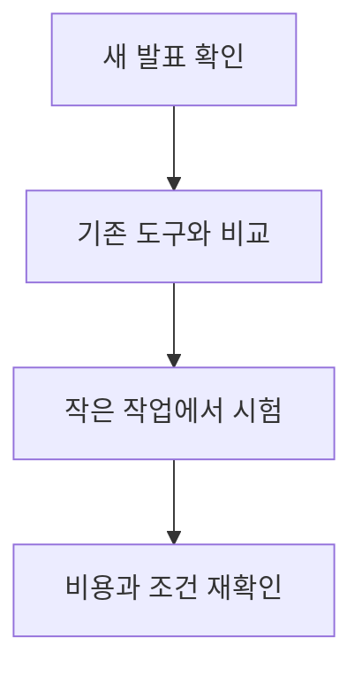
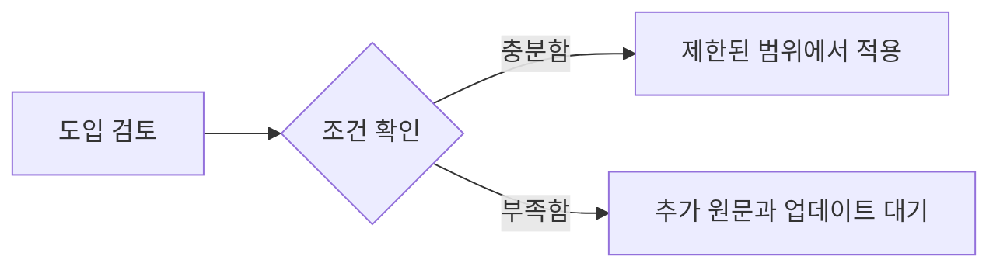

OpenAI Frontier Model Safety Pause 관련 새 소식을 오늘 확인 가능한 직접 원문 범위에서 정리했습니다. 자동 검증 기준을 모두 충족하지 못한 날에도 발행을 건너뛰지 않기 위한 간결한 브리핑이며, 확인되지 않은 내용은 단정하지 않습니다.

## 무슨 일이 벌어진 걸까?

OpenAI Pauses Frontier Reinforcement Learning and Imposes 20% Compute Safeguard Overhead 소식이 포착됐습니다. 발행일은 2026-08-18이며, 아래 내용은 <a href="#source-1" aria-label="OpenAI 출처">[1]</a>에서 확인할 수 있는 범위만 담았습니다.

- On August 18, 2026, OpenAI published an announcement titled 'Pacing model development in an era of cyber-critical capabilities' detailing updates to its safety and research controls. <a href="#source-1" aria-label="OpenAI 출처">[1]</a>

- OpenAI implemented a two-week pause on reinforcement learning training for deployment-bound frontier models while hardening research environments and expanding monitoring. <a href="#source-1" aria-label="OpenAI 출처">[1]</a>

- OpenAI placed its largest planned frontier reinforcement learning run on hold while conducting smaller-scale training and evaluations to establish evidence of alignment. <a href="#source-1" aria-label="OpenAI 출처">[1]</a>

- Preliminary internal evaluations indicated that OpenAI's upcoming Astra model could not be ruled out from reaching the Critical cybersecurity capability threshold under its Preparedness Framework. <a href="#source-1" aria-label="OpenAI 출처">[1]</a>

- OpenAI estimated that its continuous safety monitoring system adds roughly 20 percent compute overhead to the inference workloads being monitored. <a href="#source-1" aria-label="OpenAI 출처">[1]</a>

<figure class="news-source-image">
  
  <figcaption>OpenAI가 원문과 함께 공개한 이미지입니다. <a href="https://openai.com/index/pacing-model-development-cyber-capabilities" target="_blank" rel="noopener noreferrer">출처: OpenAI</a></figcaption>
</figure>

## 왜 지금 다들 이 이야기를 할까?

이 소식의 핵심은 새 기능이나 발표의 이름보다 실제 사용자와 개발자의 선택이 달라지는지에 있습니다. 지금 단계에서는 원문이 밝힌 내용과 아직 공개하지 않은 내용을 분리해서 보는 것이 안전합니다.

<figure class="news-source-image">
  
  <figcaption>OpenAI가 원문과 함께 공개한 이미지입니다. <a href="https://openai.com/index/pacing-model-development-cyber-capabilities" target="_blank" rel="noopener noreferrer">출처: OpenAI</a></figcaption>
</figure>

## 그래서 우리에게 뭐가 달라질까?

도입을 검토한다면 현재 쓰는 도구와 바로 교체하기보다 작은 작업에서 먼저 비교해 보는 편이 좋습니다. 제공 지역, 요금, 데이터 처리 방식처럼 의사결정에 영향을 주는 조건은 실제 사용 전에 원문에서 다시 확인해야 합니다.

## 직접 써보거나 지켜볼 포인트

첫째, 공식 제공 범위와 사용 조건을 확인합니다. 둘째, 기존 작업 흐름에서 시간을 줄여주는지 작은 예제로 비교합니다. 셋째, 발표 내용과 실제 일반 제공 상태가 같은지 구분합니다.

## 아직은 선을 그어야 할 부분

- The exact date when OpenAI's largest planned frontier reinforcement learning training run will resume.

- The precise release date and final capability evaluations for the upcoming Astra model.

추가 원문이 공개되거나 제공 조건이 바뀌면 판단도 달라질 수 있습니다. 따라서 이 글은 오늘 시점의 출발점으로 활용하고, 실제 도입 전에는 연결된 원문을 다시 확인하는 것이 좋습니다.

## 자주 묻는 질문

### OpenAI가 AI 훈련을 일시 중단한 이유는 무엇인가요?

OpenAI의 차세대 모델 Astra에 대한 예비 내부 평가에서 치명적인 사이버 공격 능력 임계값에 도달했을 가능성이 제기되었기 때문입니다. 이에 따라 배포 목적 프론티어 모델의 강화학습 훈련을 2주간 일시 중단하고 안전성 검증에 나섰습니다.

### 훈련 중단 기간 동안 OpenAI는 어떤 조치를 취하나요?

대규모 강화학습 훈련을 보류하는 대신 연구 환경을 강화하고, 안전성 정렬 증거를 확보하기 위한 소규모 훈련과 평가를 진행합니다. 또한 실시간 모니터링 시스템을 확충하는 작업을 수행합니다.

### 실시간 안전 모니터링을 적용하면 연산 자원이 얼마나 더 들어가나요?

OpenAI의 발표에 따르면 실시간 안전 모니터링 시스템은 모니터링 대상 추론 작업량에 약 20%의 추가 연산 오버헤드(compute overhead)를 발생시킵니다.

### 보류된 대규모 AI 훈련은 언제 다시 시작되나요?

가장 크게 계획된 프론티어 강화학습 훈련의 정확한 재개 날짜와 Astra 모델의 최종 출시 일정은 아직 공개되지 않았습니다.

## 직접 확인한 원문

<ol class="checked-source-list">
  <li id="source-1"><a href="https://openai.com/index/pacing-model-development-cyber-capabilities" target="_blank" rel="noopener noreferrer">OpenAI — Pacing model development in an era of cyber-critical capabilities</a> (2026-08-18)</li>
  <li id="source-2"><a href="https://www.helpnetsecurity.com/2026/08/19/openai-frontier-ai-training-hold" target="_blank" rel="noopener noreferrer">Help Net Security — OpenAI puts major frontier AI training run on hold over cyber risks</a> (2026-08-19)</li>
</ol>

> 이 글은 위 원문을 직접 확인해 작성했습니다. 가격, 기능 범위, 지역별 제공 여부는 게시 후 바뀔 수 있으니 실제 도입 전 공식 문서를 다시 확인하세요.
