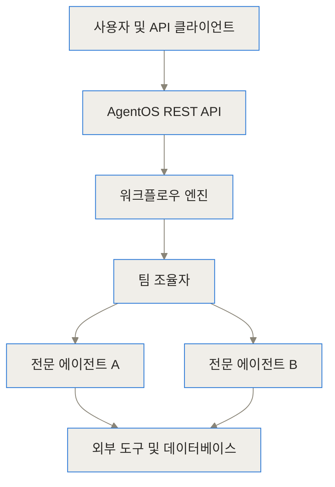
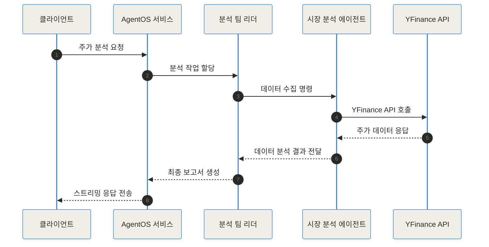

- [Agno GitHub 저장소](https://github.com/agno-agi/agno)
- [Agno 공식 문서](https://docs.agno.com)
- [Agno 공식 웹사이트](https://www.agno.com)

## 도입 및 한 줄 요약

최근 생성형 AI 분야에서 단일 거대언어모델(LLM)에 모든 과업을 맡기기보다, 특화된 역할을 가진 여러 에이전트가 협력하는 멀티 에이전트 시스템(Multi-Agent System)의 필요성이 급격히 커지고 있습니다. 하지만 기존 에이전트 프레임워크들을 활용해 프롬프팅 단계를 넘어 실제 서비스 환경(Production)으로 확장하려고 하면 곧바로 거대한 장벽에 부딪히곤 해요. 복잡한 전용 그래프 엔진이나 체인 구조 때문에 디버깅이 어렵고, 프레임워크 자체가 유발하는 메모리 점유율과 속도 저하가 무시할 수 없는 수준에 이르기 때문이죠.

Agno(구 Phidata)는 이러한 기존 프레임워크들의 복잡성과 오버헤드를 해결하기 위해 등장한 프레임워크입니다. 이 글에서는 Agno가 어떻게 순수 파이썬(Pure Python) 접근법을 통해 뛰어난 성능과 직관적인 개발 경험을 제공하는지, 그리고 에이전트 배포를 위한 AgentOS가 엔터프라이즈 환경에서 어떤 가치를 제공하는지 깊이 있게 알아보겠습니다.

> **TL;DR (한 줄 요약)**
> Agno는 복잡한 그래프 추상화 없이 순수 파이썬 흐름 제어로 구현하는 고성능 멀티 에이전트 프레임워크로, 내장된 AgentOS를 통해 에이전트 시스템을 단 몇 줄의 코드로 프로덕션 수준의 REST API 서비스로 전환해 줍니다.

---

## Agno란 무엇인가

Agno는 그리스어 '아그노스(ἁγνός, 순수한)'에서 이름을 딴 오픈소스 멀티 에이전트 프레임워크예요. 이름에서 알 수 있듯이 이 프로젝트의 최우선 가치는 **순수함(Pure)**과 **간결함(Simplicity)**에 있습니다. 과거 Phidata라는 이름으로 널리 알려졌으나, 멀티 에이전트 오케스트레이션과 프로덕션 런타임 플랫폼으로의 진화를 도모하며 Agno라는 새로운 브랜드로 재탄생했어요.

기존 프레임워크들이 에이전트의 상태나 워크플로우를 표현하기 위해 자체적인 DAG(Directed Acyclic Graph) 엔진이나 특수한 추상화 계층을 새로 정의했다면, Agno는 파이썬 언어가 본래 제공하는 기본 문법(조건문 `if/else`, 반복문 `while/for`, 예외 처리 `try/except`)을 그대로 활용합니다. 복잡한 제어 그래프를 배우지 않고도 파이썬 개발자라면 누구나 즉시 멀티 에이전트 로직을 작성할 수 있도록 돕는 것이죠.

이해를 돕기 위해 일상적인 비유를 들어볼까요? 기존의 그래프 기반 에이전트 프레임워크가 무대 위의 배우들에게 센티미터 단위로 정해진 레일 위만 움직이도록 강요하는 거대한 태엽 장치와 같다면, Agno는 분야별 전문가(금융 분석가, 웹 리서처, 작가)로 구성된 유연한 오케스트라와 같아요. 연주자들은 자신만의 전문 도구와 기억력을 가지고 있으며, 지휘자나 다른 동료와 파이썬이라는 매우 자연스러운 공용 언어로 소통하며 연주를 완성해 나갑니다.

---

## 왜 Agno가 등장했는가: 기존 프레임워크의 한계와 문제 정의

많은 개발팀이 초기에 멋진 AI 에이전트 데모를 성공적으로 만들어냅니다. 하지만 이를 실제 고객이 사용하는 프로덕션 환경으로 가져갈 때 다음과 같은 구체적인 어려움에 직면하게 되더라고요.

첫째, **과도한 추상화로 인한 디버깅 및 제어의 어려움**입니다. 에이전트 내부에서 의도치 않은 환각이나 무한 루프가 발생했을 때, 프레임워크 내부의 거대한 상태 그래프 레이어에 가려져 정확히 어느 단계에서 데이터가 오염되었는지 추적하기가 매우 어렵습니다.

둘째, **성능 오버헤드와 메모리 비효율성**입니다. 에이전트 하나를 인스턴스화하는 데 수백 밀리초가 걸리거나 메가바이트 단위의 불필요한 객체들이 메모리를 차지한다면, 동시 요청이 몰리는 엔터프라이즈 서버 환경에서는 심각한 병목 현상이 발생해요.

셋째, **데모 코드와 상용 API 배포 사이의 거대한 격차**입니다. 에이전트 로직을 아무리 잘 작성했더라도, 이를 웹 애플리케이션과 연결하려면 REST API 엔드포인트 개설, 세션 상태 지속성 유지, JWT 기반 권한 관리, OpenTelemetry 기반 분산 트레이싱 구축 등 수개월의 인프라 작업이 별도로 필요합니다.

Agno는 개발 레이어의 **Agno Python Framework**와 런타임 레이어의 **AgentOS**라는 이원화 구조를 통해 이 문제들을 직관적으로 해결해요.

```chartjs
{"type":"bar","data":{"labels":["LangGraph","CrewAI","AutoGen","Agno"],"datasets":[{"label":"초당 에이전트 생성 수 (인스턴스/초)","data":[10,100,250,50000]},{"label":"초기 메모리 점유량 (MB)","data":[250,180,120,5]}]},"options":{"responsive":true,"plugins":{"title":{"display":true,"text":"주요 에이전트 프레임워크 성능 및 메모리 비교"}}}}
```

---

## Agno의 내부 작동 원리와 핵심 구성 요소

Agno의 전체 시스템은 크게 4가지 핵심 구성 요소로 이뤄져 있습니다. 각각의 아키텍처 역할과 상호작용 방식을 하나씩 살펴볼게요.

### 1. Agent (단일 에이전트)
에이전트는 독립적인 과업을 수행하는 최소 단위입니다. LLM 모델(OpenAI, Anthropic, Gemini, Ollama 등)에 기억(Memory), 지식(Knowledge), 도구(Tools), 추론(Reasoning), 가드레일(Guardrails)을 결합하여 생성됩니다.

### 2. Team (에이전트 협력체)
여러 전문 에이전트들을 하나로 묶어 복잡한 과업을 분업화하는 구조입니다. 리더 에이전트가 하위 에이전트에 작업을 위임하고 결과를 합성할 수 있어요.

### 3. Workflow (결정론적 자동화 파이프라인)
에이전트, 팀, 일반 파이썬 함수를 순차적 혹은 조건부로 연결하는 실행 파이프라인입니다. 스텝별 결과 전달과 에러 처리가 순수 파이썬 코드로 이뤄집니다.

### 4. AgentOS (프로덕션 런타임)
FastAPI 기반의 스테이트리스(Stateless) API 서버로, 에이전트 시스템을 50개 이상의 REST API 엔드포인트와 Server-Sent Events(SSE) 스트리밍 기능으로 노출해 줍니다.



### 요청 처리 및 시퀀스 흐름

클라이언트가 Agno 시스템에 질의를 보낼 때 내부에서 이루어지는 상호작용 흐름은 아래와 같습니다.



### AgentOS 세션 데이터베이스 스키마

AgentOS는 스테이트리스 환경에서도 지속성을 유지하기 위해 데이터베이스에 세션, 메모리, 트레이스 정보를 영구 저장합니다.

```mermaid
erDiagram
    AGENT_ENTITY ||--o{ AGENT_SESSION : 