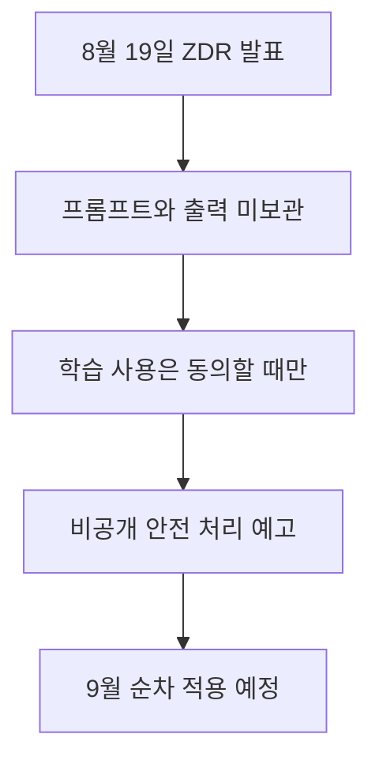

이번 발표의 직접적인 의미는 **조건을 충족하는 프론티어 API 배포에서** 처리 후 프롬프트와 출력을 보관하지 않는 ZDR 옵션을 제공한다는 것입니다. 모든 OpenAI 제품과 계정에 자동 적용된다는 뜻은 아니며, Private Safety Processing도 아직 일반 제공이 아니라 미리보기 단계입니다. 기업은 “저장하지 않음”, “학습에 쓰지 않음”, “직원이 내용을 보지 않고 안전 신호를 처리함”을 서로 다른 통제로 나눠 확인해야 합니다.

> **먼저 알아둘 용어**
>
> - **API**: 다른 프로그램에서 이 기능을 불러다 쓸 수 있게 열어 둔 창구입니다.
> - **프롬프트**: AI에게 건네는 지시문입니다. 같은 모델도 지시문에 따라 결과가 크게 달라집니다.
{: .prompt-info }

## 무슨 일이 벌어진 걸까?

**한 줄 요약**: OpenAI 가 프런티어 API 모델에 데이터 무보존 옵션을 도입하고, 비공개 안전 처리 기능을 미리 공개했습니다

원문 헤드라인: OpenAI Introduces Zero Data Retention for Frontier API Models and Previews Private Safety Processing

발행일은 2026-08-19이며, 아래 내용은 <a href="#source-1" aria-label="OpenAI 출처">[1]</a>에서 확인할 수 있는 범위만 담았습니다.

- 2026년 8월 19일 OpenAI 가 조건을 충족하는 프런티어 모델 API 배포에 데이터 무보존(Zero Data Retention, ZDR) 옵션을 발표했습니다. <a href="#source-1" aria-label="OpenAI 출처">[1]</a> 원문: On August 19, 2026, OpenAI announced Zero Data Retention (ZDR) options for eligible API deployments on frontier models.

- ZDR 을 켜면 OpenAI 는 처리 후 고객의 프롬프트나 모델 출력을 보관하지 않으며, 고객이 따로 동의하지 않는 한 기업 데이터를 모델 학습에 쓰지 않습니다. <a href="#source-1" aria-label="OpenAI 출처">[1]</a> 원문: Under Zero Data Retention, OpenAI does not retain customer prompts or model outputs after processing, nor does it use enterprise data for model training unless customers opt in.

- 함께 미리 공개된 Private Safety Processing 은 프롬프트와 응답 내용을 OpenAI 직원에게 보여주지 않은 채, 서로 연관된 사용 기록에서 오남용 패턴을 찾아내는 기능입니다. <a href="#source-1" aria-label="OpenAI 출처">[1]</a> 원문: OpenAI previewed Private Safety Processing to identify misuse patterns across related interactions without revealing prompt or response content to OpenAI staff.

- 이 기능을 쓰면 데이터를 고객이 통제하는 인프라에 두거나, OpenAI 인프라에 두더라도 고객이 관리하는 암호화 키로 보호할 수 있습니다. <a href="#source-1" aria-label="OpenAI 출처">[1]</a> 원문: Private Safety Processing enables data to remain on customer-controlled infrastructure or on OpenAI infrastructure using customer-managed encryption keys.

- OpenAI 는 기술 백서를 공개하고 2026년 9월부터 Private Safety Processing 을 순차 적용할 계획입니다. <a href="#source-1" aria-label="OpenAI 출처">[1]</a> 원문: OpenAI plans to publish a technical white paper and begin rolling out Private Safety Processing in September 2026.

<figure class="news-source-image">
  
  <figcaption>OpenAI가 원문과 함께 공개한 이미지입니다. <a href="https://openai.com/index/offering-zero-data-retention-for-frontier-models" target="_blank" rel="noopener noreferrer">출처: OpenAI</a></figcaption>
</figure>

## ZDR을 켜면 어떤 데이터 경로가 달라질까?

ZDR의 범위는 OpenAI가 API 요청을 처리한 뒤 고객 프롬프트와 모델 출력을 보관하는 단계입니다. 고객이 별도로 동의하지 않으면 기업 데이터를 모델 학습에 쓰지 않는다는 조건도 함께 발표됐지만, 두 문장은 같은 통제가 아닙니다. 학습 미사용 정책이 있어도 운영 로그가 남을 수 있고, 반대로 처리 후 본문을 보관하지 않아도 고객이 명시적으로 학습 사용에 동의하는 별도 흐름이 있을 수 있기 때문입니다.

도입 전에는 해당 계정과 모델 배포가 “eligible” 범위인지부터 계약과 설정 화면에서 확인해야 합니다. 애플리케이션 자체 로그, 고객이 운영하는 데이터베이스, 중간 프록시나 관측 도구에 복사된 내용은 OpenAI의 ZDR만으로 사라지지 않습니다. 예를 들어 고객상담 앱이 요청 전문을 오류 로그에 남긴다면 API 제공자의 보존 정책과 무관하게 사내 저장소에 민감정보가 남습니다. 따라서 데이터 흐름도를 그려 각 저장 지점의 보존 기간과 삭제 책임자를 따로 지정해야 ZDR의 효과가 실제 운영까지 이어집니다.

<figure class="news-source-image">
  
  <figcaption>OpenAI가 원문과 함께 공개한 이미지입니다. <a href="https://openai.com/index/offering-zero-data-retention-for-frontier-models" target="_blank" rel="noopener noreferrer">출처: OpenAI</a></figcaption>
</figure>

## Private Safety Processing은 ZDR과 무엇이 다를까?

Private Safety Processing은 콘텐츠를 장기간 보관하는 옵션이 아니라, 프롬프트나 응답 본문을 직원에게 보여주지 않으면서 관련 상호작용의 오남용 패턴을 식별하려는 안전 처리 방식입니다. 발표된 설계에서는 데이터를 고객 통제 인프라에 두거나 고객 관리 암호화 키로 보호할 수 있습니다. 즉 ZDR이 **처리 후 보존** 문제를 다룬다면 이 기능은 **안전 감시 과정에서 누가 내용을 볼 수 있고 키를 통제하는가**에 초점이 있습니다.

다만 미리보기와 정식 제공은 구분해야 합니다. 2026년 9월부터 순차 적용할 계획과 기술 백서 공개 계획은 밝혀졌지만, 모든 고객이 쓸 수 있는 날짜와 지원 모델, 지역, 계약 조건은 공개되지 않았습니다. 보안 검토 문서에는 “향후 제공 예정”으로 표기하고, 실제 일반 제공 여부와 기술 백서의 위협 모델을 확인한 뒤 통제로 인정하는 편이 안전합니다.

<figure class="news-source-image">
  
  <figcaption>Help Net Security가 원문과 함께 공개한 이미지입니다. <a href="https://www.helpnetsecurity.com/2026/08/20/openai-private-safety-processing-zdr" target="_blank" rel="noopener noreferrer">출처: Help Net Security</a></figcaption>
</figure>

## 기업 도입 전에 무엇을 문서로 남겨야 할까?

먼저 대상 API 배포가 ZDR 적용 대상이라는 증거와 실제 활성화 상태를 남깁니다. 다음으로 프롬프트, 출력, 오류 로그, 메타데이터를 각각 누가 얼마나 보관하는지 표로 정리합니다. 마지막으로 고객 관리 키를 쓸 경우 키 회전과 폐기 권한, 안전 경보가 발생했을 때 본문을 공개하지 않고 조사하는 절차를 확인합니다. 이 세 단계 중 하나라도 불명확하면 “데이터가 전혀 남지 않는다”는 문구보다 실제 계약과 시스템 로그를 기준으로 판단해야 합니다.

## 아직은 선을 그어야 할 부분

- 초기 프리뷰 이후 Private Safety Processing 이 언제 정식 제공되는지는 아직 공개되지 않았습니다. 원문: The exact general availability schedule for Private Safety Processing following the initial preview period.

추가 원문이 공개되거나 제공 조건이 바뀌면 판단도 달라질 수 있습니다. 따라서 이 글은 오늘 시점의 출발점으로 활용하고, 실제 도입 전에는 연결된 원문을 다시 확인하는 것이 좋습니다.

<!-- primary-sources:start -->
## 원문과 버전 확인

- [발표 원문](https://openai.com/index/offering-zero-data-retention-for-frontier-models)
- [Axios](https://www.axios.com/2026/08/19/openai-previews-zero-retention-safety-system-as-anthropic-requires-data-logs)
- [Help Net Security](https://www.helpnetsecurity.com/2026/08/20/openai-private-safety-processing-zdr)
- [BetaNews](https://betanews.com/article/openai-private-safety-processing)
<!-- primary-sources:end -->

<!-- internal-links:start -->
## 함께 읽으면 이해가 이어지는 글

- [로컬 LLM은 클라우드보다 쌀까: VRAM, 전력, 운영비 계산]() — 로컬 LLM의 양자화, 메모리 대역폭, KV 캐시를 이해하고, 하드웨어 구매 전에 품질, 동시성, 전력, 운영비를 비교하는 방법을 정리합니다.
- [OpenAI, GPT-5.6 API 가격 최대 80% 인하… 개발자 및 기업 비용 부담 대폭 감소]() — 2026년 7월 30일 OpenAI가 GPT-5.6 API 가격 인하를 공식 발표했습니다. 경량 모델인 GPT-5.6 Luna 가격은 80% 하락해 100만 입력 토큰당 0.20달러로 내려갔고, 중급 모델인 GPT-5.6 Terra는…
- [GPT-5.6 Sol Ultrafast 프리뷰: 초당 750토큰과 실제 지연 시간 판단법]() — OpenAI와 Cerebras가 Cerebras 웨이퍼 스케일 엔진 기반으로 표준 대비 최대 14배 빠른 GPT-5.6 Sol Ultrafast mode API를 공개했습니다. 초당 최대 750토큰을 생성하여 실시간 음성 에이전트…
<!-- internal-links:end -->

## 자주 묻는 질문

### OpenAI의 제로 데이터 보존(ZDR)을 적용하면 내 데이터가 AI 모델 학습에 사용되나요?

전혀 사용되지 않습니다. ZDR 환경에서는 처리 후 프롬프트와 출력을 전혀 보존하지 않으며, 고객이 직접 동의(Opt-in)하지 않는 한 해당 데이터를 모델 학습에 활용하지 않습니다 [OpenAI 공식 발표](https://openai.com/index/offering-zero-data-retention-for-frontier-models).

### Private Safety Processing 기술은 데이터를 어떻게 보호하나요?

프롬프트나 응답 본문을 OpenAI 직원에게 공개하지 않으면서 오남용 패턴을 감시합니다. 데이터는 고객 제어 인프라에 남아있거나 고객 관리 암호화 키를 사용해 처리됩니다 [Help Net Security](https://www.helpnetsecurity.com/2026/08/20/openai-private-safety-processing-zdr).

### Private Safety Processing의 정식 출시일은 언제인가요?

OpenAI는 2026년 9월 기술 백서 공개와 함께 순차적 적용(Rollout)을 시작한다고 밝혔습니다. 다만 초기 프리뷰 기간 이후의 전체 일반 제공(GA) 정확한 일정은 아직 발표되지 않았습니다 [Help Net Security](https://www.helpnetsecurity.com/2026/08/20/openai-private-safety-processing-zdr).

## 직접 확인한 원문

<ol class="checked-source-list">
  <li id="source-1"><a href="https://openai.com/index/offering-zero-data-retention-for-frontier-models" target="_blank" rel="noopener noreferrer">OpenAI — Offering Zero Data Retention for frontier models</a> (2026-08-19)</li>
  <li id="source-2"><a href="https://www.axios.com/2026/08/19/openai-previews-zero-retention-safety-system-as-anthropic-requires-data-logs" target="_blank" rel="noopener noreferrer">Axios — OpenAI previews zero-retention safety system as Anthropic requires data logs</a> (2026-08-19)</li>
  <li id="source-3"><a href="https://www.helpnetsecurity.com/2026/08/20/openai-private-safety-processing-zdr" target="_blank" rel="noopener noreferrer">Help Net Security — OpenAI previews privacy-focused system for detecting AI misuse</a> (2026-08-20)</li>
  <li id="source-4"><a href="https://betanews.com/article/openai-private-safety-processing" target="_blank" rel="noopener noreferrer">BetaNews — OpenAI unveils privacy tool to counter Anthropic&#x27;s ZDR gap</a> (2026-08-20)</li>
</ol>

> 이 글은 위 원문을 직접 확인해 작성했습니다. 가격, 기능 범위, 지역별 제공 여부는 게시 후 바뀔 수 있으니 실제 도입 전 공식 문서를 다시 확인하세요.
